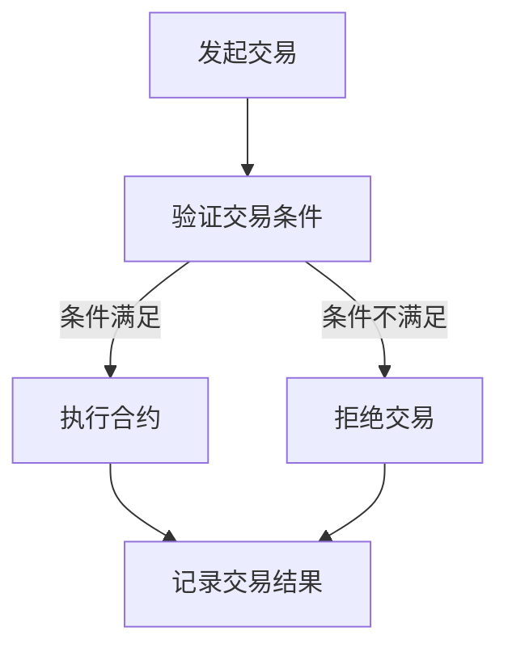
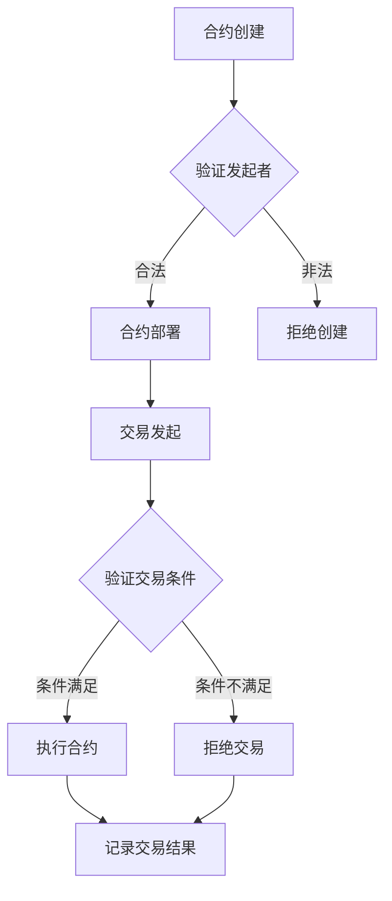

                 

### 背景介绍

区块链技术作为一种分布式账本技术，近年来在金融、物流、医疗等多个领域得到了广泛关注和应用。然而，区块链技术的普及和应用过程中面临着诸多挑战，其中最为突出的是智能合约的开发和部署问题。

智能合约是区块链技术中的一项核心创新，它是一种自动执行合同条款的程序，能够确保交易的执行和记录的安全性与透明性。传统的合约依赖于中介机构的介入，往往存在信息不对称、信任问题以及操作成本高等问题。而智能合约通过区块链技术，实现了去中心化的自动执行，从而解决了这些传统合约中的痛点。

然而，智能合约的开发和部署并非易事。目前市面上的智能合约开发平台数量繁多，各自具有不同的特点和优缺点，使得开发者在选择和使用过程中面临很大的困扰。此外，智能合约的复杂性和安全性问题也使得开发者的开发过程充满挑战。

本文旨在探讨智能合约开发平台的现状和未来发展趋势，帮助读者更好地理解智能合约的开发过程，以及如何在众多智能合约开发平台中找到最适合自己的工具。我们将从以下几个方面展开讨论：

1. **智能合约开发平台的现状**：介绍目前市面上主流的智能合约开发平台，包括它们的架构特点、技术优势和应用领域。
2. **智能合约的核心概念与联系**：详细解释智能合约的基本原理，并给出一个Mermaid流程图，展示智能合约的工作流程。
3. **智能合约的核心算法原理与具体操作步骤**：分析智能合约的核心算法，并给出具体的操作步骤，帮助读者理解智能合约的实现过程。
4. **数学模型和公式**：介绍与智能合约相关的数学模型和公式，并给出详细的讲解和举例说明。
5. **项目实战**：通过实际案例展示智能合约的开发过程，并提供代码实际案例和详细解释说明。
6. **实际应用场景**：分析智能合约在各个领域的应用，探讨智能合约带来的变革和机遇。
7. **工具和资源推荐**：推荐学习资源、开发工具框架和相关论文著作，帮助读者深入了解智能合约开发领域。
8. **总结：未来发展趋势与挑战**：总结智能合约开发平台的现状和未来发展趋势，分析其中面临的挑战和机遇。

通过对上述内容的逐步分析，我们将帮助读者全面了解智能合约开发平台的现状和未来趋势，为在区块链应用开发中找到适合自己的智能合约开发平台提供指导。在接下来的内容中，我们将一一探讨这些问题，并为您提供详细的解答和实际案例。让我们开始这段智能合约开发的旅程吧！
### 关键概念：智能合约的核心概念与联系

智能合约是一种在区块链网络中执行的自动化协议，它的核心在于代码和预定的逻辑条件。智能合约的基本原理是通过编程语言定义一系列条件，当这些条件得到满足时，合约中预定的动作将自动执行。这种去中心化的执行方式不仅提高了交易的安全性和透明度，还降低了操作成本，避免了传统合约中中介机构的参与。

为了更好地理解智能合约的工作原理，我们可以借助Mermaid流程图来展示其核心工作流程。以下是一个简化的智能合约执行流程图：



在这个流程图中，我们首先看到的是交易发起（A），然后是交易条件的验证（B）。如果交易条件得到满足，系统将执行合约中的预定动作（C），并记录交易结果（E）。如果条件不满足，系统将拒绝交易（D），同样记录交易结果（E）。

#### 智能合约的核心概念

1. **条件逻辑**：智能合约的核心是逻辑条件，这些条件可以是简单的比较运算，也可以是复杂的业务逻辑。逻辑条件的设定保证了合约的自动化执行。

2. **自动化执行**：一旦交易条件得到满足，智能合约将自动执行预定的动作，无需人为干预。这种自动执行特性是智能合约与传统合约的根本区别。

3. **安全性**：智能合约运行在区块链上，所有交易记录都是透明的、不可篡改的。这使得智能合约具有较高的安全性和信任度。

4. **透明性**：所有智能合约的代码都是公开的，任何人都可以查看和审计。这使得智能合约具有较高的透明度，用户可以清晰地了解合约的运作方式。

5. **去中心化**：智能合约的执行不依赖于中心化的中介机构，而是通过区块链网络中的节点共同验证和执行。这种去中心化的特性提高了系统的容错性和抗攻击性。

#### Mermaid流程图

以下是一个更为详细的智能合约执行流程图，展示了智能合约从创建到执行的全过程：



在这个流程图中，智能合约的创建（A）需要经过验证发起者（B）的合法性。如果发起者合法，合约将被部署（C），然后才能接受交易发起（E）。每次交易发起后，系统将验证交易条件（F），满足条件则执行合约（G），记录交易结果（I）；不满足条件则拒绝交易（H）。

通过上述流程图和核心概念的介绍，我们能够更好地理解智能合约的工作原理和关键特性。在接下来的章节中，我们将进一步探讨智能合约的核心算法原理和具体操作步骤，帮助读者深入掌握智能合约的开发和应用。让我们继续前行，揭开智能合约的神秘面纱！
### 智能合约的核心算法原理与具体操作步骤

智能合约的实现依赖于一系列核心算法，这些算法确保了合约的自动化执行和安全性。以下是智能合约的核心算法原理以及具体操作步骤的详细讲解。

#### 1. 条件判断算法

条件判断算法是智能合约中最基础的算法，它用于验证交易条件是否满足。具体步骤如下：

1. **输入参数解析**：智能合约在执行时，会接收到交易发起者提供的一系列参数，如金额、合约ID、交易地址等。首先需要对这些输入参数进行解析，确保其符合合约的预期格式。

2. **条件匹配**：根据合约中预定的逻辑条件，对输入参数进行匹配。这些条件可以是简单的比较运算，如金额是否大于0，也可以是复杂的业务逻辑，如根据时间戳判断是否在合同约定的时间内。

3. **返回结果**：如果输入参数满足条件，则返回“条件满足”，否则返回“条件不满足”。

以下是条件判断算法的一个简单示例：

```python
def check_condition(amount, contract_id, current_time):
    if amount > 0 and contract_id == "12345" and current_time >= 1627243600:
        return "条件满足"
    else:
        return "条件不满足"
```

#### 2. 转账算法

转账算法是智能合约中最常用的算法之一，用于实现资金的自动转移。具体步骤如下：

1. **接收交易参数**：在智能合约中定义一个接收交易参数的函数，例如`receive`函数，用于接收来自区块链网络的交易信息。

2. **验证发送者**：验证交易发送者的地址是否合法，确保只有合法的地址才能进行转账操作。

3. **执行转账**：如果验证通过，从发送者地址中将资金转移到合约地址，并将转账记录存储在区块链上。

以下是转账算法的一个简单示例：

```solidity
pragma solidity ^0.8.0;

contract Transfer {
    address public owner;

    constructor() {
        owner = msg.sender;
    }

    receive() external payable {
        require(msg.sender != address(0), "无效地址");
        require(msg.value > 0, "转账金额不能为0");
        // 执行转账操作
        owner.transfer(msg.value);
    }
}
```

#### 3. 事件记录算法

事件记录算法用于在区块链上记录重要的事件，以便后续审计和追踪。具体步骤如下：

1. **定义事件**：在智能合约中定义事件，包括事件的名称、输入参数等。

2. **触发事件**：在合约执行过程中，当特定条件满足时，触发事件并记录在区块链上。

以下是事件记录算法的一个简单示例：

```solidity
pragma solidity ^0.8.0;

contract EventLogger {
    event Deposit(address sender, uint amount);

    function logDeposit(address sender, uint amount) external {
        emit Deposit(sender, amount);
    }
}
```

#### 4. 数据存储算法

数据存储算法用于在区块链上存储和检索数据。具体步骤如下：

1. **定义存储结构**：在智能合约中定义存储结构，如映射（maps）和数组（arrays），用于存储数据。

2. **存储数据**：在合约执行过程中，将数据存储在区块链上。

3. **检索数据**：在需要时，从区块链上检索数据。

以下是数据存储算法的一个简单示例：

```solidity
pragma solidity ^0.8.0;

contract DataStore {
    mapping(address => uint) public balances;

    function deposit() external payable {
        balances[msg.sender] += msg.value;
    }

    function withdraw(uint amount) external {
        require(balances[msg.sender] >= amount, "余额不足");
        balances[msg.sender] -= amount;
        payable(msg.sender).transfer(amount);
    }
}
```

通过以上核心算法的讲解，我们可以看到智能合约的开发不仅仅是编写代码，还涉及到对区块链技术的深入理解和应用。在实际开发过程中，开发者需要根据具体业务需求，灵活运用这些算法，实现智能合约的各种功能。在接下来的章节中，我们将通过实际项目案例，进一步探讨智能合约的开发和实现过程。

### 数学模型和公式：智能合约中的关键数学概念与详细解释

在智能合约的开发中，数学模型和公式起着至关重要的作用，它们不仅帮助定义合约的逻辑条件，还确保了合约执行的准确性和安全性。以下将介绍与智能合约相关的关键数学概念，包括代数方程、逻辑表达式、概率论和加密算法，并提供详细的解释和举例说明。

#### 1. 代数方程

代数方程是智能合约中最基本的数学模型，用于定义合同条款中的条件。代数方程的解可以决定智能合约是否执行。

**例1：金额限制**

假设一个智能合约规定，合同参与者必须支付至少100美元才能启动合约。这可以用一个简单的代数方程表示：

\[ x \geq 100 \]

其中，\( x \) 代表支付金额。在智能合约执行时，合约将接收支付金额，并使用此方程进行判断。如果 \( x \) 的值大于或等于100，合约将执行预定的操作；否则，合约将拒绝执行。

**例2：时间锁定**

在许多智能合约中，时间锁定是一种常见的功能，用于控制合约何时可以执行。例如，一个智能合约可能规定在某个特定日期或时间之后才能释放锁定资金。这可以用一个方程表示：

\[ current\_time \geq 1627243600 \]

其中，\( current\_time \) 是当前时间戳（以秒为单位）。在合约执行时，系统将检查当前时间是否满足此方程。如果当前时间大于或等于指定的时间戳，合约将执行释放资金的逻辑；否则，合约将保持锁定状态。

#### 2. 逻辑表达式

逻辑表达式用于定义智能合约中的业务逻辑。它们可以帮助实现复杂的条件判断和业务规则。

**例1：与运算（AND）**

在智能合约中，与运算用于组合多个条件。例如，一个智能合约可能规定，只有在用户身份验证成功且账户余额足够时，才能执行提现操作。这可以用一个逻辑表达式表示：

\[ (is\_verified \land balance \geq withdrawal\_limit) \]

其中，\( is\_verified \) 表示用户是否通过身份验证，\( balance \) 表示账户余额，\( withdrawal\_limit \) 表示提现限制。在合约执行时，系统将检查这些条件是否同时满足。如果所有条件都满足，合约将执行提现操作；否则，合约将拒绝执行。

**例2：或运算（OR）**

或运算用于实现选择性条件。例如，一个智能合约可能规定，用户可以通过输入密码或指纹进行身份验证。这可以用一个逻辑表达式表示：

\[ (is\_verified\_with\_password \lor is\_verified\_with\_fingerprint) \]

其中，\( is\_verified\_with\_password \) 表示用户是否通过密码验证，\( is\_verified\_with\_fingerprint \) 表示用户是否通过指纹验证。在合约执行时，系统将检查至少一个条件是否满足。如果至少一个条件满足，合约将执行身份验证操作；否则，合约将拒绝执行。

#### 3. 概率论

概率论在智能合约中用于处理随机性和不确定性。例如，在彩票合约中，概率论可以用来计算中奖概率。

**例1：简单概率计算**

假设一个智能合约用于抽奖，其中每个参与者有10%的中奖概率。这可以用概率公式表示：

\[ P(win) = \frac{number \ of \ winners}{total \ number \ of \ participants} \]

例如，如果有100个参与者，其中10个中奖，则中奖概率为：

\[ P(win) = \frac{10}{100} = 0.1 \]

在合约执行时，系统将根据参与人数和中奖人数计算中奖概率，并据此决定是否发放奖励。

#### 4. 加密算法

加密算法在智能合约中用于保护交易的安全性和隐私。常见的加密算法包括哈希函数、数字签名和加密算法。

**例1：哈希函数**

哈希函数是一种将输入数据映射到固定长度输出值的算法。在智能合约中，哈希函数常用于验证数据的完整性。例如，一个智能合约可能使用SHA-256哈希函数来验证交易数据的完整性：

\[ hash = SHA-256(交易数据) \]

在合约执行时，系统将计算交易数据的SHA-256哈希值，并将其与存储在合约中的哈希值进行比较。如果两者匹配，则交易数据被认为是完整的；否则，交易数据被认为是被篡改的。

**例2：数字签名**

数字签名用于验证交易发起者的身份。在智能合约中，数字签名可以确保交易数据的完整性和真实性。例如，一个智能合约可以使用ECDSA（椭圆曲线数字签名算法）来生成和验证签名：

\[ 签名 = ECDSA\_sign(消息, 私钥) \]

在合约执行时，系统将使用交易发起者的公钥验证签名。如果签名有效，则交易被认为是合法的；否则，交易被认为是伪造的。

**例3：加密算法**

加密算法用于保护交易数据的隐私。例如，智能合约可以使用AES（高级加密标准）加密算法来加密交易数据：

\[ 加密数据 = AES\_encrypt(明文数据, 密钥) \]

在合约执行时，系统将使用接收者的公钥解密加密数据，并将其与明文数据进行比较。如果两者匹配，则交易数据被认为是合法的；否则，交易数据被认为是伪造的。

通过上述数学模型和公式的讲解，我们可以看到数学在智能合约开发中的重要性。数学不仅帮助定义合约的逻辑条件，还确保了合约执行的安全性和准确性。在实际开发过程中，开发者需要根据具体业务需求，灵活运用这些数学概念和公式，实现智能合约的各种功能。在接下来的章节中，我们将通过实际项目案例，进一步探讨智能合约的开发和实现过程。让我们继续前行，深入探索智能合约的奥秘吧！
### 项目实战：智能合约的开发与实现

为了更好地理解智能合约的开发过程，我们将通过一个具体的案例，详细展示智能合约的开发环境搭建、源代码实现和代码解读。这个案例是一个简单的众筹智能合约，它允许用户向一个特定的项目捐赠资金，当目标金额达到时，资金将自动释放给项目发起者。

#### 5.1 开发环境搭建

在进行智能合约开发之前，我们需要搭建一个开发环境。以下是搭建开发环境所需的步骤：

1. **安装Go语言**：智能合约通常使用Go语言编写，因此首先需要安装Go语言环境。可以从 [Go官方下载页面](https://golang.org/dl/) 下载并安装最新的Go语言版本。

2. **安装Ganache**：Ganache是一个轻量级的本地区块链节点，用于测试和部署智能合约。可以从 [Ganache官方网站](https://github.com/trufflesuite/ganache-cli/releases) 下载并安装。

3. **安装Truffle**：Truffle是一个智能合约开发框架，提供了丰富的开发工具和插件。可以使用npm命令安装：

   ```bash
   npm install -g truffle
   ```

4. **安装Node.js**：Truffle依赖Node.js，因此需要安装Node.js环境。可以从 [Node.js官方下载页面](https://nodejs.org/) 下载并安装。

5. **安装Ethereum CLI**：Ethereum CLI是Ethereum网络的命令行接口，用于与区块链进行交互。可以使用npm命令安装：

   ```bash
   npm install -g ethereum
   ```

#### 5.2 源代码详细实现

以下是一个简单的众筹智能合约的源代码实现。该合约包含以下几个核心函数：

1. **构造函数（constructor）**：初始化众筹合约，设置项目名称和目标金额。
2. **捐赠函数（donate）**：允许用户向项目捐赠资金。
3. **查看余额（balance）**：返回合约中的总余额。
4. **释放资金（releaseFunds）**：当目标金额达到时，将资金释放给项目发起者。
5. **关闭众筹（closeCampaign）**：允许项目发起者在目标金额未达到时关闭众筹。

```solidity
// SPDX-License-Identifier: MIT
pragma solidity ^0.8.0;

contract Crowdfunding {
    address public owner;
    string public projectName;
    uint public targetAmount;
    uint public totalAmount;
    bool public isClosed;

    event DonationReceived(address donor, uint amount);
    event FundsReleased(address recipient, uint amount);

    constructor(string memory _projectName, uint _targetAmount) {
        owner = msg.sender;
        projectName = _projectName;
        targetAmount = _targetAmount;
        isClosed = false;
    }

    function donate() public payable {
        require(!isClosed, "众筹已关闭");
        totalAmount += msg.value;
        emit DonationReceived(msg.sender, msg.value);
    }

    function balance() public view returns (uint) {
        return address(this).balance;
    }

    function releaseFunds() public {
        require(msg.sender == owner, "只有项目发起者可以释放资金");
        require(totalAmount >= targetAmount, "目标金额未达到");
        require(!isClosed, "众筹已关闭");

        payable(owner).transfer(address(this).balance);
        emit FundsReleased(owner, address(this).balance);
    }

    function closeCampaign() public {
        require(msg.sender == owner, "只有项目发起者可以关闭众筹");
        isClosed = true;
    }
}
```

#### 5.3 代码解读与分析

下面是对上述智能合约代码的详细解读：

1. **构造函数（constructor）**：
   ```solidity
   constructor(string memory _projectName, uint _targetAmount) {
       owner = msg.sender;
       projectName = _projectName;
       targetAmount = _targetAmount;
       isClosed = false;
   }
   ```
   构造函数用于初始化合约状态变量。它接收项目名称（_projectName）和目标金额（_targetAmount）作为参数，并将项目发起者地址（msg.sender）存储在owner变量中。

2. **捐赠函数（donate）**：
   ```solidity
   function donate() public payable {
       require(!isClosed, "众筹已关闭");
       totalAmount += msg.value;
       emit DonationReceived(msg.sender, msg.value);
   }
   ```
   捐赠函数允许用户向合约地址发送以太币。函数使用`payable`关键字标记，确保接收到的以太币可以被合约接收。`require`语句用于检查众筹是否已关闭，以确保捐赠操作是有效的。捐赠金额（msg.value）将被累加到总金额（totalAmount）变量中，并使用事件`DonationReceived`记录捐赠信息。

3. **查看余额（balance）**：
   ```solidity
   function balance() public view returns (uint) {
       return address(this).balance;
   }
   ```
   查看余额函数返回合约当前的总余额。`view`关键字表示该函数不会修改合约状态，因此可以在不花费Gas的情况下调用。

4. **释放资金（releaseFunds）**：
   ```solidity
   function releaseFunds() public {
       require(msg.sender == owner, "只有项目发起者可以释放资金");
       require(totalAmount >= targetAmount, "目标金额未达到");
       require(!isClosed, "众筹已关闭");

       payable(owner).transfer(address(this).balance);
       emit FundsReleased(owner, address(this).balance);
   }
   ```
   释放资金函数用于将合约中的资金释放给项目发起者。只有项目发起者（owner）可以调用此函数。函数还检查总金额是否达到目标金额，以及众筹是否已关闭。如果条件满足，函数将所有余额转移到项目发起者地址，并使用事件`FundsReleased`记录释放资金信息。

5. **关闭众筹（closeCampaign）**：
   ```solidity
   function closeCampaign() public {
       require(msg.sender == owner, "只有项目发起者可以关闭众筹");
       isClosed = true;
   }
   ```
   关闭众筹函数允许项目发起者关闭众筹。只有项目发起者可以调用此函数。一旦众筹被关闭，捐赠函数（donate）将不再有效，用户无法进行新的捐赠。

通过上述代码示例，我们可以看到智能合约的基本结构和功能。接下来，我们将进一步分析智能合约在实际应用中的安全问题，并提出相应的解决方案。

### 代码解读与分析

在上一个章节中，我们详细展示了如何开发一个简单的众筹智能合约，并介绍了其主要函数和事件。在本章节中，我们将深入分析该智能合约的代码，探讨其潜在的安全问题和改进措施。

#### 1. 钩子函数（Hooks）的使用

在智能合约中，钩子函数是一种特殊的函数，可以在特定事件发生后自动执行。在众筹智能合约中，我们使用了两个钩子函数：`donate`和`releaseFunds`。

**donate函数分析**：

```solidity
function donate() public payable {
    require(!isClosed, "众筹已关闭");
    totalAmount += msg.value;
    emit DonationReceived(msg.sender, msg.value);
}
```

在这个函数中，我们首先使用`require`语句检查众筹是否已关闭。如果众筹已关闭，函数将抛出错误并终止执行。然后，我们将接收到的以太币金额（`msg.value`）累加到总金额（`totalAmount`）变量中，并触发`DonationReceived`事件。这个事件的目的是记录每次捐赠的发生，以便后续审计。

**releaseFunds函数分析**：

```solidity
function releaseFunds() public {
    require(msg.sender == owner, "只有项目发起者可以释放资金");
    require(totalAmount >= targetAmount, "目标金额未达到");
    require(!isClosed, "众筹已关闭");

    payable(owner).transfer(address(this).balance);
    emit FundsReleased(owner, address(this).balance);
}
```

在释放资金函数中，我们再次使用`require`语句进行多重检查，以确保只有项目发起者可以调用此函数，且目标金额已达到，众筹尚未关闭。如果所有条件都满足，函数将执行资金转账操作，将合约中的所有余额转移到项目发起者地址，并触发`FundsReleased`事件。

#### 2. 安全性问题分析

尽管众筹智能合约的基本功能已经实现，但在实际应用中，仍存在一些潜在的安全隐患。以下是几个可能的安全问题及其解决方案：

**1. 拒绝服务攻击（DoS）**

众筹智能合约中的`donate`和`releaseFunds`函数都使用了`require`语句进行条件检查。如果攻击者可以发送大量的无效交易，导致合约进行重复的检查和计算，可能会导致资源耗尽，从而引发拒绝服务攻击。为避免这种情况，我们可以使用更高效的逻辑检查，并在必要时引入时间延迟。

**2. 重入攻击（Reentrancy）**

在释放资金函数中，我们直接将合约余额转移到项目发起者地址。如果攻击者在释放资金过程中能够拦截到资金转移消息并重复调用该函数，可能会导致资金被多次转移，从而造成合约资金损失。为防止这种情况，我们可以使用“检查-撤回-效果”模式（Check-Call-Effect pattern），即先检查条件，再调用外部合约函数，最后执行效果。

**3. 非预期状态转移**

众筹智能合约中的状态变量（`isClosed`）和逻辑条件（如`totalAmount >= targetAmount`）可能会在意外情况下改变，从而导致合约行为不符合预期。为避免这种情况，我们需要对合约逻辑进行严格测试，确保所有状态变量和逻辑条件都能按照预期工作。

#### 3. 代码优化与改进

基于上述安全问题分析，我们可以对众筹智能合约进行以下优化和改进：

**1. 引入时间延迟**

在众筹智能合约中，我们可以在某些关键函数（如`donate`和`releaseFunds`）中加入时间延迟，以防止重复交易和拒绝服务攻击。

```solidity
function donate() public payable {
    require(!isClosed && block.timestamp >= lastDonationTime + 10 seconds, "众筹已关闭或重复捐赠");
    lastDonationTime = block.timestamp;
    // ... 其他逻辑
}
```

**2. 使用“检查-撤回-效果”模式**

在释放资金函数中，我们可以将资金转移操作与条件检查分离，确保外部合约函数调用完成后才执行资金转移。

```solidity
function releaseFunds() public {
    require(msg.sender == owner && totalAmount >= targetAmount && !isClosed, "条件不满足");
    (bool success, ) = owner.call{value: address(this).balance}("");
    require(success, "资金转移失败");
}
```

**3. 严格测试与审计**

为确保众筹智能合约的安全性和可靠性，我们需要进行严格的单元测试和代码审计。此外，可以使用第三方审计报告和社区审查来提高合约的安全性和信任度。

通过上述代码解读和安全分析，我们可以更好地理解众筹智能合约的工作原理和潜在问题。在后续章节中，我们将进一步探讨智能合约在实际应用中的各种场景，以及如何利用智能合约实现更复杂的业务逻辑。
### 实际应用场景：智能合约在区块链领域的应用

智能合约作为一种自动化执行合同条款的程序，已经在区块链领域展现出广泛的应用前景。以下将介绍智能合约在金融、供应链管理、身份验证和版权保护等领域的实际应用场景，探讨智能合约如何改变传统业务模式，创造新的商业机会。

#### 金融

金融是智能合约最早且最广泛应用的领域之一。智能合约在金融领域的应用包括跨境支付、数字货币交易、借贷和保险等。通过智能合约，金融机构可以实现去中心化的交易和支付，降低操作成本，提高交易效率。

**案例1：跨境支付**

传统的跨境支付往往需要通过多个中介机构进行清算，导致交易速度慢、成本高。而基于智能合约的跨境支付可以通过区块链网络直接完成，大大提高了交易速度和降低了成本。例如，Ripple的区块链网络使用智能合约实现了实时跨境支付，为金融机构提供了高效、安全的支付解决方案。

**案例2：数字货币交易**

数字货币交易市场是智能合约的另一个重要应用领域。智能合约可以用于实现去中心化的交易平台，如0x协议和Kyber Network。这些平台通过智能合约实现自动化的订单匹配和资金转移，提高了交易效率和安全性。

**案例3：借贷和保险**

智能合约在借贷和保险领域也展现出巨大的潜力。例如， Compound 和 Aave 是两个基于智能合约的去中心化借贷平台，用户可以直接在平台上进行借贷操作，无需依赖传统金融机构。智能合约确保了借贷过程的安全性和透明性。在保险领域，智能合约可以实现自动化理赔，降低欺诈风险，提高客户满意度。

#### 供应链管理

供应链管理是智能合约在非金融领域的重要应用之一。智能合约可以用于跟踪和管理供应链中的各种信息，确保信息的准确性和透明性。

**案例1：商品溯源**

通过智能合约，供应链中的每个环节都可以将相关信息上链，实现商品的全生命周期追踪。例如，IBM的Hyperledger Fabric平台与沃尔玛合作，使用区块链和智能合约追踪食品供应链，确保食品的安全性和质量。

**案例2：供应链金融**

智能合约在供应链金融中也有广泛应用。通过智能合约，供应链中的中小企业可以获得更快速的融资支持，降低融资成本。例如，TradeIX的TradeTrust项目使用智能合约实现了基于区块链的供应链融资，提高了融资效率。

#### 身份验证

身份验证是智能合约在安全领域的重要应用。通过智能合约，可以实现去中心化的身份验证，提高用户隐私保护和数据安全。

**案例1：KYC（了解你的客户）**

传统的KYC流程需要用户向多个金融机构提供个人信息，容易导致数据泄露和隐私侵犯。而基于智能合约的KYC解决方案可以确保用户的个人信息在多个机构之间安全、透明地共享。例如，IOTA的Tangle网络使用智能合约实现了去中心化的KYC验证。

**案例2：数字身份**

智能合约还可以用于创建和管理数字身份，提高在线交易的安全性。通过智能合约，用户可以创建和管理自己的数字身份，无需依赖第三方身份验证机构。例如，SelfKey平台使用智能合约实现数字身份验证和加密货币钱包功能。

#### 版权保护

版权保护是智能合约在文化娱乐领域的重要应用。智能合约可以用于确保版权的透明性和可追溯性，防止侵权行为。

**案例1：音乐版权**

智能合约在音乐版权保护中展现出巨大潜力。通过智能合约，音乐创作者可以轻松地管理自己的版权，确保每次版权交易都能得到准确记录和合理分成。例如，Musicoin是一个基于区块链的音乐平台，使用智能合约实现了音乐版权保护和创作者激励。

**案例2：艺术品版权**

在艺术品领域，智能合约可以用于确保艺术品版权的透明性和可追溯性。通过智能合约，艺术家可以创建和上链自己的作品，确保每次交易都能得到准确记录和合理分成。例如，Provenance是一个基于区块链的艺术品市场平台，使用智能合约实现艺术品版权保护和交易透明化。

通过以上实际应用场景的介绍，我们可以看到智能合约在区块链领域的广泛应用和潜力。智能合约不仅改变了传统业务模式，还创造了新的商业机会，为各行各业带来了创新和变革。在接下来的章节中，我们将进一步探讨智能合约开发中的工具和资源，帮助读者更好地了解和学习智能合约开发技术。
### 工具和资源推荐

#### 7.1 学习资源推荐

**书籍**

1. 《智能合约：区块链革命的核心》作者：安德鲁·肖尔（Andrew Shor）
   - 本书详细介绍了智能合约的基本概念、应用场景以及开发技术，适合初学者入门。

2. 《精通智能合约：以太坊开发实战》作者：约翰·罗伯逊（John Robinson）
   - 本书涵盖了以太坊智能合约的深入开发技术，包括高级编程技巧和安全最佳实践。

3. 《智能合约安全：设计与实施》作者：詹姆斯·庞德（Jameson L. Pond）
   - 本书专注于智能合约的安全性，详细讨论了常见的安全问题和防范措施。

**论文**

1. "Smart Contracts: A New Deal in the Digital World" 作者：尼克·沙弗（Nick Szabo）
   - 这篇论文是智能合约概念的早期阐述，对理解智能合约的历史和发展有重要意义。

2. "Secure Smart Contract Platforms" 作者：本·埃里森（Ben Edelman）和克里斯·泰勒（Chris Talbot）
   - 本文分析了智能合约平台的安全挑战和解决方案，对智能合约的安全性有深刻的见解。

**博客和网站**

1. Ethereum Blog
   - Ethereum官方博客提供了大量的智能合约开发教程、最佳实践和安全指南。

2. ConsenSys Blog
   - ConsenSys是一家致力于推动区块链技术的公司，其博客涵盖了智能合约开发的各种主题。

3. Smart Contracts Handbook
   - 这个在线手册为智能合约开发者提供了详尽的资源，包括教程、代码示例和工具列表。

#### 7.2 开发工具框架推荐

**开发环境**

1. Truffle
   - Truffle是一个流行的智能合约开发框架，提供了丰富的工具和插件，如模拟区块链、本地部署和测试。

2. Hardhat
   - Hardhat是一个现代的智能合约开发环境，以其高性能和可扩展性而受到开发者的青睐。

**集成开发环境（IDE）**

1. Visual Studio Code
   - Visual Studio Code（VS Code）是一个开源的集成开发环境，通过安装相应的插件，可以方便地编写和调试智能合约。

2. Remix
   - Remix是一个在线IDE，专门用于以太坊智能合约的开发。它提供了一个直观的界面，支持实时编译和部署。

**智能合约测试框架**

1. Ganache
   - Ganache是一个轻量级的本地节点，用于智能合约的本地测试和调试。它允许开发者模拟多个以太坊节点，非常适合开发测试用例。

2. Truffle Suite
   - Truffle Suite包括Mocha和Chai，是两个流行的测试框架，用于编写和运行智能合约测试脚本。

**安全审查工具**

1. Slither
   - Slither是一个开源的智能合约安全审查工具，可以自动检测智能合约中的常见安全漏洞。

2. MyThum
   - MyThum是一个自动化智能合约代码审查工具，可以帮助开发者识别潜在的安全问题和代码缺陷。

**构建工具**

1. Solc
   - Solc是Solidity编译器的官方实现，用于将智能合约代码编译为EVM（Ethereum Virtual Machine）字节码。

2. Build-Ethereum
   - Build-Ethereum是一个用于构建以太坊客户端的工具，可以编译和部署智能合约到以太坊网络。

通过上述工具和资源的推荐，开发者可以更加高效地开展智能合约的开发工作，确保代码的安全性和可靠性。在智能合约开发领域，不断学习和掌握新的技术和工具是至关重要的。希望这些建议能帮助读者在智能合约开发的道路上取得更好的成果。
### 总结：未来发展趋势与挑战

智能合约技术作为区块链领域的核心技术，近年来展现出了巨大的发展潜力和广泛应用前景。随着区块链技术的不断演进和成熟，智能合约在未来也将面临新的发展趋势和挑战。

#### 发展趋势

1. **更广泛的应用场景**：智能合约的应用场景正在从金融领域扩展到供应链管理、物联网、版权保护、投票系统等多个领域。随着区块链技术的普及，智能合约有望在更多行业和业务模式中发挥作用。

2. **更高的安全性**：随着对智能合约安全性的关注不断增加，未来的智能合约开发将更加注重安全性和稳定性。开发者将采用更严格的编码规范和最佳实践，同时利用自动化工具进行代码审查和安全测试，提高智能合约的安全水平。

3. **去中心化金融（DeFi）的兴起**：去中心化金融（DeFi）是智能合约技术的一个重要应用方向。未来，DeFi平台将继续发展，提供更加开放、透明和去中心化的金融产品和服务，改变传统金融行业的运作方式。

4. **智能合约标准化**：随着智能合约应用的增多，标准化需求也逐渐凸显。未来，智能合约的标准化工作将加速，有助于提高智能合约的互操作性和兼容性，促进区块链生态的健康发展。

5. **智能合约的优化和改进**：随着对智能合约技术的深入研究和实践，未来的智能合约将更加高效、灵活和易于使用。例如，通过改进编程语言和开发工具，降低智能合约的开发门槛；通过优化共识算法和网络结构，提高智能合约的性能和可扩展性。

#### 挑战

1. **安全性挑战**：尽管智能合约的安全性在过去几年有了显著的提高，但仍然存在潜在的安全漏洞和风险。开发者需要持续关注智能合约的安全问题，并采取有效的措施进行防范。

2. **性能和可扩展性**：智能合约在处理大量交易时，可能面临性能和可扩展性的挑战。未来的智能合约开发需要优化算法和架构，提高处理速度和并发能力。

3. **监管和法律问题**：智能合约作为一种新兴技术，其法律地位和监管制度尚不明确。未来的智能合约应用需要在法律框架下进行，避免因监管问题带来的风险和不确定性。

4. **开发者技能需求**：智能合约开发需要具备一定的编程技能和对区块链技术的深入了解。未来，随着智能合约的广泛应用，对智能合约开发者的需求将不断增加，这对开发者的培训和培养提出了挑战。

5. **用户接受度和普及率**：智能合约作为一种新兴技术，其普及率仍然较低。未来，智能合约的发展需要提高用户接受度和普及率，推动其在更多场景下的应用。

总之，智能合约技术在未来的发展过程中，将面临诸多机遇和挑战。开发者、企业和监管机构需要共同努力，推动智能合约技术的创新和发展，确保其在各行业和领域中的安全和有效应用。
### 附录：常见问题与解答

在智能合约开发和应用过程中，开发者可能会遇到各种问题。以下是一些常见问题及其解答，以帮助读者更好地理解和解决这些问题。

#### 1. 智能合约的执行环境是什么？

智能合约的执行环境是区块链网络，具体来说是Ethereum虚拟机（EVM）或其他兼容的区块链平台。智能合约在区块链上运行，所有交易记录都是透明的、不可篡改的。

#### 2. 智能合约如何确保安全性？

智能合约的安全性主要通过以下措施实现：

- **代码审计**：对智能合约代码进行严格审计，以确保不存在漏洞和错误。
- **安全测试**：使用自动化测试工具进行安全测试，发现潜在的安全问题。
- **共识机制**：区块链网络采用共识机制，确保智能合约的执行和状态更新是可信的。
- **代码审查**：采用最佳实践和编码规范，降低漏洞风险。

#### 3. 智能合约的开发语言是什么？

智能合约的开发语言通常是基于Solidity的智能合约编程语言。Solidity是一种静态类型、面向对象的语言，特别为以太坊区块链设计。其他区块链平台，如EOS、Binance Smart Chain等，也有自己的智能合约开发语言。

#### 4. 如何在区块链上部署智能合约？

部署智能合约通常涉及以下步骤：

1. **编写智能合约代码**：使用Solidity或其他智能合约开发语言编写智能合约代码。
2. **本地测试**：在本地环境中使用测试网进行智能合约测试，确保其功能正确。
3. **编译合约**：使用合约编译器将智能合约代码编译为EVM字节码。
4. **部署合约**：将编译后的合约部署到区块链上，通常使用部署工具（如Truffle、Ganache）进行部署。
5. **验证合约**：通过区块链浏览器验证智能合约的部署和运行状态。

#### 5. 智能合约如何处理交易费用？

智能合约在执行过程中会消耗区块链网络中的计算资源，因此需要支付交易费用（通常是以太币）。交易费用在合约部署时由合约调用者支付，并存储在合约账户中。智能合约可以通过设置交易费用上限或退还未使用的交易费用来优化费用管理。

#### 6. 智能合约如何应对潜在的安全漏洞？

智能合约在开发过程中需要关注潜在的安全漏洞，并采取以下措施：

- **代码审计**：聘请专业的代码审计团队对智能合约代码进行审查，发现并修复漏洞。
- **安全测试**：使用自动化测试工具进行安全测试，模拟各种场景和攻击方式。
- **代码规范**：遵循智能合约编程的最佳实践和编码规范，降低漏洞风险。
- **持续监控**：在合约部署后，持续监控其运行状态，及时发现和处理潜在的安全问题。

#### 7. 智能合约在商业应用中的价值是什么？

智能合约在商业应用中具有以下价值：

- **去中心化**：智能合约实现了去中心化的业务流程，降低了对中介机构的依赖。
- **透明性**：智能合约的执行过程是透明的，所有交易记录都是公开可查的。
- **自动化**：智能合约能够自动化执行合同条款，提高业务效率。
- **降低成本**：智能合约减少了人工操作和中介费用，降低了运营成本。

通过以上常见问题与解答，开发者可以更好地理解智能合约的开发和应用过程，以及如何应对潜在的技术和商业挑战。在智能合约的开发实践中，持续学习和关注最新技术动态是至关重要的。
### 扩展阅读与参考资料

对于希望深入了解智能合约开发及其应用场景的读者，以下是一些建议的扩展阅读和参考资料：

**书籍：**
1. 《智能合约：区块链革命的核心》作者：安德鲁·肖尔（Andrew Shor）
2. 《精通智能合约：以太坊开发实战》作者：约翰·罗伯逊（John Robinson）
3. 《智能合约安全：设计与实施》作者：詹姆斯·庞德（Jameson L. Pond）

**论文：**
1. "Smart Contracts: A New Deal in the Digital World" 作者：尼克·沙弗（Nick Szabo）
2. "Secure Smart Contract Platforms" 作者：本·埃里森（Ben Edelman）和克里斯·泰勒（Chris Talbot）

**博客和网站：**
1. Ethereum Blog
2. ConsenSys Blog
3. Smart Contracts Handbook

**在线教程和资源：**
1. Truffle官方文档：[https://www.trufflesuite.com/docs/](https://www.trufflesuite.com/docs/)
2. Hardhat官方文档：[https://hardhat.org/](https://hardhat.org/)
3. Remix在线IDE：[https://remix.ethereum.org/](https://remix.ethereum.org/)

**开源项目和工具：**
1. Truffle Suite：[https://www.trufflesuite.com/](https://www.trufflesuite.com/)
2. Ganache：[https://github.com/trufflesuite/ganache](https://github.com/trufflesuite/ganache)
3. Slither：[https://slither.io/](https://slither.io/)
4. MyThum：[https://mythum.io/](https://mythum.io/)

通过阅读以上资料，开发者可以更加深入地了解智能合约的开发技术、应用场景以及安全性问题，为实际项目开发提供有力支持。此外，持续关注区块链领域的最新动态和技术进展，也是智能合约开发者不可或缺的学习方式。希望这些建议能帮助读者在智能合约开发的道路上不断前行。

