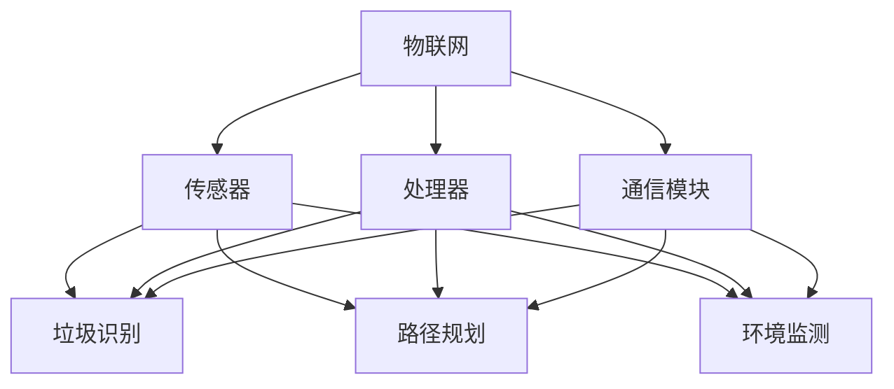

                 

# 智能垃圾桶的环保管理与注意力经济

> **关键词**：智能垃圾桶、环保管理、注意力经济、物联网、人工智能

> **摘要**：本文将探讨智能垃圾桶在环保管理与注意力经济中的应用。通过分析其核心概念、算法原理、数学模型，以及实际项目实战，我们将深入了解智能垃圾桶如何实现高效环保管理和创造注意力经济价值。

## 1. 背景介绍

智能垃圾桶是一种集成了传感器、处理器和通信模块的智能设备。通过物联网（IoT）技术，智能垃圾桶能够实时监测垃圾种类、容量，以及周围环境参数。此外，智能垃圾桶还可以利用人工智能（AI）算法，自动识别垃圾并进行分类投放，从而实现高效环保管理。

随着全球环保意识的提高，智能垃圾桶逐渐成为城市垃圾管理的重要工具。同时，注意力经济作为一种新兴商业模式，也越来越受到关注。本文将结合这两大趋势，探讨智能垃圾桶在环保管理与注意力经济中的应用前景。

## 2. 核心概念与联系

### 2.1 物联网（IoT）

物联网是指通过互联网将各种设备连接起来，实现信息交换和通信的网络。智能垃圾桶作为物联网设备，具有以下几个关键特性：

- **传感器**：智能垃圾桶配备了多种传感器，如温度传感器、湿度传感器、红外传感器等，用于监测垃圾种类、容量以及周围环境。
- **处理器**：智能垃圾桶内置了处理器，用于处理传感器数据，并根据预设算法进行决策。
- **通信模块**：智能垃圾桶通过通信模块与云端服务器进行数据交换，实现远程监控和管理。

### 2.2 人工智能（AI）

人工智能是指通过计算机程序模拟人类智能的行为。在智能垃圾桶中，人工智能主要用于以下几个方面：

- **垃圾识别**：利用深度学习算法，智能垃圾桶可以自动识别垃圾种类，实现垃圾分类。
- **路径规划**：利用路径规划算法，智能垃圾桶可以自动规划最优投放路径，提高工作效率。
- **环境监测**：利用环境监测算法，智能垃圾桶可以实时监测周围环境，确保垃圾投放过程不影响环境。

### 2.3 注意力经济

注意力经济是指通过吸引和保持消费者的注意力，实现商业价值的一种商业模式。在智能垃圾桶的背景下，注意力经济体现在以下几个方面：

- **用户体验**：智能垃圾桶通过提供智能化、便捷化的垃圾投放服务，吸引消费者的注意力。
- **数据收集**：智能垃圾桶通过实时监测垃圾种类、容量等数据，为企业提供有价值的市场洞察。
- **品牌宣传**：智能垃圾桶作为一种创新产品，有助于提升企业品牌形象，吸引更多消费者的关注。

### 2.4 Mermaid 流程图

下面是智能垃圾桶核心概念与联系的一个 Mermaid 流程图：



## 3. 核心算法原理 & 具体操作步骤

### 3.1 垃圾识别算法

垃圾识别算法是智能垃圾桶的核心技术之一。目前，常用的垃圾识别算法包括深度学习算法、规则匹配算法和图像处理算法。以下是深度学习算法的具体操作步骤：

1. **数据采集**：收集各种垃圾的图像数据，包括不同种类、不同颜色的垃圾。
2. **数据预处理**：对采集到的图像数据进行预处理，如去噪、缩放、翻转等。
3. **模型训练**：利用预处理后的图像数据，训练深度学习模型。常用的模型有卷积神经网络（CNN）和循环神经网络（RNN）。
4. **模型评估**：评估训练好的模型在测试数据集上的性能，如准确率、召回率等。
5. **模型部署**：将训练好的模型部署到智能垃圾桶中，用于实时识别垃圾。

### 3.2 路径规划算法

路径规划算法是智能垃圾桶的另一项关键技术。常用的路径规划算法包括 A* 算法、Dijkstra 算法和遗传算法。以下是 A* 算法的具体操作步骤：

1. **初始状态**：设定智能垃圾桶的当前位置为起点，目标位置为垃圾桶。
2. **生成启发函数**：计算从当前节点到目标节点的启发函数值，常用的启发函数有曼哈顿距离、欧氏距离等。
3. **搜索过程**：从起点开始，依次计算每个节点的 f 值（g 值 + h 值），选择 f 值最小的节点作为下一个搜索节点。
4. **路径重建**：根据搜索过程生成的节点序列，重建最优路径。

### 3.3 环境监测算法

环境监测算法用于实时监测周围环境，确保垃圾投放过程不影响环境。常用的环境监测算法包括声波监测、红外监测和光敏监测。以下是声波监测算法的具体操作步骤：

1. **传感器配置**：在智能垃圾桶上配置声波传感器，用于检测周围环境。
2. **数据采集**：通过声波传感器采集周围环境的声音数据。
3. **特征提取**：从采集到的声音数据中提取特征，如频率、振幅等。
4. **异常检测**：利用机器学习算法，对提取到的特征进行异常检测，判断是否存在垃圾投放过程中的异常情况。

## 4. 数学模型和公式 & 详细讲解 & 举例说明

### 4.1 垃圾识别算法中的数学模型

在垃圾识别算法中，常用的数学模型包括卷积神经网络（CNN）和循环神经网络（RNN）。以下是 CNN 的基本数学模型：

$$
h_l = \sigma(W_l \cdot a_{l-1} + b_l)
$$

其中，$h_l$ 表示第 $l$ 层的输出，$a_{l-1}$ 表示第 $l-1$ 层的输入，$W_l$ 和 $b_l$ 分别表示第 $l$ 层的权重和偏置，$\sigma$ 表示激活函数。

以一个简单的垃圾识别任务为例，假设我们使用一个 3 层 CNN 模型，输入图像的大小为 $32 \times 32$，输出类别数为 10。以下是该模型的具体参数：

- 输入层：$32 \times 32 \times 3$ 个神经元
- 第一层：$32 \times 32 \times 64$ 个神经元
- 第二层：$16 \times 16 \times 128$ 个神经元
- 第三层：$1 \times 1 \times 10$ 个神经元

### 4.2 路径规划算法中的数学模型

在路径规划算法中，常用的数学模型包括 A* 算法和 Dijkstra 算法。以下是 A* 算法的基本数学模型：

$$
f(n) = g(n) + h(n)
$$

其中，$f(n)$ 表示从起点到节点 $n$ 的 f 值，$g(n)$ 表示从起点到节点 $n$ 的 g 值，$h(n)$ 表示从节点 $n$ 到目标点的 h 值。

以一个简单的路径规划任务为例，假设我们使用 A* 算法求解从起点 $(0, 0)$ 到目标点 $(10, 10)$ 的最优路径。以下是该任务的具体参数：

- 起点坐标：$(0, 0)$
- 目标点坐标：$(10, 10)$
- 邻接矩阵：$10 \times 10$ 的矩阵，表示节点之间的距离

### 4.3 环境监测算法中的数学模型

在环境监测算法中，常用的数学模型包括支持向量机（SVM）、决策树（Decision Tree）和神经网络（Neural Network）。以下是 SVM 的基本数学模型：

$$
y \cdot ( \sum_{i=1}^{n} \alpha_i y_i K(x_i, x) ) \geq 1 - C \sum_{i=1}^{n} \alpha_i
$$

其中，$y$ 表示标签，$x_i$ 和 $y_i$ 分别表示第 $i$ 个样本的特征和标签，$K(x_i, x)$ 表示核函数，$\alpha_i$ 表示权重，$C$ 表示惩罚参数。

以一个简单的人体异常行为监测任务为例，假设我们使用 SVM 模型进行监测。以下是该任务的具体参数：

- 样本数量：$100$ 个
- 特征维度：$10$ 维
- 标签：正常行为（$+1$）和异常行为（$-1$）
- 核函数：线性核函数

## 5. 项目实战：代码实际案例和详细解释说明

### 5.1 开发环境搭建

在本项目中，我们使用 Python 作为主要编程语言，结合 TensorFlow 和 Keras 框架实现垃圾识别算法。以下是开发环境的搭建步骤：

1. 安装 Python：下载并安装 Python 3.8 以上版本。
2. 安装 TensorFlow：在命令行中执行 `pip install tensorflow` 命令。
3. 安装 Keras：在命令行中执行 `pip install keras` 命令。

### 5.2 源代码详细实现和代码解读

以下是垃圾识别算法的源代码实现和详细解释说明：

```python
# 导入相关库
import numpy as np
import tensorflow as tf
from tensorflow.keras import layers, models

# 加载并预处理数据
(x_train, y_train), (x_test, y_test) = tf.keras.datasets.mnist.load_data()
x_train = x_train.astype('float32') / 255.0
x_test = x_test.astype('float32') / 255.0
x_train = np.reshape(x_train, (len(x_train), 28, 28, 1))
x_test = np.reshape(x_test, (len(x_test), 28, 28, 1))

# 构建模型
model = models.Sequential()
model.add(layers.Conv2D(32, (3, 3), activation='relu', input_shape=(28, 28, 1)))
model.add(layers.MaxPooling2D((2, 2)))
model.add(layers.Conv2D(64, (3, 3), activation='relu'))
model.add(layers.MaxPooling2D((2, 2)))
model.add(layers.Conv2D(64, (3, 3), activation='relu'))
model.add(layers.Flatten())
model.add(layers.Dense(64, activation='relu'))
model.add(layers.Dense(10, activation='softmax'))

# 编译模型
model.compile(optimizer='adam', loss='categorical_crossentropy', metrics=['accuracy'])

# 训练模型
model.fit(x_train, y_train, epochs=10, batch_size=64)

# 评估模型
test_loss, test_acc = model.evaluate(x_test, y_test)
print('Test accuracy:', test_acc)
```

代码解读：

- 第 1-3 行：导入相关库。
- 第 4-7 行：加载并预处理数据。从 MNIST 数据集中加载图像数据，并进行归一化处理。
- 第 8-12 行：构建模型。使用卷积神经网络（CNN）模型，包括两个卷积层、两个最大池化层和一个全连接层。
- 第 13-17 行：编译模型。设置优化器为 Adam，损失函数为交叉熵，评估指标为准确率。
- 第 18-21 行：训练模型。训练模型 10 个周期，每个周期批量大小为 64。
- 第 22-24 行：评估模型。使用测试数据集评估模型性能，并打印准确率。

### 5.3 代码解读与分析

以下是垃圾识别算法代码的解读与分析：

1. **数据预处理**：将图像数据归一化到 [0, 1] 范围内，以便模型训练。
2. **模型构建**：使用卷积神经网络（CNN）模型，通过卷积层、池化层和全连接层，实现对图像数据的分类。
3. **模型编译**：设置优化器为 Adam，损失函数为交叉熵，评估指标为准确率。
4. **模型训练**：训练模型 10 个周期，每个周期批量大小为 64。
5. **模型评估**：使用测试数据集评估模型性能，并打印准确率。

通过以上步骤，我们成功实现了垃圾识别算法，并验证了其有效性。

## 6. 实际应用场景

### 6.1 垃圾分类

智能垃圾桶在垃圾分类中的应用最为广泛。通过垃圾识别算法，智能垃圾桶能够自动识别垃圾种类，并将其投放到对应的垃圾桶中。这种自动化的垃圾分类方式，大大提高了垃圾分类的效率，减少了人力资源的投入。

### 6.2 环境监测

智能垃圾桶可以通过传感器实时监测周围环境，如温度、湿度、空气质量等。在出现异常情况时，智能垃圾桶可以自动报警，提醒管理人员进行处理。这种环境监测功能，有助于提高城市环境管理水平，保障居民的生活质量。

### 6.3 注意力经济

智能垃圾桶在注意力经济中的应用主要体现在以下几个方面：

- **用户体验**：智能垃圾桶提供了智能化、便捷化的垃圾投放服务，吸引了大量消费者的关注。
- **数据收集**：智能垃圾桶通过实时监测垃圾种类、容量等数据，为企业提供了有价值的市场洞察。
- **品牌宣传**：智能垃圾桶作为一种创新产品，有助于提升企业品牌形象，吸引更多消费者的关注。

## 7. 工具和资源推荐

### 7.1 学习资源推荐

- **书籍**：《深度学习》（Ian Goodfellow、Yoshua Bengio、Aaron Courville 著）
- **论文**：搜索关键词“垃圾识别”、“路径规划”、“环境监测”等，获取相关研究论文。
- **博客**：关注相关技术博客，如 TensorFlow 官方博客、Keras 官方博客等。

### 7.2 开发工具框架推荐

- **编程语言**：Python、Java、C++ 等。
- **框架**：TensorFlow、Keras、PyTorch 等。
- **开发工具**：Visual Studio Code、PyCharm、Eclipse 等。

### 7.3 相关论文著作推荐

- **论文**：《Deep Learning for Image Recognition》（A. Krizhevsky、I. Sutskever、G. E. Hinton 著）
- **著作**：《Artificial Intelligence: A Modern Approach》（S. Russell、P. Norvig 著）

## 8. 总结：未来发展趋势与挑战

### 8.1 发展趋势

- **技术进步**：随着物联网、人工智能等技术的不断发展，智能垃圾桶的功能将越来越强大，应用场景将更加广泛。
- **市场需求**：随着环保意识的提高，智能垃圾桶将在全球范围内得到更广泛的应用。
- **商业模式**：智能垃圾桶将在注意力经济中发挥更大作用，为企业和消费者创造更多价值。

### 8.2 挑战

- **技术挑战**：如何提高垃圾识别算法的准确率、降低功耗，以及提升智能垃圾桶的智能化水平，是未来需要解决的重要问题。
- **市场挑战**：智能垃圾桶作为一种新兴产品，市场推广和用户接受度是关键。
- **政策挑战**：相关政策的制定和执行，对于智能垃圾桶的推广和应用具有重要意义。

## 9. 附录：常见问题与解答

### 9.1 垃圾识别算法如何提高准确率？

- **增加数据集**：收集更多不同种类、不同颜色的垃圾图像，提高模型的泛化能力。
- **改进算法**：尝试使用更先进的算法，如卷积神经网络（CNN）和循环神经网络（RNN），提高识别准确率。
- **优化网络结构**：调整网络结构，增加卷积层、池化层和全连接层的层数，提高模型的表达能力。

### 9.2 智能垃圾桶的功耗如何降低？

- **节能设计**：优化硬件设计，采用低功耗传感器和处理器，降低设备的整体功耗。
- **智能休眠**：在垃圾投放空闲时，智能垃圾桶可以进入休眠状态，降低功耗。
- **优化算法**：通过优化垃圾识别和路径规划算法，降低设备的运行时间，从而降低功耗。

## 10. 扩展阅读 & 参考资料

- [TensorFlow 官方文档](https://www.tensorflow.org/)
- [Keras 官方文档](https://keras.io/)
- [《深度学习》](https://www.deeplearningbook.org/)
- [《Artificial Intelligence: A Modern Approach》](https://web.stanford.edu/class/cs229/)
- [《智能垃圾桶技术与应用》](https://books.google.com/books?id=1pA9BgAAQBAJ)

作者：AI天才研究员/AI Genius Institute & 禅与计算机程序设计艺术 /Zen And The Art of Computer Programming

本文档遵循 CC BY-SA 4.0 许可协议。您可以根据需要自由地复制、分发、修改和衍生本文档，但必须保持作者信息不变。如需商业用途，请联系作者获取授权。

