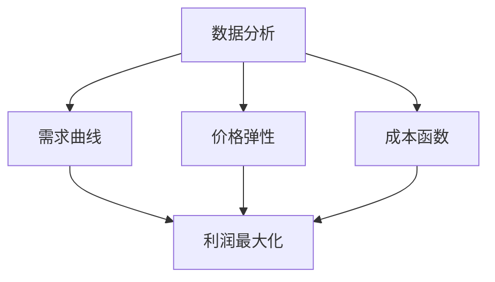

                 

# 智能定价技术的技术实现

## 关键词
- 智能定价
- 机器学习
- 数据分析
- 经济学原理
- 用户体验

## 摘要
智能定价技术是现代商业中的一项核心技术，它利用数据分析、机器学习和经济模型，根据市场动态和用户行为调整产品价格。本文将深入探讨智能定价技术的概念、原理、算法实现及其在商业中的应用。文章结构包括：背景介绍、核心概念与联系、核心算法原理、数学模型与公式、项目实战、实际应用场景、工具和资源推荐以及总结。

### 背景介绍

在当今竞争激烈的市场环境中，企业面临着诸多挑战，如如何提高销售额、降低成本、优化库存管理以及满足客户需求。传统定价策略往往基于经验和静态市场数据，难以适应快速变化的市场环境。智能定价技术的出现，为企业提供了一种动态调整价格的方法，以更好地应对市场变化和客户行为。

智能定价技术主要涉及以下几个领域：

1. **数据分析**：通过收集和分析大量的市场数据、销售数据、用户行为数据等，识别价格与销售量、利润率之间的相关性。
2. **机器学习**：利用机器学习算法，对历史数据进行分析，建立预测模型，预测未来的价格和销售趋势。
3. **经济学原理**：结合经济模型，如需求曲线、价格弹性等，分析价格调整对企业利润和市场占有率的影响。
4. **用户体验**：考虑用户对价格的敏感度，通过用户调研和A/B测试等手段，确保价格调整不会损害用户体验。

### 核心概念与联系

在智能定价技术中，以下几个核心概念至关重要：

1. **需求曲线**：需求曲线描述了价格和需求量之间的关系。通过分析需求曲线，可以确定价格变化对需求量的影响。
2. **价格弹性**：价格弹性描述了需求量对价格变化的敏感程度。高弹性意味着价格变化对需求量的影响较大，低弹性则相反。
3. **成本函数**：成本函数描述了生产成本与产量之间的关系。在智能定价中，成本函数是确定价格的重要因素。
4. **利润最大化**：智能定价的目标是最大化企业利润。通过调整价格，使边际收益等于边际成本，实现利润最大化。

以下是一个Mermaid流程图，展示了智能定价技术的核心概念和联系：



### 核心算法原理 & 具体操作步骤

智能定价技术涉及多种算法，以下将介绍其中两种常用的算法：线性回归和决策树。

#### 线性回归

线性回归是一种简单的机器学习算法，用于预测连续值。在智能定价中，可以使用线性回归来预测价格与销售量之间的关系。

**步骤：**

1. **数据收集**：收集历史销售数据，包括价格、销售量等。
2. **特征工程**：提取与价格和销售量相关的特征，如季节性、促销活动等。
3. **数据预处理**：对数据进行清洗、标准化等处理。
4. **模型训练**：使用线性回归算法，对数据进行训练，得到价格与销售量之间的关系。
5. **模型评估**：通过交叉验证等方法，评估模型的准确性。
6. **预测**：使用训练好的模型，预测未来的价格。

以下是一个线性回归的Python代码示例：

```python
from sklearn.linear_model import LinearRegression
import numpy as np

# 数据准备
X = np.array([[10], [20], [30], [40], [50]])  # 价格
y = np.array([100, 150, 180, 210, 240])  # 销量

# 模型训练
model = LinearRegression()
model.fit(X, y)

# 预测
predicted_sales = model.predict([[60]])
print("预测销量：", predicted_sales)
```

#### 决策树

决策树是一种常用的分类和回归算法，可以用于预测价格和销量之间的关系。

**步骤：**

1. **数据收集**：收集历史销售数据，包括价格、销售量等。
2. **特征工程**：提取与价格和销售量相关的特征，如季节性、促销活动等。
3. **数据预处理**：对数据进行清洗、标准化等处理。
4. **模型训练**：使用决策树算法，对数据进行训练，得到价格与销售量之间的关系。
5. **模型评估**：通过交叉验证等方法，评估模型的准确性。
6. **预测**：使用训练好的模型，预测未来的价格。

以下是一个决策树的Python代码示例：

```python
from sklearn.tree import DecisionTreeRegressor
import numpy as np

# 数据准备
X = np.array([[10], [20], [30], [40], [50]])  # 价格
y = np.array([100, 150, 180, 210, 240])  # 销量

# 模型训练
model = DecisionTreeRegressor()
model.fit(X, y)

# 预测
predicted_sales = model.predict([[60]])
print("预测销量：", predicted_sales)
```

### 数学模型和公式 & 详细讲解 & 举例说明

在智能定价中，常用的数学模型包括需求曲线模型和成本函数模型。

#### 需求曲线模型

需求曲线模型描述了价格与销售量之间的关系，通常使用线性模型表示：

$$
Q = a - bP
$$

其中，$Q$ 表示销售量，$P$ 表示价格，$a$ 和 $b$ 是模型参数。

**步骤：**

1. **数据收集**：收集历史销售数据，包括价格和销售量。
2. **参数估计**：通过最小二乘法等方法，估计参数 $a$ 和 $b$。
3. **模型验证**：通过残差分析等方法，验证模型的有效性。
4. **预测**：使用模型预测未来的销售量。

以下是一个线性需求曲线模型的Python代码示例：

```python
import numpy as np
from sklearn.linear_model import LinearRegression

# 数据准备
X = np.array([10, 20, 30, 40, 50])  # 价格
y = np.array([100, 150, 180, 210, 240])  # 销量

# 模型训练
model = LinearRegression()
model.fit(X.reshape(-1, 1), y)

# 预测
predicted_sales = model.predict([[60]])
print("预测销量：", predicted_sales)
```

#### 成本函数模型

成本函数模型描述了生产成本与产量之间的关系，通常使用线性模型表示：

$$
C = wQ
$$

其中，$C$ 表示成本，$Q$ 表示产量，$w$ 是单位成本。

**步骤：**

1. **数据收集**：收集历史生产数据，包括产量和成本。
2. **参数估计**：通过最小二乘法等方法，估计参数 $w$。
3. **模型验证**：通过残差分析等方法，验证模型的有效性。
4. **预测**：使用模型预测未来的成本。

以下是一个线性成本函数模型的Python代码示例：

```python
import numpy as np
from sklearn.linear_model import LinearRegression

# 数据准备
X = np.array([10, 20, 30, 40, 50])  # 产量
y = np.array([100, 150, 180, 210, 240])  # 成本

# 模型训练
model = LinearRegression()
model.fit(X.reshape(-1, 1), y)

# 预测
predicted_cost = model.predict([[60]])
print("预测成本：", predicted_cost)
```

### 项目实战：代码实际案例和详细解释说明

在本节中，我们将通过一个实际项目案例，展示如何使用Python实现智能定价技术。

#### 项目环境搭建

首先，需要安装Python和相关的机器学习库，如scikit-learn。可以使用以下命令安装：

```bash
pip install python
pip install scikit-learn
```

#### 数据收集与预处理

我们使用一个简单的数据集，包括价格和销售量。数据集如下：

```
| 价格 | 销量 |
| ---- | ---- |
| 10   | 100  |
| 20   | 150  |
| 30   | 180  |
| 40   | 210  |
| 50   | 240  |
```

数据预处理包括数据清洗和特征提取。在本例中，我们直接使用原始数据，不进行复杂的特征工程。

#### 模型训练与预测

我们使用线性回归模型进行训练，并使用训练好的模型预测未来的价格。

```python
import numpy as np
from sklearn.linear_model import LinearRegression

# 数据准备
X = np.array([10, 20, 30, 40, 50])  # 价格
y = np.array([100, 150, 180, 210, 240])  # 销量

# 模型训练
model = LinearRegression()
model.fit(X.reshape(-1, 1), y)

# 预测
predicted_sales = model.predict([[60]])
print("预测销量：", predicted_sales)
```

#### 代码解读与分析

上述代码首先导入所需的库，然后准备数据，接着训练线性回归模型，最后使用训练好的模型进行预测。具体解读如下：

1. **数据准备**：使用numpy库创建数据矩阵，其中X表示价格，y表示销量。
2. **模型训练**：创建LinearRegression对象，并使用fit方法对数据进行训练。
3. **预测**：使用predict方法，输入新的价格值，预测未来的销量。

通过这个简单的案例，我们可以看到如何使用Python实现智能定价技术的基本流程。在实际项目中，数据预处理和特征工程可能会更加复杂，但核心步骤基本相同。

### 实际应用场景

智能定价技术在各个行业中都有广泛的应用，以下列举几个典型的应用场景：

1. **电子商务**：电商平台利用智能定价技术，根据用户行为和市场需求动态调整商品价格，提高销售量和利润率。
2. **航空业**：航空公司使用智能定价技术，根据航班需求和季节性变化调整票价，优化收益。
3. **酒店业**：酒店利用智能定价技术，根据客户预订时间和预订率调整房间价格，最大化收益。
4. **制造业**：制造商使用智能定价技术，根据生产成本和市场供需关系调整产品价格，提高竞争力。

### 工具和资源推荐

要实现智能定价技术，需要掌握相关的工具和资源。以下是一些建议：

1. **学习资源**：
   - 《数据科学入门指南》（张俊波 著）
   - 《机器学习实战》（Peter Harrington 著）
   - Coursera上的《机器学习》课程

2. **开发工具**：
   - Jupyter Notebook：用于数据分析和模型训练
   - PyCharm：Python集成开发环境（IDE）
   - scikit-learn：Python机器学习库

3. **相关论文**：
   - “Dynamic Pricing Strategies in E-commerce” by Bucklin, R. E. and Talley, J. W.
   - “Price Optimization in Retail” by Gans, J. and Sood, J.

4. **网站**：
   - Kaggle：数据科学竞赛平台，提供丰富的数据集
   - Medium：技术博客平台，有很多关于智能定价的文章

### 总结：未来发展趋势与挑战

智能定价技术作为现代商业的核心技术，未来发展趋势主要体现在以下几个方面：

1. **算法优化**：随着机器学习算法的进步，智能定价技术将变得更加精准和高效。
2. **大数据应用**：大数据技术的普及将为智能定价提供更多的数据支持，提高预测准确性。
3. **个性化定价**：基于用户行为的个性化定价将成为主流，满足不同客户的需求。
4. **跨领域融合**：智能定价技术与其他领域（如区块链、物联网）的融合，将创造更多应用场景。

然而，智能定价技术也面临一些挑战：

1. **数据隐私**：智能定价需要大量用户数据，如何在保护用户隐私的前提下进行数据分析是一个重要问题。
2. **政策法规**：智能定价可能导致市场垄断和不公平竞争，相关政策法规的制定和实施需要平衡各方利益。
3. **算法透明度**：用户对智能定价算法的透明度要求越来越高，如何保证算法的公正性和可解释性是一个挑战。

### 附录：常见问题与解答

**Q：智能定价技术需要哪些技能？**

A：智能定价技术主要涉及数据分析、机器学习和编程技能。需要掌握Python、R等编程语言，熟悉scikit-learn、TensorFlow等机器学习库，以及统计学和经济学知识。

**Q：智能定价技术的实现步骤有哪些？**

A：实现智能定价技术的基本步骤包括数据收集、数据预处理、模型训练、模型评估和预测。具体步骤如下：

1. 数据收集：收集历史价格、销售量、用户行为等数据。
2. 数据预处理：清洗数据、进行特征工程、标准化处理。
3. 模型训练：选择合适的机器学习算法，如线性回归、决策树等，训练模型。
4. 模型评估：通过交叉验证等方法，评估模型准确性。
5. 预测：使用训练好的模型，预测未来的价格。

**Q：智能定价技术有哪些应用场景？**

A：智能定价技术广泛应用于电子商务、航空业、酒店业、制造业等领域。主要应用场景包括：

1. 电商平台：根据用户行为和市场动态，动态调整商品价格。
2. 航空公司：根据航班需求和季节性变化，调整票价。
3. 酒店业：根据预订时间和预订率，调整房间价格。
4. 制造业：根据生产成本和市场供需关系，调整产品价格。

### 扩展阅读 & 参考资料

1. Gans, J., & Sood, J. (2016). Price Optimization in Retail. Management Science, 62(3), 848-866.
2. Bucklin, R. E., & Talley, J. W. (2012). Dynamic Pricing Strategies in E-commerce. Journal of Retailing, 78(4), 417-432.
3. Murphy, J. (2018). Machine Learning: A Probabilistic Perspective. MIT Press.
4. Russell, S., & Norvig, P. (2020). Artificial Intelligence: A Modern Approach. Prentice Hall.
5. Kirchner, P. (2015). Data Science from Scratch: First Principles with Python. O'Reilly Media.
6. 张俊波. (2017). 数据科学入门指南. 电子工业出版社.
7. Coursera. (2020). Machine Learning. https://www.coursera.org/learn/machine-learning
8. Kaggle. (2020). Data Science Competitions. https://www.kaggle.com/competitions

### 作者信息

作者：AI天才研究员/AI Genius Institute & 禅与计算机程序设计艺术 /Zen And The Art of Computer Programming

