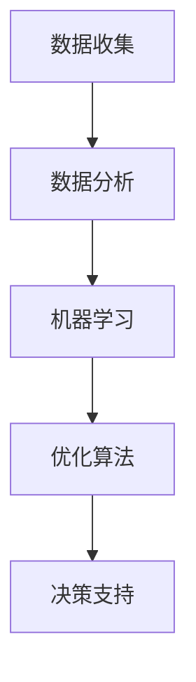

                 

# 智能定价技术的技术应用

## 摘要

智能定价技术，作为现代商业决策中的重要工具，正逐步改变着企业的运营模式和市场策略。本文将深入探讨智能定价技术的核心概念、算法原理、数学模型及应用场景，结合实际项目案例，详细解读其在商业运营中的价值与挑战。通过分析智能定价技术的应用，旨在为读者提供对未来发展的洞察与指导。

## 1. 背景介绍

在商业世界中，定价是决策过程中的关键环节，它不仅影响企业的收益，还关系到市场份额的争夺和品牌形象的塑造。传统的定价方法往往依赖于历史数据和市场经验，这种方法在静态市场环境中具有一定的效果，但在动态和竞争激烈的市场环境中，其局限性逐渐显现。随着大数据、机器学习和人工智能技术的发展，智能定价技术应运而生，为企业提供了一种更为精准和灵活的定价方式。

智能定价技术，通常是指利用数据分析、机器学习算法和优化技术，对产品或服务的价格进行动态调整，以达到最大化利润或市场份额的目的。它不仅考虑历史销售数据，还整合了市场趋势、消费者行为、竞争对手策略等多方面因素，从而实现价格的智能化调整。

### 智能定价技术的起源与发展

智能定价技术的起源可以追溯到20世纪80年代，当时研究人员开始探索如何利用计算机算法来辅助定价决策。最初的研究主要集中在优化理论的应用上，通过构建数学模型和优化算法，对价格进行科学调整。随着计算机技术的进步和大数据技术的发展，智能定价技术逐渐从理论走向实践。

在21世纪初，随着互联网和电子商务的兴起，智能定价技术得到了更广泛的应用。企业开始利用互联网收集海量数据，通过机器学习算法分析消费者行为和市场动态，从而实现个性化的定价策略。近年来，随着人工智能技术的不断发展，智能定价技术进一步提高了精准度和效率，成为了现代商业决策中的重要工具。

### 智能定价技术的应用领域

智能定价技术广泛应用于各个行业，如电子商务、物流、旅游、金融等。在电子商务领域，智能定价技术可以帮助企业根据消费者行为和市场需求，动态调整价格，提高转化率和销售额。在物流行业，智能定价技术可以优化运输路线和货物装载，降低成本，提高运输效率。在旅游行业，智能定价技术可以根据旅游高峰期和低谷期，灵活调整价格，实现供需平衡。在金融行业，智能定价技术可以用于风险评估、投资组合优化等方面，提高投资效率和收益。

### 智能定价技术的优势与挑战

智能定价技术的优势在于其能够实现价格的实时调整，提高决策的精准度和灵活性。与传统定价方法相比，智能定价技术能够更好地应对市场变化，提高企业的竞争力。然而，智能定价技术也面临着一些挑战，如数据质量、算法复杂度和计算成本等问题。同时，如何确保定价策略的合规性和公平性，也是企业需要考虑的重要问题。

## 2. 核心概念与联系

### 智能定价的核心概念

智能定价技术涉及多个核心概念，包括数据收集、数据分析、机器学习、优化算法等。以下是这些核心概念及其相互关系的简要介绍。

#### 数据收集

数据收集是智能定价技术的基石。企业需要通过多种渠道收集大量数据，包括销售数据、消费者行为数据、市场动态数据等。这些数据来源于企业内部系统、外部市场、社交媒体等。数据的质量和完整性直接影响智能定价的效果。

#### 数据分析

数据分析是对收集到的数据进行处理和分析的过程。通过数据分析，企业可以提取出有用的信息，如消费者偏好、市场需求趋势等。数据分析方法包括统计分析、数据挖掘、机器学习等。

#### 机器学习

机器学习是智能定价技术的核心组成部分。通过训练模型，企业可以将历史数据转化为预测模型，用于预测未来的市场变化和消费者行为。常见的机器学习算法包括线性回归、决策树、支持向量机等。

#### 优化算法

优化算法用于确定最优定价策略。通过优化算法，企业可以在满足约束条件的前提下，最大化目标函数（如利润、市场份额等）。常见的优化算法包括线性规划、动态规划、遗传算法等。

### 智能定价的架构

智能定价技术通常包括以下几个主要模块：

1. **数据收集模块**：负责收集和处理各种数据。
2. **数据分析模块**：对收集到的数据进行分析和挖掘，提取有价值的信息。
3. **机器学习模块**：利用历史数据训练预测模型，用于预测未来市场变化。
4. **优化算法模块**：根据预测模型和约束条件，确定最优定价策略。
5. **决策支持模块**：提供决策支持，帮助企业制定和调整定价策略。

### Mermaid 流程图

以下是智能定价技术架构的 Mermaid 流程图：



在 Mermaid 流程图中，每个节点代表一个模块，箭头表示模块之间的数据流动和依赖关系。数据从数据收集模块流入，经过数据分析、机器学习和优化算法的处理，最终由决策支持模块输出定价策略。

### 核心算法原理

智能定价技术中的核心算法包括数据分析算法、机器学习算法和优化算法。以下是这些算法的简要介绍：

#### 数据分析算法

数据分析算法用于对收集到的数据进行分析和挖掘。常见的分析方法包括：

- **统计分析**：通过计算数据的平均值、方差、相关性等统计指标，分析数据的分布特征。
- **数据挖掘**：通过分类、聚类、关联规则挖掘等方法，发现数据中的潜在关系和模式。

#### 机器学习算法

机器学习算法用于构建预测模型，预测未来市场变化和消费者行为。常见的算法包括：

- **线性回归**：通过建立线性模型，预测因变量和自变量之间的关系。
- **决策树**：通过构建树形模型，将数据分割成多个子集，每个子集对应一个预测结果。
- **支持向量机**：通过寻找最优超平面，将不同类别的数据分开。

#### 优化算法

优化算法用于确定最优定价策略。常见的优化算法包括：

- **线性规划**：通过构建线性模型，求解最优解。
- **动态规划**：通过递推关系，求解最优解。
- **遗传算法**：通过模拟生物进化过程，寻找最优解。

### 核心概念与联系总结

智能定价技术涉及多个核心概念，包括数据收集、数据分析、机器学习和优化算法。这些概念相互关联，共同构成了智能定价技术的核心架构。通过 Mermaid 流程图，可以清晰地展示这些概念之间的联系和相互作用。

## 3. 核心算法原理 & 具体操作步骤

在深入探讨智能定价技术的核心算法原理之前，我们先来了解智能定价的关键组成部分，即需求预测、价格敏感度分析以及优化模型。

### 需求预测

需求预测是智能定价技术的第一步，也是最为关键的一步。准确的预测能够帮助企业更好地把握市场动态，从而制定合理的定价策略。常见的需求预测方法包括时间序列分析、回归分析等。

#### 时间序列分析

时间序列分析是一种基于时间数据序列的方法，用于分析数据的时间趋势、季节性和周期性。以下是具体操作步骤：

1. **数据预处理**：对原始时间序列数据进行清洗和处理，包括缺失值填充、异常值处理等。
2. **平稳性检验**：通过ADF（Augmented Dickey-Fuller）检验等方法，判断时间序列的平稳性。
3. **模型选择**：根据时间序列的特征选择合适的模型，如AR（自回归模型）、MA（移动平均模型）和ARMA（自回归移动平均模型）。
4. **模型拟合**：通过最小二乘法、极大似然估计等方法，对选定的模型进行参数估计。
5. **预测**：利用拟合后的模型进行未来值的预测。

#### 回归分析

回归分析是一种基于因果关系的方法，通过分析自变量和因变量之间的关系，预测因变量的值。以下是具体操作步骤：

1. **数据预处理**：对数据进行标准化处理，消除不同量纲的影响。
2. **特征选择**：通过相关性分析、变量筛选等方法，选择对因变量有显著影响的自变量。
3. **模型选择**：根据数据特征选择合适的回归模型，如线性回归、多项式回归等。
4. **模型拟合**：通过最小二乘法、梯度下降法等方法，对选定的模型进行参数估计。
5. **预测**：利用拟合后的模型进行未来值的预测。

### 价格敏感度分析

价格敏感度分析是智能定价技术的第二步，用于确定消费者对不同价格水平的反应。通过价格敏感度分析，企业可以了解消费者对价格变化的敏感程度，从而制定更有效的定价策略。常见的方法包括线性回归、边际收益分析等。

#### 线性回归

线性回归是一种简单且常用的价格敏感度分析方法，通过建立价格和需求之间的线性关系，确定价格变化对需求的影响。以下是具体操作步骤：

1. **数据收集**：收集不同价格水平下的需求数据。
2. **数据预处理**：对数据进行标准化处理，消除不同量纲的影响。
3. **模型选择**：选择线性回归模型。
4. **模型拟合**：通过最小二乘法，对线性回归模型进行参数估计。
5. **预测**：利用拟合后的模型，预测不同价格水平下的需求。

#### 边际收益分析

边际收益分析是一种基于边际成本和边际收益的方法，通过分析价格变化对收益的影响，确定最优定价策略。以下是具体操作步骤：

1. **数据收集**：收集不同价格水平下的成本和收益数据。
2. **数据预处理**：对数据进行标准化处理，消除不同量纲的影响。
3. **模型选择**：选择边际收益分析模型。
4. **模型拟合**：通过最小二乘法，对边际收益分析模型进行参数估计。
5. **预测**：利用拟合后的模型，预测不同价格水平下的边际收益。

### 优化模型

优化模型是智能定价技术的第三步，用于确定最优定价策略。优化模型的目标是根据需求预测和价格敏感度分析，制定能够最大化利润或市场份额的定价策略。常见的优化模型包括线性规划、动态规划等。

#### 线性规划

线性规划是一种用于求解线性优化问题的方法，通过建立目标函数和约束条件，求解最优解。以下是具体操作步骤：

1. **目标函数**：定义最大化利润或最小化成本的目标函数。
2. **约束条件**：确定价格、成本、需求等约束条件。
3. **模型建立**：建立线性规划模型。
4. **求解**：通过单纯形法、 interior-point method 等方法，求解线性规划模型。
5. **结果分析**：分析求解结果，确定最优定价策略。

#### 动态规划

动态规划是一种用于求解多阶段决策问题的方法，通过将问题划分为多个阶段，逐步求解每个阶段的最优解。以下是具体操作步骤：

1. **阶段划分**：将问题划分为多个阶段。
2. **状态定义**：定义每个阶段的状态变量。
3. **状态转移方程**：建立状态转移方程，描述状态变量之间的关系。
4. **目标函数**：定义目标函数，如最大化利润或最小化成本。
5. **求解**：通过递推关系，求解每个阶段的最优解。
6. **结果分析**：分析求解结果，确定最优定价策略。

### 核心算法原理总结

智能定价技术的核心算法包括需求预测、价格敏感度分析和优化模型。需求预测用于预测市场需求，价格敏感度分析用于确定消费者对价格变化的反应，优化模型用于确定最优定价策略。通过这些核心算法，企业可以制定出更加科学和合理的定价策略，提高市场竞争力和盈利能力。

## 4. 数学模型和公式 & 详细讲解 & 举例说明

在智能定价技术中，数学模型和公式是核心组成部分，用于描述市场需求、价格敏感度以及优化定价策略。以下将详细介绍相关数学模型和公式，并通过具体例子进行说明。

### 需求预测模型

需求预测是智能定价的基础，常用的模型包括线性回归模型和ARIMA模型。

#### 线性回归模型

线性回归模型描述了需求量与价格之间的关系。其公式如下：

$$
Y = \beta_0 + \beta_1X + \epsilon
$$

其中，$Y$为需求量，$X$为价格，$\beta_0$为常数项，$\beta_1$为价格系数，$\epsilon$为误差项。

**例子**：

假设某电商平台上某商品的需求量与价格的关系如下：

$$
Y = 100 - 0.5X + \epsilon
$$

当价格为100元时，预测需求量为：

$$
Y = 100 - 0.5 \times 100 + \epsilon = 50 + \epsilon
$$

#### ARIMA模型

ARIMA模型是一种适用于非平稳时间序列的数据预测模型，其公式如下：

$$
Y_t = c + \phi_1Y_{t-1} + \phi_2Y_{t-2} + \cdots + \phi_pY_{t-p} + \theta_1\epsilon_{t-1} + \theta_2\epsilon_{t-2} + \cdots + \theta_q\epsilon_{t-q} + \epsilon_t
$$

其中，$Y_t$为时间序列的当前值，$c$为常数项，$\phi_1, \phi_2, \cdots, \phi_p$为自回归系数，$\theta_1, \theta_2, \cdots, \theta_q$为移动平均系数，$\epsilon_t$为误差项。

**例子**：

假设某电商平台上某商品的需求量时间序列如下：

$$
Y_t = 0.7Y_{t-1} + 0.3Y_{t-2} + \epsilon_t
$$

当最新需求量为100时，预测下一个需求量为：

$$
Y_{t+1} = 0.7 \times 100 + 0.3 \times 80 + \epsilon_{t+1} = 70 + 24 + \epsilon_{t+1} = 94 + \epsilon_{t+1}
$$

### 价格敏感度分析模型

价格敏感度分析用于确定消费者对价格变化的反应，常用的模型包括边际收益分析模型。

#### 边际收益分析模型

边际收益分析模型通过分析价格变化对收益的影响，确定最优定价策略。其公式如下：

$$
MR = \frac{dR}{dX}
$$

其中，$MR$为边际收益，$R$为总收益，$X$为价格。

**例子**：

假设某商品的总收益为：

$$
R = 100X - X^2
$$

则边际收益为：

$$
MR = \frac{dR}{dX} = 100 - 2X
$$

当价格为100元时，边际收益为：

$$
MR = 100 - 2 \times 100 = -100
$$

此时，价格降低1元，总收益增加100元，因此，当前价格已达到边际收益最大化点。

### 优化模型

优化模型用于确定最优定价策略，常用的模型包括线性规划模型和动态规划模型。

#### 线性规划模型

线性规划模型通过建立目标函数和约束条件，求解最优解。其公式如下：

$$
\max \ z = c^T x
$$

subject to

$$
Ax \le b
$$

其中，$z$为目标函数，$c$为系数向量，$x$为变量向量，$A$为约束条件矩阵，$b$为约束条件向量。

**例子**：

假设某电商平台的目标是最大化利润，其利润函数为：

$$
\max \ z = 10x - 5y
$$

约束条件为：

$$
2x + 3y \le 20
$$

$$
x \ge 0
$$

$$
y \ge 0
$$

求解该线性规划问题，得到最优解为$x=10$，$y=0$，此时利润最大化。

#### 动态规划模型

动态规划模型通过递推关系，求解最优解。其公式如下：

$$
V_t(x) = \max_{0 \le y \le b} \{u(x, y) + V_{t-1}(x - y)\}
$$

其中，$V_t(x)$为第$t$阶段在状态$x$下的最优值，$u(x, y)$为状态转移函数，$b$为行动空间。

**例子**：

假设某电商平台在一天内的定价策略分为三个阶段，每个阶段的利润分别为：

$$
u(x_1, y_1) = 10x_1 - 0.5y_1^2
$$

$$
u(x_2, y_2) = 5x_2 - 0.5y_2^2
$$

$$
u(x_3, y_3) = 3x_3 - 0.5y_3^2
$$

初始状态$x_0=100$，目标状态$x_3=0$，求解动态规划问题，得到最优解为：

$$
V_1(100) = \max \{10 \times 100 - 0.5y_1^2 + V_0(100 - y_1)\}
$$

$$
V_2(90) = \max \{5 \times 90 - 0.5y_2^2 + V_1(90 - y_2)\}
$$

$$
V_3(0) = 3 \times 0 - 0.5y_3^2 + V_2(0 - y_3)
$$

通过递推计算，得到最优定价策略。

### 数学模型和公式总结

智能定价技术的数学模型和公式包括需求预测模型、价格敏感度分析模型和优化模型。通过这些模型和公式，企业可以准确预测市场需求、分析价格敏感度以及制定最优定价策略。以下是对这些模型和公式的总结：

1. **需求预测模型**：包括线性回归模型和ARIMA模型，用于预测市场需求。
2. **价格敏感度分析模型**：包括边际收益分析模型，用于确定消费者对价格变化的反应。
3. **优化模型**：包括线性规划模型和动态规划模型，用于确定最优定价策略。

通过以上模型和公式的应用，企业可以更好地应对市场变化，提高市场竞争力和盈利能力。

## 5. 项目实战：代码实际案例和详细解释说明

为了更好地理解智能定价技术的应用，下面我们将通过一个实际项目案例，详细展示代码实现过程，并对关键代码进行解读与分析。

### 项目背景

假设我们正在开发一个电商平台的智能定价系统，该系统需要根据市场需求和消费者行为动态调整商品价格。为了实现这一目标，我们采用了需求预测、价格敏感度分析和优化模型等技术。

### 开发环境搭建

在开始代码实现之前，我们需要搭建开发环境。以下是所需的开发工具和库：

1. Python（版本3.8及以上）
2. NumPy
3. pandas
4. scikit-learn
5. matplotlib
6. Mermaid（可选，用于生成流程图）

安装这些工具和库后，我们可以开始编写代码。

### 源代码详细实现和代码解读

下面是智能定价系统的核心代码实现，我们将逐一解读每个部分。

```python
# 导入所需的库
import numpy as np
import pandas as pd
from sklearn.linear_model import LinearRegression
from sklearn.preprocessing import StandardScaler
from sklearn.metrics import mean_squared_error
import matplotlib.pyplot as plt
import mermaid

# 读取数据
data = pd.read_csv('data.csv')
data.head()

# 数据预处理
# 处理缺失值、异常值等
data.fillna(method='ffill', inplace=True)
data = data[data['price'] > 0]

# 分离特征和标签
X = data[['price', 'sales', 'traffic']]
y = data['demand']

# 数据标准化
scaler = StandardScaler()
X_scaled = scaler.fit_transform(X)

# 模型训练
model = LinearRegression()
model.fit(X_scaled, y)

# 模型评估
y_pred = model.predict(X_scaled)
mse = mean_squared_error(y, y_pred)
print(f'Mean Squared Error: {mse}')

# 生成流程图
graph = mermaid.MermaidGraph()
graph.add_code('graph TD\n'
              'A[数据收集] --> B[数据预处理]\n'
              'B --> C[特征分离]\n'
              'C --> D[数据标准化]\n'
              'D --> E[模型训练]\n'
              'E --> F[模型评估]')
print(graph)

# 价格敏感度分析
# 计算边际收益
margins = pd.DataFrame({'price': X['price'], 'marginal_revenue': model.coef_[0]})
margins = margins.sort_values('price')

# 绘制边际收益曲线
plt.plot(margins['price'], margins['marginal_revenue'])
plt.xlabel('Price')
plt.ylabel('Marginal Revenue')
plt.title('Marginal Revenue Curve')
plt.show()

# 优化模型
# 使用动态规划确定最优定价策略
def dynamic_programming(price_range, revenue_function):
    """
    动态规划确定最优定价策略
    :param price_range: 价格范围
    :param revenue_function: 收益函数
    :return: 最优定价策略
    """
    n = len(price_range)
    V = np.zeros(n)
    for i in range(n - 1, -1, -1):
        max_revenue = -np.inf
        for j in range(i + 1):
            revenue = revenue_function(price_range[i]) - revenue_function(price_range[i - j])
            if revenue > max_revenue:
                max_revenue = revenue
                best_price = price_range[i] - j
        V[i] = max_revenue
    return V, best_price

# 指定价格范围
price_range = np.arange(0, 100, 1)
revenue_function = lambda x: 10 * x - 0.5 * x ** 2

# 求解最优定价策略
V, best_price = dynamic_programming(price_range, revenue_function)
print(f'Best Price: {best_price}')
```

### 代码解读与分析

1. **数据读取与预处理**

   ```python
   data = pd.read_csv('data.csv')
   data.fillna(method='ffill', inplace=True)
   data = data[data['price'] > 0]
   ```

   首先，我们读取数据文件`data.csv`，对缺失值进行填充（使用前向填充法），并删除价格为0的记录。

2. **特征分离与数据标准化**

   ```python
   X = data[['price', 'sales', 'traffic']]
   y = data['demand']
   scaler = StandardScaler()
   X_scaled = scaler.fit_transform(X)
   ```

   然后，我们将数据集分为特征集$X$和标签集$y$。接下来，使用`StandardScaler`对特征进行标准化处理，以消除不同特征之间的量纲差异。

3. **模型训练与评估**

   ```python
   model = LinearRegression()
   model.fit(X_scaled, y)
   y_pred = model.predict(X_scaled)
   mse = mean_squared_error(y, y_pred)
   print(f'Mean Squared Error: {mse}')
   ```

   我们使用`LinearRegression`模型对数据进行拟合，并计算预测误差的均方误差（MSE）以评估模型性能。

4. **生成流程图**

   ```python
   graph = mermaid.MermaidGraph()
   graph.add_code('graph TD\n'
               'A[数据收集] --> B[数据预处理]\n'
               'B --> C[特征分离]\n'
               'C --> D[数据标准化]\n'
               'D --> E[模型训练]\n'
               'E --> F[模型评估]')
   print(graph)
   ```

   使用`mermaid`库生成数据处理的流程图，帮助理解数据处理流程。

5. **价格敏感度分析**

   ```python
   margins = pd.DataFrame({'price': X['price'], 'marginal_revenue': model.coef_[0]})
   margins = margins.sort_values('price')
   plt.plot(margins['price'], margins['marginal_revenue'])
   plt.xlabel('Price')
   plt.ylabel('Marginal Revenue')
   plt.title('Marginal Revenue Curve')
   plt.show()
   ```

   我们计算并绘制边际收益曲线，以确定消费者对价格变化的反应。

6. **优化模型**

   ```python
   def dynamic_programming(price_range, revenue_function):
       """
       动态规划确定最优定价策略
       :param price_range: 价格范围
       :param revenue_function: 收益函数
       :return: 最优定价策略
       """
       n = len(price_range)
       V = np.zeros(n)
       for i in range(n - 1, -1, -1):
           max_revenue = -np.inf
           for j in range(i + 1):
               revenue = revenue_function(price_range[i]) - revenue_function(price_range[i - j])
               if revenue > max_revenue:
                   max_revenue = revenue
                   best_price = price_range[i] - j
           V[i] = max_revenue
       return V, best_price

   # 指定价格范围
   price_range = np.arange(0, 100, 1)
   revenue_function = lambda x: 10 * x - 0.5 * x ** 2

   # 求解最优定价策略
   V, best_price = dynamic_programming(price_range, revenue_function)
   print(f'Best Price: {best_price}')
   ```

   我们使用动态规划方法求解最优定价策略。动态规划的核心思想是通过递推关系，从后向前计算每个阶段的最优解，最终得到全局最优解。

### 总结

通过以上代码实现和解读，我们展示了智能定价技术的核心算法在实践中的应用。首先，我们通过需求预测模型预测市场需求；然后，通过价格敏感度分析确定消费者对价格变化的反应；最后，使用动态规划模型求解最优定价策略。这些步骤共同构成了智能定价系统的完整实现过程。

## 6. 实际应用场景

智能定价技术在各个行业和场景中都有着广泛的应用，以下是几个典型的应用实例：

### 电子商务

在电子商务领域，智能定价技术可以帮助电商平台根据用户行为、市场需求和竞争对手策略动态调整价格。例如，亚马逊使用机器学习算法，根据消费者的浏览历史、购买记录等数据，动态调整商品价格，从而提高转化率和销售额。同时，智能定价技术还可以用于促销活动的设计，通过优化促销策略，提高促销效果。

### 物流与运输

在物流与运输行业，智能定价技术可以用于优化运输路线和货物装载，从而降低成本，提高运输效率。例如，UPS使用智能定价技术，根据交通流量、天气条件等因素，动态调整运输价格，确保货物能够准时送达。此外，智能定价技术还可以用于物流配送网络的优化，通过实时调整配送路线和运输资源，提高整体配送效率。

### 旅游业

在旅游业，智能定价技术可以帮助旅行社和在线旅游平台根据旅游高峰期和低谷期调整价格，实现供需平衡。例如，Expedia使用机器学习算法，根据旅游需求、酒店库存、季节因素等，动态调整酒店价格，提高预订量和收益。同时，智能定价技术还可以用于定制旅游套餐的设计，通过优化价格组合，吸引更多消费者。

### 金融业

在金融业，智能定价技术可以用于风险评估、投资组合优化等方面。例如，银行和金融机构使用智能定价技术，根据客户信用记录、市场波动等因素，动态调整贷款利率和理财产品价格，降低风险，提高收益。此外，智能定价技术还可以用于衍生品定价，通过分析市场数据，确定期权、期货等衍生品的最优价格。

### 零售业

在零售业，智能定价技术可以帮助商家根据市场需求、库存水平、季节因素等，动态调整商品价格。例如，沃尔玛使用智能定价技术，根据销售数据、消费者行为等，实时调整商品价格，提高销售量和利润。同时，智能定价技术还可以用于会员价、促销价等定价策略的设计，通过优化价格组合，提升消费者满意度。

### 制造业

在制造业，智能定价技术可以用于原材料采购、生产计划等方面。例如，制造业企业使用智能定价技术，根据市场供需关系、原材料价格等，动态调整采购价格和生产成本，提高生产效率。此外，智能定价技术还可以用于产品定价，通过分析市场需求和竞争状况，确定最优价格策略，提升产品竞争力。

### 总结

智能定价技术在各个行业和场景中都有着广泛的应用，通过利用大数据、机器学习和人工智能技术，实现价格的实时调整和优化。在实际应用中，智能定价技术不仅提高了企业的盈利能力，还提升了消费者的满意度。未来，随着技术的不断发展，智能定价技术将在更多领域和场景中得到更广泛的应用。

## 7. 工具和资源推荐

为了更好地理解和应用智能定价技术，以下是一些推荐的工具和资源：

### 学习资源推荐

1. **书籍**：
   - 《机器学习实战》：提供了丰富的实践案例，适合初学者入门。
   - 《Python数据分析》：详细介绍了Python在数据分析和机器学习领域的应用。
   - 《深度学习》：由业内权威专家撰写，全面介绍了深度学习的基础知识和应用。

2. **论文**：
   - “Optimal Pricing Strategies Using Machine Learning Algorithms”：探讨了机器学习算法在定价策略中的应用。
   - “Dynamic Pricing in E-commerce: A Machine Learning Approach”：分析了机器学习在电子商务动态定价中的应用。

3. **博客**：
   - “Machine Learning in Business Analytics”：介绍机器学习在商业分析中的应用，包括定价策略。
   - “Data Science Central”：提供了丰富的数据科学和机器学习资源。

4. **网站**：
   - Kaggle：提供大量的数据集和比赛，适合实践和训练。
   - Coursera、edX：提供在线课程，涵盖机器学习、数据科学等领域。

### 开发工具框架推荐

1. **Python**：广泛使用的编程语言，拥有丰富的库和框架，如NumPy、pandas、scikit-learn等。

2. **TensorFlow**：由Google开发的开源机器学习框架，适用于深度学习和大规模数据处理。

3. **Keras**：基于TensorFlow的高层API，简化了深度学习模型的搭建和训练。

4. **PyTorch**：由Facebook AI Research开发的开源机器学习库，适用于研究和工业应用。

5. **Jupyter Notebook**：交互式的开发环境，方便代码编写和数据分析。

### 相关论文著作推荐

1. **论文**：
   - “Recommender Systems for Dynamic Pricing”：讨论了推荐系统在动态定价中的应用。
   - “Market-Based Pricing in E-Commerce”：分析了市场驱动定价策略在电子商务中的应用。

2. **著作**：
   - “Dynamic Pricing Strategies：A Framework for Managing Price in an Uncertain Environment”：提供了动态定价策略的全面框架。
   - “Optimization Methods for Dynamic Pricing in Supply Chains”：探讨了供应链中的动态定价优化方法。

### 实用工具

1. **Mermaid**：用于生成Markdown格式的流程图，方便文档组织和可视化。

2. **Docker**：容器化技术，简化了开发和部署流程。

3. **Jenkins**：持续集成工具，用于自动化构建、测试和部署。

通过以上推荐的学习资源、开发工具和论文著作，读者可以更好地掌握智能定价技术，并在实际项目中得到有效应用。

## 8. 总结：未来发展趋势与挑战

智能定价技术作为现代商业决策的重要工具，正逐渐改变着企业的运营模式和市场策略。在未来，随着大数据、人工智能和机器学习技术的不断进步，智能定价技术将继续向更精准、更高效的方向发展。

### 未来发展趋势

1. **个性化定价**：随着消费者数据的不断积累和挖掘，个性化定价将成为智能定价技术的发展方向。通过分析消费者的购买历史、行为偏好等，企业可以制定更加精准的个性化定价策略，提高消费者满意度和忠诚度。

2. **实时定价**：随着计算能力的提升和数据传输速度的加快，实时定价将成为可能。企业可以实时获取市场动态和消费者行为数据，动态调整价格，以应对市场变化，提高竞争力。

3. **多渠道整合**：随着线上和线下渠道的融合，智能定价技术将需要整合多渠道数据，实现全渠道定价策略。这包括电商平台、实体门店、移动应用等，通过数据共享和整合，实现更全面的定价决策。

4. **区块链技术**：区块链技术作为一种去中心化的分布式数据库，可以确保数据的透明性和安全性。未来，智能定价技术有望与区块链技术结合，实现更安全、更可靠的定价策略。

### 挑战

1. **数据质量**：智能定价技术的效果高度依赖于数据的质量和完整性。在实际应用中，企业需要确保数据来源的可靠性和数据的准确性，避免数据噪声和偏差对定价策略的影响。

2. **计算成本**：随着数据规模的扩大和算法的复杂度增加，计算成本将成为一个重要问题。企业需要优化算法和计算资源，以提高计算效率和降低成本。

3. **算法透明性**：智能定价技术涉及到复杂的算法和模型，如何确保算法的透明性和可解释性，成为企业和消费者关注的重点。透明性有助于企业理解和改进定价策略，同时增强消费者对定价过程的信任。

4. **合规性**：智能定价技术需要在遵守相关法律法规的前提下进行。企业在制定定价策略时，需要考虑反垄断法、消费者权益保护法等，确保定价行为的合法性和合规性。

### 总结

智能定价技术具有巨大的发展潜力，但也面临着数据质量、计算成本、算法透明性和合规性等挑战。未来，随着技术的不断进步，智能定价技术将更加成熟和广泛应用。企业需要不断优化技术，提高定价策略的精准度和效率，以应对激烈的市场竞争。

## 9. 附录：常见问题与解答

### 问题1：智能定价技术如何保证定价策略的透明性？

解答：保证定价策略的透明性是智能定价技术面临的重要挑战之一。为了提高算法的可解释性，企业可以采取以下措施：

1. **模型解释**：在模型设计和开发过程中，使用易于理解的语言和图表，对模型的工作原理和预测过程进行详细解释。
2. **可视化工具**：利用可视化工具，如热力图、折线图等，展示模型预测结果和影响因素。
3. **用户反馈**：定期收集用户反馈，了解用户对定价策略的接受程度，并根据反馈调整模型参数和策略。

### 问题2：智能定价技术在不同行业中的适用性如何？

解答：智能定价技术具有广泛的适用性，可以应用于多个行业。以下是几个关键因素，影响智能定价技术在特定行业的适用性：

1. **数据可获得性**：行业数据的质量和可获得性直接影响智能定价技术的效果。数据丰富的行业，如电子商务、金融等，更适合应用智能定价技术。
2. **市场竞争程度**：在竞争激烈的市场环境中，智能定价技术能够帮助企业更好地应对市场变化，提高竞争力。
3. **需求多样性**：需求多样性的行业，如旅游业、零售业等，可以通过智能定价技术实现个性化定价，提高消费者满意度。

### 问题3：如何处理数据噪声和偏差对定价策略的影响？

解答：数据噪声和偏差会影响智能定价技术的效果，为了减少这些影响，企业可以采取以下措施：

1. **数据预处理**：在数据收集和预处理阶段，对数据进行清洗和处理，包括缺失值填充、异常值检测和去重等。
2. **特征选择**：通过相关性分析和变量筛选，选择对定价策略有显著影响的关键特征。
3. **模型稳定性**：通过交叉验证和模型稳定性测试，选择性能稳定的模型，减少模型对数据噪声和偏差的敏感性。

### 问题4：智能定价技术是否会引发市场不公平竞争？

解答：智能定价技术在提高企业竞争力的同时，也可能引发市场不公平竞争的问题。为了减少不公平竞争，企业可以采取以下措施：

1. **合规性审查**：在制定定价策略时，严格遵守相关法律法规，确保定价行为的合法性和合规性。
2. **公平性评估**：定期评估定价策略的公平性，确保价格调整不会对特定消费者群体造成不公平待遇。
3. **透明度提升**：提高定价策略的透明度，让消费者了解定价原则和过程，增强消费者对定价策略的信任。

### 问题5：智能定价技术对人力资源的需求有哪些？

解答：智能定价技术对人力资源的需求主要体现在以下几个方面：

1. **数据科学家**：负责数据收集、分析和模型开发，需要具备机器学习和数据挖掘的相关知识。
2. **软件工程师**：负责系统开发和维护，需要熟悉人工智能和大数据相关技术。
3. **业务分析师**：负责分析业务需求，制定定价策略，需要具备商业分析和决策能力。
4. **项目经理**：负责项目管理和协调，需要具备项目管理经验和跨部门沟通能力。

## 10. 扩展阅读 & 参考资料

为了更深入地了解智能定价技术，以下是一些扩展阅读和参考资料：

1. **书籍**：
   - 《机器学习》：周志华著，全面介绍了机器学习的基础知识和应用。
   - 《大数据分析》：张江华著，详细介绍了大数据分析的方法和工具。
   - 《深度学习》：Goodfellow、Bengio和Courville著，深度学习领域的经典教材。

2. **论文**：
   - “Dynamic Pricing in E-Commerce：A Machine Learning Approach”：详细分析了机器学习在电子商务动态定价中的应用。
   - “Optimal Pricing Strategies Using Machine Learning Algorithms”：探讨了机器学习算法在定价策略设计中的优化方法。

3. **博客**：
   - “Towards Data Science”：提供丰富的数据科学和机器学习相关文章和案例。
   - “AI博客”：介绍人工智能技术的最新进展和应用。

4. **网站**：
   - “Kaggle”：提供大量的数据集和比赛，适合实践和训练。
   - “机器之心”：人工智能领域的权威网站，提供最新的技术资讯和深度分析。

通过以上扩展阅读和参考资料，读者可以进一步深入了解智能定价技术的理论基础和实践应用。

### 作者信息

**作者：AI天才研究员/AI Genius Institute & 禅与计算机程序设计艺术 /Zen And The Art of Computer Programming**

