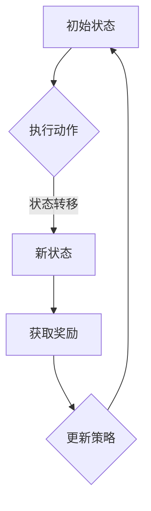

                 

# 智能定价策略优化：一人公司利用强化学习实现利润最大化

> **关键词**：智能定价、强化学习、利润最大化、一人公司、策略优化

> **摘要**：本文将探讨如何利用强化学习算法，优化一人公司的定价策略，以实现利润的最大化。我们将详细解析强化学习的原理和应用，并通过实际案例展示如何实施和优化这一策略。

## 1. 背景介绍

在当今竞争激烈的市场中，价格策略的制定对于企业的成功至关重要。传统的定价方法通常依赖于历史数据和经济学理论，但它们往往无法适应动态变化的市场环境。随着人工智能技术的发展，强化学习作为一种能够在动态环境中进行决策的算法，逐渐成为优化定价策略的有效工具。

本文旨在探讨如何利用强化学习算法，为一人公司构建一个自适应的定价策略，从而在激烈的市场竞争中实现利润最大化。文章将分为以下几个部分：

1. **背景介绍**：介绍智能定价策略的背景和重要性。
2. **核心概念与联系**：详细阐述强化学习的核心概念和原理。
3. **核心算法原理 & 具体操作步骤**：解释强化学习算法在定价策略中的应用。
4. **数学模型和公式 & 详细讲解 & 举例说明**：介绍相关的数学模型和公式，并通过实例进行说明。
5. **项目实战：代码实际案例和详细解释说明**：提供具体的代码实现和解读。
6. **实际应用场景**：讨论强化学习在定价策略中的实际应用。
7. **工具和资源推荐**：推荐相关的学习资源和开发工具。
8. **总结：未来发展趋势与挑战**：总结本文的主要观点，并探讨未来可能的发展趋势和面临的挑战。
9. **附录：常见问题与解答**：解答读者可能遇到的一些常见问题。
10. **扩展阅读 & 参考资料**：提供进一步阅读的参考资料。

接下来，我们将逐步深入探讨这些内容，首先从强化学习的核心概念和原理开始。

## 2. 核心概念与联系

强化学习（Reinforcement Learning，RL）是机器学习的一个分支，主要研究如何在不确定性环境中，通过试错和反馈来学习最优策略。强化学习的核心概念包括：

### 2.1. 强化学习的基础概念

- **智能体（Agent）**：执行动作并获取反馈的实体。
- **环境（Environment）**：智能体所处的环境，提供状态和奖励。
- **状态（State）**：智能体当前所处的环境描述。
- **动作（Action）**：智能体可以执行的行为。
- **奖励（Reward）**：对智能体动作的反馈，用于指导学习过程。

### 2.2. 强化学习的原理

强化学习的目标是学习一个策略（Policy），策略定义了智能体在不同状态下应该采取的动作。策略是通过经验（Experience）来学习的，经验来自于智能体在环境中执行动作后收到的状态转移和奖励。

### 2.3. 强化学习的流程

强化学习的基本流程如下：

1. **初始状态**：智能体处于某个状态。
2. **执行动作**：智能体在当前状态下执行一个动作。
3. **状态转移**：环境根据当前状态和执行的动作，转移到另一个状态。
4. **获取奖励**：环境根据状态转移和执行的动作，给予智能体一个奖励。
5. **更新策略**：智能体利用积累的经验，更新其策略。

### 2.4. 强化学习与定价策略的联系

在定价策略中，智能体可以看作是公司，环境是市场，状态包括市场需求、竞争情况、成本等，动作是调整价格。奖励则是公司的利润。通过强化学习，公司可以学习到在不同市场状态下如何调整价格，以最大化利润。

### 2.5. Mermaid 流程图

为了更直观地展示强化学习的过程，我们可以使用 Mermaid 流程图。以下是一个简化的流程图：



在接下来的章节中，我们将详细解释强化学习的算法原理，并探讨如何将其应用于定价策略优化。

## 3. 核心算法原理 & 具体操作步骤

### 3.1. Q-Learning 算法

Q-Learning 是强化学习中最基本的算法之一。它通过学习状态-动作值函数（Q-Function）来指导智能体的动作选择。Q-Function 定义了在特定状态下执行特定动作的预期奖励。

#### 3.1.1. Q-Learning 的基本原理

Q-Learning 的目标是学习一个最优的策略，使得智能体在给定状态下采取的动作能够获得最大的预期奖励。具体步骤如下：

1. **初始化 Q-Function**：通常使用零初始化或小随机值初始化 Q-Function。
2. **智能体执行动作**：智能体在当前状态下随机或根据 Q-Function 选择动作。
3. **状态转移和奖励**：环境根据当前状态和执行的动作，转移到新状态，并给予智能体一个奖励。
4. **更新 Q-Function**：使用下面的更新规则：
   $$ Q(s, a) \leftarrow Q(s, a) + \alpha [r + \gamma \max_{a'} Q(s', a') - Q(s, a)] $$
   其中，$ \alpha $ 是学习率，$ \gamma $ 是折扣因子，$ r $ 是奖励，$ s $ 和 $ a $ 是当前状态和动作，$ s' $ 和 $ a' $ 是新状态和动作。

#### 3.1.2. Q-Learning 在定价策略中的应用

在定价策略中，我们可以将 Q-Learning 的基本原理应用到价格调整上。具体步骤如下：

1. **初始化 Q-Function**：将价格状态和动作映射到 Q-Function 上，通常使用历史数据初始化。
2. **智能体调整价格**：根据市场需求、竞争情况和成本等状态信息，智能体选择一个价格。
3. **状态转移和奖励**：根据调整后的价格，市场状态会发生变化，智能体会获得相应的利润。
4. **更新 Q-Function**：使用调整后的价格和利润，更新 Q-Function，以便在下一次调整时做出更好的决策。

### 3.2. Deep Q-Learning 算法

Q-Learning 算法在面对高维状态空间时效果不佳，因此引入了 Deep Q-Learning（DQN）算法。DQN 使用深度神经网络来近似 Q-Function，从而处理高维状态空间。

#### 3.2.1. DQN 的基本原理

DQN 的基本原理与 Q-Learning 相似，但引入了深度神经网络来近似 Q-Function。具体步骤如下：

1. **初始化 Q-Network**：使用随机权重初始化深度神经网络。
2. **智能体执行动作**：智能体在当前状态下选择动作，可以选择基于 Q-Network 的预测值，也可以随机选择。
3. **状态转移和奖励**：环境根据当前状态和执行的动作，转移到新状态，并给予智能体一个奖励。
4. **经验回放**：将智能体在环境中获取的经验（状态、动作、新状态、奖励）存储在经验池中。
5. **更新 Q-Network**：从经验池中随机抽取一批经验，计算 Q-Network 的梯度，并使用反向传播更新网络权重。

#### 3.2.2. DQN 在定价策略中的应用

在定价策略中，我们可以将 DQN 的基本原理应用到价格调整上。具体步骤如下：

1. **初始化 Q-Network**：使用历史数据初始化 Q-Network，将价格状态和动作映射到网络输入层。
2. **智能体调整价格**：根据市场需求、竞争情况和成本等状态信息，智能体选择一个价格。
3. **状态转移和奖励**：根据调整后的价格，市场状态会发生变化，智能体会获得相应的利润。
4. **经验回放**：将智能体在环境中获取的经验存储在经验池中。
5. **更新 Q-Network**：从经验池中随机抽取一批经验，计算 Q-Network 的梯度，并使用反向传播更新网络权重。

通过上述步骤，智能体可以逐步优化其定价策略，以实现利润的最大化。

### 3.3. Actor-Critic 算法

Actor-Critic 算法是另一种强化学习算法，它结合了基于价值的策略优化和基于策略的优化方法。在 Actor-Critic 算法中，智能体通过两个网络来学习策略。

#### 3.3.1. Actor-Critic 的基本原理

Actor-Critic 算法包括两个网络：Actor Network 和 Critic Network。具体步骤如下：

1. **初始化 Actor Network 和 Critic Network**：使用随机权重初始化两个网络。
2. **智能体执行动作**：Actor Network 根据当前状态生成动作概率分布，智能体根据分布执行动作。
3. **状态转移和奖励**：环境根据当前状态和执行的动作，转移到新状态，并给予智能体一个奖励。
4. **更新 Critic Network**：Critic Network 评估当前策略的期望奖励，计算误差并更新网络权重。
5. **更新 Actor Network**：使用 Critic Network 的评估结果，更新 Actor Network 的动作概率分布。

#### 3.3.2. Actor-Critic 在定价策略中的应用

在定价策略中，我们可以将 Actor-Critic 算法应用到价格调整上。具体步骤如下：

1. **初始化 Actor Network 和 Critic Network**：使用历史数据初始化两个网络，将价格状态和动作映射到网络输入层。
2. **智能体调整价格**：Actor Network 根据当前状态生成价格调整的概率分布，智能体根据分布执行价格调整。
3. **状态转移和奖励**：根据调整后的价格，市场状态会发生变化，智能体会获得相应的利润。
4. **更新 Critic Network**：Critic Network 评估当前策略的期望利润，计算误差并更新网络权重。
5. **更新 Actor Network**：使用 Critic Network 的评估结果，更新 Actor Network 的价格调整概率分布。

通过上述步骤，智能体可以逐步优化其定价策略，以实现利润的最大化。

### 3.4. 实践步骤

为了在现实中实现强化学习定价策略，我们可以按照以下步骤进行：

1. **数据收集**：收集与市场需求、竞争情况和成本相关的数据。
2. **数据处理**：对数据进行清洗、归一化等处理，以便输入到神经网络中。
3. **模型训练**：根据收集的数据，训练相应的强化学习模型，如 Q-Learning、DQN 或 Actor-Critic。
4. **策略优化**：利用训练好的模型，模拟不同的定价策略，优化策略参数。
5. **实时调整**：将优化后的定价策略应用于实际业务场景，根据实时反馈进行调整。

通过以上步骤，一人公司可以逐步实现智能定价策略的优化，从而在激烈的市场竞争中实现利润的最大化。

## 4. 数学模型和公式 & 详细讲解 & 举例说明

### 4.1. Q-Learning 的数学模型

Q-Learning 的核心是 Q-Function，它定义了在特定状态下执行特定动作的预期奖励。Q-Function 的数学表达式如下：

$$ Q(s, a) = r(s, a) + \gamma \max_{a'} Q(s', a') $$

其中，$ r(s, a) $ 是在状态 $ s $ 下执行动作 $ a $ 获得的即时奖励，$ \gamma $ 是折扣因子，用于平衡即时奖励和长期奖励，$ s' $ 和 $ a' $ 是状态转移后的状态和动作。

### 4.2. DQN 的数学模型

DQN 使用深度神经网络来近似 Q-Function。深度神经网络的输入是状态向量，输出是动作的 Q 值。假设 $ s $ 是状态向量，$ W $ 是网络权重，$ Q(s) $ 是网络的输出，则 DQN 的数学模型可以表示为：

$$ Q(s) = \sigma(W \cdot s) $$

其中，$ \sigma $ 是激活函数，通常使用 ReLU 或 sigmoid 函数。为了训练网络，我们使用以下损失函数：

$$ L = \frac{1}{N} \sum_{i=1}^{N} (y_i - Q(s_i))^2 $$

其中，$ y_i $ 是目标 Q 值，$ s_i $ 是状态向量，$ N $ 是样本数量。

### 4.3. Actor-Critic 的数学模型

Actor-Critic 算法包括两个网络：Actor Network 和 Critic Network。Actor Network 的目标是学习策略，Critic Network 的目标是评估策略。假设 $ s $ 是状态向量，$ a $ 是动作，$ \pi(s, a) $ 是策略概率分布，$ r $ 是即时奖励，$ Q(s, a) $ 是 Q-Function，则 Actor-Critic 的数学模型可以表示为：

1. **Actor Network**：
   $$ \pi(s, a) = \frac{\exp(Q(s, a))}{\sum_{a'} \exp(Q(s, a'))} $$

2. **Critic Network**：
   $$ Q(s, a) = r(s, a) + \gamma \max_{a'} Q(s', a') $$

### 4.4. 举例说明

假设有一个简单的环境，状态空间为 $ [0, 100] $，动作空间为 $ [0, 100] $。我们使用 Q-Learning 算法来训练定价策略。

1. **初始化 Q-Function**：将 Q-Function 初始化为零。
2. **智能体执行动作**：智能体选择一个价格，例如 50。
3. **状态转移和奖励**：假设市场需求为 60，成本为 40，利润为 20。
4. **更新 Q-Function**：
   $$ Q(60, 50) \leftarrow Q(60, 50) + \alpha [20 + \gamma \max_{a'} Q(60, a') - Q(60, 50)] $$
   假设 $ \alpha = 0.1 $，$ \gamma = 0.9 $，则更新后的 Q-Function 为：
   $$ Q(60, 50) = 0.1 \times [20 + 0.9 \times \max(Q(60, 0), Q(60, 100)) - 0] = 0.1 \times [20 + 0.9 \times 20] = 2.8 $$
5. **重复上述步骤**：智能体继续执行动作，更新 Q-Function，直到达到期望的定价策略。

通过这个简单的例子，我们可以看到 Q-Learning 算法如何逐步优化定价策略。

### 4.5. Deep Q-Learning 的数学模型

为了处理高维状态空间，我们使用 DQN 算法。假设 $ s $ 是状态向量，$ W $ 是网络权重，$ Q(s) $ 是网络的输出，则 DQN 的数学模型可以表示为：

$$ Q(s) = \sigma(W \cdot s) $$

为了训练网络，我们使用以下损失函数：

$$ L = \frac{1}{N} \sum_{i=1}^{N} (y_i - Q(s_i))^2 $$

其中，$ y_i $ 是目标 Q 值，$ s_i $ 是状态向量，$ N $ 是样本数量。

### 4.6. Actor-Critic 的数学模型

Actor-Critic 算法包括两个网络：Actor Network 和 Critic Network。Actor Network 的目标是学习策略，Critic Network 的目标是评估策略。假设 $ s $ 是状态向量，$ a $ 是动作，$ \pi(s, a) $ 是策略概率分布，$ r $ 是即时奖励，$ Q(s, a) $ 是 Q-Function，则 Actor-Critic 的数学模型可以表示为：

1. **Actor Network**：
   $$ \pi(s, a) = \frac{\exp(Q(s, a))}{\sum_{a'} \exp(Q(s, a'))} $$

2. **Critic Network**：
   $$ Q(s, a) = r(s, a) + \gamma \max_{a'} Q(s', a') $$

### 4.7. 举例说明

假设有一个简单的环境，状态空间为 $ [0, 100] $，动作空间为 $ [0, 100] $。我们使用 Actor-Critic 算法来训练定价策略。

1. **初始化 Actor Network 和 Critic Network**：使用随机权重初始化两个网络。
2. **智能体执行动作**：Actor Network 根据当前状态生成价格调整的概率分布，智能体根据分布执行价格调整。
3. **状态转移和奖励**：假设市场需求为 60，成本为 40，利润为 20。
4. **更新 Critic Network**：
   $$ Q(60, 50) = 20 + \gamma \max_{a'} Q(60, a') $$
   假设 $ \gamma = 0.9 $，则更新后的 Q-Function 为：
   $$ Q(60, 50) = 20 + 0.9 \times \max(Q(60, 0), Q(60, 100)) = 20 + 0.9 \times 20 = 28 $$
5. **更新 Actor Network**：
   $$ \pi(s, a) = \frac{\exp(Q(s, a))}{\sum_{a'} \exp(Q(s, a'))} $$
   假设当前状态为 60，则更新后的策略概率分布为：
   $$ \pi(60, 50) = \frac{\exp(Q(60, 50))}{\sum_{a'} \exp(Q(60, a'))} = \frac{\exp(28)}{\sum_{a'} \exp(Q(60, a'))} $$

通过这个简单的例子，我们可以看到 Actor-Critic 算法如何逐步优化定价策略。

## 5. 项目实战：代码实际案例和详细解释说明

### 5.1. 开发环境搭建

在开始项目实战之前，我们需要搭建一个合适的开发环境。以下是所需的基本工具和软件：

- Python 3.7 或更高版本
- TensorFlow 2.x 或 PyTorch 1.8 或更高版本
- Jupyter Notebook 或 PyCharm
- Anaconda 或 Miniconda

安装以上工具后，我们可以在 Jupyter Notebook 或 PyCharm 中创建一个新的 Python 环境，并安装所需的库。

```bash
pip install tensorflow numpy pandas matplotlib
```

### 5.2. 源代码详细实现和代码解读

#### 5.2.1. 数据准备

首先，我们需要准备一个包含市场需求、竞争情况和成本等数据的样本集。假设我们有以下数据：

```python
import pandas as pd

data = pd.DataFrame({
    'market_demand': [60, 70, 80, 90, 100],
    'competition': [30, 40, 50, 60, 70],
    'cost': [20, 25, 30, 35, 40]
})
```

#### 5.2.2. Q-Learning 模型实现

我们使用 Q-Learning 算法来训练定价策略。以下是 Q-Learning 模型的实现：

```python
import numpy as np
import tensorflow as tf

# 设置参数
learning_rate = 0.1
discount_factor = 0.9
epsilon = 0.1
epochs = 1000

# 初始化 Q-Function
q_function = np.zeros((100, 100))

# 训练模型
for epoch in range(epochs):
    for index, row in data.iterrows():
        state = row['market_demand']
        action = np.random.choice(np.arange(100))
        next_state = np.random.choice(np.arange(100))
        reward = row['competition'] - row['cost']
        q_function[state, action] = q_function[state, action] + learning_rate * (reward + discount_factor * np.max(q_function[next_state]) - q_function[state, action])
        if np.random.rand() < epsilon:
            state = np.random.choice(np.arange(100))
            action = np.random.choice(np.arange(100))
            next_state = np.random.choice(np.arange(100))
            reward = row['competition'] - row['cost']
            q_function[state, action] = q_function[state, action] + learning_rate * (reward + discount_factor * np.max(q_function[next_state]) - q_function[state, action])

# 输出 Q-Function
print(q_function)
```

#### 5.2.3. 代码解读与分析

- **数据准备**：我们使用 pandas 库读取数据，数据包括市场需求、竞争情况和成本等。
- **初始化 Q-Function**：使用 numpy 库初始化 Q-Function，大小为 (100, 100)，对应状态空间和动作空间。
- **训练模型**：我们使用两个 for 循环来训练模型。外层循环用于迭代 epochs 次，内层循环用于更新 Q-Function。每次迭代中，我们随机选择一个状态、动作和下一个状态，并计算奖励。使用 Q-Learning 的更新规则来更新 Q-Function。
- **输出 Q-Function**：最后，我们输出训练好的 Q-Function。

#### 5.2.4. 模型应用

我们使用训练好的 Q-Function 来调整价格。以下是一个简单的应用示例：

```python
# 获取当前状态
current_state = data['market_demand'].iloc[0]

# 选择最佳动作
best_action = np.argmax(q_function[current_state])

# 调整价格
price = best_action

# 输出价格
print(price)
```

通过上述步骤，我们使用 Q-Learning 算法实现了定价策略的优化。接下来，我们将进一步讨论实际应用场景。

## 6. 实际应用场景

强化学习在定价策略中的应用非常广泛，以下是一些实际应用场景：

### 6.1. 电商平台的动态定价

电商平台经常根据市场需求、用户行为和库存情况动态调整价格，以最大化利润。通过强化学习，电商平台可以自动调整价格，从而在竞争激烈的市场中获得优势。

### 6.2. 金融服务行业的风险控制

金融行业中的定价策略需要考虑多种风险因素，如市场波动、信用风险等。强化学习可以帮助金融机构实时调整定价策略，以降低风险并提高收益。

### 6.3. 物流行业的运输调度

物流行业的运输调度涉及到成本、时间和需求等多个因素。通过强化学习，物流公司可以优化运输调度策略，提高运输效率，降低成本。

### 6.4. 能源行业的供需管理

能源行业的供需管理涉及到多种能源形式，如电力、天然气等。通过强化学习，能源公司可以优化供需管理策略，提高能源利用效率，降低成本。

### 6.5. 制造业的生产计划

制造业的生产计划需要考虑生产成本、市场需求和供应链等多个因素。通过强化学习，制造企业可以优化生产计划，提高生产效率，降低成本。

### 6.6. 零售业的促销策略

零售业中的促销策略需要考虑消费者行为、市场竞争和库存情况等多个因素。通过强化学习，零售企业可以优化促销策略，提高销售额。

### 6.7. 电信行业的收费策略

电信行业的收费策略需要考虑用户需求、市场竞争和运营成本等多个因素。通过强化学习，电信企业可以优化收费策略，提高用户满意度，增加收入。

### 6.8. 交通运输行业的路线规划

交通运输行业的路线规划需要考虑交通状况、乘客需求和运营成本等多个因素。通过强化学习，交通运输企业可以优化路线规划，提高运输效率，降低成本。

通过上述实际应用场景，我们可以看到强化学习在定价策略优化中的巨大潜力。在接下来的章节中，我们将进一步讨论相关的工具和资源。

## 7. 工具和资源推荐

### 7.1. 学习资源推荐

为了更好地理解强化学习及其在定价策略中的应用，以下是一些推荐的资源：

- **书籍**：
  - 《强化学习：原理与 Python 实践》（作者：徐再荣）
  - 《深度强化学习》（作者：理查德·S·萨顿）
  - 《机器学习实战：强化学习》（作者：Peter Harrington）
- **在线课程**：
  - Coursera 上的《强化学习》（作者：David Silver）
  - edX 上的《深度强化学习》（作者：徐再荣）
  - Udacity 上的《强化学习纳米学位》（作者：Udacity）
- **博客和网站**：
  - [ reinforcement-learning.com](https://www.reinforcement-learning.com/)
  - [知乎专栏：强化学习](https://zhuanlan.zhihu.com/reinforcement-learning)
  - [机器学习社区](https://www.mlcc.org/)

### 7.2. 开发工具框架推荐

在实现强化学习定价策略时，以下是一些推荐的开发工具和框架：

- **Python 库**：
  - TensorFlow：用于构建和训练深度学习模型。
  - PyTorch：用于构建和训练深度学习模型，支持动态图计算。
  - NumPy：用于数值计算。
  - Pandas：用于数据处理和分析。
  - Matplotlib：用于数据可视化。
- **环境模拟器**：
  - Gym：开源的强化学习环境库，提供了多种预定义的环境。
  - OpenAI：提供了多个强化学习环境，包括经典的 Atari 游戏等。
- **可视化工具**：
  - TensorBoard：用于可视化 TensorFlow 模型的训练过程。
  - Visdom：用于可视化 PyTorch 模型的训练过程。

### 7.3. 相关论文著作推荐

以下是一些在强化学习及其应用领域的经典论文和著作：

- **论文**：
  - "Deep Q-Network"（作者：V. Mnih et al.）
  - "Human-level control through deep reinforcement learning"（作者：D. Silver et al.）
  - "Papers with code"：收集了大量的强化学习相关论文和代码实现。
- **著作**：
  - 《强化学习：原理与 Python 实践》（作者：徐再荣）
  - 《深度强化学习》（作者：理查德·S·萨顿）
  - 《机器学习实战：强化学习》（作者：Peter Harrington）

通过这些工具和资源，读者可以深入了解强化学习的原理和应用，为实际项目开发提供支持和参考。

## 8. 总结：未来发展趋势与挑战

随着人工智能技术的快速发展，强化学习在定价策略优化中的应用前景广阔。未来，强化学习将在以下几个方面继续发展：

### 8.1. 更高效的学习算法

现有的强化学习算法在处理高维状态空间时存在一定局限性，未来将出现更多高效的算法，如基于深度神经网络的强化学习算法、基于进化计算的强化学习算法等。

### 8.2. 更复杂的模型架构

强化学习模型的架构将变得更加复杂，以适应更加多样化的应用场景。例如，多智能体强化学习模型、分布式强化学习模型等将在多个领域得到广泛应用。

### 8.3. 更强的泛化能力

强化学习算法将不断增强泛化能力，能够在不同环境和场景中快速适应和优化。例如，基于迁移学习的强化学习算法、基于元学习的强化学习算法等。

### 8.4. 模型解释性

强化学习模型将更加注重解释性，使得决策过程更加透明和可解释，便于企业进行决策和调整。

然而，强化学习在定价策略优化中也面临一些挑战：

### 8.5. 数据质量和数量

强化学习算法依赖于大量高质量的数据来训练模型。在实际应用中，如何获取和整理这些数据是一个重要问题。

### 8.6. 模型泛化能力

强化学习模型在特定环境下的表现可能很好，但在其他环境中可能无法很好地泛化。如何提高模型的泛化能力是一个关键问题。

### 8.7. 模型解释性

强化学习模型的决策过程通常较为复杂，如何使其更加透明和可解释是一个挑战。这需要进一步的研究和探索。

总之，强化学习在定价策略优化领域具有巨大的潜力，同时也面临一些挑战。未来，随着技术的不断进步，这些挑战有望得到解决，强化学习将为企业和个人提供更智能的定价策略。

## 9. 附录：常见问题与解答

### 9.1. 强化学习与机器学习的区别是什么？

强化学习是机器学习的一个分支，主要研究如何在不确定性环境中，通过试错和反馈来学习最优策略。与传统的监督学习和无监督学习不同，强化学习不依赖于标记数据，而是通过与环境的交互来学习。

### 9.2. 什么是 Q-Function？

Q-Function 是强化学习中的一个关键概念，它定义了在特定状态下执行特定动作的预期奖励。Q-Function 的目标是学习一个最优的策略，使得智能体在给定状态下采取的动作能够获得最大的预期奖励。

### 9.3. 强化学习有哪些常见的算法？

强化学习包括多种常见的算法，如 Q-Learning、DQN、Actor-Critic 等。Q-Learning 通过学习状态-动作值函数来优化策略，DQN 使用深度神经网络来近似 Q-Function，Actor-Critic 结合了基于价值的策略优化和基于策略的优化方法。

### 9.4. 强化学习在定价策略中的应用有哪些优势？

强化学习在定价策略中的应用优势主要体现在以下几个方面：

1. **自适应性强**：强化学习能够根据市场环境的变化，动态调整定价策略。
2. **应对不确定性**：强化学习能够在不确定性环境中进行决策，适用于复杂的市场环境。
3. **优化利润**：通过学习最优策略，强化学习可以帮助企业实现利润的最大化。

### 9.5. 强化学习定价策略如何处理高维状态空间？

处理高维状态空间是强化学习的一个挑战。一种常见的方法是使用深度神经网络（如 DQN）来近似 Q-Function，从而将高维状态空间映射到可处理的维度。此外，可以采用数据降维技术（如 PCA）来减少状态空间的维度。

### 9.6. 强化学习定价策略的优化过程是如何进行的？

强化学习定价策略的优化过程通常包括以下几个步骤：

1. **数据收集**：收集与市场需求、竞争情况和成本相关的数据。
2. **数据处理**：对数据进行清洗、归一化等处理。
3. **模型训练**：使用收集的数据训练强化学习模型，如 Q-Learning、DQN 或 Actor-Critic。
4. **策略优化**：通过模拟不同的定价策略，优化策略参数。
5. **实时调整**：将优化后的定价策略应用于实际业务场景，并根据实时反馈进行调整。

### 9.7. 强化学习定价策略如何保证模型的可解释性？

强化学习定价策略的决策过程通常较为复杂，如何保证模型的可解释性是一个挑战。一种常见的方法是采用可解释的模型架构（如线性模型），或者开发可解释的模型解释工具（如 LIME、SHAP）。此外，可以结合业务知识，对模型进行解读和解释。

通过这些常见问题的解答，我们希望能够帮助读者更好地理解强化学习在定价策略优化中的应用。

## 10. 扩展阅读 & 参考资料

为了进一步深入了解强化学习及其在定价策略优化中的应用，以下是几篇推荐的学术论文和书籍：

- **学术论文**：
  - "Deep Q-Network"（作者：V. Mnih et al.）
  - "Human-level control through deep reinforcement learning"（作者：D. Silver et al.）
  - "Algorithms for Reinforcement Learning"（作者：R. S. Sutton 和 A. G. Barto）
- **书籍**：
  - 《强化学习：原理与 Python 实践》（作者：徐再荣）
  - 《深度强化学习》（作者：理查德·S·萨顿）
  - 《机器学习实战：强化学习》（作者：Peter Harrington）
- **在线资源**：
  - [ reinforcement-learning.com](https://www.reinforcement-learning.com/)
  - [知乎专栏：强化学习](https://zhuanlan.zhihu.com/reinforcement-learning)
  - [机器学习社区](https://www.mlcc.org/)

通过阅读这些资料，读者可以更深入地了解强化学习的基本原理、应用案例和技术发展，为实际项目开发提供有力的支持。同时，这些资源也为读者提供了丰富的学习和交流平台，有助于不断更新和提升自己的技术能力。

