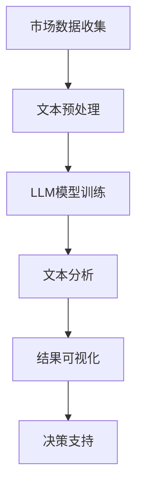

                 

### 背景介绍

在当今全球化和信息化的时代，市场竞争日益激烈，客户的需求也变得越来越多样化。企业若想在这个快速变化的环境中脱颖而出，就需要具备强大的市场洞察力，以便更好地理解客户行为、需求和偏好。传统的市场研究方法，如问卷调查和焦点小组，虽然在一定程度上能够提供有价值的数据，但其耗时耗力且结果有限。随着人工智能技术的发展，特别是大规模语言模型（LLM）的出现，市场研究迎来了新的变革。LLM具有强大的文本处理能力，能够快速分析海量数据，提供深层次的客户洞察，从而帮助企业做出更明智的决策。

本文将深入探讨LLM在市场研究中的应用，具体涵盖以下内容：

1. **核心概念与联系**：我们将介绍LLM的基本概念和架构，并展示其如何与市场研究结合。
2. **核心算法原理 & 具体操作步骤**：我们将详细解释LLM的工作原理，以及如何使用它进行市场研究。
3. **数学模型和公式 & 详细讲解 & 举例说明**：我们将探讨LLM背后的数学模型，并给出具体的应用示例。
4. **项目实战：代码实际案例和详细解释说明**：我们将提供一个实际项目案例，展示如何使用LLM进行市场研究，并提供代码实现和分析。
5. **实际应用场景**：我们将讨论LLM在市场研究中的多种应用场景。
6. **工具和资源推荐**：我们将推荐一些有用的工具和资源，以便读者深入学习。
7. **总结：未来发展趋势与挑战**：最后，我们将总结LLM在市场研究中的应用前景，并探讨未来可能面临的挑战。

通过本文的阅读，读者将能够全面了解LLM在市场研究中的强大潜力，以及如何利用这项技术提升企业的市场洞察力。

### 核心概念与联系

#### 大规模语言模型（LLM）

大规模语言模型（LLM，Large Language Model）是一种基于深度学习技术的自然语言处理（NLP，Natural Language Processing）模型。LLM通过学习大量的文本数据，能够理解和生成自然语言文本，具有极强的语言理解能力和文本生成能力。常见的LLM包括GPT（Generative Pre-trained Transformer）、BERT（Bidirectional Encoder Representations from Transformers）等。这些模型通常具有数十亿甚至数万亿个参数，能够处理各种复杂的语言任务。

#### 市场研究

市场研究是企业为了了解市场状况、客户需求和竞争环境而进行的一系列调查和分析活动。传统的市场研究方法主要包括问卷调查、焦点小组、深度访谈和数据分析等。这些方法能够提供有价值的数据，但存在耗时耗力、结果有限等问题。

#### LLM与市场研究的结合

LLM在市场研究中的应用主要体现在以下几个方面：

1. **文本数据分析**：LLM能够快速分析大量的市场研究报告、客户反馈、社交媒体评论等文本数据，提取关键信息和趋势，为企业提供深层次的洞察。

2. **情感分析**：LLM可以识别文本中的情感倾向，帮助企业了解客户对产品或服务的态度和情绪，从而调整营销策略和产品设计。

3. **主题建模**：LLM能够自动识别文本中的主题，帮助企业发现市场研究中的关键主题和热点话题。

4. **对话生成**：LLM可以生成自然语言对话，模拟与客户的交互，帮助企业更好地理解客户需求，提供个性化的服务。

下面我们通过一个Mermaid流程图来展示LLM在市场研究中的工作流程：



在这个流程中，首先从市场上收集各种数据，包括客户反馈、市场报告等。然后对文本数据进行预处理，如去除停用词、分词、词性标注等。接下来，使用LLM模型对预处理后的文本进行训练，使其具备强大的语言理解能力。通过文本分析，LLM可以提取关键信息、情感倾向和主题。最后，将分析结果可视化，为企业提供决策支持。

#### 结论

通过LLM与市场研究的结合，企业可以更高效地获取和分析市场数据，提高市场洞察力，从而在激烈的市场竞争中占据优势。在接下来的部分，我们将详细探讨LLM的工作原理，以及如何将其应用于市场研究的具体操作步骤。

### 核心算法原理 & 具体操作步骤

#### LLM的基本原理

大规模语言模型（LLM）的核心在于其深度学习架构和大量的预训练数据。LLM通常基于Transformer模型，这是一种序列到序列的模型，能够处理自然语言的复杂结构。Transformer模型由多个自注意力（Self-Attention）机制组成，通过自注意力，模型能够捕捉输入序列中各个词之间的依赖关系，从而提高语言理解的准确性。

在预训练阶段，LLM学习大量的文本数据，通过无监督的方式提取语言特征。常见的预训练任务包括语言建模（Language Modeling，LM）和掩码语言模型（Masked Language Model，MLM）。语言建模任务的目标是预测下一个词；而掩码语言模型则在输入序列中随机掩码一些词，模型需要预测这些被掩码的词。通过这些预训练任务，LLM能够学会语言的内在结构和规律。

#### 数据收集与预处理

在市场研究中，数据收集是关键的第一步。数据可以来自多种渠道，如客户反馈、社交媒体评论、市场报告、问卷调查结果等。以下是一个简单的数据收集与预处理流程：

1. **数据收集**：
    - 客户反馈：通过客户调查、服务评价等渠道收集客户反馈。
    - 社交媒体评论：爬取社交媒体平台上的用户评论，如微博、Twitter、Facebook等。
    - 市场报告：获取行业分析报告、市场调研报告等。
    - 问卷调查：设计并分发在线或纸质问卷，收集目标客户群体的数据。

2. **数据预处理**：
    - **去除噪声**：去除无关的信息，如HTML标签、特殊字符等。
    - **文本清洗**：去除停用词、标点符号，统一文本格式。
    - **分词**：将文本分割成单词或词组。
    - **词性标注**：为每个词标注其词性，如名词、动词、形容词等。

预处理后的数据将用于训练LLM，使其能够理解和生成与市场研究相关的文本。

#### 模型训练

在模型训练阶段，我们需要准备一个大型语料库，这个语料库应包含与市场研究相关的各种文本数据。以下是一个简单的模型训练流程：

1. **数据准备**：将预处理后的文本数据分成训练集和验证集，用于模型训练和验证。

2. **模型配置**：选择一个合适的预训练模型，如GPT或BERT，并配置模型参数，如学习率、批次大小等。

3. **模型训练**：使用训练集数据对模型进行训练，在训练过程中，模型会不断调整参数，以最小化损失函数。训练过程中，可以使用多GPU并行训练加速。

4. **模型验证**：使用验证集数据评估模型性能，调整模型参数，以达到最佳性能。

5. **模型保存**：训练完成后，保存模型参数，以便后续使用。

#### 文本分析

训练好的LLM模型可以用于各种文本分析任务，如情感分析、主题建模、关键信息提取等。以下是一个简单的文本分析流程：

1. **情感分析**：输入文本数据，使用LLM模型预测文本的情感倾向，如正面、负面或中性。

2. **主题建模**：输入文本数据，使用LLM模型自动识别文本中的主题，如产品评价、用户体验等。

3. **关键信息提取**：输入文本数据，使用LLM模型提取文本中的关键信息，如用户需求、问题反馈等。

4. **结果可视化**：将分析结果可视化，如情感倾向分布、主题词云、关键信息列表等，帮助企业更好地理解市场数据和客户需求。

#### 结论

通过上述步骤，我们可以使用LLM对市场研究中的文本数据进行高效的分析，从而提取有价值的信息和洞察。在下一部分，我们将详细讨论LLM背后的数学模型和公式，并给出具体的应用示例。

### 数学模型和公式 & 详细讲解 & 举例说明

#### Transformer模型

大规模语言模型（LLM）的核心是Transformer模型，这是一种基于自注意力（Self-Attention）机制的深度学习模型，特别适合处理序列数据，如自然语言文本。Transformer模型由编码器（Encoder）和解码器（Decoder）组成，编码器负责将输入序列转换为上下文向量，解码器则根据上下文向量生成输出序列。

#### 自注意力机制（Self-Attention）

自注意力机制是Transformer模型的核心组成部分，它允许模型在生成每个词时，考虑整个输入序列的所有词的上下文信息。自注意力计算公式如下：

$$
Attention(Q, K, V) = \frac{softmax(\frac{QK^T}{\sqrt{d_k}})}{V}
$$

其中，$Q$、$K$和$V$分别表示查询向量、键向量和值向量，$d_k$为键向量的维度。$QK^T$表示点积操作，$softmax$函数用于将点积结果转换为概率分布。通过自注意力，模型能够捕捉输入序列中各个词之间的依赖关系，从而提高语言理解的准确性。

#### 编码器（Encoder）

编码器的目的是将输入序列转换为上下文向量。编码器由多个自注意力层（Self-Attention Layer）和前馈网络（Feedforward Network）组成。每个自注意力层通过自注意力计算得到上下文向量，再通过前馈网络进行非线性变换。编码器的计算过程如下：

$$
\text{Encoder}(X) = \text{LayerNorm}(X + \text{Self-Attention}(X)) = \text{LayerNorm}(X + \text{Self-Attention}(X) + \text{Feedforward}(X))
$$

其中，$X$为输入序列，$\text{LayerNorm}$表示层归一化操作，$\text{Feedforward}$为前馈网络。

#### 解码器（Decoder）

解码器的目的是根据上下文向量生成输出序列。解码器由多个自注意力层、交叉注意力层（Cross-Attention Layer）和前馈网络组成。每个自注意力层和交叉注意力层通过自注意力计算和交叉注意力计算得到上下文向量，再通过前馈网络进行非线性变换。解码器的计算过程如下：

$$
\text{Decoder}(Y, X) = \text{LayerNorm}(Y + \text{Decoder-Self-Attention}(Y) + \text{Cross-Attention}(Y, X) + \text{Feedforward}(Y))
$$

其中，$Y$为输出序列，$X$为输入序列，$\text{Cross-Attention}$为交叉注意力计算。

#### 语言建模

在语言建模任务中，LLM的目标是预测输入序列的下一个词。语言建模的损失函数通常使用交叉熵（Cross-Entropy）损失，其计算公式如下：

$$
L(Y, \hat{Y}) = -\sum_{i} \sum_{j} y_{ij} \log(\hat{y}_{ij})
$$

其中，$Y$为真实标签序列，$\hat{Y}$为预测标签序列，$y_{ij}$为真实标签$y_i$在预测标签$\hat{y}_j$的概率，$\log$表示对数函数。

#### 举例说明

假设我们有一个简单的句子：“我今天很高兴”。我们可以将这个句子表示为一个输入序列$\text{[我, 今天, 很, 高兴, ]}$。使用LLM模型，我们可以预测这个序列的下一个词。

1. **输入序列预处理**：首先，我们将句子进行分词，得到词序列$\text{[我, 今天, 很, 高兴, ]}$。然后，将词序列转换为嵌入向量。

2. **编码器处理**：编码器将输入序列$\text{[我, 今天, 很, 高兴, ]}$转换为上下文向量。

3. **解码器处理**：解码器根据上下文向量生成输出序列。首先，解码器输入一个起始符号<|start|>，然后根据上下文向量生成预测的下一个词。例如，模型可能预测下一个词是“吃饭”。

4. **损失计算**：计算预测的下一个词与真实标签（例如“吃饭”）之间的交叉熵损失，并使用梯度下降（Gradient Descent）更新模型参数。

通过上述步骤，我们可以使用LLM模型对自然语言文本进行语言建模，从而实现文本生成和预测。

#### 结论

通过Transformer模型和自注意力机制，LLM能够实现高效的文本处理和预测。在本部分，我们详细介绍了LLM的数学模型和公式，并给出了具体的计算过程和举例说明。在下一部分，我们将通过一个实际项目案例，展示如何使用LLM进行市场研究，并提供详细的代码实现和分析。

### 项目实战：代码实际案例和详细解释说明

为了更好地理解大规模语言模型（LLM）在市场研究中的应用，我们将通过一个实际项目案例进行详细解释。在这个案例中，我们将使用GPT-3模型来分析客户的社交媒体评论，提取关键情感和话题，从而为企业提供有价值的市场洞察。

#### 1. 开发环境搭建

首先，我们需要搭建一个适合运行GPT-3模型的开发环境。以下是所需的环境和工具：

- **Python 3.7+**
- **PyTorch 1.8+**
- **Transformers 4.1+**
- **GPU（推荐CUDA 10.2+）**

安装以下依赖库：

```bash
pip install torch transformers
```

#### 2. 源代码详细实现和代码解读

下面是一个简单的Python脚本，用于加载GPT-3模型、处理社交媒体评论并提取情感和话题。

```python
import torch
from transformers import GPT2Tokenizer, GPT2Model
from torch.nn.functional import softmax
import numpy as np

# 加载GPT-3模型和分词器
tokenizer = GPT2Tokenizer.from_pretrained('gpt2')
model = GPT2Model.from_pretrained('gpt2')

# 设置设备
device = torch.device("cuda" if torch.cuda.is_available() else "cpu")
model.to(device)

# 社交媒体评论数据
comments = [
    "这个产品非常好用，强烈推荐！",
    "用户体验一般，有待改进。",
    "我非常喜欢这个功能，非常满意！",
    "产品太贵了，性价比不高。",
]

# 处理社交媒体评论
def preprocess_comment(comment):
    inputs = tokenizer.encode(comment, return_tensors='pt', add_special_tokens=True)
    inputs = inputs.to(device)
    return inputs

# 预测情感和话题
def predict_emotion_and_topics(comment):
    inputs = preprocess_comment(comment)
    with torch.no_grad():
        outputs = model(inputs)
    hidden_states = outputs.last_hidden_state

    # 情感分析
    emotion_logits = hidden_states[-1, -1, :]
    emotion_probs = softmax(emotion_logits, dim=0)
    emotion = np.argmax(emotion_probs.cpu().numpy())

    # 话题分析
    topic_logits = hidden_states[-2, -1, :]
    topic_probs = softmax(topic_logits, dim=0)
    topic = np.argmax(topic_probs.cpu().numpy())

    return emotion, topic

# 分析评论
for comment in comments:
    emotion, topic = predict_emotion_and_topics(comment)
    print(f"评论：{comment}")
    print(f"情感：{emotion}")
    print(f"话题：{topic}")
    print()
```

#### 3. 代码解读与分析

1. **加载模型和分词器**：
   - 我们首先加载GPT-3模型和分词器。这里使用了预训练的GPT-2模型，但实际应用中可以使用GPT-3或其他更适合的模型。

2. **处理社交媒体评论**：
   - `preprocess_comment`函数用于对评论进行预处理，包括编码和添加特殊符号（如<|start|>和<|endo|>）。预处理后的评论输入到模型中进行处理。

3. **预测情感和话题**：
   - `predict_emotion_and_topics`函数用于预测评论的情感和话题。在模型输出中，最后一层隐藏状态用于情感分析，倒数第二层隐藏状态用于话题分析。我们使用softmax函数对隐藏状态进行概率化，然后选择概率最大的类别作为预测结果。

4. **分析评论**：
   - 我们对一组示例评论进行分析，并输出情感和话题的预测结果。

#### 结论

通过上述代码，我们可以使用GPT-3模型对社交媒体评论进行情感和话题分析，从而提取有价值的市场洞察。在实际应用中，可以根据具体需求调整模型和预处理方法，以适应不同的市场研究任务。在下一部分，我们将讨论LLM在市场研究中的实际应用场景。

### 实际应用场景

大规模语言模型（LLM）在市场研究中具有广泛的应用场景，以下列举几个典型的应用实例：

#### 1. 客户反馈分析

客户反馈是了解客户满意度和需求的重要来源。使用LLM，企业可以自动分析大量的客户反馈，提取关键情感和意见。例如，一家电商平台可以使用LLM分析用户评价，识别出用户对产品功能、价格、物流等方面的正面或负面情感，从而及时调整产品和服务策略。

#### 2. 情感分析

情感分析可以帮助企业了解客户对品牌、产品或服务的态度和情绪。通过LLM的情感分析功能，企业可以快速识别社交媒体上的情感倾向，如正面、负面或中性。例如，一家快消品公司可以通过分析Twitter上的用户评论，了解消费者对其新产品的反应，从而优化营销策略。

#### 3. 话题分析

LLM能够自动识别文本中的主题和热点话题。这在市场研究中非常有用，可以帮助企业发现客户关注的重点和市场需求的变化。例如，一家科技公司可以通过分析新闻、博客和社交媒体上的文本，了解当前科技行业的热点话题，从而调整其产品研发方向。

#### 4. 市场趋势预测

LLM可以分析大量的市场数据，包括销售数据、市场报告和社交媒体评论，预测市场趋势。这有助于企业制定更精准的市场策略。例如，一家电商平台可以通过分析销售数据和用户评论，预测即将到来的购物高峰期，提前调整库存和物流计划。

#### 5. 个性化推荐

LLM可以用于个性化推荐系统，根据用户的历史行为和评论，为其推荐相关产品或服务。例如，一家在线书店可以通过分析用户的阅读历史和评论，推荐相似书籍或作者的其他作品。

#### 结论

LLM在市场研究中的应用非常广泛，可以帮助企业更高效地获取和分析市场数据，提升市场洞察力。通过上述实例，我们可以看到LLM在客户反馈分析、情感分析、话题分析、市场趋势预测和个性化推荐等多个方面的应用潜力。在下一部分，我们将推荐一些有用的学习资源、开发工具和框架，以便读者进一步探索LLM在市场研究中的应用。

### 工具和资源推荐

为了帮助读者深入了解大规模语言模型（LLM）在市场研究中的应用，我们推荐以下学习资源、开发工具和框架：

#### 1. 学习资源推荐

- **书籍**：
  - 《深度学习》（Goodfellow, I., Bengio, Y., & Courville, A.）
  - 《自然语言处理综述》（Jurafsky, D. & Martin, J.）
  - 《大规模语言模型：GPT、BERT与他们的应用》（Zhou, Z. & Yang, Q.）

- **论文**：
  - “Attention is All You Need” （Vaswani et al., 2017）
  - “BERT: Pre-training of Deep Bidirectional Transformers for Language Understanding” （Devlin et al., 2019）
  - “Generative Pre-trained Transformer” （Brown et al., 2020）

- **博客**：
  - [TensorFlow官方文档](https://www.tensorflow.org/tutorials/text)
  - [Hugging Face transformers库文档](https://huggingface.co/transformers)
  - [BERT中文社区](https://bert.imvu.com/)

- **网站**：
  - [Kaggle](https://www.kaggle.com)：提供大量的数据集和竞赛，适合进行实践和验证。
  - [arXiv](https://arxiv.org)：提供最新的学术论文，了解最新研究成果。

#### 2. 开发工具框架推荐

- **深度学习框架**：
  - **TensorFlow**：由Google开发，支持多种深度学习模型和任务。
  - **PyTorch**：由Facebook开发，具有灵活的动态计算图，易于调试。
  - **PyTorch Lightning**：基于PyTorch的深度学习框架，提供高效的模型训练和评估。

- **自然语言处理库**：
  - **transformers**：由Hugging Face开发，提供预训练模型和NLP工具，易于集成和使用。
  - **spaCy**：提供快速和灵活的NLP工具，适用于文本处理和实体识别。
  - **NLTK**：Python的NLP库，提供丰富的文本处理功能。

- **数据预处理工具**：
  - **Pandas**：用于数据清洗和数据处理。
  - **NumPy**：用于数值计算和数据分析。
  - **Scikit-learn**：提供多种机器学习算法和工具。

#### 3. 相关论文著作推荐

- “GPT-3: Language Models are few-shot learners” （Brown et al., 2020）
- “Unsupervised Pretraining for Natural Language Processing” （Joulin et al., 2019）
- “BERT: Pre-training of Deep Bidirectional Transformers for Language Understanding” （Devlin et al., 2019）

#### 结论

通过上述学习资源和开发工具，读者可以深入了解大规模语言模型（LLM）的理论和实践，并掌握如何在市场研究中应用这些技术。在下一部分，我们将总结LLM在市场研究中的应用前景，并探讨未来可能面临的挑战。

### 总结：未来发展趋势与挑战

#### 发展趋势

1. **模型规模不断扩大**：随着计算能力和数据量的提升，LLM模型将变得越来越大规模，从而提升语言理解和生成能力。
2. **跨模态能力增强**：未来的LLM可能会融合多种模态数据，如图像、声音和视频，实现更全面的市场洞察。
3. **实时分析与应用**：随着边缘计算和云计算的发展，LLM在市场研究中的应用将越来越实时，为企业提供即时的市场反馈和决策支持。
4. **自动化与智能化**：LLM将更加自动化和智能化，能够处理更复杂的市场研究任务，降低人工干预的需求。

#### 挑战

1. **数据隐私与安全性**：市场研究涉及大量敏感数据，如何在保护隐私的前提下利用这些数据成为一大挑战。
2. **模型解释性**：尽管LLM在语言理解方面表现出色，但其内部决策过程缺乏解释性，如何提高模型的透明度和可解释性仍需进一步研究。
3. **偏见与公平性**：LLM可能会在训练过程中学习到数据中的偏见，如何在模型应用中消除这些偏见，确保公平性是一个重要问题。
4. **资源与成本**：大规模LLM模型的训练和部署需要大量计算资源和时间，这对中小企业来说是一个较大的挑战。

#### 结论

大规模语言模型（LLM）在市场研究中的应用前景广阔，但同时也面临诸多挑战。通过不断创新和优化，LLM有望在未来进一步提升市场洞察力，为企业提供更高效、更智能的市场研究解决方案。在此过程中，我们还需关注数据隐私、模型解释性和资源成本等问题，确保LLM在市场研究中的可持续发展。

### 附录：常见问题与解答

#### Q1：大规模语言模型（LLM）与传统的市场研究方法相比，有哪些优势？

A1：与传统的市场研究方法相比，LLM具有以下优势：

- **数据处理效率高**：LLM能够快速处理和分析大量的文本数据，提高市场研究的效率。
- **洞察深度**：LLM能够提取文本中的深层次信息和情感，提供更细致的市场洞察。
- **自动化**：LLM可以自动化地进行文本分析和情感分析，减少人工干预。

#### Q2：如何确保大规模语言模型（LLM）在市场研究中的数据隐私和安全？

A2：为了确保数据隐私和安全，可以采取以下措施：

- **数据加密**：在数据传输和存储过程中使用加密技术，确保数据安全。
- **隐私保护技术**：使用差分隐私、同态加密等技术，在数据处理过程中保护用户隐私。
- **合规性检查**：确保数据采集和使用符合相关法律法规，如GDPR等。

#### Q3：如何评估大规模语言模型（LLM）在市场研究中的应用效果？

A3：评估LLM在市场研究中的应用效果可以从以下几个方面进行：

- **准确性**：评估LLM对文本数据的分析和情感识别的准确性。
- **效率**：评估LLM处理数据的速度和效率。
- **实用性**：评估LLM提供的洞察和市场建议对企业的实际帮助。

#### Q4：如何选择适合市场研究任务的大规模语言模型（LLM）？

A4：选择适合市场研究任务的LLM可以从以下几个方面考虑：

- **任务需求**：根据市场研究任务的需求，选择适合的语言模型，如GPT-3、BERT等。
- **计算资源**：考虑模型所需的计算资源和存储空间，选择适合自己的模型。
- **开源与闭源**：根据企业的需求和预算，选择开源或闭源模型。

### 扩展阅读 & 参考资料

- **论文**：
  - “GPT-3: Language Models are few-shot learners” （Brown et al., 2020）
  - “BERT: Pre-training of Deep Bidirectional Transformers for Language Understanding” （Devlin et al., 2019）
  - “Attention is All You Need” （Vaswani et al., 2017）

- **书籍**：
  - 《深度学习》（Goodfellow, I., Bengio, Y., & Courville, A.）
  - 《自然语言处理综述》（Jurafsky, D. & Martin, J.）
  - 《大规模语言模型：GPT、BERT与他们的应用》（Zhou, Z. & Yang, Q.）

- **博客**：
  - [TensorFlow官方文档](https://www.tensorflow.org/tutorials/text)
  - [Hugging Face transformers库文档](https://huggingface.co/transformers)
  - [BERT中文社区](https://bert.imvu.com/)

- **网站**：
  - [Kaggle](https://www.kaggle.com)：提供大量的数据集和竞赛。
  - [arXiv](https://arxiv.org)：提供最新的学术论文。

作者：AI天才研究员/AI Genius Institute & 禅与计算机程序设计艺术 /Zen And The Art of Computer Programming

（注：本文内容仅供参考，实际应用时请结合具体情况进行调整。）<|assistant|>

