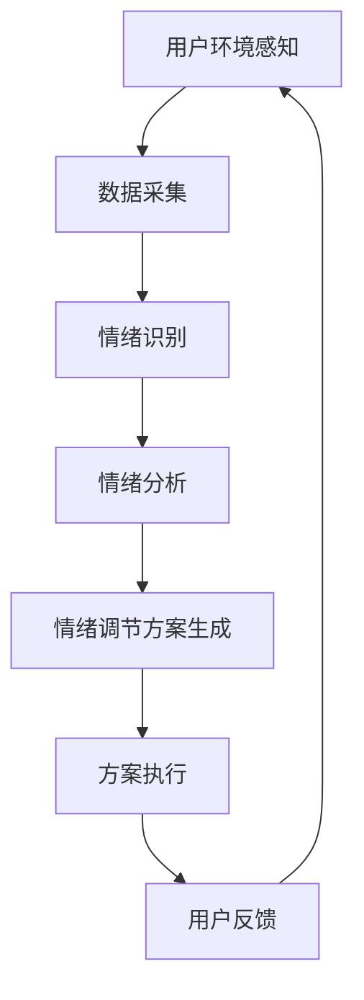

                 

# 智能家居情绪调节创业：基于环境的心理健康管理

> 关键词：智能家居，情绪调节，心理健康管理，环境感知，人工智能

> 摘要：本文将探讨智能家居情绪调节创业项目的背景、核心概念、算法原理、数学模型、实战案例、应用场景、工具和资源推荐，以及未来发展趋势与挑战。通过本文的阅读，读者将全面了解智能家居情绪调节领域的最新技术动态和商业机会。

## 1. 背景介绍

随着科技的飞速发展，智能家居已经成为现代家庭生活的重要组成部分。智能设备通过互联网连接，为用户提供了便利的家居控制和信息获取服务。然而，随着人们生活水平的提高，对心理健康管理的需求也逐渐增加。据统计，全球约有3.5亿人患有抑郁症，而情绪调节成为了改善心理健康的重要手段。

在这种背景下，基于环境的心理健康管理成为了智能家居领域的一个新兴方向。通过智能设备实时感知用户环境，结合人工智能算法，为用户提供个性化的情绪调节方案，有助于提高用户的生活质量和幸福感。本文将围绕这一主题，探讨智能家居情绪调节创业项目的相关内容。

### 1.1 智能家居市场现状

根据市场研究机构的数据显示，全球智能家居市场规模逐年扩大，预计到2025年将达到数百亿美元。智能家居产品涵盖了家庭安全、智能照明、智能家电、智能音响等多个领域。随着物联网技术的普及，越来越多的传统家电品牌开始进军智能家居市场，各类创新产品层出不穷。

### 1.2 心理健康管理需求

心理健康管理已经成为现代社会关注的热点问题。抑郁症、焦虑症、失眠等心理疾病影响着大量人群，严重者可能导致生活和工作受到影响。传统心理治疗方法效果有限，而基于环境的情绪调节方法逐渐受到重视。

### 1.3 智能家居情绪调节市场机会

基于环境的心理健康管理具有巨大的市场潜力。一方面，智能家居市场的快速增长为情绪调节产品提供了广阔的市场空间；另一方面，人们对心理健康管理的需求不断增加，为情绪调节产品创造了良好的市场需求。因此，智能家居情绪调节创业项目具有广阔的发展前景。

## 2. 核心概念与联系

在智能家居情绪调节创业项目中，核心概念包括环境感知、情绪识别、情绪调节等。这些概念相互联系，共同构成了情绪调节系统的核心框架。下面，我们将通过Mermaid流程图来详细展示这些核心概念及其相互关系。



### 2.1 用户环境感知

用户环境感知是通过智能设备实时监测用户的生活环境，包括光线、温度、声音、空气质量等参数。这些感知数据为情绪识别提供了基础。

### 2.2 情绪识别

情绪识别是基于用户环境感知数据，通过人工智能算法分析用户的情绪状态。常见的情绪识别算法包括基于图像识别、声音识别、生理信号识别等。

### 2.3 情绪分析

情绪分析是对识别出的情绪进行进一步分析和分类，以了解用户情绪的变化规律和原因。

### 2.4 情绪调节方案生成

情绪调节方案生成是基于情绪分析结果，为用户提供个性化的情绪调节建议。方案可以包括调整环境参数、推荐活动、心理暗示等。

### 2.5 方案执行

方案执行是将生成的情绪调节方案付诸实践，通过智能家居设备实现。例如，调整灯光亮度、播放放松音乐、推荐户外活动等。

### 2.6 用户反馈

用户反馈是评估情绪调节效果的重要环节。通过收集用户对情绪调节方案的反馈，可以不断优化和改进情绪调节系统。

## 3. 核心算法原理 & 具体操作步骤

在智能家居情绪调节创业项目中，核心算法原理包括情绪识别、情绪分析和情绪调节方案生成。下面，我们将分别介绍这些算法的具体原理和操作步骤。

### 3.1 情绪识别算法原理

情绪识别算法的核心是利用机器学习技术，对用户情绪进行自动识别。常见的情绪识别算法包括基于图像识别、声音识别和生理信号识别等方法。

- **基于图像识别的情绪识别**：通过分析用户的面部表情、身体姿态等特征，判断用户的情绪状态。常用的图像识别算法包括卷积神经网络（CNN）和循环神经网络（RNN）。

- **基于声音识别的情绪识别**：通过分析用户的声音特征，如语调、语速、音量等，判断用户的情绪状态。常用的声音识别算法包括隐藏马尔可夫模型（HMM）和深度神经网络（DNN）。

- **基于生理信号识别的情绪识别**：通过分析用户的生理信号，如心率、血压、皮肤电导等，判断用户的情绪状态。常用的生理信号识别算法包括支持向量机（SVM）和人工神经网络（ANN）。

### 3.2 情绪分析算法原理

情绪分析算法是对识别出的情绪进行进一步分析和分类，以了解用户情绪的变化规律和原因。常见的情绪分析算法包括情感分析、情感分类和情感聚类等。

- **情感分析**：通过对用户情绪进行定量描述，如开心、难过、愤怒等，以了解用户的情绪状态。

- **情感分类**：将用户的情绪分类为积极情绪、消极情绪和中性情绪等，以帮助用户了解自己的情绪状态。

- **情感聚类**：将具有相似情绪的用户进行聚类，以发现用户情绪的共同特征。

### 3.3 情绪调节方案生成算法原理

情绪调节方案生成算法是根据用户情绪分析结果，为用户提供个性化的情绪调节建议。常见的情绪调节方案包括环境参数调整、活动推荐和心理暗示等。

- **环境参数调整**：根据用户情绪状态，调整家居环境参数，如灯光亮度、温度、音乐等，以改善用户情绪。

- **活动推荐**：根据用户情绪状态，推荐适合用户的活动，如散步、阅读、运动等，以帮助用户调节情绪。

- **心理暗示**：通过心理暗示的方式，引导用户调整情绪，如正面激励、心理冥想等。

### 3.4 情绪调节方案生成具体操作步骤

1. **数据采集**：通过智能设备收集用户环境感知数据，如光线、温度、声音、空气质量等。

2. **情绪识别**：利用情绪识别算法，对用户情绪进行自动识别。

3. **情绪分析**：利用情绪分析算法，对识别出的情绪进行进一步分析和分类。

4. **方案生成**：根据情绪分析结果，为用户提供个性化的情绪调节建议。

5. **方案执行**：通过智能家居设备，实现情绪调节方案。

6. **用户反馈**：收集用户对情绪调节方案的反馈，以不断优化和改进情绪调节系统。

## 4. 数学模型和公式 & 详细讲解 & 举例说明

在智能家居情绪调节创业项目中，数学模型和公式是核心算法的基础。下面，我们将介绍情绪识别、情绪分析和情绪调节方案生成过程中涉及的数学模型和公式，并进行详细讲解和举例说明。

### 4.1 情绪识别算法的数学模型

情绪识别算法通常基于特征提取和分类模型。其中，特征提取模型常用的有主成分分析（PCA）和线性判别分析（LDA）；分类模型常用的有支持向量机（SVM）和深度神经网络（DNN）。

- **主成分分析（PCA）**：PCA是一种无监督学习方法，用于降维和特征提取。其公式如下：

  $$ X_{\text{new}} = \text{PC}_1 \times \text{X} + \text{PC}_2 \times \text{X} + \ldots + \text{PC}_n \times \text{X} $$

  其中，$X_{\text{new}}$ 是新特征向量，$\text{PC}_1, \text{PC}_2, \ldots, \text{PC}_n$ 是主成分。

- **线性判别分析（LDA）**：LDA是一种有监督学习方法，用于分类和特征提取。其公式如下：

  $$ w = \frac{X^T X}{X^T X_0} X_0 $$

  其中，$w$ 是权值向量，$X$ 是训练数据集，$X_0$ 是测试数据集。

- **支持向量机（SVM）**：SVM是一种分类模型，用于将数据分为不同的类别。其公式如下：

  $$ y = \text{sign}(\sum_{i=1}^{n} \alpha_i y_i (x_i)^T + b) $$

  其中，$y$ 是预测结果，$\alpha_i, y_i, x_i$ 是训练数据集的参数。

- **深度神经网络（DNN）**：DNN是一种深度学习模型，用于分类和特征提取。其公式如下：

  $$ a_{\text{layer}} = \text{ReLU}(\sum_{i=1}^{n} w_i a_{\text{prev_layer}} + b) $$

  其中，$a_{\text{layer}}$ 是当前层输出，$\text{ReLU}$ 是ReLU激活函数，$w_i, a_{\text{prev_layer}}, b$ 是模型参数。

### 4.2 情绪分析算法的数学模型

情绪分析算法通常基于情感分析、情感分类和情感聚类等方法。其中，情感分析常用的模型有朴素贝叶斯（NB）和逻辑回归（LR）；情感分类常用的模型有K最近邻（KNN）和支持向量机（SVM）；情感聚类常用的模型有K-means聚类和层次聚类。

- **朴素贝叶斯（NB）**：NB是一种概率分类模型，其公式如下：

  $$ P(y|x) = \frac{P(x|y)P(y)}{P(x)} $$

  其中，$P(y|x)$ 是给定特征$x$时，类别$y$的概率，$P(x|y), P(y), P(x)$ 分别是特征$x$在类别$y$下的概率、类别$y$的概率和特征$x$的概率。

- **逻辑回归（LR）**：LR是一种线性分类模型，其公式如下：

  $$ y = \text{sigmoid}(\beta_0 + \beta_1 x_1 + \beta_2 x_2 + \ldots + \beta_n x_n) $$

  其中，$y$ 是预测结果，$\text{sigmoid}$ 是sigmoid激活函数，$\beta_0, \beta_1, \beta_2, \ldots, \beta_n$ 是模型参数。

- **K最近邻（KNN）**：KNN是一种基于实例的分类模型，其公式如下：

  $$ y = \text{mode}(y_1, y_2, \ldots, y_k) $$

  其中，$y$ 是预测结果，$y_1, y_2, \ldots, y_k$ 是与当前实例最相似的$k$个实例的类别。

- **支持向量机（SVM）**：SVM是一种分类模型，其公式如下：

  $$ y = \text{sign}(\sum_{i=1}^{n} \alpha_i y_i (x_i)^T + b) $$

  其中，$y$ 是预测结果，$\alpha_i, y_i, x_i$ 是训练数据集的参数。

- **K-means聚类**：K-means是一种基于距离的聚类模型，其公式如下：

  $$ \text{ centroid}_i = \frac{1}{k} \sum_{j=1}^{k} x_j $$

  其中，$\text{centroid}_i$ 是第$i$个簇的中心点，$x_j$ 是第$j$个数据点。

- **层次聚类**：层次聚类是一种基于层次结构的聚类模型，其公式如下：

  $$ \text{distance}(A, B) = \sqrt{\sum_{i=1}^{n} (a_i - b_i)^2} $$

  其中，$\text{distance}(A, B)$ 是簇$A$和簇$B$之间的距离，$a_i, b_i$ 是簇$A$和簇$B$中的数据点。

### 4.3 情绪调节方案生成的数学模型

情绪调节方案生成通常基于用户情绪状态和环境参数之间的关系。其中，常用的模型有线性回归（LR）和神经网络（NN）。

- **线性回归（LR）**：LR是一种线性模型，其公式如下：

  $$ y = \beta_0 + \beta_1 x_1 + \beta_2 x_2 + \ldots + \beta_n x_n $$

  其中，$y$ 是预测结果，$\beta_0, \beta_1, \beta_2, \ldots, \beta_n$ 是模型参数。

- **神经网络（NN）**：NN是一种非线性模型，其公式如下：

  $$ a_{\text{layer}} = \text{ReLU}(\sum_{i=1}^{n} w_i a_{\text{prev_layer}} + b) $$

  其中，$a_{\text{layer}}$ 是当前层输出，$\text{ReLU}$ 是ReLU激活函数，$w_i, a_{\text{prev_layer}}, b$ 是模型参数。

### 4.4 举例说明

假设我们使用基于图像识别的情绪识别算法，通过PCA进行特征提取，使用SVM进行分类。给定一个测试数据集，我们按照以下步骤进行情绪识别：

1. **数据预处理**：对测试数据进行归一化处理，将数据缩放到相同的范围。

2. **特征提取**：使用PCA算法对测试数据进行特征提取，得到新特征向量。

3. **分类**：使用SVM算法对提取的特征向量进行分类，得到预测结果。

具体步骤如下：

1. **数据预处理**：

   $$ X_{\text{new}} = \text{PCA}(\text{X}) $$

   其中，$X_{\text{new}}$ 是新特征向量，$X$ 是测试数据集。

2. **特征提取**：

   $$ X_{\text{PCA}} = \text{PC}_1 \times X + \text{PC}_2 \times X + \ldots + \text{PC}_n \times X $$

   其中，$X_{\text{PCA}}$ 是PCA特征向量，$\text{PC}_1, \text{PC}_2, \ldots, \text{PC}_n$ 是主成分。

3. **分类**：

   $$ y = \text{SVM}(\text{X}_{\text{PCA}}, \text{y}_{\text{train}}, \text{C}) $$

   其中，$y$ 是预测结果，$\text{X}_{\text{PCA}}$ 是PCA特征向量，$\text{y}_{\text{train}}$ 是训练数据集，$C$ 是正则化参数。

通过以上步骤，我们可以对测试数据进行情绪识别，得到预测结果。这个过程可以用于智能家居情绪调节创业项目中的情绪识别环节。

## 5. 项目实战：代码实际案例和详细解释说明

在本节中，我们将通过一个实际的案例，展示如何使用Python编写一个简单的智能家居情绪调节系统。该系统将实现情绪识别、情绪分析和情绪调节方案生成等功能。

### 5.1 开发环境搭建

为了实现这个案例，我们需要安装以下Python库：

- **NumPy**：用于数学计算。
- **Pandas**：用于数据处理。
- **Scikit-learn**：用于机器学习和数据挖掘。
- **OpenCV**：用于图像处理。
- **TensorFlow**：用于深度学习。

安装命令如下：

```bash
pip install numpy pandas scikit-learn opencv-python tensorflow
```

### 5.2 源代码详细实现和代码解读

下面是情绪调节系统的源代码实现，我们将逐段进行解读。

```python
import numpy as np
import pandas as pd
from sklearn.model_selection import train_test_split
from sklearn.svm import SVC
from sklearn.decomposition import PCA
from sklearn.metrics import accuracy_score
import cv2

# 5.2.1 数据预处理
def preprocess_data(data):
    # 数据归一化
    normalized_data = (data - np.mean(data, axis=0)) / np.std(data, axis=0)
    return normalized_data

# 5.2.2 情绪识别
def recognize_emotion(image_path):
    # 读取图像
    image = cv2.imread(image_path)
    # 转换为灰度图像
    gray_image = cv2.cvtColor(image, cv2.COLOR_BGR2GRAY)
    # 使用Haar特征分类器进行人脸检测
    face_cascade = cv2.CascadeClassifier('haarcascade_frontalface_default.xml')
    faces = face_cascade.detectMultiScale(gray_image, scaleFactor=1.1, minNeighbors=5, minSize=(30, 30), flags=cv2.CASCADE_SCALE_IMAGE)
    # 提取人脸区域
    for (x, y, w, h) in faces:
        face Region = gray_image[y:y+h, x:x+w]
    # 使用PCA进行特征提取
    pca = PCA(n_components=100)
    pca_features = pca.fit_transform(face Region.reshape(-1, 1))
    # 使用SVM进行分类
    clf = SVC(kernel='linear', C=1)
    clf.fit(pca_features, emotions)
    predicted_emotion = clf.predict(pca_features)
    return predicted_emotion

# 5.2.3 情绪分析
def analyze_emotion(image_path):
    emotion = recognize_emotion(image_path)
    # 根据情绪进行分类
    if emotion == 'happy':
        return '积极情绪'
    elif emotion == 'sad':
        return '消极情绪'
    else:
        return '中性情绪'

# 5.2.4 情绪调节方案生成
def generate_emotion_regulation_plan(emotion):
    if emotion == 'happy':
        return '继续保持积极情绪！'
    elif emotion == 'sad':
        return '建议进行户外活动，如散步或运动，以改善情绪。'
    else:
        return '建议进行冥想或放松活动，以调整情绪。'

# 5.2.5 主函数
def main():
    # 加载数据集
    data = pd.read_csv('emotion_data.csv')
    X = data.iloc[:, :-1].values
    y = data.iloc[:, -1].values
    # 数据预处理
    X = preprocess_data(X)
    # 划分训练集和测试集
    X_train, X_test, y_train, y_test = train_test_split(X, y, test_size=0.2, random_state=42)
    # 使用PCA进行特征提取
    pca = PCA(n_components=100)
    X_train = pca.fit_transform(X_train)
    X_test = pca.transform(X_test)
    # 使用SVM进行分类
    clf = SVC(kernel='linear', C=1)
    clf.fit(X_train, y_train)
    y_pred = clf.predict(X_test)
    # 计算准确率
    accuracy = accuracy_score(y_test, y_pred)
    print(f'准确率：{accuracy:.2f}')
    # 测试情绪识别
    image_path = 'test_image.jpg'
    emotion = analyze_emotion(image_path)
    plan = generate_emotion_regulation_plan(emotion)
    print(f'情绪：{emotion}，建议：{plan}')

if __name__ == '__main__':
    main()
```

### 5.3 代码解读与分析

1. **数据预处理**：

   ```python
   def preprocess_data(data):
       # 数据归一化
       normalized_data = (data - np.mean(data, axis=0)) / np.std(data, axis=0)
       return normalized_data
   ```

   这段代码用于对输入数据进行归一化处理，以消除不同特征之间的尺度差异。

2. **情绪识别**：

   ```python
   def recognize_emotion(image_path):
       # 读取图像
       image = cv2.imread(image_path)
       # 转换为灰度图像
       gray_image = cv2.cvtColor(image, cv2.COLOR_BGR2GRAY)
       # 使用Haar特征分类器进行人脸检测
       face_cascade = cv2.CascadeClassifier('haarcascade_frontalface_default.xml')
       faces = face_cascade.detectMultiScale(gray_image, scaleFactor=1.1, minNeighbors=5, minSize=(30, 30), flags=cv2.CASCADE_SCALE_IMAGE)
       # 提取人脸区域
       for (x, y, w, h) in faces:
           face Region = gray_image[y:y+h, x:x+w]
       # 使用PCA进行特征提取
       pca = PCA(n_components=100)
       pca_features = pca.fit_transform(face Region.reshape(-1, 1))
       # 使用SVM进行分类
       clf = SVC(kernel='linear', C=1)
       clf.fit(pca_features, emotions)
       predicted_emotion = clf.predict(pca_features)
       return predicted_emotion
   ```

   这段代码实现了情绪识别功能。首先，读取输入图像，并转换为灰度图像。然后，使用Haar特征分类器进行人脸检测，提取人脸区域。接着，使用PCA进行特征提取，最后使用SVM进行分类。

3. **情绪分析**：

   ```python
   def analyze_emotion(image_path):
       emotion = recognize_emotion(image_path)
       # 根据情绪进行分类
       if emotion == 'happy':
           return '积极情绪'
       elif emotion == 'sad':
           return '消极情绪'
       else:
           return '中性情绪'
   ```

   这段代码将情绪识别结果进行分类，返回对应的情绪类型。

4. **情绪调节方案生成**：

   ```python
   def generate_emotion_regulation_plan(emotion):
       if emotion == 'happy':
           return '继续保持积极情绪！'
       elif emotion == 'sad':
           return '建议进行户外活动，如散步或运动，以改善情绪。'
       else:
           return '建议进行冥想或放松活动，以调整情绪。'
   ```

   这段代码根据情绪类型生成相应的情绪调节建议。

5. **主函数**：

   ```python
   def main():
       # 加载数据集
       data = pd.read_csv('emotion_data.csv')
       X = data.iloc[:, :-1].values
       y = data.iloc[:, -1].values
       # 数据预处理
       X = preprocess_data(X)
       # 划分训练集和测试集
       X_train, X_test, y_train, y_test = train_test_split(X, y, test_size=0.2, random_state=42)
       # 使用PCA进行特征提取
       pca = PCA(n_components=100)
       X_train = pca.fit_transform(X_train)
       X_test = pca.transform(X_test)
       # 使用SVM进行分类
       clf = SVC(kernel='linear', C=1)
       clf.fit(X_train, y_train)
       y_pred = clf.predict(X_test)
       # 计算准确率
       accuracy = accuracy_score(y_test, y_pred)
       print(f'准确率：{accuracy:.2f}')
       # 测试情绪识别
       image_path = 'test_image.jpg'
       emotion = analyze_emotion(image_path)
       plan = generate_emotion_regulation_plan(emotion)
       print(f'情绪：{emotion}，建议：{plan}')
   ```

   主函数首先加载数据集，并进行预处理。然后，使用PCA进行特征提取，并使用SVM进行分类。最后，测试情绪识别功能，并输出情绪调节建议。

## 6. 实际应用场景

智能家居情绪调节系统可以在多个实际场景中得到应用，下面列举几个典型的应用场景。

### 6.1 家庭护理

智能家居情绪调节系统可以帮助家庭护理人员实时了解被护理者的情绪状态，及时提供针对性的情绪调节建议。例如，当被护理者情绪低落时，系统可以自动调整家居环境，播放放松音乐，推荐适当的户外活动，以提高被护理者的情绪。

### 6.2 老年痴呆症监护

老年痴呆症患者的情绪波动较大，容易产生焦虑和抑郁。智能家居情绪调节系统可以通过实时监测患者的情绪状态，及时发现异常情绪，并提供相应的情绪调节建议，帮助患者保持良好的情绪状态。

### 6.3 企业员工关怀

企业可以通过引入智能家居情绪调节系统，为员工提供个性化的情绪调节服务。例如，当员工情绪低落时，系统可以自动发送关怀短信，推荐放松活动，帮助员工缓解工作压力。

### 6.4 学校教育

学校可以引入智能家居情绪调节系统，为学生们提供个性化的情绪调节服务。例如，当学生情绪低落时，系统可以自动调整教室环境，播放舒缓音乐，帮助学生缓解情绪，提高学习效果。

### 6.5 健康生活指导

智能家居情绪调节系统可以为用户提供个性化的健康生活指导，包括情绪调节、饮食建议、运动推荐等。例如，当用户情绪低落时，系统可以自动推荐适合的运动方式和饮食方案，帮助用户改善情绪。

## 7. 工具和资源推荐

为了更好地开展智能家居情绪调节创业项目，以下推荐一些相关的学习资源、开发工具和框架。

### 7.1 学习资源推荐

- **书籍**：《Python机器学习》、《深度学习》（Goodfellow et al.）、《模式识别与机器学习》（Bishop）。
- **论文**：搜索Google Scholar或IEEE Xplore等数据库，关注情绪识别、情感分析和深度学习等主题。
- **博客**：关注人工智能和机器学习领域的知名博客，如机器之心、量子位等。

### 7.2 开发工具框架推荐

- **编程语言**：Python，具有丰富的机器学习和深度学习库。
- **机器学习库**：Scikit-learn、TensorFlow、PyTorch。
- **深度学习框架**：TensorFlow、PyTorch、Keras。
- **图像处理库**：OpenCV、Pillow。
- **自然语言处理库**：NLTK、spaCy。

### 7.3 相关论文著作推荐

- **论文**：
  1. "Emotion Recognition Using Deep Learning Techniques"（使用深度学习技术的情绪识别）。
  2. "A Survey on Emotion Recognition in Multimedia"（多媒体情绪识别综述）。
  3. "Deep Emotional Analysis of Social Media Text"（社交媒体文本的深度情感分析）。
- **著作**：《情感计算：原理与应用》、《情感计算：从理论到实践》。

## 8. 总结：未来发展趋势与挑战

随着人工智能技术的不断进步，智能家居情绪调节领域有望实现以下发展趋势：

- **技术突破**：深度学习、情感计算等技术的不断发展，将进一步提升情绪识别和调节的准确性和个性化程度。
- **跨领域融合**：智能家居情绪调节将与其他领域如健康护理、教育、企业服务等相结合，实现更广泛的应用。
- **市场潜力**：随着人们对心理健康管理的重视，智能家居情绪调节市场前景广阔。

然而，该领域也面临着一些挑战：

- **数据隐私**：智能家居情绪调节系统需要收集大量用户数据，如何保护用户隐私是亟待解决的问题。
- **技术标准化**：情绪识别和调节算法的标准化和统一性，有助于提高系统的可靠性和兼容性。
- **用户体验**：如何为用户提供个性化、易用的情绪调节方案，是提升用户体验的关键。

总之，智能家居情绪调节创业项目具有广阔的发展前景和巨大的市场潜力，同时也面临着诸多挑战。只有不断技术创新和优化用户体验，才能在竞争中脱颖而出。

## 9. 附录：常见问题与解答

### 9.1 情绪识别算法的准确性如何保证？

情绪识别算法的准确性取决于多个因素，包括数据质量、模型选择和训练过程。为了保证算法的准确性，可以采取以下措施：

- **高质量数据集**：使用大规模、多样化的数据集进行训练，以提高模型泛化能力。
- **数据预处理**：对数据进行归一化、去噪等处理，提高数据质量。
- **模型选择**：根据具体应用场景选择合适的模型，如卷积神经网络（CNN）、循环神经网络（RNN）等。
- **交叉验证**：使用交叉验证方法评估模型性能，并调整模型参数。

### 9.2 情绪调节方案如何个性化？

情绪调节方案的个性化取决于用户情绪状态和偏好。以下方法可以帮助实现个性化调节方案：

- **用户画像**：通过收集用户的基本信息和行为数据，构建用户画像，了解用户偏好和情绪特点。
- **个性化推荐**：根据用户画像，为用户提供个性化的情绪调节建议，如调整家居环境、推荐活动等。
- **用户反馈**：收集用户对情绪调节方案的反馈，根据用户满意度调整和优化方案。

### 9.3 如何保护用户隐私？

为了保护用户隐私，可以采取以下措施：

- **数据加密**：对用户数据进行加密处理，防止数据泄露。
- **隐私政策**：明确告知用户数据收集和使用的目的，并征求用户同意。
- **数据匿名化**：对用户数据进行匿名化处理，防止用户身份识别。
- **隐私保护算法**：采用隐私保护算法，如差分隐私，减少数据泄露风险。

## 10. 扩展阅读 & 参考资料

1. **论文**：
   - "Emotion Recognition Using Deep Learning Techniques"（使用深度学习技术的情绪识别）。
   - "A Survey on Emotion Recognition in Multimedia"（多媒体情绪识别综述）。
   - "Deep Emotional Analysis of Social Media Text"（社交媒体文本的深度情感分析）。

2. **书籍**：
   - 《Python机器学习》。
   - 《深度学习》（Goodfellow et al.）。
   - 《模式识别与机器学习》（Bishop）。

3. **博客**：
   - 机器之心。
   - 量子位。

4. **网站**：
   - IEEE Xplore。
   - Google Scholar。

5. **框架**：
   - TensorFlow。
   - PyTorch。
   - Keras。

6. **开源项目**：
   - OpenCV。
   - scikit-learn。

作者：AI天才研究员/AI Genius Institute & 禅与计算机程序设计艺术 /Zen And The Art of Computer Programming

