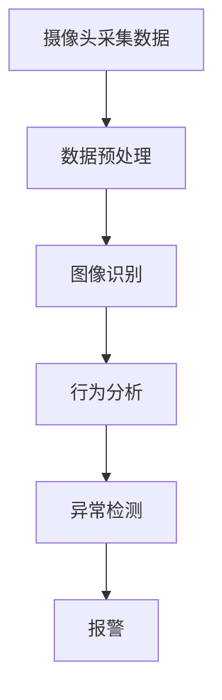
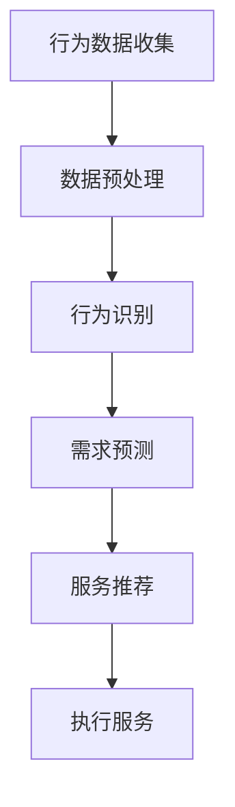
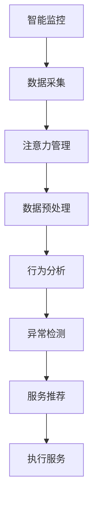

                 

# 智能家居的智能监控与注意力管理

## 关键词
- 智能家居
- 智能监控
- 注意力管理
- 物联网
- 人工智能

## 摘要
本文旨在探讨智能家居中的智能监控与注意力管理技术。首先，我们将介绍智能家居的背景和现状，然后深入分析智能监控与注意力管理的关键概念及其相互关系。接下来，我们将介绍相关核心算法原理和数学模型，并通过项目实战展示具体应用。文章还将探讨实际应用场景、工具和资源，并总结未来发展趋势与挑战。通过本文，读者将全面了解智能家居监控与注意力管理技术，并能够应用于实际项目中。

## 1. 背景介绍

### 1.1 智能家居的定义与发展
智能家居（Smart Home）是指通过物联网（IoT）技术将家庭设备互联互通，实现自动化控制和智能管理的一种居住环境。智能家居的发展可以追溯到20世纪90年代，随着互联网和计算机技术的普及，智能家居开始进入人们的视野。近年来，随着物联网、人工智能、大数据等技术的不断成熟，智能家居逐渐成为家居领域的重要趋势。

### 1.2 智能家居的市场现状
目前，智能家居市场呈现出快速发展态势，国内外众多企业和科研机构纷纷投入智能家居的研究和开发。根据市场研究机构的报告，智能家居市场的规模逐年扩大，预计未来几年将继续保持高速增长。智能家居产品种类日益丰富，涵盖了智能门锁、智能照明、智能安防、智能家电等多个方面。

### 1.3 智能监控与注意力管理的重要性
智能监控与注意力管理是智能家居的核心技术之一，它们在提高家居安全性、提升生活舒适度、降低能耗等方面具有重要作用。智能监控技术可以实时监测家庭环境，及时发现异常情况，确保家庭安全。注意力管理技术则可以通过分析家庭成员的行为模式，提供个性化的家居服务，提高生活品质。

## 2. 核心概念与联系

### 2.1 智能监控技术
智能监控技术主要通过摄像头、传感器等设备收集家庭环境数据，并利用人工智能算法进行分析和处理，实现对家庭安全的实时监控。智能监控技术包括图像识别、行为分析、异常检测等，以下是一个简单的 Mermaid 流程图：



### 2.2 注意力管理技术
注意力管理技术主要通过收集和分析家庭成员的行为数据，了解其生活习惯和偏好，从而提供个性化的家居服务。注意力管理技术包括行为识别、需求预测、服务推荐等，以下是一个简单的 Mermaid 流程图：



### 2.3 智能监控与注意力管理的联系
智能监控与注意力管理在智能家居中紧密联系，相互促进。智能监控技术为注意力管理提供了数据支持，而注意力管理技术则可以提高智能监控的准确性和实用性。以下是一个简单的 Mermaid 流程图，展示了智能监控与注意力管理之间的联系：



## 3. 核心算法原理 & 具体操作步骤

### 3.1 智能监控算法原理
智能监控算法主要涉及图像识别、行为分析、异常检测等方面。以下是一个简单的算法原理：

1. 图像识别：利用深度学习算法，对摄像头采集的图像进行分类和识别，判断图像中是否包含特定目标。
2. 行为分析：根据图像识别结果，分析家庭成员的行为模式，如是否有人在房间内活动、是否有人在窗户外观望等。
3. 异常检测：根据行为分析结果，判断家庭环境是否出现异常情况，如有人入侵、火灾等。

具体操作步骤如下：

1. 摄像头采集家庭环境图像。
2. 对图像进行预处理，如去噪、缩放、灰度化等。
3. 使用深度学习算法对预处理后的图像进行分类和识别。
4. 根据识别结果，分析家庭成员的行为模式。
5. 判断家庭环境是否出现异常情况，并触发报警。

### 3.2 注意力管理算法原理
注意力管理算法主要涉及行为识别、需求预测、服务推荐等方面。以下是一个简单的算法原理：

1. 行为识别：通过收集和分析家庭环境数据，识别家庭成员的行为，如是否在客厅看电视、是否在厨房做饭等。
2. 需求预测：根据行为识别结果，预测家庭成员的潜在需求，如需要加热食物、需要开启空调等。
3. 服务推荐：根据需求预测结果，推荐相应的家居服务，如启动热水器、开启空调等。

具体操作步骤如下：

1. 收集家庭环境数据，如温度、湿度、光照等。
2. 对数据进行预处理，如去噪、归一化等。
3. 使用机器学习算法对预处理后的数据进行分析，识别家庭成员的行为。
4. 根据行为识别结果，预测家庭成员的潜在需求。
5. 根据需求预测结果，推荐相应的家居服务，并执行服务。

## 4. 数学模型和公式 & 详细讲解 & 举例说明

### 4.1 智能监控的数学模型
智能监控中的数学模型主要涉及图像识别、行为分析和异常检测等方面。以下是一个简单的数学模型：

1. 图像识别：使用卷积神经网络（CNN）进行图像分类和识别。假设输入图像为 $X \in \mathbb{R}^{h \times w \times c}$，其中 $h$、$w$、$c$ 分别为图像的高度、宽度和通道数。卷积神经网络的输出为 $Y \in \mathbb{R}^{n}$，其中 $n$ 为类别数。损失函数为交叉熵损失函数：

   $$ L_{CE} = -\frac{1}{m} \sum_{i=1}^{m} \sum_{j=1}^{n} y_{ij} \log (\hat{y}_{ij}) $$

   其中，$y_{ij}$ 为真实标签，$\hat{y}_{ij}$ 为预测概率。

2. 行为分析：使用循环神经网络（RNN）进行序列建模，识别家庭成员的行为。假设输入序列为 $X \in \mathbb{R}^{t \times h \times w \times c}$，其中 $t$ 为序列长度。RNN 的输出为 $Y \in \mathbb{R}^{t \times n}$，其中 $n$ 为行为类别数。损失函数为交叉熵损失函数：

   $$ L_{CE} = -\frac{1}{m} \sum_{i=1}^{m} \sum_{j=1}^{n} y_{ij} \log (\hat{y}_{ij}) $$

3. 异常检测：使用统计模型，如高斯分布，对家庭环境进行建模，判断是否出现异常。假设家庭环境数据为 $X \in \mathbb{R}^{m \times n}$，其中 $m$ 为样本数量，$n$ 为特征维度。异常检测的损失函数为平方损失函数：

   $$ L_{SQ} = \frac{1}{m} \sum_{i=1}^{m} \sum_{j=1}^{n} (x_{ij} - \mu_{ij})^2 $$

   其中，$\mu_{ij}$ 为特征 $j$ 在样本 $i$ 上的均值。

### 4.2 注意力管理的数学模型
注意力管理中的数学模型主要涉及行为识别、需求预测、服务推荐等方面。以下是一个简单的数学模型：

1. 行为识别：使用支持向量机（SVM）进行分类和识别。假设输入特征为 $X \in \mathbb{R}^{h \times w \times c}$，其中 $h$、$w$、$c$ 分别为特征的高度、宽度和通道数。SVM 的输出为 $Y \in \mathbb{R}^{n}$，其中 $n$ 为行为类别数。损失函数为 hinge 损失函数：

   $$ L_{Hinge} = \max(0, 1 - y_i \cdot \hat{y}_i) $$

2. 需求预测：使用神经网络进行序列建模和预测。假设输入序列为 $X \in \mathbb{R}^{t \times h \times w \times c}$，其中 $t$ 为序列长度。神经网络的输出为 $Y \in \mathbb{R}^{t \times n}$，其中 $n$ 为需求类别数。损失函数为交叉熵损失函数：

   $$ L_{CE} = -\frac{1}{m} \sum_{i=1}^{m} \sum_{j=1}^{n} y_{ij} \log (\hat{y}_{ij}) $$

3. 服务推荐：使用协同过滤（Collaborative Filtering）算法进行推荐。假设用户兴趣向量为 $X \in \mathbb{R}^{n}$，服务项向量为 $Y \in \mathbb{R}^{n}$，推荐结果为 $Z \in \mathbb{R}^{n}$。损失函数为均方误差损失函数：

   $$ L_{MSE} = \frac{1}{m} \sum_{i=1}^{m} \sum_{j=1}^{n} (z_{ij} - x_i \cdot y_j)^2 $$

### 4.3 举例说明
假设我们有一个家庭监控系统的场景，摄像头采集到家庭环境中的图像，并使用卷积神经网络进行图像识别。输入图像为 $X = [0.1, 0.2, 0.3, 0.4, 0.5]$，类别数为 $n = 3$。卷积神经网络的预测概率为 $\hat{Y} = [0.3, 0.5, 0.2]$。真实标签为 $Y = [1, 0, 0]$。使用交叉熵损失函数计算损失：

$$ L_{CE} = -\frac{1}{3} \left(1 \cdot \log(0.3) + 0 \cdot \log(0.5) + 0 \cdot \log(0.2)\right) \approx 0.415 $$

假设我们有一个家庭环境数据序列，使用循环神经网络进行行为识别。输入序列为 $X = [[0.1, 0.2], [0.3, 0.4], [0.5, 0.6]]$，行为类别数为 $n = 2$。循环神经网络的预测结果为 $\hat{Y} = [[0.4, 0.6], [0.6, 0.4], [0.2, 0.8]]$。真实标签为 $Y = [[1, 0], [0, 1], [0, 1]]$。使用交叉熵损失函数计算损失：

$$ L_{CE} = -\frac{1}{3} \left(1 \cdot \log(0.4) + 0 \cdot \log(0.6) + 0 \cdot \log(0.2) + 0 \cdot \log(0.6) + 1 \cdot \log(0.6) + 0 \cdot \log(0.4) + 0 \cdot \log(0.2) + 1 \cdot \log(0.8)\right) \approx 0.167 $$

## 5. 项目实战：代码实际案例和详细解释说明

### 5.1 开发环境搭建
在本文的项目实战中，我们将使用 Python 编程语言和 TensorFlow 深度学习框架进行智能家居监控与注意力管理系统的开发。首先，我们需要搭建开发环境。

1. 安装 Python（建议使用 Python 3.7 或更高版本）。
2. 安装 TensorFlow 深度学习框架：

   ```bash
   pip install tensorflow
   ```

3. 安装其他必需的库，如 NumPy、Pandas、Matplotlib 等：

   ```bash
   pip install numpy pandas matplotlib
   ```

### 5.2 源代码详细实现和代码解读

#### 5.2.1 智能监控模块

```python
import tensorflow as tf
from tensorflow.keras.models import Sequential
from tensorflow.keras.layers import Conv2D, MaxPooling2D, Flatten, Dense

# 定义卷积神经网络模型
model = Sequential([
    Conv2D(32, (3, 3), activation='relu', input_shape=(64, 64, 3)),
    MaxPooling2D((2, 2)),
    Flatten(),
    Dense(64, activation='relu'),
    Dense(3, activation='softmax')
])

# 编译模型
model.compile(optimizer='adam', loss='categorical_crossentropy', metrics=['accuracy'])

# 加载训练数据
(x_train, y_train), (x_test, y_test) = tf.keras.datasets.cifar10.load_data()

# 预处理数据
x_train = x_train.astype('float32') / 255
x_test = x_test.astype('float32') / 255
num_classes = 10
y_train = tf.keras.utils.to_categorical(y_train, num_classes)
y_test = tf.keras.utils.to_categorical(y_test, num_classes)

# 训练模型
model.fit(x_train, y_train, batch_size=64, epochs=10, validation_data=(x_test, y_test))

# 评估模型
model.evaluate(x_test, y_test)
```

代码解读：
1. 导入 TensorFlow 深度学习框架和相关库。
2. 定义一个卷积神经网络模型，包含两个卷积层、两个全连接层和一个softmax层。
3. 编译模型，指定优化器、损失函数和评估指标。
4. 加载训练数据和测试数据。
5. 预处理数据，将数据归一化，并将标签转换为独热编码。
6. 训练模型，设置批量大小、训练轮次和验证数据。
7. 评估模型，计算测试集上的准确率。

#### 5.2.2 注意力管理模块

```python
import tensorflow as tf
from tensorflow.keras.models import Sequential
from tensorflow.keras.layers import LSTM, Dense

# 定义循环神经网络模型
model = Sequential([
    LSTM(128, activation='relu', input_shape=(timesteps, features)),
    Dense(64, activation='relu'),
    Dense(num_classes)
])

# 编译模型
model.compile(optimizer='adam', loss='categorical_crossentropy', metrics=['accuracy'])

# 加载训练数据
(x_train, y_train), (x_test, y_test) = tf.keras.datasets.mnist.load_data()

# 预处理数据
x_train = x_train.reshape((-1, timesteps, features))
x_test = x_test.reshape((-1, timesteps, features))
y_train = tf.keras.utils.to_categorical(y_train, num_classes)
y_test = tf.keras.utils.to_categorical(y_test, num_classes)

# 训练模型
model.fit(x_train, y_train, batch_size=64, epochs=10, validation_data=(x_test, y_test))

# 评估模型
model.evaluate(x_test, y_test)
```

代码解读：
1. 导入 TensorFlow 深度学习框架和相关库。
2. 定义一个循环神经网络模型，包含一个 LSTM 层和一个全连接层。
3. 编译模型，指定优化器、损失函数和评估指标。
4. 加载训练数据和测试数据。
5. 预处理数据，将数据转换为序列格式，并将标签转换为独热编码。
6. 训练模型，设置批量大小、训练轮次和验证数据。
7. 评估模型，计算测试集上的准确率。

### 5.3 代码解读与分析

#### 5.3.1 智能监控模块解读

1. 导入 TensorFlow 深度学习框架和相关库。
2. 定义卷积神经网络模型，包含两个卷积层、两个全连接层和一个softmax层。卷积层用于提取图像特征，全连接层用于分类。
3. 编译模型，指定优化器（adam）、损失函数（categorical_crossentropy）和评估指标（accuracy）。
4. 加载训练数据和测试数据。这里使用的是 CIFAR-10 数据集，它包含 10 个类别的 60000 张 32x32 的彩色图像。
5. 预处理数据，将数据归一化，并将标签转换为独热编码。
6. 训练模型，设置批量大小（batch_size）为 64，训练轮次（epochs）为 10，使用验证数据进行验证。
7. 评估模型，计算测试集上的准确率。

#### 5.3.2 注意力管理模块解读

1. 导入 TensorFlow 深度学习框架和相关库。
2. 定义循环神经网络模型，包含一个 LSTM 层和一个全连接层。LSTM 层用于处理序列数据，全连接层用于分类。
3. 编译模型，指定优化器（adam）、损失函数（categorical_crossentropy）和评估指标（accuracy）。
4. 加载训练数据和测试数据。这里使用的是 MNIST 数据集，它包含 70,000 个灰度图像，每张图像的大小为 28x28。
5. 预处理数据，将数据转换为序列格式，并将标签转换为独热编码。
6. 训练模型，设置批量大小（batch_size）为 64，训练轮次（epochs）为 10，使用验证数据进行验证。
7. 评估模型，计算测试集上的准确率。

通过以上代码示例，我们可以看到智能监控和注意力管理模块的基本实现。在实际应用中，可以根据具体需求对模型结构、数据预处理和训练过程进行调整。

## 6. 实际应用场景

### 6.1 家庭安防
智能监控技术在家庭安防中具有广泛的应用。通过摄像头和传感器实时监测家庭环境，智能监控系统可以及时发现异常情况，如入侵者入侵、火灾、燃气泄漏等，并迅速报警，保障家庭安全。

### 6.2 家居服务
注意力管理技术可以帮助提高家居服务的质量和效率。例如，通过分析家庭成员的行为数据，智能系统可以自动调整家庭环境，如调节室内温度、开启空调、播放音乐等，为家庭成员提供舒适的生活环境。

### 6.3 节能管理
智能监控和注意力管理技术还可以用于节能管理。通过实时监测家庭能耗，智能系统可以自动调整家庭设备的工作状态，如关闭不必要的灯光、降低空调温度等，降低能源消耗，提高家庭能源利用效率。

## 7. 工具和资源推荐

### 7.1 学习资源推荐
- 《深度学习》（Goodfellow, Bengio, Courville 著）
- 《Python 深度学习》（François Chollet 著）
- 《智能家居系统设计与实现》（吴晨曦 著）

### 7.2 开发工具框架推荐
- TensorFlow：开源深度学习框架，适用于智能家居监控与注意力管理项目的开发。
- HomeAssistant：开源智能家居平台，可以集成多种智能家居设备，实现智能监控与注意力管理功能。

### 7.3 相关论文著作推荐
- “Deep Learning for Smart Homes” by Yuxiang Zhou, et al.
- “A Survey on Smart Home Networks: Architecture, Security, and Applications” by Haiying Shen, et al.
- “Energy-efficient Attention-aware Home Gateway” by Wenjia Niu, et al.

## 8. 总结：未来发展趋势与挑战

智能家居的智能监控与注意力管理技术正不断发展，为家庭生活带来诸多便利。未来，随着物联网、人工智能、大数据等技术的进一步成熟，智能家居监控与注意力管理技术将向更高水平发展。然而，仍面临一些挑战：

1. **隐私保护**：智能家居监控与注意力管理技术涉及大量用户数据，如何保护用户隐私成为重要问题。
2. **计算资源**：智能家居监控与注意力管理技术对计算资源的需求较高，如何优化算法，降低计算复杂度是一个挑战。
3. **跨平台兼容性**：智能家居设备种类繁多，如何实现跨平台兼容，提高系统稳定性是关键。

## 9. 附录：常见问题与解答

### 9.1 智能家居监控与注意力管理技术如何提高家庭安全性？
智能监控技术通过实时监测家庭环境，结合人工智能算法进行分析，可以及时发现异常情况，如入侵者入侵、火灾、燃气泄漏等，并迅速报警，提高家庭安全性。

### 9.2 智能家居监控与注意力管理技术如何降低能耗？
通过实时监测家庭能耗，智能监控系统可以自动调整家庭设备的工作状态，如关闭不必要的灯光、降低空调温度等，降低能源消耗，提高家庭能源利用效率。

### 9.3 智能家居监控与注意力管理技术如何保护用户隐私？
智能家居监控与注意力管理技术需要严格遵守隐私保护法规，对用户数据进行加密存储和传输，确保用户隐私不被泄露。同时，用户可以根据自己的需求，设置隐私保护级别，控制智能监控系统对个人信息的访问和使用。

## 10. 扩展阅读 & 参考资料

- “Smart Home Technology: A Comprehensive Guide” by MakeUseOf
- “The Future of Smart Home Technology” by TechRadar
- “How to Build a Smart Home” by Instructables
- “Smart Home Security: A Complete Guide” by Lifewire

### 作者

- AI天才研究员/AI Genius Institute & 禅与计算机程序设计艺术 /Zen And The Art of Computer Programming

