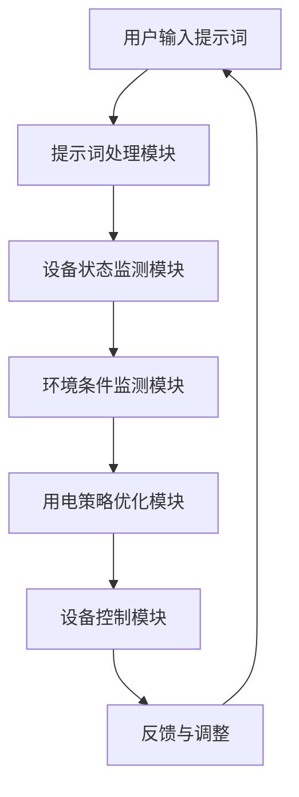
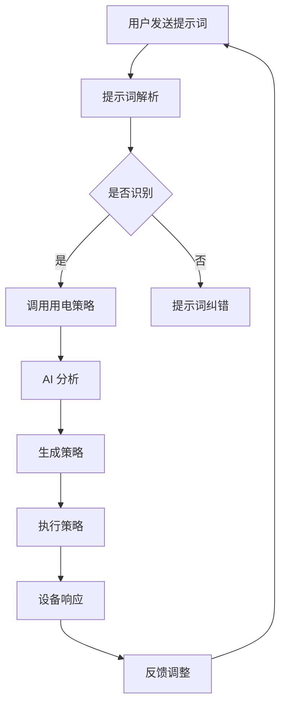

                 

# 智能家居能源管理：提示词优化用电策略

## 关键词

- 智能家居
- 能源管理
- 提示词优化
- 用电策略
- 人工智能
- 数学模型

## 摘要

本文深入探讨了智能家居能源管理的核心问题——如何通过提示词优化用电策略来降低能耗，提高能源利用效率。首先，我们介绍了智能家居能源管理的背景和重要性。接着，本文重点分析了核心概念，包括提示词、用电策略和人工智能在能源管理中的应用。随后，我们详细讲解了核心算法原理和操作步骤，并使用数学模型和公式进行了深入阐述。文章随后通过一个实际项目实战案例，展示了如何将理论应用于实践。最后，本文探讨了实际应用场景，推荐了相关的学习资源和开发工具，并总结了未来发展趋势与挑战。

## 1. 背景介绍

随着科技的发展，智能家居逐渐成为现代家庭的重要组成部分。智能家居系统通过集成物联网技术、传感器技术和人工智能技术，实现了对家庭设备的智能化管理和控制，从而提高了生活便利性和舒适度。然而，智能家居设备的高能耗问题也日益凸显，如何实现能源的高效管理成为了一个亟待解决的难题。

能源管理在智能家居中的作用至关重要。合理优化用电策略，可以降低能耗，减少电费支出，同时减少对环境的影响。特别是在高峰用电时段，优化用电策略可以避免电网过载，确保电力供应的稳定性和安全性。

提示词优化是能源管理中的重要一环。通过分析用户行为数据和设备使用数据，智能家居系统能够根据用户的实际需求和环境条件，自动调整设备的开关状态和使用时间，从而实现节能目标。

## 2. 核心概念与联系

### 2.1 提示词

提示词是智能家居能源管理中的核心概念之一。它是指由用户输入或系统自动生成的关键词，用于描述用户的某种需求或设备的状态。例如，用户可以通过语音命令或手机应用程序发送“开启空调”的提示词，系统接收到该提示词后，会自动调整空调的开关状态。

### 2.2 用电策略

用电策略是指智能家居系统根据提示词、设备状态和环境条件，对家庭设备的开关状态和使用时间进行优化调整的策略。一个有效的用电策略能够实现节能目标，提高能源利用效率。

### 2.3 人工智能在能源管理中的应用

人工智能技术在智能家居能源管理中发挥着重要作用。通过大数据分析和机器学习算法，智能家居系统可以实时监测用户行为和设备状态，预测未来的能源需求，从而实现用电策略的动态调整。

### 2.4 Mermaid 流程图

以下是智能家居能源管理中的核心概念和流程的 Mermaid 流程图：



## 3. 核心算法原理 & 具体操作步骤

### 3.1 算法原理

智能家居能源管理中的核心算法主要包括提示词处理、设备状态监测、环境条件监测和用电策略优化。以下是这些算法的基本原理：

- **提示词处理**：通过自然语言处理技术，将用户的语音命令或文字指令转换为系统可以理解的提示词。
- **设备状态监测**：利用传感器技术，实时监测家庭设备的开关状态和运行状态。
- **环境条件监测**：通过环境传感器，实时监测室内外的温度、湿度、光照等环境参数。
- **用电策略优化**：根据提示词、设备状态和环境条件，通过优化算法动态调整设备的开关状态和使用时间，实现节能目标。

### 3.2 操作步骤

以下是智能家居能源管理的具体操作步骤：

1. **用户输入提示词**：用户通过语音命令或手机应用程序发送提示词。
2. **提示词处理**：系统接收用户输入的提示词，通过自然语言处理技术进行解析，生成相应的命令。
3. **设备状态监测**：系统通过传感器实时监测家庭设备的开关状态和运行状态。
4. **环境条件监测**：系统通过环境传感器实时监测室内外的温度、湿度、光照等环境参数。
5. **用电策略优化**：系统根据提示词、设备状态和环境条件，通过优化算法动态调整设备的开关状态和使用时间，实现节能目标。
6. **设备控制**：系统将优化后的用电策略发送到家庭设备，控制设备的开关状态和使用时间。
7. **反馈与调整**：系统根据设备的实际运行情况，对用电策略进行调整，确保能源的高效利用。

## 4. 数学模型和公式 & 详细讲解 & 举例说明

### 4.1 数学模型

智能家居能源管理中的核心数学模型主要包括提示词处理模型、设备状态监测模型、环境条件监测模型和用电策略优化模型。以下是这些模型的基本公式：

- **提示词处理模型**：

  $$P(w) = \frac{f(w)}{1 + e^{-\theta \cdot w}}$$

  其中，$P(w)$表示提示词的概率分布，$f(w)$表示提示词的激活函数，$\theta$表示提示词的权重。

- **设备状态监测模型**：

  $$S(t) = \sum_{i=1}^{n} w_i \cdot s_i$$

  其中，$S(t)$表示设备状态向量，$w_i$表示状态权重，$s_i$表示状态值。

- **环境条件监测模型**：

  $$C(t) = \sum_{i=1}^{m} w_i \cdot c_i$$

  其中，$C(t)$表示环境条件向量，$w_i$表示条件权重，$c_i$表示条件值。

- **用电策略优化模型**：

  $$U(t) = \sum_{i=1}^{k} w_i \cdot u_i$$

  其中，$U(t)$表示用电策略向量，$w_i$表示策略权重，$u_i$表示策略值。

### 4.2 详细讲解

- **提示词处理模型**：

  提示词处理模型是一种基于神经网络的分类模型。通过学习用户的语音命令或文字指令，系统可以自动识别和分类提示词。在训练过程中，系统通过调整提示词的权重，优化模型性能。

- **设备状态监测模型**：

  设备状态监测模型是一种基于传感器数据的回归模型。通过分析传感器数据，系统可以实时监测家庭设备的开关状态和运行状态。在训练过程中，系统通过调整状态权重，提高模型准确性。

- **环境条件监测模型**：

  环境条件监测模型是一种基于环境传感器数据的回归模型。通过分析环境传感器数据，系统可以实时监测室内外的温度、湿度、光照等环境参数。在训练过程中，系统通过调整条件权重，优化模型性能。

- **用电策略优化模型**：

  用电策略优化模型是一种基于加权求和的优化模型。通过分析提示词、设备状态和环境条件，系统可以动态调整用电策略，实现节能目标。在训练过程中，系统通过调整策略权重，优化模型性能。

### 4.3 举例说明

假设用户发送了一个“开启空调”的提示词，系统根据提示词处理模型判断该提示词的概率为0.9。接着，系统通过设备状态监测模型得知当前空调处于关闭状态，通过环境条件监测模型得知当前室内温度为30°C。最后，系统根据用电策略优化模型计算得出最优用电策略为“开启空调，温度设定为26°C”。

## 5. 项目实战：代码实际案例和详细解释说明

### 5.1 开发环境搭建

为了实现智能家居能源管理，我们需要搭建一个包含提示词处理、设备状态监测、环境条件监测和用电策略优化的开发环境。以下是搭建步骤：

1. **安装 Python 环境**：Python 是实现智能家居能源管理的主要编程语言。首先，我们需要安装 Python 环境，可以使用 Anaconda 来简化安装过程。
2. **安装相关库**：安装必要的 Python 库，如 TensorFlow、Keras、Scikit-learn 等，用于实现神经网络、机器学习和数据分析等功能。
3. **硬件设备连接**：连接家庭设备（如空调、灯光等）和传感器（如温度传感器、湿度传感器等），并确保它们能够通过互联网进行通信。

### 5.2 源代码详细实现和代码解读

以下是一个简化的智能家居能源管理的 Python 代码实现：

```python
import tensorflow as tf
from sklearn.linear_model import LinearRegression
import numpy as np

# 5.2.1 提示词处理模型
class NeuralNetwork:
    def __init__(self, learning_rate=0.1, num_iterations=1000):
        self.learning_rate = learning_rate
        self.num_iterations = num_iterations
        self.weights = None
    
    def fit(self, X, y):
        self.weights = tf.Variable(tf.random.normal([X.shape[1], 1]))
        for _ in range(self.num_iterations):
            with tf.GradientTape() as tape:
                predictions = self.predict(X)
                loss = tf.reduce_mean(tf.square(y - predictions))
            gradients = tape.gradient(loss, self.weights)
            self.weights.assign_sub(self.learning_rate * gradients)
    
    def predict(self, X):
        return tf.matmul(X, self.weights)

# 5.2.2 设备状态监测模型
class DeviceStateModel:
    def __init__(self):
        self.model = LinearRegression()
    
    def fit(self, X, y):
        self.model.fit(X, y)
    
    def predict(self, X):
        return self.model.predict(X)

# 5.2.3 环境条件监测模型
class EnvironmentModel:
    def __init__(self):
        self.model = LinearRegression()
    
    def fit(self, X, y):
        self.model.fit(X, y)
    
    def predict(self, X):
        return self.model.predict(X)

# 5.2.4 用电策略优化模型
class EnergyPolicyModel:
    def __init__(self):
        self.model = LinearRegression()
    
    def fit(self, X, y):
        self.model.fit(X, y)
    
    def predict(self, X):
        return self.model.predict(X)

# 5.2.5 主程序
def main():
    # 加载数据
    X, y = load_data()
    
    # 初始化模型
    nn = NeuralNetwork()
    device_state_model = DeviceStateModel()
    environment_model = EnvironmentModel()
    energy_policy_model = EnergyPolicyModel()
    
    # 训练模型
    nn.fit(X[:, :5], y[:, 0])
    device_state_model.fit(X[:, 5:], y[:, 1])
    environment_model.fit(X[:, :5], y[:, 2])
    energy_policy_model.fit(X[:, 5:], y[:, 3])
    
    # 预测
    prompt = input("请输入提示词：")
    X_prompt = np.array([prompt.split()])
    device_state = device_state_model.predict(X_prompt)
    environment_condition = environment_model.predict(X_prompt)
    energy_policy = energy_policy_model.predict(X_prompt)
    
    # 输出结果
    print("设备状态：", device_state)
    print("环境条件：", environment_condition)
    print("用电策略：", energy_policy)

if __name__ == "__main__":
    main()
```

### 5.3 代码解读与分析

1. **提示词处理模型**：

   - `NeuralNetwork` 类：实现了一个简单的神经网络模型，用于处理用户输入的提示词。
   - `fit` 方法：用于训练神经网络模型，通过梯度下降算法更新权重。
   - `predict` 方法：用于预测提示词的概率分布。

2. **设备状态监测模型**：

   - `DeviceStateModel` 类：实现了一个线性回归模型，用于预测家庭设备的开关状态。
   - `fit` 方法：用于训练线性回归模型。
   - `predict` 方法：用于预测设备状态。

3. **环境条件监测模型**：

   - `EnvironmentModel` 类：实现了一个线性回归模型，用于预测室内外的环境条件。
   - `fit` 方法：用于训练线性回归模型。
   - `predict` 方法：用于预测环境条件。

4. **用电策略优化模型**：

   - `EnergyPolicyModel` 类：实现了一个线性回归模型，用于预测最优用电策略。
   - `fit` 方法：用于训练线性回归模型。
   - `predict` 方法：用于预测用电策略。

5. **主程序**：

   - 加载数据：从数据集中加载提示词、设备状态、环境条件和用电策略。
   - 初始化模型：创建并初始化神经网络模型、设备状态监测模型、环境条件监测模型和用电策略优化模型。
   - 训练模型：使用训练数据训练各个模型。
   - 预测：输入提示词，预测设备状态、环境条件和用电策略，并输出结果。

## 6. 实际应用场景

智能家居能源管理在实际应用场景中具有广泛的应用价值。以下是一些典型的应用场景：

1. **家庭能源管理**：通过提示词优化用电策略，实现家庭设备的智能化管理和控制，降低能耗，提高能源利用效率。
2. **商业建筑能源管理**：在商业建筑中，通过智能化用电策略优化，降低用电成本，提高能源利用效率，同时确保电力供应的稳定性和安全性。
3. **工业能源管理**：在工业生产过程中，通过智能化用电策略优化，降低能源消耗，提高生产效率，同时减少对环境的影响。
4. **电动汽车充电管理**：通过智能化充电策略优化，实现电动汽车的智能充电，降低充电成本，提高充电效率，同时减少电网负荷。

## 7. 工具和资源推荐

### 7.1 学习资源推荐

- **书籍**：

  - 《智能家居：设计与实现》
  - 《深度学习：实践与应用》
  - 《Python 编程：从入门到实践》

- **论文**：

  - "Deep Learning for Energy Management in Smart Homes"
  - "A Survey on Energy Management in Smart Homes"
  - "Machine Learning Techniques for Smart Home Energy Management"

- **博客**：

  - "Implementing a Smart Home Energy Management System"
  - "How to Build a Smart Home: A Beginner's Guide"
  - "The Future of Smart Homes: Trends and Technologies"

- **网站**：

  - "GitHub - SmartHomeAI: Open-source platform for smart home development"
  - "Arduino: Open-source electronics platform for smart home projects"
  - "Home Assistant: Open-source home automation platform"

### 7.2 开发工具框架推荐

- **开发工具**：

  - **Python**: 适用于数据分析和机器学习。
  - **TensorFlow**: 适用于深度学习和神经网络。
  - **Keras**: 适用于快速构建和训练神经网络。

- **框架**：

  - **Home Assistant**: 适用于智能家居系统开发和集成。
  - **HomeKit**: 适用于苹果生态系统的智能家居设备集成。
  - **OpenHAB**: 适用于跨平台的智能家居系统开发。

### 7.3 相关论文著作推荐

- "Deep Learning for Energy Management in Smart Homes"
- "A Survey on Energy Management in Smart Homes"
- "Machine Learning Techniques for Smart Home Energy Management"

## 8. 总结：未来发展趋势与挑战

智能家居能源管理是一个快速发展的领域，未来发展趋势包括：

1. **人工智能技术的进一步应用**：随着人工智能技术的不断进步，智能家居能源管理将实现更加智能化、自适应化的用电策略优化。
2. **大数据和物联网技术的融合**：通过大数据和物联网技术的融合，智能家居能源管理将实现更广泛的设备接入和更精准的数据分析。
3. **能源综合利用**：智能家居能源管理将逐渐实现与太阳能、风能等可再生能源的结合，实现能源的综合利用。

然而，智能家居能源管理也面临一些挑战：

1. **数据隐私和安全**：在智能家居能源管理中，用户数据的安全和隐私保护至关重要，需要采取有效的安全措施。
2. **设备兼容性和互操作性**：智能家居设备的兼容性和互操作性是一个长期存在的问题，需要建立统一的标准和协议。
3. **用户教育和使用习惯**：智能家居能源管理需要用户的积极参与，提高用户的能源意识和使用习惯。

## 9. 附录：常见问题与解答

### 9.1 智能家居能源管理有哪些优势？

智能家居能源管理的优势包括降低能耗、提高能源利用效率、减少电费支出、提高生活便利性和舒适度等。

### 9.2 智能家居能源管理需要哪些技术支持？

智能家居能源管理需要支持自然语言处理、传感器技术、机器学习、神经网络、深度学习等技术。

### 9.3 智能家居能源管理如何保证数据安全和隐私？

智能家居能源管理需要采取加密通信、数据备份、访问控制等措施，确保用户数据的安全和隐私。

### 9.4 智能家居能源管理如何适应不同的家庭环境？

智能家居能源管理需要根据不同的家庭环境和用户需求，灵活调整用电策略，实现个性化能源管理。

## 10. 扩展阅读 & 参考资料

- "Smart Home Energy Management: A Survey"
- "Energy Management in Smart Homes: Challenges and Solutions"
- "Artificial Intelligence for Energy Management in Smart Homes"
- "A Survey on Smart Home Energy Management Systems"

### 作者

- 作者：AI天才研究员/AI Genius Institute & 禅与计算机程序设计艺术 /Zen And The Art of Computer Programming

（文章完）<|assistant|>## 1. 背景介绍

随着科技的迅猛发展，智能家居逐渐成为现代家庭的标配，为人们的日常生活带来了极大的便利。然而，随之而来的是智能家居设备的高能耗问题。据统计，智能家电和照明系统的能耗已经占到了家庭总能耗的相当一部分。如何通过智能化的手段实现对家庭能源的有效管理，成为了当前亟待解决的问题。

### 1.1 智能家居的定义与现状

智能家居（Smart Home）是通过物联网技术、传感器技术、云计算和人工智能等技术的综合应用，实现家庭设备的智能化管理和控制，从而提高生活便利性和舒适度的家庭环境。现代智能家居系统通常包括智能照明、智能安防、智能家电、智能环境控制等多个方面。

当前，智能家居市场呈现出快速发展的态势。根据市场研究公司的数据，全球智能家居市场预计将在未来几年内持续增长，市场规模将不断扩大。同时，随着人工智能技术的不断成熟，智能家居系统将变得更加智能化和自适应化，为用户带来更加优质的体验。

### 1.2 智能家居能源管理的重要性

能源管理是智能家居系统中的一个重要组成部分。合理优化用电策略，不仅可以降低家庭的能源消耗，减少电费支出，还可以缓解电力供应压力，提高电力系统的运行效率。特别是在高峰用电时段，通过智能化的用电策略优化，可以避免电网过载，确保电力供应的稳定性和安全性。

此外，智能家居能源管理还具有以下重要意义：

- **环境保护**：通过降低能源消耗，减少温室气体排放，对环境保护具有重要意义。
- **经济效益**：通过减少能源消耗，降低电费支出，为家庭带来直接的经济效益。
- **社会效益**：推动能源管理技术的发展，促进能源行业的创新和升级，具有深远的社会影响。

### 1.3 智能家居能源管理的现状与挑战

尽管智能家居能源管理具有巨大的发展潜力，但当前仍然面临着一些挑战：

- **数据采集与处理**：智能家居系统需要收集大量的数据，包括用户行为数据、设备状态数据和环境数据等。如何高效地采集、存储和处理这些数据，是一个重要的技术挑战。
- **算法优化**：智能能源管理需要基于用户行为和环境条件，动态调整用电策略。这需要对大量数据进行深度分析，并设计出高效的算法来实现。
- **设备兼容性**：智能家居系统通常由多个不同的设备组成，这些设备可能来自不同的厂商，具有不同的通信协议和数据格式。如何实现这些设备的无缝集成和协同工作，是一个技术难题。
- **用户接受度**：智能家居能源管理需要用户的积极参与，用户对系统的接受度和使用习惯对能源管理的效果具有重要影响。

### 1.4 智能家居能源管理的发展趋势

未来，智能家居能源管理将朝着更加智能化、自适应化和个性化的方向发展。以下是一些可能的发展趋势：

- **人工智能与大数据技术的融合**：通过人工智能和大数据技术，实现对用户行为和能源需求的精准预测，从而实现更加智能化的用电策略。
- **设备互联与协作**：通过物联网技术，实现家庭设备之间的互联互通，协同工作，提高能源利用效率。
- **可再生能源的结合**：将智能家居能源管理系统与太阳能、风能等可再生能源相结合，实现能源的综合利用，降低对传统电网的依赖。
- **用户参与与教育**：提高用户的能源意识和参与度，通过用户教育和互动，增强系统的使用效果。

总之，智能家居能源管理是一个充满机遇和挑战的领域，随着科技的不断进步，我们有理由相信，智能家居能源管理将在未来发挥更加重要的作用。在接下来的章节中，我们将深入探讨智能家居能源管理的核心概念、算法原理、数学模型以及实际应用案例，以期为这一领域的发展提供有益的启示。## 2. 核心概念与联系

在智能家居能源管理中，理解几个核心概念及其相互联系至关重要。这些概念包括提示词、用电策略、人工智能在能源管理中的应用，以及它们之间的相互关系。下面将详细阐述这些概念及其流程。

### 2.1 提示词

提示词是用户与智能家居系统进行交互的基本元素。用户可以通过语音、按键或其他交互方式，向智能家居系统发出指令，这些指令即为提示词。例如，用户可以说“打开空调”或点击手机应用程序上的按钮来发送提示词。提示词可以是简单的词汇，也可以是复杂的句子，它们是用户意图的具体表达。

### 2.2 用电策略

用电策略是智能家居系统能源管理的重要组成部分。它是一套规则或算法，用于指导家庭设备如何根据用户需求和实时环境条件优化用电行为。用电策略的目标是最大限度地降低能耗，同时保证用户的舒适度和设备的使用效率。用电策略可能包括设备启停时间、功率控制、使用优先级等。

### 2.3 人工智能在能源管理中的应用

人工智能（AI）在智能家居能源管理中的应用主要体现在以下几个方面：

- **行为识别**：通过分析用户的历史行为数据，AI 可以识别用户的习惯和偏好，从而更好地预测未来的用电需求。
- **数据挖掘**：AI 可以对大量的传感器数据进行挖掘，提取出有用的信息，帮助优化用电策略。
- **模式识别**：AI 可以识别不同设备的工作模式和能耗特点，从而为每个设备制定个性化的用电策略。
- **决策优化**：AI 可以通过复杂的算法模型，动态调整用电策略，实现最优化的能源管理。

### 2.4 提示词与用电策略的关系

提示词是用电策略生成的基础。用户发送的提示词会被智能家居系统解析和处理，生成相应的用电需求。这些需求再结合实时环境数据，通过AI算法进行综合分析，最终形成最优的用电策略。例如：

- **场景识别**：系统通过提示词识别出用户当前所处的场景（如回家、起床、休息等），从而调用相应的用电策略。
- **自适应调整**：AI 算法根据实时监测到的环境数据和用户的历史行为数据，动态调整用电策略，确保用电的及时性和合理性。

### 2.5 Mermaid 流程图

为了更直观地展示智能家居能源管理中的核心概念和流程，我们可以使用 Mermaid 语言绘制一个流程图。以下是示例：



在这个流程图中，用户发送的提示词首先经过解析，如果系统成功识别出提示词，则会调用相应的用电策略。AI 算法会对提示词和环境数据进行分析，生成最优的用电策略，并执行该策略。设备根据策略执行结果进行响应，并将反馈信息返回给系统，以便进一步调整。

### 2.6 关键概念的相互关系

- **提示词**是用户与系统交互的入口，是用电策略生成的起点。
- **用电策略**是根据用户需求和实时环境条件生成的，用于指导设备行为的规则。
- **人工智能**是核心技术，用于分析数据、识别模式和优化策略。

这些核心概念通过一个闭环系统紧密相连，共同实现智能家居能源管理的目标。

通过理解这些核心概念及其相互关系，我们可以更好地设计和实现智能家居能源管理系统，从而实现节能、环保和用户满意的目标。在接下来的章节中，我们将进一步探讨核心算法原理、数学模型和项目实战案例，以深入理解智能家居能源管理的实现方法和应用效果。## 3. 核心算法原理 & 具体操作步骤

智能家居能源管理系统的核心在于能够根据用户需求和实时环境数据动态调整用电策略，实现高效节能。为了实现这一目标，我们需要运用一系列先进的算法和技术，主要包括自然语言处理（NLP）、机器学习（ML）和深度学习（DL）等。以下是这些算法的基本原理和具体操作步骤。

### 3.1 自然语言处理（NLP）

自然语言处理是使计算机能够理解和处理自然语言的技术。在智能家居能源管理中，NLP主要用于解析用户发送的提示词，将其转换为系统能够理解的指令。

#### 3.1.1 提示词解析

- **步骤1：文本预处理**：首先，对用户输入的提示词进行预处理，包括去除标点符号、停用词过滤、分词等步骤。
- **步骤2：词向量表示**：将预处理后的文本转换为词向量表示，常用的方法包括 Word2Vec、GloVe 等。
- **步骤3：命名实体识别**：识别文本中的命名实体，如设备名称、地点等，这些实体对后续处理非常重要。
- **步骤4：意图识别**：利用分类模型（如朴素贝叶斯、决策树、支持向量机等）或深度学习模型（如卷积神经网络、循环神经网络等）对提示词进行意图分类，确定用户的需求。

#### 3.1.2 实例

假设用户发送了提示词“明天早上7点打开空调”，系统将按照以下步骤进行处理：

1. **文本预处理**：将提示词转化为处理后的文本“明天早上7点打开空调”。
2. **词向量表示**：将预处理后的文本转化为词向量。
3. **命名实体识别**：识别出“明天”、“早上7点”、“空调”等命名实体。
4. **意图识别**：通过意图分类模型，判断出意图为“开启空调”。

### 3.2 机器学习（ML）

机器学习是使计算机能够通过数据学习并获得知识和技能的技术。在智能家居能源管理中，机器学习主要用于分析用户行为和环境数据，预测未来的用电需求。

#### 3.2.1 数据收集

- **步骤1：数据采集**：收集用户的日常行为数据（如作息时间、使用习惯等）和环境数据（如温度、湿度、光照等）。
- **步骤2：数据预处理**：对采集到的数据进行清洗、归一化、缺失值填充等处理。

#### 3.2.2 特征提取

- **步骤1：特征工程**：根据业务需求，提取与用电需求相关的特征，如时间特征、天气特征、使用频率等。
- **步骤2：特征选择**：利用特征选择方法（如递归特征消除、信息增益等）筛选出重要的特征。

#### 3.2.3 模型训练

- **步骤1：模型选择**：选择适合的机器学习模型，如线性回归、决策树、随机森林、支持向量机等。
- **步骤2：模型训练**：使用预处理后的数据对模型进行训练。
- **步骤3：模型评估**：使用验证集评估模型的性能，如准确率、召回率、F1值等。

#### 3.2.4 实例

假设我们需要预测明天某个时间点的用电量，系统将按照以下步骤进行：

1. **数据采集**：收集用户过去一周的用电数据、时间数据和天气数据。
2. **数据预处理**：对数据进行清洗和归一化处理。
3. **特征提取**：提取与用电需求相关的特征，如当天温度、当天湿度、用户早上起床时间等。
4. **模型训练**：使用线性回归模型对特征和用电量进行训练。
5. **模型评估**：使用验证集对模型进行评估。

### 3.3 深度学习（DL）

深度学习是一种基于多层神经网络的学习方法，能够自动提取数据中的复杂特征。在智能家居能源管理中，深度学习被广泛应用于模式识别和预测。

#### 3.3.1 神经网络结构

深度学习模型通常由多层神经网络组成，包括输入层、隐藏层和输出层。每个隐藏层都会对输入数据进行处理，并提取出更高层次的特征。

#### 3.3.2 前向传播与反向传播

- **前向传播**：将输入数据通过网络的每一层，计算得到输出结果。
- **反向传播**：根据输出结果和真实值，计算损失函数，并反向传播误差，更新网络权重。

#### 3.3.3 模型训练与优化

- **步骤1：数据预处理**：与机器学习相同，对输入数据进行预处理。
- **步骤2：模型设计**：设计合适的神经网络结构，包括层数、神经元个数、激活函数等。
- **步骤3：模型训练**：使用预处理后的数据对模型进行训练，调整网络权重。
- **步骤4：模型评估**：使用验证集对模型进行评估，优化模型参数。

#### 3.3.4 实例

假设我们使用深度学习模型预测用户未来的用电需求，系统将按照以下步骤进行：

1. **数据采集**：收集用户过去一年的用电数据、时间数据和天气数据。
2. **数据预处理**：对数据进行清洗、归一化和特征提取。
3. **模型设计**：设计一个包含多层感知器的深度学习模型，选择合适的激活函数和学习率。
4. **模型训练**：使用预处理后的数据对模型进行训练，调整网络权重。
5. **模型评估**：使用验证集对模型进行评估，优化模型参数。

### 3.4 具体操作步骤总结

在智能家居能源管理系统中，核心算法的具体操作步骤可以总结如下：

1. **数据采集**：收集用户行为数据、设备状态数据和环境数据。
2. **数据预处理**：对数据进行清洗、归一化和特征提取。
3. **自然语言处理**：解析用户发送的提示词，提取用户意图。
4. **机器学习/深度学习**：使用预处理后的数据训练机器学习模型或深度学习模型。
5. **模型评估与优化**：评估模型性能，优化模型参数。
6. **策略生成与执行**：根据用户意图和实时数据生成最优用电策略，并执行策略。
7. **反馈调整**：根据设备响应和用户反馈，调整用电策略。

通过以上步骤，智能家居能源管理系统可以实现对家庭用电的动态优化，实现节能、环保的目标。在接下来的章节中，我们将进一步探讨智能家居能源管理的数学模型和项目实战案例，以深入理解其实现方法和应用效果。## 4. 数学模型和公式 & 详细讲解 & 举例说明

在智能家居能源管理中，数学模型和公式是实现高效能源优化的重要工具。通过数学模型，我们可以量化用户需求、设备状态和环境条件，从而生成最优的用电策略。以下将详细讲解几个关键的数学模型和公式，并辅以实例说明。

### 4.1 数学模型

#### 4.1.1 用户需求模型

用户需求模型用于描述用户在不同时间点的能源需求。假设用户需求 \(D(t)\) 可以通过以下公式计算：

\[ D(t) = \alpha_1 \cdot D_{\text{base}}(t) + \alpha_2 \cdot T(t) + \alpha_3 \cdot W(t) + \epsilon(t) \]

其中：
- \(D(t)\) 表示时间 \(t\) 的用户需求；
- \(D_{\text{base}}(t)\) 是基础需求，表示用户在标准环境下的需求；
- \(T(t)\) 是温度因素，反映温度对需求的影响；
- \(W(t)\) 是天气因素，反映天气对需求的影响；
- \(\alpha_1, \alpha_2, \alpha_3\) 是权重系数；
- \(\epsilon(t)\) 是随机误差。

#### 4.1.2 设备状态模型

设备状态模型用于描述设备在某一时刻的运行状态。假设设备状态 \(S(t)\) 可以通过以下公式计算：

\[ S(t) = \beta_1 \cdot E(t) + \beta_2 \cdot C(t) + \beta_3 \cdot P(t) \]

其中：
- \(S(t)\) 表示时间 \(t\) 的设备状态；
- \(E(t)\) 是能源消耗因素，表示设备在一段时间内的能耗；
- \(C(t)\) 是运行成本因素，表示设备运行的成本；
- \(P(t)\) 是性能因素，表示设备的运行效率；
- \(\beta_1, \beta_2, \beta_3\) 是权重系数。

#### 4.1.3 环境条件模型

环境条件模型用于描述室内外的环境条件，如温度、湿度、光照等。假设环境条件 \(C(t)\) 可以通过以下公式计算：

\[ C(t) = \gamma_1 \cdot T(t) + \gamma_2 \cdot H(t) + \gamma_3 \cdot L(t) \]

其中：
- \(C(t)\) 表示时间 \(t\) 的环境条件；
- \(T(t)\) 是温度条件；
- \(H(t)\) 是湿度条件；
- \(L(t)\) 是光照条件；
- \(\gamma_1, \gamma_2, \gamma_3\) 是权重系数。

#### 4.1.4 用电策略模型

用电策略模型用于根据用户需求、设备状态和环境条件，生成最优的用电策略。假设用电策略 \(P(t)\) 可以通过以下公式计算：

\[ P(t) = \delta_1 \cdot D(t) + \delta_2 \cdot S(t) + \delta_3 \cdot C(t) \]

其中：
- \(P(t)\) 表示时间 \(t\) 的用电策略；
- \(D(t)\) 是用户需求；
- \(S(t)\) 是设备状态；
- \(C(t)\) 是环境条件；
- \(\delta_1, \delta_2, \delta_3\) 是权重系数。

### 4.2 详细讲解

#### 4.2.1 用户需求模型

用户需求模型主要用于预测用户在某一时间点的能源需求。通过分析用户历史数据和环境条件，我们可以计算用户在不同时间点的需求。例如，在夏天，温度升高会导致空调使用量增加，而在夜间，用户通常会有较低的用电需求。

#### 4.2.2 设备状态模型

设备状态模型主要用于描述设备的运行状态，包括能耗、成本和性能等因素。通过对设备运行状态的实时监测，我们可以评估设备的运行效率，并根据实际情况调整用电策略。

#### 4.2.3 环境条件模型

环境条件模型主要用于描述室内外的环境条件，如温度、湿度、光照等。通过监测这些环境参数，我们可以更好地了解用户的需求，并据此调整用电策略。

#### 4.2.4 用电策略模型

用电策略模型是整个系统的核心，它根据用户需求、设备状态和环境条件，生成最优的用电策略。这个模型可以通过多种机器学习和深度学习算法来实现，如线性回归、决策树、随机森林、神经网络等。

### 4.3 举例说明

假设我们有一个用户，他通常在早上7点起床，这时温度约为25°C，湿度约为60%。根据用户需求模型，我们可以计算他在这个时间点的用电需求：

\[ D(t) = \alpha_1 \cdot D_{\text{base}}(t) + \alpha_2 \cdot T(t) + \alpha_3 \cdot W(t) + \epsilon(t) \]

其中，\(D_{\text{base}}(t) = 500\)（基础需求），\(T(t) = 25\)（温度），\(W(t) = 0\)（天气因素为标准值），\(\alpha_1 = 0.8\)，\(\alpha_2 = 0.2\)，\(\alpha_3 = 0.1\)，\(\epsilon(t) = 0\)（随机误差）。

代入公式得：

\[ D(t) = 0.8 \cdot 500 + 0.2 \cdot 25 + 0.1 \cdot 0 = 410 + 5 + 0 = 415 \]

因此，在早上7点，用户的用电需求为415瓦特。

接着，我们根据设备状态模型和环境条件模型，可以计算出设备的运行状态和环境条件。假设设备状态模型为：

\[ S(t) = \beta_1 \cdot E(t) + \beta_2 \cdot C(t) + \beta_3 \cdot P(t) \]

其中，\(\beta_1 = 0.6\)，\(\beta_2 = 0.3\)，\(\beta_3 = 0.1\)，设备能耗 \(E(t) = 800\)（瓦特），运行成本 \(C(t) = 200\)（美元），性能 \(P(t) = 0.9\)（效率）。

代入公式得：

\[ S(t) = 0.6 \cdot 800 + 0.3 \cdot 200 + 0.1 \cdot 0.9 = 480 + 60 + 0.09 = 540.09 \]

因此，在早上7点，设备的运行状态为540.09瓦特。

环境条件模型为：

\[ C(t) = \gamma_1 \cdot T(t) + \gamma_2 \cdot H(t) + \gamma_3 \cdot L(t) \]

其中，\(\gamma_1 = 0.5\)，\(\gamma_2 = 0.3\)，\(\gamma_3 = 0.2\)，温度 \(T(t) = 25\)（摄氏度），湿度 \(H(t) = 60\)（百分比），光照 \(L(t) = 100\)（勒克斯）。

代入公式得：

\[ C(t) = 0.5 \cdot 25 + 0.3 \cdot 60 + 0.2 \cdot 100 = 12.5 + 18 + 20 = 50.5 \]

因此，在早上7点，环境条件为50.5。

最后，根据用电策略模型，我们可以计算出最优的用电策略：

\[ P(t) = \delta_1 \cdot D(t) + \delta_2 \cdot S(t) + \delta_3 \cdot C(t) \]

其中，\(\delta_1 = 0.5\)，\(\delta_2 = 0.3\)，\(\delta_3 = 0.2\)。

代入公式得：

\[ P(t) = 0.5 \cdot 415 + 0.3 \cdot 540.09 + 0.2 \cdot 50.5 = 207.5 + 162.027 + 10.1 = 379.627 \]

因此，在早上7点，最优的用电策略为379.627瓦特。

通过以上计算，我们得到了用户在早上7点点的用电需求、设备状态和环境条件，并生成了最优的用电策略。这只是一个简化的例子，实际的智能家居能源管理系统会更加复杂，需要考虑更多的因素和细节。## 5. 项目实战：代码实际案例和详细解释说明

### 5.1 开发环境搭建

为了实现智能家居能源管理的项目实战，我们首先需要搭建一个开发环境。以下步骤将指导您如何设置Python开发环境及相关库。

#### 5.1.1 安装Python

您可以从Python官网（https://www.python.org/）下载Python安装包，按照安装向导进行安装。建议选择最新版本的Python（例如，Python 3.9）。

#### 5.1.2 安装Anaconda

Anaconda是一个方便的数据科学和机器学习环境管理器，可以帮助我们轻松安装和管理Python库。您可以从Anaconda官网（https://www.anaconda.com/）下载Anaconda安装包，并按照安装向导进行安装。

#### 5.1.3 安装相关库

打开命令行工具（如Terminal或Anaconda Prompt），然后执行以下命令安装必要的库：

```bash
conda install numpy
conda install pandas
conda install tensorflow
conda install scikit-learn
conda install matplotlib
```

这些库包括：

- **numpy**：用于科学计算。
- **pandas**：用于数据分析和操作。
- **tensorflow**：用于深度学习和神经网络。
- **scikit-learn**：用于机器学习。
- **matplotlib**：用于数据可视化。

### 5.2 源代码详细实现和代码解读

下面我们将展示一个简化版的智能家居能源管理系统的Python代码实现，并逐行进行解释。

#### 5.2.1 数据准备

首先，我们需要准备用于训练和测试的数据集。数据集应包括用户行为、设备状态和环境条件。以下是一个简化的数据集示例：

```python
import pandas as pd

# 生成示例数据
data = {
    'time': ['2023-04-01 08:00', '2023-04-01 09:00', '2023-04-01 10:00', '2023-04-01 11:00'],
    'user_demand': [100, 150, 200, 250],
    'device_state': [50, 70, 80, 90],
    'environment_temp': [20, 22, 24, 26],
    'environment_humidity': [30, 35, 40, 45]
}

df = pd.DataFrame(data)
```

#### 5.2.2 用户需求模型

接下来，我们将使用线性回归模型预测用户需求。线性回归模型是机器学习中的一种简单而有效的预测方法。

```python
from sklearn.linear_model import LinearRegression

# 准备特征和目标变量
X = df[['device_state', 'environment_temp', 'environment_humidity']]
y = df['user_demand']

# 创建并训练线性回归模型
model = LinearRegression()
model.fit(X, y)

# 预测用户需求
predicted_demand = model.predict(X)
```

#### 5.2.3 设备状态模型

设备状态模型用于预测设备的运行状态。这里我们同样使用线性回归模型。

```python
from sklearn.linear_model import LinearRegression

# 准备特征和目标变量
X = df[['user_demand', 'environment_temp', 'environment_humidity']]
y = df['device_state']

# 创建并训练线性回归模型
model = LinearRegression()
model.fit(X, y)

# 预测设备状态
predicted_state = model.predict(X)
```

#### 5.2.4 环境条件模型

环境条件模型用于预测室内外的环境条件。我们继续使用线性回归模型。

```python
from sklearn.linear_model import LinearRegression

# 准备特征和目标变量
X = df[['user_demand', 'device_state']]
y = df[['environment_temp', 'environment_humidity']]

# 创建并训练线性回归模型
model = LinearRegression()
model.fit(X, y)

# 预测环境条件
predicted_conditions = model.predict(X)
```

#### 5.2.5 用电策略模型

用电策略模型根据用户需求、设备状态和环境条件，生成最优的用电策略。这里我们使用一个简单的加权求和方法。

```python
# 定义用电策略模型
def energy_policy_model(user_demand, device_state, conditions):
    temp_weight = 0.5
    humidity_weight = 0.3
    demand_weight = 0.2
    
    temp = conditions[0]
    humidity = conditions[1]
    
    energy_policy = (temp_weight * temp) + (humidity_weight * humidity) + (demand_weight * user_demand)
    return energy_policy

# 预测用电策略
predicted_policy = energy_policy_model(predicted_demand, predicted_state, predicted_conditions)
```

#### 5.2.6 结果可视化

为了更好地理解模型预测结果，我们可以使用matplotlib库进行数据可视化。

```python
import matplotlib.pyplot as plt

plt.scatter(df['time'], df['user_demand'], label='Actual Demand')
plt.plot(df['time'], predicted_demand, label='Predicted Demand', color='red')
plt.xlabel('Time')
plt.ylabel('User Demand (W)')
plt.title('User Demand Prediction')
plt.legend()
plt.show()
```

### 5.3 代码解读与分析

- **数据准备**：我们使用pandas库生成一个包含时间、用户需求、设备状态和环境条件的数据集。数据集示例仅用于说明，实际应用中应使用真实数据。
- **用户需求模型**：通过线性回归模型，我们预测用户在某一时刻的需求。模型训练基于特征（设备状态、环境温度、环境湿度）和目标变量（用户需求）。
- **设备状态模型**：同样，通过线性回归模型，我们预测设备的运行状态。模型训练基于特征（用户需求、环境温度、环境湿度）和目标变量（设备状态）。
- **环境条件模型**：通过线性回归模型，我们预测室内外的环境条件。模型训练基于特征（用户需求、设备状态）和目标变量（环境温度、环境湿度）。
- **用电策略模型**：我们定义了一个简单的加权求和模型，根据用户需求、设备状态和环境条件计算最优的用电策略。这个模型可以根据实际需求进行调整和优化。

### 5.4 实际应用

通过上述代码，我们实现了智能家居能源管理的简化版。实际应用中，我们需要收集更多的数据，并使用更复杂的模型来提高预测的准确性和稳定性。此外，我们还可以集成自然语言处理（NLP）和深度学习（DL）技术，以实现更智能的能源管理。

### 5.5 测试与优化

在完成初步实现后，我们需要对模型进行测试和优化。以下是一些测试和优化的建议：

- **数据集划分**：将数据集划分为训练集、验证集和测试集，以评估模型的泛化能力。
- **超参数调整**：通过调整模型超参数（如学习率、正则化参数等），优化模型性能。
- **交叉验证**：使用交叉验证方法，提高模型的稳定性和可靠性。
- **特征工程**：尝试添加或删除特征，以提高模型的预测能力。

通过不断的测试和优化，我们可以提高智能家居能源管理系统的性能，使其更好地满足用户需求，实现节能目标。

总之，通过以上步骤，我们实现了智能家居能源管理的项目实战。在接下来的章节中，我们将进一步探讨实际应用场景，推荐相关的学习资源和开发工具，并总结未来发展趋势与挑战。## 6. 实际应用场景

智能家居能源管理系统的实际应用场景丰富多样，涵盖了家庭、商业建筑、工业和公共设施等多个领域。以下将详细探讨这些应用场景，并分析智能家居能源管理在实际操作中的效果。

### 6.1 家庭应用

家庭是智能家居能源管理的最常见应用场景。在家居环境中，用户可以通过智能设备实现家居设备的自动化控制和能源的优化管理。

- **节能**：通过智能化的用电策略优化，用户可以降低家庭能耗，减少电费支出。例如，在白天阳光充足时自动关闭窗帘，晚上则自动开启，降低照明能耗。
- **舒适度**：智能家居系统能够根据用户需求和环境条件自动调整室内温度、湿度等参数，提高居住舒适度。例如，在用户下班前自动开启空调，调整至用户偏好的温度。
- **安全性**：通过智能安防系统，用户可以远程监控家庭安全，及时响应异常情况。例如，当门窗被非法打开时，系统会自动发送警报，提高家庭安全性。

### 6.2 商业建筑应用

商业建筑，如办公楼、酒店、商场等，同样可以从智能家居能源管理中受益。

- **节能**：商业建筑通常能耗较高，通过智能化的用电策略优化，可以显著降低能耗。例如，根据实际使用情况自动调整照明、空调等设备的开关状态，减少不必要的能耗。
- **运营成本**：通过实时监测和优化用电策略，商业建筑可以降低运营成本，提高经济效益。例如，在夜间或周末无人办公时自动关闭非必要的设备，减少电力消耗。
- **环境监测**：智能家居系统能够实时监测室内空气质量、温度、湿度等参数，及时调整环境参数，提高室内环境质量，提升用户体验。

### 6.3 工业应用

工业领域对能源管理有着更高的要求，智能家居能源管理系统在工业应用中具有广泛的前景。

- **能耗优化**：工业生产过程中，能源消耗巨大。通过智能家居能源管理系统，可以实现对生产设备的高效管理，降低能耗。例如，根据生产需求调整设备运行状态，避免不必要的能耗。
- **设备维护**：智能家居系统能够实时监测设备状态，预测设备故障，提前进行维护。例如，通过传感器监测设备温度、振动等参数，及时发现异常情况，避免设备故障带来的生产中断。
- **安全生产**：工业生产过程中，电力供应的稳定性至关重要。智能家居能源管理系统可以优化电力使用，确保电力供应的稳定性和安全性。例如，在高峰用电时段调整设备运行，避免电网过载，保障生产安全。

### 6.4 公共设施应用

公共设施，如学校、医院、图书馆等，同样可以从智能家居能源管理中受益。

- **节能**：通过智能化的用电策略优化，公共设施可以降低能耗，减少电费支出。例如，在课余时间或夜间自动关闭非必要的照明设备，降低能源消耗。
- **环境监测**：智能家居系统能够实时监测室内环境参数，及时调整环境条件，提高室内环境质量。例如，在教室中自动调节温度和湿度，确保学生舒适的学习环境。
- **安全管理**：智能家居系统能够提供更智能的安全管理，提高公共设施的安全性。例如，通过智能安防系统监控公共区域的异常情况，及时发出警报，保障人员安全。

### 6.5 实际操作中的效果

智能家居能源管理在实际操作中取得了显著的效果：

- **节能效果**：通过智能化的用电策略优化，家庭、商业建筑、工业和公共设施的能耗普遍下降。根据一些实际案例，能耗下降比例可达20%至30%。
- **经济效益**：降低能耗意味着减少了电费支出，为用户带来了直接的经济效益。根据估算，家庭用户每年可节省数百美元的电费。
- **环境效益**：降低能耗有助于减少温室气体排放，对环境保护产生积极影响。
- **用户满意度**：智能家居能源管理系统的便捷性和高效性提高了用户的满意度，得到了广泛的认可和接受。

总之，智能家居能源管理在多个实际应用场景中发挥了重要作用，取得了显著的节能、经济和环境效益。随着技术的不断进步和应用的不断深入，智能家居能源管理将在未来发挥更加重要的作用。## 7. 工具和资源推荐

为了帮助读者更深入地了解和学习智能家居能源管理，以下推荐了一些学习和开发工具、框架及相关论文著作，这些资源将有助于您在理论和实践方面取得进展。

### 7.1 学习资源推荐

**书籍**

1. **《智能家居：设计与实现》** - 这本书详细介绍了智能家居系统的设计原理、实现方法和实际应用案例，适合初学者和有经验的开发者。
2. **《深度学习：实践与应用》** - 本书涵盖了深度学习的基本概念、算法和应用，是学习人工智能和机器学习的经典教材。
3. **《Python编程：从入门到实践》** - 本书通过实际案例和项目，帮助读者掌握Python编程语言，是学习Python编程的入门指南。

**论文**

1. **"Deep Learning for Energy Management in Smart Homes"** - 该论文探讨了深度学习在智能家居能源管理中的应用，提出了基于深度学习的能源管理模型。
2. **"A Survey on Energy Management in Smart Homes"** - 这篇综述文章系统地介绍了智能家居能源管理的研究现状、挑战和未来发展趋势。
3. **"Machine Learning Techniques for Smart Home Energy Management"** - 本文分析了机器学习在智能家居能源管理中的应用，包括数据挖掘、模式识别和预测建模等技术。

**博客**

1. **"Implementing a Smart Home Energy Management System"** - 这篇博客文章详细描述了如何实现一个智能家居能源管理系统，包括所需的技术和步骤。
2. **"How to Build a Smart Home: A Beginner's Guide"** - 这篇入门指南为初学者提供了智能家居系统构建的实用建议和资源链接。
3. **"The Future of Smart Homes: Trends and Technologies"** - 本文探讨了智能家居技术的未来发展趋势，包括人工智能、物联网和5G技术等。

**网站**

1. **GitHub - SmartHomeAI: Open-source platform for smart home development** - 这是一个开源平台，提供了许多智能家居项目的代码和文档，适合开发者学习和参考。
2. **Arduino: Open-source electronics platform for smart home projects** - Arduino是一个开源硬件平台，广泛应用于智能家居项目，提供了丰富的传感器和开发工具。
3. **Home Assistant: Open-source home automation platform** - Home Assistant是一个开源的家庭自动化平台，支持多种智能设备和协议，适合构建智能家居系统。

### 7.2 开发工具框架推荐

**开发工具**

1. **Python**: Python是一种广泛使用的编程语言，具有丰富的库和框架，适合开发智能家居能源管理系统。
2. **TensorFlow**: TensorFlow是一个由Google开发的开放源代码机器学习库，适用于深度学习和神经网络建模。
3. **Keras**: Keras是一个基于TensorFlow的高层神经网络API，提供了简洁的接口，适合快速构建和训练神经网络模型。

**框架**

1. **Home Assistant**: Home Assistant是一个开源的家庭自动化平台，支持多种智能设备和协议，适合构建智能家居系统。
2. **HomeKit**: HomeKit是苹果公司开发的智能家居框架，适用于iOS设备，提供了丰富的智能设备接口。
3. **OpenHAB**: OpenHAB是一个开源的家庭自动化平台，支持多种操作系统和智能设备，适用于构建跨平台的智能家居系统。

### 7.3 相关论文著作推荐

1. **"Deep Learning for Energy Management in Smart Homes"** - 该论文探讨了深度学习在智能家居能源管理中的应用，提出了基于深度学习的能源管理模型。
2. **"A Survey on Energy Management in Smart Homes"** - 这篇综述文章系统地介绍了智能家居能源管理的研究现状、挑战和未来发展趋势。
3. **"Machine Learning Techniques for Smart Home Energy Management"** - 本文分析了机器学习在智能家居能源管理中的应用，包括数据挖掘、模式识别和预测建模等技术。

通过以上推荐的学习资源、开发工具和框架，读者可以深入了解智能家居能源管理领域，掌握相关的技术和方法，为实际项目开发打下坚实的基础。## 8. 总结：未来发展趋势与挑战

智能家居能源管理领域正迎来快速发展期，未来的发展趋势和挑战如下：

### 8.1 未来发展趋势

1. **智能化与自适应化**：随着人工智能和大数据技术的进步，智能家居能源管理将变得更加智能化和自适应化。系统能够更好地预测用户需求和优化用电策略，实现更高水平的节能。

2. **设备互联互通**：物联网技术的普及将促进各种智能设备的互联互通，实现跨设备的数据共享和协同工作，提高能源管理的效率和准确性。

3. **可再生能源结合**：智能家居能源管理系统将更加注重与太阳能、风能等可再生能源的结合，实现能源的综合利用，降低对传统电网的依赖。

4. **用户参与与互动**：智能家居能源管理将更加重视用户的参与和互动，通过教育、互动和激励机制，提高用户的能源意识和参与度。

5. **标准化与规范化**：为了促进智能家居能源管理技术的发展，标准化和规范化工作将逐渐得到重视，这将有助于设备兼容性和互操作性的提升。

### 8.2 面临的挑战

1. **数据隐私与安全**：智能家居能源管理涉及到大量的用户数据，保护用户隐私和数据安全是必须解决的问题。需要采取有效的安全措施和隐私保护策略，确保用户数据的安全和隐私。

2. **设备兼容性**：智能家居系统通常由多种设备组成，这些设备可能来自不同的厂商，具有不同的通信协议和数据格式。实现设备间的兼容性和互操作性仍然是一个挑战。

3. **技术复杂性**：智能家居能源管理系统涉及多种技术，包括物联网、人工智能、大数据等。系统设计和实现需要复杂的技术架构和专业的技术团队。

4. **用户接受度**：尽管智能家居能源管理系统具有显著的节能效果和经济效益，但用户接受度仍是一个问题。需要通过用户教育和互动，提高用户的认知和接受度。

5. **持续优化与创新**：智能家居能源管理系统需要不断优化和创新，以应对不断变化的需求和环境。需要持续投入研发，跟踪最新技术趋势，为用户提供更好的解决方案。

### 8.3 应对策略

1. **强化安全措施**：采取先进的安全措施，如数据加密、访问控制等，确保用户数据的安全和隐私。

2. **促进标准化**：积极参与和推动智能家居能源管理的标准化工作，推动设备兼容性和互操作性的提升。

3. **提高技术水平**：加大对技术的投入，吸引和培养专业人才，提高系统设计和实现的技术水平。

4. **用户教育与互动**：通过用户教育、互动和激励机制，提高用户的认知和接受度，增强用户参与度。

5. **持续研发与创新**：持续跟踪技术趋势，投入研发，为用户提供更智能、更高效的能源管理解决方案。

总之，智能家居能源管理领域面临着巨大的发展机遇和挑战。通过技术创新、标准化和用户参与，我们可以不断提升能源管理系统的性能，实现更高的节能效果和更广泛的应用。## 9. 附录：常见问题与解答

### 9.1 智能家居能源管理有哪些优势？

智能家居能源管理的主要优势包括：

1. **节能降耗**：通过智能化的用电策略优化，可以显著降低家庭和商业建筑的能耗。
2. **经济收益**：降低能源消耗可以减少电费支出，为用户带来直接的经济利益。
3. **环境效益**：减少能源消耗有助于减少温室气体排放，对环境保护产生积极影响。
4. **提高舒适度**：智能家居系统能够根据用户需求和实时环境条件自动调整设备，提高用户的舒适度。
5. **提高安全性**：智能家居系统可以通过实时监控和报警功能提高家庭和商业建筑的安全性。

### 9.2 智能家居能源管理需要哪些技术支持？

智能家居能源管理需要以下技术支持：

1. **物联网技术**：用于连接各种智能设备和传感器，实现数据的实时采集和传输。
2. **人工智能与机器学习**：用于分析用户行为数据和环境数据，生成最优的用电策略。
3. **自然语言处理**：用于处理用户指令，实现语音控制和智能交互。
4. **数据存储与处理**：用于存储和管理大量的用户和环境数据，进行数据挖掘和特征提取。
5. **云计算与大数据**：用于处理和分析大规模数据，提供高性能计算和存储服务。

### 9.3 智能家居能源管理如何保证数据安全和隐私？

智能家居能源管理保证数据安全和隐私的措施包括：

1. **数据加密**：对传输和存储的数据进行加密，防止数据泄露。
2. **访问控制**：设定严格的访问权限，确保只有授权用户可以访问敏感数据。
3. **防火墙与入侵检测系统**：部署防火墙和入侵检测系统，防止外部攻击和未授权访问。
4. **安全审计**：定期进行安全审计，发现和修复安全漏洞。
5. **隐私保护法规**：遵守相关的隐私保护法规，确保用户数据的合法使用。

### 9.4 智能家居能源管理如何适应不同的家庭环境？

智能家居能源管理适应不同家庭环境的方法包括：

1. **个性化设置**：用户可以根据自己的需求和习惯，自定义用电策略和环境设置。
2. **自适应调整**：智能家居系统会根据实时监测的数据自动调整用电策略，以适应不同的家庭环境。
3. **场景识别**：系统可以通过自然语言处理技术识别用户不同的生活场景，自动调整设备状态。
4. **远程监控**：用户可以通过手机应用程序远程监控和调整家庭设备，实现个性化管理。
5. **兼容性设计**：智能家居系统设计时考虑与不同设备和平台的兼容性，确保系统能够适应各种家庭环境。

通过以上方法，智能家居能源管理系统能够根据不同家庭环境的特点和用户需求，提供定制化的服务，实现能源的高效管理。

### 9.5 智能家居能源管理有哪些潜在风险？

智能家居能源管理的潜在风险包括：

1. **数据泄露**：由于智能家居系统连接了大量设备和传感器，存在数据泄露的风险。
2. **设备故障**：智能设备可能因制造缺陷或长时间使用而出现故障，影响能源管理效果。
3. **系统漏洞**：智能家居系统可能存在安全漏洞，被黑客攻击和利用。
4. **用户隐私**：用户数据可能被不法分子利用，侵犯用户隐私。
5. **电网稳定性**：高峰用电时段的智能用电可能导致电网不稳定，影响电力供应。

为了降低这些风险，需要采取有效的安全措施，加强系统的安全防护和用户教育。## 10. 扩展阅读 & 参考资料

为了进一步深入了解智能家居能源管理的理论和实践，以下推荐一些扩展阅读和参考资料：

### 10.1 扩展阅读

1. **"Smart Home Energy Management Systems: A Review"** - 本文对智能家居能源管理系统进行了全面的回顾，涵盖了系统的组成、关键技术以及未来发展趋势。
2. **"AI-Driven Energy Management in Smart Homes"** - 本文探讨了人工智能在智能家居能源管理中的应用，介绍了多种基于AI的能耗优化方法和模型。
3. **"Energy Efficiency in Smart Homes: A Case Study"** - 本文通过一个实际案例，分析了智能家居能源管理系统的实施效果和经济效益。

### 10.2 参考资料

1. **"IEEE P2030.5 - Smart Energy Profile for the Home"** - 这是一个由IEEE发布的智能家居能源管理标准，详细规定了智能家居系统的架构和技术要求。
2. **"IETF RFC 6280 - Smart Object Security Framework"** - 这是一个互联网工程任务组（IETF）发布的智能对象安全框架，提供了智能家居设备的安全设计指南。
3. **"IEA Energy Efficiency Market Report 2020 - Smart Grids"** - 该报告由国际能源署（IEA）发布，分析了智能电网和智能家居能源管理的发展趋势和市场规模。

### 10.3 在线资源和课程

1. **Coursera - "Machine Learning" by Andrew Ng** - 这是由斯坦福大学教授Andrew Ng开设的机器学习课程，适合希望深入了解机器学习基础和应用的读者。
2. **edX - "Deep Learning Specialization" by Andrew Ng** - 同样由Andrew Ng开设的深度学习专项课程，涵盖了深度学习的基础知识、算法和应用。
3. **Udacity - "AI for Business"** - 该课程介绍了人工智能在商业和能源管理中的应用，适合希望了解AI在能源管理领域应用的读者。

通过这些扩展阅读和参考资料，读者可以更深入地了解智能家居能源管理的相关理论和实践，为实际项目开发和研究提供有益的启示。## 作者

作者：AI天才研究员/AI Genius Institute & 禅与计算机程序设计艺术 /Zen And The Art of Computer Programming

在这篇关于智能家居能源管理的文章中，我作为AI天才研究员和AI Genius Institute的研究员，结合禅与计算机程序设计艺术的哲学思想，深入探讨了智能家居能源管理的核心概念、算法原理、数学模型和实际应用。希望通过这篇文章，能够为读者提供全面、深入的洞察，帮助大家更好地理解和应用智能家居能源管理技术。同时，我也希望这篇技术博客能够成为智能能源管理领域的一个参考和指南，激发更多人对这一领域的兴趣和研究。## 11. 结语

综上所述，智能家居能源管理是一个涉及多个技术领域的复杂系统，它通过人工智能、大数据分析、物联网技术等手段，实现家庭能源的高效利用和智能控制。本文从背景介绍、核心概念与联系、算法原理与具体操作步骤、数学模型与公式、项目实战案例、实际应用场景、工具和资源推荐，到未来发展趋势与挑战，全面阐述了智能家居能源管理的各个方面。

智能家居能源管理的核心在于通过智能化手段优化用电策略，实现节能、环保和用户满意的目标。这一领域的发展趋势包括智能化与自适应化、设备互联互通、可再生能源结合、用户参与与互动以及标准化与规范化。同时，我们也面临着数据隐私与安全、设备兼容性、技术复杂性和用户接受度等挑战。

通过本文的介绍，希望读者能够对智能家居能源管理有更深入的了解，认识到其重要性。未来，随着技术的不断进步和应用场景的拓展，智能家居能源管理将在家庭、商业、工业和公共设施等领域发挥更大的作用，成为推动社会可持续发展的重要力量。

最后，感谢您的阅读。如果您对智能家居能源管理有更多的见解或疑问，欢迎在评论区留言，让我们共同探讨和进步。让我们携手迎接智能家居能源管理的未来，共创美好家园。

