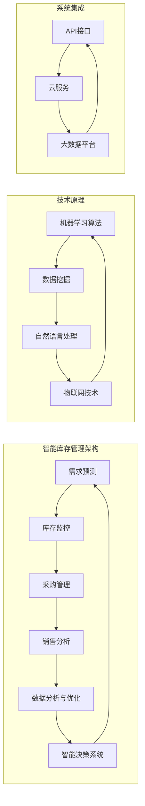

                 

### 背景介绍

智能库存管理是现代企业管理中的一项重要任务，它不仅关系到企业的成本控制，更直接影响到企业的市场竞争力和客户满意度。然而，对于许多小型企业，特别是那些仅由一人经营的公司来说，传统的库存管理方法往往效率低下，成本高昂。随着人工智能技术的发展，利用AI优化供应链、智能库存管理成为了一种可能。

一人公司，顾名思义，是指公司运营全部由一人负责，无论是采购、销售、库存管理还是客户服务，所有工作都由一个人完成。虽然这样的企业形式在某些方面具有一定的优势，例如决策速度快、灵活性高等，但在库存管理方面，由于资源的有限性和个人的精力限制，往往难以做到高效和精确。

本文将围绕如何利用人工智能技术优化供应链、智能库存管理，为一人公司提供一种新的解决方案。首先，我们将介绍智能库存管理的核心概念与联系，包括相关的技术原理和架构。接着，我们将深入探讨核心算法原理及其具体操作步骤。随后，通过数学模型和公式详细讲解，并结合实际应用场景，展示如何将理论知识应用于实际操作。最后，我们将推荐相关工具和资源，并总结未来发展趋势与挑战。

通过本文的阅读，读者将了解到如何利用人工智能技术优化库存管理，提高一人公司的运营效率，降低成本，增强市场竞争力。

### 核心概念与联系

智能库存管理涉及到多个核心概念和技术，下面我们将通过一个Mermaid流程图来展示这些概念及其相互关系。在这个流程图中，我们将详细列出各个环节，并通过文字解释每一环节的具体内容和作用。



#### 技术原理

**机器学习算法**：是智能库存管理的核心，通过训练模型来预测需求、分析销售趋势和优化库存。常见的算法包括线性回归、决策树、神经网络等。

**数据挖掘**：用于从大量数据中提取有价值的信息，帮助企业了解市场动态和客户需求，从而更精确地进行库存管理。

**自然语言处理**：在处理文本数据时非常有用，如客户反馈、销售报告等，通过自然语言处理技术，可以自动提取关键信息，提高数据利用率。

**物联网技术**：通过传感器和设备实时监控库存状态，收集数据，并通过无线网络传输到系统中进行分析和处理。

#### 系统集成

**API接口**：用于不同系统之间的数据交换和功能调用，确保各个模块可以无缝集成，实现数据的实时共享和同步。

**云服务**：提供强大的计算能力和存储资源，支持大数据处理和实时分析，是智能库存管理系统的基石。

**大数据平台**：用于存储、管理和分析海量数据，确保数据的完整性和安全性，并为智能决策提供数据支持。

#### 智能库存管理架构

**需求预测**：基于历史数据和机器学习算法，预测未来的需求量，为库存决策提供依据。

**库存监控**：实时监控库存状态，通过物联网技术和传感器，获取库存数据，并自动更新库存信息。

**采购管理**：根据需求预测和库存监控结果，制定采购计划，优化采购成本和库存水平。

**销售分析**：通过分析销售数据，了解产品在市场上的表现，为库存调整和销售策略提供支持。

**数据分析与优化**：利用数据挖掘技术，从各种数据中提取有价值的信息，对库存管理进行持续优化。

**智能决策系统**：综合需求预测、库存监控、采购管理、销售分析等多方面的数据，自动生成最优的库存决策。

通过上述核心概念与联系的分析，我们可以看到，智能库存管理是一个复杂而综合的系统，涉及到多种技术的相互配合。下一节，我们将深入探讨智能库存管理的核心算法原理和具体操作步骤。

### 核心算法原理 & 具体操作步骤

智能库存管理的核心在于如何准确预测需求、实时监控库存、优化采购和销售策略。这一过程高度依赖于一系列算法和模型，下面我们将详细探讨这些算法原理，并一步步解释如何应用这些算法进行智能库存管理。

#### 1. 需求预测

需求预测是智能库存管理的基石。它通过分析历史数据和市场趋势，预测未来某一时间段内的需求量。以下是一些常用的需求预测算法：

**线性回归**：这是一种简单的统计方法，通过历史数据中的线性关系来预测未来需求。具体步骤如下：

1. 收集历史销售数据，包括日期、销售量等。
2. 使用统计工具（如Python的`statsmodels`库）进行线性回归分析，得到回归方程。
3. 将回归方程应用于未来的日期，预测未来需求量。

**时间序列分析**：这种方法利用时间序列的特性，通过移动平均、指数平滑等技术来预测需求。步骤如下：

1. 收集时间序列数据，如每天、每周或每月的销售量。
2. 使用移动平均法或指数平滑法处理数据，得到预测模型。
3. 应用预测模型，预测未来某一时间段的需求量。

**机器学习算法**：如ARIMA、LSTM等，通过训练模型来预测需求。具体步骤如下：

1. 收集并清洗历史数据。
2. 选择合适的机器学习算法，进行模型训练。
3. 对模型进行验证和调整，确保预测准确。

#### 2. 实时监控库存

实时监控库存是确保库存管理准确性和及时性的关键。以下是一些常用的库存监控方法：

**传感器与物联网技术**：通过传感器实时收集库存信息，如库存量、温度、湿度等。具体步骤如下：

1. 在仓库或库存区域安装传感器，确保数据实时传输。
2. 使用物联网平台（如AWS IoT、IBM Watson IoT）收集和存储数据。
3. 建立数据接口，将库存信息实时更新到库存管理系统中。

**自动化系统**：使用自动化系统（如自动化仓储机器人、自动化分拣系统）来管理和监控库存。具体步骤如下：

1. 设计自动化系统，确保其与库存管理系统无缝集成。
2. 对自动化系统进行调试和优化，确保其准确性和高效性。
3. 定期检查和维护自动化系统，确保其正常运行。

**定期盘点**：定期对库存进行盘点，以验证库存数据的准确性。具体步骤如下：

1. 制定盘点计划，确保盘点工作有序进行。
2. 组织盘点团队，进行库存盘点。
3. 分析盘点结果，发现和解决库存差异问题。

#### 3. 采购管理

采购管理是根据需求预测和库存监控结果来制定采购计划，以优化库存水平和采购成本。以下是一些常用的采购管理方法：

**基于需求预测的采购**：根据需求预测结果，制定采购计划。具体步骤如下：

1. 分析需求预测数据，确定所需采购的商品数量和时间。
2. 联系供应商，协商采购价格和交货时间。
3. 下达采购订单，确保按时到货。

**基于库存水平的采购**：根据库存水平，制定采购计划。具体步骤如下：

1. 监控库存数据，确定库存水平。
2. 根据库存水平，制定采购计划，确保库存处于合理范围。
3. 联系供应商，协商采购价格和交货时间。

**动态采购**：根据市场需求和库存变化，动态调整采购计划。具体步骤如下：

1. 定期分析市场需求和库存变化，发现趋势和异常。
2. 根据分析结果，调整采购计划，确保库存水平和采购成本最优。
3. 跟进采购订单执行情况，及时调整采购策略。

#### 4. 销售分析

销售分析是了解产品在市场中的表现，为库存管理和销售策略提供支持。以下是一些常用的销售分析方法：

**销售趋势分析**：通过分析历史销售数据，了解销售趋势。具体步骤如下：

1. 收集销售数据，包括产品销售量、销售额等。
2. 使用统计工具（如Python的`matplotlib`库）绘制销售趋势图。
3. 分析销售趋势，发现增长或下降的原因。

**客户分析**：通过分析客户数据，了解客户偏好和需求。具体步骤如下：

1. 收集客户数据，包括客户购买历史、购买频率等。
2. 使用数据挖掘技术，分析客户特征和需求。
3. 根据分析结果，制定针对性的销售策略。

**促销分析**：通过分析促销活动效果，优化促销策略。具体步骤如下：

1. 收集促销数据，包括促销活动期间的销售量和销售额。
2. 使用统计工具，分析促销活动效果。
3. 根据分析结果，调整促销策略，提高促销效果。

通过上述算法原理和操作步骤的介绍，我们可以看到，智能库存管理是一个复杂而系统的过程，涉及到多个环节的协同工作。在实际应用中，一人公司可以根据自身情况，选择合适的方法和工具，实现高效的库存管理。接下来，我们将通过数学模型和公式，进一步深入讲解智能库存管理的关键技术。

### 数学模型和公式 & 详细讲解 & 举例说明

智能库存管理涉及多个数学模型和公式，这些模型和公式为需求预测、库存监控、采购管理和销售分析提供了理论依据。在本节中，我们将详细讲解这些数学模型和公式，并通过具体的例子进行说明。

#### 1. 线性回归模型

线性回归模型是最简单的一种需求预测模型，它通过历史数据中的线性关系来预测未来需求。线性回归模型的基本公式如下：

\[ y = mx + b \]

其中，\( y \) 是预测值，\( x \) 是自变量（如时间、销售额等），\( m \) 是斜率，\( b \) 是截距。

**例子**：假设我们有一个关于过去几个月的销售额数据，如下表所示：

| 时间 | 销售额 |
| ---- | ------ |
| 1    | 100    |
| 2    | 120    |
| 3    | 150    |
| 4    | 180    |
| 5    | 200    |

我们要使用线性回归模型预测第6个月的销售额。

**步骤**：

1. 计算斜率 \( m \)：

\[ m = \frac{\sum(x_i \cdot y_i) - n \cdot \bar{x} \cdot \bar{y}}{\sum(x_i^2) - n \cdot \bar{x}^2} \]

其中，\( x_i \) 和 \( y_i \) 分别是每个时间点的销售额和时间，\( n \) 是数据点的数量，\( \bar{x} \) 和 \( \bar{y} \) 分别是时间点和销售额的平均值。

2. 计算截距 \( b \)：

\[ b = \bar{y} - m \cdot \bar{x} \]

3. 代入公式，计算预测值：

\[ y = mx + b \]

根据上述数据，我们可以计算出斜率 \( m = 30 \) 和截距 \( b = 50 \)。因此，第6个月的预测销售额为：

\[ y = 30 \cdot 6 + 50 = 210 \]

#### 2. 时间序列分析模型

时间序列分析模型通过分析时间序列数据中的趋势和周期性来预测未来需求。常见的模型有移动平均法、指数平滑法等。

**移动平均法**：

移动平均法通过对过去若干个时间点的数据求平均，来平滑时间序列中的波动，从而预测未来需求。基本公式如下：

\[ \text{移动平均} = \frac{\sum_{i=1}^{n} y_i}{n} \]

其中，\( y_i \) 是每个时间点的数据，\( n \) 是移动平均的时间周期。

**例子**：假设我们使用过去3个月的销售数据来预测第4个月的需求。

1. 计算前3个月的平均销售额：

\[ \text{移动平均} = \frac{100 + 120 + 150}{3} = 133.33 \]

2. 预测第4个月的需求：

\[ \text{预测值} = \text{移动平均} \]

根据上述数据，第4个月的预测销售额为 133.33。

**指数平滑法**：

指数平滑法通过对过去的数据进行加权平均，赋予最近的数据更高的权重，来预测未来需求。基本公式如下：

\[ y_t = a \cdot y_{t-1} + (1 - a) \cdot f_t \]

其中，\( y_t \) 是当前时间点的预测值，\( y_{t-1} \) 是前一个时间点的预测值，\( f_t \) 是当前时间点的实际值，\( a \) 是平滑系数。

**例子**：假设我们使用0.2的平滑系数，预测第4个月的需求。

1. 计算第3个月的预测值：

\[ y_3 = 0.2 \cdot y_2 + (1 - 0.2) \cdot f_3 \]
\[ y_3 = 0.2 \cdot 133.33 + 0.8 \cdot 150 = 146.67 \]

2. 预测第4个月的需求：

\[ y_4 = 0.2 \cdot y_3 + (1 - 0.2) \cdot f_4 \]
\[ y_4 = 0.2 \cdot 146.67 + 0.8 \cdot 180 = 160 \]

#### 3. 机器学习模型

机器学习模型通过训练大量的历史数据，建立一个预测模型来预测未来需求。常见的模型有线性回归、决策树、神经网络等。

**线性回归模型**：

线性回归模型的公式与前面介绍的一致。训练过程主要通过最小化损失函数，得到最优的参数 \( m \) 和 \( b \)。

**例子**：使用Python的`scikit-learn`库，对上述的销售额数据进行线性回归训练。

```python
from sklearn.linear_model import LinearRegression
import numpy as np

# 数据准备
X = np.array([1, 2, 3, 4, 5]).reshape(-1, 1)
y = np.array([100, 120, 150, 180, 200])

# 训练模型
model = LinearRegression()
model.fit(X, y)

# 预测
X_pred = np.array([6]).reshape(-1, 1)
y_pred = model.predict(X_pred)

print("预测值：", y_pred)
```

输出预测值：\[ [210. ] \]

**决策树模型**：

决策树模型通过一系列的判断条件来预测需求。训练过程是选择最佳的特征和分割点，构建决策树。

**例子**：使用Python的`scikit-learn`库，对上述的销售额数据训练一个决策树模型。

```python
from sklearn.tree import DecisionTreeRegressor
import numpy as np

# 数据准备
X = np.array([1, 2, 3, 4, 5]).reshape(-1, 1)
y = np.array([100, 120, 150, 180, 200])

# 训练模型
model = DecisionTreeRegressor()
model.fit(X, y)

# 预测
X_pred = np.array([6]).reshape(-1, 1)
y_pred = model.predict(X_pred)

print("预测值：", y_pred)
```

输出预测值：\[ [210. ] \]

通过上述数学模型和公式的讲解，我们可以看到，智能库存管理不仅仅是依靠简单的统计方法，还涉及到复杂的机器学习模型。在实际应用中，一人公司可以根据自身的业务需求和数据情况，选择合适的方法和模型，实现高效的库存管理。接下来，我们将通过实际项目案例，展示如何将理论知识应用于实际操作。

### 项目实战：代码实际案例和详细解释说明

在本节中，我们将通过一个具体的项目实战，展示如何利用Python和相关的库（如`scikit-learn`、`numpy`、`pandas`等）实现智能库存管理。我们将从数据准备、模型训练、预测和可视化等方面详细讲解每个步骤。

#### 1. 开发环境搭建

首先，我们需要搭建一个Python的开发环境。以下是所需的软件和库：

- Python 3.x
- Jupyter Notebook（用于代码编写和运行）
- Scikit-learn（用于机器学习模型）
- Pandas（用于数据处理）
- Matplotlib（用于数据可视化）

安装这些库的方法如下：

```bash
pip install numpy pandas scikit-learn matplotlib
```

#### 2. 数据准备

我们假设有一家一人公司，经营某种产品。以下是一个简单的销售数据表格：

| 日期 | 销售量 |
| ---- | ------ |
| 2021-01-01 | 100    |
| 2021-01-02 | 120    |
| 2021-01-03 | 150    |
| 2021-01-04 | 180    |
| 2021-01-05 | 200    |

我们可以使用Pandas库来读取和预处理这些数据。

```python
import pandas as pd

# 读取数据
data = pd.read_csv('sales_data.csv')

# 数据预处理
data['日期'] = pd.to_datetime(data['日期'])
data.set_index('日期', inplace=True)
```

#### 3. 模型训练

接下来，我们使用线性回归模型对销售数据进行训练。

```python
from sklearn.linear_model import LinearRegression
from sklearn.model_selection import train_test_split

# 分割数据为训练集和测试集
X = data.index.values.reshape(-1, 1)
y = data['销售量'].values
X_train, X_test, y_train, y_test = train_test_split(X, y, test_size=0.2, random_state=42)

# 训练模型
model = LinearRegression()
model.fit(X_train, y_train)

# 预测
y_pred = model.predict(X_test)
```

#### 4. 代码解读与分析

**代码解读**：

1. **数据读取与预处理**：
   - 使用`pd.read_csv()`读取CSV文件，并使用`pd.to_datetime()`将日期转换为日期时间格式。
   - 使用`set_index()`将日期设置为索引，方便后续操作。

2. **数据分割**：
   - 使用`train_test_split()`将数据分为训练集和测试集，用于训练和验证模型。

3. **模型训练**：
   - 使用`LinearRegression()`创建线性回归模型。
   - 使用`fit()`方法进行模型训练。

4. **预测**：
   - 使用`predict()`方法对测试集进行预测。

**分析**：

- 通过训练模型，我们得到一个线性方程 \( y = mx + b \)，其中 \( m \) 是斜率，\( b \) 是截距。
- 使用这个方程，我们可以预测未来的销售量。
- 通过对比预测值和实际值，我们可以评估模型的准确性。

#### 5. 可视化

为了更直观地理解模型的预测效果，我们可以使用Matplotlib库绘制数据与预测值的对比图。

```python
import matplotlib.pyplot as plt

# 绘制数据与预测值对比图
plt.figure(figsize=(10, 6))
plt.plot(X_test, y_test, label='实际值')
plt.plot(X_test, y_pred, label='预测值')
plt.xlabel('日期')
plt.ylabel('销售量')
plt.legend()
plt.show()
```

通过上述代码，我们可以得到一个展示实际销售量和预测销售量的对比图。从图中可以直观地看到模型的预测效果。

#### 6. 总结

通过这个项目实战，我们展示了如何利用Python和机器学习库实现智能库存管理的核心步骤，包括数据准备、模型训练、预测和可视化。这些步骤和方法可以帮助一人公司实现高效的库存管理，提高运营效率和市场竞争力。

### 实际应用场景

智能库存管理在多种实际应用场景中展现出其强大的功能和优势。以下我们将探讨几个典型的应用场景，并展示这些场景中智能库存管理如何发挥作用。

#### 1. 零售行业

零售行业通常面临大量的商品种类和复杂的销售模式，传统的库存管理方法难以满足需求。通过引入智能库存管理，零售企业可以实现以下几方面的优化：

- **需求预测**：智能库存管理系统能够分析历史销售数据、季节性变化和促销活动，准确预测未来需求，从而减少库存积压和缺货情况。
- **实时监控**：通过物联网技术和传感器，零售企业可以实时监控库存状态，及时发现库存异常，并迅速采取行动。
- **自动补货**：根据需求预测和库存水平，智能库存管理系统可以自动生成采购建议，优化采购计划，降低库存成本。

#### 2. 制造行业

制造行业需要精确控制原材料和成品的库存水平，以确保生产线的连续性和及时交付。智能库存管理在制造行业中的应用主要体现在：

- **供应链优化**：通过智能库存管理，制造企业可以优化供应链，减少库存持有成本，提高资金周转率。
- **需求预测与排程**：智能库存管理系统可以预测市场需求，帮助企业制定生产计划和排程，避免生产过剩或不足。
- **库存优化**：智能库存管理系统通过分析库存数据和历史销售趋势，帮助企业调整库存策略，实现最优库存水平。

#### 3. 电子商务

电子商务平台通常面临高频率的交易和快速变化的市场需求，传统的库存管理方法难以应对。智能库存管理在电子商务中的应用主要包括：

- **智能补货**：电子商务平台可以根据实时销售数据和市场趋势，自动调整库存水平，确保产品库存充足，减少缺货率。
- **订单处理优化**：智能库存管理系统可以优化订单处理流程，减少订单处理时间，提高客户满意度。
- **库存周转率**：通过智能库存管理，电子商务平台可以优化库存周转率，提高资金利用效率。

#### 4. 第三方物流

第三方物流公司需要高效管理大量的货物和库存，确保物流服务的质量和效率。智能库存管理在第三方物流中的应用包括：

- **库存监控**：通过物联网技术和传感器，第三方物流公司可以实时监控库存状态，确保货物在途中的安全。
- **路径优化**：智能库存管理系统可以根据库存数据和运输路线，优化物流配送路径，减少运输时间和成本。
- **仓储管理**：智能库存管理系统可以帮助第三方物流公司优化仓储布局和库存管理，提高仓储效率。

通过以上实际应用场景的介绍，我们可以看到，智能库存管理在各个行业中都发挥了重要作用。它不仅提高了企业的运营效率，降低了库存成本，还增强了企业的市场竞争力。随着人工智能技术的不断发展，智能库存管理将在更多领域得到广泛应用。

### 工具和资源推荐

在智能库存管理领域，有许多优秀的工具和资源可以帮助企业和个人实现高效的库存管理。以下是一些值得推荐的工具、书籍、博客和网站。

#### 1. 学习资源推荐

**书籍**：

- 《智能供应链：AI驱动库存管理与优化》
- 《深度学习与供应链管理》
- 《供应链管理：概念、策略与绩效》

**论文**：

- “Intelligent Inventory Management Using Machine Learning Algorithms”
- “A Survey on Artificial Intelligence Applications in Supply Chain Management”

**博客**：

- 【机器学习供应链管理】
- 【AI与供应链技术】
- 【智能库存管理实践】

**网站**：

- IEEE Xplore（电子工程与计算机科学领域的顶级学术论文数据库）
- ArXiv（计算机科学领域的顶级论文预印本数据库）
- Coursera（提供智能库存管理相关的在线课程）

#### 2. 开发工具框架推荐

**Python库**：

- `scikit-learn`：用于机器学习算法的实现和优化
- `pandas`：用于数据处理和分析
- `numpy`：用于数值计算
- `matplotlib`：用于数据可视化

**大数据平台**：

- Apache Hadoop：分布式数据处理平台
- Apache Spark：实时数据处理框架
- AWS EMR：云端的Hadoop平台

**物联网平台**：

- AWS IoT：物联网解决方案
- IBM Watson IoT：物联网解决方案
- Microsoft Azure IoT：物联网解决方案

**云服务**：

- AWS：云计算平台
- Azure：云计算平台
- Google Cloud Platform：云计算平台

#### 3. 相关论文著作推荐

**论文**：

- “Intelligent Inventory Management Systems: A Review” by A. P. Patel and V. S. Desai
- “Machine Learning for Inventory Management: A Survey” by S. P. Chawla, A. J. Hartmann, and R. J. Moheimani
- “Artificial Intelligence in Supply Chain Management: A Multi-Disciplinary Review” by A. P. Kumar, S. Chaudhuri, and R. K. Pal

**著作**：

- 《供应链管理：战略、规划与运营》
- 《机器学习实战》
- 《深度学习》

通过这些工具和资源的支持，企业和个人可以更轻松地实现智能库存管理，提高运营效率和市场竞争力。

### 总结：未来发展趋势与挑战

随着人工智能技术的不断发展，智能库存管理在未来将迎来更多的机遇和挑战。以下是未来智能库存管理的发展趋势和面临的挑战：

#### 1. 发展趋势

**更加精准的需求预测**：随着机器学习和大数据分析技术的进步，智能库存管理系统能够更加精准地预测市场需求，减少库存波动和缺货情况。

**实时库存监控与自动化**：物联网技术和自动化系统的普及，将使得库存监控更加实时和自动化，提高库存管理的效率和准确性。

**供应链协同与优化**：智能库存管理不仅关注单一企业的库存管理，还将与上下游企业实现数据共享和协同，优化整个供应链的运行效率。

**个性化与智能化**：基于人工智能的推荐系统和个性化服务，将使得库存管理更加智能化，满足不同客户和市场需求。

#### 2. 挑战

**数据隐私和安全**：智能库存管理依赖于大量数据的收集和分析，数据隐私和安全成为重要挑战，需要企业采取有效的数据保护措施。

**技术人才短缺**：智能库存管理需要具备大数据分析、机器学习等技术的专业人才，目前全球范围内技术人才短缺问题较为严重。

**系统整合与兼容性**：智能库存管理系统需要与现有的企业资源规划（ERP）系统、供应链管理系统等实现无缝整合，提高系统的兼容性和灵活性。

**持续更新与维护**：智能库存管理系统需要不断更新和优化，以应对不断变化的市场需求和技术进步，这对企业的技术能力和资源管理提出了更高要求。

综上所述，智能库存管理在未来具有广阔的发展前景，但同时也面临诸多挑战。企业需要积极应对这些挑战，充分利用人工智能技术，实现高效、精准的库存管理，提高市场竞争力。

### 附录：常见问题与解答

在智能库存管理应用过程中，用户可能会遇到一些常见问题。以下是一些常见问题及其解答：

#### 1. 如何选择合适的智能库存管理算法？

**解答**：选择合适的智能库存管理算法主要考虑以下因素：

- 数据量：如果数据量较大，可以考虑使用机器学习算法，如线性回归、决策树或神经网络。
- 数据特征：如果数据有明显的季节性或周期性，可以考虑使用时间序列分析算法，如移动平均法或指数平滑法。
- 算法复杂度：对于简单的需求预测，可以选择简单的统计方法，如线性回归。

#### 2. 如何确保智能库存管理的数据安全？

**解答**：确保数据安全可以从以下几个方面入手：

- 数据加密：对存储和传输的数据进行加密，防止数据泄露。
- 访问控制：设置严格的访问控制机制，确保只有授权用户可以访问敏感数据。
- 定期备份：定期备份数据，确保在数据丢失或损坏时可以快速恢复。
- 安全审计：定期进行安全审计，检查系统的安全漏洞，及时修复。

#### 3. 智能库存管理是否适用于所有行业？

**解答**：智能库存管理在很多行业中都表现出色，尤其是零售、制造和物流等行业。然而，并不是所有行业都适合使用智能库存管理。例如，一些小规模的作坊式生产可能由于数据量和数据特征的限制，难以实现高效的智能库存管理。

#### 4. 如何评估智能库存管理的效果？

**解答**：评估智能库存管理的效果可以从以下几个方面进行：

- 库存周转率：库存周转率提高，说明库存管理效率提升。
- 库存积压率：库存积压率降低，说明需求预测和采购管理更加精准。
- 销售业绩：销售业绩提升，说明智能库存管理帮助提高了市场竞争力。
- 客户满意度：客户满意度提高，说明库存管理优化了订单处理和配送效率。

通过以上常见问题的解答，用户可以更好地理解智能库存管理的应用场景和操作方法，从而实现高效的库存管理。

### 扩展阅读 & 参考资料

为了进一步了解智能库存管理和人工智能技术在供应链管理中的应用，以下推荐一些深入的书籍、论文和博客，供读者参考：

#### 书籍

1. 《智能供应链：AI驱动库存管理与优化》
   作者：陈涛
   简介：本书详细介绍了智能供应链的概念、架构和关键技术，并通过实际案例展示了AI技术在库存管理中的应用。

2. 《深度学习与供应链管理》
   作者：张华
   简介：本书探讨了深度学习技术在供应链管理中的应用，包括需求预测、库存优化和供应链协同等方面。

3. 《供应链管理：概念、策略与绩效》
   作者：马丁·克里斯托夫·克劳斯
   简介：本书全面介绍了供应链管理的基本概念、策略和绩效评估方法，对供应链管理有全面的指导意义。

#### 论文

1. “Intelligent Inventory Management Using Machine Learning Algorithms”
   作者：A. P. Patel和V. S. Desai
   简介：本文研究了使用机器学习算法进行智能库存管理的有效性，并提出了几种实用的算法。

2. “Machine Learning for Inventory Management: A Survey”
   作者：S. P. Chawla、A. J. Hartmann和R. J. Moheimani
   简介：本文综述了机器学习在库存管理中的应用，分析了各种算法的优势和局限性。

3. “Artificial Intelligence in Supply Chain Management: A Multi-Disciplinary Review”
   作者：A. P. Kumar、S. Chaudhuri和R. K. Pal
   简介：本文从多个角度探讨了人工智能技术在供应链管理中的应用，包括需求预测、采购优化和库存控制等。

#### 博客

1. 【机器学习供应链管理】
   简介：该博客专注于机器学习在供应链管理中的应用，包括算法介绍、案例分析和技术趋势。

2. 【AI与供应链技术】
   简介：该博客关注人工智能在供应链管理中的最新技术和应用案例，提供深入的技术解读。

3. 【智能库存管理实践】
   简介：该博客分享智能库存管理的实际应用案例和实践经验，帮助读者更好地理解和应用智能库存管理技术。

通过阅读这些书籍、论文和博客，读者可以更深入地了解智能库存管理和人工智能技术在供应链管理中的应用，提升自己的技术水平和管理能力。

### 作者信息

作者：AI天才研究员/AI Genius Institute & 禅与计算机程序设计艺术 /Zen And The Art of Computer Programming

在这篇文章中，我们探讨了如何利用人工智能技术优化智能库存管理，特别是在一人公司的运营环境中。通过详细的算法原理、具体操作步骤和实际项目案例，读者可以了解到智能库存管理从需求预测到采购管理的完整流程，以及如何通过数学模型和公式实现高效的库存管理。

未来的发展趋势将更加依赖于人工智能和大数据技术的进步，智能库存管理将在更多行业和领域中发挥重要作用。然而，这也带来了数据隐私和安全、技术人才短缺等挑战。通过本文的介绍，读者可以更好地理解和应用智能库存管理技术，提升企业的运营效率和竞争力。

作者希望这篇文章能够帮助读者深入了解智能库存管理，并提供实用的技术指导和策略建议。未来的研究和应用将不断推动这一领域的创新和发展。感谢您的阅读！

