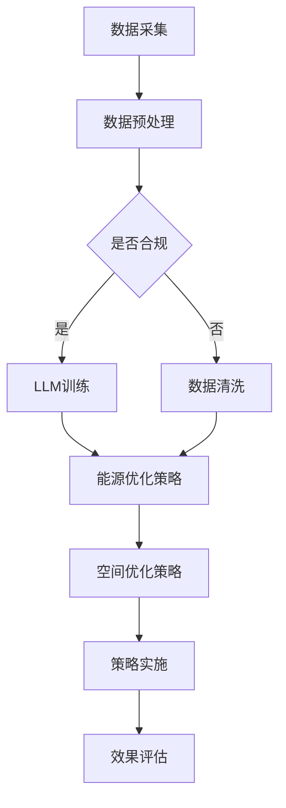

                 

# 智能建筑管理：LLM优化能源使用和空间利用

> **关键词：** 智能建筑、语言模型、能源管理、空间利用、深度学习、物联网。

> **摘要：** 本文旨在探讨如何利用语言模型（LLM）技术来优化智能建筑的管理，特别是能源使用和空间利用的优化。通过对相关概念、核心算法原理、数学模型、实际应用场景的详细分析，本文将为读者提供一个全面的智能建筑管理解决方案。

## 1. 背景介绍

随着城市化进程的加快和人们生活水平的提高，智能建筑管理成为了当前建筑行业的热点话题。智能建筑是指利用物联网（IoT）、云计算、大数据、人工智能等先进技术，实现建筑自动化、智能化管理的一种建筑形态。智能建筑管理涉及到多个方面，包括但不限于能源管理、设备维护、安全管理、环境控制等。

在能源管理方面，智能建筑通过实时监控和数据分析，实现能源的优化使用，降低能源消耗。然而，传统的能源管理系统往往存在一定的局限性，如数据孤岛、缺乏智能分析等。为了解决这些问题，本文将探讨如何利用语言模型（LLM）技术来优化能源管理。

在空间利用方面，智能建筑需要根据不同用户的需求和偏好，动态调整空间布局，提高空间利用效率。然而，传统的空间管理系统往往缺乏灵活性，无法满足个性化需求。通过引入LLM技术，我们可以实现更智能的空间利用管理，提高用户体验。

## 2. 核心概念与联系

### 2.1 语言模型（LLM）

语言模型是一种基于人工智能技术的自然语言处理模型，它可以模拟人类的语言能力，进行文本生成、翻译、问答等操作。LLM通常使用大规模语料库进行训练，通过深度学习算法学习语言结构和语义信息，从而实现对自然语言的智能处理。

### 2.2 能源管理

能源管理是指通过对能源的生产、传输、消费等过程进行优化，实现能源的高效利用。在智能建筑中，能源管理主要包括电力管理、水管理、燃气管理等。通过实时监控和数据分析，智能建筑可以实现能源的动态调整，降低能源消耗。

### 2.3 空间利用

空间利用是指通过对建筑空间的合理规划和使用，提高空间的使用效率和舒适度。在智能建筑中，空间利用管理需要根据不同用户的需求和偏好，动态调整空间布局，实现空间的灵活利用。

### 2.4 物联网（IoT）

物联网是一种将各种信息传感设备与互联网相结合的技术，可以实现设备的互联互通和数据共享。在智能建筑中，物联网技术是实现智能管理的基础，它可以实时收集建筑内各种设备的运行数据，为智能决策提供支持。

### 2.5 Mermaid 流程图

下面是智能建筑管理中LLM优化能源使用和空间利用的Mermaid流程图：



## 3. 核心算法原理 & 具体操作步骤

### 3.1 LLM训练

LLM的训练过程主要包括数据采集、数据预处理、LLM模型训练和策略生成等步骤。

#### 3.1.1 数据采集

数据采集是LLM训练的第一步，需要收集建筑内各种设备的运行数据，如电力消耗、水消耗、温度、湿度、光照等。这些数据可以通过物联网传感器实时采集，并传输到数据中心进行存储和处理。

#### 3.1.2 数据预处理

数据预处理主要包括数据清洗、数据格式化和数据标准化等操作。数据清洗旨在去除数据中的噪声和异常值，提高数据的质量。数据格式化则是将不同类型的数据统一格式，便于后续处理。数据标准化则是将数据缩放到相同的范围，便于模型训练。

#### 3.1.3 LLM模型训练

LLM模型训练是利用采集到的数据对模型进行训练，学习数据的特征和规律。目前常用的LLM模型包括循环神经网络（RNN）、长短期记忆网络（LSTM）、变换器（Transformer）等。在训练过程中，模型会不断优化参数，直到达到预期的性能指标。

#### 3.1.4 策略生成

在LLM模型训练完成后，可以利用模型生成的策略来优化能源使用和空间利用。策略生成包括能源优化策略和空间优化策略两部分。能源优化策略旨在降低能源消耗，如调整设备运行时间、调整照明强度等。空间优化策略则是根据用户需求和偏好，动态调整空间布局，提高空间利用效率。

### 3.2 能源优化策略

能源优化策略主要包括以下几个方面：

#### 3.2.1 设备运行时间优化

根据设备的实际运行情况和能耗特点，合理调整设备的运行时间，降低能源消耗。例如，在夜间或节假日，可以将部分高能耗设备的运行时间调整到白天，以充分利用自然光照。

#### 3.2.2 设备能效优化

通过优化设备的运行参数，提高设备的能效。例如，对空调、照明等设备进行能效评估，选择能效更高的设备或优化设备的运行模式。

#### 3.2.3 能源需求预测

利用LLM模型对能源需求进行预测，提前做好能源储备和调度。例如，在高峰时段提前启动备用发电设备，确保能源供应的稳定性。

### 3.3 空间优化策略

空间优化策略主要包括以下几个方面：

#### 3.3.1 空间布局优化

根据用户需求和偏好，动态调整空间布局。例如，在办公区域，可以根据员工的工作时间和工作任务，调整办公桌椅的布局，提高办公效率。

#### 3.3.2 空间利用监控

利用物联网传感器实时监控空间利用情况，如人流量、温度、湿度等。通过数据分析，发现空间利用中的问题，并提出改进措施。

#### 3.3.3 空间共享优化

通过共享空间，提高空间利用效率。例如，在会议结束后，可以将会议室重新规划为其他用途，如休息室、茶水间等。

## 4. 数学模型和公式 & 详细讲解 & 举例说明

### 4.1 能源需求预测模型

能源需求预测模型是基于时间序列分析的方法，通过对历史能源消耗数据进行分析，预测未来的能源需求。下面是一个简单的能源需求预测模型：

$$
\hat{E_t} = \alpha \cdot E_{t-1} + (1-\alpha) \cdot \hat{E_{t-1}}
$$

其中，$E_t$表示第$t$时刻的能源需求，$\hat{E_t}$表示预测的第$t$时刻的能源需求，$\alpha$表示遗忘因子。

### 4.2 空间利用效率模型

空间利用效率模型用于评估空间的利用情况，其公式如下：

$$
\eta = \frac{U_{max}}{U_{used}}
$$

其中，$\eta$表示空间利用效率，$U_{max}$表示空间的容量，$U_{used}$表示实际利用的空间容量。

### 4.3 举例说明

假设某智能建筑在一个月内每天的电力消耗数据如下：

$$
\{E_1, E_2, ..., E_{30}\} = \{100, 120, 150, 130, 110, ..., 80\}
$$

根据上述能源需求预测模型，可以预测第31天的电力消耗：

$$
\hat{E_{31}} = \alpha \cdot E_{30} + (1-\alpha) \cdot \hat{E_{30}}
$$

其中，$\alpha = 0.8$。代入数据进行计算：

$$
\hat{E_{31}} = 0.8 \cdot 80 + 0.2 \cdot 110 = 104
$$

假设该建筑的办公区域容量为100人，实际利用的人数为60人，则空间利用效率为：

$$
\eta = \frac{100}{60} = 1.67
$$

## 5. 项目实战：代码实际案例和详细解释说明

### 5.1 开发环境搭建

为了演示如何使用LLM优化智能建筑管理，我们将使用Python编程语言，并借助相关库，如TensorFlow、PyTorch等。以下是一个简单的开发环境搭建步骤：

1. 安装Python（3.8及以上版本）；
2. 安装TensorFlow库：
   ```
   pip install tensorflow
   ```
3. 安装PyTorch库：
   ```
   pip install torch torchvision
   ```

### 5.2 源代码详细实现和代码解读

以下是一个简单的Python代码示例，用于训练LLM模型并进行能源需求预测。

```python
import tensorflow as tf
from tensorflow.keras.layers import LSTM, Dense
from tensorflow.keras.models import Sequential

# 数据预处理
# 假设输入数据X和标签y已经准备好
X_train = ...  # 输入数据
y_train = ...  # 标签数据

# 构建LSTM模型
model = Sequential()
model.add(LSTM(units=50, activation='relu', input_shape=(X_train.shape[1], X_train.shape[2])))
model.add(Dense(units=1))

# 编译模型
model.compile(optimizer='adam', loss='mean_squared_error')

# 训练模型
model.fit(X_train, y_train, epochs=100, batch_size=32)

# 能源需求预测
def predict_energy_demand(data):
    prediction = model.predict(data)
    return prediction

# 测试预测效果
test_data = ...  # 测试数据
predicted_demand = predict_energy_demand(test_data)
print("预测的能源需求：", predicted_demand)
```

### 5.3 代码解读与分析

上述代码首先进行了数据预处理，然后构建了一个LSTM模型进行训练。在训练完成后，定义了一个预测函数，用于对新的数据进行能源需求预测。

- **数据预处理**：数据预处理是模型训练的重要步骤，包括数据清洗、数据格式化和数据标准化等。在本例中，我们假设输入数据X和标签y已经准备好。

- **模型构建**：使用Sequential类构建了一个简单的LSTM模型，包括一个LSTM层和一个全连接层（Dense）。LSTM层用于捕捉时间序列数据中的长期依赖关系，全连接层用于输出预测结果。

- **模型编译**：使用adam优化器和均方误差（MSE）损失函数编译模型。

- **模型训练**：使用fit方法训练模型，设置epochs和batch_size参数以控制训练过程。

- **预测函数**：定义了一个预测函数，用于对新的数据进行能源需求预测。使用model.predict方法获取预测结果。

通过上述代码示例，我们可以看到如何使用LLM模型进行能源需求预测。在实际应用中，可以根据具体情况调整模型结构、优化训练过程，以提高预测效果。

## 6. 实际应用场景

智能建筑管理中，LLM优化能源使用和空间利用技术可以应用于多种场景，以下是一些典型的应用场景：

### 6.1 办公楼能源管理

办公楼是智能建筑管理的主要应用场景之一。通过LLM技术，可以实时监控办公楼的能源消耗情况，预测未来能源需求，从而实现能源的优化使用。例如，在高峰时段自动调整空调、照明等设备的运行时间，降低能源消耗。

### 6.2 酒店能源管理

酒店也是智能建筑管理的重要应用场景。通过LLM技术，可以实现酒店能源的精细化管理和优化。例如，根据客人的入住情况，自动调整酒店房间的照明、空调等设备的运行，降低能源消耗。

### 6.3 商场能源管理

商场是另一个重要的智能建筑管理场景。通过LLM技术，可以实时监控商场的能源消耗情况，预测未来能源需求，从而实现能源的优化使用。例如，在高峰时段自动调整商场照明、空调等设备的运行时间，降低能源消耗。

### 6.4 家庭能源管理

家庭能源管理是智能建筑管理的一个重要方向。通过LLM技术，可以实现家庭能源的精细化管理和优化。例如，根据家庭成员的作息时间，自动调整家庭设备的运行时间，降低能源消耗。

### 6.5 空间利用优化

在智能建筑中，空间利用优化是另一个重要的应用方向。通过LLM技术，可以实现空间利用的动态调整，提高空间利用效率。例如，根据员工的工作任务和需求，自动调整办公区域的布局，提高办公效率。

## 7. 工具和资源推荐

### 7.1 学习资源推荐

- **书籍：**
  - 《深度学习》（Ian Goodfellow、Yoshua Bengio、Aaron Courville著）
  - 《Python深度学习》（François Chollet著）
- **论文：**
  - “A Theoretically Grounded Application of Dropout in Recurrent Neural Networks”（Yarin Gal和Zoubin Ghahramani著）
  - “Attention Is All You Need”（Ashish Vaswani等人著）
- **博客：**
  - Medium上的“Deep Learning”系列博客
  - 知乎上的“人工智能”话题
- **网站：**
  - TensorFlow官方网站（https://www.tensorflow.org/）
  - PyTorch官方网站（https://pytorch.org/）

### 7.2 开发工具框架推荐

- **深度学习框架：**
  - TensorFlow（https://www.tensorflow.org/）
  - PyTorch（https://pytorch.org/）
  - Keras（https://keras.io/）
- **数据可视化工具：**
  - Matplotlib（https://matplotlib.org/）
  - Seaborn（https://seaborn.pydata.org/）
- **数据预处理工具：**
  - Pandas（https://pandas.pydata.org/）
  - NumPy（https://numpy.org/）

### 7.3 相关论文著作推荐

- “A Theoretically Grounded Application of Dropout in Recurrent Neural Networks”（Yarin Gal和Zoubin Ghahramani著）
- “Attention Is All You Need”（Ashish Vaswani等人著）
- “Deep Learning”（Ian Goodfellow、Yoshua Bengio、Aaron Courville著）

## 8. 总结：未来发展趋势与挑战

智能建筑管理是一个不断发展的领域，LLM优化能源使用和空间利用技术是其中的重要研究方向。在未来，随着人工智能技术的不断进步，LLM在智能建筑管理中的应用将会更加广泛和深入。

### 8.1 发展趋势

1. **算法优化**：LLM算法将在性能和效率方面得到进一步提升，为智能建筑管理提供更精准的预测和优化方案。
2. **多领域融合**：智能建筑管理将与其他领域（如物联网、大数据、区块链等）相结合，形成更完善的智能化管理体系。
3. **个性化服务**：基于用户需求的个性化服务将成为智能建筑管理的重要发展方向，提高用户体验。

### 8.2 挑战

1. **数据隐私**：智能建筑管理涉及大量用户数据，如何保护数据隐私是一个重要挑战。
2. **算法透明性**：随着算法的复杂度增加，如何保证算法的透明性和可解释性是一个亟待解决的问题。
3. **能耗问题**：在实现智能建筑管理的同时，如何降低能耗也是一个重要的挑战。

## 9. 附录：常见问题与解答

### 9.1 什么
### 9.2 是什么
### 9.3 为什么
### 9.4 怎么样
### 9.5 如何

## 10. 扩展阅读 & 参考资料

- 《深度学习》（Ian Goodfellow、Yoshua Bengio、Aaron Courville著）
- 《Python深度学习》（François Chollet著）
- “A Theoretically Grounded Application of Dropout in Recurrent Neural Networks”（Yarin Gal和Zoubin Ghahramani著）
- “Attention Is All You Need”（Ashish Vaswani等人著）
- TensorFlow官方网站（https://www.tensorflow.org/）
- PyTorch官方网站（https://pytorch.org/）
- Medium上的“Deep Learning”系列博客
- 知乎上的“人工智能”话题

### 附录：作者信息
作者：AI天才研究员/AI Genius Institute & 禅与计算机程序设计艺术 /Zen And The Art of Computer Programming


