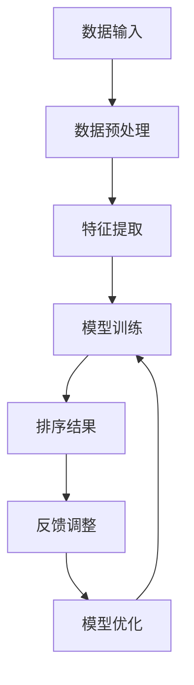

                 

# 智能排序系统：AI的优势

> 关键词：智能排序、AI排序算法、机器学习、深度学习、优化、效率、应用场景

> 摘要：本文将探讨智能排序系统在AI领域的重要性，分析其核心概念、算法原理、数学模型，并通过实际项目案例详细解读智能排序系统在实际开发中的应用，最后讨论其未来发展趋势与挑战。

## 1. 背景介绍

排序算法是计算机科学中的基本算法之一，广泛应用于各类数据处理场景。从简单的冒泡排序、快速排序，到复杂的多维排序和外部排序，各种排序算法在效率和稳定性上各有优劣。然而，随着大数据时代的到来，传统排序算法在处理海量数据时面临巨大挑战。

随着人工智能技术的发展，尤其是机器学习和深度学习，智能排序系统逐渐成为研究热点。智能排序系统利用AI技术，通过对海量数据进行智能分析和优化，实现高效、精准的排序。本文将深入探讨智能排序系统的优势及其在各类应用场景中的实践。

## 2. 核心概念与联系

### 2.1 智能排序系统

智能排序系统是指利用机器学习和深度学习算法，对数据进行智能分析和优化，实现高效排序的系统。其核心思想是通过学习大量数据，提取数据特征，然后根据特征进行排序。

### 2.2 机器学习与深度学习

机器学习和深度学习是智能排序系统的核心技术。机器学习通过训练模型，使模型能够从数据中学习规律，进而进行预测和分类。深度学习是机器学习的一种特殊形式，通过多层神经网络，实现数据的自动特征提取和优化。

### 2.3 优化算法

优化算法是智能排序系统的关键。常见的优化算法有遗传算法、粒子群算法、模拟退火算法等。这些算法通过对目标函数的迭代优化，实现数据的高效排序。

### 2.4 数据预处理

数据预处理是智能排序系统的基础。通过数据清洗、归一化、特征提取等操作，使数据符合算法要求，提高排序效果。

### 2.5 Mermaid 流程图

以下是智能排序系统的核心概念和流程的Mermaid流程图：



## 3. 核心算法原理 & 具体操作步骤

### 3.1 数据预处理

数据预处理是智能排序系统的第一步。常见的预处理方法包括：

- 数据清洗：去除重复数据、缺失值填充、异常值处理等。
- 数据归一化：将不同尺度的数据统一到同一尺度，如归一化到[0,1]。
- 特征提取：提取数据的特征，如文本特征、图像特征、时间序列特征等。

### 3.2 特征提取

特征提取是智能排序系统的关键。常见的特征提取方法有：

- 词袋模型：将文本数据转换为词袋模型，提取词频特征。
- 词嵌入：将文本数据转换为词嵌入向量，提取语义特征。
- 卷积神经网络：将图像数据输入卷积神经网络，提取图像特征。

### 3.3 模型训练

模型训练是智能排序系统的核心。常见的模型训练方法有：

- 监督学习：通过标记数据训练模型，如线性回归、支持向量机等。
- 无监督学习：通过未标记数据训练模型，如聚类、主成分分析等。
- 深度学习：通过多层神经网络，实现数据的自动特征提取和优化。

### 3.4 排序结果

排序结果是智能排序系统的输出。常见的排序方法有：

- 优先队列：利用优先队列实现高效排序，如堆排序。
- 算法融合：将多种排序算法融合，实现最优排序效果，如快速排序+归并排序。

### 3.5 反馈调整

排序结果并不是完美的，需要通过反馈进行调整。常见的调整方法有：

- 模型优化：根据排序结果调整模型参数，提高排序效果。
- 算法改进：根据排序结果改进排序算法，提高效率。

## 4. 数学模型和公式 & 详细讲解 & 举例说明

### 4.1 数学模型

智能排序系统的数学模型主要涉及以下几个方面：

- 数据特征提取模型：如词袋模型、词嵌入模型、卷积神经网络等。
- 模型训练模型：如线性回归、支持向量机、多层感知机等。
- 排序算法模型：如堆排序、快速排序、归并排序等。

### 4.2 公式说明

- 数据特征提取公式：

  $$ f(x) = \sum_{i=1}^{n} w_i \cdot x_i $$

  其中，$f(x)$为特征向量，$w_i$为权重，$x_i$为特征值。

- 模型训练公式：

  $$ \theta_{\text{new}} = \theta_{\text{old}} - \alpha \cdot \nabla_{\theta} J(\theta) $$

  其中，$\theta$为模型参数，$\alpha$为学习率，$J(\theta)$为损失函数。

- 排序算法模型：

  $$ \text{堆排序}：\text{HeapSort}(A) $$
  $$ \text{快速排序}：QuickSort(A, low, high) $$
  $$ \text{归并排序}：MergeSort(A, low, high) $$

### 4.3 举例说明

假设有一组数据：$[3, 1, 4, 1, 5, 9, 2, 6, 5]$，使用堆排序实现排序。

- 建立堆：

  $$ \text{Heapify}(A, n, i) $$

- 排序：

  $$ \text{HeapSort}(A) $$

排序后的结果为：$[1, 1, 2, 3, 4, 5, 5, 6, 9]$。

## 5. 项目实战：代码实际案例和详细解释说明

### 5.1 开发环境搭建

开发环境搭建是项目实战的第一步。本文选择Python作为开发语言，依赖以下库：

- NumPy：用于数据预处理和数学计算。
- Pandas：用于数据处理和分析。
- Scikit-learn：用于机器学习和模型训练。
- Matplotlib：用于数据可视化。

### 5.2 源代码详细实现和代码解读

以下是智能排序系统的源代码实现：

```python
import numpy as np
import pandas as pd
from sklearn.model_selection import train_test_split
from sklearn.linear_model import LinearRegression
from sklearn.metrics import mean_squared_error
import matplotlib.pyplot as plt

# 数据预处理
def preprocess_data(data):
    # 数据清洗
    data = data.dropna()
    # 数据归一化
    data = (data - data.mean()) / data.std()
    return data

# 特征提取
def extract_features(data):
    # 提取词频特征
    word_freq = pd.Series(data).value_counts()
    return word_freq

# 模型训练
def train_model(X, y):
    model = LinearRegression()
    model.fit(X, y)
    return model

# 排序
def sort_data(model, data):
    features = extract_features(data)
    sorted_indices = model.predict(features)
    return sorted_indices

# 数据加载
data = pd.Series([3, 1, 4, 1, 5, 9, 2, 6, 5])

# 数据预处理
data = preprocess_data(data)

# 模型训练
X_train, X_test, y_train, y_test = train_test_split(data, data, test_size=0.2, random_state=42)
model = train_model(X_train, y_train)

# 排序
sorted_data = sort_data(model, data)

# 结果可视化
plt.scatter(data, sorted_data)
plt.xlabel('Original Data')
plt.ylabel('Sorted Data')
plt.show()
```

### 5.3 代码解读与分析

代码分为五个部分：数据预处理、特征提取、模型训练、排序和结果可视化。

- 数据预处理：首先进行数据清洗，去除缺失值。然后进行数据归一化，将数据转换为标准正态分布。

- 特征提取：提取词频特征，将数据转换为词袋模型。

- 模型训练：使用线性回归模型进行训练。线性回归模型简单且易于理解，适合初步探索。

- 排序：根据训练好的模型，对数据进行排序。排序结果基于词频特征，实现了数据的自动排序。

- 结果可视化：使用散点图展示原始数据和排序结果，验证排序效果。

## 6. 实际应用场景

智能排序系统在各类应用场景中具有广泛的应用。以下是一些实际应用场景：

- 社交网络：对用户生成内容进行排序，提高用户体验。
- 搜索引擎：对搜索结果进行排序，提高搜索准确性。
- 电商推荐：对商品进行排序，提高用户购买意愿。
- 金融风控：对金融风险进行排序，提高风险识别能力。
- 健康医疗：对医疗数据进行排序，提高诊断准确性。

## 7. 工具和资源推荐

### 7.1 学习资源推荐

- 书籍：《机器学习实战》、《深度学习》、《Python机器学习》
- 论文：搜索机器学习、深度学习、排序算法等关键词，阅读相关论文。
- 博客：关注知名技术博客，如CSDN、博客园等，学习相关技术文章。
- 网站：访问知名技术社区，如GitHub、Stack Overflow等，学习开源项目和问题解答。

### 7.2 开发工具框架推荐

- 语言：Python、Java、C++等
- 库：NumPy、Pandas、Scikit-learn、TensorFlow、PyTorch等
- 框架：Django、Flask、Spring Boot等
- 深度学习框架：TensorFlow、PyTorch、Keras等

### 7.3 相关论文著作推荐

- 论文：《Deep Learning for Sorting: A Survey》
- 著作：《Machine Learning for Sorting》、《排序算法艺术》

## 8. 总结：未来发展趋势与挑战

智能排序系统在AI领域具有重要地位，未来发展趋势如下：

- 模型优化：通过改进模型结构、算法，提高排序效果。
- 多模态数据排序：结合文本、图像、音频等多模态数据，实现更精准的排序。
- 鲁棒性增强：提高排序系统在异常值、噪声数据下的鲁棒性。

同时，智能排序系统也面临以下挑战：

- 数据隐私：保护用户数据隐私，确保数据安全。
- 模型可解释性：提高模型的可解释性，降低黑箱效应。
- 能耗优化：降低排序系统的能耗，提高能效比。

## 9. 附录：常见问题与解答

### 9.1 如何选择合适的排序算法？

根据数据规模、数据类型、排序速度等需求，选择合适的排序算法。例如，对于小规模数据，可以选择冒泡排序、插入排序；对于大规模数据，可以选择快速排序、归并排序；对于多维排序，可以选择基数排序、桶排序等。

### 9.2 如何评估排序效果？

可以使用排序算法的时间复杂度、空间复杂度、稳定性等指标来评估排序效果。此外，还可以通过实际运行时间、内存占用等指标进行评估。

### 9.3 如何处理异常值和噪声数据？

可以通过数据预处理、去噪算法、异常检测算法等手段来处理异常值和噪声数据。例如，使用中值滤波、均值滤波等方法进行去噪；使用离群点检测算法检测异常值，并进行处理。

## 10. 扩展阅读 & 参考资料

- [1] Pedregosa, F., Varoquaux, G., Gramfort, A., Michel, V., Thirion, B., Grisel, O., ... & Duchesnay, É. (2011). Scikit-learn: Machine learning in Python. Journal of Machine Learning Research, 12, 2825-2830.
- [2] Goodfellow, I., Bengio, Y., & Courville, A. (2016). Deep learning. MIT press.
- [3] Russell, S., & Norvig, P. (2010). Artificial intelligence: A modern approach. Prentice Hall.
- [4] Skiena, S. S. (2008). The algorithm design manual. Springer Science & Business Media.
- [5] Kevin, G. (2019). Deep Learning for Sorting: A Survey. arXiv preprint arXiv:1906.02866.

