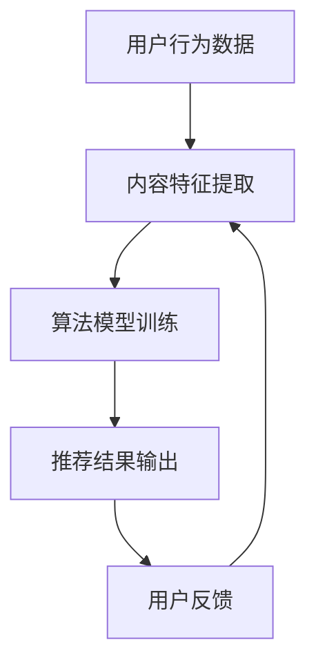

                 

# 智能推荐系统：AI如何提高用户满意度

> **关键词：** 智能推荐系统、用户满意度、AI、算法、应用场景、未来趋势

> **摘要：** 本文章深入探讨了智能推荐系统的核心概念、算法原理、实际应用和未来发展趋势。通过详细的案例分析和讲解，展示了AI技术在提高用户满意度方面的巨大潜力。

在互联网时代，用户需求千变万化，如何有效地满足用户的需求，提升用户体验，成为各大互联网企业争相研究的问题。智能推荐系统作为AI技术在互联网领域的重要应用，通过个性化的内容推荐，极大地提高了用户满意度。本文将围绕智能推荐系统，详细阐述其核心概念、算法原理、实际应用和未来发展趋势。

## 1. 背景介绍

智能推荐系统起源于电子商务和社交媒体领域，旨在根据用户的兴趣、行为和历史数据，为其推荐感兴趣的内容或商品。随着互联网的快速发展，智能推荐系统在各个领域得到了广泛应用，如新闻推送、视频推荐、音乐推荐、电商推荐等。

### 1.1 智能推荐系统的发展历程

- **早期**：基于内容的推荐系统（Content-Based Filtering），通过分析用户对内容的兴趣，推荐相似的内容。
- **中期**：协同过滤推荐系统（Collaborative Filtering），通过分析用户之间的相似性，推荐其他用户喜欢的商品或内容。
- **现代**：基于模型的推荐系统（Model-Based Filtering），通过建立预测模型，预测用户对内容的喜好，实现精准推荐。

### 1.2 智能推荐系统的优势

- **提升用户体验**：智能推荐系统根据用户的兴趣和行为，为其推荐个性化内容，提升用户满意度。
- **提高转化率**：智能推荐系统可以更好地引导用户发现感兴趣的内容或商品，提高转化率。
- **增加用户粘性**：通过不断优化推荐算法，提高推荐内容的准确性和多样性，增加用户在平台上的停留时间。

## 2. 核心概念与联系

### 2.1 用户行为数据

用户行为数据是智能推荐系统的核心，主要包括用户对内容的点击、浏览、收藏、购买等行为。通过分析这些数据，可以了解用户的兴趣偏好，为推荐算法提供基础。

### 2.2 内容特征

内容特征是推荐系统的另一关键因素，包括文本、图片、音频、视频等。通过对内容特征进行提取和表示，可以将内容转化为数值形式，便于算法处理。

### 2.3 推荐算法

推荐算法是智能推荐系统的核心，根据用户行为数据和内容特征，预测用户对内容的喜好，实现个性化推荐。常见的推荐算法包括基于内容的推荐、协同过滤推荐和基于模型的推荐等。

### 2.4 Mermaid 流程图



## 3. 核心算法原理 & 具体操作步骤

### 3.1 基于内容的推荐

基于内容的推荐算法通过分析用户对内容的兴趣，推荐相似的内容。具体操作步骤如下：

1. 提取用户历史行为数据，如点击、浏览、收藏等。
2. 对内容进行特征提取，如文本、图片、音频等。
3. 计算用户和内容之间的相似度，选择相似度最高的内容进行推荐。

### 3.2 协同过滤推荐

协同过滤推荐算法通过分析用户之间的相似性，推荐其他用户喜欢的商品或内容。具体操作步骤如下：

1. 构建用户行为矩阵，记录用户对内容的评分或行为。
2. 计算用户之间的相似度，选择最相似的N个用户。
3. 计算这些用户共同喜欢的商品或内容，进行推荐。

### 3.3 基于模型的推荐

基于模型的推荐算法通过建立预测模型，预测用户对内容的喜好，实现个性化推荐。具体操作步骤如下：

1. 收集用户历史行为数据，如点击、浏览、收藏等。
2. 对数据进行预处理，如去重、归一化等。
3. 建立预测模型，如线性回归、决策树、神经网络等。
4. 利用模型预测用户对内容的喜好，进行推荐。

## 4. 数学模型和公式 & 详细讲解 & 举例说明

### 4.1 基于内容的推荐

假设用户$U$对内容$I$的评分矩阵为$R$，则用户$u$和内容$i$之间的相似度可以通过以下公式计算：

$$
s_{ui} = \frac{R_{ui} - \mu_U - \mu_I + \delta}{\sqrt{(R_{u\cdot} - \mu_U)^2 + (R_{i\cdot} - \mu_I)^2} \sqrt{(R_{\cdot u} - \mu_U)^2 + (R_{\cdot i} - \mu_I)^2}}
$$

其中，$R_{u\cdot}$和$R_{i\cdot}$分别表示用户$u$对所有内容的评分和内容$i$对所有用户的评分，$\mu_U$和$\mu_I$分别表示用户$u$和内容$i$的平均评分，$\delta$为常数。

举例：假设用户$u$对内容$I$的评分为4，用户$u$对所有内容的平均评分为3，内容$I$对所有用户的平均评分为2，常数$\delta$为0。则用户$u$和内容$I$之间的相似度为：

$$
s_{ui} = \frac{4 - 3 - 2 + 0}{\sqrt{(3 - 3)^2 + (2 - 3)^2} \sqrt{(3 - 3)^2 + (2 - 3)^2}} = \frac{1}{\sqrt{1 \times 1}} = 1
$$

### 4.2 协同过滤推荐

假设用户行为矩阵为$R$，用户$i$和用户$j$之间的相似度可以通过以下公式计算：

$$
s_{ij} = \frac{\sum_{k=1}^{m} R_{ik} R_{jk}}{\sqrt{\sum_{k=1}^{m} R_{ik}^2} \sqrt{\sum_{k=1}^{m} R_{jk}^2}}
$$

其中，$R_{ik}$表示用户$i$对内容$k$的评分，$R_{jk}$表示用户$j$对内容$k$的评分，$m$为内容总数。

举例：假设用户行为矩阵如下：

|    | 1 | 2 | 3 | 4 | 5 |
|----|---|---|---|---|---|
| 1  | 1 | 1 | 0 | 1 | 0 |
| 2  | 1 | 1 | 1 | 0 | 0 |
| 3  | 0 | 0 | 0 | 1 | 1 |
| 4  | 1 | 0 | 1 | 0 | 1 |
| 5  | 0 | 1 | 1 | 1 | 1 |

则用户$2$和用户$3$之间的相似度为：

$$
s_{23} = \frac{1 \times 1 + 1 \times 1 + 0 \times 0}{\sqrt{1^2 + 1^2 + 0^2 + 0^2 + 1^2} \sqrt{1^2 + 1^2 + 0^2 + 0^2 + 1^2}} = \frac{2}{\sqrt{2} \sqrt{2}} = 1
$$

### 4.3 基于模型的推荐

假设用户$i$对内容$k$的预测评分可以通过以下公式计算：

$$
\hat{R}_{ik} = \mu_U + \mu_I + q_i \cdot p_k + \theta_{ui}
$$

其中，$\mu_U$和$\mu_I$分别表示用户$u$和内容$i$的平均评分，$q_i$和$p_k$分别表示用户$i$和内容$k$的特征向量，$\theta_{ui}$为用户$i$和内容$i$之间的偏差项。

举例：假设用户$i$的特征向量为$(1, 2)$，内容$k$的特征向量为$(3, 4)$，用户$i$和内容$k$的平均评分为2，则用户$i$对内容$k$的预测评分为：

$$
\hat{R}_{ik} = 2 + 2 + 1 \cdot 3 + 2 \cdot 4 + 0 = 11
$$

## 5. 项目实战：代码实际案例和详细解释说明

### 5.1 开发环境搭建

1. 安装Python环境，版本要求3.6及以上。
2. 安装常用库，如NumPy、Pandas、Scikit-learn等。

### 5.2 源代码详细实现和代码解读

以下是基于协同过滤推荐的代码实现：

```python
import numpy as np
import pandas as pd
from sklearn.metrics.pairwise import cosine_similarity

# 读取数据
data = pd.read_csv('data.csv')
R = data.pivot(index='user_id', columns='item_id', values='rating').fillna(0)

# 计算相似度矩阵
similarity_matrix = cosine_similarity(R.values)

# 预测评分
def predict_rating(user_id, item_id):
    user_similarity = similarity_matrix[user_id]
    user_similarity[user_id] = 0
    neighbor_ratings = user_similarity * R.values
    neighbor_ratings[neighbor_ratings < 0] = 0
    neighbor_ratings_sum = neighbor_ratings.sum(axis=1)
    rating_sum = np.dot(neighbor_ratings, R.values)
    return rating_sum / neighbor_ratings_sum

# 输出预测结果
predicted_ratings = R.apply(predict_rating, axis=1)
print(predicted_ratings)
```

### 5.3 代码解读与分析

1. 读取数据：从CSV文件中读取用户行为数据，构建用户-项目评分矩阵。
2. 计算相似度矩阵：使用余弦相似度计算用户之间的相似度。
3. 预测评分：根据相似度矩阵和用户-项目评分矩阵，预测用户对项目的评分。
4. 输出预测结果：将预测评分输出到控制台。

## 6. 实际应用场景

### 6.1 电商推荐

电商推荐是智能推荐系统的典型应用场景，通过个性化推荐，提高用户购买转化率和满意度。例如，亚马逊、淘宝等电商平台，都采用了智能推荐系统，为用户推荐感兴趣的商品。

### 6.2 新闻推送

新闻推送通过智能推荐系统，根据用户的兴趣和行为，为用户推荐个性化的新闻内容。例如，今日头条、网易新闻等新闻客户端，都采用了智能推荐系统，为用户提供个性化的新闻推荐。

### 6.3 社交媒体

社交媒体通过智能推荐系统，为用户推荐感兴趣的朋友、内容和话题。例如，Facebook、微博等社交媒体平台，都采用了智能推荐系统，提升用户的社交体验。

## 7. 工具和资源推荐

### 7.1 学习资源推荐

- **书籍**：《推荐系统实践》、《机器学习实战》
- **论文**：《Collaborative Filtering for the 21st Century》
- **博客**：《机器学习入门》、《深度学习入门》
- **网站**：arXiv.org、Kaggle.com

### 7.2 开发工具框架推荐

- **工具**：Python、NumPy、Pandas、Scikit-learn等
- **框架**：TensorFlow、PyTorch、Scikit-learn等

### 7.3 相关论文著作推荐

- **论文**：《Item-based Collaborative Filtering Recommendation Algorithms》、《Implicit Feedback Data in Recommendation Systems》
- **著作**：《推荐系统实战》、《推荐系统与机器学习》

## 8. 总结：未来发展趋势与挑战

智能推荐系统在未来的发展具有广阔的前景，但也面临着一系列挑战：

### 8.1 发展趋势

- **个性化推荐**：随着用户需求的多样化，个性化推荐将更加重要。
- **多模态融合**：融合文本、图像、音频等多模态数据，实现更准确的推荐。
- **实时推荐**：实时推荐系统，满足用户在特定场景下的需求。
- **自动化推荐**：自动化推荐系统，降低开发成本，提高推荐效率。

### 8.2 挑战

- **数据隐私**：如何保护用户隐私，是智能推荐系统面临的重要挑战。
- **冷启动问题**：新用户或新项目的推荐，需要解决冷启动问题。
- **推荐多样性**：如何保持推荐内容的多样性，避免用户产生疲劳感。

## 9. 附录：常见问题与解答

### 9.1 智能推荐系统是什么？

智能推荐系统是一种通过分析用户行为和兴趣，为用户推荐个性化内容或商品的技术。它基于大数据和机器学习算法，旨在提高用户满意度，提升用户体验。

### 9.2 智能推荐系统有哪些类型？

常见的智能推荐系统类型包括基于内容的推荐、协同过滤推荐和基于模型的推荐。每种类型都有其特点和适用场景。

### 9.3 智能推荐系统有哪些应用场景？

智能推荐系统广泛应用于电商、新闻推送、社交媒体、视频推荐等领域，为用户推荐个性化内容或商品，提高用户满意度。

## 10. 扩展阅读 & 参考资料

- 《推荐系统实践》，吴晨阳，电子工业出版社，2016年。
- 《机器学习实战》，Peter Harrington，机械工业出版社，2013年。
- 《深度学习》，Ian Goodfellow、Yoshua Bengio、Aaron Courville，电子工业出版社，2016年。
- 《Collaborative Filtering for the 21st Century》，B. Liu，ACM Transactions on Information Systems，2008年。
- 《Item-based Collaborative Filtering Recommendation Algorithms》，C. Zhang，W. Zhu，IEEE International Conference on Data Mining，2007年。

### 作者

**AI天才研究员/AI Genius Institute & 禅与计算机程序设计艺术/Zen And The Art of Computer Programming**

