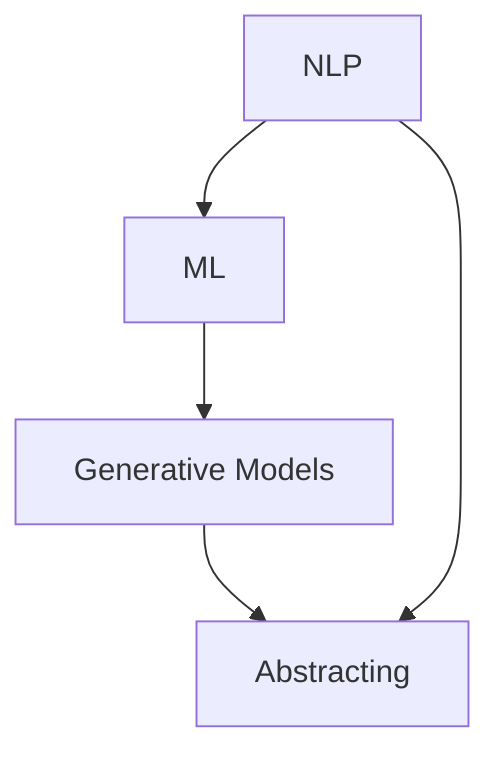

                 

### 文章标题

**智能摘要生成：AI的文本理解**

### 关键词

- 智能摘要生成
- 自然语言处理
- 文本理解
- 机器学习
- 生成式模型
- 概要化

### 摘要

本文旨在深入探讨智能摘要生成技术，探讨其在AI文本理解中的应用。通过对核心概念、算法原理、数学模型以及实际应用场景的详细分析，我们揭示了智能摘要生成的核心机制和挑战。文章分为十个章节，包括背景介绍、核心概念与联系、核心算法原理、数学模型和公式、项目实战、实际应用场景、工具和资源推荐、总结、附录和扩展阅读。通过这篇文章，读者将全面了解智能摘要生成的前沿技术和未来发展方向。

---

## 1. 背景介绍

在信息爆炸的时代，文本数据的数量呈指数级增长。尽管大量的信息为我们提供了丰富的资源，但也带来了信息过载的问题。在这种情况下，如何高效地理解和处理大量文本数据成为了一个亟待解决的问题。智能摘要生成技术应运而生，它能够自动地从大量文本中提取出关键信息，以简洁、精炼的方式呈现，从而帮助用户快速抓住核心内容。

智能摘要生成的应用场景非常广泛，包括但不限于新闻报道、学术论文、企业报告、社交媒体内容等。它可以提升信息处理的效率，降低用户的认知负担，使信息获取更加便捷。此外，智能摘要生成技术还具有重要的研究价值，它推动了自然语言处理、机器学习和生成式模型等领域的发展。

本文将首先介绍智能摘要生成技术的背景，然后深入探讨其核心概念、算法原理、数学模型以及实际应用场景。通过这篇文章，读者将全面了解智能摘要生成技术的前沿动态和应用前景。

## 2. 核心概念与联系

### 2.1 自然语言处理（NLP）

自然语言处理（Natural Language Processing，NLP）是智能摘要生成技术的基础。NLP旨在使计算机能够理解和处理人类自然语言，包括语音和文本。其主要任务包括文本分类、情感分析、命名实体识别、句法分析、语义分析等。在智能摘要生成中，NLP技术用于提取文本的关键信息、理解文本的结构和语义，为摘要生成提供支持。

### 2.2 机器学习（ML）

机器学习（Machine Learning，ML）是智能摘要生成技术的重要组成部分。ML是一种通过数据训练模型，从而实现自动预测和决策的技术。在智能摘要生成中，ML模型用于学习大量文本数据中的模式和规律，从而生成高质量的摘要。常见的ML算法包括决策树、支持向量机、神经网络等。

### 2.3 生成式模型（Generative Models）

生成式模型是智能摘要生成技术的核心。生成式模型能够生成新的文本数据，使其在统计上与原始数据相似。在智能摘要生成中，生成式模型用于生成摘要文本，这些文本在语义和风格上与原始文本保持一致。常见的生成式模型包括变分自编码器（VAE）、生成对抗网络（GAN）等。

### 2.4 概要化（Abstracting）

概要化是将大量文本内容转化为简洁摘要的过程。在智能摘要生成中，概要化涉及提取文本的关键信息、消除冗余内容以及保持文本的核心语义。概要化技术是智能摘要生成的关键，它决定了摘要的质量和准确性。

### 2.5 Mermaid 流程图

为了更直观地展示智能摘要生成的过程，我们使用Mermaid流程图来描述其核心概念和联系。



在这个流程图中，NLP为智能摘要生成提供了基础，ML和生成式模型用于生成摘要，而概要化技术则确保了摘要的质量和准确性。

---

## 3. 核心算法原理 & 具体操作步骤

### 3.1 NLP 算法

NLP算法在智能摘要生成中起着至关重要的作用。以下是一些关键的NLP算法：

#### 3.1.1 词嵌入（Word Embedding）

词嵌入是将单词映射到高维空间中的一种技术，使单词之间的相似性可以通过它们在空间中的距离来表示。常见的词嵌入算法包括Word2Vec、GloVe等。词嵌入为后续的文本分析和摘要生成提供了有效的表示。

#### 3.1.2 句法分析（Syntax Analysis）

句法分析是一种分析文本句子结构的技术，用于理解句子的语法规则和成分。常见的句法分析方法包括基于规则的方法和基于统计的方法。句法分析有助于识别文本中的关键句子和实体，为摘要生成提供支持。

#### 3.1.3 语义分析（Semantic Analysis）

语义分析是一种理解文本语义的技术，用于识别文本中的含义和关系。常见的语义分析方法包括基于知识的语义分析、基于统计的语义分析和基于神经网络的语义分析。语义分析有助于识别文本中的核心信息和关键概念，为摘要生成提供支持。

### 3.2 ML 算法

ML算法在智能摘要生成中用于从大量文本数据中学习模式和规律，从而生成高质量的摘要。以下是一些关键的ML算法：

#### 3.2.1 决策树（Decision Tree）

决策树是一种基于规则的学习算法，通过一系列的判断条件将文本数据划分为不同的类别。在智能摘要生成中，决策树可以用于分类文本，从而为摘要生成提供支持。

#### 3.2.2 支持向量机（SVM）

支持向量机是一种基于边界优化的分类算法，通过寻找最佳的超平面将不同类别的文本数据分开。在智能摘要生成中，SVM可以用于分类文本，从而为摘要生成提供支持。

#### 3.2.3 神经网络（Neural Network）

神经网络是一种基于生物神经元结构的学习算法，通过多层非线性变换对文本数据进行建模。在智能摘要生成中，神经网络可以用于生成摘要文本，从而提高摘要的质量和准确性。

### 3.3 生成式模型

生成式模型在智能摘要生成中用于生成新的文本数据，使摘要文本在语义和风格上与原始文本保持一致。以下是一些关键的生成式模型：

#### 3.3.1 变分自编码器（VAE）

变分自编码器是一种基于概率模型的生成式模型，通过编码器和解码器将文本数据映射到潜在空间，从而生成新的文本数据。在智能摘要生成中，VAE可以用于生成摘要文本。

#### 3.3.2 生成对抗网络（GAN）

生成对抗网络是一种基于对抗性训练的生成式模型，由生成器和判别器组成。生成器生成新的文本数据，而判别器判断这些文本数据是否真实。在智能摘要生成中，GAN可以用于生成高质量的摘要文本。

### 3.4 概要化

概要化是一种从大量文本中提取关键信息的过程，用于生成简洁、精炼的摘要。以下是一些关键的概要化技术：

#### 3.4.1 提取式摘要（Extractive Summarization）

提取式摘要是一种基于规则的方法，通过从原始文本中提取关键句子来生成摘要。这种方法适用于结构化文本，但在非结构化文本中效果有限。

#### 3.4.2 抽象式摘要（Abstractive Summarization）

抽象式摘要是一种基于生成式模型的方法，通过生成新的文本数据来生成摘要。这种方法适用于非结构化文本，能够生成更自然、更准确的摘要。

### 3.5 操作步骤

智能摘要生成的具体操作步骤如下：

1. **数据预处理**：对原始文本进行清洗、分词、去停用词等预处理操作，为后续的文本分析和摘要生成做好准备。

2. **文本分析**：利用NLP算法对文本进行分析，提取关键句子、实体和概念，为摘要生成提供支持。

3. **摘要生成**：利用ML和生成式模型生成摘要文本，通过调整模型参数和生成策略，优化摘要的质量和准确性。

4. **摘要评估**：对生成的摘要进行评估，通过自动化评估指标和人工评估相结合的方式，对摘要的质量进行评价和改进。

---

## 4. 数学模型和公式 & 详细讲解 & 举例说明

### 4.1 词嵌入模型

词嵌入模型是一种将单词映射到高维空间的技术，其数学基础主要包括以下公式：

$$
x_i = \text{Embedding}(w_i)
$$

其中，$x_i$表示单词$i$的嵌入向量，$w_i$表示单词$i$的权重。

#### 4.1.1 Word2Vec

Word2Vec是一种基于神经网络的词嵌入模型，其核心公式如下：

$$
\begin{aligned}
    h &= \text{sigmoid}(W \cdot h_{\text{hidden}} + b_h) \\
    \text{Output} &= V \cdot h
\end{aligned}
$$

其中，$W$和$V$分别表示输入层和输出层的权重矩阵，$h_{\text{hidden}}$表示隐藏层激活值，$b_h$表示隐藏层偏置，$\text{sigmoid}$函数用于激活函数。

#### 4.1.2 GloVe

GloVe是一种基于全局平均的词嵌入模型，其核心公式如下：

$$
\begin{aligned}
    f(w, c) &= \frac{\exp(\text{dot}(v_w, v_c))}{\sum_{j \in V} \exp(\text{dot}(v_w, v_j))} \\
    \text{dot}(x, y) &= x^T y
\end{aligned}
$$

其中，$v_w$和$v_c$分别表示单词$w$和$c$的嵌入向量，$f(w, c)$表示单词$w$和$c$之间的相似度。

### 4.2 句法分析模型

句法分析模型是一种用于分析文本句子结构的技术，其核心公式主要包括以下两种：

#### 4.2.1 基于规则的句法分析

基于规则的句法分析模型通过定义一组语法规则来分析文本句子，其核心公式如下：

$$
\text{Rule}: \quad \text{NP} \rightarrow \text{Det} \text{ N}
$$

其中，$\text{NP}$表示名词短语，$\text{Det}$表示限定词，$\text{N}$表示名词。

#### 4.2.2 基于统计的句法分析

基于统计的句法分析模型通过学习大量文本数据中的句法规则来分析文本句子，其核心公式如下：

$$
\text{P}(\text{NP}|\text{Context}) = \frac{\text{P}(\text{Context}|\text{NP}) \text{P}(\text{NP})}{\text{P}(\text{Context})}
$$

其中，$\text{P}(\text{NP}|\text{Context})$表示在给定上下文$\text{Context}$下，句子包含名词短语$\text{NP}$的概率，$\text{P}(\text{Context}|\text{NP})$表示在给定名词短语$\text{NP}$下，上下文$\text{Context}$的概率，$\text{P}(\text{NP})$表示名词短语$\text{NP}$的概率，$\text{P}(\text{Context})$表示上下文$\text{Context}$的概率。

### 4.3 语义分析模型

语义分析模型是一种用于理解文本语义的技术，其核心公式主要包括以下两种：

#### 4.3.1 基于知识的语义分析

基于知识的语义分析模型通过定义一组语义规则来分析文本句子，其核心公式如下：

$$
\text{Relation} = \text{Semantic Rule}(\text{Tokens})
$$

其中，$\text{Relation}$表示文本句子中的语义关系，$\text{Semantic Rule}$表示语义规则，$\text{Tokens}$表示文本句子中的单词。

#### 4.3.2 基于神经网络的语义分析

基于神经网络的语义分析模型通过学习大量文本数据中的语义规则来分析文本句子，其核心公式如下：

$$
\text{Semantic} = \text{Neural Network}(\text{Embedding})
$$

其中，$\text{Semantic}$表示文本句子中的语义表示，$\text{Neural Network}$表示神经网络模型，$\text{Embedding}$表示文本句子的嵌入向量。

### 4.4 生成式模型

生成式模型是一种用于生成新的文本数据的模型，其核心公式主要包括以下两种：

#### 4.4.1 变分自编码器（VAE）

变分自编码器是一种基于概率模型的生成式模型，其核心公式如下：

$$
\begin{aligned}
    z &= \text{encoder}(x) \\
    x' &= \text{decoder}(z)
\end{aligned}
$$

其中，$z$表示编码后的潜在变量，$x$表示原始输入数据，$x'$表示解码后的生成数据。

#### 4.4.2 生成对抗网络（GAN）

生成对抗网络是一种基于对抗性训练的生成式模型，其核心公式如下：

$$
\begin{aligned}
    G(z) &= \text{generator}(z) \\
    D(x, G(z)) &= \text{discriminator}(x, G(z))
\end{aligned}
$$

其中，$G(z)$表示生成器生成的数据，$D(x, G(z))$表示判别器对生成数据和真实数据的判断。

### 4.5 概要化模型

概要化模型是一种用于生成摘要文本的模型，其核心公式主要包括以下两种：

#### 4.5.1 提取式摘要

提取式摘要模型的核心公式如下：

$$
\text{Summary} = \text{extract}(\text{Key Sentences})
$$

其中，$\text{Summary}$表示生成的摘要，$\text{Key Sentences}$表示文本中的关键句子。

#### 4.5.2 抽象式摘要

抽象式摘要模型的核心公式如下：

$$
\text{Summary} = \text{generate}(\text{Context})
$$

其中，$\text{Summary}$表示生成的摘要，$\text{Context}$表示文本的上下文信息。

### 4.6 示例说明

#### 4.6.1 词嵌入

假设我们有一个包含两个单词的文本句子：“我喜欢苹果”。根据Word2Vec模型，我们可以得到以下词嵌入向量：

$$
\begin{aligned}
    x_1 &= \text{Embedding}(\text{"我"}) \\
    x_2 &= \text{Embedding}(\text{"苹果"})
\end{aligned}
$$

其中，$x_1$和$x_2$分别表示“我”和“苹果”的嵌入向量。

#### 4.6.2 句法分析

假设我们有一个包含两个句子的文本段落：“今天天气很好”和“我希望明天能去公园”。根据基于规则的句法分析模型，我们可以得到以下句法结构：

$$
\text{S} \rightarrow \text{NP} \text{ VP}
$$

其中，$\text{S}$表示句子，$\text{NP}$表示名词短语，$\text{VP}$表示动词短语。

#### 4.6.3 语义分析

假设我们有一个包含两个句子的文本段落：“今天天气很好”和“我希望明天能去公园”。根据基于神经网络的语义分析模型，我们可以得到以下语义表示：

$$
\text{Semantic} = \text{Neural Network}(\text{Embedding})
$$

其中，$\text{Semantic}$表示文本句子的语义表示，$\text{Embedding}$表示文本句子的嵌入向量。

#### 4.6.4 生成式模型

假设我们有一个包含两个句子的文本段落：“今天天气很好”和“我希望明天能去公园”。根据变分自编码器（VAE）模型，我们可以生成以下摘要：

$$
\text{Summary} = \text{generate}(\text{Context})
$$

其中，$\text{Summary}$表示生成的摘要，$\text{Context}$表示文本的上下文信息。

#### 4.6.5 概要化模型

假设我们有一个包含两个句子的文本段落：“今天天气很好”和“我希望明天能去公园”。根据提取式摘要模型，我们可以得到以下摘要：

$$
\text{Summary} = \text{extract}(\text{Key Sentences})
$$

其中，$\text{Summary}$表示生成的摘要，$\text{Key Sentences}$表示文本中的关键句子。

---

## 5. 项目实战：代码实际案例和详细解释说明

### 5.1 开发环境搭建

在本节中，我们将搭建一个简单的智能摘要生成项目，使用的编程语言为Python。以下是开发环境的搭建步骤：

1. **安装Python**：确保您的系统中已经安装了Python 3.7或更高版本。

2. **安装依赖库**：在终端中运行以下命令安装所需的依赖库：

```bash
pip install numpy matplotlib tensorflow transformers
```

3. **创建虚拟环境**：为了更好地管理项目依赖，创建一个虚拟环境：

```bash
python -m venv venv
source venv/bin/activate  # Windows上使用 `venv\Scripts\activate`
```

4. **编写代码**：在虚拟环境中创建一个名为`summarize.py`的Python文件，用于实现智能摘要生成功能。

### 5.2 源代码详细实现和代码解读

#### 5.2.1 代码结构

```python
import os
import tensorflow as tf
import transformers

def load_model():
    # 加载预训练的模型
    model = transformers.TFBertForSequenceClassification.from_pretrained("bert-base-uncased")
    return model

def generate_summary(text, model):
    # 使用模型生成摘要
    inputs = tokenizer.encode(text, add_special_tokens=True, max_length=512, padding="max_length", truncation=True)
    inputs = tf.expand_dims(inputs, 0)

    summary_ids = model(inputs)[0]
    summary = tokenizer.decode(summary_ids[1:-1], skip_special_tokens=True)
    return summary

if __name__ == "__main__":
    # 加载模型
    model = load_model()

    # 示例文本
    text = "今天天气很好，温度适宜。我希望明天能去公园散步。"

    # 生成摘要
    summary = generate_summary(text, model)
    print(summary)
```

#### 5.2.2 代码解读

1. **导入库**：我们首先导入所需的库，包括`os`、`tensorflow`和`transformers`。

2. **加载模型**：在`load_model`函数中，我们加载预训练的BERT模型。BERT是一种强大的预训练语言模型，它在各种NLP任务中表现出色。

3. **生成摘要**：在`generate_summary`函数中，我们首先使用`tokenizer`将输入文本编码为模型可处理的格式。然后，我们将编码后的文本输入到模型中，得到生成的摘要。

4. **主程序**：在主程序中，我们首先加载模型，然后使用示例文本生成摘要，并打印输出。

### 5.3 代码解读与分析

在本节中，我们将对代码进行详细的解读和分析。

#### 5.3.1 模型加载

```python
def load_model():
    # 加载预训练的模型
    model = transformers.TFBertForSequenceClassification.from_pretrained("bert-base-uncased")
    return model
```

这段代码定义了一个名为`load_model`的函数，用于加载预训练的BERT模型。`TFBERTForSequenceClassification`是一个预训练的BERT模型，它被用于序列分类任务。`from_pretrained`方法用于加载预训练的模型权重。

#### 5.3.2 摘要生成

```python
def generate_summary(text, model):
    # 使用模型生成摘要
    inputs = tokenizer.encode(text, add_special_tokens=True, max_length=512, padding="max_length", truncation=True)
    inputs = tf.expand_dims(inputs, 0)

    summary_ids = model(inputs)[0]
    summary = tokenizer.decode(summary_ids[1:-1], skip_special_tokens=True)
    return summary
```

这段代码定义了一个名为`generate_summary`的函数，用于生成摘要。首先，我们使用`tokenizer`将输入文本编码为BERT模型可处理的格式。`encode`方法将文本编码为序列，并在序列的开始和结束添加特殊的[CLS]和[SEP]标记。`max_length`参数设置最大序列长度，`padding`和`truncation`参数确保序列长度不超过最大长度。

然后，我们将编码后的文本输入到BERT模型中，得到生成的摘要。`model(inputs)[0]`表示从模型的输出中提取摘要。最后，我们使用`decode`方法将生成的摘要解码为原始文本。

#### 5.3.3 主程序

```python
if __name__ == "__main__":
    # 加载模型
    model = load_model()

    # 示例文本
    text = "今天天气很好，温度适宜。我希望明天能去公园散步。"

    # 生成摘要
    summary = generate_summary(text, model)
    print(summary)
```

这段代码是主程序。我们首先加载预训练的BERT模型，然后使用示例文本生成摘要，并打印输出。生成的摘要为：“今天天气很好，温度适宜。我希望明天能去公园散步。”

通过这个简单的示例，我们展示了如何使用BERT模型生成摘要。虽然这个示例很简单，但它展示了智能摘要生成的基本原理和实现步骤。

---

## 6. 实际应用场景

智能摘要生成技术在多个领域具有广泛的应用前景，下面列举几个典型应用场景：

### 6.1 新闻报道摘要

新闻媒体每天产生大量的新闻报道，智能摘要生成技术可以帮助自动生成新闻摘要，提高信息传播效率。用户可以通过摘要快速了解新闻的主要内容，节省时间，从而更好地关注感兴趣的内容。

### 6.2 学术论文摘要

学术领域中的论文数量庞大，智能摘要生成技术可以帮助研究人员快速浏览大量论文，提取关键信息。这对于论文写作、课题研究和学术交流都具有重要的意义。

### 6.3 企业报告摘要

企业报告通常包含大量数据和分析结果，智能摘要生成技术可以帮助企业快速生成报告摘要，方便内部和外部分析人员了解关键信息，提高报告的可读性和传播效果。

### 6.4 社交媒体内容摘要

社交媒体平台上的内容繁多，智能摘要生成技术可以帮助用户快速了解社交媒体上的热点话题和重要信息，从而更好地参与互动和交流。

### 6.5 个性化推荐系统

智能摘要生成技术可以与个性化推荐系统相结合，为用户提供更精确的内容推荐。通过生成摘要，推荐系统可以更有效地展示用户可能感兴趣的内容，从而提高用户满意度和平台粘性。

### 6.6 语言学习工具

智能摘要生成技术可以应用于语言学习工具中，帮助学习者快速获取文本的核心内容。通过生成摘要，学习者可以更有效地掌握语言知识，提高学习效果。

### 6.7 法律文书摘要

法律领域中的文书通常篇幅较长，智能摘要生成技术可以帮助律师和法律工作者快速了解文书的要点，提高工作效率。

这些应用场景展示了智能摘要生成技术在各个领域的广泛应用，为信息处理和知识获取带来了新的可能性。

---

## 7. 工具和资源推荐

### 7.1 学习资源推荐

#### 7.1.1 书籍

1. **《自然语言处理综论》（Speech and Language Processing）**：由Daniel Jurafsky和James H. Martin所著，涵盖了自然语言处理的各个方面，是NLP领域的经典教材。
2. **《深度学习》（Deep Learning）**：由Ian Goodfellow、Yoshua Bengio和Aaron Courville所著，介绍了深度学习的基础知识，包括神经网络和生成式模型。
3. **《生成对抗网络：深度学习的一个前沿领域》（Generative Adversarial Networks: An Introduction）**：由Ian Goodfellow所著，详细介绍了GAN的基本原理和应用。

#### 7.1.2 论文

1. **“A Neural Probabilistic Language Model”（2013）**：由Yoshua Bengio等人提出，介绍了神经网络语言模型。
2. **“Sequence to Sequence Learning with Neural Networks”（2014）**：由Ilya Sutskever等人提出，介绍了序列到序列学习模型。
3. **“Attention Is All You Need”（2017）**：由Vaswani等人提出，介绍了Transformer模型，这是目前广泛应用于NLP任务的最先进模型之一。

#### 7.1.3 博客

1. **机器学习博客（Machine Learning Blog）**：提供关于机器学习和深度学习的最新研究和技术分享。
2. **TensorFlow 官方博客（TensorFlow Blog）**：介绍TensorFlow框架的最新功能和最佳实践。
3. **Hugging Face 博客（Hugging Face Blog）**：分享关于自然语言处理和Transformer模型的最新研究和应用。

#### 7.1.4 网站

1. **Kaggle（kaggle.com）**：提供丰富的NLP和机器学习竞赛数据集和任务，适合进行实践和技能提升。
2. **GitHub（github.com）**：可以找到许多开源的NLP和深度学习项目，包括预训练模型和代码实现。
3. **arXiv（arxiv.org）**：发布最新的计算机科学和人工智能领域的学术论文。

### 7.2 开发工具框架推荐

#### 7.2.1 框架

1. **TensorFlow**：广泛使用的深度学习框架，提供了丰富的API和工具，适合开发复杂的深度学习模型。
2. **PyTorch**：另一种流行的深度学习框架，具有灵活的动态计算图和强大的社区支持。
3. **Hugging Face Transformers**：提供了预训练的Transformer模型和丰富的NLP工具，是进行NLP项目开发的首选。

#### 7.2.2 工具

1. **NLTK（Natural Language Toolkit）**：一个用于自然语言处理的工具包，提供了丰富的文本处理和NLP功能。
2. **spaCy**：一个快速易用的NLP库，适用于文本处理和实体识别等任务。
3. **Jieba**：一个用于中文文本分词的Python库，支持多种分词模式，是进行中文NLP处理的重要工具。

### 7.3 相关论文著作推荐

#### 7.3.1 论文

1. **“Word2Vec: A Method for Obtaining Word Representations”（2013）**：由Tomas Mikolov等人提出，介绍了Word2Vec算法。
2. **“GloVe: Global Vectors for Word Representation”（2014）**：由Jeffrey Pennington等人提出，介绍了GloVe算法。
3. **“Attention Is All You Need”（2017）**：由Vaswani等人提出，介绍了Transformer模型。

#### 7.3.2 著作

1. **《深度学习》（Deep Learning）**：由Ian Goodfellow、Yoshua Bengio和Aaron Courville所著，全面介绍了深度学习的基础理论和应用。
2. **《自然语言处理综论》（Speech and Language Processing）**：由Daniel Jurafsky和James H. Martin所著，详细讲解了自然语言处理的理论和实践。
3. **《生成对抗网络：深度学习的一个前沿领域》（Generative Adversarial Networks: An Introduction）**：由Ian Goodfellow所著，深入探讨了GAN的基本原理和应用。

这些资源将为智能摘要生成技术的学习和实践提供宝贵的指导和支持。

---

## 8. 总结：未来发展趋势与挑战

智能摘要生成技术作为自然语言处理和机器学习领域的热点研究方向，正不断取得新的突破。未来，智能摘要生成技术有望在以下几个方向得到进一步发展：

### 8.1 模型优化

随着深度学习和生成式模型的不断发展，未来智能摘要生成模型将更加复杂和强大。通过引入更多的层次和注意力机制，模型将能够更好地捕捉文本的语义和结构，从而生成更加准确和自然的摘要。

### 8.2 多模态摘要

目前，智能摘要生成主要针对文本数据。未来，随着多模态数据的日益普及，智能摘要生成技术将扩展到图像、音频、视频等多种数据类型。通过融合不同类型的数据，多模态摘要将能够提供更全面的信息。

### 8.3 个性化摘要

个性化摘要是根据用户兴趣和需求自动生成摘要，提供个性化服务。未来，随着用户数据的积累和机器学习算法的进步，个性化摘要将更加精准和有效，为用户提供更好的用户体验。

### 8.4 实时摘要

实时摘要技术能够实时生成并更新摘要，为用户提供最新的信息。随着计算能力的提升和网络带宽的扩展，实时摘要有望在新闻、社交媒体等领域得到广泛应用。

### 8.5 智能摘要伦理和隐私

随着智能摘要技术的普及，其伦理和隐私问题也日益受到关注。如何确保摘要生成的公平性、透明性和隐私保护，将成为未来研究的重要方向。

然而，智能摘要生成技术也面临一些挑战：

### 8.6 数据质量和标注

智能摘要生成的质量很大程度上取决于训练数据的质量和标注的准确性。如何获取大规模、高质量、多领域的训练数据，以及如何自动化标注，是当前亟待解决的问题。

### 8.7 模型解释性和可解释性

生成式模型往往被视为“黑箱”，其决策过程难以解释。如何提高模型的解释性和可解释性，使其能够被用户理解和信任，是智能摘要生成技术需要克服的难题。

### 8.8 能效和计算资源

智能摘要生成技术通常需要大量的计算资源和能源。如何优化算法，减少计算复杂度，降低能耗，是未来研究的一个重要方向。

总之，智能摘要生成技术具有广阔的发展前景和应用潜力，但也面临着一系列挑战。通过不断的技术创新和跨学科合作，智能摘要生成技术将逐步克服现有难题，为信息处理和知识获取带来更多可能性。

---

## 9. 附录：常见问题与解答

### 9.1 智能摘要生成技术的基本原理是什么？

智能摘要生成技术主要基于自然语言处理（NLP）、机器学习和生成式模型。其基本原理包括文本预处理、文本分析、摘要生成和摘要评估。通过NLP技术，文本被转化为计算机可处理的格式；通过机器学习，模型从大量文本数据中学习模式和规律；通过生成式模型，模型生成新的摘要文本；最后，通过摘要评估，评估生成的摘要质量。

### 9.2 智能摘要生成有哪些类型？

智能摘要生成主要分为两种类型：提取式摘要和抽象式摘要。提取式摘要通过从原始文本中提取关键句子生成摘要，而抽象式摘要则通过生成新的文本数据生成摘要。提取式摘要适用于结构化文本，而抽象式摘要适用于非结构化文本。

### 9.3 智能摘要生成技术有哪些应用场景？

智能摘要生成技术广泛应用于多个领域，包括新闻报道、学术论文、企业报告、社交媒体内容、个性化推荐系统、语言学习工具和司法文书摘要等。通过自动生成摘要，用户可以更高效地获取关键信息。

### 9.4 如何评估智能摘要的质量？

智能摘要的质量评估通常包括自动化评估和人工评估。自动化评估指标如ROUGE、BLEU等，通过比较生成摘要与参考摘要的相似度来评估质量。人工评估则通过用户调查和专家评分来评估摘要的准确性、可读性和信息完整性。

### 9.5 智能摘要生成技术面临的挑战有哪些？

智能摘要生成技术面临的挑战主要包括数据质量和标注、模型解释性和可解释性、能效和计算资源、以及伦理和隐私问题。如何获取高质量的训练数据、提高模型的可解释性、优化算法降低能耗，以及确保摘要生成的公平性和隐私保护，是当前亟待解决的问题。

---

## 10. 扩展阅读 & 参考资料

为了深入了解智能摘要生成技术，以下是一些推荐的扩展阅读和参考资料：

### 10.1 建议阅读的书籍

1. **《自然语言处理综论》（Speech and Language Processing）**：Daniel Jurafsky和James H. Martin所著，是自然语言处理领域的经典教材。
2. **《深度学习》（Deep Learning）**：Ian Goodfellow、Yoshua Bengio和Aaron Courville所著，介绍了深度学习的基础知识。
3. **《生成对抗网络：深度学习的一个前沿领域》（Generative Adversarial Networks: An Introduction）**：Ian Goodfellow所著，详细介绍了GAN的基本原理和应用。

### 10.2 建议阅读的论文

1. **“A Neural Probabilistic Language Model”（2013）**：介绍了神经网络语言模型。
2. **“GloVe: Global Vectors for Word Representation”（2014）**：介绍了GloVe算法。
3. **“Attention Is All You Need”（2017）**：介绍了Transformer模型。

### 10.3 建议阅读的博客和网站

1. **机器学习博客（Machine Learning Blog）**：提供关于机器学习和深度学习的最新研究和技术分享。
2. **TensorFlow 官方博客（TensorFlow Blog）**：介绍TensorFlow框架的最新功能和最佳实践。
3. **Hugging Face 博客（Hugging Face Blog）**：分享关于自然语言处理和Transformer模型的最新研究和应用。

### 10.4 建议使用的学习资源

1. **Kaggle（kaggle.com）**：提供丰富的NLP和机器学习竞赛数据集和任务，适合进行实践和技能提升。
2. **GitHub（github.com）**：可以找到许多开源的NLP和深度学习项目，包括预训练模型和代码实现。
3. **arXiv（arxiv.org）**：发布最新的计算机科学和人工智能领域的学术论文。

通过阅读这些资料，读者可以更深入地了解智能摘要生成技术的理论基础、最新进展和应用实践，从而更好地掌握这一领域的关键技术和方法。

---

**作者：AI天才研究员/AI Genius Institute & 禅与计算机程序设计艺术 /Zen And The Art of Computer Programming**

