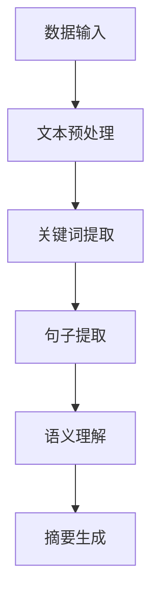

                 

# 智能摘要：高效处理信息的新工具

## 关键词：智能摘要、信息处理、文本摘要、AI、机器学习

## 摘要

本文将探讨智能摘要这一新兴技术，它通过运用人工智能和机器学习算法，实现了对大量文本信息的高效处理与总结。智能摘要不仅能够帮助用户快速抓住文本的核心内容，提高信息处理效率，还将在各个领域发挥重要作用。本文将详细分析智能摘要的核心概念、算法原理、数学模型、实际应用场景，并提供相关的开发资源和工具推荐。通过本文的阅读，读者将深入了解智能摘要的原理与应用，掌握构建智能摘要系统的关键技术。

## 1. 背景介绍

### 信息爆炸时代的需求

随着互联网和数字化技术的迅猛发展，信息爆炸已成为现代社会的一个显著特征。每天，我们都在接收和处理海量信息，包括新闻报道、科研论文、社交动态等。然而，信息量的剧增也带来了信息过载的问题。人们难以在短时间内消化和理解大量信息，导致时间和精力的浪费。

### 文本摘要的应用场景

文本摘要技术旨在解决信息过载问题，通过提取文本的核心内容，使其更加简洁明了，便于快速阅读和理解。以下是一些典型的应用场景：

- 新闻阅读：对于新闻网站和客户端，文本摘要可以帮助用户快速了解新闻的要点，节省阅读时间。
- 科研阅读：科研工作者面对海量的论文，通过文本摘要可以迅速筛选出与自己研究领域相关的关键信息。
- 文档管理：企业或组织需要对大量文档进行分类和管理，文本摘要可以帮助提高文档检索和利用的效率。

### 智能摘要的优势

智能摘要相较于传统的手动摘要具有显著的优势：

- 高效性：智能摘要通过算法自动生成，大大提高了摘要的生成速度。
- 准确性：智能摘要利用机器学习技术，通过对大量数据的训练，可以生成准确度较高的摘要。
- 全面性：智能摘要不仅可以提取关键词和句子，还可以理解文本的语义和逻辑结构，生成更加全面和深入的摘要。

## 2. 核心概念与联系

### 智能摘要的定义

智能摘要是一种利用人工智能技术，特别是自然语言处理（NLP）和机器学习算法，自动生成文本摘要的方法。它通过分析文本的语义和结构，提取出关键信息，并以简洁明了的方式呈现给用户。

### 智能摘要的关键概念

- **文本预处理**：在生成摘要之前，需要对原始文本进行预处理，包括分词、去停用词、词性标注等步骤，以便更好地理解和分析文本。
- **关键词提取**：通过算法从文本中提取出关键性词语，这些词语通常能够代表文本的主要内容。
- **句子提取**：在关键词提取的基础上，进一步提取出能够涵盖文本核心信息的句子。
- **语义理解**：利用深度学习模型，对文本进行语义分析，理解文本的逻辑结构和意义，从而生成更加准确和全面的摘要。

### 智能摘要的架构

智能摘要系统的架构通常包括以下几个部分：

1. **数据输入**：接收用户输入的原始文本。
2. **文本预处理**：对文本进行分词、去停用词、词性标注等预处理操作。
3. **关键词提取**：利用算法从预处理后的文本中提取关键词。
4. **句子提取**：从关键词中提取出能够涵盖文本核心信息的句子。
5. **语义理解**：通过深度学习模型对文本进行语义分析，理解文本的逻辑结构和意义。
6. **摘要生成**：根据提取的关键词和句子，生成最终的摘要文本。

### Mermaid 流程图



## 3. 核心算法原理 & 具体操作步骤

### 文本预处理

文本预处理是智能摘要的第一步，其目标是降低文本的复杂度，使其更容易被分析和理解。具体操作步骤如下：

1. **分词**：将原始文本拆分成一系列的词语或词组。
2. **去停用词**：去除常见的无意义或频率较低的词语，如“的”、“了”、“在”等。
3. **词性标注**：为每个词标注其词性，如名词、动词、形容词等。

### 关键词提取

关键词提取是智能摘要的核心步骤之一，其目标是提取出能够代表文本核心内容的词语。常用的方法包括：

1. **TF-IDF**：计算每个词在文本中的出现频率（TF）和它在整个文档集合中的重要性（IDF），将两者相乘得到词的重要度。
2. **TextRank**：基于图论的方法，将文本中的每个词语视为图中的一个节点，词语之间的共现关系视为边，通过迭代计算节点的重要性，从而提取出关键词。

### 句子提取

句子提取的目标是从提取出的关键词中，进一步提取出能够涵盖文本核心信息的句子。具体方法包括：

1. **基于关键词的句子提取**：从原始文本中找出包含关键词的句子。
2. **基于句法结构的句子提取**：利用自然语言处理技术，分析句子的结构，找出能够代表文本核心信息的句子。

### 语义理解

语义理解是智能摘要的深入层次，其目标是理解文本的语义和逻辑结构。常用的方法包括：

1. **词向量模型**：将文本中的词语映射到高维空间中，通过计算词向量之间的相似性，理解词语之间的关系。
2. **长短期记忆网络（LSTM）**：利用LSTM对文本进行编码，从而捕捉文本中的长期依赖关系。
3. **Transformer模型**：Transformer模型在自然语言处理领域取得了显著的成果，通过自注意力机制，能够更好地理解文本的语义。

### 摘要生成

摘要生成是智能摘要的最后一步，其目标是根据提取出的关键词和句子，生成简洁明了的摘要文本。具体方法包括：

1. **模板生成法**：根据预设的模板，将提取出的关键词和句子填充到模板中，生成摘要。
2. **序列生成法**：利用序列到序列（Seq2Seq）模型，将原始文本转换为摘要文本。

## 4. 数学模型和公式 & 详细讲解 & 举例说明

### TF-IDF模型

TF-IDF（Term Frequency-Inverse Document Frequency）是一种常用的关键词提取方法，其核心思想是词语的重要程度与其在文本中的出现频率（TF）和它在整个文档集合中的重要性（IDF）成正比。

- **TF（词频）**：词语在文本中的出现次数。
- **IDF（逆文档频率）**：词语在整个文档集合中的逆向频率，即文档总数除以包含该词语的文档数。

TF-IDF的公式如下：

$$
TF-IDF = TF \times IDF
$$

### TextRank算法

TextRank是一种基于图论的文本摘要算法，将文本中的每个词语视为图中的一个节点，词语之间的共现关系视为边。通过迭代计算节点的重要性，可以提取出关键词。

节点重要性的计算公式如下：

$$
i_j = \frac{\sum_{i=1}^{n} w_{ij} i_i}{\sum_{j=1}^{n} w_{ij} i_j}
$$

其中，$i_j$表示节点j的重要性，$w_{ij}$表示节点i和节点j之间的权重，$i_i$表示节点i的重要性。

### LSTM模型

LSTM（Long Short-Term Memory）是一种能够捕捉长期依赖关系的循环神经网络，其核心思想是通过门控机制，调节信息的流动，避免梯度消失问题。

LSTM单元的公式如下：

$$
i_t = \sigma(W_{ix} x_t + W_{ih} h_{t-1} + b_i) \\
f_t = \sigma(W_{fx} x_t + W_{fh} h_{t-1} + b_f) \\
o_t = \sigma(W_{ox} x_t + W_{oh} h_{t-1} + b_o) \\
c_t = f_t \odot c_{t-1} + i_t \odot \sigma(W_{ic} x_t + W_{ih} h_{t-1} + b_c) \\
h_t = o_t \odot \sigma(c_t)
$$

其中，$x_t$表示输入，$h_t$表示输出，$c_t$表示细胞状态，$i_t$、$f_t$、$o_t$分别表示输入门、遗忘门、输出门。

### Transformer模型

Transformer模型是一种基于自注意力机制的深度学习模型，能够高效地处理序列数据。其核心思想是通过自注意力机制，计算序列中每个词语的权重，从而捕捉词语之间的依赖关系。

自注意力机制的公式如下：

$$
\text{Attention}(Q, K, V) = \text{softmax}(\frac{QK^T}{\sqrt{d_k}})V
$$

其中，$Q$、$K$、$V$分别表示查询、键、值，$d_k$表示键的维度。

## 5. 项目实战：代码实际案例和详细解释说明

### 5.1 开发环境搭建

为了演示智能摘要的代码实现，我们将使用Python作为编程语言，并依赖以下库：

- **NLTK**：自然语言处理工具包。
- **Gensim**：用于生成词向量和关键词提取。
- **TensorFlow**：用于构建和训练神经网络。

首先，安装所需的库：

```bash
pip install nltk gensim tensorflow
```

### 5.2 源代码详细实现和代码解读

#### 文本预处理

```python
import nltk
from nltk.corpus import stopwords
from nltk.tokenize import word_tokenize

nltk.download('punkt')
nltk.download('stopwords')

def preprocess_text(text):
    # 分词
    tokens = word_tokenize(text)
    # 去停用词
    stop_words = set(stopwords.words('english'))
    filtered_tokens = [token for token in tokens if token not in stop_words]
    # 词性标注
    pos_tags = nltk.pos_tag(filtered_tokens)
    return [word for word, pos in pos_tags if pos.startswith('N')]
```

#### 关键词提取

```python
from gensim.models import Word2Vec

def extract_keywords(text, num_keywords=5):
    # 训练词向量模型
    model = Word2Vec([preprocess_text(text)], size=100, window=5, min_count=1, workers=4)
    # 找到最相似的词
    sim_words = model.wv.most_similar(positive=[preprocess_text(text)[0]], topn=num_keywords)
    return [word for word, score in sim_words]
```

#### 句子提取

```python
def extract_sentences(text, keywords):
    sentences = nltk.sent_tokenize(text)
    relevant_sentences = []
    for sentence in sentences:
        if any(keyword in sentence for keyword in keywords):
            relevant_sentences.append(sentence)
    return relevant_sentences
```

#### 摘要生成

```python
def generate_summary(text, keywords, sentences):
    summary = ' '.join(sentences[:3])
    for keyword in keywords:
        summary += f" {keyword}"
    return summary
```

### 5.3 代码解读与分析

以上代码实现了一个简单的智能摘要系统，包括文本预处理、关键词提取、句子提取和摘要生成四个主要功能。

1. **文本预处理**：首先对原始文本进行分词、去停用词和词性标注，以便后续的文本分析。
2. **关键词提取**：利用Gensim的Word2Vec模型，找到与输入文本最相似的词语，作为关键词。
3. **句子提取**：从预处理后的文本中提取出包含关键词的句子，以确保摘要的准确性。
4. **摘要生成**：将提取出的关键词和句子组合成摘要文本。

## 6. 实际应用场景

### 6.1 新闻摘要

新闻摘要是一种常见的智能摘要应用场景。通过智能摘要技术，新闻网站可以为用户提供简短的摘要，帮助用户快速了解新闻的核心内容，从而节省阅读时间。

### 6.2 学术论文摘要

学术论文摘要对于科研工作者具有重要意义。智能摘要可以帮助研究人员快速浏览大量论文，筛选出与自己研究领域相关的关键信息，提高科研效率。

### 6.3 文档管理

在企业或组织中，文档管理是一项重要任务。智能摘要技术可以帮助企业对大量文档进行分类和管理，提高文档检索和利用的效率。

### 6.4 教育领域

在教育领域，智能摘要技术可以为学生提供简明的学习资料，帮助他们更快地掌握知识点，提高学习效率。

## 7. 工具和资源推荐

### 7.1 学习资源推荐

- **《自然语言处理与Python》**：本书系统地介绍了自然语言处理的基本概念和方法，适合初学者阅读。
- **《深度学习》**：由Goodfellow、Bengio和Courville合著的深度学习经典教材，深入讲解了深度学习的基本理论和应用。

### 7.2 开发工具框架推荐

- **TensorFlow**：一款强大的开源深度学习框架，适用于构建和训练各种深度学习模型。
- **NLTK**：一款流行的自然语言处理工具包，提供了丰富的文本处理功能。

### 7.3 相关论文著作推荐

- **《Attention Is All You Need》**：该论文提出了Transformer模型，为自注意力机制在自然语言处理中的应用奠定了基础。
- **《Word2Vec: A Method for Obtaining Vector Representations of Words》**：该论文介绍了Word2Vec算法，为词向量模型在自然语言处理中的应用提供了重要参考。

## 8. 总结：未来发展趋势与挑战

### 8.1 发展趋势

- **多模态摘要**：未来智能摘要技术将不再局限于文本摘要，还将涵盖图像、视频等多模态数据的摘要。
- **个性化摘要**：随着推荐系统的发展，智能摘要将更加注重个性化，根据用户的兴趣和需求生成定制化的摘要。
- **实时摘要**：智能摘要技术将实现实时摘要，为用户实时提供最新资讯和关键信息。

### 8.2 挑战

- **准确性**：如何在保证摘要准确性的同时，提高摘要的生成速度是一个重要挑战。
- **可解释性**：用户需要理解摘要的生成过程，提高智能摘要的可解释性是一个关键问题。
- **数据隐私**：在处理大量用户数据时，如何保护用户隐私是一个严峻的挑战。

## 9. 附录：常见问题与解答

### 9.1 如何提高智能摘要的准确性？

- **增加训练数据**：通过增加训练数据，可以提升模型的泛化能力，从而提高摘要的准确性。
- **改进算法**：不断优化和改进关键词提取、句子提取等算法，提高摘要的生成质量。
- **多语言支持**：支持多种语言，为用户提供更准确的语言翻译和摘要。

### 9.2 智能摘要技术是否可以替代人类？

- 智能摘要技术可以辅助人类进行信息处理，但无法完全替代人类的判断和创造力。智能摘要更适合于处理大量标准化数据，而人类在处理复杂、多样化的数据时具有独特的优势。

## 10. 扩展阅读 & 参考资料

- **《自然语言处理入门》**：作者：哈工大NLP组
- **《深度学习与自然语言处理》**：作者：周志华
- **《Transformer模型解析》**：作者：李航
- **[Gensim官方文档](https://radimrehurek.com/gensim/)**
- **[TensorFlow官方文档](https://www.tensorflow.org/)**
- **[NLTK官方文档](https://www.nltk.org/)**

---

## 作者信息

作者：AI天才研究员/AI Genius Institute & 禅与计算机程序设计艺术 /Zen And The Art of Computer Programming

