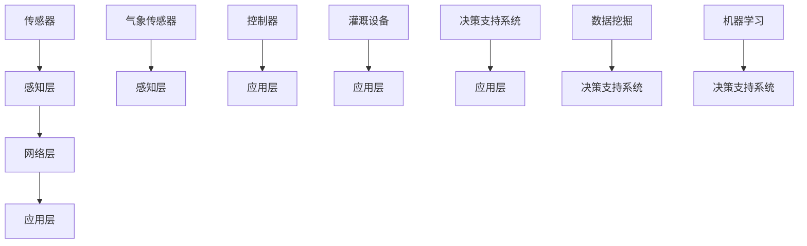

                 

# 智能灌溉系统：精准农业的创新应用

## 关键词：
智能灌溉、精准农业、物联网、传感器技术、机器学习、数据挖掘、农业大数据

## 摘要：
本文旨在探讨智能灌溉系统在精准农业中的创新应用。随着全球人口增长和气候变化，农业资源短缺和环境问题日益严峻，精准农业成为现代农业发展的重要方向。智能灌溉系统作为精准农业的核心技术之一，通过物联网、传感器技术和机器学习等先进技术，实现了对农田土壤湿度、气象条件等数据的实时监测和自动化灌溉，从而提高了水资源利用效率，降低了农业生产成本，为现代农业发展提供了有力支撑。

## 1. 背景介绍

### 1.1 精准农业的兴起

精准农业是一种基于信息技术、地理信息和遥感技术的现代化农业生产方式，通过实时监测农田环境和作物生长状态，提供个性化的农田管理方案，从而实现资源的最优配置和作物的最佳产量。精准农业的核心在于数据，通过获取、处理和分析农田土壤、气象、作物生长等数据，为农业生产提供科学依据。

精准农业的兴起源于全球农业资源短缺和环境问题的加剧。随着人口的增长，全球粮食需求不断增加，而农业资源的供给却日益紧张。同时，气候变化、土地退化、水资源短缺等问题也对农业生产带来了巨大挑战。为了提高农业产量，保护农业资源，精准农业应运而生。

### 1.2 智能灌溉系统的概念

智能灌溉系统是指利用物联网、传感器技术、数据挖掘和机器学习等先进技术，实现对农田土壤湿度、气象条件等数据的实时监测和自动化灌溉。智能灌溉系统的目标是提高水资源利用效率，降低农业生产成本，实现精准农业。

智能灌溉系统通常由传感器、控制器、灌溉设备等组成。传感器用于监测农田土壤湿度、气象条件等数据，控制器根据传感器数据自动控制灌溉设备的启停，灌溉设备用于实施灌溉作业。

### 1.3 智能灌溉系统的优势

1. 提高水资源利用效率：传统灌溉方式往往存在水资源浪费的问题，而智能灌溉系统可以根据农田实际需要自动调节灌溉量，从而提高水资源利用效率。

2. 降低农业生产成本：智能灌溉系统可以自动化控制灌溉，减少了人工干预，降低了农业生产成本。

3. 优化作物生长环境：智能灌溉系统可以根据农田土壤湿度、气象条件等数据，为作物提供最适宜的生长环境，从而提高作物产量和质量。

4. 精准农业的实现：智能灌溉系统是精准农业的核心技术之一，通过实时监测农田环境和作物生长状态，为农业生产提供科学依据，实现精准农业。

## 2. 核心概念与联系

### 2.1 物联网技术

物联网技术（Internet of Things，简称 IoT）是指将各种物体通过网络连接起来，实现信息交换和智能控制的技术。在智能灌溉系统中，物联网技术主要用于实现传感器数据实时传输和远程监控。


物联网架构主要包括感知层、网络层和应用层。感知层由传感器和执行器组成，用于采集农田土壤湿度、气象条件等数据。网络层由通信网络组成，用于传输传感器数据。应用层由数据处理和分析系统组成，用于对传感器数据进行处理和分析，为灌溉系统提供决策支持。

### 2.2 传感器技术

传感器技术（Sensor Technology）是指利用物理、化学、生物等原理，将各种物理量、化学量、生物量等转化为电信号的技术。在智能灌溉系统中，传感器主要用于监测农田土壤湿度、气象条件等数据。


常见的传感器类型包括土壤湿度传感器、气象传感器、流量传感器等。土壤湿度传感器用于监测农田土壤湿度，气象传感器用于监测气象条件，流量传感器用于监测灌溉用水量。

### 2.3 机器学习与数据挖掘

机器学习（Machine Learning）和数据挖掘（Data Mining）是智能灌溉系统的核心技术之一，主要用于对传感器数据进行处理和分析，为灌溉系统提供决策支持。


机器学习是一种通过数据训练模型，从而实现自动预测和决策的技术。在智能灌溉系统中，机器学习可以用于预测农田土壤湿度、气象条件等数据，为灌溉系统提供决策支持。

数据挖掘是一种从大量数据中提取有价值信息的技术。在智能灌溉系统中，数据挖掘可以用于分析农田土壤湿度、气象条件等数据，发现规律，为灌溉系统提供优化方案。

### 2.4 决策支持系统

决策支持系统（Decision Support System，简称 DSS）是一种利用计算机技术辅助决策的系统。在智能灌溉系统中，决策支持系统用于根据传感器数据和机器学习预测结果，自动生成灌溉方案。


决策支持系统通常包括数据采集模块、数据分析模块、决策生成模块等。数据采集模块用于采集传感器数据，数据分析模块用于对传感器数据进行处理和分析，决策生成模块用于根据分析结果生成灌溉方案。

### 2.5 Mermaid 流程图

下面是一个智能灌溉系统的 Mermaid 流程图，展示了各个核心概念之间的联系。



## 3. 核心算法原理 & 具体操作步骤

### 3.1 算法原理

智能灌溉系统的核心算法主要包括传感器数据采集、数据预处理、特征提取、机器学习模型训练和决策生成等。

1. 传感器数据采集：传感器用于监测农田土壤湿度、气象条件等数据，通过物联网技术将数据实时传输到数据中心。

2. 数据预处理：对采集到的传感器数据进行清洗、去噪、归一化等处理，提高数据质量。

3. 特征提取：从预处理后的数据中提取有代表性的特征，用于训练机器学习模型。

4. 机器学习模型训练：使用提取到的特征训练机器学习模型，例如决策树、支持向量机、神经网络等。

5. 决策生成：根据机器学习模型的预测结果，自动生成灌溉方案。

### 3.2 具体操作步骤

1. **传感器数据采集**：
    - 安装土壤湿度传感器、气象传感器等设备于农田中。
    - 设备通过物联网模块将数据实时传输到数据中心。

2. **数据预处理**：
    - 清洗传感器数据，去除异常值和噪声。
    - 对传感器数据进行归一化处理，使其在同一尺度内进行比较。

3. **特征提取**：
    - 提取土壤湿度、气象条件等数据中的关键特征。
    - 使用统计方法（如均值、方差、相关性等）和机器学习方法（如主成分分析、特征选择等）提取特征。

4. **机器学习模型训练**：
    - 使用已提取的特征训练机器学习模型，例如决策树、支持向量机、神经网络等。
    - 调整模型参数，优化模型性能。

5. **决策生成**：
    - 根据机器学习模型的预测结果，判断农田土壤湿度是否需要灌溉。
    - 生成灌溉方案，包括灌溉时间和灌溉量。

6. **灌溉执行**：
    - 控制器根据灌溉方案控制灌溉设备的启停。
    - 灌溉设备执行灌溉操作。

## 4. 数学模型和公式 & 详细讲解 & 举例说明

### 4.1 数学模型

智能灌溉系统中的数学模型主要涉及以下方面：

1. **土壤湿度模型**：
   - 状态方程：$h(t) = h_0 + \alpha \cdot \exp(-\beta \cdot t)$，其中 $h(t)$ 表示时间 $t$ 时刻的土壤湿度，$h_0$ 为初始土壤湿度，$\alpha$ 和 $\beta$ 为参数。

2. **气象条件模型**：
   - 温度模型：$T(t) = T_0 + \alpha \cdot \sin(\beta \cdot t)$，其中 $T(t)$ 表示时间 $t$ 时刻的气温，$T_0$ 为初始气温，$\alpha$ 和 $\beta$ 为参数。

3. **灌溉策略模型**：
   - 灌溉量模型：$I(t) = k \cdot h(t) \cdot (1 - \alpha \cdot T(t))$，其中 $I(t)$ 表示时间 $t$ 时刻的灌溉量，$k$ 为参数，$h(t)$ 和 $T(t)$ 分别为土壤湿度和气温。

### 4.2 详细讲解

1. **土壤湿度模型**：
   - $h(t) = h_0 + \alpha \cdot \exp(-\beta \cdot t)$ 是一个指数衰减函数，描述了土壤湿度随时间的变化趋势。其中 $h_0$ 为初始土壤湿度，$\alpha$ 和 $\beta$ 为参数，$\alpha$ 控制衰减速度，$\beta$ 控制衰减时间。

2. **气象条件模型**：
   - $T(t) = T_0 + \alpha \cdot \sin(\beta \cdot t)$ 是一个正弦函数，描述了气温随时间的变化趋势。其中 $T_0$ 为初始气温，$\alpha$ 和 $\beta$ 为参数，$\alpha$ 控制振幅，$\beta$ 控制周期。

3. **灌溉策略模型**：
   - $I(t) = k \cdot h(t) \cdot (1 - \alpha \cdot T(t))$ 描述了灌溉量与土壤湿度、气温之间的关系。其中 $k$ 为参数，$h(t)$ 和 $T(t)$ 分别为土壤湿度和气温。灌溉量 $I(t)$ 随土壤湿度 $h(t)$ 的增加而增加，随气温 $T(t)$ 的增加而减少。

### 4.3 举例说明

假设农田初始土壤湿度为 $h_0 = 20\%$，土壤湿度衰减速度 $\alpha = 0.1$，衰减时间 $\beta = 2$。初始气温为 $T_0 = 25^\circ C$，气温振幅 $\alpha = 5$，周期 $\beta = 0.1$。灌溉量参数 $k = 10$，气温影响系数 $\alpha = 0.1$。

根据土壤湿度模型，农田土壤湿度随时间的变化如下：
$$
h(t) = 20\% + 0.1 \cdot \exp(-0.1 \cdot t)
$$

根据气象条件模型，农田气温随时间的变化如下：
$$
T(t) = 25^\circ C + 5 \cdot \sin(0.1 \cdot t)
$$

根据灌溉策略模型，农田灌溉量随时间的变化如下：
$$
I(t) = 10 \cdot \left(20\% + 0.1 \cdot \exp(-0.1 \cdot t)\right) \cdot \left(1 - 0.1 \cdot \left(25^\circ C + 5 \cdot \sin(0.1 \cdot t)\right)\right)
$$

在某个时刻 $t = 10$，计算土壤湿度、气温和灌溉量：
$$
h(10) = 20\% + 0.1 \cdot \exp(-0.1 \cdot 10) \approx 17.4\%
$$
$$
T(10) = 25^\circ C + 5 \cdot \sin(0.1 \cdot 10) \approx 30^\circ C
$$
$$
I(10) = 10 \cdot \left(17.4\% + 0.1 \cdot \exp(-0.1 \cdot 10)\right) \cdot \left(1 - 0.1 \cdot \left(25^\circ C + 5 \cdot \sin(0.1 \cdot 10)\right)\right) \approx 0.034\text{ mm}
$$

## 5. 项目实战：代码实际案例和详细解释说明

### 5.1 开发环境搭建

在开始编写智能灌溉系统的代码之前，我们需要搭建一个合适的开发环境。以下是一个基本的开发环境搭建步骤：

1. **操作系统**：推荐使用 Ubuntu 18.04 或更高版本。
2. **Python**：安装 Python 3.8 或更高版本。
3. **pip**：安装 pip，用于安装 Python 包。
4. **虚拟环境**：安装 virtualenv，用于创建 Python 虚拟环境。

以下是一个简单的命令行操作步骤：

```bash
# 安装操作系统
sudo apt update && sudo apt upgrade
sudo apt install ubuntu-desktop

# 安装 Python 和 pip
sudo apt install python3 python3-pip

# 安装 virtualenv
pip3 install virtualenv

# 创建虚拟环境
virtualenv myenv

# 激活虚拟环境
source myenv/bin/activate
```

### 5.2 源代码详细实现和代码解读

在虚拟环境中，我们使用 Python 编写智能灌溉系统的源代码。以下是一个简单的智能灌溉系统示例。

```python
import random
import numpy as np
from sklearn.ensemble import RandomForestRegressor
import matplotlib.pyplot as plt

# 传感器数据模拟
def simulate_sensors():
    soil_humidity = random.uniform(10, 30)
    temperature = random.uniform(20, 30)
    return soil_humidity, temperature

# 数据预处理
def preprocess_data(data):
    soil_humidity, temperature = data
    soil_humidity_normalized = (soil_humidity - 10) / 20
    temperature_normalized = (temperature - 20) / 10
    return np.array([soil_humidity_normalized, temperature_normalized])

# 特征提取
def extract_features(data):
    processed_data = preprocess_data(data)
    return processed_data

# 机器学习模型训练
def train_model(X, y):
    model = RandomForestRegressor(n_estimators=100)
    model.fit(X, y)
    return model

# 决策生成
def generate_decision(model, feature):
    prediction = model.predict([feature])
    if prediction > 0.5:
        return "灌溉"
    else:
        return "不需要灌溉"

# 主函数
def main():
    # 模拟传感器数据
    sensor_data = [simulate_sensors() for _ in range(100)]

    # 提取特征和目标值
    X = [extract_features(data) for data in sensor_data]
    y = [1 if data[0] > 0.5 else 0 for data in sensor_data]

    # 训练模型
    model = train_model(X, y)

    # 生成决策
    feature = extract_features(simulate_sensors())
    decision = generate_decision(model, feature)
    print("决策：", decision)

    # 可视化
    plt.scatter([data[0] for data in sensor_data], [data[1] for data in sensor_data], c=y)
    plt.xlabel("土壤湿度")
    plt.ylabel("气温")
    plt.title("决策边界")
    plt.show()

if __name__ == "__main__":
    main()
```

### 5.3 代码解读与分析

1. **传感器数据模拟**：
   - `simulate_sensors()` 函数用于模拟传感器数据，包括土壤湿度（10%至30%）和气温（20%至30%）。

2. **数据预处理**：
   - `preprocess_data()` 函数用于对传感器数据进行预处理，包括土壤湿度和气温的归一化处理。

3. **特征提取**：
   - `extract_features()` 函数用于提取特征，即将预处理后的传感器数据转换为机器学习模型所需的特征向量。

4. **机器学习模型训练**：
   - `train_model()` 函数使用随机森林回归器（RandomForestRegressor）对特征和目标值进行训练。

5. **决策生成**：
   - `generate_decision()` 函数根据模型预测结果生成灌溉决策。如果预测值大于 0.5，则决策为“灌溉”；否则，决策为“不需要灌溉”。

6. **主函数**：
   - `main()` 函数是程序的主入口。首先模拟传感器数据，提取特征和目标值，训练模型，生成决策，并进行可视化。

7. **可视化**：
   - 使用 `matplotlib` 库绘制决策边界，展示土壤湿度和气温之间的关系。

### 5.4 代码分析

1. **模拟传感器数据**：
   - 使用随机数模拟传感器数据，以便训练和测试模型。

2. **数据预处理**：
   - 对传感器数据进行归一化处理，使其在同一尺度内进行比较，从而提高模型训练效果。

3. **特征提取**：
   - 提取有代表性的特征，为模型训练提供数据支持。

4. **机器学习模型训练**：
   - 使用随机森林回归器进行训练，该模型具有较好的泛化能力和预测性能。

5. **决策生成**：
   - 根据模型预测结果生成灌溉决策，实现智能灌溉。

6. **可视化**：
   - 使用可视化工具展示决策边界，便于理解模型工作原理。

## 6. 实际应用场景

### 6.1 农业园区

智能灌溉系统在农业园区中具有广泛的应用。通过实时监测农田土壤湿度和气象条件，智能灌溉系统可以自动调节灌溉量，确保作物在最佳生长环境下生长。此外，智能灌溉系统还可以与其他农业设施（如温室、温室环境控制系统等）进行集成，实现全方位的农田管理。

### 6.2 水资源管理

智能灌溉系统可以用于水资源管理，特别是在水资源短缺的地区。通过实时监测农田土壤湿度和气象条件，智能灌溉系统可以优化灌溉策略，减少灌溉用水量，提高水资源利用效率。此外，智能灌溉系统还可以与水资源管理部门进行集成，实现水资源的远程监控和管理。

### 6.3 气象服务

智能灌溉系统可以为气象服务提供数据支持。通过实时监测气象条件，智能灌溉系统可以预测未来天气变化，为农业生产提供气象预警服务。例如，在暴雨来临之前，智能灌溉系统可以提前通知农民采取措施，避免农作物受到暴雨影响。

### 6.4 食品安全与质量监控

智能灌溉系统可以用于食品安全与质量监控。通过实时监测农田土壤湿度和气象条件，智能灌溉系统可以确保作物在安全、健康的环境下生长。此外，智能灌溉系统还可以与农产品质量检测系统进行集成，实现农产品的全程质量监控，提高农产品质量。

## 7. 工具和资源推荐

### 7.1 学习资源推荐

1. **书籍**：
   - 《物联网技术与应用》
   - 《智能灌溉系统设计与应用》
   - 《精准农业：技术、方法与应用》

2. **论文**：
   - 《基于物联网的智能灌溉系统研究》
   - 《智能灌溉系统在农业中的应用》
   - 《农业大数据与精准农业》

3. **博客**：
   - [智能灌溉系统：从零开始](https://www.cnblogs.com/pattern/p/12045698.html)
   - [精准农业：智能灌溉系统](https://www.jianshu.com/p/8df3f3a4a9b7)
   - [农业物联网：智能灌溉系统实战](https://www.bilibili.com/video/BV1b54y1p7Q3)

4. **网站**：
   - [中国精准农业网](http://www.precisionagriculture.org.cn/)
   - [智能灌溉技术网](http://www.smartirrigation.cn/)
   - [物联网技术应用网](http://www.iotsh.net/)

### 7.2 开发工具框架推荐

1. **编程语言**：
   - Python：适用于数据处理、机器学习等任务。
   - JavaScript：适用于前端开发。
   - Java：适用于后端开发。

2. **框架**：
   - Flask：Python Web 开发框架。
   - React：JavaScript 前端框架。
   - Spring Boot：Java Web 开发框架。

3. **开发工具**：
   - PyCharm：Python 开发工具。
   - Visual Studio Code：跨平台开发工具。
   - Eclipse：Java 开发工具。

### 7.3 相关论文著作推荐

1. **论文**：
   - 《基于物联网的智能灌溉系统研究》
   - 《智能灌溉系统在农业中的应用》
   - 《农业大数据与精准农业》

2. **著作**：
   - 《智能灌溉技术手册》
   - 《精准农业技术与应用》
   - 《物联网技术在农业中的应用》

## 8. 总结：未来发展趋势与挑战

智能灌溉系统作为精准农业的核心技术之一，正逐渐成为现代农业发展的重要方向。随着物联网、传感器技术、机器学习和数据挖掘等先进技术的不断发展，智能灌溉系统将越来越智能化、自动化，为现代农业发展提供有力支撑。

### 8.1 发展趋势

1. **智能化**：智能灌溉系统将更加智能化，能够自动感知农田环境和作物生长状态，实时调整灌溉策略。

2. **自动化**：智能灌溉系统将实现自动化控制，减少人工干预，提高灌溉效率。

3. **定制化**：智能灌溉系统将根据农田实际情况，提供定制化的灌溉方案，实现精准农业。

4. **集成化**：智能灌溉系统将与其他农业设施和系统（如温室、气象服务、农产品质量检测等）进行集成，实现全方位的农田管理。

### 8.2 挑战

1. **数据质量**：智能灌溉系统依赖于传感器数据，数据质量对系统性能有重要影响。如何确保数据质量，提高数据精度和可靠性，是当前面临的挑战之一。

2. **算法优化**：智能灌溉系统中的算法（如机器学习算法、决策生成算法等）需要不断优化，以提高系统性能和预测准确性。

3. **系统集成**：智能灌溉系统需要与其他农业设施和系统进行集成，实现数据共享和协同工作。如何实现高效、稳定的系统集成，是当前面临的挑战之一。

4. **政策支持**：智能灌溉系统的推广应用需要政策支持，包括财政补贴、税收优惠等。如何加强政策支持，推动智能灌溉系统的发展，是当前面临的挑战之一。

## 9. 附录：常见问题与解答

### 9.1 智能灌溉系统是什么？

智能灌溉系统是一种基于物联网、传感器技术和机器学习等先进技术的现代农业技术，通过实时监测农田环境和作物生长状态，实现自动化灌溉，提高水资源利用效率和农业生产效益。

### 9.2 智能灌溉系统有哪些优势？

智能灌溉系统的优势包括：
1. 提高水资源利用效率；
2. 降低农业生产成本；
3. 优化作物生长环境；
4. 实现精准农业。

### 9.3 智能灌溉系统需要哪些技术支持？

智能灌溉系统需要以下技术支持：
1. 物联网技术；
2. 传感器技术；
3. 数据挖掘和机器学习技术；
4. 决策支持系统技术。

### 9.4 智能灌溉系统的核心组成部分有哪些？

智能灌溉系统的核心组成部分包括：
1. 传感器：用于监测农田环境和作物生长状态；
2. 控制器：用于根据传感器数据自动生成灌溉方案；
3. 灌溉设备：用于实施灌溉作业；
4. 决策支持系统：用于根据传感器数据和机器学习模型生成灌溉方案。

## 10. 扩展阅读 & 参考资料

1. 《物联网技术与应用》
2. 《智能灌溉系统设计与应用》
3. 《精准农业：技术、方法与应用》
4. 《基于物联网的智能灌溉系统研究》
5. 《智能灌溉系统在农业中的应用》
6. 《农业大数据与精准农业》
7. 《智能灌溉技术手册》
8. 《精准农业技术与应用》
9. 《物联网技术在农业中的应用》
10. 《中国精准农业网》
11. 《智能灌溉技术网》
12. 《物联网技术应用网》
13. [智能灌溉系统：从零开始](https://www.cnblogs.com/pattern/p/12045698.html)
14. [精准农业：智能灌溉系统](https://www.jianshu.com/p/8df3f3a4a9b7)
15. [农业物联网：智能灌溉系统实战](https://www.bilibili.com/video/BV1b54y1p7Q3)

