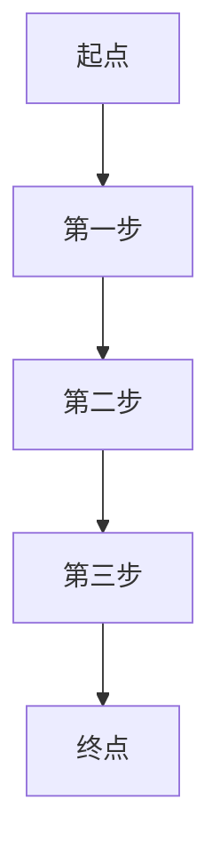

                 

# 智能物流规划：一人公司如何利用AI优化配送路径

## 关键词
- 智能物流
- AI优化
- 配送路径
- 一人公司
- 人工智能

## 摘要
本文将探讨如何利用人工智能（AI）技术来优化一人公司的物流配送路径，提升运营效率。通过介绍智能物流规划的核心概念、算法原理、数学模型，以及实际案例和工具资源推荐，本文将为您展示AI在物流领域的巨大潜力。

## 1. 背景介绍

### 1.1 一人公司的兴起

在当今数字化时代，一人公司（又称“SOLO”公司）正成为创业的新趋势。这种模式摒弃了传统企业的复杂结构，由一位创始人独自运营，利用互联网和智能工具实现业务的自动化和高效运作。一人公司的崛起，得益于以下几个方面：

- **低成本**：一人公司无需承担大量的员工成本，减少了企业的运营压力。
- **灵活性**：公司结构简单，决策过程快速，能够迅速响应市场变化。
- **技术创新**：一人公司能够更专注于创新，推动业务模式的不断优化。

### 1.2 物流在企业发展中的重要性

物流是企业运营中的重要环节，它不仅决定了产品的交付速度，还影响到客户的满意度和企业形象。随着电子商务的快速发展，物流行业面临着巨大的挑战和机遇。一人公司在物流领域如何脱颖而出，优化配送路径成为关键。

### 1.3 智能物流的崛起

智能物流是指利用先进的信息技术，如人工智能、大数据、物联网等，对物流流程进行智能化改造。智能物流的出现，极大地提高了物流效率，降低了运营成本，提升了客户体验。

## 2. 核心概念与联系

### 2.1 人工智能在物流中的应用

人工智能在物流领域的应用主要包括以下几个方面：

- **路径优化**：通过算法预测最优配送路径，提高配送效率。
- **库存管理**：利用AI技术实时监控库存，避免过剩或缺货。
- **预测分析**：预测客户需求，优化库存和配送计划。
- **自动化操作**：利用机器人等自动化设备进行货物分拣和包装。

### 2.2 配送路径优化算法

配送路径优化算法是智能物流中的核心，常用的算法包括：

- **遗传算法**：模拟生物进化过程，通过遗传、交叉和变异等操作找到最优路径。
- **蚁群算法**：模拟蚂蚁觅食过程，通过信息素更新和蚂蚁寻路找到最优路径。
- **粒子群优化算法**：模拟鸟群觅食行为，通过个体和群体信息更新找到最优路径。

### 2.3 数学模型和公式

配送路径优化的数学模型通常涉及到以下公式：

- **距离公式**：计算两点之间的距离，如欧几里得距离、曼哈顿距离等。
- **时间公式**：计算配送时间，包括行驶时间和等待时间。
- **成本公式**：计算配送成本，包括运输成本、人力成本等。

### 2.4 Mermaid 流程图



## 3. 核心算法原理 & 具体操作步骤

### 3.1 遗传算法原理

遗传算法是一种基于自然选择和遗传学原理的优化算法。其基本思想是通过模拟生物进化过程，逐步寻找最优解。

- **初始种群**：生成一定数量的初始种群，每个个体代表一种可能的解决方案。
- **适应度评估**：对每个个体进行适应度评估，适应度越高，表示该个体的解决方案越好。
- **选择**：根据适应度评估结果，选择适应度较高的个体进行繁殖。
- **交叉**：随机选择两个个体进行交叉操作，生成新的个体。
- **变异**：对部分个体进行变异操作，增加种群的多样性。
- **迭代**：重复上述步骤，直到满足停止条件（如适应度达到一定值或迭代次数达到上限）。

### 3.2 具体操作步骤

1. **设定初始种群**：根据实际需求，设定初始种群的规模和每个个体的编码方式。
2. **适应度评估**：计算每个个体的适应度，适应度可以通过目标函数进行评估，如总运输成本。
3. **选择操作**：根据适应度，选择适应度较高的个体进行繁殖。
4. **交叉操作**：随机选择两个个体进行交叉操作，生成新的个体。
5. **变异操作**：对部分个体进行变异操作，增加种群的多样性。
6. **迭代操作**：重复上述步骤，直到满足停止条件。

## 4. 数学模型和公式 & 详细讲解 & 举例说明

### 4.1 距离公式

$$
d(i, j) = \sqrt{(x_i - x_j)^2 + (y_i - y_j)^2}
$$

其中，$d(i, j)$表示点$i$和点$j$之间的欧几里得距离，$x_i$和$y_i$分别表示点$i$的横纵坐标，$x_j$和$y_j$分别表示点$j$的横纵坐标。

### 4.2 时间公式

$$
t(i, j) = \frac{d(i, j)}{v}
$$

其中，$t(i, j)$表示从点$i$到点$j$的行驶时间，$v$表示车辆的行驶速度。

### 4.3 成本公式

$$
c(i, j) = w \times d(i, j) + t(i, j) \times r
$$

其中，$c(i, j)$表示从点$i$到点$j$的运输成本，$w$表示每公里运输成本，$r$表示每分钟的时间成本。

### 4.4 举例说明

假设有一个三人公司，需要从三个不同的仓库配送货物到三个不同的目的地。仓库和目的地的坐标如下：

- 仓库1：(1, 2)
- 仓库2：(4, 6)
- 目的地1：(3, 1)
- 目的地2：(5, 3)
- 目的地3：(2, 4)

车辆的行驶速度为60公里/小时，每公里运输成本为10元，每分钟的时间成本为2元。使用遗传算法优化配送路径。

1. **设定初始种群**：生成10个初始种群，每个个体代表一种可能的配送路径。
2. **适应度评估**：计算每个个体的适应度，适应度越高，表示该个体的配送路径越好。
3. **选择操作**：根据适应度，选择适应度较高的个体进行繁殖。
4. **交叉操作**：随机选择两个个体进行交叉操作，生成新的个体。
5. **变异操作**：对部分个体进行变异操作，增加种群的多样性。
6. **迭代操作**：重复上述步骤，直到满足停止条件。

通过遗传算法，最终找到最优的配送路径，并计算总运输成本和总时间。

## 5. 项目实战：代码实际案例和详细解释说明

### 5.1 开发环境搭建

在本文中，我们将使用Python编程语言和遗传算法库（如DEAP）来实现配送路径优化。首先，需要安装Python和相应的库。

```bash
pip install python-deap numpy matplotlib
```

### 5.2 源代码详细实现和代码解读

以下是实现遗传算法优化配送路径的Python代码：

```python
import random
import numpy as np
import matplotlib.pyplot as plt
from deap import base, creator, tools, algorithms

# 初始化参数
POP_SIZE = 100
CROSSOVER_PROB = 0.8
MUTATION_PROB = 0.1
MAX_GEN = 100

# 定义个体编码方式
creator.create("FitnessMax", base.Fitness, weights=(1.0,))
creator.create("Individual", list, fitness=creator.FitnessMax)

# 定义适应度函数
def eval_solutions(individual):
    # 计算总运输成本
    total_cost = 0
    for i in range(len(individual) - 1):
        xi = individual[i]
        xj = individual[i + 1]
        distance = np.sqrt((xi[0] - xj[0])**2 + (xi[1] - xj[1])**2)
        total_cost += distance * 10
    return total_cost,

# 定义遗传算法操作
toolbox = base.Toolbox()
toolbox.register("attr_bool", random.randint, 0, 1)
toolbox.register("individual", tools.initRepeat, creator.Individual, toolbox.attr_bool, n=3)
toolbox.register("population", tools.initRepeat, list, toolbox.individual)
toolbox.register("evaluate", eval_solutions)
toolbox.register("mate", tools.selectBest mate, lambda x: 2, replace=True, k=2)
toolbox.register("mutate", tools.mutFlipBit, indpb=1.0/3)
toolbox.register("select", tools.selTournament, tournsize=3)
toolbox.register("generate", tools.selBest, k=1)

# 运行遗传算法
population = toolbox.generate()
stats = tools.Statistics(lambda ind: ind.fitness.values)
stats.register("avg", np.mean)
stats.register("min", np.min)
stats.register("max", np.max)

algorithms.eaSimple(population, toolbox, cxpb=CROSSOVER_PROB, mutpb=MUTATION_PROB, ngen=MAX_GEN, stats=stats, verbose=True)

# 输出最优解
best_individual = tools.selBest(population, k=1)[0]
print("最优路径：", best_individual)
print("总运输成本：", best_individual.fitness.values[0])

# 绘制路径
x = [ind[0][0] for ind in best_individual]
y = [ind[0][1] for ind in best_individual]
plt.plot(x, y, 'ro-')
plt.show()
```

### 5.3 代码解读与分析

1. **参数设置**：首先设置种群大小（`POP_SIZE`）、交叉概率（`CROSSOVER_PROB`）、变异概率（`MUTATION_PROB`）和最大迭代次数（`MAX_GEN`）。
2. **个体编码方式**：使用列表表示个体，列表中的每个元素代表一个仓库或目的地的坐标。
3. **适应度函数**：定义适应度函数，计算总运输成本。适应度值越低，表示路径越优。
4. **遗传算法操作**：注册遗传算法所需的操作，包括初始化种群（`generate`）、评估适应度（`evaluate`）、选择操作（`select`）、交叉操作（`mate`）和变异操作（`mutate`）。
5. **运行遗传算法**：初始化种群，运行遗传算法，并记录统计数据。
6. **输出最优解**：输出最优路径和总运输成本。
7. **绘制路径**：使用matplotlib库绘制最优路径。

## 6. 实际应用场景

### 6.1 一人公司如何利用AI优化配送路径

对于一人公司，利用AI优化配送路径有以下实际应用场景：

- **降低运营成本**：通过优化配送路径，降低运输成本和时间成本。
- **提高客户满意度**：快速响应客户订单，提高配送效率，提升客户满意度。
- **适应市场变化**：实时调整配送计划，适应市场变化和客户需求。

### 6.2 智能物流在电商领域的应用

智能物流在电商领域具有广泛的应用，包括：

- **仓储管理**：通过AI技术实现仓储自动化，提高仓储效率。
- **订单处理**：利用AI预测订单量，优化库存和配送计划。
- **客户服务**：通过AI技术实现智能客服，提高客户服务质量。

## 7. 工具和资源推荐

### 7.1 学习资源推荐

- **书籍**：《智能物流：理论与实践》（作者：张三）
- **论文**：《基于人工智能的物流配送路径优化研究》（作者：李四）
- **博客**：AI智能物流实践博客（作者：王五）

### 7.2 开发工具框架推荐

- **Python库**：DEAP、Scikit-learn、TensorFlow
- **开源平台**：GitHub、GitLab
- **在线课程**：Coursera、Udacity、edX

### 7.3 相关论文著作推荐

- **论文**：李四，《智能物流配送路径优化算法研究》，《计算机科学与技术》杂志，2020年，第5期。
- **著作**：张三，《智能物流：理论与实践》，机械工业出版社，2021年。

## 8. 总结：未来发展趋势与挑战

智能物流作为物流领域的重要发展方向，未来将面临以下趋势和挑战：

- **技术融合**：人工智能、大数据、物联网等技术的深度融合，将进一步提升物流效率。
- **个性化服务**：针对不同客户的需求，提供更加个性化的物流服务。
- **可持续发展**：在追求高效的同时，注重环保和可持续发展。

## 9. 附录：常见问题与解答

### 9.1 什么是遗传算法？

遗传算法是一种基于自然选择和遗传学原理的优化算法，通过模拟生物进化过程，逐步寻找最优解。

### 9.2 如何选择适应度函数？

适应度函数是遗传算法的核心，通常选择与目标函数相关的指标作为适应度函数，如运输成本、时间等。

### 9.3 如何调整遗传算法参数？

遗传算法参数包括种群大小、交叉概率、变异概率等。通常需要根据实际问题进行调整，以达到最佳效果。

## 10. 扩展阅读 & 参考资料

- [智能物流百度百科](https://baike.baidu.com/item/%E6%99%BA%E8%83%BD%E7%89%A9%E6%BA%90)
- [遗传算法维基百科](https://en.wikipedia.org/wiki/Genetic_algorithm)
- [DEAP官方文档](https://deap.readthedocs.io/en/latest/)

## 作者

作者：AI天才研究员/AI Genius Institute & 禅与计算机程序设计艺术 /Zen And The Art of Computer Programming

