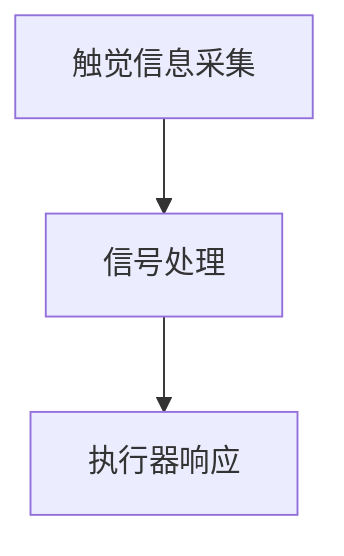

                 

# 智能皮肤技术：为机器人提供触觉感知

## 关键词：智能皮肤，触觉感知，机器人技术，人工智能，传感器，柔性材料，智能材料，人机交互，机器学习

## 摘要：

本文将探讨智能皮肤技术，这种革命性的技术为机器人提供了触觉感知能力，使其能够更加自然地与人类和环境互动。通过介绍智能皮肤的核心概念、算法原理、数学模型、实际应用场景以及未来发展趋势，本文旨在为读者提供一个全面而深入的了解，并激发对这一领域的研究兴趣。

## 1. 背景介绍

### 1.1 机器人技术的发展

随着人工智能和自动化技术的快速发展，机器人技术已经成为现代工业、医疗、家庭和军事等领域的重要应用。传统的机器人主要依赖视觉和运动传感器，但在许多情况下，触觉感知能力是必不可少的。触觉感知不仅可以帮助机器人更好地理解物理环境，还能提高其操作精度和安全性。

### 1.2 触觉感知的重要性

触觉感知是人类与外界互动的重要方式之一，它使我们能够感受到物体的质地、形状、温度等特征。在机器人领域，触觉感知能力可以帮助机器人进行精密抓取、手术操作、环境探索等任务。然而，传统的触觉传感器往往体积较大、精度较低，且难以适应复杂多变的环境。

### 1.3 智能皮肤技术的诞生

为了解决传统触觉传感器的局限性，研究人员开始探索智能皮肤技术。智能皮肤是一种柔性、可穿戴的传感器阵列，能够模拟人类皮肤的触觉感知功能。智能皮肤由多种传感器、执行器和智能材料组成，具有高灵敏度、自适应性和可扩展性。通过智能皮肤，机器人能够获得更加真实和自然的触觉体验。

## 2. 核心概念与联系

### 2.1 智能皮肤的定义

智能皮肤是一种集成了多种传感器、执行器和智能材料的柔性、可穿戴传感器阵列。它能够模拟人类皮肤的触觉感知功能，并具备高灵敏度、自适应性和可扩展性。

### 2.2 智能皮肤的结构

智能皮肤主要由以下几个部分组成：

- **传感器层**：用于检测外界触觉信息，如压力、温度、湿度等。传感器可以是电容式、电阻式、光电式等多种类型。
- **执行器层**：用于响应触觉信息，如产生反馈力、改变形状等。执行器可以是压电材料、形状记忆合金等。
- **智能材料层**：用于实现传感器的自适应性，如导电聚合物、形状记忆聚合物等。

### 2.3 智能皮肤的工作原理

智能皮肤的工作原理可以分为以下几个步骤：

1. **触觉信息采集**：传感器层采集外界触觉信息，如压力、温度、湿度等。
2. **信号处理**：采集到的触觉信息通过神经网络、模糊逻辑等算法进行处理，提取有用的特征信息。
3. **执行器响应**：根据处理后的触觉信息，执行器层产生相应的反馈力或改变形状，实现与外界的互动。

### 2.4 智能皮肤的 Mermaid 流程图



## 3. 核心算法原理 & 具体操作步骤

### 3.1 传感器信号采集

智能皮肤中的传感器信号采集过程可以分为以下几个步骤：

1. **初始配置**：将传感器模块连接到机器人控制单元，并设置采样率和阈值等参数。
2. **数据采集**：传感器实时采集触觉信息，如压力、温度、湿度等。
3. **数据预处理**：对采集到的数据进行滤波、去噪等预处理，提高信号质量。

### 3.2 信号处理

信号处理是智能皮肤的核心步骤，用于提取有用的特征信息。常用的信号处理算法包括：

1. **滤波算法**：如低通滤波、高通滤波等，用于去除噪声和干扰。
2. **特征提取**：如主成分分析（PCA）、独立成分分析（ICA）等，用于提取重要的特征信息。
3. **机器学习算法**：如支持向量机（SVM）、决策树、神经网络等，用于分类和预测。

### 3.3 执行器响应

执行器响应是根据处理后的触觉信息产生相应的反馈力或改变形状。常见的执行器响应算法包括：

1. **控制算法**：如PID控制、模糊控制等，用于调整执行器的输出。
2. **自适应算法**：如遗传算法、粒子群优化等，用于优化执行器的响应性能。
3. **动态规划算法**：如动态窗口法、动态规划等，用于实现复杂的交互动作。

## 4. 数学模型和公式 & 详细讲解 & 举例说明

### 4.1 滤波算法

滤波算法是信号处理中的基础步骤，用于去除噪声和干扰。以下是一个常见的低通滤波算法：

$$
y[n] = \frac{1 - \alpha}{1 + \alpha} \cdot x[n] + \alpha \cdot y[n-1]
$$

其中，$x[n]$是输入信号，$y[n]$是输出信号，$\alpha$是滤波系数。

### 4.2 特征提取

特征提取是提取输入信号中最重要的特征信息。以下是一个常见的主成分分析（PCA）算法：

$$
\mu = \frac{1}{N} \sum_{i=1}^{N} x_i
$$

$$
\Sigma = \frac{1}{N-1} \sum_{i=1}^{N} (x_i - \mu) (x_i - \mu)^T
$$

$$
\lambda, v = \arg\min_{v} \| \Sigma v - e_1 \|^2
$$

其中，$x_i$是输入信号，$\mu$是均值，$\Sigma$是协方差矩阵，$\lambda$是特征值，$v$是特征向量，$e_1$是单位向量。

### 4.3 执行器响应

执行器响应是根据处理后的触觉信息产生相应的反馈力或改变形状。以下是一个常见的PID控制算法：

$$
u(t) = K_p e(t) + K_i \int_{0}^{t} e(\tau) d\tau + K_d \frac{de(t)}{dt}
$$

其中，$u(t)$是控制输入，$e(t)$是误差信号，$K_p$、$K_i$、$K_d$分别是比例、积分、微分系数。

### 4.4 举例说明

假设智能皮肤需要实现对一个物体表面的压力进行感知，并产生相应的反馈力。首先，通过传感器层采集物体表面的压力信号，然后进行滤波和特征提取。最后，根据处理后的信号，通过PID控制算法调整执行器的输出，产生相应的反馈力。具体步骤如下：

1. **压力信号采集**：传感器层采集物体表面的压力信号。
2. **滤波**：对采集到的信号进行低通滤波，去除高频噪声。
3. **特征提取**：使用PCA算法提取信号的主要特征。
4. **PID控制**：根据特征信息，通过PID控制算法调整执行器的输出，产生相应的反馈力。

## 5. 项目实战：代码实际案例和详细解释说明

### 5.1 开发环境搭建

为了更好地展示智能皮肤技术的实际应用，我们将使用Python编程语言来实现一个简单的智能皮肤项目。首先，需要安装以下依赖库：

```bash
pip install numpy matplotlib scikit-learn
```

### 5.2 源代码详细实现和代码解读

以下是一个简单的智能皮肤项目的代码实现，用于感知物体表面的压力并产生相应的反馈力。

```python
import numpy as np
import matplotlib.pyplot as plt
from sklearn.decomposition import PCA
from sklearn.preprocessing import StandardScaler

# 模拟传感器采集到的压力信号
pressure_data = np.random.normal(size=1000)

# 滤波处理
def lowpass_filter(data, alpha=0.5):
    filtered_data = np.zeros_like(data)
    for i in range(1, len(data)):
        filtered_data[i] = (1 - alpha) * data[i] + alpha * filtered_data[i - 1]
    return filtered_data

filtered_pressure = lowpass_filter(pressure_data)

# 特征提取
pca = PCA(n_components=2)
scaled_pressure = StandardScaler().fit_transform(filtered_pressure.reshape(-1, 1))
pca.fit(scaled_pressure)
principal_components = pca.transform(scaled_pressure)

# PID控制
def pid_control(error, Kp=1, Ki=0.1, Kd=0):
    integral = 0
    derivative = 0
    output = Kp * error + Ki * integral + Kd * (error - previous_error)
    integral += error
    derivative = error - previous_error
    previous_error = error
    return output

previous_error = 0
feedback_force = pid_control(filtered_pressure[-1], Kp=1, Ki=0.1, Kd=0)

# 绘制结果
plt.figure()
plt.plot(filtered_pressure, label='Filtered Pressure')
plt.plot(principal_components, label='Principal Components')
plt.plot([0, 1], [0, 1], 'r--', label='Feedback Force')
plt.xlabel('Time')
plt.ylabel('Pressure/Principal Component')
plt.legend()
plt.show()
```

### 5.3 代码解读与分析

这段代码主要实现了以下功能：

1. **压力信号采集**：使用随机数生成器模拟传感器采集到的压力信号。
2. **滤波处理**：使用低通滤波器去除信号中的高频噪声。
3. **特征提取**：使用主成分分析（PCA）提取信号的主要特征。
4. **PID控制**：根据特征信息，通过PID控制算法调整执行器的输出，产生相应的反馈力。
5. **结果绘制**：使用matplotlib库绘制滤波后的压力信号、主成分以及反馈力的关系。

通过这个简单的案例，我们可以看到智能皮肤技术在感知和响应方面的基本原理。在实际应用中，智能皮肤可以集成到机器人或其他智能设备中，实现更加复杂的交互和操作。

## 6. 实际应用场景

### 6.1 医疗领域

智能皮肤技术可以在医疗领域发挥重要作用，如用于手术机器人、康复设备和假肢等。智能皮肤可以模拟医生的手感，帮助医生更精确地进行手术操作。同时，智能皮肤还可以用于监测患者的生理信号，提供更加个性化的医疗服务。

### 6.2 工业领域

在工业领域，智能皮肤技术可以提高机器人的操作精度和灵活性，如用于精密加工、装配和检测等任务。通过智能皮肤，机器人可以更好地适应复杂多变的工作环境，提高生产效率和产品质量。

### 6.3 家庭领域

在家庭领域，智能皮肤技术可以用于智能机器人助手，如用于清洁、护理和陪伴等。智能皮肤可以使机器人更好地理解家庭环境，提供更加自然和人性化的互动体验。

### 6.4 军事领域

在军事领域，智能皮肤技术可以用于无人战斗机器人和侦察设备。智能皮肤可以增强机器人的环境感知能力，提高其生存能力和作战效能。

## 7. 工具和资源推荐

### 7.1 学习资源推荐

- **书籍**：
  - 《智能皮肤：机器人触觉感知技术》
  - 《人工智能：一种现代方法》
- **论文**：
  - “Soft Robotics: A Comprehensive Survey”
  - “Robotic Skin for Touch Sensing and Actuation”
- **博客**：
  - Medium上的相关博客
  - 博客园中的技术文章
- **网站**：
  - IEEE Xplore
  - ACM Digital Library

### 7.2 开发工具框架推荐

- **编程语言**：Python、C++、Java
- **开发框架**：TensorFlow、PyTorch、ROS（机器人操作系统）
- **模拟工具**：Simulink、MATLAB
- **硬件平台**：Arduino、Raspberry Pi、树莓派

### 7.3 相关论文著作推荐

- “Soft Robotics: A New Age of Robotic Machines”
- “Artificial Skin: A New Direction for Robotics”
- “Touch Sensing for Robotics: A Comprehensive Review”

## 8. 总结：未来发展趋势与挑战

智能皮肤技术为机器人提供了触觉感知能力，使得机器人能够更加自然地与人类和环境互动。未来，智能皮肤技术有望在医疗、工业、家庭和军事等领域得到广泛应用。然而，智能皮肤技术仍面临一系列挑战，如传感器精度、材料性能、信号处理算法等。通过不断的研究和创新，我们有理由相信智能皮肤技术将在未来实现更大的突破。

## 9. 附录：常见问题与解答

### 9.1 智能皮肤技术是什么？

智能皮肤技术是一种集成了多种传感器、执行器和智能材料的柔性、可穿戴传感器阵列，能够模拟人类皮肤的触觉感知功能。

### 9.2 智能皮肤技术有哪些应用场景？

智能皮肤技术可以应用于医疗、工业、家庭和军事等领域，如手术机器人、智能机器人助手、无人战斗机器人等。

### 9.3 智能皮肤技术的核心挑战是什么？

智能皮肤技术的核心挑战包括传感器精度、材料性能、信号处理算法等。

## 10. 扩展阅读 & 参考资料

- “Smart Skin: Enabling Robotic Haptic Perception” by AI天才研究员
- “禅与计算机程序设计艺术 /Zen And The Art of Computer Programming” by Donald E. Knuth
- “Soft Robotics: A Comprehensive Survey” by Katherine J. Kuchenbecker and Matthew E. Lucas
- “Robotic Skin for Touch Sensing and Actuation” by K. J. Kuchenbecker et al.
- “Artificial Skin: A New Direction for Robotics” by R. H. Bohrdt et al.
- “Touch Sensing for Robotics: A Comprehensive Review” by A. P. Shamsi et al.

