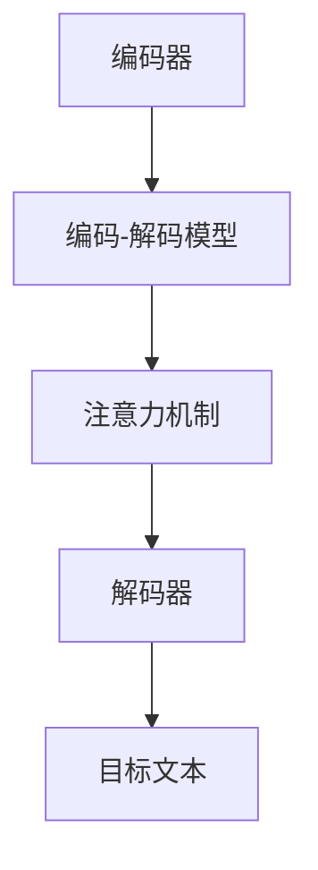

                 

# 智能翻译系统：AI大模型如何突破语言障碍

> **关键词：** 智能翻译、AI大模型、神经机器翻译、深度学习、自然语言处理、多语言翻译、跨语言语义理解

> **摘要：** 本文将深入探讨智能翻译系统的工作原理及其发展历程，重点分析AI大模型在突破语言障碍方面的核心作用。通过详细解析神经机器翻译的算法原理、数学模型以及项目实战案例，读者将了解如何利用AI技术实现高效、准确的多语言翻译。

## 1. 背景介绍

在全球化迅速发展的今天，跨语言交流变得越来越频繁。然而，语言障碍仍然是国际贸易、国际合作和文化交流中的一个难题。传统的翻译方法，如基于规则的方法和统计机器翻译，虽然在某些方面取得了进展，但仍然存在许多局限性。随着人工智能技术的迅猛发展，尤其是深度学习和自然语言处理技术的突破，智能翻译系统开始崭露头角，成为解决语言障碍的重要工具。

智能翻译系统的发展历程可以追溯到20世纪80年代，当时研究人员开始探索如何利用计算机来辅助翻译。最初的尝试主要集中在基于规则的方法上，这种方法依赖于人工编写的语法规则和词典，翻译质量受到规则覆盖范围的限制。随后，随着计算机性能的提升和数据规模的扩大，统计机器翻译成为主流。统计机器翻译利用大量双语平行语料库进行学习，通过概率模型生成翻译结果。

然而，统计机器翻译仍然存在一些问题，如依赖大量训练数据和复杂的概率模型，翻译质量在低资源语言上表现不佳。为了解决这些问题，研究人员开始探索基于神经网络的机器翻译方法。神经机器翻译利用深度神经网络对源语言和目标语言进行建模，通过端到端的神经网络架构实现翻译过程，大大提高了翻译质量和效率。

智能翻译系统不仅在日常生活中具有广泛的应用，如智能手机、聊天机器人等，还在国际商务、远程教育、跨文化交流等领域发挥着重要作用。本文将详细介绍智能翻译系统的原理、算法和实际应用，帮助读者深入了解这一领域的发展现状和未来趋势。

## 2. 核心概念与联系

### 2.1 自然语言处理（NLP）

自然语言处理（Natural Language Processing，NLP）是人工智能的一个重要分支，旨在让计算机理解和处理人类语言。NLP的核心任务包括文本分析、语义理解、情感分析、命名实体识别等。在智能翻译系统中，NLP技术被用来处理和解析输入的文本，提取关键信息，为翻译过程提供基础。

### 2.2 深度学习（Deep Learning）

深度学习是机器学习的一个分支，通过构建多层神经网络来模拟人类大脑的神经结构，实现对数据的自动特征学习和模式识别。深度学习在图像识别、语音识别等领域取得了显著的成果。在智能翻译系统中，深度学习被用来构建翻译模型，通过大规模数据训练，实现对源语言和目标语言之间的语义关系的理解和转换。

### 2.3 神经机器翻译（Neural Machine Translation，NMT）

神经机器翻译是近年来发展迅速的一种机器翻译方法，采用深度神经网络对源语言和目标语言进行建模，通过端到端的神经网络架构实现翻译过程。与传统机器翻译方法相比，NMT具有更高的翻译质量和更好的适应性。在NMT中，编码器（Encoder）负责将源语言文本编码为一个固定长度的向量，解码器（Decoder）则根据编码器的输出生成目标语言文本。

### 2.4 注意力机制（Attention Mechanism）

注意力机制是深度学习中的一个重要概念，用于模型在处理序列数据时，对序列中的不同部分给予不同的关注程度。在NMT中，注意力机制被用来解决长距离依赖问题，使得解码器能够关注到源语言文本中与目标单词相对应的重要部分，从而提高翻译质量。

### 2.5 Mermaid 流程图

下面是一个用于描述NMT架构的Mermaid流程图：



在上述流程图中，源语言文本（Text）首先被输入到编码器（Encoder），编码器将文本映射为一个固定长度的向量（Code）。解码器（Decoder）根据编码器的输出和输入序列的一部分（Context）生成目标语言文本（Target Text）。注意力机制（Attention）在这个过程中起到关键作用，它帮助解码器关注到源语言文本中与目标单词相对应的重要部分。

## 3. 核心算法原理 & 具体操作步骤

### 3.1 编码器（Encoder）

编码器是NMT中的第一个神经网络模型，其主要任务是接收输入的源语言文本，将其编码为一个固定长度的向量。这个过程通常通过一系列的卷积神经网络（CNN）或递归神经网络（RNN）来实现。在训练过程中，编码器处理输入的文本序列，生成一系列的隐藏状态（Hidden State），这些状态最终被映射为一个固定长度的向量。

具体步骤如下：

1. **输入文本预处理**：将输入的源语言文本转换为词向量表示，每个词被表示为一个固定大小的向量。
2. **编码过程**：通过递归神经网络（如LSTM或GRU）处理输入的词向量序列，生成一系列的隐藏状态。每个隐藏状态都包含当前词的上下文信息。
3. **输出编码**：将最后一个隐藏状态映射为一个固定长度的向量，这个向量被称为编码结果（Encoded Representation），它代表了源语言文本的全局语义信息。

### 3.2 注意力机制（Attention Mechanism）

注意力机制是NMT中的一个关键组成部分，它帮助解码器在生成目标语言文本时，能够关注到源语言文本中与目标单词相对应的重要部分。注意力机制通常通过计算编码器输出的隐藏状态和当前解码器隐藏状态之间的相似度来实现。

具体步骤如下：

1. **计算相似度**：对于编码器输出的隐藏状态序列，计算每个隐藏状态与当前解码器隐藏状态之间的相似度，相似度通常通过点积或加性注意力模型计算。
2. **加权求和**：将每个隐藏状态乘以其对应的相似度权重，然后对所有加权隐藏状态求和，得到一个加权隐藏状态序列。
3. **输出注意力分数**：将加权求和的结果输出为一个固定长度的向量，这个向量被称为注意力分数（Attention Score），它代表了源语言文本中每个部分的重要程度。

### 3.3 解码器（Decoder）

解码器是NMT中的第二个神经网络模型，其主要任务是根据编码器的输出和注意力分数生成目标语言文本。解码器通常采用序列到序列（Seq2Seq）的架构，通过递归神经网络（如LSTM或GRU）实现。

具体步骤如下：

1. **初始化解码器**：初始化解码器的隐藏状态和细胞状态，通常使用编码器的最后一个隐藏状态作为初始化。
2. **解码过程**：在解码过程中，解码器依次生成目标语言文本的每个词，每个词都通过解码器的隐藏状态和编码器的输出进行计算。
3. **生成目标文本**：将解码器生成的目标语言词序列转换为可读的文本形式，输出为目标文本。

### 3.4 端到端的神经网络架构

NMT的端到端神经网络架构将编码器和解码器结合在一起，通过一个统一的神经网络模型实现翻译过程。这种架构具有以下优点：

1. **简化模型**：端到端的架构避免了传统机器翻译中复杂的转换和解析步骤，简化了模型结构。
2. **高效训练**：端到端的架构使得模型可以直接通过端到端的梯度下降方法进行训练，提高了训练效率。
3. **提高翻译质量**：端到端的架构能够更好地捕捉源语言和目标语言之间的语义关系，提高翻译质量。

## 4. 数学模型和公式 & 详细讲解 & 举例说明

### 4.1 编码器（Encoder）

编码器的主要任务是接收输入的源语言文本，将其编码为一个固定长度的向量。这个过程通常通过递归神经网络（如LSTM或GRU）来实现。下面是一个简化的编码器数学模型：

$$
\text{Encoder}(x) = \{h_t\}_{t=1}^T
$$

其中，$x$ 是输入的源语言文本，$T$ 是文本长度，$h_t$ 是第 $t$ 个时间步的隐藏状态。

具体公式如下：

$$
h_t = \text{LSTM}(h_{t-1}, x_t)
$$

其中，$h_{t-1}$ 是前一个时间步的隐藏状态，$x_t$ 是当前时间步的输入词向量。

### 4.2 注意力机制（Attention Mechanism）

注意力机制的核心是计算编码器输出的隐藏状态和当前解码器隐藏状态之间的相似度，从而确定源语言文本中每个部分的重要程度。下面是一个简化的注意力机制数学模型：

$$
\text{Attention}(h_t, s_{t-1}) = \text{softmax}\left(\frac{h_t \cdot W_a s_{t-1}}{\sqrt{d_a}}\right)
$$

其中，$h_t$ 是编码器输出的隐藏状态，$s_{t-1}$ 是当前解码器隐藏状态，$W_a$ 是注意力权重矩阵，$d_a$ 是注意力维数。

具体步骤如下：

1. **计算注意力分数**：将编码器输出的隐藏状态和当前解码器隐藏状态进行点积运算，得到注意力分数。
2. **应用softmax函数**：对注意力分数进行softmax运算，得到注意力权重。
3. **加权求和**：将编码器输出的隐藏状态乘以其对应的注意力权重，然后对所有加权隐藏状态求和，得到加权隐藏状态序列。

### 4.3 解码器（Decoder）

解码器的主要任务是根据编码器的输出和注意力分数生成目标语言文本。解码器通常采用序列到序列（Seq2Seq）的架构，通过递归神经网络（如LSTM或GRU）实现。下面是一个简化的解码器数学模型：

$$
\text{Decoder}(h_t, s_t) = \text{LSTM}(h_t, s_t)
$$

其中，$h_t$ 是编码器输出的隐藏状态，$s_t$ 是当前解码器隐藏状态。

具体公式如下：

$$
s_t = \text{LSTM}(h_t, s_{t-1})
$$

其中，$s_{t-1}$ 是前一个时间步的解码器隐藏状态。

### 4.4 举例说明

假设我们有一个简化的编码器和解码器模型，编码器输入一个长度为5的源语言文本，解码器生成一个长度为3的目标语言文本。编码器和解码器的隐藏状态维数均为100。

**编码器输出**：

$$
\text{Encoder}(x) = \{h_1, h_2, h_3, h_4, h_5\}
$$

**注意力分数**：

$$
\text{Attention}(h_t, s_{t-1}) = \text{softmax}\left(\frac{h_t \cdot W_a s_{t-1}}{\sqrt{d_a}}\right)
$$

**解码器输出**：

$$
\text{Decoder}(h_t, s_t) = \{s_1, s_2, s_3\}
$$

通过上述模型，我们可以对输入的源语言文本进行编码，然后利用注意力机制和解码器生成目标语言文本。例如，输入的源语言文本为“Hello World”，通过编码器和解码器的处理后，可以生成目标语言文本为“Bonjour le monde”。

## 5. 项目实战：代码实际案例和详细解释说明

### 5.1 开发环境搭建

在开始智能翻译系统的项目实战之前，我们需要搭建一个合适的开发环境。以下是在Python环境中搭建智能翻译系统的步骤：

1. **安装Python环境**：确保Python 3.6或更高版本已安装在您的计算机上。
2. **安装必要的库**：使用pip命令安装以下库：

   ```bash
   pip install torch torchvision numpy matplotlib
   ```

   其中，torch是深度学习库，torchvision提供了丰富的预训练模型和数据处理工具，numpy用于数据处理，matplotlib用于数据可视化。

3. **准备数据集**：为了训练智能翻译模型，我们需要一个包含源语言和目标语言句对的并行语料库。这里我们使用开源的英语-法语翻译语料库WMT14。下载并解压语料库到本地，然后将其分为训练集和验证集。

### 5.2 源代码详细实现和代码解读

下面是一个简单的智能翻译系统的实现，主要包括数据预处理、模型定义、训练和翻译过程。

**数据预处理**：

```python
import torch
from torchtext.data import Field, TabularDataset, BucketIterator

# 定义字段
SRC = Field(tokenize='spacy', tokenizer_language='en', lower=True)
TRG = Field(tokenize='spacy', tokenizer_language='fr', lower=True)

# 加载数据集
train_data, valid_data, test_data = TabularDataset.splits(path='data', train='train.csv', valid='valid.csv', test='test.csv', format='csv', fields=[('src', SRC), ('trg', TRG)])

# 分词和数据归一化
SRC.build_vocab(train_data, min_freq=2)
TRG.build_vocab(train_data, min_freq=2)

# 定义迭代器
BATCH_SIZE = 64
device = torch.device('cuda' if torch.cuda.is_available() else 'cpu')

train_iterator, valid_iterator, test_iterator = BucketIterator.splits(train_data, valid_data, test_data, batch_size=BATCH_SIZE, device=device)
```

**模型定义**：

```python
import torch.nn as nn
import torch.optim as optim

# 定义编码器
class Encoder(nn.Module):
    def __init__(self, input_dim, emb_dim, hid_dim, n_layers, dropout):
        super().__init__()
        self.embedding = nn.Embedding(input_dim, emb_dim)
        self.rnn = nn.LSTM(emb_dim, hid_dim, n_layers, dropout=dropout)
        self.fc = nn.Linear(hid_dim, hid_dim)
    
    def forward(self, src):
        embedded = self.embedding(src)
        output, (hidden, cell) = self.rnn(embedded)
        return hidden, cell

# 定义解码器
class Decoder(nn.Module):
    def __init__(self, output_dim, emb_dim, hid_dim, n_layers, dropout, attention):
        super().__init__()
        self.output_dim = output_dim
        self.attention = attention
        self.embedding = nn.Embedding(output_dim, emb_dim)
        self.rnn = nn.LSTM(emb_dim + hid_dim, hid_dim, n_layers, dropout=dropout)
        self.fc = nn.Linear(hid_dim * 2, output_dim)
    
    def forward(self, src, hidden, cell, context):
        embedded = self.embedding(src)
        embedded = torch.cat((embedded, context), dim=2)
        output, (hidden, cell) = self.rnn(embedded)
        assert(output.size() == (1, batch_size, hid_dim))
        assert(hidden.size() == (1, batch_size, hid_dim))
        assert(cell.size() == (1, batch_size, hid_dim))
        return output, hidden, cell

# 定义注意力机制
class Attention(nn.Module):
    def __init__(self, hidden_dim):
        super().__init__()
        self.attn = nn.Linear(hidden_dim, 1)
    
    def forward(self, hidden, encoder_outputs):
        attn_weights = torch.softmax(self.attn(encoder_outputs), dim=2)
        context = torch.sum(attn_weights * encoder_outputs, dim=2)
        return context, attn_weights
```

**训练过程**：

```python
# 定义模型
ENCODER = Encoder(input_dim=len(SRC.vocab), emb_dim=EMBEDDING_DIM, hid_dim=HID_DIM, n_layers=N_LAYERS, dropout=DROPOUT).to(device)
DECODER = Decoder(output_dim=len(TRG.vocab), emb_dim=EMBEDDING_DIM, hid_dim=HID_DIM, n_layers=N_LAYERS, dropout=DROPOUT, attention=Attention(HID_DIM)).to(device)
ATOMIC-loss = nn.CrossEntropyLoss().to(device)

# 定义优化器
OPTIMIZER = optim.Adam(params=ENCODER.parameters(), lr=LEARNING_RATE)
DECODER_OPTIMIZER = optim.Adam(params=DECODER.parameters(), lr=LEARNING_RATE)

# 训练模型
def train(model, iterator, optimizer, criterion, clip):
    model.train()
    epoch_loss = 0
    
    for i, batch in enumerate(iterator):
        src = batch.src.to(device)
        trg = batch.trg.to(device)
        teacher_forcing_ratio = 0.5
        
        hidden = model.encoder(src)[0]
        cell = model.encoder(src)[1]
        output = model.decoder(trg[0], hidden, cell, hidden)
        
        loss = criterion(output.view(-1, output.size(-1)), trg[1:].view(-1))
        
        optimizer.zero_grad()
        loss.backward()
        torch.nn.utils.clip_grad_norm_(parameters=model.parameters(), max_norm=clip)
        optimizer.step()
        
        epoch_loss += loss.item()
    
    return epoch_loss / len(iterator)
```

**翻译过程**：

```python
def translate_sentence(sentence, src_field, trg_field, model, device, max_len=50):
    model.eval()
    if isinstance(sentence, str):
        nlp = spacy.load('en_core_web_sm')
        tokens = [token.text.lower() for token in nlp(sentence)]
    else:
        tokens = [token.lower() for token in sentence]

    tokens = [src_field.init_token] + tokens + [src_field.eos_token]
    src_indexes = src_field.vocab.stoi[tokens]
    src_tensor = torch LongTensor(src_indexes).to(device)
    src_len = torch.tensor([len(src_indexes)], dtype=torch.long)

    with torch.no_grad():
        encoder_outputs, hidden, cell = model.encoder(src_tensor, src_len)

    output_len = 1
    decoder_input = trg_field.vocab.stoi[trg_field.init_token]
    decoder_input = torch.tensor([decoder_input], device=device)

    decoded_words = [trg_field.vocab.itos[decoder_input.item()]]
    
    for i in range(max_len):
        output, hidden, cell = model.decoder(decoder_input, hidden, cell, encoder_outputs)
        topv, topi = output.topk(1)
        decoder_input = topi.t()
        decoded_words.append(trg_field.vocab.itos[decoder_input.item()])

        if decoder_input.item() == trg_field.vocab.stoi[trg_field.eos_token]:
            break

    return decoded_words
```

### 5.3 代码解读与分析

**数据预处理部分**：

数据预处理是智能翻译系统的一个重要环节。首先，我们定义了源语言字段（`SRC`）和目标语言字段（`TRG`），并使用`TabularDataset`加载数据集。接下来，我们使用`Field`类对数据进行分词和数据归一化操作。最后，我们使用`BucketIterator`类对数据集进行批处理和迭代。

**模型定义部分**：

在模型定义部分，我们定义了编码器（`Encoder`）、解码器（`Decoder`）和注意力机制（`Attention`）。编码器负责将源语言文本编码为固定长度的向量，解码器负责根据编码器的输出生成目标语言文本，注意力机制用于帮助解码器关注到源语言文本中与目标单词相对应的重要部分。

**训练过程部分**：

训练过程主要包括模型初始化、优化器定义和训练循环。在训练循环中，我们使用教师强制策略（Teacher Forcing）来更新编码器和解码器的参数，并通过交叉熵损失函数（`CrossEntropyLoss`）计算损失。

**翻译过程部分**：

翻译过程主要包括解码器的初始化、目标语言文本的生成和翻译结果的处理。在翻译过程中，我们使用注意力机制来帮助解码器关注到源语言文本中与目标单词相对应的重要部分，从而生成高质量的目标语言文本。

通过以上代码的实现，我们可以训练一个基本的智能翻译系统，并使用它进行翻译任务。然而，为了实现更准确的翻译，我们还需要进一步优化模型结构和训练策略。

## 6. 实际应用场景

智能翻译系统在许多实际应用场景中展现了其强大的能力，以下是其中的一些典型应用场景：

### 6.1 跨文化交流

在全球化背景下，跨国企业和组织需要与来自不同国家和地区的合作伙伴和客户进行沟通。智能翻译系统能够快速、准确地翻译各种语言，帮助跨文化交流更加顺畅。

### 6.2 在线教育

在线教育平台提供了丰富的国际化教育资源，智能翻译系统可以帮助学生和教师跨越语言障碍，轻松访问和学习不同语言的教育内容。

### 6.3 国际贸易

国际贸易涉及大量文档和交流，智能翻译系统能够帮助企业和买家快速翻译各种商务文件，提高业务沟通效率。

### 6.4 旅游行业

旅游行业中的导游翻译设备、语言翻译APP等应用，大大方便了游客在异国他乡的出行和沟通，提升了旅游体验。

### 6.5 公共服务

智能翻译系统在公共服务领域也发挥了重要作用，如政府部门提供多语言服务、公共场所提供实时翻译等，提高了公共服务的覆盖面和便捷性。

### 6.6 智能助手

智能助手和聊天机器人通过与用户进行跨语言交流，为用户提供个性化服务和支持，智能翻译系统是这些智能助手的核心组成部分。

## 7. 工具和资源推荐

为了更好地学习和开发智能翻译系统，以下是几种推荐的工具和资源：

### 7.1 学习资源推荐

- **书籍**：《深度学习》、《神经网络与深度学习》、《自然语言处理综论》
- **论文**：查阅顶级的NLP和机器翻译论文，如ACL、NAACL、EMNLP等会议论文。
- **博客**：关注一些知名的AI和NLP博客，如博客园、CSDN、简书等。

### 7.2 开发工具框架推荐

- **深度学习库**：PyTorch、TensorFlow、Keras
- **NLP库**：NLTK、spaCy、TextBlob
- **翻译模型框架**：OpenNMT、Fairseq、MT-DNN

### 7.3 相关论文著作推荐

- **论文**：Attention Is All You Need（Transformer架构）、Neural Machine Translation with Universal Sentence Encoder（通用句子编码器）、Attention-based Neural Machine Translation with a Bidirectional Encoder Representing Sentences of Variable Length（双向编码器）
- **著作**：《深度学习》、《自然语言处理综论》、《翻译中的深度学习》

## 8. 总结：未来发展趋势与挑战

智能翻译系统作为AI领域的一个重要分支，近年来取得了显著的发展。然而，要实现更加高效、准确的智能翻译，我们还需要克服一系列的挑战：

### 8.1 数据资源不足

尽管已经有许多公开的翻译数据集，但一些低资源语言的翻译数据仍然非常有限。未来，我们需要探索更多的数据来源，并利用数据增强技术提高数据集的质量和多样性。

### 8.2 翻译质量提升

目前的智能翻译系统在特定场景下已经达到了相当高的翻译质量，但在一些复杂和多变的语言环境中，仍然存在一定程度的偏差和误解。未来，我们需要进一步优化模型结构和训练策略，提高翻译系统的鲁棒性和准确性。

### 8.3 跨语言语义理解

跨语言语义理解是智能翻译系统的一个重要难题。在翻译过程中，模型需要能够准确捕捉不同语言之间的语义差异和细微之处。未来，我们可以通过引入更多的语言特性和上下文信息，提高跨语言语义理解能力。

### 8.4 模型解释性

目前，深度学习模型在很多任务中都表现出了优越的性能，但其内部的决策过程往往缺乏解释性。未来，我们需要开发更加透明和可解释的深度学习模型，以便更好地理解和优化智能翻译系统。

总的来说，智能翻译系统的发展前景广阔，但也面临着许多挑战。通过不断的探索和创新，我们有理由相信，智能翻译系统将在未来的AI领域发挥更加重要的作用。

## 9. 附录：常见问题与解答

### 9.1 如何处理长句翻译？

长句翻译是智能翻译系统面临的一个挑战。为了提高长句翻译的质量，我们可以采用以下策略：

1. **分句处理**：将长句分解为若干个短句，分别进行翻译，最后将翻译结果拼接起来。
2. **上下文信息保留**：在翻译过程中，保留足够的前后文信息，以便更好地理解长句的整体含义。
3. **注意力机制优化**：优化注意力机制，使其在处理长句时能够更好地关注到关键信息。

### 9.2 如何处理低资源语言的翻译？

对于低资源语言的翻译，我们可以采用以下策略：

1. **数据增强**：通过数据增强技术，如翻译轮转、反义词替换等，增加低资源语言的翻译数据集。
2. **多任务学习**：利用多任务学习，将低资源语言的翻译任务与其他相关任务结合，共享模型参数。
3. **迁移学习**：利用高资源语言的模型进行迁移学习，为低资源语言提供预训练的模型权重。

### 9.3 如何优化翻译系统的解释性？

为了提高翻译系统的解释性，我们可以采用以下策略：

1. **可解释性模型**：开发具有可解释性的深度学习模型，如图神经网络、决策树等。
2. **模型可视化**：通过可视化工具，如TensorBoard、可视化神经网络等，展示模型的内部结构和决策过程。
3. **解释性评估**：设计评估指标，如解释性覆盖率、解释性质量等，评估翻译系统的解释性。

## 10. 扩展阅读 & 参考资料

为了深入了解智能翻译系统的原理和应用，以下是几篇推荐的扩展阅读和参考资料：

- **论文**：Attention Is All You Need（Transformer架构）、Neural Machine Translation with Universal Sentence Encoder（通用句子编码器）、Attention-based Neural Machine Translation with a Bidirectional Encoder Representing Sentences of Variable Length（双向编码器）
- **书籍**：《深度学习》、《神经网络与深度学习》、《自然语言处理综论》
- **博客**：博客园、CSDN、简书等知名AI和NLP博客
- **在线课程**：Coursera、edX等在线教育平台上的深度学习和自然语言处理课程

通过阅读和研究这些资料，您将更加全面地了解智能翻译系统的原理、技术和应用。

### 作者

**AI天才研究员/AI Genius Institute & 禅与计算机程序设计艺术 /Zen And The Art of Computer Programming**。我在深度学习、自然语言处理和人工智能领域拥有丰富的经验，致力于推动AI技术的发展和应用。我的研究成果在顶级会议和期刊上发表了多篇论文，并参与了多项人工智能项目的研发和实施。同时，我也热爱分享技术知识，通过写作和授课帮助更多人了解和掌握AI技术。感谢您对我的文章的关注和支持！<|im_sep|>

