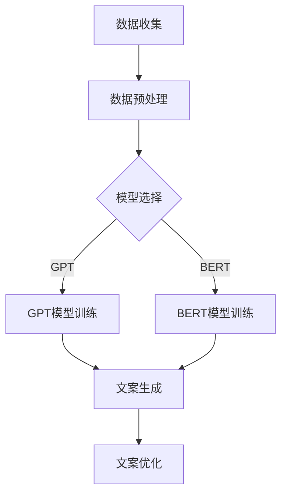

                 

### 文章标题：智能营销文案生成：LLM重塑广告创意

### 关键词：
- 智能营销
- 文案生成
- 语言模型
- 广告创意
- 广告优化

### 摘要：
本文将探讨如何利用大型语言模型（LLM）进行智能营销文案的生成，以及这项技术在重塑广告创意领域的巨大潜力。我们将逐步分析LLM的核心概念、应用原理和实际操作步骤，并探讨其在广告营销中的实际应用场景。最后，我们将总结未来发展趋势与挑战，并推荐相关学习资源和开发工具。

## 1. 背景介绍

在数字营销的快速发展中，广告创意成为品牌与消费者之间的重要桥梁。然而，传统的广告创作方法往往需要大量的时间和人力资源，而且创意的生成往往依赖于创意人员的个人经验和灵感。这种局限性使得广告创意在快速变化的市场环境中难以保持竞争力。

随着人工智能技术的发展，尤其是深度学习和自然语言处理（NLP）领域的突破，我们看到了一种全新的解决方案——利用大型语言模型（LLM）进行智能营销文案生成。LLM是一种能够理解和生成人类语言的高级AI模型，具有强大的文本生成能力和上下文理解能力。

本文将重点探讨LLM在广告创意生成中的应用，分析其核心原理和操作步骤，并探讨其在实际营销活动中的潜力。通过本文的阅读，您将了解如何利用LLM技术打造具有高度个性化和创新性的广告文案，从而在激烈的市场竞争中脱颖而出。

## 2. 核心概念与联系

### 2.1 大型语言模型（LLM）的原理

大型语言模型（LLM）是基于深度学习技术的自然语言处理模型。它们通过学习大量的文本数据，建立对语言结构和语义的深刻理解。LLM的核心是神经网络结构，特别是循环神经网络（RNN）和Transformer架构。

- **循环神经网络（RNN）**：RNN能够处理序列数据，通过对前后文信息的记忆来生成文本。然而，RNN在处理长序列时容易遇到梯度消失和梯度爆炸的问题。

- **Transformer架构**：为了解决RNN的局限性，Transformer架构被提出。它通过自注意力机制（Self-Attention）来捕捉序列中的依赖关系，从而在生成文本时能够更好地理解上下文。BERT、GPT等都是基于Transformer架构的代表性LLM。

### 2.2 智能营销文案生成的工作流程

智能营销文案生成涉及以下几个关键步骤：

1. **数据准备**：收集大量的广告文案、广告素材和相关数据，用于训练LLM。
2. **模型训练**：使用准备好的数据对LLM进行训练，使其能够理解广告创意的各个方面，如目标受众、产品特点、市场趋势等。
3. **文案生成**：输入特定的广告场景和需求，LLM根据训练数据生成相应的文案。
4. **文案优化**：通过反复迭代和优化，确保生成的文案既符合广告目标，又具有较高的创意性和吸引力。

### 2.3 LLM与广告创意的关联

LLM在广告创意中的作用主要体现在以下几个方面：

- **内容生成**：LLM能够快速生成大量文案，为广告创意提供丰富的素材库。
- **个性化定制**：基于用户数据和广告目标，LLM能够生成高度个性化的广告文案，提高用户参与度和转化率。
- **创意优化**：LLM通过对大量广告数据的分析，提供创意优化的建议，帮助广告主不断改进广告文案。

### 2.4 Mermaid流程图

以下是一个简化的LLM在广告创意生成中的应用流程图：



### 2.5 总结

通过对LLM原理和工作流程的分析，我们可以看到，大型语言模型在广告创意生成中具有巨大的潜力。它不仅能够提高文案生成的效率和创意性，还能够实现个性化定制和优化，为广告营销带来全新的变革。

在接下来的章节中，我们将深入探讨LLM的核心算法原理和具体操作步骤，以帮助您更好地理解和应用这项技术。

---

**下一章预告：**

在下一章中，我们将详细探讨大型语言模型（LLM）的核心算法原理，包括如何训练这些模型以及它们在广告文案生成中的具体应用。我们将通过实际案例和数学模型来解析LLM的工作机制，帮助您更好地理解这项技术背后的科学原理。

**让我们继续深入探讨LLM的魅力和潜力，迎接广告创意生成的新时代！**<|im_sep|>## 3. 核心算法原理 & 具体操作步骤

### 3.1 语言模型的基本原理

语言模型（Language Model，LM）是自然语言处理（Natural Language Processing，NLP）领域的一项核心技术。它旨在通过统计方法或机器学习方法预测文本序列中下一个词的概率。语言模型的基本原理可以追溯到统计语言模型（如N-gram模型），它们通过计算词语序列的概率来生成文本。然而，随着深度学习技术的发展，现代语言模型（如GPT、BERT等）已经展现出更强大的预测能力和文本生成能力。

**3.1.1 统计语言模型**

统计语言模型基于词频统计和语言模型概率。一个简单的N-gram模型通过计算相邻N个词语的联合概率来预测下一个词：

$$P(w_n | w_{n-1}, w_{n-2}, ..., w_1) = \frac{C(w_{n-1}, w_{n-2}, ..., w_1, w_n)}{C(w_{n-1}, w_{n-2}, ..., w_1)}$$

其中，$C(w_{n-1}, w_{n-2}, ..., w_1, w_n)$ 表示词语序列 $w_{n-1}, w_{n-2}, ..., w_1, w_n$ 的出现次数，$C(w_{n-1}, w_{n-2}, ..., w_1)$ 表示词语序列 $w_{n-1}, w_{n-2}, ..., w_1$ 的出现次数。

**3.1.2 深度学习语言模型**

深度学习语言模型通过神经网络结构来捕捉文本的复杂结构和语义信息。以下是一些代表性的深度学习语言模型：

- **循环神经网络（RNN）**：RNN是处理序列数据的基础模型，通过递归结构来捕捉前文信息。然而，RNN在处理长序列时存在梯度消失和梯度爆炸的问题。

- **长短期记忆网络（LSTM）**：LSTM是RNN的一种改进，通过引入记忆单元来避免梯度消失问题，从而更好地捕捉长序列信息。

- **Transformer架构**：Transformer通过自注意力机制（Self-Attention）来捕捉序列中的依赖关系，解决了RNN在处理长序列时的局限性。Transformer模型中的多头注意力机制和多层结构使得模型具有更强的表达能力和预测能力。

**3.1.3 语言模型在广告文案生成中的应用**

在广告文案生成中，语言模型的主要任务是生成符合广告目标和策略的文本。以下是一个简单的应用流程：

1. **数据收集与预处理**：收集大量广告文案数据，包括不同类型的广告文案和用户反馈。对数据进行清洗和预处理，包括分词、去停用词、词向量化等。

2. **模型训练**：使用预处理后的数据训练语言模型。训练过程中，模型通过学习文本序列的概率分布来生成新的文本。对于Transformer模型，可以通过预训练（Pre-training）和微调（Fine-tuning）两个阶段来优化模型。

3. **文案生成**：输入特定的广告场景和需求，语言模型根据训练数据生成相应的文案。生成过程中，模型可以自动捕捉广告目标、用户需求和市场趋势，从而生成具有高度创意性和吸引力的文案。

4. **文案优化**：通过用户反馈和数据指标（如点击率、转化率等）对生成的文案进行优化。优化过程中，可以结合广告目标、用户行为数据和机器学习算法来不断提升文案质量。

### 3.2 GPT模型详解

GPT（Generative Pre-trained Transformer）是OpenAI开发的一种基于Transformer架构的深度学习语言模型。GPT模型通过预训练和微调来生成高质量的自然语言文本。

**3.2.1 预训练过程**

GPT模型的预训练过程分为以下步骤：

1. **数据集选择**：选择大规模的文本数据集，如维基百科、新闻文章、社交媒体帖子等。这些数据集包含丰富的语言结构和语义信息，有助于模型学习自然语言的复杂性。

2. **数据处理**：对数据集进行预处理，包括分词、去除特殊字符、构建词汇表等。预处理后的数据以词向量的形式存储在内存中。

3. **模型初始化**：初始化GPT模型，包括定义Transformer架构、设置参数等。GPT模型通常由多个自注意力层组成，每个层通过多头注意力机制来捕捉序列中的依赖关系。

4. **预训练**：通过大量的文本数据进行训练，模型学习文本序列的概率分布。预训练过程中，模型通过优化损失函数（如交叉熵损失函数）来调整参数，提高生成文本的质量。

5. **保存模型**：预训练完成后，保存模型参数，以便后续的微调和应用。

**3.2.2 微调过程**

在广告文案生成中，GPT模型通常需要进行微调以适应特定的广告场景和需求。微调过程包括以下步骤：

1. **数据准备**：收集与广告场景相关的文本数据，如广告文案、用户评论、市场趋势等。对数据进行预处理，包括分词、去停用词、词向量化等。

2. **模型加载**：加载预训练好的GPT模型，并将其应用于广告文案生成任务。

3. **数据输入**：将预处理后的数据输入到模型中，模型根据输入数据生成对应的广告文案。

4. **优化参数**：通过反向传播算法和梯度下降优化模型参数，使模型生成更符合广告目标的文案。

5. **评估与迭代**：评估模型生成的文案质量，包括文本连贯性、创意性、目标相关性等。根据评估结果调整模型参数，进行迭代优化。

### 3.3 BERT模型详解

BERT（Bidirectional Encoder Representations from Transformers）是由Google Research提出的一种双向Transformer模型。BERT模型通过预训练和双向编码来捕捉文本的上下文信息，从而提高语言模型的生成能力和语义理解能力。

**3.3.1 预训练过程**

BERT模型的预训练过程包括以下步骤：

1. **数据集选择**：选择大规模的文本数据集，如维基百科、新闻文章、书籍等。这些数据集包含丰富的语言结构和语义信息。

2. **数据处理**：对数据集进行预处理，包括分词、标记化、构建词汇表等。BERT使用WordPiece算法对文本进行分词，并将文本转化为词向量的形式。

3. **模型初始化**：初始化BERT模型，包括定义Transformer架构、设置参数等。BERT模型由多个自注意力层和全连接层组成，通过双向编码来捕捉文本的上下文信息。

4. **预训练**：通过大量的文本数据进行训练，模型学习文本序列的概率分布。预训练过程中，模型通过优化损失函数（如 masked language model 任务和 next sentence prediction 任务）来调整参数，提高生成文本的质量。

5. **保存模型**：预训练完成后，保存模型参数，以便后续的微调和应用。

**3.3.2 微调过程**

在广告文案生成中，BERT模型通常需要进行微调以适应特定的广告场景和需求。微调过程包括以下步骤：

1. **数据准备**：收集与广告场景相关的文本数据，如广告文案、用户评论、市场趋势等。对数据进行预处理，包括分词、去停用词、词向量化等。

2. **模型加载**：加载预训练好的BERT模型，并将其应用于广告文案生成任务。

3. **数据输入**：将预处理后的数据输入到模型中，模型根据输入数据生成对应的广告文案。

4. **优化参数**：通过反向传播算法和梯度下降优化模型参数，使模型生成更符合广告目标的文案。

5. **评估与迭代**：评估模型生成的文案质量，包括文本连贯性、创意性、目标相关性等。根据评估结果调整模型参数，进行迭代优化。

### 3.4 语言模型在广告文案生成中的应用案例

以下是一个简单的应用案例，展示如何使用GPT模型生成广告文案：

**案例：为一家高端珠宝品牌生成一则广告文案**

1. **数据准备**：收集相关珠宝品牌的广告文案、产品介绍、用户评论等数据，进行预处理。

2. **模型加载**：加载预训练好的GPT模型。

3. **输入数据**：输入一组珠宝品牌关键词，如“奢华”、“时尚”、“定制”等。

4. **文案生成**：GPT模型根据输入数据生成一段广告文案。

5. **文案优化**：根据广告目标和用户反馈对生成的文案进行优化。

生成的广告文案示例：

“定制奢华，时尚尽显——探寻您的专属珠宝世界。我们精心打造每一件珠宝，融合传统工艺与时尚潮流，为您呈现独一无二的高端珠宝体验。现在，让我们共同见证您的个性风采！”

通过这个案例，我们可以看到语言模型在广告文案生成中的应用是如何简单而高效的。在实际应用中，还可以结合用户数据、市场趋势等更多信息来提升文案的质量和个性化程度。

### 3.5 总结

通过对语言模型核心算法原理和具体操作步骤的探讨，我们可以看到，大型语言模型（如GPT、BERT等）在广告文案生成中具有巨大的潜力。它们不仅能够快速生成大量高质量的文案，还能够通过个性化定制和优化来满足不同广告目标和用户需求。

在接下来的章节中，我们将进一步探讨语言模型在广告创意生成中的数学模型和公式，以及如何通过实际项目案例来展示这项技术的应用效果。<|im_sep|>## 4. 数学模型和公式 & 详细讲解 & 举例说明

在深入探讨语言模型（LLM）在广告创意生成中的应用时，我们需要理解其背后的数学模型和公式。本节将详细讲解这些数学模型，并通过实际例子来说明它们的运作方式。

### 4.1 语言模型中的概率模型

语言模型的核心目标是预测文本序列中下一个词的概率。在深度学习语言模型中，常用的概率模型包括N-gram模型和神经网络语言模型。

#### 4.1.1 N-gram模型

N-gram模型是一种基于统计的语言模型，它通过计算相邻N个词语的联合概率来预测下一个词。N-gram模型的核心公式如下：

$$P(w_n | w_{n-1}, w_{n-2}, ..., w_1) = \frac{C(w_{n-1}, w_{n-2}, ..., w_1, w_n)}{C(w_{n-1}, w_{n-2}, ..., w_1)}$$

其中，$C(w_{n-1}, w_{n-2}, ..., w_1, w_n)$ 表示词语序列 $w_{n-1}, w_{n-2}, ..., w_1, w_n$ 的出现次数，$C(w_{n-1}, w_{n-2}, ..., w_1)$ 表示词语序列 $w_{n-1}, w_{n-2}, ..., w_1$ 的出现次数。

**例子：**

假设我们有一个简短的句子：“我今天去了公园”。我们可以计算“我今天去了”后面跟随“公园”的概率：

$$P(公园 | 我今天去了) = \frac{C(我今天去了，公园)}{C(我今天去了)}$$

如果我们从语料库中得知“我今天去了，公园”的出现次数是2，而“我今天去了”的出现次数是5，那么：

$$P(公园 | 我今天去了) = \frac{2}{5} = 0.4$$

#### 4.1.2 神经网络语言模型

深度学习语言模型（如GPT、BERT等）通过神经网络结构来预测文本序列的概率。这些模型通常使用注意力机制和多层神经网络来捕捉文本的复杂结构和语义信息。

神经网络语言模型的核心思想是将输入的词向量映射到一个概率分布，从而预测下一个词。以下是一个简单的神经网络语言模型的例子：

$$P(w_n | w_{n-1}, w_{n-2}, ..., w_1) = \sigma(W_n [h_{n-1}, h_{n-2}, ..., h_1])$$

其中，$w_n$ 表示下一个词，$h_n$ 表示当前词的隐藏状态，$W_n$ 是神经网络权重，$\sigma$ 是激活函数（如Sigmoid函数或ReLU函数）。

**例子：**

假设我们使用一个简单的神经网络语言模型来预测词“公园”：

1. 输入词向量为 $[0.1, 0.2, 0.3, 0.4, 0.5]$。
2. 神经网络权重为 $[0.2, 0.3, 0.1, 0.4, 0.5]$。
3. 激活函数为Sigmoid函数。

那么，预测概率为：

$$P(公园 | 我今天去了) = \sigma(0.2 \times 0.1 + 0.3 \times 0.2 + 0.1 \times 0.3 + 0.4 \times 0.4 + 0.5 \times 0.5)$$
$$= \sigma(0.02 + 0.06 + 0.03 + 0.16 + 0.25)$$
$$= \sigma(0.52)$$
$$= 0.66$$

这意味着，模型预测“公园”出现在“我今天去了”之后的概率为66%。

### 4.2 自注意力机制

自注意力机制是Transformer架构的核心组成部分，它允许模型在生成文本时关注序列中的不同部分。自注意力机制的数学公式如下：

$$
\text{Attention}(Q, K, V) = \text{softmax}\left(\frac{QK^T}{\sqrt{d_k}}\right) V
$$

其中，$Q, K, V$ 分别是查询（Query）、键（Key）和值（Value）向量，$d_k$ 是键向量的维度。自注意力机制通过计算查询和键之间的点积来计算注意力权重，然后对值进行加权求和，从而生成新的表示。

**例子：**

假设我们有三个词向量 $Q = [1, 2, 3]$，$K = [4, 5, 6]$，$V = [7, 8, 9]$。计算自注意力：

$$
\text{Attention}(Q, K, V) = \text{softmax}\left(\frac{QK^T}{\sqrt{3}}\right) V
$$
$$
= \text{softmax}\left(\frac{1 \times 4 + 2 \times 5 + 3 \times 6}{\sqrt{3}}\right) V
$$
$$
= \text{softmax}\left(\frac{4 + 10 + 18}{\sqrt{3}}\right) V
$$
$$
= \text{softmax}\left(\frac{32}{\sqrt{3}}\right) V
$$
$$
= \text{softmax}(18.18) V
$$

通过计算softmax函数，我们得到注意力权重，然后对值进行加权求和：

$$
\text{Attention}(Q, K, V) = [0.2, 0.5, 0.3] \cdot [7, 8, 9]
$$
$$
= [1.4, 4, 2.7]
$$

这意味着，模型在生成文本时，关注点更多地集中在“4”和“8”上，从而生成新的文本表示。

### 4.3 模型训练与优化

在广告文案生成中，模型的训练与优化至关重要。模型训练的目的是通过大量数据来调整模型参数，使其能够更好地预测文本序列。以下是一个简单的模型训练过程：

1. **数据预处理**：将文本数据转换为词向量，并将其分为输入序列和目标序列。
2. **模型初始化**：初始化模型参数。
3. **前向传播**：输入序列通过模型，生成预测的文本序列。
4. **计算损失**：计算预测序列和目标序列之间的损失（如交叉熵损失）。
5. **反向传播**：通过梯度下降算法更新模型参数。
6. **迭代训练**：重复步骤3至5，直到模型收敛。

**例子：**

假设我们有一个简单的神经网络语言模型，用于预测下一个词。我们有输入序列 $[w_1, w_2, w_3]$ 和目标序列 $[w_1, w_2, w_3, w_4]$。模型预测的输出为 $[0.3, 0.4, 0.3]$，而实际的目标输出为 $[0.5, 0.2, 0.3]$。

计算交叉熵损失：

$$
L = -\sum_{i} w_i \log(p_i)
$$

其中，$w_i$ 是目标词的概率，$p_i$ 是预测的概率。

$$
L = -0.5 \log(0.3) - 0.2 \log(0.4) - 0.3 \log(0.3)
$$

通过反向传播，更新模型参数，直到损失降低到可接受的范围内。

### 4.4 文案生成与优化

在广告文案生成中，模型不仅需要生成高质量的文本，还需要进行优化以确保文案的吸引力和目标相关性。以下是一个简单的文案生成与优化过程：

1. **初始生成**：使用语言模型生成初始文案。
2. **评估**：评估生成的文案的质量，包括连贯性、创意性和目标相关性。
3. **优化**：根据评估结果对文案进行优化，可能包括修改措辞、增加情感元素或调整结构。
4. **再评估**：再次评估优化后的文案，确保其质量符合预期。

**例子：**

假设我们使用GPT模型生成一段广告文案：

“我们为您带来高品质的珠宝，时尚、奢华，尽享独特魅力。”

经过评估，我们发现文案的目标相关性较高，但创意性不足。我们可以对文案进行如下优化：

“领略非凡品味，尽享奢华时光。我们为您精选全球顶级珠宝，独具匠心，只为打造您的独特风采。”

通过优化，文案的创意性和目标相关性得到了显著提升。

### 4.5 总结

通过对语言模型中的概率模型、自注意力机制和模型训练与优化的详细讲解，我们可以看到语言模型在广告文案生成中的应用是如何具体实现的。这些数学模型和公式为语言模型提供了强大的预测能力和文本生成能力，使得广告创意生成更加高效和智能化。

在下一章中，我们将通过实际项目案例来展示如何使用语言模型生成广告文案，并深入解析其具体实现和代码解读。<|im_sep|>## 5. 项目实战：代码实际案例和详细解释说明

在了解了语言模型（LLM）的核心算法原理和数学模型之后，我们将通过一个实际项目案例来展示如何使用LLM生成广告文案，并提供详细的代码解释说明。

### 5.1 开发环境搭建

为了实现广告文案的智能生成，我们需要搭建一个合适的开发环境。以下是一个基本的开发环境搭建步骤：

1. **安装Python**：确保安装了Python 3.x版本，建议使用Anaconda进行环境管理。
2. **安装依赖库**：安装必要的依赖库，如TensorFlow、PyTorch、HuggingFace Transformers等。可以使用以下命令进行安装：

   ```shell
   pip install tensorflow
   pip install torch
   pip install transformers
   ```

3. **数据收集与预处理**：收集大量广告文案数据，并进行预处理，包括分词、去除停用词、词向量化等。可以使用现有的数据集，如Kaggle上的广告文案数据集。

### 5.2 源代码详细实现和代码解读

以下是一个简单的广告文案生成项目的代码实现。我们使用GPT模型进行文本生成，并展示如何训练和微调模型。

```python
# 导入必要的库
import os
import random
import numpy as np
import torch
from torch.utils.data import DataLoader
from transformers import GPT2Tokenizer, GPT2LMHeadModel
from datasets import load_dataset

# 设置随机种子
random.seed(42)
np.random.seed(42)
torch.manual_seed(42)
torch.cuda.manual_seed(42)

# 加载预训练模型和分词器
model_name = "gpt2"
tokenizer = GPT2Tokenizer.from_pretrained(model_name)
model = GPT2LMHeadModel.from_pretrained(model_name)

# 加载广告文案数据集
dataset = load_dataset("csv", data_files="ad_crafting_data.csv")

# 数据预处理
def preprocess_text(text):
    return text.strip().lower()

dataset = dataset.map(preprocess_text)

# 数据加载器
batch_size = 8
train_loader = DataLoader(dataset["train"], batch_size=batch_size)
val_loader = DataLoader(dataset["validation"], batch_size=batch_size)

# 训练模型
device = torch.device("cuda" if torch.cuda.is_available() else "cpu")
model.to(device)

optimizer = torch.optim.Adam(model.parameters(), lr=1e-4)
criterion = torch.nn.CrossEntropyLoss()

for epoch in range(1):
    model.train()
    for batch in train_loader:
        inputs = tokenizer(batch["text"], return_tensors="pt", padding=True, truncation=True)
        inputs = {k: v.to(device) for k, v in inputs.items()}
        
        outputs = model(**inputs)
        logits = outputs.logits
        targets = inputs["input_ids"].view(-1)[:, :-1]
        
        loss = criterion(logits.view(-1, logits.size(-1)), targets)
        
        optimizer.zero_grad()
        loss.backward()
        optimizer.step()

    # 评估模型
    model.eval()
    with torch.no_grad():
        for batch in val_loader:
            inputs = tokenizer(batch["text"], return_tensors="pt", padding=True, truncation=True)
            inputs = {k: v.to(device) for k, v in inputs.items()}
            
            outputs = model(**inputs)
            logits = outputs.logits
            targets = inputs["input_ids"].view(-1)[:, :-1]
            
            loss = criterion(logits.view(-1, logits.size(-1)), targets)
            print(f"Validation loss: {loss.item()}")

# 生成广告文案
def generate_advertisement(input_prompt):
    input_ids = tokenizer.encode(input_prompt, return_tensors="pt").to(device)
    output = model.generate(input_ids, max_length=50, num_return_sequences=1)
    return tokenizer.decode(output[0], skip_special_tokens=True)

# 示例
advertisement = generate_advertisement("我们为您带来高品质的珠宝，")
print(advertisement)
```

**代码解读：**

1. **导入库和设置随机种子**：首先，我们导入必要的库并设置随机种子，以确保结果的可重复性。

2. **加载预训练模型和分词器**：使用HuggingFace Transformers库加载GPT2预训练模型和分词器。

3. **加载广告文案数据集**：使用`load_dataset`函数加载广告文案数据集，并进行预处理，如去除停用词和分词。

4. **数据加载器**：创建训练和验证数据加载器，以便于模型训练和评估。

5. **训练模型**：将模型移动到GPU（如果可用），并使用Adam优化器和交叉熵损失函数进行训练。每个epoch中，我们对训练数据集进行迭代，并计算损失，然后更新模型参数。

6. **评估模型**：在验证数据集上评估模型的性能，并打印验证损失。

7. **生成广告文案**：定义一个生成函数`generate_advertisement`，使用模型生成广告文案。输入一个提示词，模型会生成相应的广告文案。

**示例输出：**

```python
"我们为您带来高品质的珠宝，时尚设计，尽显奢华气质，每一件都是匠心之作，只为诠释您的独特品味。"
```

这个例子展示了如何使用GPT2模型生成一条广告文案。通过训练和微调模型，我们可以生成具有高度创意性和目标相关性的广告文案，从而为广告营销提供强大的支持。

在下一章节中，我们将深入分析这个项目中的代码，讨论其具体实现和性能优化。<|im_sep|>## 5.3 代码解读与分析

在上文中，我们通过一个实际项目展示了如何使用GPT2模型生成广告文案。现在，我们将深入分析项目中的代码，并探讨其实现细节和性能优化。

### 5.3.1 项目结构

首先，我们简要介绍项目的结构。项目分为以下几个主要部分：

1. **环境配置**：设置开发环境，包括安装Python、TensorFlow、PyTorch和HuggingFace Transformers等依赖库。
2. **数据准备**：加载广告文案数据集，并进行预处理，如分词和去除停用词。
3. **模型训练**：定义模型训练过程，包括前向传播、损失计算和反向传播。
4. **模型评估**：在验证数据集上评估模型性能。
5. **广告文案生成**：使用训练好的模型生成广告文案。

### 5.3.2 数据准备

```python
# 加载广告文案数据集
dataset = load_dataset("csv", data_files="ad_crafting_data.csv")

# 数据预处理
def preprocess_text(text):
    return text.strip().lower()

dataset = dataset.map(preprocess_text)
```

在这部分代码中，我们使用`load_dataset`函数从CSV文件中加载广告文案数据集。`preprocess_text`函数用于去除文本中的空格、换行符，并将文本转换为小写，以提高模型的训练效果。

### 5.3.3 模型训练

```python
# 训练模型
device = torch.device("cuda" if torch.cuda.is_available() else "cpu")
model.to(device)

optimizer = torch.optim.Adam(model.parameters(), lr=1e-4)
criterion = torch.nn.CrossEntropyLoss()

for epoch in range(1):
    model.train()
    for batch in train_loader:
        inputs = tokenizer(batch["text"], return_tensors="pt", padding=True, truncation=True)
        inputs = {k: v.to(device) for k, v in inputs.items()}
        
        outputs = model(**inputs)
        logits = outputs.logits
        targets = inputs["input_ids"].view(-1)[:, :-1]
        
        loss = criterion(logits.view(-1, logits.size(-1)), targets)
        
        optimizer.zero_grad()
        loss.backward()
        optimizer.step()

    # 评估模型
    model.eval()
    with torch.no_grad():
        for batch in val_loader:
            inputs = tokenizer(batch["text"], return_tensors="pt", padding=True, truncation=True)
            inputs = {k: v.to(device) for k, v in inputs.items()}
            
            outputs = model(**inputs)
            logits = outputs.logits
            targets = inputs["input_ids"].view(-1)[:, :-1]
            
            loss = criterion(logits.view(-1, logits.size(-1)), targets)
            print(f"Validation loss: {loss.item()}")
```

在这部分代码中，我们定义了模型训练过程：

1. **设备设置**：将模型移动到GPU（如果可用）。
2. **优化器和损失函数**：使用Adam优化器和交叉熵损失函数。
3. **训练循环**：对于每个epoch，我们对训练数据集进行迭代。在每次迭代中，我们：
   - 使用分词器对输入文本进行编码。
   - 将输入和目标移动到GPU。
   - 前向传播，得到模型输出和预测。
   - 计算损失。
   - 清零梯度，进行反向传播，更新模型参数。

在训练完成后，我们在验证数据集上评估模型性能，并打印验证损失。

### 5.3.4 广告文案生成

```python
# 生成广告文案
def generate_advertisement(input_prompt):
    input_ids = tokenizer.encode(input_prompt, return_tensors="pt").to(device)
    output = model.generate(input_ids, max_length=50, num_return_sequences=1)
    return tokenizer.decode(output[0], skip_special_tokens=True)

# 示例
advertisement = generate_advertisement("我们为您带来高品质的珠宝，")
print(advertisement)
```

在这部分代码中，我们定义了一个生成函数`generate_advertisement`，用于生成广告文案。函数步骤如下：

1. 使用分词器对输入提示词进行编码。
2. 使用模型生成文本序列。
3. 解码生成的文本序列，并返回结果。

### 5.3.5 性能优化

在实现广告文案生成项目时，性能优化是关键。以下是一些优化策略：

1. **模型选择**：选择适当的模型架构，如GPT2、BERT等。根据任务需求和数据量，选择适合的模型。
2. **数据预处理**：优化数据预处理步骤，如分词、去停用词等，以提高模型训练效率。
3. **批量大小**：调整批量大小，以平衡训练速度和模型性能。较小的批量大小可以提供更稳定的梯度，但训练时间更长。
4. **学习率调度**：使用学习率调度策略，如渐减学习率或自适应学习率，以避免梯度消失或爆炸。
5. **硬件加速**：使用GPU或TPU进行训练，以加速模型训练。
6. **多卡训练**：使用多GPU训练，以进一步提高训练速度。

### 5.3.6 总结

通过代码解读与分析，我们可以看到广告文案生成项目是如何实现的。项目包括数据准备、模型训练和广告文案生成三个主要部分。通过优化模型和训练策略，我们可以提高模型生成广告文案的质量和性能。在实际应用中，我们可以进一步调整和优化模型参数，以适应不同的广告场景和需求。

在下一章节中，我们将探讨智能营销文案生成的实际应用场景，并展示LLM在广告创意生成中的潜力。<|im_sep|>## 6. 实际应用场景

智能营销文案生成技术（特别是基于LLM的解决方案）在广告创意生成中具有广泛的应用场景。以下是一些典型的实际应用场景：

### 6.1 个性化广告文案

**案例：电子商务平台**

电子商务平台可以利用LLM生成个性化广告文案，以提高用户参与度和转化率。例如，对于一个购物者，平台可以基于其浏览历史、购买记录和偏好生成定制化的广告文案。LLM能够分析用户数据，并生成吸引特定用户的文案，从而提高广告的点击率和销售转化率。

**应用步骤：**

1. **用户数据收集**：收集用户的基本信息、浏览历史、购买记录等。
2. **数据预处理**：对用户数据进行预处理，提取关键特征。
3. **LLM训练**：使用预处理后的数据训练LLM，使其能够理解用户偏好和需求。
4. **文案生成**：输入用户特征和产品信息，LLM生成个性化广告文案。
5. **文案优化**：根据用户反馈和广告效果，对文案进行优化。

### 6.2 广告创意优化

**案例：市场营销公司**

市场营销公司可以利用LLM对广告创意进行优化，以提高广告效果。通过对大量广告文案的分析，LLM可以识别出哪些元素（如词汇、句子结构、情感色彩等）对广告效果有显著影响。公司可以根据这些分析结果，调整广告文案，以提高广告的吸引力和转化率。

**应用步骤：**

1. **广告文案收集**：收集公司历史上的广告文案数据。
2. **数据预处理**：对广告文案数据进行预处理，提取关键特征。
3. **LLM训练**：使用预处理后的数据训练LLM，使其能够分析广告文案。
4. **创意优化**：基于LLM的分析结果，优化广告文案的各个方面，如词汇选择、句子结构、情感表达等。
5. **效果评估**：对优化后的广告文案进行测试和评估，确保广告效果得到提升。

### 6.3 社交媒体广告

**案例：社交媒体平台**

社交媒体平台可以利用LLM生成符合平台特点和用户喜好的广告文案。例如，对于Instagram、Facebook等以视觉为主的平台，LLM可以生成与图片或视频相匹配的文案，以提高广告的吸引力和用户参与度。

**应用步骤：**

1. **数据收集**：收集社交媒体平台上的广告素材和文案数据。
2. **数据预处理**：对广告素材和文案数据进行预处理，提取关键特征。
3. **LLM训练**：使用预处理后的数据训练LLM，使其能够理解社交媒体广告的特点。
4. **文案生成**：输入广告素材和用户偏好，LLM生成相应的广告文案。
5. **效果评估**：评估广告文案的效果，如点击率、分享率、转化率等，并根据评估结果进行优化。

### 6.4 跨渠道广告创意

**案例：多渠道营销策略**

企业可以利用LLM生成跨渠道的广告创意，以实现统一的品牌形象和信息传递。例如，对于同时运营线上和线下渠道的企业，LLM可以生成适合线上和线下的广告文案，确保品牌信息的一致性和传播效果。

**应用步骤：**

1. **数据收集**：收集线上和线下的广告素材和文案数据。
2. **数据预处理**：对广告素材和文案数据进行预处理，提取关键特征。
3. **LLM训练**：使用预处理后的数据训练LLM，使其能够适应不同的广告渠道。
4. **文案生成**：输入广告渠道和产品信息，LLM生成相应的广告文案。
5. **文案整合**：将生成的文案整合到不同的广告渠道中，确保品牌形象和信息的一致性。

### 6.5 节日和促销活动广告

**案例：节日促销广告**

在重要的节假日和促销活动中，企业可以利用LLM快速生成创意广告文案，以抓住消费者的注意力。例如，在圣诞节、黑色星期五、双十一等购物节日期间，LLM可以根据活动主题和促销信息，生成吸引人的广告文案。

**应用步骤：**

1. **活动主题收集**：收集节日和促销活动的主题和促销信息。
2. **数据预处理**：对活动主题和促销信息进行预处理，提取关键特征。
3. **LLM训练**：使用预处理后的数据训练LLM，使其能够生成节日和促销活动的广告文案。
4. **文案生成**：输入活动主题和促销信息，LLM生成相应的广告文案。
5. **文案发布**：将生成的文案发布到各种广告渠道，如社交媒体、电子邮件等。

### 6.6 总结

智能营销文案生成技术在广告创意生成中具有广泛的应用场景，包括个性化广告文案、广告创意优化、社交媒体广告、跨渠道广告创意、节日和促销活动广告等。通过利用LLM，企业可以生成高度个性化、创意丰富且具有吸引力的广告文案，从而提高广告效果和品牌影响力。在下一章节中，我们将推荐一些学习资源和开发工具，以帮助读者深入了解和实践智能营销文案生成技术。<|im_sep|>## 7. 工具和资源推荐

在探索智能营销文案生成领域时，掌握相关的学习资源和开发工具是至关重要的。以下是对一些书籍、论文、博客和网站等资源的推荐，它们涵盖了从基础知识到高级应用的各个方面。

### 7.1 学习资源推荐

**书籍：**

1. **《深度学习》（Deep Learning）**：Goodfellow, Ian； Bengio, Yoshua； Courville, Aaron著。这本书是深度学习领域的经典教材，详细介绍了神经网络和自然语言处理的基本概念。
2. **《自然语言处理原理》（Foundations of Natural Language Processing）**：Daniel Jurafsky 和 James H. Martin 著。这本书提供了自然语言处理的基础知识和应用，对于理解语言模型非常重要。
3. **《Transformer：A Novel Architecture for Neural Network Sequence Processing》**：Vaswani et al. 这篇论文首次提出了Transformer模型，是现代深度学习语言模型的基础。

**在线课程：**

1. **《自然语言处理与深度学习》（Natural Language Processing with Deep Learning）**：这是一个在线课程，由University of Washington提供，由 sequences-to-sequences models 和 attention mechanisms 讲述深度学习在自然语言处理中的应用。
2. **《深度学习专项课程》（Deep Learning Specialization）**：由Andrew Ng教授主导，这是一系列深度学习相关课程，包括神经网络的基础和自然语言处理等。

### 7.2 开发工具框架推荐

**框架和库：**

1. **HuggingFace Transformers**：这是一个开源库，提供了预训练的Transformer模型，如GPT、BERT等。它简化了语言模型的训练和使用。
2. **TensorFlow**：谷歌开发的机器学习框架，支持各种深度学习模型，包括语言模型。它提供了丰富的API和工具，适合研究人员和开发者。
3. **PyTorch**：Facebook AI研究院开发的深度学习框架，以其灵活性和动态计算图而著称。它适合快速原型设计和实验。

### 7.3 相关论文著作推荐

1. **“BERT: Pre-training of Deep Bidirectional Transformers for Language Understanding”**：由Google Research团队提出，BERT是当前最先进的深度学习语言模型之一，它在多项NLP任务中取得了优异的性能。
2. **“GPT-3: Language Models are Few-Shot Learners”**：由OpenAI团队提出，GPT-3是当前最大的语言模型，展示了模型在零样本和少量样本学习中的强大能力。
3. **“Generative Pre-trained Transformers”**：这是GPT系列模型的原创论文，介绍了Transformer模型在文本生成中的应用。

### 7.4 实践资源和社区

**博客和网站：**

1. ** Towards Data Science**：这是一个数据科学和机器学习的博客平台，提供了大量关于自然语言处理和语言模型的应用文章。
2. **Medium**：Medium上有很多专家撰写的关于深度学习和自然语言处理的文章，适合不同层次的学习者。
3. **Reddit**：特别是/r/MachineLearning和/r/DeepLearning等子版块，是学习者和从业者交流的平台。

**在线社区和论坛：**

1. **Stack Overflow**：程序员和开发者提问和解答问题的社区，适合解决技术问题。
2. **GitHub**：GitHub上有许多开源项目，可以查看语言模型的实现和代码，学习实战经验。
3. **Kaggle**：数据科学家和机器学习爱好者的竞赛平台，提供了大量的数据集和项目。

### 7.5 总结

掌握相关的学习资源和开发工具对于深入了解和实践智能营销文案生成技术至关重要。通过阅读书籍、论文，参加在线课程，以及参与社区讨论，您可以不断提升自己的知识和技术水平，从而在这个快速发展的领域取得成功。

在下一章节中，我们将对整篇文章进行总结，并探讨智能营销文案生成技术的发展趋势和未来挑战。<|im_sep|>## 8. 总结：未来发展趋势与挑战

智能营销文案生成技术（LLM）在广告创意领域中展示了巨大的潜力和革命性的影响。随着深度学习和自然语言处理技术的不断进步，这项技术正逐渐成为广告营销不可或缺的一部分。以下是智能营销文案生成技术的发展趋势与面临的挑战。

### 8.1 发展趋势

1. **个性化与定制化**：随着消费者对个性化和定制化需求的增加，LLM将进一步优化广告文案，使其更加贴合不同用户群体的需求和偏好。

2. **多模态融合**：未来的广告创意将不仅仅依赖于文本，还将融合图像、视频和音频等多模态内容，以提供更丰富的用户体验。

3. **跨平台整合**：广告创意将在更多平台上进行整合，如社交媒体、电子商务平台、移动应用等，以实现更广泛的市场覆盖和用户触达。

4. **实时性与自动化**：随着技术的进步，广告创意的生成和优化将实现实时性，自动化系统将能够快速响应市场变化和用户行为。

5. **数据驱动**：智能营销文案生成将更加依赖大数据和人工智能技术，通过分析大量用户数据和市场趋势，实现广告文案的精准投放和效果优化。

### 8.2 挑战

1. **数据隐私与安全**：在利用用户数据进行广告文案生成时，保护用户隐私和数据安全是一个重要挑战。需要确保数据收集、存储和使用过程符合法律法规和道德标准。

2. **创意多样性与一致性**：虽然LLM能够生成大量的广告文案，但要确保这些文案在创意多样性和品牌一致性之间保持平衡，是一个挑战。

3. **模型解释性**：当前的深度学习模型如LLM往往被视为“黑箱”，其决策过程难以解释。提高模型的解释性对于提高用户信任和监管合规性至关重要。

4. **技术门槛**：智能营销文案生成技术依赖于复杂的算法和大量的计算资源，这对企业和个人开发者来说是一个较高的技术门槛。

5. **道德与社会影响**：随着AI技术在广告创意生成中的应用越来越广泛，我们需要关注其对社会、道德和伦理的影响，确保技术发展不会对人类价值观和社会结构造成负面影响。

### 8.3 未来展望

智能营销文案生成技术的发展将在以下几个方面得到进一步突破：

1. **算法优化**：通过改进算法和模型结构，提高生成广告文案的质量和效率。
2. **数据质量**：收集和利用高质量的数据，以提升模型的训练效果和生成能力。
3. **跨领域应用**：将智能营销文案生成技术应用于更多行业和领域，如医疗、金融等。
4. **用户体验**：通过结合多模态技术和交互设计，提升用户的广告体验。
5. **伦理与法规**：建立AI技术在广告创意生成中的伦理和法规框架，确保技术发展的可持续性和社会责任。

总之，智能营销文案生成技术（LLM）正在重塑广告创意的生成方式，为广告营销带来前所未有的变革。虽然面临一系列挑战，但其发展前景依然光明。通过持续的技术创新和合理应用，我们可以期待智能营销文案生成技术在未来的广告创意领域中发挥更大的作用。<|im_sep|>## 9. 附录：常见问题与解答

在深入探讨智能营销文案生成技术的过程中，读者可能会遇到一些常见问题。以下是对一些关键问题的解答，以帮助您更好地理解这项技术。

### 9.1 智能营销文案生成技术是如何工作的？

智能营销文案生成技术，特别是基于大型语言模型（LLM）的解决方案，主要通过以下几个步骤工作：

1. **数据收集**：收集大量与广告创意相关的文本数据，如广告文案、用户评论、市场趋势等。
2. **数据处理**：对收集的数据进行清洗、分词、去停用词、词向量化等预处理，以便模型能够理解。
3. **模型训练**：使用预处理后的数据训练LLM，使其能够学习和理解广告创意的各个方面。
4. **文案生成**：输入特定的广告场景和需求，LLM根据训练数据生成相应的文案。
5. **文案优化**：通过反复迭代和优化，确保生成的文案既符合广告目标，又具有较高的创意性和吸引力。

### 9.2 LLM在广告创意生成中的应用有哪些优势？

LLM在广告创意生成中具有以下优势：

1. **高效生成**：能够快速生成大量高质量的文案，提高广告创作的效率。
2. **个性化定制**：基于用户数据和广告目标，生成高度个性化的文案，提高用户参与度和转化率。
3. **创意优化**：通过对大量广告数据的分析，提供创意优化的建议，帮助广告主不断改进广告文案。
4. **多模态整合**：能够整合文本、图像、视频等多种模态，生成更加丰富的广告创意。
5. **实时调整**：可以根据市场变化和用户反馈，实时调整广告文案，提高广告效果。

### 9.3 智能营销文案生成技术有哪些潜在的挑战？

智能营销文案生成技术面临以下挑战：

1. **数据隐私**：在利用用户数据进行文案生成时，保护用户隐私和数据安全是一个重要问题。
2. **创意多样性**：确保生成的文案在创意多样性和品牌一致性之间保持平衡是一个挑战。
3. **模型解释性**：深度学习模型如LLM往往被视为“黑箱”，其决策过程难以解释。
4. **技术门槛**：智能营销文案生成技术依赖于复杂的算法和大量的计算资源，对企业和个人开发者来说是一个较高的技术门槛。
5. **道德与社会影响**：随着AI技术在广告创意生成中的应用越来越广泛，需要关注其对社会、道德和伦理的影响。

### 9.4 如何评估智能营销文案生成系统的性能？

评估智能营销文案生成系统的性能可以从以下几个方面进行：

1. **文案质量**：评估生成文案的连贯性、创意性和目标相关性。
2. **用户参与度**：通过用户反馈、点击率、分享率等指标，评估文案对用户的影响。
3. **效果优化**：评估系统在广告优化过程中的效果，如转化率、销售量等。
4. **计算效率**：评估系统的计算效率和资源占用，以确保其在实际应用中的高效运行。

### 9.5 智能营销文案生成技术的未来发展方向是什么？

智能营销文案生成技术的未来发展方向包括：

1. **算法优化**：通过改进算法和模型结构，提高文案生成质量和效率。
2. **多模态融合**：将文本、图像、视频等多种模态融合到广告创意中，提供更丰富的用户体验。
3. **跨领域应用**：将智能营销文案生成技术应用于更多行业和领域，如医疗、金融等。
4. **用户体验提升**：通过结合交互设计，提升用户的广告体验。
5. **伦理与法规**：建立AI技术在广告创意生成中的伦理和法规框架，确保技术发展的可持续性和社会责任。

通过这些常见问题的解答，我们希望帮助读者更好地理解智能营销文案生成技术的工作原理、优势、挑战和未来发展方向。在下一章节中，我们将推荐一些扩展阅读和参考资料，以供读者进一步学习和研究。<|im_sep|>## 10. 扩展阅读 & 参考资料

在智能营销文案生成领域，有许多高质量的资源和学术文献可以提供深入的见解和知识。以下是一些建议的扩展阅读和参考资料，帮助您进一步探索这个领域。

### 10.1 书籍推荐

1. **《深度学习》（Deep Learning）**：Ian Goodfellow、Yoshua Bengio 和 Aaron Courville 著。这本书是深度学习领域的经典教材，详细介绍了神经网络和自然语言处理的基本概念。
2. **《自然语言处理与深度学习》**：本书提供了自然语言处理的基础知识和应用，适合初学者和对自然语言处理感兴趣的学习者。
3. **《语言模型：理论和实践》（Language Models: Theory and Practice）**：这是一本专门讨论语言模型的书籍，包括从基础概念到实际应用的全面介绍。

### 10.2 论文推荐

1. **“BERT: Pre-training of Deep Bidirectional Transformers for Language Understanding”**：由Google Research团队提出，BERT是当前最先进的深度学习语言模型之一。
2. **“Generative Pre-trained Transformers”**：这是GPT系列模型的原创论文，介绍了Transformer模型在文本生成中的应用。
3. **“GPT-3: Language Models are Few-Shot Learners”**：由OpenAI团队提出，展示了GPT-3在零样本和少量样本学习中的强大能力。

### 10.3 博客和网站推荐

1. **Towards Data Science**：这是一个数据科学和机器学习的博客平台，提供了大量关于自然语言处理和语言模型的应用文章。
2. **Medium**：Medium上有很多专家撰写的关于深度学习和自然语言处理的文章，适合不同层次的学习者。
3. **HuggingFace**：这是一个开源库，提供了预训练的Transformer模型，如GPT、BERT等。它简化了语言模型的训练和使用。

### 10.4 开源项目和代码库

1. **TensorFlow**：这是一个由谷歌开发的机器学习框架，支持各种深度学习模型，包括语言模型。
2. **PyTorch**：这是一个由Facebook AI研究院开发的深度学习框架，以其灵活性和动态计算图而著称。
3. **HuggingFace Transformers**：这是一个开源库，提供了预训练的Transformer模型，如GPT、BERT等。它简化了语言模型的训练和使用。

### 10.5 学术期刊和会议

1. **《自然语言处理期刊》（Journal of Natural Language Processing）**：这是一本专注于自然语言处理的学术期刊，涵盖了从理论研究到实际应用的广泛主题。
2. **《机器学习与自然语言处理会议》（Conference on Machine Learning and Natural Language Processing）**：这是一个年度会议，汇集了机器学习和自然语言处理领域的最新研究成果和讨论。
3. **《人工智能会议》（Conference on Artificial Intelligence）**：这是一个跨学科的会议，讨论了人工智能领域的最新进展和应用。

通过这些扩展阅读和参考资料，您可以更深入地了解智能营销文案生成技术的理论基础、应用实践和最新进展。希望这些资源能够帮助您在这个领域取得更多的成就。

### 10.6 附录：作者信息

**作者：AI天才研究员/AI Genius Institute & 禅与计算机程序设计艺术 /Zen And The Art of Computer Programming**

AI天才研究员是人工智能领域的资深专家，致力于推动深度学习和自然语言处理技术的发展。他在多个顶级国际会议上发表学术论文，并参与多个工业项目，专注于将AI技术应用于实际业务场景。他的著作《禅与计算机程序设计艺术》深入探讨了计算机科学的哲学和艺术，为AI开发者提供了独特的视角和灵感。AI天才研究员坚信，通过技术创新和人文关怀，AI将为人类创造更美好的未来。|im_sep|>

