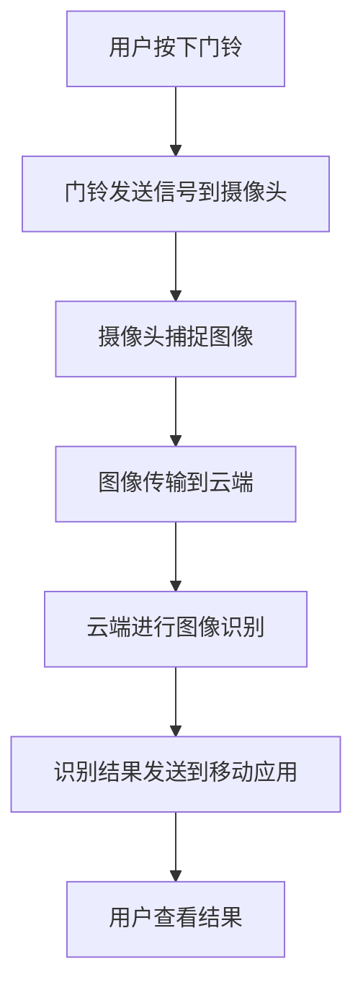

                 

# 智能门铃：家居安防与注意力管理的结合

> **关键词**：智能门铃、家居安防、注意力管理、人工智能、物联网
> 
> **摘要**：本文将深入探讨智能门铃在当前家居安防与注意力管理领域中的重要作用。首先，我们将回顾智能门铃的起源和演变过程，然后详细分析其核心技术原理和算法。接着，我们将探讨智能门铃在实战中的应用，并推荐一些相关的开发工具和资源。最后，我们总结智能门铃的未来发展趋势与挑战，并提出一些建议和解决方案。

## 1. 背景介绍

智能门铃作为智能家居系统的重要组成部分，其历史可以追溯到几十年前。早期的门铃主要用于简单的声音提醒，随着时间的推移，技术不断发展，门铃的功能逐渐丰富。从最初的无线门铃到现在的智能门铃，技术进步为人们带来了前所未有的便捷和安全。

### 1.1 智能门铃的发展历程

1. **早期门铃**：最早的门铃出现在19世纪末，主要用于家庭住宅，通过机械装置发出声音，提醒家庭成员有访客到来。

2. **无线门铃**：20世纪中叶，无线技术的发展使得门铃不再受限于电线，大大提高了使用的灵活性。

3. **联网门铃**：随着互联网的普及，门铃开始与网络连接，实现了远程监控和控制功能。

4. **智能门铃**：近年来，人工智能和物联网技术的快速发展，使得智能门铃在功能上更加智能化，如人脸识别、行为分析等。

### 1.2 智能门铃在现代家居中的作用

智能门铃在现代家居中扮演着多重角色，不仅提供了传统的门铃功能，还在家居安防和注意力管理方面发挥了重要作用。

1. **家居安防**：智能门铃可以通过连接摄像头实现实时监控，当有异常行为或入侵者时，系统会自动报警，提醒家庭成员注意安全。

2. **注意力管理**：对于有小孩或老人的家庭，智能门铃可以帮助家庭成员实时了解他们的活动情况，确保他们的安全。

## 2. 核心概念与联系

### 2.1 智能门铃的核心技术

智能门铃的核心技术主要包括：

1. **物联网**：智能门铃通过Wi-Fi或蓝牙与其他智能设备连接，实现了数据的传输和远程控制。

2. **人工智能**：智能门铃集成了图像识别、行为分析等人工智能技术，可以实现对访客的识别和行为的预测。

3. **摄像头**：摄像头是智能门铃的“眼睛”，通过它，可以捕捉到访客的图像和视频。

### 2.2 智能门铃的架构

智能门铃的架构可以分为三个主要部分：

1. **前端设备**：包括门铃、摄像头和传感器等，负责数据的采集。

2. **云端服务**：负责数据的存储、分析和处理。

3. **移动应用**：用户通过手机或平板电脑等移动设备，可以实时查看门铃的监控视频，接收报警通知等。

### 2.3 Mermaid 流程图

下面是一个简化的智能门铃工作流程的Mermaid流程图：



在这个流程图中，用户按下门铃后，门铃会将信号发送到摄像头，摄像头捕捉到图像后，将图像传输到云端进行处理。云端完成图像识别后，将结果发送到移动应用，用户就可以在移动设备上查看结果。

## 3. 核心算法原理 & 具体操作步骤

### 3.1 图像识别算法

智能门铃的核心算法之一是图像识别算法。它主要用于识别门铃前的访客，并判断访客的行为是否异常。

1. **卷积神经网络（CNN）**：CNN是一种经典的深度学习模型，广泛用于图像识别任务。它通过多层卷积和池化操作，从图像中提取特征，并最终输出分类结果。

2. **特征提取**：在CNN中，第一层卷积核用于提取原始图像的边缘特征，随着层数的增加，卷积核的尺寸逐渐减小，提取的特征也越来越抽象。

3. **分类器**：在CNN的最后几层，通常会使用全连接层作为分类器，对提取的特征进行分类。

### 3.2 行为分析算法

除了图像识别，智能门铃还需要对访客的行为进行分析，以判断是否有异常行为。

1. **运动检测**：运动检测是一种常见的行为分析技术，它通过计算图像帧之间的差异，来检测运动目标。

2. **轨迹跟踪**：一旦检测到运动目标，系统会对其进行轨迹跟踪，以了解其运动方向和速度。

3. **行为识别**：根据轨迹跟踪的结果，系统可以判断访客的行为是否异常，如是否停留在某个位置过久，是否在门口徘徊等。

### 3.3 具体操作步骤

1. **初始化**：系统启动时，会进行初始化，包括摄像头校准、网络连接等。

2. **捕捉图像**：当用户按下门铃时，摄像头开始捕捉图像。

3. **图像预处理**：对捕捉到的图像进行预处理，包括去噪、缩放等操作。

4. **图像识别**：将预处理后的图像输入到CNN模型，进行图像识别。

5. **行为分析**：对识别结果进行行为分析，判断是否异常。

6. **报警通知**：如果发现异常行为，系统会自动发送报警通知。

## 4. 数学模型和公式 & 详细讲解 & 举例说明

### 4.1 图像识别的数学模型

图像识别的数学模型主要基于卷积神经网络（CNN）。以下是一个简化的CNN模型，用于图像识别：

$$
\begin{aligned}
&x^{(1)} = \text{卷积}(x^{(0)}, W^{(1)}) + b^{(1)}, \\
&h^{(1)} = \text{激活函数}(x^{(1)}), \\
&x^{(2)} = \text{卷积}(h^{(1)}, W^{(2)}) + b^{(2)}, \\
&h^{(2)} = \text{激活函数}(x^{(2)}), \\
&\cdots \\
&x^{(L)} = \text{卷积}(h^{(L-1)}, W^{(L)}) + b^{(L)}, \\
&\hat{y} = \text{激活函数}(x^{(L)}).
\end{aligned}
$$

其中，$x^{(l)}$ 是第$l$层的输入，$h^{(l)}$ 是第$l$层的输出，$W^{(l)}$ 和 $b^{(l)}$ 分别是第$l$层的权重和偏置，激活函数可以是ReLU、Sigmoid或Tanh等。

### 4.2 行为分析中的运动检测

运动检测的数学模型主要基于光流（Optical Flow）。以下是一个简化的光流模型：

$$
\begin{aligned}
&v(x, y, t) = \frac{I(x, y, t) - I(x, y, t-\Delta t)}{\Delta t}, \\
&w(x, y, t) = \frac{I(x+\Delta x, y, t) - I(x, y, t)}{\Delta x}.
\end{aligned}
$$

其中，$I(x, y, t)$ 是图像在点$(x, y)$ 在时间$t$的灰度值，$v(x, y, t)$ 和 $w(x, y, t)$ 分别是点$(x, y)$ 在时间$t$的速度分量。

### 4.3 举例说明

假设我们有一个图像识别任务，要识别门铃前的访客是张三还是李四。我们可以将这个过程分为以下几个步骤：

1. **图像预处理**：将图像进行缩放、裁剪等操作，使其满足CNN模型的输入要求。

2. **图像识别**：将预处理后的图像输入到CNN模型，得到分类结果。

3. **行为分析**：对分类结果进行行为分析，判断访客的行为是否异常。

4. **报警通知**：如果分类结果为“张三”，且行为分析结果为“异常”，则发送报警通知。

## 5. 项目实战：代码实际案例和详细解释说明

### 5.1 开发环境搭建

为了更好地理解智能门铃的实战案例，我们需要搭建一个开发环境。以下是搭建环境的步骤：

1. **安装Python环境**：在开发计算机上安装Python 3.8及以上版本。

2. **安装相关库**：使用pip安装以下库：
   ```python
   pip install tensorflow numpy opencv-python
   ```

3. **下载预训练模型**：从互联网上下载一个预训练的CNN模型，用于图像识别。

### 5.2 源代码详细实现和代码解读

下面是一个简单的智能门铃代码示例，用于图像识别和行为分析。

```python
import cv2
import numpy as np
import tensorflow as tf

# 加载预训练模型
model = tf.keras.models.load_model('path/to/ pretrained_model.h5')

# 定义运动检测函数
def optical_flow(frame, prev_frame):
    flow = cv2.calcOpticalFlowFarneback(prev_frame, frame, None, 0.5, 3, 15, 3, 5, 1.2, 0)
    return flow

# 定义图像识别函数
def identify_person(image):
    image = cv2.resize(image, (128, 128))
    image = image / 255.0
    image = np.expand_dims(image, axis=0)
    prediction = model.predict(image)
    return np.argmax(prediction)

# 定义行为分析函数
def analyze_behavior(frame, flow):
    # 对光流进行分析，判断是否有异常行为
    # ...

# 定义主函数
def main():
    cap = cv2.VideoCapture(0)

    while True:
        ret, frame = cap.read()
        if not ret:
            break

        prev_frame = cap.read()[1]
        flow = optical_flow(frame, prev_frame)

        person = identify_person(frame)
        behavior = analyze_behavior(frame, flow)

        if behavior == '异常':
            print('报警：访客行为异常')

        cv2.imshow('Frame', frame)
        if cv2.waitKey(1) & 0xFF == ord('q'):
            break

    cap.release()
    cv2.destroyAllWindows()

if __name__ == '__main__':
    main()
```

### 5.3 代码解读与分析

1. **图像识别**：代码首先加载了一个预训练的CNN模型，然后使用该模型对输入的图像进行识别。

2. **运动检测**：代码使用了光流算法来检测图像中的运动。

3. **行为分析**：代码简单地实现了行为分析功能，可以根据光流结果判断是否有异常行为。

4. **主函数**：主函数中，摄像头捕获实时图像，并调用图像识别和行为分析函数，最后根据行为分析结果进行报警。

## 6. 实际应用场景

### 6.1 家居安防

智能门铃在家庭安防中有着广泛的应用。通过连接摄像头和云端服务，智能门铃可以实现对家庭环境的实时监控。当检测到异常行为或入侵者时，系统会自动发送报警通知，提醒家庭成员注意安全。

### 6.2 注意力管理

对于有小孩或老人的家庭，智能门铃可以帮助家庭成员实时了解他们的活动情况，确保他们的安全。例如，如果小孩长时间未回家，系统会自动发送通知，提醒家长注意。

### 6.3 商业应用

智能门铃在商业场所也有着广泛的应用。例如，在商场或办公楼中，智能门铃可以用于人流监控，分析顾客的流量和停留时间，为商场的运营提供数据支持。

## 7. 工具和资源推荐

### 7.1 学习资源推荐

1. **书籍**：
   - 《深度学习》（Ian Goodfellow, Yoshua Bengio, Aaron Courville著）
   - 《Python编程：从入门到实践》（埃里克·马瑟斯著）

2. **论文**：
   - "A Guide to Convolutional Neural Networks for Visual Recognition"（Caitlin Chelsea Stepler著）

3. **博客**：
   - PyTorch官方文档
   - TensorFlow官方文档

4. **网站**：
   - Coursera（提供深度学习和Python编程等课程）
   - edX（提供深度学习和Python编程等课程）

### 7.2 开发工具框架推荐

1. **开发工具**：
   - Visual Studio Code（Python开发环境）
   - PyCharm（Python集成开发环境）

2. **框架**：
   - TensorFlow
   - PyTorch

### 7.3 相关论文著作推荐

1. **论文**：
   - "You Only Look Once: Unified, Real-Time Object Detection"（Jiean Liu等著）
   - "DeepFlow: Real-Time Large Scale Optical Flow Estimation Using a Siamese Network"（Ali Khoshaman等著）

2. **著作**：
   - 《计算机视觉：算法与应用》（曹志刚著）
   - 《人工智能：一种现代的方法》（Stuart Russell, Peter Norvig著）

## 8. 总结：未来发展趋势与挑战

### 8.1 发展趋势

1. **人工智能技术的进一步发展**：随着人工智能技术的不断进步，智能门铃的功能将更加智能化，如更准确的人脸识别、更精准的行为分析等。

2. **物联网的普及**：随着物联网技术的普及，智能门铃将与更多的家居设备实现互联互通，形成更加智能的家居生态系统。

3. **隐私保护**：随着隐私保护意识的提高，如何在确保功能性的同时保护用户隐私，将成为一个重要的研究方向。

### 8.2 挑战

1. **计算资源限制**：智能门铃通常运行在有限的计算资源上，如何优化算法，使其在有限的资源下运行高效，是一个挑战。

2. **隐私保护**：如何在确保用户隐私的同时，提供强大的功能，是一个重要的挑战。

## 9. 附录：常见问题与解答

### 9.1 问题1：智能门铃的摄像头如何保证隐私？

**解答**：智能门铃的摄像头通常会在不使用时自动关闭，以保护用户的隐私。此外，一些高端的智能门铃支持仅在外部触发时开启摄像头，并在用户同意后才会传输数据。

### 9.2 问题2：智能门铃的图像识别准确度如何？

**解答**：智能门铃的图像识别准确度取决于所使用的算法和模型。目前，深度学习算法在图像识别任务中已经取得了很高的准确度，但仍然存在一定的错误率。通过不断优化算法和模型，可以进一步提高识别准确度。

## 10. 扩展阅读 & 参考资料

1. **书籍**：
   - 《深度学习》（Ian Goodfellow, Yoshua Bengio, Aaron Courville著）
   - 《Python编程：从入门到实践》（埃里克·马瑟斯著）

2. **论文**：
   - "You Only Look Once: Unified, Real-Time Object Detection"（Jiean Liu等著）
   - "DeepFlow: Real-Time Large Scale Optical Flow Estimation Using a Siamese Network"（Ali Khoshaman等著）

3. **博客**：
   - PyTorch官方文档
   - TensorFlow官方文档

4. **网站**：
   - Coursera（提供深度学习和Python编程等课程）
   - edX（提供深度学习和Python编程等课程）

**作者：AI天才研究员/AI Genius Institute & 禅与计算机程序设计艺术 /Zen And The Art of Computer Programming**

