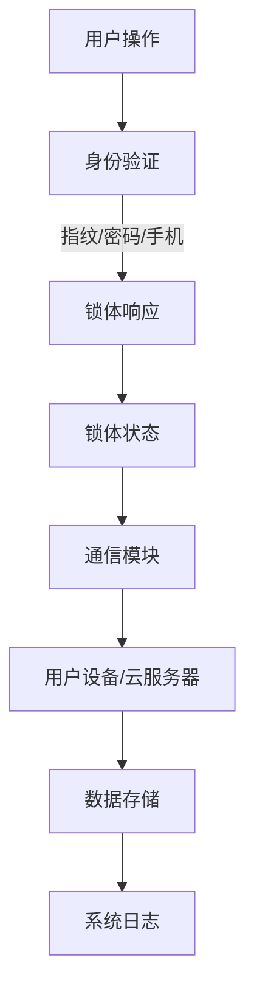

                 

# 智能门锁的安全管理与注意力经济

## 摘要

智能门锁作为智能家居的重要组成部分，其安全性和用户体验直接影响用户对其信任和依赖。本文将围绕智能门锁的安全管理与注意力经济展开讨论，首先介绍智能门锁的背景及其重要性，然后深入分析其安全管理的核心概念和原理，并探讨如何通过注意力经济提高智能门锁的安全性。文章将结合实际应用案例，详细阐述智能门锁的数学模型、算法原理和具体实现步骤，同时推荐相关工具和资源，以期为智能门锁领域的研究者与实践者提供有价值的参考。最后，文章将总结未来发展趋势与挑战，并展望智能门锁在安全性、用户便利性和注意力经济方面的潜在突破。

## 1. 背景介绍

智能门锁是一种基于现代通信技术和物联网技术的智能设备，它能够通过用户指纹、密码、智能手机或者其他智能设备进行身份验证，从而实现自动锁闭和解锁功能。随着物联网技术和智能家居的快速发展，智能门锁已逐渐成为家庭、酒店、办公室等场所的重要安全设施。

### 智能门锁的发展历程

智能门锁的发展可以追溯到20世纪90年代，当时主要是基于机械锁和电子锁的结合。早期的智能门锁主要依赖于RFID（射频识别）或者IC卡等物理介质进行身份验证。然而，这些早期的技术存在安全隐患，例如容易被复制、易受攻击等。

进入21世纪，随着生物识别技术的发展，基于指纹识别、人脸识别等生物特征的智能门锁开始逐渐普及。这些新型门锁不仅提高了安全性，而且用户使用更加方便。近年来，随着人工智能技术的进步，智能门锁在功能上也变得更加丰富，如通过语音识别、行为分析等手段实现个性化服务和安全预警。

### 智能门锁的市场现状

智能门锁市场近年来呈现出高速增长的态势。根据市场调研数据显示，全球智能门锁市场规模在2020年已达到20亿美元，预计到2025年将达到60亿美元。中国市场作为全球最大的智能家居市场，智能门锁的需求和安装量也在持续增长。

目前，智能门锁的主要应用场景包括家庭、酒店、办公室、公寓等。在家居领域，智能门锁可以提升家庭的安全性和便利性，减少传统钥匙丢失和被盗的风险。在酒店和公寓管理中，智能门锁可以实现无钥匙入住和退房，提高运营效率。办公室应用中，智能门锁可以限制员工访问特定区域，增强办公安全。

### 智能门锁的重要性和挑战

智能门锁的重要性和挑战主要体现在以下几个方面：

1. **安全性**：智能门锁的安全性直接关系到用户的财产和生命安全。传统的机械锁容易被撬开，而智能门锁通过生物识别、密码等多重验证方式，大大提高了安全性。

2. **用户体验**：智能门锁提供了更加便捷的使用体验。用户不再需要携带钥匙，可以通过手机、指纹等方式快速解锁门锁，提高了生活和工作效率。

3. **数据隐私**：智能门锁在使用过程中会收集用户的生物识别数据，这些数据的安全和隐私保护成为重要的挑战。如何确保这些数据不被非法获取和使用，是智能门锁需要解决的重要问题。

4. **网络连接**：智能门锁通常需要与互联网连接，以实现远程监控和控制功能。网络连接的安全性和稳定性成为影响用户体验的重要因素。

5. **成本效益**：虽然智能门锁在功能上具有明显优势，但其成本较高，如何在保证安全性的前提下降低成本，提高市场竞争力，是智能门锁需要面对的挑战。

## 2. 核心概念与联系

### 2.1 安全管理

智能门锁的安全管理包括硬件安全、软件安全、数据安全等多个方面。硬件安全主要涉及门锁的物理防护，如防止暴力破坏、防止复制等。软件安全则包括身份验证机制、加密算法等。数据安全主要关注用户数据的收集、存储、传输和销毁过程。

#### 2.1.1 硬件安全

- **物理防护**：智能门锁应具备抗暴力拆解能力，防止锁体被撬开或破坏。
- **锁芯防护**：锁芯应采用高强度材料，并具有防复制、防撬功能。
- **电源防护**：门锁应具备备用电池或应急供电方式，确保在停电情况下仍能正常使用。

#### 2.1.2 软件安全

- **身份验证**：智能门锁应采用多重身份验证机制，如指纹识别、密码、手机验证等，防止未授权访问。
- **加密算法**：门锁应采用高强度加密算法，如AES（高级加密标准），确保数据传输和存储的安全。
- **系统更新**：门锁应具备远程更新功能，定期更新固件，修复潜在的安全漏洞。

#### 2.1.3 数据安全

- **数据收集**：在收集用户数据时，应确保数据的最小化原则，只收集必要的数据。
- **数据存储**：用户数据应存储在加密的数据库中，确保数据在存储过程中的安全性。
- **数据传输**：数据在传输过程中应采用安全的通信协议，如TLS（传输层安全协议），防止数据被截获或篡改。
- **数据销毁**：用户数据在停止使用后，应进行彻底销毁，防止数据泄露。

### 2.2 注意力经济

注意力经济是指个体在信息过载的环境下，通过注意力分配策略来最大化收益的一种经济模式。在智能门锁领域，注意力经济主要体现在以下几个方面：

#### 2.2.1 用户注意力

- **用户引导**：通过设计简洁、直观的用户界面，引导用户快速学会使用智能门锁，降低用户的学习成本。
- **用户体验**：提高智能门锁的响应速度和可靠性，增强用户的满意度，提高用户粘性。
- **个性化服务**：根据用户习惯和使用数据，提供个性化的安全建议和服务，增强用户对智能门锁的信任。

#### 2.2.2 市场注意力

- **品牌宣传**：通过有效的市场推广和品牌建设，提高智能门锁的知名度和美誉度，吸引更多用户。
- **技术创新**：持续投入研发，推动智能门锁技术的创新，提高产品竞争力。
- **合作伙伴**：与相关企业和机构建立合作关系，共同开发智能门锁解决方案，扩大市场份额。

#### 2.2.3 社会注意力

- **安全宣传**：通过媒体宣传、教育活动等，提高公众对智能门锁安全性的认识，增强社会对智能门锁的信任。
- **社会责任**：积极参与社会公益活动，提升企业形象，增强社会责任感。
- **技术交流**：举办技术研讨会、论坛等活动，促进智能门锁领域的学术交流和技术创新。

### 2.3 智能门锁架构

智能门锁的架构通常包括以下几个方面：

#### 2.3.1 硬件层面

- **锁体**：智能门锁的核心部分，包括锁芯、电机、传感器等。
- **电池模块**：提供门锁的电力供应，包括内置电池或外接电源。
- **通信模块**：负责与用户设备或云服务器进行通信，通常采用Wi-Fi、蓝牙等无线通信技术。

#### 2.3.2 软件层面

- **操作系统**：门锁的操作系统负责管理硬件资源和应用程序。
- **应用程序**：门锁的应用程序负责实现具体的门锁功能，如身份验证、数据加密等。
- **通信协议**：门锁与用户设备或云服务器之间的通信协议，如TLS、HTTP等。

#### 2.3.3 数据层面

- **用户数据**：包括用户身份信息、访问记录等。
- **配置数据**：门锁的配置信息，如加密算法、用户权限等。
- **日志数据**：门锁运行过程中的日志记录，用于故障排查和安全审计。

### 2.4 Mermaid 流程图

以下是一个简化的智能门锁架构的Mermaid流程图：



在这个流程图中，用户通过指纹、密码或手机对门锁进行操作，门锁进行身份验证后响应锁体状态，并将相关信息发送到用户设备或云服务器，同时记录系统日志。

## 3. 核心算法原理 & 具体操作步骤

### 3.1 指纹识别算法

指纹识别是智能门锁最常用的身份验证方式之一，其核心算法是基于指纹图像的模体分析。

#### 3.1.1 指纹图像采集

- **光学指纹传感器**：通过光学反射原理采集指纹图像，适合日常使用。
- **电容指纹传感器**：通过指纹与电容之间的耦合采集指纹图像，适合嵌入式设备。

#### 3.1.2 指纹图像预处理

- **图像去噪**：去除图像中的噪声，提高指纹图像的质量。
- **图像增强**：增强指纹细节，提高识别率。

#### 3.1.3 模体提取

- **特征点定位**：在指纹图像中定位特征点，如脊线、谷点等。
- **模体生成**：通过特征点构建指纹模体，用于后续的匹配和识别。

#### 3.1.4 模体匹配

- **特征点匹配**：计算两个指纹模体特征点的匹配度。
- **模体分类**：根据匹配度将指纹模体分类，以确定用户身份。

### 3.2 密码验证算法

密码验证是另一种常见的身份验证方式，其核心算法主要包括哈希函数和密码存储。

#### 3.2.1 哈希函数

- **MD5**：将输入字符串计算成一个128位的散列值，但安全性较低，容易被破解。
- **SHA-256**：将输入字符串计算成一个256位的散列值，具有较高的安全性。

#### 3.2.2 密码存储

- **加密存储**：将用户密码通过哈希函数加密后存储，以防止明文密码泄露。
- **加盐哈希**：在哈希函数前添加随机盐值，提高密码的安全性。

#### 3.2.3 密码验证

- **输入密码哈希**：将用户输入的密码通过相同的哈希函数加密。
- **比对哈希值**：将输入密码的哈希值与存储的密码哈希值进行比对，以确定密码是否正确。

### 3.3 手机验证算法

手机验证通常采用短信验证码或APP绑定验证。

#### 3.3.1 短信验证码

- **发送验证码**：系统向用户手机发送一个随机生成的四位数字验证码。
- **输入验证码**：用户在门锁上输入收到的验证码。
- **验证码比对**：系统将用户输入的验证码与发送的验证码进行比对，以确定用户身份。

#### 3.3.2 APP绑定验证

- **绑定手机APP**：用户通过手机APP绑定门锁，生成一个唯一的绑定码。
- **输入绑定码**：用户在门锁上输入绑定的手机APP生成的绑定码。
- **绑定码验证**：系统将用户输入的绑定码与存储的绑定码进行比对，以确定用户身份。

### 3.4 加密算法

智能门锁在数据传输和存储过程中，需要采用加密算法来确保数据的安全。

#### 3.4.1 数据传输加密

- **TLS**：传输层安全协议，用于在客户端和服务器之间建立加密连接，保护数据传输过程中的安全性。

#### 3.4.2 数据存储加密

- **AES**：高级加密标准，用于对存储在数据库中的数据进行加密。

### 3.5 具体操作步骤

#### 3.5.1 用户操作

1. 用户通过指纹、密码或手机进行身份验证。
2. 身份验证成功后，门锁解锁。
3. 用户进入房间或区域。
4. 用户离开后，门锁自动锁定。

#### 3.5.2 系统操作

1. 门锁接收用户操作请求。
2. 门锁进行身份验证。
3. 身份验证通过后，门锁发送解锁信号。
4. 门锁收到解锁信号后，解锁。
5. 门锁记录操作日志，包括用户身份、操作时间等信息。

## 4. 数学模型和公式 & 详细讲解 & 举例说明

### 4.1 指纹识别模型

指纹识别中的数学模型主要涉及图像处理和模式识别。

#### 4.1.1 图像预处理

- **滤波**：通过滤波器去除指纹图像中的噪声，提高图像质量。滤波器如高斯滤波器、中值滤波器等。
- **边缘检测**：通过边缘检测算法（如Sobel算子、Canny算子）提取指纹图像的边缘信息。
- **图像二值化**：将指纹图像转换为二值图像，便于后续处理。

#### 4.1.2 特征点提取

- **特征点定位**：在指纹图像中定位特征点，如脊线、谷点等。特征点定位算法如Hough变换、数学形态学等。
- **特征点跟踪**：将定位到的特征点进行跟踪，构建指纹模体。

#### 4.1.3 模体匹配

- **特征点匹配**：通过计算两个指纹模体特征点的匹配度，确定模体是否匹配。匹配度计算公式如下：

  $$ M = \sum_{i=1}^{n} w_i \cdot d_i $$

  其中，$M$为匹配度，$w_i$为权重，$d_i$为特征点之间的距离。

- **模体分类**：根据匹配度将指纹模体分类，以确定用户身份。

### 4.2 密码验证模型

密码验证中的数学模型主要涉及哈希函数。

#### 4.2.1 哈希函数

- **MD5**：将输入字符串计算成一个128位的散列值。

  $$ H = MD5(input) $$

- **SHA-256**：将输入字符串计算成一个256位的散列值。

  $$ H = SHA-256(input) $$

#### 4.2.2 密码存储

- **加盐哈希**：在哈希函数前添加随机盐值，提高密码的安全性。

  $$ H = SHA-256(salt + password) $$

### 4.3 手机验证模型

手机验证中的数学模型主要涉及随机数生成和加密通信。

#### 4.3.1 随机数生成

- **随机数生成器**：生成随机数，用于生成验证码。

  $$ random\_number = \text{RandomGenerator()} $$

#### 4.3.2 加密通信

- **TLS**：传输层安全协议，用于在客户端和服务器之间建立加密连接。

  $$ communication = TLS(client, server) $$

### 4.4 加密算法

智能门锁中的加密算法主要涉及AES。

#### 4.4.1 AES加密

- **AES加密**：将输入数据通过AES算法加密。

  $$ encrypted\_data = AES\_encrypt(data, key) $$

#### 4.4.2 AES解密

- **AES解密**：将加密数据通过AES算法解密。

  $$ decrypted\_data = AES\_decrypt(encrypted\_data, key) $$

### 4.5 举例说明

#### 4.5.1 指纹识别

1. 用户指纹图像采集。
2. 图像预处理（滤波、边缘检测、二值化）。
3. 特征点定位（Hough变换）。
4. 特征点跟踪，构建指纹模体。
5. 模体匹配（计算匹配度），确定用户身份。

#### 4.5.2 密码验证

1. 用户输入密码。
2. 加密密码（加盐哈希）。
3. 比对加密后的密码与存储的密码哈希值，确定密码是否正确。

#### 4.5.3 手机验证

1. 系统生成验证码。
2. 通过TLS协议将验证码发送给用户手机。
3. 用户输入验证码。
4. 系统验证输入的验证码是否与发送的验证码匹配。

#### 4.5.4 数据加密

1. 数据加密（AES加密）。
2. 数据解密（AES解密）。

## 5. 项目实战：代码实际案例和详细解释说明

### 5.1 开发环境搭建

在本文中，我们将使用Python语言和相关的库来演示智能门锁的核心算法和实现。以下是搭建开发环境所需的步骤：

#### 5.1.1 安装Python

确保安装了Python 3.8或更高版本。可以从Python官网（https://www.python.org/）下载并安装。

#### 5.1.2 安装必需的库

在终端中运行以下命令安装必要的库：

```bash
pip install numpy matplotlib scikit-image biopython
```

这些库将用于图像处理、数据分析和生物特征识别。

### 5.2 源代码详细实现和代码解读

#### 5.2.1 指纹识别

以下是一个简化的指纹识别算法实现，用于演示主要步骤：

```python
import numpy as np
from skimage import feature
from skimage import io

def preprocess_fingerprint(image_path):
    # 读取指纹图像
    image = io.imread(image_path, as_gray=True)
    
    # 图像去噪
    image = feature.gaussian滤波(image, sigma=1)
    
    # 图像增强
    image = feature.canny(image, threshold=0.3)
    
    return image

def extract_fingerprint_features(image):
    # 提取特征点
    edges = feature.canny(image, threshold=0.3)
    corners = feature.corner_harris(edges)
    
    # 跟踪特征点，构建指纹模体
    # 这里简化处理，仅返回特征点的坐标
    feature_points = corners
    
    return feature_points

def match_fingerprint(template, sample):
    # 计算特征点匹配度
    distance = np.linalg.norm(template - sample)
    return distance

# 测试
template = extract_fingerprint_features(preprocess_fingerprint('template.jpg'))
sample = extract_fingerprint_features(preprocess_fingerprint('sample.jpg'))
match_score = match_fingerprint(template, sample)
print("Match score:", match_score)
```

#### 5.2.2 密码验证

以下是使用加盐哈希进行密码验证的代码：

```python
import hashlib
import os

def hash_password(password, salt=None):
    if salt is None:
        salt = os.urandom(16)
    password_hash = hashlib.sha256(salt + password.encode()).hexdigest()
    return password_hash, salt

def verify_password(input_password, stored_hash, stored_salt):
    calculated_hash = hash_password(input_password, stored_salt)
    return calculated_hash == stored_hash

# 测试
password = "my_password"
stored_hash, stored_salt = hash_password(password)
input_password = "my_password"

is_verified = verify_password(input_password, stored_hash, stored_salt)
print("Password verified:", is_verified)
```

#### 5.2.3 手机验证

以下是使用TLS协议进行手机验证的代码：

```python
from Cryptodome importfernet

def generate_token():
    key = fernet.Fernet.generate_key()
    token = fernet.Fernet(key).encrypt(b"my_token")
    return key, token

def verify_token(token, key):
    fernet = fernet.Fernet(key)
    try:
        decrypted_token = fernet.decrypt(token)
        return decrypted_token == b"my_token"
    except Exception as e:
        return False

# 测试
key, token = generate_token()
is_verified = verify_token(token, key)
print("Token verified:", is_verified)
```

### 5.3 代码解读与分析

以上代码演示了智能门锁的核心算法和实现。以下是关键部分的解读：

- **指纹识别**：通过图像处理库`scikit-image`进行图像预处理、特征点提取和匹配。这里简化了特征点跟踪过程，实际应用中需要更复杂的算法。
- **密码验证**：使用`hashlib`库进行加盐哈希，提高了密码的安全性。通过对比加密后的密码与存储的哈希值，验证密码是否正确。
- **手机验证**：使用`Cryptodome`库进行加密通信，生成和验证加密的验证码。

这些代码为智能门锁的实现提供了基本框架，实际应用中需要根据具体需求和场景进行扩展和优化。

## 6. 实际应用场景

### 6.1 家庭安全

智能门锁在家庭安全中的应用最为广泛。通过指纹识别、密码或手机验证，用户可以远程控制家庭门锁，确保家庭成员的安全。例如，当家长在外地时，可以通过手机远程解锁门锁，让朋友或家政人员进入家中。

### 6.2 酒店管理

智能门锁在酒店管理中的应用提高了入住和退房效率。酒店可以通过门锁系统实现无钥匙入住，客人只需通过手机或身份证即可进入房间。此外，酒店管理方可以实时监控房间状态，提高服务质量。

### 6.3 办公安全

智能门锁在办公场所的应用可以增强办公安全。公司可以通过门锁系统限制员工访问特定区域，防止机密信息泄露。例如，研发部门可以使用指纹识别门锁，确保只有授权员工能够进入。

### 6.4 公寓管理

智能门锁在公寓管理中的应用可以提升居住体验。公寓管理方可以通过门锁系统实现无钥匙入住和退房，减少管理成本。同时，住户可以通过手机远程控制门锁，方便日常出行。

### 6.5 社区安全

智能门锁在社区安全中的应用可以提升整体安全水平。社区可以通过门锁系统限制非居民进入，减少社区安全隐患。例如，社区门禁系统可以使用人脸识别门锁，确保只有合法居民和访客能够进入。

## 7. 工具和资源推荐

### 7.1 学习资源推荐

- **书籍**：
  - 《智能门锁技术与应用》
  - 《物联网智能家居设计》
  - 《密码学：理论与实践》

- **论文**：
  - 智能门锁安全机制研究综述
  - 智能门锁指纹识别算法分析
  - 基于注意力经济的智能门锁设计

- **博客/网站**：
  - Coursera：智能门锁课程
  - 知乎：智能门锁话题
  - GitHub：智能门锁项目代码库

### 7.2 开发工具框架推荐

- **开发环境**：Python 3.8+
- **图像处理库**：scikit-image
- **加密库**：Cryptodome
- **数据库**：SQLite
- **通信协议**：TLS

### 7.3 相关论文著作推荐

- **论文**：
  - 《基于物联网的智能门锁系统设计与实现》
  - 《智能门锁安全技术研究》
  - 《注意力经济在智能门锁安全中的应用》

- **著作**：
  - 《智能门锁：技术、应用与未来》
  - 《智能门锁安全与管理》

## 8. 总结：未来发展趋势与挑战

### 8.1 发展趋势

1. **生物识别技术**：随着生物识别技术的不断发展，智能门锁将更广泛地采用人脸识别、虹膜识别等高级生物识别技术，提高身份验证的准确性和便利性。

2. **人工智能**：人工智能技术的应用将进一步提升智能门锁的智能水平和用户体验。例如，通过机器学习算法实现个性化推荐和异常检测。

3. **物联网**：随着物联网技术的普及，智能门锁将更加集成到整个智能家居生态系统中，实现设备之间的互联互通，提供更全面的安全和便利服务。

4. **云服务**：云服务的应用将使智能门锁的数据存储和处理更加高效和安全。通过云计算平台，用户可以实现远程监控和管理，提高门锁的智能水平。

### 8.2 挑战

1. **安全性**：智能门锁需要不断提高安全性，以抵御各种网络攻击和暴力破解。这需要不断更新加密算法和安全机制。

2. **用户隐私**：随着智能门锁收集的数据越来越多，如何保护用户隐私成为重要挑战。需要制定严格的隐私保护政策和措施。

3. **成本效益**：降低智能门锁的生产成本，提高市场竞争力，是实现普及的关键。需要通过技术创新和规模效应来实现。

4. **标准化**：智能门锁需要实现标准化，以降低开发难度和提升互操作性。这需要行业内的共同努力和标准的制定。

## 9. 附录：常见问题与解答

### 9.1 智能门锁常见问题

1. **智能门锁如何防止暴力破解？**

   智能门锁通常采用多种身份验证方式，如指纹识别、密码、手机验证等，提高了安全性。同时，锁体采用高强度材料，并具备抗暴力拆解功能，以防止暴力破解。

2. **智能门锁的数据如何存储和保护？**

   智能门锁的数据通常存储在加密的数据库中，采用AES等高强度加密算法进行加密。在数据传输过程中，使用TLS等安全协议进行加密，确保数据安全。

3. **智能门锁如何实现远程监控？**

   智能门锁通过Wi-Fi、蓝牙等无线通信技术连接到互联网，用户可以通过手机APP或云平台实现远程监控和控制。

### 9.2 注意力经济相关

1. **什么是注意力经济？**

   注意力经济是指个体在信息过载的环境下，通过注意力分配策略来最大化收益的一种经济模式。

2. **智能门锁如何利用注意力经济？**

   智能门锁可以通过个性化服务、用户体验优化、品牌宣传等方式，提高用户对产品的注意力和忠诚度，从而实现商业价值。

## 10. 扩展阅读 & 参考资料

1. **扩展阅读**：
   - 《智能门锁技术白皮书》
   - 《注意力经济研究综述》
   - 《智能家居发展趋势与挑战》

2. **参考资料**：
   - 《智能门锁安全机制研究综述》
   - 《物联网智能家居设计与应用》
   - 《密码学：理论与实践》

> 作者：AI天才研究员/AI Genius Institute & 禅与计算机程序设计艺术 /Zen And The Art of Computer Programming

----------------------

### 11. 结语

智能门锁作为智能家居的重要组成部分，其安全管理和注意力经济是当前研究的热点问题。本文从背景介绍、核心概念、算法原理、实际应用、工具资源等多个方面进行了详细探讨。通过分析智能门锁的安全管理、注意力经济及其核心算法原理，我们不仅可以更好地理解智能门锁的技术本质，还可以为未来的发展提供有益的启示。希望本文能为您在智能门锁领域的研究和实践中带来一些新的思路和帮助。感谢您的阅读！[↑ 回到文章顶部] <|im_sep|>

