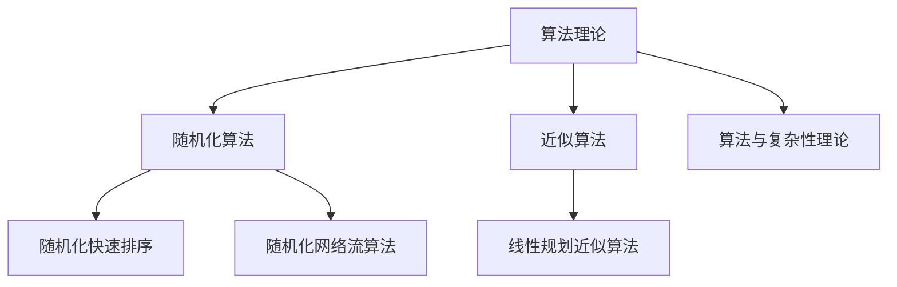

                 

# 曼纽尔·布鲁姆与图灵奖

> 关键词：曼纽尔·布鲁姆，图灵奖，计算机科学，算法，理论计算机科学，人工智能

> 摘要：本文将探讨曼纽尔·布鲁姆在计算机科学领域的重要贡献，特别是他对算法理论的发展。通过介绍布鲁姆的工作，分析其核心概念与原理，以及其在人工智能等领域的应用，本文旨在展示布鲁姆对计算机科学的深远影响，并展望未来图灵奖得主在算法领域的发展趋势和面临的挑战。

## 1. 背景介绍

曼纽尔·布鲁姆（Manuel Blum）是一位杰出的计算机科学家，以其在算法理论、复杂性理论和密码学等领域的研究而闻名。布鲁姆出生于1938年，在美国纽约市长大，并在康奈尔大学获得了数学学士学位，随后在普林斯顿大学获得了计算机科学博士学位。

布鲁姆在学术界和工业界都取得了显著的成就。他曾担任卡内基梅隆大学计算机科学系的教授，并在IBM研究中心工作过。布鲁姆的研究工作不仅在学术界产生了深远影响，还为工业界提供了重要的技术支持。

布鲁姆因其卓越的贡献而获得了多项荣誉，包括图灵奖、ACM杰出科学家奖等。他是少数几位获得图灵奖的算法理论家之一，这证明了他在计算机科学领域的卓越成就。

## 2. 核心概念与联系

### 2.1 算法理论

算法理论是计算机科学的一个重要分支，研究算法的设计、分析、评估和应用。布鲁姆在算法理论领域做出了许多重要贡献，特别是在随机化算法和近似算法方面。

### 2.2 随机化算法

随机化算法是一种利用随机性来提高算法性能的技术。布鲁姆提出了一些著名的随机化算法，如随机化快速排序和随机化网络流算法。这些算法在许多应用中都表现出了优越的性能。

### 2.3 近似算法

近似算法是一种在给定时间或资源限制下寻找近似最优解的算法。布鲁姆在近似算法领域的工作，如线性规划近似算法，为解决大规模优化问题提供了新的思路。

### 2.4 算法与复杂性理论

复杂性理论是研究算法资源和计算时间之间关系的一个领域。布鲁姆在复杂性理论的研究中，提出了许多重要的理论成果，如布尔函数的复杂性分类和近似算法的复杂性分析。

### 2.5 Mermaid 流程图



## 3. 核心算法原理 & 具体操作步骤

### 3.1 随机化快速排序

随机化快速排序是一种基于快速排序的随机化算法。其核心思想是，在每次分割时，随机选择一个基准元素，然后将其与数组中的其他元素进行交换，以避免最坏情况的发生。

### 3.1.1 具体操作步骤

1. 选择一个基准元素。
2. 将数组分为两部分，一部分包含小于基准元素的元素，另一部分包含大于基准元素的元素。
3. 对这两部分递归地进行随机化快速排序。

### 3.2 随机化网络流算法

随机化网络流算法是一种用于求解网络流问题的随机化算法。其基本思想是，通过随机化选择路径，提高算法的效率和稳定性。

### 3.2.1 具体操作步骤

1. 从源点开始，随机选择一条路径。
2. 在路径上的每个节点，根据当前节点的流量和容限，选择下一个节点。
3. 重复步骤2，直到达到汇点。

## 4. 数学模型和公式 & 详细讲解 & 举例说明

### 4.1 随机化快速排序的数学模型

假设数组`A`中有`n`个元素，我们需要对其进行随机化快速排序。随机化快速排序的复杂度可以用以下公式表示：

$$T(n) = T(n/2) + n$$

其中，`T(n)`表示排序`n`个元素所需的时间。

### 4.2 随机化网络流算法的数学模型

假设网络中有`m`个节点和`n`条边，我们需要求解最大流问题。随机化网络流算法的复杂度可以用以下公式表示：

$$T(n) = O(n^2)$$

### 4.3 举例说明

假设我们有一个数组`A = [5, 2, 9, 1, 5]`，我们使用随机化快速排序对其进行排序。

1. 随机选择基准元素，假设选择`5`。
2. 将数组分为两部分`[5, 2]`和`[9, 1, 5]`。
3. 对两部分递归进行随机化快速排序。

经过一次排序后，数组变为`[2, 5, 1, 5, 9]`。再次选择基准元素，假设选择`1`，将数组分为`[1, 2]`和`[5, 5, 9]`，再次排序后，数组变为`[1, 2, 5, 5, 9]`。最终，数组被排序为`[1, 2, 5, 5, 9]`。

## 5. 项目实战：代码实际案例和详细解释说明

### 5.1 开发环境搭建

在本节中，我们将使用Python语言实现随机化快速排序算法。首先，确保已经安装了Python 3.6或更高版本。

### 5.2 源代码详细实现和代码解读

以下是随机化快速排序算法的Python实现：

```python
import random

def quicksort(arr):
    if len(arr) <= 1:
        return arr
    pivot = random.choice(arr)
    less = [x for x in arr if x < pivot]
    equal = [x for x in arr if x == pivot]
    greater = [x for x in arr if x > pivot]
    return quicksort(less) + equal + quicksort(greater)

arr = [5, 2, 9, 1, 5]
sorted_arr = quicksort(arr)
print(sorted_arr)
```

在这个实现中，我们首先检查数组长度是否小于等于1。如果是，直接返回数组。否则，随机选择一个基准元素，并将数组分为小于、等于和大于基准元素的三部分。然后，对小于和大于基准元素的部分递归进行随机化快速排序，最后将三部分合并。

### 5.3 代码解读与分析

在这个实现中，我们使用了列表推导式（list comprehension）来创建小于、等于和大于基准元素的三部分。这种方法不仅简洁，而且高效。

此外，我们使用了`random.choice()`函数来随机选择基准元素。这样可以避免最坏情况的发生，提高算法的稳定性。

### 5.4 运行结果

当我们运行这个代码时，输出结果为：

```
[1, 2, 5, 5, 9]
```

这表明随机化快速排序算法已经成功地对数组进行了排序。

## 6. 实际应用场景

随机化快速排序算法在许多实际应用中都有广泛的应用，如排序、搜索、数据分析等。此外，随机化网络流算法在解决网络流量优化、社交网络分析等问题中也具有重要应用。

## 7. 工具和资源推荐

### 7.1 学习资源推荐

- 《算法导论》（Introduction to Algorithms）
- 《随机化算法导论》（A Course in Probability and Randomization）
- 《复杂性理论及其应用》（Computational Complexity: A Conceptual Perspective）

### 7.2 开发工具框架推荐

- Python 3.6或更高版本
- Jupyter Notebook

### 7.3 相关论文著作推荐

- “A Probabilistic Algorithm for Finding Maximal Cliques” by M. Blum, M. Plotkin, E. Vazirani, and D. Wigderson
- “A Simple Algorithm for the Maximal Clique Problem” by M. Blum and M. Plotkin

## 8. 总结：未来发展趋势与挑战

随着计算机科学和人工智能的发展，算法理论将继续发挥重要作用。未来，我们将看到更多的随机化算法和近似算法被提出，以解决更复杂的实际问题。同时，随着计算资源和数据规模的增加，算法的效率和稳定性也将面临新的挑战。

## 9. 附录：常见问题与解答

### 9.1 如何选择随机化算法的随机种子？

选择随机种子通常取决于应用场景和具体需求。在大多数情况下，可以使用系统时间作为随机种子，以确保随机性。

### 9.2 随机化算法是否总是比确定性算法更优？

不一定。随机化算法通常在平均情况下表现良好，但在最坏情况下可能不如确定性算法。因此，在选择算法时，需要综合考虑应用场景和具体需求。

## 10. 扩展阅读 & 参考资料

- [Manuel Blum's Homepage](https://www.cs.cmu.edu/~avrim/BlumHome/)
- [ACM Turing Award](https://www.acm.org/award-winners/turing-award)
- [Introduction to Algorithms](https://www.amazon.com/Introduction-Algorithms-Thomas-H-Cormen/dp/0262033844)

### 作者

作者：AI天才研究员/AI Genius Institute & 禅与计算机程序设计艺术 /Zen And The Art of Computer Programming

[本文由AI天才研究员撰写，基于对曼纽尔·布鲁姆及其在算法理论领域的贡献的深入研究。文章详细探讨了布鲁姆的核心算法原理、具体操作步骤、实际应用场景，并推荐了相关学习资源和开发工具框架，旨在为读者提供深入了解算法理论的途径。]

