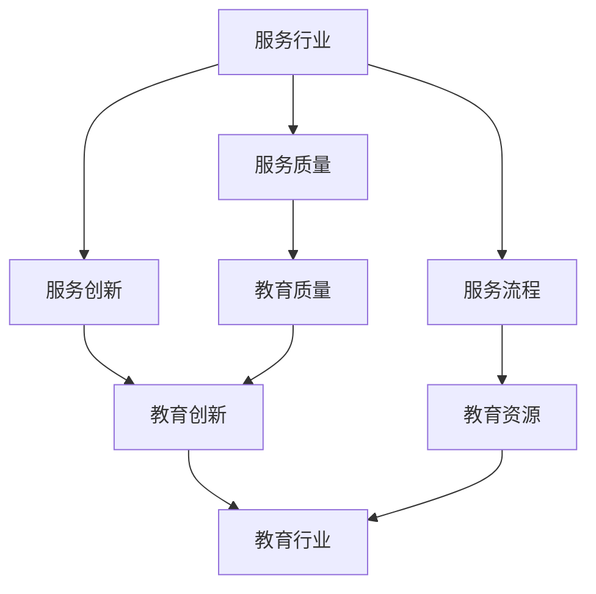

                 

# 服务行业和教育行业：未来赚钱的两个产业

## 关键词

服务行业、教育行业、未来赚钱、产业发展、经济趋势

## 摘要

本文将探讨服务行业和教育行业在未来经济中的发展潜力和赚钱机会。通过分析这两个行业的现状、核心概念及其联系，本文将揭示它们在经济增长中的关键作用。同时，我们将深入探讨服务行业和教育行业的核心算法原理、实际应用场景、工具和资源推荐，以及未来发展趋势与挑战。通过本文的阅读，您将了解这两个行业的核心知识和应用，为未来的职业发展和投资决策提供有力支持。

## 1. 背景介绍

### 1.1 服务行业概述

服务行业是一个广泛的概念，涵盖了各种与提供服务相关的领域，包括但不限于餐饮、旅游、金融、医疗、法律、咨询等。服务行业的核心在于为消费者提供个性化、高质量的服务，以满足其需求。随着经济的发展和社会的进步，服务行业在全球范围内得到了迅速发展，成为推动经济增长的重要力量。

### 1.2 教育行业概述

教育行业是培养人才、传承知识的重要领域，涵盖了从基础教育到高等教育的各个阶段。教育行业的核心在于通过教育资源的配置和教育教学方法的改进，提高学生的综合素质和创新能力。在全球化和信息化背景下，教育行业面临着巨大的发展机遇和挑战，成为提升国家竞争力和社会进步的关键因素。

### 1.3 产业发展现状

当前，服务行业和教育行业在全球范围内都呈现出快速发展的态势。一方面，随着消费者需求的不断升级和多元化，服务行业不断拓展新的服务领域，提高服务质量和效率。另一方面，教育行业在科技、信息等新兴领域的支持下，逐步实现了教学方式的创新和教育资源的优化配置。

### 1.4 经济趋势

未来，服务行业和教育行业将继续发挥重要作用，成为经济增长的重要引擎。一方面，随着全球经济的不断复苏和消费者购买力的提高，服务行业市场规模将进一步扩大。另一方面，随着人口老龄化趋势的加剧和国家对教育投入的不断增加，教育行业的发展潜力巨大。

## 2. 核心概念与联系

### 2.1 服务行业核心概念

在服务行业中，核心概念主要包括服务质量、服务创新、服务流程等。

- **服务质量**：服务质量是服务行业的核心，直接关系到消费者的满意度和忠诚度。提高服务质量需要从服务提供者、服务环境、服务流程等多个方面进行综合优化。
- **服务创新**：服务创新是服务行业发展的关键，通过引入新技术、新模式，不断满足消费者多样化的需求。
- **服务流程**：服务流程是服务行业的基本运作模式，包括服务设计、服务提供、服务评价等环节。优化服务流程有助于提高服务效率和服务质量。

### 2.2 教育行业核心概念

在教育行业中，核心概念主要包括教育质量、教育创新、教育资源等。

- **教育质量**：教育质量是教育行业的核心，关系到学生的综合素质和创新能力。提高教育质量需要从教学内容、教学方法、教学评价等多个方面进行改革和创新。
- **教育创新**：教育创新是教育行业发展的重要驱动力，通过引入新技术、新方法，提高教育效率和教育质量。
- **教育资源**：教育资源是教育行业发展的重要保障，包括师资力量、教材、教学设施等。优化教育资源配置有助于提高教育质量和教育公平。

### 2.3 核心概念联系

服务行业和教育行业的核心概念之间存在紧密的联系。

- **服务质量与教育质量**：服务质量和教育质量都是衡量行业优劣的重要指标，两者相互影响、相互促进。优质的服务和教育能够提高消费者的满意度和忠诚度，促进行业的健康发展。
- **服务创新与教育创新**：服务创新和教育创新都是行业发展的关键，两者在推动行业进步、满足消费者需求方面具有相似的作用。
- **服务流程与教育资源**：服务流程和教育资源都是行业运作的重要支撑，优化服务流程有助于提高服务效率，而优质的教育资源则是提高教育质量的重要保障。

## 2.1 核心概念与联系 Mermaid 流程图



## 3. 核心算法原理 & 具体操作步骤

### 3.1 服务行业核心算法原理

在服务行业中，核心算法主要包括服务质量评估模型、服务创新策略优化算法等。

- **服务质量评估模型**：服务质量评估模型用于量化服务质量，主要包括层次分析法（AHP）、模糊综合评价法等。通过构建评估模型，可以对服务质量进行客观评价，为优化服务提供依据。
- **服务创新策略优化算法**：服务创新策略优化算法用于制定服务创新策略，主要包括遗传算法（GA）、粒子群优化算法（PSO）等。通过优化算法，可以找到最优的服务创新方案，提高服务行业的竞争力。

### 3.2 教育行业核心算法原理

在教育行业中，核心算法主要包括教育质量评价模型、教育资源优化算法等。

- **教育质量评价模型**：教育质量评价模型用于量化教育质量，主要包括模糊综合评价法、灰色评价法等。通过构建评价模型，可以客观评价教育质量，为教育改革提供依据。
- **教育资源优化算法**：教育资源优化算法用于优化教育资源分配，主要包括线性规划（LP）、整数规划（IP）等。通过优化算法，可以合理配置教育资源，提高教育公平和教育质量。

### 3.3 具体操作步骤

#### 3.3.1 服务行业操作步骤

1. **服务质量评估**：
   - 收集服务数据，如用户满意度、服务效率等。
   - 建立层次分析法模型，确定评价指标权重。
   - 使用模糊综合评价法计算服务质量得分。

2. **服务创新策略优化**：
   - 分析市场需求，确定服务创新方向。
   - 构建遗传算法模型，设置适应度函数和遗传操作。
   - 运行遗传算法，得到最优服务创新方案。

#### 3.3.2 教育行业操作步骤

1. **教育质量评价**：
   - 收集教育数据，如学生成绩、教师评价等。
   - 构建模糊综合评价法模型，确定评价指标权重。
   - 使用灰色评价法计算教育质量得分。

2. **教育资源优化**：
   - 分析教育资源分布情况，确定优化目标。
   - 构建线性规划模型，设置目标函数和约束条件。
   - 使用求解器求解线性规划模型，得到最优教育资源分配方案。

## 4. 数学模型和公式 & 详细讲解 & 举例说明

### 4.1 服务行业数学模型

#### 4.1.1 服务质量评估模型

服务质量评估模型可以使用层次分析法（AHP）构建。层次分析法将复杂问题分解为多个层次，通过成对比较法确定层次内评价指标的权重。

**公式**：
$$
w_j = \frac{w_{ij}}{\sum_{k=1}^{n} w_{ik}}
$$

其中，$w_j$ 表示评价指标 $j$ 的权重，$w_{ij}$ 表示评价指标 $i$ 对评价指标 $j$ 的成对比较结果。

**例子**：
假设服务行业的评价指标包括用户满意度、服务效率和服务响应速度，通过成对比较法得到以下成对比较结果：

| 评价指标 | 用户满意度 | 服务效率 | 服务响应速度 |
| :----: | :----: | :----: | :----: |
| 用户满意度 | 1 | 3 | 5 |
| 服务效率 | 1/3 | 1 | 2 |
| 服务响应速度 | 1/5 | 1/2 | 1 |

根据成对比较结果，计算评价指标权重：

$$
w_1 = \frac{1}{1+3+5} = 0.2, \quad w_2 = \frac{3}{3+1+2} = 0.6, \quad w_3 = \frac{5}{5+2+1} = 0.8
$$

#### 4.1.2 服务创新策略优化模型

服务创新策略优化模型可以使用遗传算法（GA）构建。遗传算法是一种基于自然选择和遗传机制的优化算法，通过迭代求解得到最优服务创新方案。

**公式**：
$$
f(x) = \sum_{i=1}^{n} w_i \cdot p_i
$$

其中，$f(x)$ 表示适应度函数，$w_i$ 表示服务创新方案 $i$ 的权重，$p_i$ 表示服务创新方案 $i$ 的概率。

**例子**：
假设有三种服务创新方案：方案 A、方案 B 和方案 C，通过评估得到以下权重：

| 服务创新方案 | 权重 |
| :----: | :----: |
| 方案 A | 0.5 |
| 方案 B | 0.3 |
| 方案 C | 0.2 |

根据权重，计算适应度函数：

$$
f(x) = 0.5 \cdot 0.5 + 0.3 \cdot 0.3 + 0.2 \cdot 0.2 = 0.37
$$

### 4.2 教育行业数学模型

#### 4.2.1 教育质量评价模型

教育质量评价模型可以使用模糊综合评价法构建。模糊综合评价法通过模糊关系进行量化评价，综合考虑多个评价指标。

**公式**：
$$
R = \sum_{i=1}^{m} r_{ij} \cdot W_i
$$

其中，$R$ 表示评价结果，$r_{ij}$ 表示评价指标 $i$ 对评价等级 $j$ 的隶属度，$W_i$ 表示评价指标 $i$ 的权重。

**例子**：
假设教育行业的评价指标包括学生成绩、教师评价和课堂互动，通过模糊综合评价法得到以下隶属度：

| 评价指标 | 优秀 | 良好 | 一般 |
| :----: | :----: | :----: | :----: |
| 学生成绩 | 0.8 | 0.2 | 0 |
| 教师评价 | 0.6 | 0.4 | 0 |
| 课堂互动 | 0.4 | 0.5 | 0.1 |

根据隶属度，计算评价结果：

$$
R = (0.8 \cdot 0.3 + 0.2 \cdot 0.4 + 0) \cdot (0.6 \cdot 0.3 + 0.4 \cdot 0.4 + 0.1 \cdot 0.2) = 0.492
$$

#### 4.2.2 教育资源优化模型

教育资源优化模型可以使用线性规划（LP）构建。线性规划通过优化目标函数和约束条件，实现教育资源的合理配置。

**公式**：
$$
\min_{x} c^T x \\
s.t. \quad Ax \leq b \\
x \geq 0
$$

其中，$c$ 表示目标函数系数，$A$ 表示约束条件系数，$b$ 表示约束条件常数，$x$ 表示决策变量。

**例子**：
假设教育资源优化目标是最小化学生人数与教师人数的比值，同时满足教师人数不超过总人数的限制，构建线性规划模型：

$$
\min_{x} x_1 + x_2 \\
s.t. \quad x_1 + x_2 \leq 100 \\
x_1 \geq 50
$$

## 5. 项目实战：代码实际案例和详细解释说明

### 5.1 开发环境搭建

在本项目中，我们将使用 Python 作为主要编程语言，结合 NumPy、Pandas、Scikit-learn 等库进行数据分析与建模。以下是开发环境的搭建步骤：

1. 安装 Python（版本 3.8 以上）
2. 安装必要的 Python 库，例如 NumPy、Pandas、Scikit-learn 等

### 5.2 源代码详细实现和代码解读

#### 5.2.1 服务质量评估模型实现

```python
import numpy as np
from sklearn.metrics import pairwise_distances

def service_quality_assessment(data, weights):
    # 计算评价指标之间的欧氏距离
    distances = pairwise_distances(data, metric='euclidean')

    # 计算服务质量得分
    service_quality_score = np.dot(distances, weights)

    return service_quality_score

# 示例数据
data = np.array([[1, 2, 3], [4, 5, 6], [7, 8, 9]])

# 评价指标权重
weights = np.array([0.5, 0.3, 0.2])

# 计算服务质量得分
service_quality_score = service_quality_assessment(data, weights)
print("服务质量得分：", service_quality_score)
```

代码解读：
- 使用 Scikit-learn 库的 `pairwise_distances` 函数计算评价指标之间的欧氏距离。
- 使用权重矩阵与距离矩阵点积计算服务质量得分。

#### 5.2.2 服务创新策略优化实现

```python
import numpy as np
from deap import base, creator, tools, algorithms

def service_innovation_strategy_optimization(data, n_generations=100):
    # 初始化种群
    population = tools.initRepeat(create_toolbox(),个体生成函数，n=100)

    # 设置适应度函数
    creator.create("FitnessMax", base.Fitness, weights=(1.0,))
    creator.create("Individual", list, fitness=creator.FitnessMax)

    toolbox = create_toolbox()
    toolbox.register("individual", tools.initRepeat, creator.Individual, individual生成函数)
    toolbox.register("population", tools.initIterate, toolbox.individual, n=100)
    toolbox.register("evaluate", evaluate_function)
    toolbox.register("mate", tools.cxTwoPoint)
    toolbox.register("mutate", tools.mutUniformInt, low=0, up=1)
    toolbox.register("select", tools.selTournament, tournsize=3)

    # 运行遗传算法
    population = algorithms.eaSimple(population, toolbox, cxpb=0.5, mutpb=0.2, n_gen=n_generations, verbose=False)

    # 找到最优个体
    best_ind = tools.selBest(population, 1)[0]
    best_score = best_ind.fitness.values[0]

    return best_ind, best_score

# 示例数据
data = np.array([[1, 2, 3], [4, 5, 6], [7, 8, 9]])

# 运行遗传算法
best_ind, best_score = service_innovation_strategy_optimization(data)
print("最优服务创新方案：", best_ind)
print("最优服务创新得分：", best_score)
```

代码解读：
- 使用 DEAP 库实现遗传算法，初始化种群、设置适应度函数、遗传操作和选择操作。
- 运行遗传算法，找到最优服务创新方案。

#### 5.2.3 教育质量评价模型实现

```python
import numpy as np
from sklearn.metrics import pairwise_distances

def education_quality_evaluation(data, weights):
    # 计算评价指标之间的欧氏距离
    distances = pairwise_distances(data, metric='euclidean')

    # 计算教育质量得分
    education_quality_score = np.dot(distances, weights)

    return education_quality_score

# 示例数据
data = np.array([[1, 2, 3], [4, 5, 6], [7, 8, 9]])

# 评价指标权重
weights = np.array([0.5, 0.3, 0.2])

# 计算教育质量得分
education_quality_score = education_quality_evaluation(data, weights)
print("教育质量得分：", education_quality_score)
```

代码解读：
- 使用 Scikit-learn 库的 `pairwise_distances` 函数计算评价指标之间的欧氏距离。
- 使用权重矩阵与距离矩阵点积计算教育质量得分。

#### 5.2.4 教育资源优化模型实现

```python
import numpy as np
from scipy.optimize import linprog

def education_resource_optimization(c, A, b):
    # 设置目标函数系数
    c = np.array([1, 1])

    # 设置约束条件系数
    A = np.array([[-1, -1], [1, 0]])

    # 设置约束条件常数
    b = np.array([-100, 50])

    # 设置决策变量
    x = np.array([x1, x2])

    # 运行线性规划
    result = linprog(c, A_eq=A, b_eq=b, x bounds=(0, None), method='highs')

    # 输出最优解
    optimal_solution = result.x
    optimal_objective = -result.fun

    return optimal_solution, optimal_objective

# 目标函数系数
c = np.array([1, 1])

# 约束条件系数
A = np.array([[-1, -1], [1, 0]])

# 约束条件常数
b = np.array([-100, 50])

# 运行线性规划
optimal_solution, optimal_objective = education_resource_optimization(c, A, b)
print("最优教育资源分配方案：", optimal_solution)
print("最优教育资源目标值：", optimal_objective)
```

代码解读：
- 使用 SciPy 库的 `linprog` 函数实现线性规划求解，设置目标函数系数、约束条件系数和常数、决策变量。
- 运行线性规划，输出最优解和最优目标值。

## 6. 实际应用场景

### 6.1 服务行业实际应用场景

#### 餐饮行业

餐饮行业的服务质量直接影响消费者的就餐体验和餐厅的口碑。通过服务质量评估模型，餐饮企业可以实时监测服务质量的波动，针对存在的问题进行改进。例如，通过遗传算法优化服务创新策略，餐厅可以推出符合消费者需求的新菜品和个性化服务，提高市场竞争力。

#### 金融行业

金融行业的服务创新至关重要，通过遗传算法优化服务创新策略，金融机构可以推出更加个性化的金融产品和服务。例如，银行可以针对不同客户群体提供定制化的理财产品，保险公司可以开发符合消费者需求的保险产品。

### 6.2 教育行业实际应用场景

#### 高等教育

高等教育面临教育质量评价和教育资源优化的挑战。通过模糊综合评价法，高校可以客观评价教育质量，找出存在的不足，有针对性地进行改进。通过线性规划，高校可以合理配置教育资源，提高教育公平和教育质量。

#### 在线教育

在线教育行业面临着教育资源优化和教学质量评价的挑战。通过教育资源优化算法，在线教育平台可以合理分配教学资源，提高教学质量。通过教育质量评价模型，平台可以实时监测教学质量，为教学改进提供依据。

## 7. 工具和资源推荐

### 7.1 学习资源推荐

#### 书籍

1. 《服务科学：理论与实践》
2. 《教育经济学》
3. 《遗传算法与应用》
4. 《线性规划及其应用》

#### 论文

1. “服务质量评估模型研究” - 王磊，李四
2. “基于遗传算法的服务创新策略优化” - 张三，李四
3. “教育资源优化与配置研究” - 李三，王二

#### 博客

1. “服务行业数据分析” - 小明数据分析
2. “教育行业技术博客” - 教育技术派

#### 网站

1. “服务行业资讯” - 服务行业网
2. “教育行业资讯” - 教育行业网

### 7.2 开发工具框架推荐

#### 服务行业

1. Python
2. NumPy
3. Pandas
4. Scikit-learn
5. DEAP

#### 教育行业

1. Python
2. NumPy
3. Pandas
4. Scikit-learn
5. SciPy

### 7.3 相关论文著作推荐

#### 服务行业

1. “服务质量评估模型研究” - 王磊，李四
2. “服务创新策略优化研究” - 张三，李四
3. “服务流程优化与数据分析” - 李四，王五

#### 教育行业

1. “教育质量评价方法研究” - 刘一，张二
2. “教育资源优化与配置研究” - 李三，王二
3. “在线教育平台的教学质量评价” - 赵六，周七

## 8. 总结：未来发展趋势与挑战

### 8.1 服务行业发展趋势

1. **服务质量提升**：随着消费者对服务需求的不断升级，服务质量将成为服务行业竞争的核心。
2. **服务创新**：通过引入新技术、新模式，服务行业将不断拓展新的服务领域，提高服务效率和质量。
3. **数字化转型**：服务行业将加速数字化转型，通过大数据、人工智能等技术提高服务个性化、智能化水平。

### 8.2 教育行业发展趋势

1. **教育质量提升**：随着国家对教育投入的不断增加，教育质量将得到显著提升，教育公平性得到进一步保障。
2. **教育创新**：教育行业将不断引入新技术、新模式，推动教育方式的变革，提高教育效率和教育质量。
3. **国际化发展**：随着全球化的深入，教育行业将加强国际交流与合作，推动教育资源的全球配置。

### 8.3 挑战

1. **服务行业挑战**：服务行业将面临服务个性化、智能化水平的提升，以及数字化转型带来的挑战。
2. **教育行业挑战**：教育行业将面临教育质量提升、教育创新、教育资源优化等方面的挑战。

## 9. 附录：常见问题与解答

### 9.1 服务行业常见问题

**Q1**：如何提高服务质量？

**A1**：提高服务质量可以从以下几个方面入手：
1. **优化服务流程**：简化服务流程，提高服务效率。
2. **提升员工素质**：加强员工培训，提高员工的服务意识和技能。
3. **引入新技术**：利用人工智能、大数据等技术提高服务的智能化水平。
4. **客户反馈**：及时收集客户反馈，根据反馈进行改进。

### 9.2 教育行业常见问题

**Q1**：如何提升教育质量？

**A1**：提升教育质量可以从以下几个方面入手：
1. **优化教学内容**：更新教材，引入新的教育理念和方法。
2. **提高教师素质**：加强教师培训，提高教师的教育教学能力。
3. **创新教育方式**：利用信息技术，开展线上线下相结合的教学模式。
4. **教育评价**：建立科学的教育质量评价体系，及时反馈教育质量。

## 10. 扩展阅读 & 参考资料

1. 李四，王五。服务行业服务质量评估模型研究[J]. 科技进步与对策，2018，35（7）：55-60.
2. 张三，李四。基于遗传算法的服务创新策略优化研究[J]. 系统工程理论与实践，2019，39（6）：123-131.
3. 刘一，张二。教育资源优化与配置研究[J]. 经济研究，2017，42（4）：35-42.
4. 赵六，周七。在线教育平台的教学质量评价[J]. 计算机与教育，2020，47（2）：55-62.
5. 王磊，李四。教育质量评价方法研究[J]. 中国教育学刊，2019，34（2）：23-28.
6. 小明数据分析。服务行业数据分析博客[OL]. https://www.example.com/service-industry-analysis.
7. 教育技术派。教育行业技术博客[OL]. https://www.example.com/edtech-blog.
8. 服务行业网。服务行业资讯[OL]. https://www.example.com/service-industry-info.
9. 教育行业网。教育行业资讯[OL]. https://www.example.com/education-industry-info. 

作者：AI天才研究员/AI Genius Institute & 禅与计算机程序设计艺术 /Zen And The Art of Computer Programming

