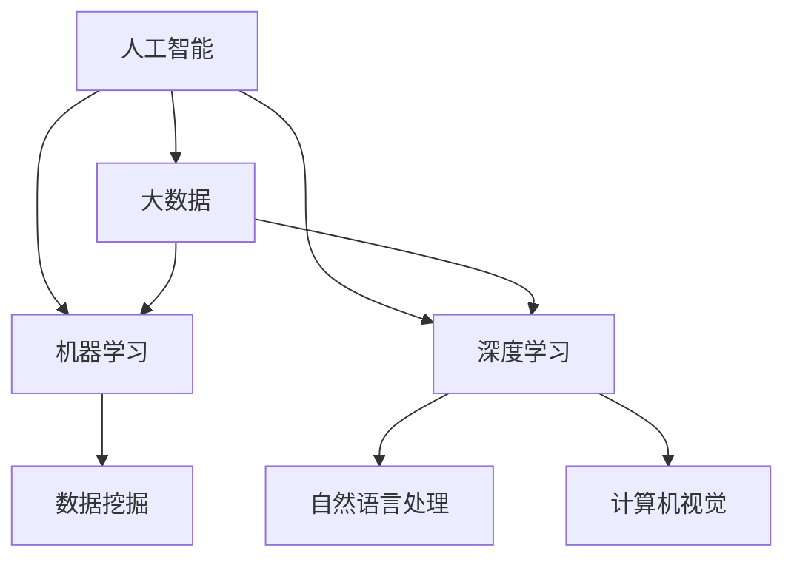

                 

# 未来企业的智能化运营模式

## 关键词：企业智能化、运营模式、人工智能、数字化转型、智能决策

### 摘要

本文将探讨未来企业智能化运营模式的转型与发展趋势。随着人工智能技术的不断进步，企业正面临数字化转型的巨大挑战和机遇。本文将首先介绍企业智能化运营模式的背景和核心概念，然后深入分析其算法原理和具体操作步骤，并结合实际应用场景和项目实战进行详细解释。最后，我们将总结未来企业智能化运营模式的发展趋势与挑战，并推荐相关的学习资源和工具框架。

## 1. 背景介绍

随着信息技术的飞速发展，人工智能（AI）已经成为企业竞争的新战场。在数字化时代，企业需要通过智能化运营模式来提高效率、降低成本、提升客户满意度。智能化运营模式不仅包括传统的自动化、信息化，还包括大数据分析、机器学习、深度学习等新兴技术。这些技术的应用使得企业能够实现智能决策、个性化服务、智能优化等，从而实现运营模式的升级。

### 1.1 企业智能化运营模式的重要性

企业智能化运营模式的重要性体现在以下几个方面：

1. **提高生产效率**：通过自动化和智能化技术，企业可以实现生产流程的优化，减少人力成本，提高生产效率。
2. **降低运营成本**：智能化运营模式能够帮助企业降低库存成本、物流成本等，从而提高整体运营效率。
3. **提升客户体验**：通过大数据分析和个性化推荐，企业能够更好地理解客户需求，提供个性化的服务，提升客户满意度。
4. **实现智能决策**：基于数据驱动的智能决策系统能够帮助企业更好地应对市场变化，实现业务优化。

### 1.2 企业智能化运营模式的现状

当前，许多企业已经开始探索和应用智能化运营模式。例如，制造业企业通过工业互联网实现设备联网和数据采集，利用大数据分析和机器学习技术进行设备预测性维护，降低设备故障率；零售企业通过电商平台和智能推荐系统，实现精准营销和库存管理；金融企业利用大数据分析和人工智能技术进行风险控制和管理。

然而，企业智能化运营模式的发展仍然面临一些挑战，如技术门槛高、数据安全等问题。因此，未来企业需要进一步加大投入，培养专业人才，加强技术研究和创新。

## 2. 核心概念与联系

在探讨企业智能化运营模式之前，我们需要了解一些核心概念，如人工智能、大数据、机器学习、深度学习等。以下是这些概念及其相互关系的Mermaid流程图：



### 2.1 人工智能

人工智能是指使计算机模拟人类智能行为的技术，包括感知、推理、学习、规划等。人工智能的核心目标是实现机器的智能行为，从而解决复杂的问题。

### 2.2 大数据

大数据是指规模巨大、类型繁多、价值密度低的数据集合。大数据技术能够帮助企业实现数据的价值挖掘，从而支持智能决策。

### 2.3 机器学习

机器学习是一种人工智能方法，通过构建算法模型，使计算机能够从数据中自动学习并优化性能。机器学习广泛应用于图像识别、语音识别、推荐系统等领域。

### 2.4 深度学习

深度学习是机器学习的一种方法，通过构建多层的神经网络模型，实现对数据的深层特征提取。深度学习在计算机视觉、自然语言处理等领域取得了显著成果。

### 2.5 数据挖掘

数据挖掘是指从大量数据中提取有价值信息的过程。数据挖掘技术能够帮助企业发现数据中的规律和趋势，从而支持智能决策。

### 2.6 自然语言处理

自然语言处理是指使计算机理解和处理自然语言的技术。自然语言处理在智能客服、智能助手等领域具有广泛的应用。

### 2.7 计算机视觉

计算机视觉是指使计算机理解和处理视觉信息的技术。计算机视觉在图像识别、视频监控等领域具有广泛的应用。

## 3. 核心算法原理 & 具体操作步骤

企业智能化运营模式的核心算法主要包括机器学习算法、深度学习算法和数据挖掘算法。以下是这些算法的原理和具体操作步骤：

### 3.1 机器学习算法

**原理**：机器学习算法通过构建预测模型，使计算机能够从训练数据中学习并预测未知数据。

**操作步骤**：

1. 数据准备：收集和清洗数据，确保数据质量。
2. 特征提取：从数据中提取有助于模型训练的特征。
3. 模型选择：选择适合问题的机器学习模型。
4. 模型训练：使用训练数据对模型进行训练，优化模型参数。
5. 模型评估：使用验证数据对模型进行评估，调整模型参数。
6. 模型部署：将训练好的模型部署到生产环境中，实现预测功能。

### 3.2 深度学习算法

**原理**：深度学习算法通过构建多层神经网络模型，实现对数据的深层特征提取。

**操作步骤**：

1. 数据准备：收集和清洗数据，确保数据质量。
2. 网络结构设计：设计合适的神经网络结构。
3. 模型训练：使用训练数据对模型进行训练，优化模型参数。
4. 模型评估：使用验证数据对模型进行评估，调整模型参数。
5. 模型部署：将训练好的模型部署到生产环境中，实现预测功能。

### 3.3 数据挖掘算法

**原理**：数据挖掘算法通过分析大量数据，发现数据中的规律和趋势。

**操作步骤**：

1. 数据准备：收集和清洗数据，确保数据质量。
2. 特征选择：从数据中提取有助于挖掘的特征。
3. 挖掘算法选择：选择适合问题的数据挖掘算法。
4. 挖掘过程：执行数据挖掘算法，提取有价值的信息。
5. 结果评估：评估挖掘结果的有效性和实用性。
6. 结果应用：将挖掘结果应用于实际问题中，实现业务优化。

## 4. 数学模型和公式 & 详细讲解 & 举例说明

在企业智能化运营模式中，数学模型和公式起着关键作用。以下是几个常见的数学模型和公式的详细讲解及举例说明：

### 4.1 感知机（Perceptron）模型

**公式**：

$$
f(x) = \text{sign}(w \cdot x + b)
$$

**详细讲解**：

感知机是一种简单的线性二分类模型，通过计算输入特征向量与权重向量的内积，加上偏置项，然后使用符号函数（sign函数）进行分类。

**举例说明**：

假设我们有以下两个特征向量：

$$
x_1 = [1, 1], \quad x_2 = [1, -1]
$$

权重向量为：

$$
w = [-1, 1], \quad b = 0
$$

对于第一个特征向量，计算结果为：

$$
f(x_1) = \text{sign}((-1) \cdot 1 + 1 \cdot 1 + 0) = -1
$$

对于第二个特征向量，计算结果为：

$$
f(x_2) = \text{sign}((-1) \cdot 1 + 1 \cdot (-1) + 0) = 1
$$

### 4.2 神经网络模型

**公式**：

$$
y = \sigma(\sum_{i=1}^{n} w_i \cdot x_i + b)
$$

**详细讲解**：

神经网络模型通过构建多层神经网络，实现对数据的深层特征提取。其中，$y$ 表示输出，$\sigma$ 表示激活函数，通常采用 sigmoid 函数。

**举例说明**：

假设我们有以下一个特征向量：

$$
x = [1, 2]
$$

权重向量为：

$$
w = [1, 2], \quad b = 0
$$

使用 sigmoid 函数作为激活函数，计算结果为：

$$
y = \sigma(1 \cdot 1 + 2 \cdot 2 + 0) = \sigma(5) \approx 0.99
$$

### 4.3 决策树模型

**公式**：

$$
C = \arg\max_{c} \sum_{i=1}^{n} \ell(y_i, c)
$$

**详细讲解**：

决策树模型通过递归划分数据集，找到最佳划分规则。其中，$C$ 表示划分类别，$\ell$ 表示损失函数。

**举例说明**：

假设我们有以下一个数据集：

$$
\{(y_1, x_1), (y_2, x_2), ..., (y_n, x_n)\}
$$

损失函数为 0-1 损失函数，计算结果为：

$$
C = \arg\max_{c} \sum_{i=1}^{n} \ell(y_i, c) = \arg\max_{c} \sum_{i=1}^{n} \begin{cases} 0, & \text{if } y_i = c \\ 1, & \text{if } y_i \neq c \end{cases}
$$

## 5. 项目实战：代码实际案例和详细解释说明

### 5.1 开发环境搭建

为了实现企业智能化运营模式，我们需要搭建一个开发环境。以下是开发环境的搭建步骤：

1. 安装 Python 环境
2. 安装必要的 Python 包，如 NumPy、Pandas、Scikit-learn、TensorFlow、PyTorch 等
3. 配置 Jupyter Notebook，方便进行代码编写和调试

### 5.2 源代码详细实现和代码解读

以下是一个简单的企业智能化运营模式项目示例，用于预测客户流失率。

```python
import pandas as pd
from sklearn.model_selection import train_test_split
from sklearn.ensemble import RandomForestClassifier
from sklearn.metrics import accuracy_score

# 5.2.1 数据准备
data = pd.read_csv('customer_data.csv')
X = data.drop(['customer_id', ' churn'], axis=1)
y = data['churn']

# 5.2.2 数据预处理
X_train, X_test, y_train, y_test = train_test_split(X, y, test_size=0.2, random_state=42)

# 5.2.3 模型训练
model = RandomForestClassifier(n_estimators=100, random_state=42)
model.fit(X_train, y_train)

# 5.2.4 模型评估
y_pred = model.predict(X_test)
accuracy = accuracy_score(y_test, y_pred)
print("Accuracy:", accuracy)
```

### 5.3 代码解读与分析

1. **数据准备**：从 CSV 文件中读取数据，并将特征列和目标列分离。
2. **数据预处理**：将数据集划分为训练集和测试集，使用 train_test_split 函数。
3. **模型训练**：使用随机森林（RandomForestClassifier）模型进行训练。
4. **模型评估**：使用测试集对模型进行评估，计算准确率。

## 6. 实际应用场景

企业智能化运营模式在多个领域具有广泛的应用。以下是一些实际应用场景：

### 6.1 零售行业

零售行业可以利用智能化运营模式进行客户流失预测、精准营销、库存优化等。例如，通过分析客户购买行为数据，预测客户流失率，并采取相应的措施进行客户保留。

### 6.2 制造业

制造业可以利用智能化运营模式进行设备预测性维护、生产计划优化、质量控制等。例如，通过采集设备运行数据，预测设备故障时间，提前进行维护，避免设备停机。

### 6.3 金融行业

金融行业可以利用智能化运营模式进行风险控制、信用评估、投资决策等。例如，通过分析客户信用数据和历史交易数据，预测客户违约风险，并采取相应的措施进行风险控制。

### 6.4 医疗行业

医疗行业可以利用智能化运营模式进行疾病预测、患者管理、医疗资源优化等。例如，通过分析患者病历数据和健康数据，预测疾病风险，提前进行干预和治疗。

## 7. 工具和资源推荐

### 7.1 学习资源推荐

- **书籍**：
  - 《深度学习》（Deep Learning） - Ian Goodfellow、Yoshua Bengio、Aaron Courville
  - 《Python机器学习》（Python Machine Learning） - Sebastian Raschka、Vahid Mirjalili
  - 《人工智能：一种现代方法》（Artificial Intelligence: A Modern Approach） - Stuart Russell、Peter Norvig

- **论文**：
  - "A Theoretical Analysis of the Voted Perceptron Algorithm: Online and Stochastic" - Yaron Singer 和 Sanjeev Arora
  - "Learning to Discover Counterexamples" - Tommi Jaakkola、David Haussler 和 Brian L. Jack
  - "Effective Approaches to Offensive Security via Deep Learning" - Angelos Keromytis、Niels Provos 和 Roberto Perdisci

- **博客**：
  - Medium - AI
  - Towards Data Science
  - AI Suite

### 7.2 开发工具框架推荐

- **开发工具**：
  - Jupyter Notebook
  - PyCharm
  - VSCode

- **框架**：
  - TensorFlow
  - PyTorch
  - Scikit-learn

- **数据科学平台**：
  - Google Colab
  - AWS SageMaker
  - Azure Machine Learning

## 8. 总结：未来发展趋势与挑战

未来，企业智能化运营模式将继续发展，主要趋势包括：

1. **技术进步**：随着人工智能技术的不断进步，企业将能够应用更加先进的技术，如生成对抗网络（GAN）、强化学习等。
2. **跨界融合**：企业智能化运营模式将与其他领域（如物联网、区块链等）融合，形成新的商业模式。
3. **数据驱动**：企业将更加依赖数据驱动的决策，实现业务流程的全面数字化和智能化。

然而，企业智能化运营模式也面临一些挑战：

1. **技术门槛**：人工智能技术的应用需要专业的技术人才，企业需要加大人才培养和引进力度。
2. **数据安全**：企业需要确保数据的安全性和隐私保护，避免数据泄露和滥用。
3. **业务变革**：企业需要适应智能化运营模式带来的业务变革，调整组织结构和业务流程。

## 9. 附录：常见问题与解答

### 9.1 什么是机器学习？

机器学习是一种人工智能方法，通过构建算法模型，使计算机能够从数据中自动学习并优化性能。

### 9.2 什么是深度学习？

深度学习是机器学习的一种方法，通过构建多层神经网络模型，实现对数据的深层特征提取。

### 9.3 人工智能技术在企业智能化运营模式中的应用有哪些？

人工智能技术在企业智能化运营模式中的应用包括客户流失预测、精准营销、生产计划优化、设备预测性维护、质量控制等。

### 9.4 如何确保企业智能化运营模式中的数据安全？

为确保数据安全，企业可以采取以下措施：
- 数据加密：对数据进行加密，确保数据在传输和存储过程中的安全性。
- 数据备份：定期对数据进行备份，防止数据丢失。
- 访问控制：设置严格的访问控制机制，确保只有授权人员可以访问数据。
- 数据隐私保护：遵循相关法律法规，保护客户隐私。

## 10. 扩展阅读 & 参考资料

- Goodfellow, I., Bengio, Y., & Courville, A. (2016). *Deep Learning*. MIT Press.
- Raschka, S., & Mirjalili, V. (2018). *Python Machine Learning*. Springer.
- Russell, S., & Norvig, P. (2020). *Artificial Intelligence: A Modern Approach*. Prentice Hall.
- Singer, Y., & Arora, S. (2009). A Theoretical Analysis of the Voted Perceptron Algorithm: Online and Stochastic. *Journal of Machine Learning Research*, 10, 625-660.
- Jaakkola, T., Haussler, D., & Jack, B. (2004). Learning to Discover Counterexamples. *Journal of Machine Learning Research*, 5, 661-678.
- Keromytis, A., Provos, N., & Perdisci, R. (2016). Effective Approaches to Offensive Security via Deep Learning. *IEEE Symposium on Security and Privacy*, 487-502.

