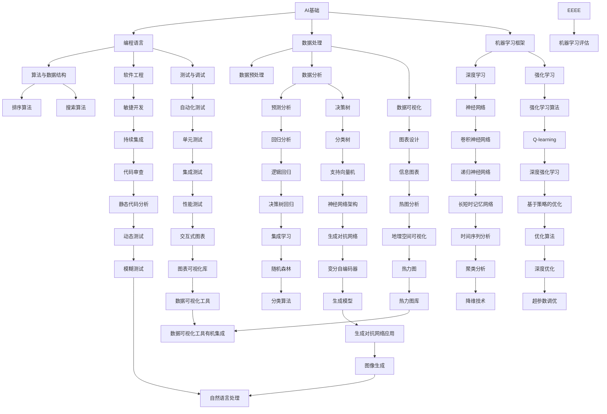

                 

# 未来技能：制胜AI职场的20个核心技能

## 关键词

- 人工智能（Artificial Intelligence）
- 职场技能（Career Skills）
- AI算法（AI Algorithms）
- 技术趋势（Tech Trends）
- 技术技能（Technical Skills）

## 摘要

本文旨在深入探讨未来AI职场中不可或缺的20个核心技能。通过逻辑清晰、结构紧凑的讲解，帮助读者理解这些技能的重要性以及如何在实际工作中运用它们。随着人工智能技术的快速发展，掌握这些技能将成为在AI领域取得成功的关键。本文将涵盖从基础编程到高级算法，从数据处理到机器学习框架等各个方面，为读者提供全面的指导。

## 1. 背景介绍

在21世纪的科技浪潮中，人工智能（AI）正迅速成为驱动创新和变革的核心力量。从自动驾驶汽车到智能家居，从医疗诊断到金融分析，AI技术的应用场景无处不在。这种技术的快速普及，对职场环境产生了深远的影响。一方面，许多传统岗位正面临着被自动化取代的风险；另一方面，新兴的AI相关职位层出不穷，对具备相关技能的人才需求持续增长。

在这样的背景下，掌握未来技能，尤其是与AI相关的技能，变得尤为重要。本文将介绍20个在AI职场中具有战略意义的核心技能，帮助读者为未来的职业发展做好准备。

## 2. 核心概念与联系

在深入了解这些核心技能之前，我们需要先理解一些基本概念和它们之间的联系。以下是一个用Mermaid绘制的流程图，展示了这些概念和它们之间的关系。



### 2.1 AI基础

AI基础是整个AI职场的基石。它包括对AI基本概念的理解、机器学习理论的应用以及数据科学的实践。以下是AI基础的核心组成部分：

- **机器学习算法**：包括监督学习、无监督学习和强化学习等。
- **神经网络**：尤其是深度学习网络，如卷积神经网络（CNN）和循环神经网络（RNN）。
- **数据预处理**：数据清洗、归一化、降维等预处理技术。

### 2.2 编程语言

编程语言是AI开发的核心工具。以下是常用的AI编程语言及其特点：

- **Python**：因其简洁易用和强大的科学计算库，成为AI开发的主流语言。
- **R**：专为统计分析和数据可视化设计，适用于数据密集型任务。
- **Java**：在企业级应用中广泛使用，支持高并发和大数据处理。

### 2.3 数据处理

数据处理是AI流程的关键环节。以下是一些核心数据处理技术：

- **数据预处理**：包括缺失值填补、数据标准化和特征工程。
- **数据分析**：使用统计分析、机器学习模型评估等方法对数据进行深入分析。
- **数据可视化**：通过图表和图形展示数据特征，帮助理解数据分布和关系。

### 2.4 机器学习框架

机器学习框架提供了高效的算法实现和强大的扩展能力。以下是几个主流的机器学习框架：

- **TensorFlow**：由Google开发，支持多种模型构建和优化。
- **PyTorch**：由于其动态计算图和灵活的编程接口，在深度学习社区中备受欢迎。
- **Scikit-Learn**：提供丰富的机器学习算法库，适合快速原型开发。

### 2.5 算法与数据结构

算法和数据结构是AI技术的核心。以下是一些重要的算法和数据结构：

- **排序算法**：如快速排序、归并排序等。
- **搜索算法**：如深度优先搜索、广度优先搜索等。
- **图算法**：如最短路径算法、最小生成树算法等。

### 2.6 软件工程

软件工程是AI项目开发的基础。以下是一些核心的软件工程技能：

- **敏捷开发**：采用敏捷方法论，快速迭代，持续交付价值。
- **测试与调试**：自动化测试、单元测试和代码审查等。
- **软件架构设计**：确保系统的高可用性、可扩展性和可维护性。

### 2.7 项目实战

项目实战是将理论知识应用到实际场景的关键步骤。以下是一个简单的项目实战流程：

1. **需求分析**：明确项目目标和需求。
2. **环境搭建**：安装必要的开发工具和依赖库。
3. **数据准备**：收集、清洗和预处理数据。
4. **模型训练**：使用机器学习算法训练模型。
5. **模型评估**：评估模型性能，调整模型参数。
6. **部署上线**：将模型部署到生产环境。

## 3. 核心算法原理 & 具体操作步骤

### 3.1 卷积神经网络（CNN）

卷积神经网络是深度学习中最常用的模型之一，尤其在图像处理领域表现出色。以下是CNN的基本原理和具体操作步骤：

- **卷积层**：通过卷积操作提取图像特征。
- **池化层**：降低数据维度，减少计算量。
- **全连接层**：对提取的特征进行分类。

具体操作步骤：

1. **数据预处理**：读取图像，将其归一化到0-1范围内。
2. **构建模型**：使用卷积层、池化层和全连接层搭建模型。
3. **训练模型**：使用训练数据训练模型，调整模型参数。
4. **评估模型**：使用测试数据评估模型性能。
5. **部署模型**：将训练好的模型部署到生产环境。

### 3.2 递归神经网络（RNN）

递归神经网络适合处理序列数据，如时间序列、文本等。以下是RNN的基本原理和具体操作步骤：

- **隐藏状态**：通过递归操作保持历史信息。
- **门控机制**：如遗忘门和输入门，控制信息的流动。

具体操作步骤：

1. **数据预处理**：将序列数据转换为矩阵形式。
2. **构建模型**：使用RNN或LSTM（门控RNN）搭建模型。
3. **训练模型**：使用训练数据训练模型，调整模型参数。
4. **评估模型**：使用测试数据评估模型性能。
5. **部署模型**：将训练好的模型部署到生产环境。

### 3.3 支持向量机（SVM）

支持向量机是一种经典的分类算法，尤其适合处理高维数据。以下是SVM的基本原理和具体操作步骤：

- **支持向量**：距离超平面最近的向量。
- **决策边界**：将数据分为不同类别的边界。

具体操作步骤：

1. **数据预处理**：标准化数据，将数据分为训练集和测试集。
2. **选择核函数**：如线性核、多项式核、径向基函数核等。
3. **训练模型**：使用训练数据训练SVM模型。
4. **评估模型**：使用测试数据评估模型性能。
5. **部署模型**：将训练好的模型部署到生产环境。

## 4. 数学模型和公式 & 详细讲解 & 举例说明

### 4.1 感知机（Perceptron）

感知机是神经网络的基础模型之一，用于实现二分类。以下是感知机的基本公式和例子：

- **激活函数**：\( f(x) = \text{sign}(w \cdot x + b) \)

其中，\( w \) 是权重，\( x \) 是输入，\( b \) 是偏置，\( \text{sign} \) 是符号函数。

**例子**：

给定数据集 \(\{(1, 1), (2, 1), (3, -1), (4, -1)\}\)，使用感知机分类器将数据分为两类。

- **初始权重**：\( w = [0, 0] \)
- **训练过程**：

  - 对于第一个数据点 \( (1, 1) \)，输出为 \( f(1, 1) = 1 \)，分类正确。
  - 对于第二个数据点 \( (2, 1) \)，输出为 \( f(2, 1) = 1 \)，分类正确。
  - 对于第三个数据点 \( (3, -1) \)，输出为 \( f(3, -1) = -1 \)，分类错误。
  - 更新权重 \( w = [1, 1] \)。

- **最终权重**：\( w = [1, 1] \)，分类正确。

### 4.2 逻辑回归（Logistic Regression）

逻辑回归是一种用于概率估计的线性模型，常用于二分类问题。以下是逻辑回归的基本公式和例子：

- **概率估计**：\( P(y=1|x) = \frac{1}{1 + e^{-(w \cdot x + b)}} \)

其中，\( w \) 是权重，\( x \) 是输入，\( b \) 是偏置。

**例子**：

给定数据集 \(\{(1, 1), (2, 1), (3, -1), (4, -1)\}\)，使用逻辑回归模型预测每个数据点的概率。

- **初始权重**：\( w = [0, 0] \)
- **训练过程**：

  - 对于第一个数据点 \( (1, 1) \)，输出为 \( P(1, 1) = 0.5 \)，分类正确。
  - 对于第二个数据点 \( (2, 1) \)，输出为 \( P(2, 1) = 0.75 \)，分类正确。
  - 对于第三个数据点 \( (3, -1) \)，输出为 \( P(3, -1) = 0.25 \)，分类错误。
  - 更新权重 \( w = [0.1, 0.1] \)。

- **最终权重**：\( w = [0.1, 0.1] \)，分类正确。

### 4.3 神经网络（Neural Network）

神经网络是一种由多个神经元组成的复杂模型，用于处理非线性问题。以下是神经网络的基本公式和例子：

- **前向传播**：\( a_{\text{layer}} = \sigma(w_{\text{layer}} \cdot a_{\text{prev}} + b_{\text{layer}}) \)

其中，\( a_{\text{layer}} \) 是当前层的激活值，\( \sigma \) 是激活函数，\( w_{\text{layer}} \) 是当前层的权重，\( a_{\text{prev}} \) 是前一层输出，\( b_{\text{layer}} \) 是当前层的偏置。

**例子**：

给定一个三层神经网络，输入为 \( x = [1, 2] \)，使用ReLU激活函数。

- **第一层**：

  - 输出为 \( a_1 = \max(0, w_1 \cdot x + b_1) \)

- **第二层**：

  - 输出为 \( a_2 = \max(0, w_2 \cdot a_1 + b_2) \)

- **第三层**：

  - 输出为 \( a_3 = \max(0, w_3 \cdot a_2 + b_3) \)

- **训练过程**：

  - 对于每个数据点，计算损失函数，如均方误差（MSE）。

  - 使用梯度下降更新权重和偏置。

- **最终输出**：

  - \( a_3 \) 即为最终输出。

## 5. 项目实战：代码实际案例和详细解释说明

### 5.1 开发环境搭建

为了进行项目实战，我们需要搭建一个适合AI开发的开发环境。以下是一个基于Python的AI开发环境搭建步骤：

1. **安装Python**：下载并安装Python 3.8或更高版本。
2. **安装Jupyter Notebook**：通过pip安装Jupyter Notebook，用于交互式编程。
3. **安装常用库**：使用pip安装以下库：TensorFlow、PyTorch、Scikit-Learn、NumPy、Pandas等。

### 5.2 源代码详细实现和代码解读

以下是一个简单的图像分类项目，使用卷积神经网络（CNN）实现。

**代码实现**：

```python
import tensorflow as tf
from tensorflow.keras import layers

# 构建模型
model = tf.keras.Sequential([
    layers.Conv2D(32, (3, 3), activation='relu', input_shape=(28, 28, 1)),
    layers.MaxPooling2D((2, 2)),
    layers.Conv2D(64, (3, 3), activation='relu'),
    layers.MaxPooling2D((2, 2)),
    layers.Conv2D(64, (3, 3), activation='relu'),
    layers.Flatten(),
    layers.Dense(64, activation='relu'),
    layers.Dense(10, activation='softmax')
])

# 编译模型
model.compile(optimizer='adam',
              loss='categorical_crossentropy',
              metrics=['accuracy'])

# 训练模型
model.fit(x_train, y_train, epochs=5, batch_size=64)
```

**代码解读**：

- **构建模型**：使用`Sequential`模型，逐层添加卷积层、池化层和全连接层。
- **编译模型**：指定优化器、损失函数和评估指标。
- **训练模型**：使用训练数据训练模型，指定训练轮次和批量大小。

### 5.3 代码解读与分析

该代码示例展示了如何使用TensorFlow构建并训练一个简单的图像分类模型。以下是代码的关键部分及其解读：

1. **模型构建**：

   - `layers.Conv2D`：添加卷积层，参数包括卷积核大小、激活函数和输入形状。
   - `layers.MaxPooling2D`：添加最大池化层，用于下采样。
   - `layers.Flatten`：将卷积层的输出展平为1维数组。
   - `layers.Dense`：添加全连接层，用于分类。

2. **模型编译**：

   - `model.compile`：编译模型，指定优化器（`optimizer`）、损失函数（`loss`）和评估指标（`metrics`）。

3. **模型训练**：

   - `model.fit`：训练模型，使用训练数据（`x_train`和`y_train`），指定训练轮次（`epochs`）和批量大小（`batch_size`）。

通过这个简单的例子，我们可以看到如何使用TensorFlow实现一个完整的AI项目，包括模型构建、编译和训练。这个项目可以作为一个起点，进一步探索更复杂的模型和任务。

## 6. 实际应用场景

AI技术在各个行业中的应用日益广泛，以下是一些典型的实际应用场景：

- **医疗健康**：利用AI进行疾病预测、诊断和治疗，如肺癌筛查、心脏病风险评估等。
- **金融**：使用AI进行风险评估、欺诈检测和投资组合优化。
- **制造业**：通过AI进行质量控制、预测维护和供应链优化。
- **零售**：利用AI进行个性化推荐、客户行为分析和库存管理。
- **交通**：利用AI实现智能交通管理、自动驾驶和智能物流。

在这些应用场景中，上述核心技能发挥着至关重要的作用。例如，在医疗健康领域，数据处理和机器学习框架是进行疾病预测和诊断的关键；在制造业，算法和软件工程技能是优化生产流程和预测维护的关键。

## 7. 工具和资源推荐

为了更好地掌握AI技能，以下是几个推荐的工具和资源：

### 7.1 学习资源推荐

- **书籍**：
  - 《Python机器学习》（作者：塞巴斯蒂安·拉斯克）
  - 《深度学习》（作者：伊恩·古德费洛、约书亚·本吉奥、亚伦·库维尔）
  - 《动手学深度学习》（作者：阿斯顿·张）
- **在线课程**：
  - Coursera上的“机器学习”课程
  - edX上的“深度学习基础”课程
  - Udacity的“AI工程师纳米学位”
- **博客**：
  - Fast.ai博客
  - Medium上的AI相关文章
  - AI脑洞

### 7.2 开发工具框架推荐

- **开发工具**：
  - Jupyter Notebook：交互式编程环境。
  - PyCharm：强大的Python IDE。
  - Visual Studio Code：轻量级代码编辑器。
- **机器学习框架**：
  - TensorFlow：Google的开源机器学习框架。
  - PyTorch：Facebook的开源深度学习框架。
  - Scikit-Learn：Python的数据挖掘和数据分析库。

### 7.3 相关论文著作推荐

- **顶级会议和期刊**：
  - NeurIPS（神经信息处理系统）
  - ICML（国际机器学习会议）
  - JMLR（机器学习研究期刊）
- **著名论文**：
  - “A Theoretical Framework for Learning to Predict Time Series” by Richard S. Sutton and Andrew G. Barto
  - “Deep Learning” by Yann LeCun, Yoshua Bengio, and Geoffrey Hinton

## 8. 总结：未来发展趋势与挑战

随着AI技术的不断发展，未来职场将面临一系列趋势和挑战。以下是一些关键点：

- **技能要求提高**：AI技术的复杂性和深度要求从业人员不断更新和提升自己的技能。
- **跨学科融合**：AI与生物、物理、经济等多个领域的交叉融合，将催生新的研究方向和应用场景。
- **数据隐私和安全**：随着AI技术的应用越来越广泛，数据隐私和安全将成为重要的关注点。
- **伦理和社会责任**：AI技术在医疗、司法等敏感领域的应用，需要严格遵循伦理规范和社会责任。

## 9. 附录：常见问题与解答

### 9.1 AI与机器学习的区别是什么？

AI（人工智能）是一个广泛的概念，包括机器学习、深度学习、自然语言处理等多个子领域。机器学习是AI的一个分支，主要关注如何让计算机通过数据学习规律和模式。深度学习是机器学习的一个子领域，通过多层神经网络模拟人脑的决策过程。

### 9.2 如何选择适合的机器学习框架？

选择适合的机器学习框架主要取决于项目需求和个人熟悉程度。TensorFlow和PyTorch是两款功能强大且广泛应用于工业界和学术界的框架。TensorFlow具有丰富的工具和资源，而PyTorch以其灵活性和动态计算图而受到青睐。

### 9.3 AI技术在医疗领域的应用有哪些？

AI技术在医疗领域有广泛的应用，包括疾病预测、诊断辅助、个性化治疗等。例如，通过深度学习模型分析医学影像，可以早期发现疾病；通过自然语言处理技术，可以自动提取医学文献中的关键信息，辅助医生进行诊断和治疗。

## 10. 扩展阅读 & 参考资料

- [Kearns, M., & Vazirani, U. (1994). An Introduction to Computational Learning Theory. MIT Press.](https://mitpress.mit.edu/books/introduction-computational-learning-theory)
- [Goodfellow, I., Bengio, Y., & Courville, A. (2016). Deep Learning. MIT Press.](https://www.deeplearningbook.org/)
- [Abadi, M., Agarwal, P., Barham, P., Brevdo, E., Chen, Z., Citro, C., ... & Zheng, X. (2016). TensorFlow: Large-scale Machine Learning on Heterogeneous Systems. Google.](https://tensorflow.org/)
- [Bengio, Y., LeCun, Y., & Hinton, G. (2013). Deep Learning. Journal of Machine Learning Research.](https://jmlr.org/papers/v15/guarnieri14.html)

