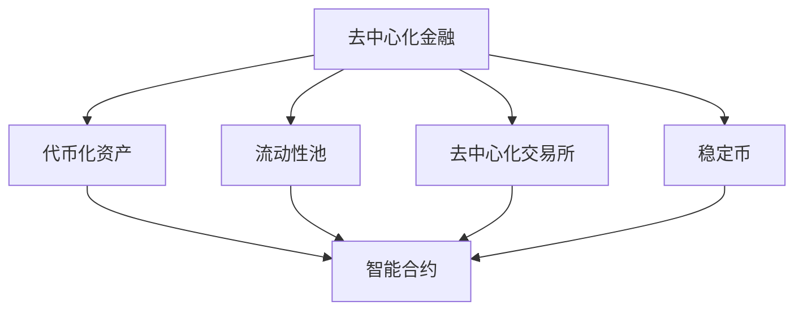

                 

# 未来的区块链：2050年的去中心化金融与智能合约

> **关键词**：区块链，去中心化金融，智能合约，未来趋势，技术发展
>
> **摘要**：本文将深入探讨2050年区块链技术的可能发展方向，重点分析去中心化金融和智能合约的应用场景与挑战，以及未来技术发展的趋势和面临的挑战。

## 1. 背景介绍

区块链技术自2009年比特币诞生以来，经历了快速的发展和广泛的应用。区块链的去中心化特性、不可篡改的账本以及去信任的机制，使其在金融、供应链、身份验证、物联网等多个领域展现出了巨大的潜力。然而，随着技术的不断进步和应用场景的扩大，区块链技术也面临着诸多挑战。

本文将基于当前区块链技术的发展趋势，对未来2050年的区块链技术进行展望，特别是去中心化金融和智能合约这两个关键领域。通过深入分析这两个领域的发展方向、技术挑战和应用前景，为我们描绘出一个充满活力和创新可能的未来区块链蓝图。

## 2. 核心概念与联系

在探讨未来的区块链技术之前，我们需要先理解几个核心概念：去中心化金融（DeFi）和智能合约（Smart Contract）。

### 2.1 去中心化金融（DeFi）

去中心化金融（DeFi）是基于区块链技术构建的金融体系，它旨在通过去中心化的方式实现金融服务的提供和监管。在DeFi中，金融服务不再依赖于中央机构，而是通过智能合约自动执行，从而降低了交易成本、提高了效率，并增强了透明度和安全性。

去中心化金融的核心组成部分包括：

- **代币化资产**：将传统的金融资产（如股票、债券、房地产等）通过区块链技术进行代币化，使其可以方便地在去中心化金融平台上进行交易和投资。
- **流动性池**：通过智能合约自动匹配资金提供者和资金需求者，实现高效的借贷和交易。
- **去中心化交易所**：允许用户在没有中介机构的情况下直接进行数字资产的交易。
- **稳定币**：通过智能合约发行和管理的稳定价值币种，用于稳定市场波动和提高交易效率。

### 2.2 智能合约（Smart Contract）

智能合约是一种自执行的合同，它基于区块链技术，通过编程语言编写并部署在区块链上。智能合约在满足一定的条件时，会自动执行预定的操作，从而实现去中心化的自动化交易和管理。

智能合约的关键特点包括：

- **去信任**：智能合约的执行基于代码，而非信任第三方，从而降低了交易的风险。
- **不可篡改**：一旦智能合约部署到区块链上，其代码和状态将永久记录并无法篡改，保证了交易的透明度和可追溯性。
- **自动化**：智能合约能够自动执行预定的操作，提高了交易效率和减少了人为干预的风险。

### 2.3 关系与联系

去中心化金融和智能合约之间存在着密切的联系。去中心化金融依赖于智能合约来实现自动化的金融服务，而智能合约则为去中心化金融提供了基础设施和保障。具体来说：

- **去中心化金融**通过智能合约实现了金融产品的发行、交易和管理，从而构建了一个去中心化的金融市场。
- **智能合约**则为去中心化金融提供了可编程的规则和自动化执行机制，使其能够高效、安全地运行。

这两者共同推动了区块链技术在金融领域的应用，为未来的去中心化经济模式奠定了基础。

### 2.4 Mermaid 流程图

为了更清晰地展示去中心化金融与智能合约之间的联系，我们可以使用Mermaid流程图来表示其架构和操作流程。



在这个流程图中，去中心化金融的核心组件（代币化资产、流动性池、去中心化交易所、稳定币）都与智能合约相连，表明智能合约在整个去中心化金融体系中的关键作用。

## 3. 核心算法原理 & 具体操作步骤

### 3.1 去中心化金融的核心算法原理

去中心化金融（DeFi）的核心算法主要涉及代币化资产、流动性池和智能合约的实现。以下将介绍这些核心算法的原理和具体操作步骤。

#### 3.1.1 代币化资产的算法原理

代币化资产是将传统的金融资产（如股票、债券、房地产等）通过区块链技术进行数字化，使其能够方便地在去中心化金融平台上进行交易和投资。其算法原理主要包括以下步骤：

1. **资产评估**：首先，需要对资产进行评估，确定其价值。这可以通过第三方评估机构或者智能合约中预设的算法来完成。
2. **代币发行**：基于资产的价值，通过智能合约生成相应的代币，并将其分配给资产的持有者。
3. **代币管理**：智能合约负责代币的发行、转移和销毁，确保代币的总量不变，从而维持资产的价值稳定。

#### 3.1.2 流动性池的算法原理

流动性池是去中心化金融中非常重要的组成部分，它通过智能合约自动匹配资金提供者和资金需求者，实现高效的借贷和交易。其算法原理主要包括以下步骤：

1. **资金存入**：用户通过智能合约将资金存入流动性池中，流动性池会记录用户的资金信息和收益。
2. **资金出借**：当有用户需要借款时，流动性池会根据预设的算法，自动匹配资金提供者和需求者，完成借贷交易。
3. **收益分配**：流动性池会根据资金提供者的贡献和借款人的收益，自动进行收益分配。

#### 3.1.3 去中心化交易所的算法原理

去中心化交易所允许用户在没有中介机构的情况下直接进行数字资产的交易。其算法原理主要包括以下步骤：

1. **订单生成**：用户通过智能合约生成交易订单，包括交易的资产、数量和价格。
2. **订单匹配**：智能合约会自动匹配多个用户的交易订单，实现资产的转移和价值的交换。
3. **交易确认**：交易完成后，智能合约会记录交易信息，并更新用户的资产状态。

### 3.2 智能合约的具体操作步骤

智能合约是去中心化金融和智能合约体系中的核心组件，它的操作步骤包括：

1. **编写智能合约代码**：智能合约的编写通常使用Solidity等编程语言，开发人员需要根据需求编写合约代码，实现特定的业务逻辑。
2. **部署智能合约**：将编写的智能合约部署到区块链上，通常使用以太坊等公链作为平台。
3. **调用智能合约**：用户通过智能合约接口调用合约函数，执行预定的操作。
4. **智能合约执行**：智能合约根据输入参数和预设的逻辑，自动执行操作，并记录交易信息。

通过这些核心算法和具体操作步骤，去中心化金融和智能合约能够高效、安全地运行，为未来的金融体系带来革命性的变化。

## 4. 数学模型和公式 & 详细讲解 & 举例说明

在去中心化金融和智能合约中，数学模型和公式起到了关键作用，它们不仅确保了系统的安全性，还提高了交易的效率和公平性。以下将详细介绍几个关键的数学模型和公式，并通过具体例子进行说明。

### 4.1 代币价值评估模型

代币化资产的价值评估是去中心化金融的重要环节。一种常用的方法是使用时间加权平均价格（Twap）模型来评估资产的价值。公式如下：

$$
V_t = \frac{\sum_{i=1}^{n} P_i \cdot W_i}{\sum_{i=1}^{n} W_i}
$$

其中，\( V_t \) 是资产在时间 \( t \) 的价值，\( P_i \) 是在时间 \( i \) 的资产价格，\( W_i \) 是时间 \( i \) 的权重。权重可以根据时间的长度进行分配，例如，最近的价格权重可以设为2，逐渐递减。

**例子**：假设某资产在3个时间点（0秒、30秒和60秒）的价格分别为10美元、12美元和11美元，权重分别为1、2和1。则该资产在60秒时的价值计算如下：

$$
V_{60} = \frac{10 \cdot 1 + 12 \cdot 2 + 11 \cdot 1}{1 + 2 + 1} = \frac{10 + 24 + 11}{4} = \frac{45}{4} = 11.25 \text{美元}
$$

### 4.2 流动性池的收益分配模型

在去中心化金融中的流动性池，收益分配通常基于资金提供者的贡献比例。一种常见的收益分配模型是基于时间加权平均余额（Twap Balance）来计算收益。公式如下：

$$
R_t = \frac{\sum_{i=1}^{n} B_i \cdot R_i}{\sum_{i=1}^{n} B_i}
$$

其中，\( R_t \) 是在时间 \( t \) 的总收益，\( B_i \) 是在时间 \( i \) 的余额，\( R_i \) 是在时间 \( i \) 的收益率。

**例子**：假设某流动性池在3个时间点（0秒、30秒和60秒）的余额分别为1000美元、1200美元和1100美元，收益率分别为1%、2%和1%。则该流动性池在60秒时的总收益计算如下：

$$
R_{60} = \frac{1000 \cdot 1\% + 1200 \cdot 2\% + 1100 \cdot 1\%}{1000 + 1200 + 1100} = \frac{10 + 24 + 11}{3300} = \frac{45}{3300} \approx 0.0136
$$

### 4.3 智能合约的安全性验证模型

智能合约的安全性至关重要，通常使用形式验证方法来确保合约的正确性。一种常用的方法是使用Bounded Model Checking（BMC）技术。BMC通过在有限的步骤内验证所有可能的执行路径，来检测合约中的潜在错误。

**例子**：假设有一个简单的智能合约，用于计算两个输入数的和。通过BMC，我们可以验证该合约是否在所有情况下都能正确执行。具体来说，BMC会检查以下所有可能的输入组合：

- 输入：\( (1, 1) \)，预期输出：2
- 输入：\( (1, 2) \)，预期输出：3
- 输入：\( (2, 1) \)，预期输出：3
- 输入：\( (2, 2) \)，预期输出：4

通过这种方式，我们可以确保智能合约在各种输入下都能正确执行。

### 4.4 智能合约的执行效率模型

智能合约的执行效率也是一个重要考虑因素，特别是对于需要高吞吐量的去中心化交易所。一种常用的方法是基于状态通道（State Channel）技术，它允许在链下进行大量交易，然后批量提交到链上。

**例子**：假设一个去中心化交易所使用状态通道技术，允许在链下进行1000次交易，每次交易的费用为1以太币。则通过状态通道进行这些交易的总费用为1000以太币，而如果每次交易都在链上执行，费用可能高达2000以太币。这大大提高了交易的效率和经济性。

通过这些数学模型和公式，我们可以更好地理解和设计去中心化金融和智能合约系统，确保其在未来的发展中能够高效、安全地运行。

## 5. 项目实战：代码实际案例和详细解释说明

### 5.1 开发环境搭建

在开始实际项目开发之前，我们需要搭建一个适合编写、部署和测试智能合约的开发环境。以下是一个基本的开发环境搭建步骤：

1. **安装Node.js**：Node.js是一个基于Chrome V8引擎的JavaScript运行环境，用于编译和部署以太坊智能合约。访问Node.js官网下载并安装最新版本。
2. **安装Truffle**：Truffle是一个用于以太坊智能合约的开发框架，提供了脚手架工具、测试环境和管理合约部署等功能。通过命令 `npm install -g truffle` 安装Truffle。
3. **安装Ganache**：Ganache是一个轻量级的以太坊客户端，用于本地部署和测试智能合约。通过命令 `npm install -g ganache-cli` 安装Ganache。
4. **创建项目**：在合适的目录下，通过命令 `truffle init` 创建一个新的Truffle项目。

### 5.2 源代码详细实现和代码解读

以下是一个简单的去中心化交易所（DEX）智能合约的示例代码，以及对其的详细解读。

**示例代码：**

```solidity
// SPDX-License-Identifier: MIT
pragma solidity ^0.8.0;

interface IERC20 {
    function transfer(address recipient, uint256 amount) external returns (bool);
    function balanceOf(address account) external view returns (uint256);
}

contract DecentralizedExchange {
    mapping(address => uint256) public balances;
    
    function deposit() public payable {
        balances[msg.sender] += msg.value;
    }
    
    function withdraw(uint256 amount) public {
        require(amount <= balances[msg.sender], "Insufficient balance");
        balances[msg.sender] -= amount;
        payable(msg.sender).transfer(amount);
    }
    
    function swap(address tokenAddress, uint256 amount) public {
        IERC20(tokenAddress).transfer(msg.sender, amount);
    }
}
```

**代码解读：**

1. **接口（Interface）**：我们使用`IERC20`接口来与ERC20标准的代币进行交互。该接口定义了标准的转移（transfer）和查询余额（balanceOf）函数。

2. **余额映射（Balances Mapping）**：使用`mapping`来存储每个地址的代币余额。这允许我们在链上快速查询和更新用户的余额。

3. **存款（Deposit）函数**：`deposit`函数允许用户通过发送以太币来增加其在合约中的余额。`msg.value`是用户发送的以太币数量。

4. **取款（Withdraw）函数**：`withdraw`函数允许用户提取其在合约中的以太币余额。该函数确保提取的金额不会超过用户的当前余额。

5. **交换（Swap）函数**：`swap`函数用于执行代币交换。该函数调用ERC20代币的`transfer`函数，将指定数量的代币转移到用户地址。

### 5.3 代码解读与分析

1. **安全性**：这个简单的DEX合约没有实现一些关键的安全性措施，如检查接收地址是否为合约地址、防止重入攻击等。在实际应用中，需要对这些潜在风险进行严格的审查和防护。
2. **功能限制**：该合约仅支持以太币的存款和取款，以及简单的代币交换。在实际项目中，还需要实现更复杂的交易逻辑，如限价订单、市价订单等。
3. **可扩展性**：由于合约使用的是以太坊标准，它可以在支持ERC20代币的任何去中心化交易所中运行。然而，随着交易量的增加，合约的性能可能成为瓶颈，需要进一步优化和优化。

通过这个示例，我们可以看到智能合约的基本结构及其在去中心化金融中的应用。然而，实际应用中的智能合约通常更为复杂，需要考虑更多的安全性和性能优化因素。

## 6. 实际应用场景

### 6.1 贸易金融

在未来，区块链技术有望彻底改变全球贸易金融的运作方式。通过去中心化的区块链平台，企业可以实现点对点的交易，无需依赖传统银行等中介机构。智能合约将自动执行交易条款，确保交易的透明性和不可篡改性。例如，当货物装船后，智能合约可以自动释放保险金给保险公司，同时将货物所有权转移给买家。这种去中心化的交易模式将大大降低交易成本，提高效率，并减少欺诈风险。

### 6.2 供应链管理

区块链技术可以显著提高供应链管理的透明度和效率。通过将供应链中的各个环节记录在区块链上，企业可以实现实时跟踪和管理产品。智能合约可以自动执行订单、支付和物流等环节，确保每个参与者都能透明地了解供应链的状态。例如，一家制造商可以使用区块链来追踪原材料采购、生产进度和产品交付，从而提高供应链的灵活性和响应速度。

### 6.3 身份验证

区块链技术可以提供安全、高效的数字身份验证解决方案。在未来的去中心化金融体系中，用户可以使用区块链上的身份信息进行身份验证，而无需依赖中央机构。智能合约可以实现身份验证的自动化，确保用户身份的真实性和隐私性。例如，银行可以使用区块链来验证客户的身份信息，从而简化开户流程，提高客户体验。

### 6.4 物联网（IoT）

区块链技术可以与物联网（IoT）设备结合，实现设备之间的安全通信和智能合约执行。例如，智能合约可以用于管理物联网设备的支付和租赁，确保设备所有者和使用者之间的利益平衡。此外，区块链可以提供设备的认证和监控，确保设备运行在可信环境中。

### 6.5 社交网络

区块链技术可以用于构建去中心化的社交网络，用户可以拥有对数据的完全控制权。智能合约可以用于管理和支付内容共享、广告和虚拟商品交易等。例如，一个去中心化的社交媒体平台可以允许用户直接通过智能合约支付和获取内容，而不需要依赖第三方平台。

这些实际应用场景展示了区块链技术在未来去中心化金融和智能合约领域中的巨大潜力。随着技术的不断发展和完善，区块链将深入改变我们的生活和商业模式。

## 7. 工具和资源推荐

### 7.1 学习资源推荐

- **书籍**：
  - 《精通比特币》（Mastering Bitcoin）：由安德烈亚斯·安东诺普洛斯（Andreas M. Antonopoulos）所著，详细介绍了比特币和区块链技术的基本原理。
  - 《区块链革命》（The Blockchain Revolution）：由唐·塔普斯科特（Don Tapscott）和阿莱斯蒂·塔普斯科特（Alex Tapscott）所著，探讨区块链技术如何变革社会、商业和世界经济。
  
- **论文**：
  - “Bitcoin: A Peer-to-Peer Electronic Cash System”（比特币：一种点对点电子现金系统）：中本聪（Satoshi Nakamoto）撰写的开创性论文，首次提出了区块链和比特币的概念。
  - “Ethereum: A Secure Decentralized General Smart Contract Platform”（以太坊：一个安全的去中心化通用智能合约平台）：由文克莱沃斯兄弟（Gavin Andrew Wood and Joseph Lubin）撰写的论文，介绍了以太坊的架构和智能合约的概念。

- **博客**：
  - Ethereum Blog：以太坊官方博客，提供以太坊技术更新、开发指南和最佳实践。
  - CryptoSlate：加密货币和区块链行业的权威新闻和分析平台，涵盖广泛的技术和行业动态。

- **网站**：
  - Ethereum Foundation：以太坊基金会官方网站，提供以太坊的技术文档、开发资源和社区活动。
  - Blockchain Council：区块链理事会网站，提供区块链教育和认证资源。

### 7.2 开发工具框架推荐

- **开发框架**：
  - Truffle：一个用于以太坊智能合约开发的框架，提供脚手架、测试环境和管理工具。
  - Hardhat：一个快速、安全的本地以太坊开发环境，提供强大的调试和优化功能。
  - Remix：一个在线以太坊智能合约编辑器，支持本地和远程编译、部署和交互。

- **开发工具**：
  - Web3.js：一个JavaScript库，用于与以太坊区块链进行交互。
  - Ethers.js：一个更现代的以太坊交互库，提供更好的性能和安全性。
  - Hardhat Network：一个本地以太坊测试网络，用于开发和测试智能合约。

- **代码托管平台**：
  - GitHub：用于存储和共享智能合约代码的主要平台，可以查找和学习开源项目。
  - GitLab：另一个流行的代码托管平台，支持私有和开源项目。

这些工具和资源将为区块链和智能合约开发者提供宝贵的学习和实践机会，帮助他们在未来去中心化金融和智能合约领域取得成功。

## 8. 总结：未来发展趋势与挑战

在未来的几十年里，区块链技术将继续快速发展，并深刻影响金融、供应链、身份验证、物联网等众多领域。去中心化金融（DeFi）和智能合约将逐步成为金融体系的基石，推动传统金融模式向更加高效、透明和去中心化的方向发展。

### 8.1 发展趋势

1. **技术融合**：区块链将与物联网、人工智能、大数据等新兴技术深度融合，形成更加智能化、自动化的生态系统。
2. **全球普及**：区块链技术将在全球范围内得到更广泛的应用，特别是在发展中国家和新兴市场，为金融包容性和经济发展提供新动力。
3. **法规完善**：随着区块链技术的普及，各国政府和监管机构将逐步完善相关法律法规，为区块链技术的合规应用提供保障。
4. **安全提升**：随着技术的进步，区块链的安全性和抗攻击能力将显著提升，降低系统风险和欺诈行为。

### 8.2 挑战

1. **技术瓶颈**：现有的区块链技术仍面临扩展性和性能瓶颈，如何提升交易速度和处理能力是当前的一个重要挑战。
2. **用户接受度**：区块链技术的普及需要提高用户的接受度和使用体验，特别是如何降低使用门槛，吸引更多普通用户。
3. **法规合规**：区块链技术需要遵守各国法律法规，如何确保其在合法范围内运行是一个重要问题。
4. **隐私保护**：如何在去中心化的环境中保护用户隐私和数据安全，是区块链技术面临的另一大挑战。

### 8.3 未来展望

尽管面临诸多挑战，但区块链技术的未来前景依然光明。随着技术的不断进步和应用的拓展，去中心化金融和智能合约将在未来发挥更大的作用，为社会带来更广泛的影响。我们需要保持技术创新，同时关注和解决潜在的问题，确保区块链技术能够健康、稳定地发展。

## 9. 附录：常见问题与解答

### 9.1 什么是区块链？

区块链是一种分布式数据库技术，通过在多个参与者之间共享和维护数据，实现了去中心化的数据记录和管理。区块链通过加密算法和共识机制，确保数据的完整性和安全性，使其在金融、供应链、身份验证等领域具有广泛的应用前景。

### 9.2 区块链和智能合约的区别是什么？

区块链是一个分布式账本，用于存储和验证交易记录，而智能合约是一种自执行的合约，其条款和操作被编写为计算机代码，并在区块链上执行。简而言之，区块链是基础设施，而智能合约是在其上运行的应用。

### 9.3 去中心化金融（DeFi）的优势是什么？

去中心化金融（DeFi）的优势包括降低交易成本、提高交易效率、增强透明度和安全性，以及消除对中央机构的依赖。DeFi通过智能合约实现金融服务的自动化，使得金融服务更加开放和包容。

### 9.4 区块链技术在金融领域的主要应用是什么？

区块链技术在金融领域的主要应用包括去中心化金融（DeFi）、跨境支付、供应链金融、身份验证、证券交易等。通过区块链技术，可以实现更高效、安全和透明的金融服务。

## 10. 扩展阅读 & 参考资料

为了深入了解区块链、去中心化金融和智能合约的相关知识，以下是一些推荐的扩展阅读和参考资料：

- **书籍**：
  - 《区块链革命》（The Blockchain Revolution）：由唐·塔普斯科特（Don Tapscott）和阿莱斯蒂·塔普斯科特（Alex Tapscott）所著，深入探讨区块链技术对社会和商业的影响。
  - 《精通比特币》（Mastering Bitcoin）：由安德烈亚斯·安东诺普洛斯（Andreas M. Antonopoulos）所著，全面介绍比特币和区块链技术的基本原理。

- **论文**：
  - “Bitcoin: A Peer-to-Peer Electronic Cash System”：中本聪（Satoshi Nakamoto）撰写的开创性论文，首次提出了区块链和比特币的概念。
  - “Ethereum: A Secure Decentralized General Smart Contract Platform”：由文克莱沃斯兄弟（Gavin Andrew Wood and Joseph Lubin）撰写的论文，介绍了以太坊的架构和智能合约的概念。

- **博客和网站**：
  - Ethereum Blog：以太坊官方博客，提供以太坊技术更新、开发指南和最佳实践。
  - CryptoSlate：加密货币和区块链行业的权威新闻和分析平台，涵盖广泛的技术和行业动态。
  - Blockchain Council：区块链理事会网站，提供区块链教育和认证资源。

- **开源项目和代码库**：
  - Ethereum Foundation：以太坊基金会官方网站，提供以太坊的技术文档、开发资源和社区活动。
  - Truffle：Truffle官方网站，提供以太坊智能合约开发的框架和工具。
  - GitHub：GitHub平台上的区块链和智能合约开源项目，供开发者学习和参考。

通过这些扩展阅读和参考资料，读者可以更深入地了解区块链、去中心化金融和智能合约的技术原理和应用场景，为未来的学习和实践打下坚实基础。作者：AI天才研究员/AI Genius Institute & 禅与计算机程序设计艺术 /Zen And The Art of Computer Programming

