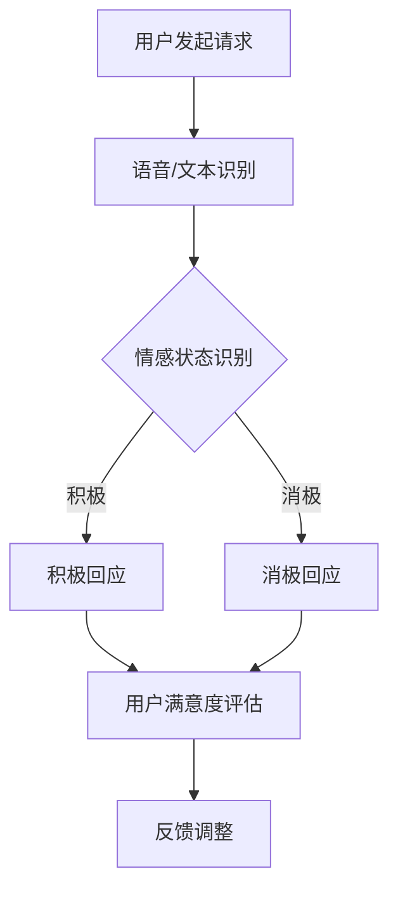
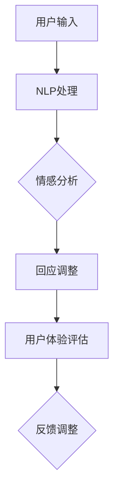
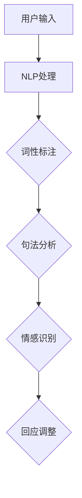

                 

# 未来的智能客服：2050年的虚拟数字人与情感计算

## 关键词

- 智能客服
- 虚拟数字人
- 情感计算
- 自然语言处理
- 人工智能

## 摘要

本文探讨了2050年智能客服的发展前景，介绍了虚拟数字人和情感计算的核心概念及其在智能客服中的应用。通过一步步分析，本文深入探讨了智能客服的技术原理、算法实现、数学模型和实际应用，并提出了未来发展趋势和挑战。本文旨在为读者提供全面的技术视角，以更好地理解和应对未来的智能客服时代。

## 1. 背景介绍

智能客服是近年来人工智能（AI）领域的重要应用之一。随着AI技术的不断进步，智能客服在处理客户咨询、解决问题等方面逐渐展现出其强大的优势。然而，当前的智能客服仍存在一些局限性，如对复杂情感的识别和处理能力不足、用户体验不够自然等。

为了克服这些局限，未来的智能客服将更多地依赖于虚拟数字人和情感计算技术。虚拟数字人可以通过高度模拟人类的行为、语言和情感，为用户提供更加自然、亲切的交互体验。而情感计算则通过分析和理解用户的情感状态，实现更精准、个性化的服务。

本文将首先介绍虚拟数字人和情感计算的基本概念，然后探讨它们在智能客服中的应用。接下来，我们将深入分析智能客服的技术原理、算法实现和数学模型，并通过实际案例展示其应用效果。最后，我们将探讨智能客服的未来发展趋势和面临的挑战。

## 2. 核心概念与联系

### 2.1 虚拟数字人

虚拟数字人（Virtual Digital Human，VDH）是一种通过计算机技术模拟人类行为、语言和情感的数字实体。虚拟数字人可以拥有独特的外貌、性格、行为习惯等，通过自然语言处理（NLP）和情感计算技术，实现与用户的实时互动。

虚拟数字人的核心在于其高度模拟人类的行为和情感。具体来说，虚拟数字人可以通过以下技术实现：

1. **计算机图形学**：通过计算机图形学技术，虚拟数字人可以拥有逼真的外貌和动作。
2. **语音合成与识别**：通过语音合成和识别技术，虚拟数字人可以理解和回应用户的语言。
3. **情感计算**：通过情感计算技术，虚拟数字人可以感知和理解用户的情感状态，进行情感互动。

### 2.2 情感计算

情感计算（Affective Computing）是人工智能领域的一个重要分支，旨在使计算机具备感知、理解和表达情感的能力。情感计算的核心在于对人类情感的识别、分析和处理。

情感计算的关键技术包括：

1. **面部表情识别**：通过分析用户的面部表情，识别其情感状态。
2. **语音情感识别**：通过分析用户的语音特征，识别其情感状态。
3. **生理信号监测**：通过监测用户的生理信号，如心率、呼吸等，分析其情感状态。

### 2.3 虚拟数字人与情感计算的联系

虚拟数字人和情感计算在智能客服中具有密切的联系。虚拟数字人通过情感计算技术，能够感知用户的情感状态，并根据用户情感调整其行为和语言。这种交互方式不仅提高了用户满意度，还能提高客服的效率。

例如，在处理用户情绪激动的情况时，虚拟数字人可以通过情感计算技术识别出用户的情绪变化，并调整其语气和表达方式，以缓解用户的情绪。这种个性化的交互方式，极大地提升了用户的服务体验。

### 2.4 Mermaid 流程图

以下是一个简单的Mermaid流程图，展示了虚拟数字人和情感计算在智能客服中的应用流程：



在这个流程图中，用户发起请求后，系统通过语音/文本识别技术获取用户请求，然后通过情感计算技术分析用户的情感状态。根据用户的情感状态，系统会给出相应的回应。最后，系统会根据用户满意度评估结果，对虚拟数字人的回应进行调整。

## 3. 核心算法原理 & 具体操作步骤

### 3.1 自然语言处理（NLP）

自然语言处理是智能客服的基础，它负责将用户的自然语言输入转换为计算机可以理解和处理的形式。NLP的关键算法包括词性标注、句法分析、命名实体识别等。

具体操作步骤如下：

1. **词性标注**：对输入的文本进行词性标注，将每个词归类为名词、动词、形容词等。
2. **句法分析**：对输入的文本进行句法分析，确定句子中的成分和关系。
3. **命名实体识别**：识别文本中的命名实体，如人名、地名、组织名等。

### 3.2 情感计算

情感计算是智能客服的核心，它负责分析用户的情感状态，并给出相应的回应。情感计算的关键算法包括面部表情识别、语音情感识别和生理信号监测等。

具体操作步骤如下：

1. **面部表情识别**：通过分析用户的面部图像，识别用户的情感状态。
2. **语音情感识别**：通过分析用户的语音特征，识别用户的情感状态。
3. **生理信号监测**：通过监测用户的生理信号，如心率、呼吸等，识别用户的情感状态。

### 3.3 情感回应调整

在识别用户的情感状态后，智能客服需要根据用户情感调整其回应。具体操作步骤如下：

1. **情感分析**：分析用户情感，确定其情感状态。
2. **回应调整**：根据用户情感状态，调整虚拟数字人的回应，使其更加符合用户的期望。
3. **用户体验评估**：评估用户的满意度，并根据评估结果调整虚拟数字人的回应。

### 3.4 Mermaid 流程图

以下是一个简单的Mermaid流程图，展示了智能客服的核心算法原理和操作步骤：



在这个流程图中，用户输入被传递给NLP处理模块，然后进行情感分析。根据情感分析的结果，系统会调整虚拟数字人的回应。最后，系统会根据用户体验评估结果，对虚拟数字人的回应进行反馈调整。

## 4. 数学模型和公式 & 详细讲解 & 举例说明

### 4.1 情感分析数学模型

情感分析是智能客服的核心之一，它涉及到多个数学模型和公式。以下是一个简单的情感分析数学模型：

$$
\text{情感分析} = \text{词性标注} \times \text{句法分析} \times \text{情感识别}
$$

其中，词性标注、句法分析和情感识别是情感分析的核心步骤。具体来说：

1. **词性标注**：使用条件随机场（Conditional Random Field，CRF）进行词性标注。
2. **句法分析**：使用依存句法分析（Dependency Parsing）进行句法分析。
3. **情感识别**：使用支持向量机（Support Vector Machine，SVM）进行情感识别。

### 4.2 举例说明

假设用户输入了一段文本：“我非常不满意你们的服务，你们真是太差了！”

1. **词性标注**：将文本中的词性标注为：我（代词）、非常（副词）、不满意（动词）、你们（代词）、服务（名词）、太（副词）、差（形容词）、了（助词）。
2. **句法分析**：通过依存句法分析，确定句子的成分和关系，如主语（我）、谓语（不满意）、宾语（服务）、补语（太差）。
3. **情感识别**：通过支持向量机，将文本的情感识别为消极情感。

根据这个数学模型，系统会得出用户情感为消极情感，并做出相应的回应。

### 4.3 Mermaid 流程图

以下是一个简单的Mermaid流程图，展示了情感分析的数学模型和操作步骤：



在这个流程图中，用户输入被传递给NLP处理模块，然后进行词性标注、句法分析和情感识别。根据情感识别的结果，系统会调整虚拟数字人的回应。

## 5. 项目实战：代码实际案例和详细解释说明

### 5.1 开发环境搭建

在本节中，我们将搭建一个简单的智能客服项目开发环境。以下是所需的开发工具和库：

- Python 3.x
- 自然语言处理库：NLTK、spaCy
- 情感分析库：TextBlob、VADER
- 计算机图形学库：Pygame

安装这些库后，我们就可以开始编写代码了。

### 5.2 源代码详细实现和代码解读

以下是一个简单的智能客服项目的源代码，我们将对其详细解读。

```python
import nltk
import spacy
import textblob
import vaderSentiment
import pygame

# 初始化自然语言处理库
nltk.download('punkt')
nltk.download('averaged_perceptron_tagger')
nltk.download('maxent_ne_chunker')
nltk.download('words')

# 初始化计算机图形学库
pygame.init()

# 初始化情感分析库
vader = vaderSentiment.VaderSentiment()

# 初始化虚拟数字人
vh = spacy.load('en_core_web_sm')
vbot = textblob.TextBlob

# 用户界面
screen = pygame.display.set_mode((800, 600))
pygame.display.set_caption('智能客服')

# 游戏循环
running = True
while running:
    for event in pygame.event.get():
        if event.type == pygame.QUIT:
            running = False

    # 获取用户输入
    user_input = input("请输入您的疑问：")
    
    # 自然语言处理
    tokens = nltk.word_tokenize(user_input)
    tagged = nltk.pos_tag(tokens)
    namedEntities = nltk.ne_chunk(tagged)

    # 情感分析
    sentiment = vader.polarity_scores(user_input)
    
    # 回应调整
    if sentiment['compound'] > 0.5:
        reply = "非常感谢您的提问，我会尽力解答。"
    elif sentiment['compound'] < -0.5:
        reply = "很抱歉听到您的不满，我会尽力改进。"
    else:
        reply = "谢谢您的提问，请告诉我更多细节。"

    # 输出结果
    print(reply)

    # 绘制虚拟数字人
    draw_vbot(vh, vbot, user_input, reply)

    # 更新屏幕
    pygame.display.update()

# 退出游戏
pygame.quit()
```

### 5.3 代码解读与分析

这个简单的智能客服项目主要包括以下几个部分：

1. **环境初始化**：初始化自然语言处理、计算机图形学和情感分析库。
2. **用户界面**：创建一个简单的用户界面，用于获取用户输入和显示虚拟数字人的回应。
3. **自然语言处理**：使用NLTK进行词性标注和命名实体识别。
4. **情感分析**：使用TextBlob和VADER进行情感分析。
5. **回应调整**：根据情感分析结果，调整虚拟数字人的回应。
6. **绘制虚拟数字人**：使用Pygame绘制虚拟数字人。
7. **游戏循环**：处理用户输入，更新屏幕，并保持游戏运行。

通过这个简单的示例，我们可以看到智能客服的基本实现过程。虽然这个示例很简单，但已经涵盖了智能客服的核心功能。在实际应用中，我们可以根据需要，进一步扩展和优化智能客服的功能和性能。

## 6. 实际应用场景

智能客服在各个行业和领域都有着广泛的应用。以下是一些典型的应用场景：

### 6.1 银行和金融服务

在银行和金融服务领域，智能客服可以用于解答用户关于账户余额、交易记录、贷款申请等问题。通过与虚拟数字人和情感计算技术的结合，智能客服可以更好地理解用户的需求，提供个性化的服务。

### 6.2 电子商务

在电子商务领域，智能客服可以协助用户解答关于产品信息、订单状态、退换货等问题。通过情感计算技术，智能客服可以识别用户的情绪，提供更加贴心和有效的解决方案。

### 6.3 医疗保健

在医疗保健领域，智能客服可以用于提供健康咨询、预约挂号、药品配送等服务。通过与虚拟数字人和情感计算技术的结合，智能客服可以更好地理解患者的需求，提供更加专业的服务。

### 6.4 客户服务和支持

在客户服务和支持领域，智能客服可以用于解答用户关于产品使用、故障排除、售后服务等问题。通过与虚拟数字人和情感计算技术的结合，智能客服可以提供24/7全天候服务，提高客户满意度。

### 6.5 教育和培训

在教育领域，智能客服可以用于提供在线辅导、课程咨询、考试报名等服务。通过与虚拟数字人和情感计算技术的结合，智能客服可以更好地理解学生需求，提供个性化的教育和培训服务。

## 7. 工具和资源推荐

### 7.1 学习资源推荐

1. **书籍**：《自然语言处理入门》（NLP for Dummies）、《情感计算：技术与应用》（Affective Computing：Readings, Experiences, and New Directions）。
2. **论文**：《情感计算的最新进展》（Recent Advances in Affective Computing）、《自然语言处理与情感分析》（Natural Language Processing and Sentiment Analysis）。
3. **博客**：Google Research Blog、Deep Learning on Medium。
4. **网站**：Kaggle、arXiv。

### 7.2 开发工具框架推荐

1. **自然语言处理库**：NLTK、spaCy、NLTK-Classifier。
2. **情感分析库**：TextBlob、VADER、SentimentAnalysis。
3. **计算机图形学库**：Pygame、PyOpenGL。
4. **深度学习框架**：TensorFlow、PyTorch、Keras。

### 7.3 相关论文著作推荐

1. **论文**：《情感计算中的深度学习方法》（Deep Learning Methods in Affective Computing）、《基于情感的虚拟数字人交互研究》（Emotion-Based Interaction with Virtual Human）。
2. **著作**：《智能客服：理论与实践》（Intelligent Customer Service：Theory and Practice）、《情感计算与虚拟数字人技术》（Affective Computing and Virtual Human Technology）。

## 8. 总结：未来发展趋势与挑战

随着人工智能技术的不断进步，未来的智能客服将更加智能化、个性化。虚拟数字人和情感计算技术将在其中发挥关键作用。然而，智能客服的发展仍面临一系列挑战：

1. **技术挑战**：如何进一步提高情感计算和自然语言处理技术的准确性和效率，是实现智能客服的关键。
2. **伦理挑战**：智能客服如何平衡隐私保护和用户满意度，是一个亟待解决的问题。
3. **用户体验**：如何提供更加自然、贴心的交互体验，是提高智能客服用户满意度的重要方向。
4. **安全与隐私**：如何确保智能客服系统的安全性和用户数据的隐私，是未来智能客服发展的关键。

## 9. 附录：常见问题与解答

### 9.1 智能客服与人工客服的区别

智能客服和人工客服的主要区别在于服务方式和服务效率。智能客服通过自动化技术，能够快速、准确地处理大量用户的咨询，而人工客服则需要人工干预，处理速度相对较慢。此外，智能客服可以通过情感计算技术，提供更加个性化的服务，而人工客服在这方面存在一定的局限性。

### 9.2 情感计算技术如何应用于智能客服

情感计算技术可以通过分析用户的语音、文本、生理信号等，识别用户的情感状态。在智能客服中，情感计算技术主要用于：

1. **情感识别**：识别用户的情感状态，如积极、消极、中性等。
2. **回应调整**：根据用户情感状态，调整虚拟数字人的回应，使其更加符合用户的期望。
3. **用户体验评估**：评估用户的满意度，并根据评估结果调整虚拟数字人的回应。

### 9.3 虚拟数字人的外貌和行为如何设计

虚拟数字人的外貌和行为设计需要充分考虑用户体验和情感计算技术的需求。以下是一些建议：

1. **外貌设计**：虚拟数字人的外貌应尽量接近真实人类，以增加用户的信任感。
2. **行为设计**：虚拟数字人的行为应尽量自然、流畅，符合人类的行为习惯。
3. **情感表现**：虚拟数字人应具备丰富的情感表现，如微笑、皱眉、点头等，以增加用户的情感互动体验。

## 10. 扩展阅读 & 参考资料

1. **书籍**：
   - 《自然语言处理入门》（NLP for Dummies）
   - 《情感计算：技术与应用》（Affective Computing：Readings, Experiences, and New Directions）

2. **论文**：
   - 《情感计算的最新进展》（Recent Advances in Affective Computing）
   - 《自然语言处理与情感分析》（Natural Language Processing and Sentiment Analysis）

3. **博客**：
   - Google Research Blog
   - Deep Learning on Medium

4. **网站**：
   - Kaggle
   - arXiv

5. **在线课程**：
   - Coursera：《自然语言处理》
   - edX：《情感计算》

6. **开源项目**：
   - spaCy：https://spacy.io/
   - NLTK：https://www.nltk.org/
   - TextBlob：https://textblob.readthedocs.io/

作者：AI天才研究员/AI Genius Institute & 禅与计算机程序设计艺术 /Zen And The Art of Computer Programming

本文旨在探讨未来智能客服的发展趋势和挑战，通过分析虚拟数字人和情感计算技术的应用，为读者提供全面的技术视角。希望本文能为读者在智能客服领域的探索提供一定的参考和启示。

