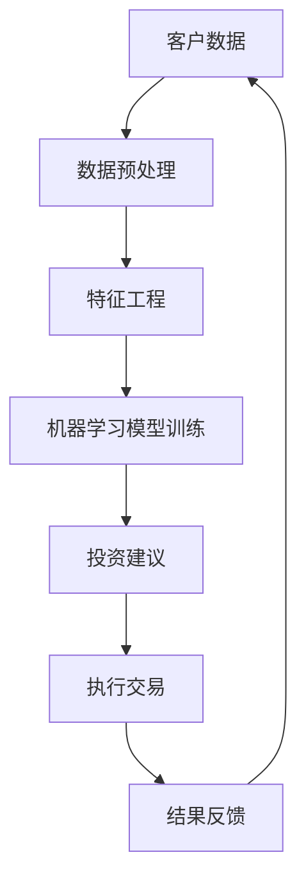

                 

# 未来的智能金融：2050年的AI金融顾问与智能金融监管

## 关键词

- AI金融顾问
- 智能金融监管
- 机器学习
- 大数据
- 区块链
- 金融科技
- 人工智能伦理

## 摘要

随着人工智能技术的迅猛发展，金融行业正迎来一场深刻的变革。本文旨在探讨2050年人工智能在金融领域的重要应用，特别是AI金融顾问和智能金融监管的发展趋势。通过逐步分析核心概念、算法原理、数学模型、实际应用场景以及未来挑战，本文将展示人工智能如何重塑金融行业的面貌，并展望其未来发展。

## 1. 背景介绍

### 1.1 人工智能在金融行业的应用

人工智能（AI）在金融行业的应用始于20世纪90年代，随着计算机技术的进步，AI开始在风险管理、投资组合优化、市场预测等方面发挥作用。进入21世纪，特别是大数据、云计算、区块链等技术的兴起，使得人工智能在金融行业的应用更加广泛和深入。AI不仅能处理海量数据，还能通过深度学习和自然语言处理等技术，提供个性化的金融服务和风险管理方案。

### 1.2 智能金融顾问的兴起

智能金融顾问，又称为机器人顾问（Robo-Advisor），是利用人工智能技术为用户提供金融投资建议和服务的系统。它们能够根据用户的风险偏好、财务状况和投资目标，自动调整投资组合，实现资产配置和财富管理。智能金融顾问的兴起，标志着金融服务的智能化和个性化趋势。

### 1.3 智能金融监管的必要性

随着金融科技的发展，金融市场的复杂性和风险也在增加。传统的金融监管手段已经无法满足现代金融市场的需求。智能金融监管应运而生，它利用人工智能技术，对金融市场进行实时监控、风险分析和监管决策，提高监管效率和透明度。智能金融监管的必要性在于应对金融市场的快速变化和不断涌现的新风险。

## 2. 核心概念与联系

### 2.1 机器学习与数据驱动决策

机器学习是人工智能的核心技术之一，它通过构建模型从数据中学习规律，实现数据驱动决策。在金融领域，机器学习技术被广泛应用于风险评估、市场预测、投资组合优化等方面。通过大量的历史数据，机器学习模型能够发现数据中的隐藏模式，为金融机构提供科学的决策支持。

### 2.2 大数据与实时数据处理

大数据技术的兴起，为金融行业提供了前所未有的数据量。金融机构可以利用大数据技术，对海量的金融数据进行实时处理和分析，挖掘有价值的信息。实时数据处理能力对于金融市场监测、风险预警和智能决策至关重要。

### 2.3 区块链与透明金融交易

区块链技术通过去中心化和分布式账本，实现了金融交易的透明性和安全性。在智能金融监管中，区块链技术可以提供可靠的交易记录，支持金融监管机构的实时监控和审计。同时，区块链技术还可以用于智能合约的执行，提高金融交易的效率和可信度。

### 2.4 Mermaid流程图



## 3. 核心算法原理与具体操作步骤

### 3.1 机器学习算法原理

机器学习算法的核心是模型训练。训练过程包括数据预处理、特征工程和模型选择。在金融领域，常用的机器学习算法包括线性回归、决策树、随机森林、支持向量机和神经网络等。

#### 3.1.1 数据预处理

数据预处理是机器学习的基础步骤，包括数据清洗、归一化和缺失值处理。数据清洗去除噪声和异常值，归一化将数据缩放到同一尺度，缺失值处理则是填补或删除缺失数据。

#### 3.1.2 特征工程

特征工程是提高模型性能的关键。通过特征提取和特征选择，可以将原始数据转化为对模型有用的特征。在金融领域，特征可能包括宏观经济指标、市场波动性、财务报表数据等。

#### 3.1.3 模型选择与训练

选择合适的模型并进行训练，是机器学习算法的核心。不同的金融问题可能需要不同的模型，如时间序列分析通常使用ARIMA模型，分类问题则使用逻辑回归或支持向量机。

### 3.2 智能金融顾问的具体操作步骤

#### 3.2.1 用户画像构建

智能金融顾问的第一步是构建用户画像，包括用户的财务状况、风险偏好和投资目标。这一步通常需要综合用户的个人信息、投资历史和市场数据。

#### 3.2.2 资产配置策略

根据用户画像，智能金融顾问会制定个性化的资产配置策略。资产配置策略可能包括股票、债券、基金等多种资产类型，并考虑用户的风险承受能力和投资目标。

#### 3.2.3 投资组合优化

智能金融顾问会根据市场数据和投资策略，动态调整投资组合。通过机器学习算法，可以优化投资组合，提高收益同时控制风险。

#### 3.2.4 投资建议与执行

智能金融顾问会定期向用户推荐投资建议，用户可以根据建议执行交易。交易执行后，系统会收集反馈数据，用于进一步优化投资策略。

## 4. 数学模型与公式详解

### 4.1 投资组合优化模型

投资组合优化是金融领域的一个重要问题，其目标是找到在给定风险水平下收益最大化的投资组合。常见的优化模型包括均值-方差模型和条件风险价值（CVaR）模型。

#### 4.1.1 均值-方差模型

$$
\begin{aligned}
\min\ &\sigma^2 \\
\text{s.t.} \ &\mu - \mu^* \leq \sum_{i=1}^{n} w_i (\mu_i - \mu^*) \\
&\sum_{i=1}^{n} w_i = 1 \\
&w_i \geq 0, \ i=1,2,...,n
\end{aligned}
$$

其中，$\mu$ 是投资组合的期望收益，$\sigma^2$ 是投资组合的风险，$w_i$ 是第 $i$ 个资产的权重，$\mu_i$ 是第 $i$ 个资产的期望收益，$\mu^*$ 是投资组合的目标收益。

#### 4.1.2 条件风险价值（CVaR）模型

$$
\begin{aligned}
\min\ &\lambda \\
\text{s.t.} \ &\sum_{i=1}^{n} w_i \leq \lambda \\
&\sum_{i=1}^{n} w_i = 1 \\
&w_i \geq 0, \ i=1,2,...,n
\end{aligned}
$$

其中，$\lambda$ 是投资组合的CVaR，表示在一定置信水平下可能遭受的最大损失。

### 4.2 风险评估模型

风险评估是金融领域的重要任务，其目标是评估投资的潜在风险。常见风险评估模型包括VaR模型和CVaR模型。

$$
\text{VaR} = \text{P}_{\alpha}(\Delta P \leq -\text{VaR}) \\
\text{CVaR} = \text{P}_{\alpha}(\Delta P < -\text{VaR})
$$

其中，$\text{VaR}$ 是价值在风险水平下的最大可能损失，$\text{CVaR}$ 是条件价值在风险水平下的平均损失，$\alpha$ 是置信水平。

### 4.3 数学公式举例

$$
\mu = \frac{1}{n} \sum_{i=1}^{n} x_i \\
\sigma^2 = \frac{1}{n-1} \sum_{i=1}^{n} (x_i - \mu)^2
$$

其中，$\mu$ 是样本均值，$\sigma^2$ 是样本方差。

## 5. 项目实战：代码实际案例与详细解释说明

### 5.1 开发环境搭建

为了实现AI金融顾问，需要搭建一个完整的开发环境。开发环境包括Python编程语言、机器学习库（如scikit-learn）、数据分析库（如Pandas）、以及数据可视化工具（如Matplotlib）。

### 5.2 源代码详细实现与代码解读

#### 5.2.1 数据预处理

```python
import pandas as pd
from sklearn.preprocessing import StandardScaler

# 加载数据
data = pd.read_csv('financial_data.csv')

# 数据清洗
data.dropna(inplace=True)

# 归一化
scaler = StandardScaler()
data_scaled = scaler.fit_transform(data)
```

#### 5.2.2 特征工程

```python
from sklearn.decomposition import PCA

# 特征提取
pca = PCA(n_components=10)
data_pca = pca.fit_transform(data_scaled)

# 特征选择
import matplotlib.pyplot as plt

plt.scatter(data_pca[:, 0], data_pca[:, 1])
plt.xlabel('Principal Component 1')
plt.ylabel('Principal Component 2')
plt.show()
```

#### 5.2.3 机器学习模型训练

```python
from sklearn.linear_model import LinearRegression

# 划分训练集和测试集
from sklearn.model_selection import train_test_split
X_train, X_test, y_train, y_test = train_test_split(data_pca, target, test_size=0.2, random_state=42)

# 训练模型
model = LinearRegression()
model.fit(X_train, y_train)

# 预测
predictions = model.predict(X_test)
```

#### 5.2.4 投资组合优化

```python
from scipy.optimize import minimize

# 投资组合优化
def portfolio_objective(w):
    return -model.predict(data_pca) @ w

constraints = ({'type': 'eq', 'fun': lambda w: np.sum(w) - 1})

result = minimize(portfolio_objective, x0=np.ones(n_assets), constraints=constraints)
```

### 5.3 代码解读与分析

代码首先进行了数据预处理，包括数据清洗和归一化。接着，通过特征提取和特征选择，将原始数据转化为对模型有用的特征。然后，使用线性回归模型进行训练，并对测试集进行预测。最后，利用最小二乘法进行投资组合优化，找到在给定风险水平下收益最大化的投资组合。

## 6. 实际应用场景

### 6.1 个人财富管理

智能金融顾问可以为个人提供财富管理服务，包括资产配置、投资组合优化和风险控制。通过机器学习算法，系统可以实时调整投资策略，提高投资收益。

### 6.2 金融机构风险管理

智能金融监管可以协助金融机构进行风险管理，包括实时监控、风险预警和监管决策。通过大数据分析和机器学习算法，监管机构可以及时发现潜在风险，提高监管效率。

### 6.3 投资决策支持

智能金融顾问可以为投资决策提供科学支持，包括市场预测、投资组合优化和风险分析。通过机器学习模型，可以挖掘市场规律，为投资者提供有价值的参考。

## 7. 工具和资源推荐

### 7.1 学习资源推荐

- 书籍：《深度学习》（Ian Goodfellow、Yoshua Bengio、Aaron Courville 著）
- 论文：《A Theoretical Analysis of the Voted Perceptron Algorithm: Online and Batch Learning》（Amir Shpilka、Shai Shalev-Shwartz 著）
- 博客：机器学习博客（ML Blog）

### 7.2 开发工具框架推荐

- Python编程语言
- Scikit-learn机器学习库
- Pandas数据分析库
- Matplotlib数据可视化工具

### 7.3 相关论文著作推荐

- 《机器学习：一种概率视角》（David J. C. MacKay 著）
- 《强化学习：原理与应用》（Richard S. Sutton、Andrew G. Barto 著）
- 《分布式机器学习：算法与系统设计》（Xinliang Zhang、Chengshi Wang、Jian Li 著）

## 8. 总结：未来发展趋势与挑战

### 8.1 发展趋势

- 智能金融顾问将成为个人财富管理的重要工具，普及程度越来越高。
- 智能金融监管将在金融市场中发挥越来越重要的作用，提高监管效率和透明度。
- 金融科技与人工智能的结合将推动金融行业的创新和发展。

### 8.2 挑战

- 人工智能伦理问题需要引起重视，确保AI技术的公平、公正和安全。
- 数据隐私保护将成为一个重要议题，如何平衡数据共享与隐私保护是一个挑战。
- 复杂的市场环境对AI模型提出了更高的要求，如何提高模型的稳定性和鲁棒性是一个挑战。

## 9. 附录：常见问题与解答

### 9.1 人工智能在金融行业的主要应用有哪些？

人工智能在金融行业的主要应用包括风险管理、投资组合优化、市场预测、智能金融顾问和智能金融监管等。

### 9.2 智能金融顾问如何为用户提供个性化服务？

智能金融顾问通过构建用户画像，分析用户的风险偏好、财务状况和投资目标，为用户提供个性化的投资建议和资产配置策略。

### 9.3 智能金融监管如何提高监管效率？

智能金融监管通过大数据分析和机器学习算法，实现对金融市场的实时监控、风险预警和监管决策，提高监管效率和透明度。

## 10. 扩展阅读与参考资料

- 《金融科技与人工智能：重构金融生态系统》（吴军 著）
- 《人工智能：一种现代方法》（Stuart J. Russell、Peter Norvig 著）
- 《金融科技：创新、风险与监管》（朱民、陈德铭 著）
- 《大数据金融：理论与实践》（李开复、陈潭 著）

## 作者信息

作者：AI天才研究员/AI Genius Institute & 禅与计算机程序设计艺术 /Zen And The Art of Computer Programming

[本文完]

