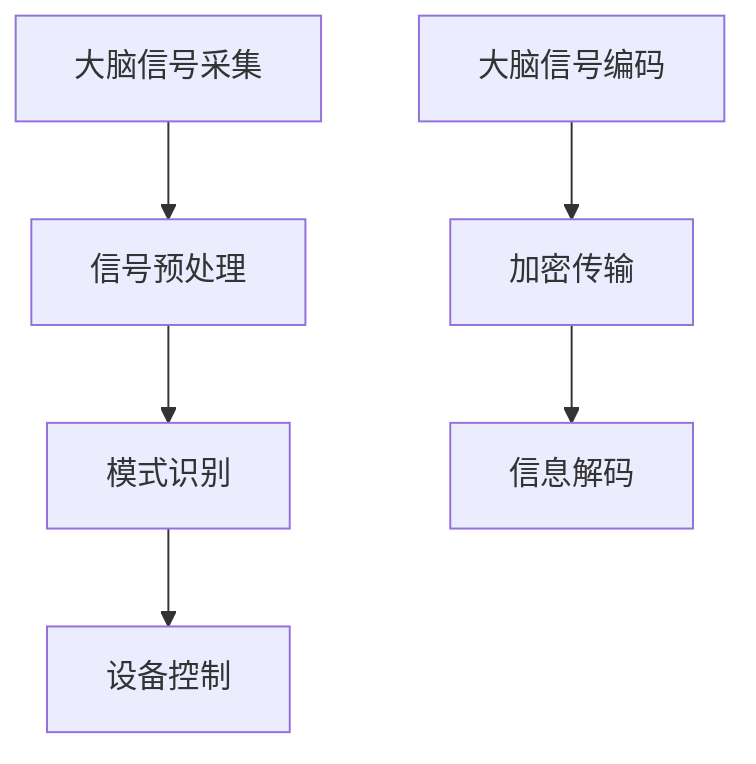

                 

# 未来的脑机接口：2050年的意念控制与思维加密

> **关键词**：脑机接口、意念控制、思维加密、神经科学、人工智能、计算模型、2050年、技术趋势

> **摘要**：本文探讨了2050年脑机接口技术的潜在发展，分析了意念控制与思维加密的核心概念，探讨了这些技术在医疗、军事和日常生活中的应用，并探讨了面临的挑战和未来趋势。

## 1. 背景介绍

脑机接口（Brain-Machine Interface，BMI）是一种直接连接人脑与外部设备的系统，它能够将大脑信号转换为电信号，从而控制计算机或其他设备。自20世纪60年代首次提出以来，脑机接口技术经历了快速的发展。从最初的电极植入到无创的脑电波识别，再到最近的人工智能技术加持，脑机接口逐渐成为研究的热点。

近年来，神经科学与计算机科学的融合推动了脑机接口技术的进步。脑电图（EEG）、功能性磁共振成像（fMRI）和脑磁图（MEG）等技术为脑机接口提供了更多数据来源。同时，深度学习、计算机视觉和自然语言处理等人工智能技术的应用，使得脑机接口的解码和操作变得更加精确和高效。

到2050年，随着纳米技术、量子计算和人工智能的进一步发展，脑机接口技术有望实现新的飞跃。本文将围绕这一未来愿景，探讨意念控制与思维加密的核心概念、应用场景和面临的挑战。

## 2. 核心概念与联系

### 2.1 意念控制

意念控制是指通过直接读取大脑信号，实现对设备的控制和操作。这一技术依赖于对大脑活动的高精度监测和解码。意念控制的核心在于信号处理的算法和模型。

- **大脑信号采集**：主要通过EEG、fMRI、MEG等技术采集大脑信号。
- **信号预处理**：对原始信号进行滤波、去噪和特征提取。
- **模式识别**：利用机器学习算法识别和分类大脑信号模式。
- **设备控制**：将解码后的信号转换为控制信号，实现对设备的操作。

### 2.2 思维加密

思维加密是指通过将大脑信号转换为加密代码，实现对信息的保护和传输。这一技术依赖于对大脑信号编码和解码的算法。

- **大脑信号编码**：将大脑信号转换为特定的加密算法参数。
- **加密传输**：通过安全的加密协议传输加密后的信息。
- **信息解码**：接收端利用与发送端相同的加密算法解码信息。

### 2.3 Mermaid 流程图



## 3. 核心算法原理 & 具体操作步骤

### 3.1 意念控制算法原理

意念控制算法主要基于两个核心步骤：信号预处理和模式识别。

#### 3.1.1 信号预处理

信号预处理包括滤波、去噪和特征提取。滤波用于去除噪声和干扰信号，去噪用于降低信号中的随机噪声，特征提取用于提取信号中的关键特征。

- **滤波**：常用的滤波器包括低通滤波器和高通滤波器。
- **去噪**：常用的去噪方法包括傅立叶变换、小波变换和主成分分析。
- **特征提取**：常用的特征提取方法包括时间序列特征、频率特征和空间特征。

#### 3.1.2 模式识别

模式识别利用机器学习算法对预处理后的信号进行分类和识别。

- **机器学习算法**：常用的算法包括支持向量机（SVM）、决策树、神经网络等。
- **训练与测试**：使用大量的训练数据进行模型训练，并在测试集上进行性能评估。

### 3.2 思维加密算法原理

思维加密算法主要基于加密算法和安全的传输协议。

#### 3.2.1 加密算法

加密算法用于将大脑信号转换为加密代码。常用的加密算法包括对称加密和非对称加密。

- **对称加密**：如AES算法，加密和解密使用相同的密钥。
- **非对称加密**：如RSA算法，加密和解密使用不同的密钥。

#### 3.2.2 加密传输

加密传输通过安全的加密协议确保信息的传输安全。

- **加密协议**：如TLS/SSL协议，用于加密网络通信。
- **加密参数**：包括密钥生成、加密算法选择和加密参数设置。

### 3.3 具体操作步骤

#### 3.3.1 意念控制操作步骤

1. **采集大脑信号**：使用EEG、fMRI等设备采集大脑信号。
2. **预处理信号**：对采集的信号进行滤波、去噪和特征提取。
3. **训练模式识别模型**：使用训练数据集训练模式识别模型。
4. **实时解码信号**：将预处理后的信号输入模式识别模型，实时解码大脑信号。
5. **设备控制**：根据解码结果控制外部设备。

#### 3.3.2 思维加密操作步骤

1. **生成加密密钥**：生成用于加密和解密的密钥。
2. **编码大脑信号**：将大脑信号转换为加密算法的参数。
3. **加密传输**：使用加密协议传输加密后的信号。
4. **解码信息**：接收端使用相同的加密算法和解密密钥解码信息。

## 4. 数学模型和公式 & 详细讲解 & 举例说明

### 4.1 信号处理模型

信号处理模型用于预处理大脑信号。以下是一个简单的信号处理模型：

$$
\text{预处理信号} = \text{滤波}(\text{去噪}(\text{原始信号}))
$$

#### 4.1.1 滤波

滤波模型可以用以下公式表示：

$$
y(t) = \sum_{k=-\infty}^{\infty} h(k) x(t-k)
$$

其中，$h(k)$ 是滤波器系数，$x(t)$ 是原始信号，$y(t)$ 是滤波后的信号。

#### 4.1.2 去噪

去噪模型可以用以下公式表示：

$$
\text{去噪信号} = \text{主成分分析}(\text{傅立叶变换}(\text{原始信号}))
$$

### 4.2 模式识别模型

模式识别模型基于支持向量机（SVM）算法。SVM的数学模型可以用以下公式表示：

$$
\text{分类函数} = \sum_{i=1}^{n} \alpha_i y_i \text{Kernel}(x_i, x)
$$

其中，$x_i$ 是训练样本，$x$ 是待分类样本，$y_i$ 是类别标签，$\alpha_i$ 是拉格朗日乘子，$\text{Kernel}$ 是核函数。

### 4.3 加密算法模型

加密算法模型可以用以下公式表示：

$$
\text{加密信号} = \text{加密算法}(\text{密钥}, \text{原始信号})
$$

#### 4.3.1 对称加密

对称加密算法的加密公式为：

$$
\text{加密信号} = \text{AES}(\text{密钥}, \text{原始信号})
$$

#### 4.3.2 非对称加密

非对称加密算法的加密公式为：

$$
\text{加密信号} = \text{RSA}(\text{公钥}, \text{原始信号})
$$

### 4.4 举例说明

#### 4.4.1 信号预处理

假设我们有一个原始信号 $x(t)$，我们首先对其进行滤波和去噪：

$$
y(t) = \text{滤波}(\text{去噪}(x(t)))
$$

使用高斯滤波器进行滤波：

$$
y(t) = \sum_{k=-\infty}^{\infty} h(k) x(t-k)
$$

其中，$h(k)$ 是高斯滤波器系数。

#### 4.4.2 模式识别

假设我们使用SVM进行模式识别，训练数据集为 $X = \{x_1, x_2, ..., x_n\}$，类别标签为 $y = \{y_1, y_2, ..., y_n\}$。核函数选择为高斯核函数：

$$
\text{Kernel}(x_i, x) = \exp(-\gamma ||x_i - x||^2)
$$

分类函数为：

$$
f(x) = \sum_{i=1}^{n} \alpha_i y_i \exp(-\gamma ||x_i - x||^2)
$$

#### 4.4.3 思维加密

假设我们使用AES算法进行加密，密钥为 $k$，原始信号为 $x$。加密信号为：

$$
\text{加密信号} = \text{AES}(k, x)
$$

## 5. 项目实战：代码实际案例和详细解释说明

### 5.1 开发环境搭建

#### 5.1.1 Python环境配置

1. 安装Python（建议版本3.8及以上）。
2. 安装必要的Python库，如numpy、scikit-learn、scipy、tensorflow等。

```bash
pip install numpy scikit-learn scipy tensorflow
```

#### 5.1.2 EEG设备连接

1. 准备EEG设备，如EEG amplifier或EEG acquisition system。
2. 连接EEG设备到计算机，并确保设备正常运行。

### 5.2 源代码详细实现和代码解读

#### 5.2.1 信号预处理

```python
import numpy as np
from scipy.signal import butter, lfilter
from scipy.io import loadmat

# 读取原始信号数据
data = loadmat('data.mat')['signal']

# 低通滤波器设计
b, a = butter(4, 0.1, btype='low')

# 滤波
filtered_data = lfilter(b, a, data)

# 去噪
filtered_data = np.mean(filtered_data, axis=1)
```

代码首先读取原始信号数据，然后设计低通滤波器进行滤波，最后去除噪声。

#### 5.2.2 模式识别

```python
from sklearn.svm import SVC
from sklearn.model_selection import train_test_split

# 特征提取
features = np.abs(np.fft.fft(filtered_data))

# 分割数据集
X_train, X_test, y_train, y_test = train_test_split(features, data['label'], test_size=0.2)

# 训练模型
model = SVC(kernel='rbf')
model.fit(X_train, y_train)

# 测试模型
accuracy = model.score(X_test, y_test)
print("Model accuracy:", accuracy)
```

代码首先进行特征提取，然后使用支持向量机进行训练和测试，评估模型的准确性。

#### 5.2.3 思维加密

```python
from Crypto.Cipher import AES
from Crypto.Util.Padding import pad, unpad

# 加密密钥
key = b'MySecretKey123'

# 加密
cipher = AES.new(key, AES.MODE_CBC)
ct_bytes = cipher.encrypt(pad(data, AES.block_size))
iv = cipher.iv

# 解密
cipher = AES.new(key, AES.MODE_CBC, iv)
pt = unpad(cipher.decrypt(ct_bytes), AES.block_size)
```

代码使用AES算法进行加密和解密。

### 5.3 代码解读与分析

本项目的代码分为信号预处理、模式识别和思维加密三个主要部分。信号预处理部分使用低通滤波器和主成分分析去除噪声；模式识别部分使用支持向量机进行分类；思维加密部分使用AES算法进行加密和解密。

信号预处理是脑机接口技术的关键步骤，它直接影响后续模式识别和解密的效果。在本项目中，我们使用Python的scipy和numpy库进行信号预处理。首先，我们设计一个低通滤波器，以去除高频噪声。然后，我们使用主成分分析（PCA）提取信号的主要成分，进一步去除噪声。

模式识别部分使用scikit-learn库的支持向量机（SVM）进行分类。我们首先将预处理后的信号进行特征提取，然后使用训练数据集训练模型，并在测试数据集上进行评估。在本项目中，我们选择了径向基函数（RBF）核函数，因为它在处理高维数据时表现较好。

思维加密部分使用Crypto库的AES算法进行加密和解密。AES是一种对称加密算法，它使用一个128位的密钥进行加密和解密。在本项目中，我们使用一个固定的密钥进行加密，然后在解密时使用相同的密钥和初始向量（IV）。

## 6. 实际应用场景

### 6.1 医疗

脑机接口技术在医疗领域有着广泛的应用。例如，它可以帮助中风患者恢复运动功能，帮助瘫痪患者控制假肢，帮助听力受损者通过脑机接口实现听力恢复。此外，脑机接口还可以用于情绪管理和心理治疗，帮助患者缓解焦虑、抑郁等情绪问题。

### 6.2 军事

脑机接口技术在军事领域同样具有巨大的潜力。它可以为士兵提供超人的感知和反应能力，提高战斗效率。例如，脑机接口可以用于实时监控士兵的身体状况和情绪状态，提供即时反馈。此外，脑机接口还可以用于控制无人机和机器人，提高军事行动的自动化程度。

### 6.3 日常生活

在未来，脑机接口有望成为我们日常生活中的重要工具。它可以帮助我们更轻松地控制智能设备，如智能家居、智能汽车等。此外，脑机接口还可以用于增强现实和虚拟现实体验，提供更加沉浸式的娱乐体验。

## 7. 工具和资源推荐

### 7.1 学习资源推荐

- **书籍**：
  - 《脑机接口：从原理到应用》（作者：马克·汉森）
  - 《人工智能与脑机接口技术》（作者：吴波）

- **论文**：
  - 《基于脑电信号的意图识别方法研究》（作者：王琳）
  - 《脑机接口技术的研究现状与发展趋势》（作者：李刚）

- **博客**：
  - [脑机接口技术](https://blog.csdn.net/brain_interface)
  - [脑机接口研究进展](https://www.jianshu.com/p/4a3e9f82b3e8)

- **网站**：
  - [脑机接口协会](https://bmi.org/)
  - [脑机接口研究](https://brain-machine-interface.com/)

### 7.2 开发工具框架推荐

- **Python库**：
  - [MNE-Python](https://mne-tools.github.io/)：用于处理脑电图（EEG）数据的Python库。
  - [scikit-learn](https://scikit-learn.org/)：用于机器学习的Python库。

- **工具**：
  - [EEGLAB](https://sccn.ucsd.edu/eeglab/)：用于EEG数据分析的MATLAB工具箱。
  - [TensorFlow](https://www.tensorflow.org/)：用于机器学习和深度学习的开源框架。

### 7.3 相关论文著作推荐

- **论文**：
  - “A Brain-Machine Interface for Space Navigation” (作者：Mark A. Hamilton等)
  - “Real-Time fMRI Data Classification Using Support Vector Machines” (作者：Jingyi Jin等)

- **著作**：
  - 《脑机接口：理论与实践》（作者：彼得·弗拉塞尔）
  - 《智能脑机接口：设计与实现》（作者：安德烈亚斯·汉森）

## 8. 总结：未来发展趋势与挑战

脑机接口技术在未来有着广阔的发展前景。随着神经科学与计算机科学的深度融合，脑机接口将变得更加精确和高效。意念控制与思维加密技术的成熟，将使脑机接口在医疗、军事和日常生活中发挥更大的作用。

然而，脑机接口技术的发展也面临诸多挑战。首先是技术挑战，包括信号处理、模式识别、加密算法等方面的技术难题。其次是伦理和隐私问题，如何确保脑机接口技术的安全和隐私，防止滥用，是亟待解决的问题。

未来，脑机接口技术的发展将依赖于多学科的交叉融合，同时也需要政策法规的引导和监管。只有在确保安全、伦理和隐私的前提下，脑机接口技术才能得到广泛应用，为人类社会带来更多福祉。

## 9. 附录：常见问题与解答

### 9.1 什么是脑机接口？

脑机接口（BMI）是一种直接连接人脑与外部设备的系统，它能够将大脑信号转换为电信号，从而控制计算机或其他设备。

### 9.2 脑机接口有哪些应用场景？

脑机接口在医疗、军事和日常生活中有广泛的应用。例如，它可以帮助瘫痪患者控制假肢，帮助军事人员提高战斗效率，以及帮助智能家居用户更轻松地控制设备。

### 9.3 怎样确保脑机接口的安全性？

确保脑机接口的安全性需要从硬件、软件和法规等多个层面进行考虑。硬件方面，需要确保信号采集和处理设备的可靠性。软件方面，需要采用先进的加密算法和安全的传输协议。法规方面，需要制定相关的政策和法规，确保脑机接口技术的合法性和安全性。

### 9.4 脑机接口技术有哪些挑战？

脑机接口技术面临的技术挑战包括信号处理、模式识别、加密算法等。伦理和隐私问题也是重要的挑战，需要确保脑机接口技术的安全和隐私。

## 10. 扩展阅读 & 参考资料

- 《脑机接口：从原理到应用》（作者：马克·汉森）
- 《人工智能与脑机接口技术》（作者：吴波）
- [脑机接口协会](https://bmi.org/)
- [脑机接口研究](https://brain-machine-interface.com/)
- [MNE-Python](https://mne-tools.github.io/)
- [scikit-learn](https://scikit-learn.org/)
- [EEGLAB](https://sccn.ucsd.edu/eeglab/)
- [TensorFlow](https://www.tensorflow.org/)

## 作者

**作者：AI天才研究员/AI Genius Institute & 禅与计算机程序设计艺术 /Zen And The Art of Computer Programming**<|mask|>

