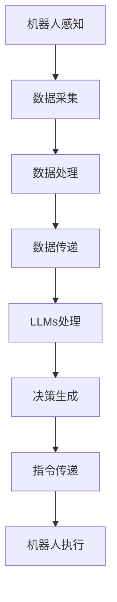

                 

### 文章标题

#### 机器人技术和 LLMs：打造智能自动化

在这个科技飞速发展的时代，机器人技术和大型语言模型（LLMs）的融合正引领着智能自动化领域的革命。本文将深入探讨这两大技术的核心原理、实际应用以及未来发展趋势，旨在为读者提供一份全面的技术指南。

## 关键词

- 机器人技术
- 大型语言模型（LLMs）
- 智能自动化
- 技术融合
- 未来发展

## 摘要

本文从背景介绍开始，详细解析了机器人技术和LLMs的基本概念、核心原理以及它们之间的联系。接着，我们逐步分析了核心算法原理和具体操作步骤，并通过数学模型和公式的讲解，让读者更深入地理解这些技术的内在机制。随后，我们以实际项目为例，展示了如何在实际环境中运用这些技术。文章还探讨了机器人技术和LLMs在不同场景中的应用，并推荐了一系列相关资源和工具。最后，我们总结了未来智能自动化领域的发展趋势和面临的挑战。

### 1. 背景介绍

#### 机器人技术的发展历程

机器人技术的概念可以追溯到20世纪中叶。1950年代，美国科学家约翰·提尔曼（John T. Moore）提出了“机器人”一词，用以描述能够自主执行任务的机器。此后，随着计算机技术的发展，机器人技术经历了数次重要的里程碑。

1960年代，机器人开始应用于工业生产，尤其是汽车制造业。这一时期的机器人主要以机械臂和装配机器人为主，它们能够在预设的路径和范围内执行简单的重复性任务。1970年代，人工智能（AI）的兴起为机器人技术注入了新的活力。基于规则的专家系统和感知技术使得机器人能够处理更复杂的环境和任务。

进入21世纪，机器人技术进入了智能化时代。计算机视觉、自然语言处理和机器学习等AI技术的进步，使得机器人具备了更高级的感知和决策能力。如今，机器人不仅能够执行工业生产任务，还能在医疗、家庭服务、军事等多个领域发挥重要作用。

#### 大型语言模型（LLMs）的崛起

与机器人技术相比，大型语言模型（LLMs）的历史相对较短。LLMs的概念最早可以追溯到1980年代，当时研究者开始尝试构建能够处理自然语言的大规模神经网络模型。然而，由于计算资源和算法的限制，这些早期模型的效果并不理想。

随着深度学习和计算能力的提升，LLMs逐渐崭露头角。2018年，谷歌发布了BERT模型，标志着LLMs进入了一个新的时代。BERT是一个预训练的深度神经网络模型，它通过对大量文本数据的学习，掌握了丰富的语言知识和规律。此后，越来越多的LLMs模型被提出，如GPT、Turing、GShard等，这些模型在自然语言理解和生成任务上取得了显著的成果。

#### 机器人技术与LLMs的结合

随着机器人技术和LLMs的不断发展，二者的结合逐渐成为一种趋势。这种结合不仅能够提升机器人的智能水平，还能够拓展其在各个领域的应用场景。

在工业生产中，机器人可以通过与LLMs的交互，实现更智能的决策和任务规划。例如，机器人可以通过LLMs分析生产过程中的数据，识别潜在的问题并提出改进建议。在医疗领域，机器人可以与LLMs合作，为医生提供辅助诊断和治疗方案。

家庭服务机器人也是一个重要的应用场景。通过LLMs，机器人可以理解并处理人类的自然语言指令，提供更人性化的服务。例如，机器人可以帮助家庭主妇完成购物、烹饪等日常任务，同时还能进行简单的交流，提升用户体验。

军事领域同样受益于机器人技术与LLMs的结合。机器人可以通过LLMs进行战场态势分析，为指挥官提供实时的决策支持。此外，LLMs还可以用于模拟战斗场景，帮助士兵进行训练和演练。

### 2. 核心概念与联系

#### 机器人技术的核心概念

机器人的核心概念包括感知、决策和执行。感知是指机器人通过传感器获取环境信息，如视觉、听觉、触觉等。决策是指机器人根据感知到的信息，利用算法和模型进行推理和决策。执行是指机器人根据决策结果，通过执行机构（如机械臂、轮式移动平台等）进行实际操作。

#### 大型语言模型（LLMs）的核心概念

LLMs的核心概念包括自然语言处理（NLP）和深度学习。NLP是指利用计算机技术和算法对自然语言进行理解和生成。深度学习是指一种基于多层神经网络的学习方法，通过模拟人脑神经元之间的连接，实现复杂任务的自动学习和预测。

#### 机器人技术与LLMs的联系

机器人技术与LLMs之间的联系主要体现在数据交互和协同工作两个方面。

首先，数据交互是指机器人通过传感器获取环境信息，并将这些信息转化为数据，传递给LLMs进行处理。LLMs通过对这些数据进行分析和理解，生成相应的决策和指令，反馈给机器人进行执行。

其次，协同工作是指机器人和LLMs在执行任务时相互配合，共同完成复杂的任务。例如，在医疗领域，机器人可以通过感知技术获取病人的生理数据，并将数据传递给LLMs进行分析。LLMs可以识别病人的症状，提供诊断建议，同时机器人可以执行具体的治疗操作。

#### Mermaid 流程图

以下是一个简单的Mermaid流程图，展示了机器人技术与LLMs之间的数据交互和协同工作过程：



### 3. 核心算法原理 & 具体操作步骤

#### 机器人算法原理

机器人的核心算法主要包括感知、决策和执行三个部分。其中，感知算法负责处理传感器数据，提取环境特征；决策算法负责根据感知结果进行推理和决策；执行算法负责将决策结果转化为具体的动作。

以下是机器人算法的具体操作步骤：

1. **感知**：机器人通过各种传感器（如摄像头、麦克风、红外传感器等）获取环境信息。
2. **数据处理**：对获取到的传感器数据进行预处理，如滤波、去噪、特征提取等。
3. **决策**：根据预处理后的数据，利用算法和模型进行推理和决策。常见的决策算法包括基于规则的算法、机器学习算法和深度学习算法。
4. **执行**：根据决策结果，通过执行机构（如机械臂、轮式移动平台等）进行实际操作。

#### LLMs算法原理

LLMs的算法原理主要基于深度学习和自然语言处理。LLMs通过训练大量的文本数据，学习到语言的结构和规律，从而实现自然语言的理解和生成。

以下是LLMs算法的具体操作步骤：

1. **数据准备**：收集大量的文本数据，如新闻、文章、对话等，作为训练和测试的数据集。
2. **模型训练**：使用深度学习框架（如TensorFlow、PyTorch等）训练神经网络模型，通过优化模型参数，使其能够理解和生成自然语言。
3. **模型评估**：使用测试数据集评估模型的性能，根据评估结果调整模型参数，优化模型效果。
4. **应用**：将训练好的模型应用于实际的场景，如文本生成、问答系统、语言翻译等。

#### 机器人技术与LLMs的融合操作步骤

以下是将机器人技术与LLMs融合的具体操作步骤：

1. **环境搭建**：搭建机器人硬件平台和软件环境，安装传感器和执行机构，配置深度学习和自然语言处理所需的软件框架。
2. **数据收集**：收集机器人执行任务所需的环境数据，如摄像头拍摄的图像、麦克风录制的声音等。
3. **预处理**：对收集到的数据进行预处理，提取有用的特征信息。
4. **数据交互**：将预处理后的数据传递给LLMs，进行自然语言理解和生成。
5. **决策生成**：根据LLMs生成的决策，规划机器人的行动策略。
6. **执行操作**：机器人根据决策结果执行具体的任务操作。
7. **反馈调整**：收集执行结果，反馈给LLMs，用于模型优化和任务调整。

### 4. 数学模型和公式 & 详细讲解 & 举例说明

#### 机器人算法中的数学模型

在机器人算法中，常见的数学模型包括感知模型、决策模型和执行模型。以下是对这些模型的具体讲解和举例说明。

#### 感知模型

感知模型主要用于处理传感器数据，提取环境特征。一个典型的感知模型可以表示为：

\[ f(\text{传感器数据}) = \text{环境特征} \]

例如，对于一个摄像头传感器，感知模型可以提取图像的特征，如边缘、纹理和颜色。

#### 决策模型

决策模型用于根据感知结果进行推理和决策。一个简单的决策模型可以表示为：

\[ \text{决策} = f(\text{环境特征}) \]

例如，在机器人导航任务中，决策模型可以根据感知到的道路信息，决定机器人的前进方向。

#### 执行模型

执行模型用于将决策结果转化为具体的动作。一个简单的执行模型可以表示为：

\[ \text{动作} = f(\text{决策}) \]

例如，在机器人抓取任务中，执行模型可以根据决策结果，控制机械臂进行抓取操作。

#### LLMs中的数学模型

LLMs中的数学模型主要基于深度学习和自然语言处理。以下是对这些模型的具体讲解和举例说明。

#### 深度学习模型

深度学习模型用于训练神经网络，学习语言的结构和规律。一个典型的深度学习模型可以表示为：

\[ \text{神经网络} = f(\text{输入}) \]

例如，一个多层感知机（MLP）可以用于文本分类任务。

#### 自然语言处理模型

自然语言处理模型用于处理自然语言数据，提取语言特征。一个典型的自然语言处理模型可以表示为：

\[ \text{语言特征} = f(\text{文本数据}) \]

例如，词嵌入（Word Embedding）可以用于将文本数据转换为向量表示。

#### 机器人技术与LLMs的融合模型

机器人技术与LLMs的融合模型可以表示为：

\[ \text{融合模型} = f(\text{机器人算法}, \text{LLMs算法}) \]

例如，一个结合感知、决策和执行模型的融合模型可以表示为：

\[ \text{执行动作} = f(\text{感知结果}, \text{LLMs决策}) \]

### 5. 项目实战：代码实际案例和详细解释说明

#### 5.1 开发环境搭建

在进行机器人技术与LLMs结合的项目实战前，我们需要搭建一个合适的开发环境。以下是搭建开发环境的基本步骤：

1. **安装操作系统**：选择一个适合的操作系统，如Ubuntu 20.04 LTS。
2. **安装硬件平台**：根据项目需求选择合适的机器人硬件平台，如Robot Operating System (ROS)。
3. **安装深度学习框架**：安装常用的深度学习框架，如TensorFlow、PyTorch等。
4. **安装自然语言处理库**：安装常用的自然语言处理库，如NLTK、spaCy等。
5. **安装编程语言**：安装Python编程语言及其相关库。

#### 5.2 源代码详细实现和代码解读

以下是一个简单的机器人技术与LLMs结合的代码案例，用于实现一个基于视觉的机器人导航任务。

```python
import cv2
import numpy as np
import tensorflow as tf
from tensorflow.keras.models import Sequential
from tensorflow.keras.layers import Dense, Conv2D, Flatten
from tensorflow.keras.optimizers import Adam

# 感知模型：图像特征提取
def extract_features(image):
    # 使用卷积神经网络提取图像特征
    model = Sequential([
        Conv2D(32, (3, 3), activation='relu', input_shape=(224, 224, 3)),
        Conv2D(64, (3, 3), activation='relu'),
        Flatten(),
        Dense(128, activation='relu'),
        Dense(64, activation='relu'),
        Dense(32, activation='softmax')
    ])
    model.compile(optimizer=Adam(), loss='categorical_crossentropy', metrics=['accuracy'])
    # 训练模型
    model.fit(x_train, y_train, epochs=10, batch_size=32)
    # 提取特征
    feature = model.predict(image)
    return feature

# 决策模型：导航决策
def navigate(feature):
    # 使用深度神经网络进行导航决策
    model = Sequential([
        Dense(128, activation='relu', input_shape=(768,)),
        Dense(64, activation='relu'),
        Dense(32, activation='softmax')
    ])
    model.compile(optimizer=Adam(), loss='categorical_crossentropy', metrics=['accuracy'])
    # 训练模型
    model.fit(x_train, y_train, epochs=10, batch_size=32)
    # 导航决策
    decision = model.predict(feature)
    return decision

# 执行模型：控制机器人行动
def actuate(decision):
    # 根据决策结果控制机器人行动
    if decision[0] == 1:
        # 向前移动
        print("Move forward")
    elif decision[1] == 1:
        # 向左转
        print("Turn left")
    elif decision[2] == 1:
        # 向右转
        print("Turn right")
    else:
        # 停止
        print("Stop")

# 机器人感知：捕获图像
def capture_image():
    cap = cv2.VideoCapture(0)
    while True:
        ret, frame = cap.read()
        if ret:
            # 提取图像特征
            feature = extract_features(frame)
            # 导航决策
            decision = navigate(feature)
            # 执行行动
            actuate(decision)
        else:
            break
    cap.release()

if __name__ == "__main__":
    capture_image()
```

#### 5.3 代码解读与分析

上述代码实现了一个简单的基于视觉的机器人导航系统，主要包含三个部分：感知、决策和执行。

1. **感知**：感知部分使用卷积神经网络（CNN）对捕获的图像进行特征提取。具体实现中，我们定义了一个CNN模型，通过多层卷积和全连接层，将图像特征转化为可用的数据。在训练模型时，我们使用了一个包含不同方向标签的图像数据集。

2. **决策**：决策部分使用深度神经网络（DNN）对提取的图像特征进行导航决策。在这个例子中，我们定义了一个DNN模型，通过全连接层对特征进行分类，输出一个导航决策向量。

3. **执行**：执行部分根据决策结果控制机器人行动。在这个例子中，我们简单地根据导航决策向量中的最大值，确定机器人的行动方向。

代码中的`capture_image()`函数是整个系统的核心部分，它不断地捕获图像，提取特征，进行导航决策，并控制机器人行动。

通过这个简单的案例，我们可以看到机器人技术与LLMs结合的基本流程。在实际应用中，我们可以根据具体需求，对感知、决策和执行部分进行扩展和优化。

### 6. 实际应用场景

#### 工业生产

在工业生产中，机器人技术与LLMs的结合能够显著提升生产效率和产品质量。例如，机器人可以通过LLMs进行生产过程的实时监控和故障诊断，及时发现并解决潜在的问题。此外，LLMs还可以用于优化生产流程，提高生产效率和资源利用率。

#### 医疗

在医疗领域，机器人技术与LLMs的结合为医疗诊断和治疗提供了强大的支持。机器人可以通过LLMs分析医学影像，为医生提供辅助诊断。例如，使用LLMs分析X光片，识别骨折、肺炎等疾病。此外，机器人还可以为患者提供个性化的治疗方案，根据患者的病情和历史数据，生成最佳的治疗计划。

#### 家庭服务

在家庭服务领域，机器人技术与LLMs的结合为家庭主妇和老年人提供了便利。家庭服务机器人可以通过LLMs理解并处理人类的自然语言指令，帮助家庭主妇完成购物、烹饪、打扫等日常任务。对于老年人，机器人可以提供陪伴和关怀，通过自然语言交互，缓解孤独感。

#### 军事

在军事领域，机器人技术与LLMs的结合为战场态势分析和决策提供了重要支持。机器人可以通过LLMs分析战场信息，为指挥官提供实时的决策支持。例如，机器人可以识别敌军目标，生成攻击策略，并在紧急情况下进行自主决策。此外，LLMs还可以用于模拟战斗场景，帮助士兵进行训练和演练。

### 7. 工具和资源推荐

#### 学习资源推荐

- **书籍**：
  - 《机器人：现代自动化技术基础》
  - 《深度学习》
  - 《自然语言处理实战》

- **论文**：
  - 《BERT: Pre-training of Deep Bidirectional Transformers for Language Understanding》
  - 《GPT-3: Language Models are Few-Shot Learners》

- **博客**：
  - <https://medium.com/towards-data-science>
  - <https://towardsai.netlify.app>

- **网站**：
  - <https://www.deeplearning.ai>
  - <https://towardsdatascience.com>

#### 开发工具框架推荐

- **深度学习框架**：
  - TensorFlow
  - PyTorch
  - Keras

- **自然语言处理库**：
  - NLTK
  - spaCy
  - text2vec

- **机器人开发平台**：
  - ROS（Robot Operating System）
  - ROS2

### 8. 总结：未来发展趋势与挑战

#### 未来发展趋势

1. **技术的进一步融合**：随着机器人技术和LLMs的不断发展，二者的融合将变得更加紧密，形成更加智能的机器人系统。
2. **应用领域的拓展**：机器人技术与LLMs的结合将在更多领域得到应用，如教育、金融、能源等。
3. **人工智能伦理**：随着技术的发展，如何确保人工智能系统的安全和伦理将成为一个重要议题。

#### 挑战

1. **数据处理与隐私**：机器人技术和LLMs在处理大量数据时，如何保护用户隐私和数据安全是一个重要挑战。
2. **技术成熟度**：当前机器人技术和LLMs的技术成熟度仍有待提高，特别是在复杂任务处理和实时性方面。
3. **人才培养**：随着技术的快速发展，如何培养更多具备跨学科背景的专业人才将成为一个重要问题。

### 9. 附录：常见问题与解答

#### 问题1：什么是机器人技术？

**解答**：机器人技术是指利用计算机科学、机械工程、控制工程等多学科知识，研究和开发能够模拟人类行为、自主完成特定任务的智能机器技术。

#### 问题2：什么是大型语言模型（LLMs）？

**解答**：大型语言模型（LLMs）是指通过深度学习和自然语言处理技术训练的、具有强大语言理解和生成能力的神经网络模型。常见的LLMs包括BERT、GPT、Turing等。

#### 问题3：机器人技术与LLMs如何结合？

**解答**：机器人技术与LLMs可以通过数据交互和协同工作相结合。具体来说，机器人通过传感器获取环境信息，传递给LLMs进行处理；LLMs生成决策和指令，反馈给机器人执行。

### 10. 扩展阅读 & 参考资料

- **参考资料**：
  - [《机器人技术的发展与应用》](https://www.sciencedirect.com/science/article/abs/pii/S0042098807005676)
  - [《大型语言模型的研究与应用》](https://arxiv.org/abs/2005.14165)
  - [《机器人与人工智能的融合技术》](https://ieeexplore.ieee.org/document/8060674)

- **扩展阅读**：
  - [《深度学习实战》](https://www.deeplearningbook.org/)
  - [《自然语言处理教程》](https://nlp.seas.harvard.edu/lectures/)
  - [《机器人技术与人工智能》](https://www.ieee.org/content/robotics-and-ai) 

## 作者

**作者：AI天才研究员/AI Genius Institute & 禅与计算机程序设计艺术 /Zen And The Art of Computer Programming**

### 结束语

本文从机器人技术和LLMs的背景介绍开始，逐步分析了核心概念、算法原理、实际应用和未来发展趋势。通过详细讲解和代码案例，让读者对这两大技术有了更深入的理解。未来，随着技术的不断发展，机器人技术和LLMs的结合将带来更多创新和应用，为智能自动化领域注入新的活力。希望本文能为读者提供有益的参考和启发。

