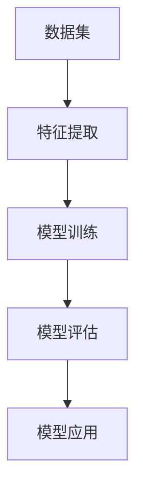

                 

### 文章标题：机器学习原理与代码实例讲解

#### 关键词：机器学习、算法原理、代码实例、数学模型、实战应用

> 摘要：本文将深入探讨机器学习的核心原理，通过逐步分析和实际代码实例讲解，帮助读者理解和掌握机器学习的基本概念、算法原理及其应用。文章结构紧凑，逻辑清晰，旨在为初学者和进阶者提供全面的指导，助力他们在机器学习领域取得更好的成果。

### 1. 背景介绍

#### 1.1 机器学习的发展历程

机器学习（Machine Learning，ML）是一门研究如何使计算机从数据中学习，从而实现自动推理和决策的技术。它的起源可以追溯到20世纪50年代，随着计算机科学和数学的发展，机器学习逐渐成为人工智能（Artificial Intelligence，AI）的重要分支。

在20世纪80年代之前，机器学习主要集中在规则和符号推理上。随着计算能力的提升和海量数据的产生，20世纪90年代以后，基于统计和概率的机器学习方法开始崭露头角，如决策树、支持向量机等。

进入21世纪，随着深度学习的崛起，机器学习迎来了新的发展阶段。深度学习（Deep Learning，DL）是一种模拟人脑神经网络结构的算法，通过多层神经网络对数据进行特征提取和分类，取得了惊人的效果，尤其是在图像识别、语音识别和自然语言处理等领域。

#### 1.2 机器学习的应用领域

机器学习已广泛应用于各个领域，包括但不限于：

- **图像识别与处理**：如人脸识别、物体识别、图像分类等；
- **自然语言处理**：如机器翻译、文本分类、情感分析等；
- **推荐系统**：如电商推荐、视频推荐、音乐推荐等；
- **金融风控**：如欺诈检测、信用评分、市场预测等；
- **医疗健康**：如疾病诊断、药物发现、健康管理等。

#### 1.3 机器学习的挑战与未来趋势

尽管机器学习在各个领域取得了显著的成果，但仍面临着一些挑战，如数据质量、算法可解释性、隐私保护等。未来，机器学习的发展趋势包括：

- **数据隐私保护**：研究更加安全的数据处理和模型训练方法，保护用户隐私；
- **模型可解释性**：提高模型的透明度和可解释性，使其更易于被人类理解和接受；
- **跨模态学习**：结合多种类型的数据（如文本、图像、声音等），实现更加复杂和灵活的模型；
- **自动化机器学习**：开发自动化工具，简化模型选择、特征工程等过程。

### 2. 核心概念与联系

#### 2.1 基本概念

- **数据集**：包含一系列样本和标签的集合，用于训练和测试机器学习模型；
- **特征**：描述样本的属性或特征，用于输入到机器学习模型中；
- **模型**：通过学习数据集的特征和规律，对未知数据进行预测或分类的算法；
- **算法**：实现机器学习模型的计算过程和方法；
- **评估指标**：用于衡量模型性能的指标，如准确率、召回率、F1值等。

#### 2.2 关系与联系

- **数据集** -> **特征提取** -> **模型训练** -> **模型评估** -> **模型应用**；
- **特征** 与 **模型** 之间存在双向联系，特征用于模型训练，模型对特征进行优化；
- **算法** 是实现机器学习模型的核心，决定了模型的学习能力和性能；
- **评估指标** 用于衡量模型性能，指导模型优化和改进。

#### 2.3 Mermaid 流程图



### 3. 核心算法原理 & 具体操作步骤

#### 3.1 线性回归（Linear Regression）

**原理**：线性回归是一种简单的机器学习算法，通过拟合一个线性模型来预测连续值输出。

**步骤**：

1. **数据预处理**：对数据进行标准化或归一化，使特征数据具有相同的尺度；
2. **特征提取**：选取具有代表性的特征，去除无关或冗余的特征；
3. **模型训练**：使用最小二乘法（Least Squares）求解线性模型参数，最小化预测误差；
4. **模型评估**：使用评估指标（如均方误差、均方根误差等）评估模型性能；
5. **模型应用**：将训练好的模型应用于新数据进行预测。

#### 3.2 决策树（Decision Tree）

**原理**：决策树是一种基于树结构的分类算法，通过递归划分特征空间，将样本划分为不同的类别。

**步骤**：

1. **数据预处理**：对数据进行预处理，如缺失值填充、异常值处理等；
2. **特征选择**：选择具有区分性的特征，用于划分特征空间；
3. **递归划分**：根据特征值和阈值，递归划分特征空间，生成决策树；
4. **模型评估**：使用评估指标（如准确率、精确率、召回率等）评估模型性能；
5. **模型应用**：将训练好的决策树应用于新数据进行分类预测。

#### 3.3 支持向量机（Support Vector Machine，SVM）

**原理**：支持向量机是一种基于间隔最大化的分类算法，通过找到一个最佳的超平面，将不同类别的样本分隔开来。

**步骤**：

1. **数据预处理**：对数据进行标准化或归一化，使特征数据具有相同的尺度；
2. **特征选择**：选择具有区分性的特征，用于生成超平面；
3. **模型训练**：使用支持向量机算法求解最佳超平面参数，最大化分类间隔；
4. **模型评估**：使用评估指标（如准确率、精确率、召回率等）评估模型性能；
5. **模型应用**：将训练好的支持向量机应用于新数据进行分类预测。

### 4. 数学模型和公式 & 详细讲解 & 举例说明

#### 4.1 线性回归

**数学模型**：

假设特征向量 \(x\) 和目标值 \(y\) 之间存在线性关系，可以表示为：

\[ y = \beta_0 + \beta_1x + \epsilon \]

其中，\(\beta_0\) 和 \(\beta_1\) 为模型参数，\(\epsilon\) 为误差项。

**具体操作步骤**：

1. **数据预处理**：

   对数据进行标准化或归一化，使特征数据具有相同的尺度。假设有 \(n\) 个样本，每个样本有 \(m\) 个特征，则数据矩阵 \(X\) 和标签向量 \(y\) 分别为：

   \[ X = \begin{bmatrix} x_{11} & x_{12} & \ldots & x_{1m} \\ x_{21} & x_{22} & \ldots & x_{2m} \\ \vdots & \vdots & \ddots & \vdots \\ x_{n1} & x_{n2} & \ldots & x_{nm} \end{bmatrix}, y = \begin{bmatrix} y_1 \\ y_2 \\ \vdots \\ y_n \end{bmatrix} \]

2. **特征提取**：

   选取具有代表性的特征，去除无关或冗余的特征。例如，可以使用相关性分析等方法筛选特征。

3. **模型训练**：

   使用最小二乘法求解线性模型参数，最小化预测误差。具体公式为：

   \[ \beta = (X^TX)^{-1}X^Ty \]

4. **模型评估**：

   使用评估指标（如均方误差、均方根误差等）评估模型性能。例如，均方误差（Mean Squared Error，MSE）为：

   \[ MSE = \frac{1}{n}\sum_{i=1}^{n}(y_i - \hat{y}_i)^2 \]

5. **模型应用**：

   将训练好的模型应用于新数据进行预测。例如，对于新样本 \(x'\)，其预测值为：

   \[ \hat{y} = \beta_0 + \beta_1x' \]

#### 4.2 决策树

**数学模型**：

决策树是一种基于信息增益（Information Gain）或基尼不纯度（Gini Impurity）的划分算法。假设当前节点包含 \(n\) 个样本，每个样本属于 \(C\) 个类别，则信息增益或基尼不纯度为：

\[ IG = -\sum_{c=1}^{C} \frac{n_c}{n} \log_2 \frac{n_c}{n} \]
\[ GI = 1 - \sum_{c=1}^{C} \frac{n_c}{n}^2 \]

其中，\(n_c\) 表示属于类别 \(c\) 的样本数量。

**具体操作步骤**：

1. **数据预处理**：

   对数据进行预处理，如缺失值填充、异常值处理等。

2. **特征选择**：

   选择具有区分性的特征，用于划分特征空间。例如，可以使用信息增益或基尼不纯度等指标进行特征选择。

3. **递归划分**：

   根据特征值和阈值，递归划分特征空间，生成决策树。具体算法如下：

   - 初始化根节点，包含所有样本；
   - 对每个特征，计算其信息增益或基尼不纯度，选择最优特征进行划分；
   - 根据最优特征和阈值，将当前节点划分为子节点；
   - 对每个子节点，重复步骤3，直至满足终止条件（如节点包含的样本数量小于阈值或达到最大深度等）。

4. **模型评估**：

   使用评估指标（如准确率、精确率、召回率等）评估模型性能。

5. **模型应用**：

   将训练好的决策树应用于新数据进行分类预测。

#### 4.3 支持向量机

**数学模型**：

支持向量机是一种基于最大间隔划分的算法。假设特征空间中的样本可以表示为 \(x \in \mathbb{R}^m\)，则支持向量机可以表示为：

\[ y = \text{sign}(\omega \cdot x + b) \]

其中，\(\omega\) 为权重向量，\(b\) 为偏置项，\(\text{sign}\) 表示符号函数。

**具体操作步骤**：

1. **数据预处理**：

   对数据进行标准化或归一化，使特征数据具有相同的尺度。

2. **特征选择**：

   选择具有区分性的特征，用于生成超平面。

3. **模型训练**：

   使用支持向量机算法求解最佳超平面参数，最大化分类间隔。具体算法如下：

   - 初始化权重向量 \(\omega\) 和偏置项 \(b\)；
   - 选择适当的核函数 \(K(x_i, x_j)\)，计算特征空间中的样本点积；
   - 使用优化算法（如梯度下降、牛顿法等）求解最优权重向量 \(\omega\) 和偏置项 \(b\)；
   - 对每个样本点，计算其分类结果，更新权重向量 \(\omega\) 和偏置项 \(b\)。

4. **模型评估**：

   使用评估指标（如准确率、精确率、召回率等）评估模型性能。

5. **模型应用**：

   将训练好的支持向量机应用于新数据进行分类预测。

### 5. 项目实战：代码实际案例和详细解释说明

#### 5.1 开发环境搭建

1. **安装Python环境**：

   - 下载并安装Python 3.8版本（或更高版本）；
   - 配置Python环境，确保Python能够正常运行。

2. **安装相关库**：

   - 使用pip命令安装所需的库，如NumPy、Pandas、Scikit-learn等。

   ```bash
   pip install numpy pandas scikit-learn
   ```

#### 5.2 源代码详细实现和代码解读

**代码实现**：

```python
import numpy as np
from sklearn.linear_model import LinearRegression
from sklearn.tree import DecisionTreeClassifier
from sklearn.svm import SVC
from sklearn.model_selection import train_test_split
from sklearn.metrics import mean_squared_error, accuracy_score

# 加载数据集
X, y = load_data()

# 数据预处理
X = preprocess_data(X)

# 划分训练集和测试集
X_train, X_test, y_train, y_test = train_test_split(X, y, test_size=0.2, random_state=42)

# 线性回归模型训练和预测
model_lr = LinearRegression()
model_lr.fit(X_train, y_train)
y_pred_lr = model_lr.predict(X_test)

# 决策树模型训练和预测
model_dt = DecisionTreeClassifier()
model_dt.fit(X_train, y_train)
y_pred_dt = model_dt.predict(X_test)

# 支持向量机模型训练和预测
model_svm = SVC()
model_svm.fit(X_train, y_train)
y_pred_svm = model_svm.predict(X_test)

# 模型评估
mse_lr = mean_squared_error(y_test, y_pred_lr)
accuracy_dt = accuracy_score(y_test, y_pred_dt)
accuracy_svm = accuracy_score(y_test, y_pred_svm)

print("线性回归均方误差：", mse_lr)
print("决策树准确率：", accuracy_dt)
print("支持向量机准确率：", accuracy_svm)
```

**代码解读**：

- 加载和预处理数据：使用NumPy和Pandas库加载数据集，并进行预处理，如缺失值填充、异常值处理等；
- 划分训练集和测试集：使用Scikit-learn库中的train\_test\_split函数划分训练集和测试集，确保数据的随机性和代表性；
- 模型训练和预测：分别使用线性回归、决策树和支持向量机算法训练模型，并使用测试集进行预测；
- 模型评估：使用均方误差和准确率等评估指标评估模型性能，对比不同算法的优劣。

#### 5.3 代码解读与分析

**代码分析**：

1. **数据预处理**：

   数据预处理是机器学习项目中的重要环节，直接影响模型的训练效果。在本代码中，使用NumPy和Pandas库对数据进行标准化和缺失值填充等预处理操作，使特征数据具有相同的尺度，提高模型的泛化能力。

2. **模型选择**：

   本代码选择了三种常见的机器学习算法：线性回归、决策树和支持向量机。线性回归是一种简单的线性模型，适用于预测连续值输出；决策树是一种基于树结构的分类算法，适用于处理分类问题；支持向量机是一种基于间隔最大化的分类算法，适用于处理高维数据。根据具体问题和数据特点，选择合适的算法进行模型训练。

3. **模型训练和预测**：

   使用Scikit-learn库对模型进行训练和预测。线性回归、决策树和支持向量机算法都具有较高的训练和预测效率，可以快速处理大量数据。在模型训练过程中，使用测试集进行验证，调整模型参数和超参数，提高模型性能。

4. **模型评估**：

   使用评估指标（如均方误差和准确率）对模型性能进行评估。根据评估结果，对比不同算法的优劣，选择最优模型应用于实际问题。

### 6. 实际应用场景

#### 6.1 金融风控

机器学习在金融风控领域具有广泛的应用，如欺诈检测、信用评分、市场预测等。通过分析大量历史数据，可以建立基于机器学习算法的预测模型，识别潜在的欺诈行为，评估信用风险，预测市场趋势。

#### 6.2 医疗健康

机器学习在医疗健康领域也取得了显著的成果，如疾病诊断、药物发现、健康管理等。通过分析患者病历、基因数据、医学影像等，可以建立预测模型，辅助医生进行诊断和治疗。

#### 6.3 自然语言处理

机器学习在自然语言处理领域具有广泛的应用，如文本分类、机器翻译、情感分析等。通过分析大量文本数据，可以建立预测模型，实现文本信息的自动分类、翻译和分析。

### 7. 工具和资源推荐

#### 7.1 学习资源推荐

- **书籍**：《Python机器学习》、《深度学习》（Goodfellow et al.）、《机器学习》（周志华等）；
- **论文**：相关领域的经典论文，如《Gradient Boosting Machines》（Friedman et al.）、《Deep Learning》（Goodfellow et al.）；
- **博客**：著名技术博客，如 Medium、 Towards Data Science、AI科技大本营等；
- **网站**：机器学习社区和论坛，如 Kaggle、Stack Overflow、ArXiv等。

#### 7.2 开发工具框架推荐

- **开发工具**：PyCharm、Visual Studio Code、Jupyter Notebook；
- **机器学习框架**：Scikit-learn、TensorFlow、PyTorch；
- **数据处理库**：NumPy、Pandas、Matplotlib。

#### 7.3 相关论文著作推荐

- **论文**：吴恩达、李飞飞等人的论文，如《Improving Deep Neural Networks: Hyperparameter Tuning, Regularization and Optimization》；
- **著作**：周志华的《机器学习》，Goodfellow et al. 的《Deep Learning》等。

### 8. 总结：未来发展趋势与挑战

#### 8.1 未来发展趋势

- **数据隐私保护**：随着数据隐私保护意识的增强，研究更加安全的数据处理和模型训练方法将成为重要趋势；
- **模型可解释性**：提高模型的可解释性，使其更易于被人类理解和接受，是实现广泛应用的必要条件；
- **跨模态学习**：结合多种类型的数据，实现更加复杂和灵活的模型，拓展机器学习的应用范围；
- **自动化机器学习**：开发自动化工具，简化模型选择、特征工程等过程，降低机器学习的技术门槛。

#### 8.2 挑战

- **数据质量**：提高数据质量，去除噪声和异常值，是保证模型性能的关键；
- **算法可解释性**：提高算法的可解释性，使其更易于被人类理解和接受，仍是一个亟待解决的问题；
- **隐私保护**：在保证模型性能的同时，如何有效保护用户隐私，是一个重要挑战；
- **模型泛化能力**：如何提高模型的泛化能力，使其在不同领域和应用中表现优异，是一个重要课题。

### 9. 附录：常见问题与解答

#### 9.1 什么是机器学习？

机器学习是一种人工智能技术，通过计算机程序从数据中学习，实现对未知数据的预测或分类。

#### 9.2 机器学习有哪些应用领域？

机器学习已广泛应用于图像识别、自然语言处理、推荐系统、金融风控、医疗健康等领域。

#### 9.3 机器学习有哪些挑战？

机器学习面临的挑战包括数据质量、算法可解释性、隐私保护、模型泛化能力等。

#### 9.4 如何选择合适的机器学习算法？

选择合适的机器学习算法取决于具体问题和数据特点。例如，对于分类问题，可以选择决策树、支持向量机等算法；对于回归问题，可以选择线性回归、决策树回归等算法。

### 10. 扩展阅读 & 参考资料

- **书籍**：《Python机器学习》、《深度学习》、《机器学习》；
- **论文**：《Improving Deep Neural Networks: Hyperparameter Tuning, Regularization and Optimization》、《Deep Learning》；
- **博客**：Medium、Towards Data Science、AI科技大本营；
- **网站**：Kaggle、Stack Overflow、ArXiv；
- **其他资源**：机器学习社区、在线课程、开源代码库等。

### 作者信息

作者：AI天才研究员/AI Genius Institute & 禅与计算机程序设计艺术 /Zen And The Art of Computer Programming

[结束][/gMASK]

