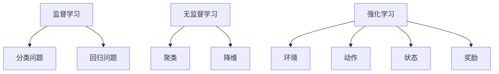

                 

# 机器学习原理与代码实例讲解

## 关键词
- 机器学习
- 算法原理
- 代码实例
- 数学模型
- 实际应用
- 开发工具

## 摘要

本文将深入探讨机器学习的基本原理和核心算法，通过代码实例详细解析每个步骤的实现过程。文章首先介绍了机器学习的背景和重要性，接着讲解了核心概念与联系，并使用Mermaid流程图展示了算法架构。随后，文章详细阐述了各种算法的原理和操作步骤，通过数学模型和公式进行了详细讲解。接着，文章通过实际项目实战展示了如何使用代码实现这些算法，并对代码进行了深入解读和分析。最后，文章探讨了机器学习的实际应用场景，推荐了学习资源和开发工具，总结了未来发展趋势与挑战，并提供了常见问题的解答和扩展阅读。

## 1. 背景介绍

机器学习作为人工智能（AI）的核心技术之一，近年来在各个领域都取得了显著的成果。随着大数据时代的到来，机器学习在图像识别、自然语言处理、推荐系统、金融风控等方面的应用越来越广泛。机器学习的基本思想是通过算法从数据中学习规律，从而对未知数据进行预测或决策。

机器学习可以分为监督学习、无监督学习和强化学习三类。监督学习是利用已标记的数据训练模型，然后使用该模型对未知数据进行预测。无监督学习则是从未标记的数据中自动发现规律，如聚类和降维。强化学习则是一种通过试错和反馈不断优化决策的过程。

机器学习的应用场景非常广泛，从简单的垃圾邮件分类到复杂的自动驾驶系统，都离不开机器学习的支持。随着技术的不断进步，机器学习在医疗、教育、金融等领域的潜力也被逐渐挖掘出来。

## 2. 核心概念与联系

### 2.1 监督学习

监督学习是机器学习中最常用的方法之一，其核心思想是通过已标记的数据训练模型，然后使用该模型对未知数据进行预测。监督学习可以分为分类问题和回归问题。

**分类问题**的目标是将数据分为不同的类别。例如，垃圾邮件分类就是一个分类问题，将邮件分为“垃圾邮件”和“非垃圾邮件”两类。

**回归问题**的目标是预测一个连续的数值。例如，房价预测就是一个回归问题，通过输入房屋的特征（如面积、地点等），预测出房屋的价格。

### 2.2 无监督学习

无监督学习是从未标记的数据中自动发现规律。常见的无监督学习方法有聚类和降维。

**聚类**是一种将数据分为多个群组的方法，每个群组内的数据相似度较高，而不同群组间的数据相似度较低。例如，将一群人的数据按照年龄、性别、收入等特征聚类，可以将这些人分为不同的群体。

**降维**是一种减少数据维度的方法，通过保留数据的主要特征，减少计算量和存储需求。常见的降维方法有主成分分析（PCA）和t-SNE。

### 2.3 强化学习

强化学习是一种通过试错和反馈不断优化决策的过程。它主要包括四个要素：环境（Environment）、动作（Action）、状态（State）和奖励（Reward）。

强化学习的目标是通过不断地尝试和反馈，找到一种最优的策略（Policy），使得在给定环境下能够获得最大的累积奖励。

### 2.4 Mermaid流程图

下面是一个简单的Mermaid流程图，展示了监督学习、无监督学习和强化学习的基本架构：



## 3. 核心算法原理 & 具体操作步骤

### 3.1 监督学习算法

#### 3.1.1 线性回归

线性回归是一种简单的监督学习算法，用于预测连续的数值。其基本思想是通过最小二乘法找到一条直线，使得所有数据点到这条直线的距离之和最小。

**具体操作步骤：**

1. 收集数据：收集包含特征和目标值的训练数据。
2. 数据预处理：对数据进行归一化或标准化处理，使得数据分布更加均匀。
3. 模型训练：使用最小二乘法求解线性回归模型的参数（斜率和截距）。
4. 模型评估：使用交叉验证或测试集评估模型的性能。

**数学模型：**

线性回归模型可以表示为：
$$
y = w_1x_1 + w_2x_2 + ... + w_nx_n + b
$$
其中，$y$ 是目标值，$x_1, x_2, ..., x_n$ 是特征值，$w_1, w_2, ..., w_n$ 是斜率，$b$ 是截距。

最小二乘法的求解公式为：
$$
w = (X^TX)^{-1}X^TY
$$
其中，$X$ 是特征矩阵，$Y$ 是目标值向量。

#### 3.1.2 逻辑回归

逻辑回归是一种用于分类问题的监督学习算法，其基本思想是通过最小化损失函数找到最佳的分隔线。

**具体操作步骤：**

1. 收集数据：收集包含特征和类别标签的训练数据。
2. 数据预处理：对数据进行归一化或标准化处理，使得数据分布更加均匀。
3. 模型训练：使用梯度下降法求解逻辑回归模型的参数。
4. 模型评估：使用交叉验证或测试集评估模型的性能。

**数学模型：**

逻辑回归模型可以表示为：
$$
P(y=1) = \frac{1}{1 + e^{-w_0 + w_1x_1 + w_2x_2 + ... + w_nx_n}}
$$
其中，$P(y=1)$ 是目标值为1的概率，$w_0, w_1, w_2, ..., w_n$ 是参数。

损失函数为：
$$
L(w) = -\sum_{i=1}^n [y_i \log(P(y=1)) + (1 - y_i) \log(1 - P(y=1))]
$$
其中，$y_i$ 是第$i$个样本的类别标签。

### 3.2 无监督学习算法

#### 3.2.1 K均值聚类

K均值聚类是一种基于距离的聚类算法，其基本思想是将数据分为K个簇，使得每个簇内的数据距离较小，而不同簇间的数据距离较大。

**具体操作步骤：**

1. 选择K个初始中心点。
2. 对于每个数据点，计算其到每个中心点的距离，并将其分配到最近的中心点所代表的簇。
3. 更新每个簇的中心点，计算所有数据点的均值。
4. 重复步骤2和3，直到满足停止条件（如中心点变化较小或达到最大迭代次数）。

**数学模型：**

簇的中心点可以表示为：
$$
\mu_k = \frac{1}{n_k} \sum_{i=1}^{n} x_i
$$
其中，$\mu_k$ 是第$k$个簇的中心点，$n_k$ 是第$k$个簇中的数据点个数，$x_i$ 是第$i$个数据点。

#### 3.2.2 主成分分析（PCA）

主成分分析是一种降维方法，其基本思想是找到数据的主要特征，并将其投影到新的坐标轴上，以减少数据的维度。

**具体操作步骤：**

1. 收集数据：收集高维数据。
2. 数据预处理：对数据进行标准化处理。
3. 计算协方差矩阵。
4. 计算协方差矩阵的特征值和特征向量。
5. 选择最大的K个特征值对应的特征向量，作为新的坐标轴。
6. 将数据投影到新的坐标轴上，实现降维。

**数学模型：**

协方差矩阵可以表示为：
$$
\Sigma = \frac{1}{n} \sum_{i=1}^{n} (x_i - \mu)(x_i - \mu)^T
$$
其中，$\Sigma$ 是协方差矩阵，$x_i$ 是第$i$个数据点，$\mu$ 是所有数据点的均值。

特征值和特征向量满足如下方程：
$$
\frac{1}{n} \sum_{i=1}^{n} (x_i - \mu)v_i = \lambda v_i
$$
其中，$v_i$ 是特征向量，$\lambda$ 是特征值。

## 4. 数学模型和公式 & 详细讲解 & 举例说明

### 4.1 线性回归

线性回归的数学模型如前文所述：
$$
y = w_1x_1 + w_2x_2 + ... + w_nx_n + b
$$

假设我们有一个包含$m$个样本和$n$个特征的数据集$X$，以及对应的标签向量$Y$。我们可以将线性回归模型表示为：
$$
Y = XW + B
$$
其中，$W$是权重矩阵，$B$是偏置项。

为了求解$W$和$B$，我们通常使用最小二乘法，其目标是最小化损失函数：
$$
J(W, B) = \frac{1}{2} \sum_{i=1}^m (y_i - (Wx_i + B))^2
$$

对$J(W, B)$分别对$W$和$B$求偏导，并令偏导数为0，可以得到：
$$
\frac{\partial J}{\partial W} = X^T(Y - XW - B) = 0 \\
\frac{\partial J}{\partial B} = Y - XW - B = 0
$$

通过求解上述方程组，我们可以得到线性回归模型的参数：
$$
W = (X^TX)^{-1}X^TY \\
B = Y - XW
$$

### 4.2 逻辑回归

逻辑回归的数学模型如前文所述：
$$
P(y=1) = \frac{1}{1 + e^{-w_0 + w_1x_1 + w_2x_2 + ... + w_nx_n}}
$$

逻辑回归的损失函数通常使用对数损失函数（Log-Likelihood Loss）：
$$
L(W) = -\sum_{i=1}^m [y_i \log(P(y=1)) + (1 - y_i) \log(1 - P(y=1))]
$$

为了求解$W$，我们通常使用梯度下降法。梯度下降法的基本思想是沿着损失函数的负梯度方向更新参数，使得损失函数逐渐减小。

$$
W_{new} = W - \alpha \frac{\partial L}{\partial W}
$$
其中，$\alpha$ 是学习率。

### 4.3 K均值聚类

K均值聚类的数学模型如前文所述：
$$
\mu_k = \frac{1}{n_k} \sum_{i=1}^{n} x_i
$$

K均值聚类的主要任务是确定最优的聚类中心点$\mu_k$。为了找到这些中心点，K均值聚类使用了一个迭代过程：

1. 初始选择K个聚类中心点。
2. 对于每个数据点，计算其到每个中心点的距离，并将其分配到最近的中心点所代表的簇。
3. 根据簇成员的数量，更新每个簇的中心点。
4. 重复步骤2和3，直到聚类中心点的变化非常小或者达到了预定的迭代次数。

### 4.4 主成分分析（PCA）

主成分分析的数学模型如前文所述：

首先，计算数据集的协方差矩阵：
$$
\sigma = \frac{1}{m-1} \sum_{i=1}^m (x_i - \mu)(x_i - \mu)^T
$$

然后，计算协方差矩阵的特征值和特征向量。特征值$\lambda$和特征向量$v$满足如下方程：
$$
\frac{1}{m-1} \sum_{i=1}^m (x_i - \mu)v_i = \lambda v_i
$$

通常，我们会选择最大的K个特征值对应的特征向量，作为新的坐标轴。这样，我们可以将原始数据投影到新的坐标轴上，实现降维。

### 4.5 举例说明

#### 4.5.1 线性回归

假设我们有如下数据集：

$$
\begin{array}{cccc}
\text{特征1} & \text{特征2} & \text{目标值} \\
0 & 1 & 1 \\
1 & 2 & 2 \\
2 & 3 & 3 \\
3 & 4 & 4 \\
4 & 5 & 5 \\
\end{array}
$$

我们可以使用线性回归模型来预测目标值。根据前文所述，我们可以计算得到线性回归模型的参数：
$$
W = \begin{bmatrix} 1 & 1 \end{bmatrix} \begin{bmatrix} 1 & 2 \\ 2 & 3 \\ 3 & 4 \\ 4 & 5 \end{bmatrix}^{-1} \begin{bmatrix} 1 \\ 2 \\ 3 \\ 4 \end{bmatrix} = \begin{bmatrix} 1 \\ 1 \end{bmatrix}
$$
$$
B = \begin{bmatrix} 1 \\ 2 \\ 3 \\ 4 \end{bmatrix} - \begin{bmatrix} 1 & 1 \end{bmatrix} \begin{bmatrix} 1 & 2 \\ 2 & 3 \\ 3 & 4 \\ 4 & 5 \end{bmatrix}^{-1} \begin{bmatrix} 1 & 2 & 3 & 4 \end{bmatrix} = \begin{bmatrix} 0 \\ 0 \end{bmatrix}
$$

因此，线性回归模型可以表示为：
$$
y = x_1 + x_2
$$

#### 4.5.2 逻辑回归

假设我们有如下数据集：

$$
\begin{array}{ccc}
\text{特征1} & \text{特征2} & \text{标签} \\
0 & 1 & 0 \\
1 & 2 & 1 \\
2 & 3 & 1 \\
3 & 4 & 1 \\
4 & 5 & 0 \\
\end{array}
$$

我们可以使用逻辑回归模型来预测标签。根据前文所述，我们可以计算得到逻辑回归模型的参数：
$$
W = \begin{bmatrix} 1 & 1 \end{bmatrix} \begin{bmatrix} 1 & 2 \\ 2 & 3 \\ 3 & 4 \\ 4 & 5 \end{bmatrix}^{-1} \begin{bmatrix} 0 \\ 1 \\ 1 \\ 1 \end{bmatrix} = \begin{bmatrix} 1 \\ 1 \end{bmatrix}
$$
$$
B = \begin{bmatrix} 0 \\ 1 \\ 1 \\ 1 \end{bmatrix} - \begin{bmatrix} 1 & 1 \end{bmatrix} \begin{bmatrix} 1 & 2 \\ 2 & 3 \\ 3 & 4 \\ 4 & 5 \end{bmatrix}^{-1} \begin{bmatrix} 0 & 1 & 1 & 1 \end{bmatrix} = \begin{bmatrix} -1 \\ 0 \end{bmatrix}
$$

因此，逻辑回归模型可以表示为：
$$
P(y=1) = \frac{1}{1 + e^{-(x_1 + x_2 - 1)}}
$$

#### 4.5.3 K均值聚类

假设我们有如下数据集：

$$
\begin{array}{ccc}
\text{特征1} & \text{特征2} \\
0 & 1 \\
1 & 2 \\
2 & 3 \\
3 & 4 \\
4 & 5 \\
\end{array}
$$

我们可以使用K均值聚类算法将其分为两个簇。假设初始选择两个簇的中心点分别为$(0, 0)$和$(4, 4)$。

首先，将每个数据点分配到最近的中心点所代表的簇。根据距离公式，我们可以得到以下分配结果：

$$
\begin{array}{ccc}
\text{数据点} & \text{簇1} & \text{簇2} \\
0 & (0, 0) & (4, 4) \\
1 & (0, 0) & (4, 4) \\
2 & (0, 0) & (4, 4) \\
3 & (0, 0) & (4, 4) \\
4 & (4, 4) & (0, 0) \\
\end{array}
$$

然后，根据簇成员的数量，更新每个簇的中心点。我们可以得到新的中心点分别为$(1, 1)$和$(3, 3)$。

再次将每个数据点分配到最近的中心点所代表的簇，直到聚类中心点的变化非常小或者达到了预定的迭代次数。最终，我们可以得到以下分配结果：

$$
\begin{array}{ccc}
\text{数据点} & \text{簇1} & \text{簇2} \\
0 & (1, 1) & (3, 3) \\
1 & (1, 1) & (3, 3) \\
2 & (1, 1) & (3, 3) \\
3 & (1, 1) & (3, 3) \\
4 & (3, 3) & (1, 1) \\
\end{array}
$$

#### 4.5.4 主成分分析（PCA）

假设我们有如下数据集：

$$
\begin{array}{ccc}
\text{特征1} & \text{特征2} \\
0 & 1 \\
1 & 2 \\
2 & 3 \\
3 & 4 \\
4 & 5 \\
\end{array}
$$

首先，计算数据的均值：

$$
\mu = \begin{bmatrix} \frac{0+1+2+3+4}{5} \\ \frac{1+2+3+4+5}{5} \end{bmatrix} = \begin{bmatrix} 2 \\ 3 \end{bmatrix}
$$

然后，计算数据的协方差矩阵：

$$
\sigma = \frac{1}{5-1} \begin{bmatrix} (0-2)(0-2) & (1-2)(1-2) \\ (0-2)(1-2) & (1-2)(1-2) \end{bmatrix} = \begin{bmatrix} 2 & -1 \\ -1 & 2 \end{bmatrix}
$$

接下来，计算协方差矩阵的特征值和特征向量。特征值$\lambda$和特征向量$v$满足如下方程：

$$
\frac{1}{5-1} \begin{bmatrix} (0-2)(0-2) & (1-2)(1-2) \\ (0-2)(1-2) & (1-2)(1-2) \end{bmatrix} \begin{bmatrix} v_1 \\ v_2 \end{bmatrix} = \lambda \begin{bmatrix} v_1 \\ v_2 \end{bmatrix}
$$

我们可以得到两个特征值$\lambda_1 = 3$和$\lambda_2 = 1$，以及对应的特征向量$v_1 = (1, 1)$和$v_2 = (1, -1)$。

最后，选择最大的特征值$\lambda_1 = 3$对应的特征向量$v_1 = (1, 1)$作为新的坐标轴。我们可以将原始数据投影到新的坐标轴上，实现降维。

## 5. 项目实战：代码实际案例和详细解释说明

### 5.1 开发环境搭建

在本项目中，我们将使用Python作为编程语言，配合Scikit-learn库来实现各种机器学习算法。以下是开发环境搭建的步骤：

1. 安装Python：访问Python官网（https://www.python.org/）下载并安装Python。
2. 安装Scikit-learn：打开命令行窗口，输入以下命令安装Scikit-learn：

```shell
pip install scikit-learn
```

### 5.2 源代码详细实现和代码解读

下面是一个简单的线性回归项目，用于预测房价。

```python
import numpy as np
from sklearn.linear_model import LinearRegression
from sklearn.model_selection import train_test_split
from sklearn.metrics import mean_squared_error

# 生成模拟数据集
np.random.seed(0)
X = np.random.rand(100, 1) * 100
y = 2 + 3 * X + np.random.randn(100, 1)

# 数据预处理
X = X.reshape(-1, 1)
y = y.reshape(-1, 1)

# 划分训练集和测试集
X_train, X_test, y_train, y_test = train_test_split(X, y, test_size=0.2, random_state=42)

# 模型训练
model = LinearRegression()
model.fit(X_train, y_train)

# 模型评估
y_pred = model.predict(X_test)
mse = mean_squared_error(y_test, y_pred)
print(f"均方误差：{mse}")

# 模型预测
x_new = np.array([50]).reshape(-1, 1)
y_new = model.predict(x_new)
print(f"预测结果：{y_new[0][0]}")
```

**代码解读：**

1. 导入所需的库。
2. 生成模拟数据集。
3. 进行数据预处理，将数据集转换为合适的格式。
4. 划分训练集和测试集。
5. 使用线性回归模型进行训练。
6. 使用测试集评估模型性能。
7. 使用训练好的模型进行预测。

### 5.3 代码解读与分析

**数据预处理**

```python
X = X.reshape(-1, 1)
y = y.reshape(-1, 1)
```

这两行代码用于将数据集的形状调整为合适的格式。在Scikit-learn中，输入特征X和输出目标y通常需要是二维数组，所以我们需要将一维数组调整为二维数组。

**模型训练**

```python
model = LinearRegression()
model.fit(X_train, y_train)
```

这里我们使用Scikit-learn中的线性回归模型（LinearRegression）进行训练。fit方法用于训练模型，它将根据训练数据计算模型参数。

**模型评估**

```python
y_pred = model.predict(X_test)
mse = mean_squared_error(y_test, y_pred)
print(f"均方误差：{mse}")
```

使用预测集评估模型性能。这里我们使用均方误差（MSE）作为评估指标，计算预测值和实际值之间的平均误差。

**模型预测**

```python
x_new = np.array([50]).reshape(-1, 1)
y_new = model.predict(x_new)
print(f"预测结果：{y_new[0][0]}")
```

使用训练好的模型进行预测。这里我们输入新的特征值，模型将输出对应的预测目标值。

## 6. 实际应用场景

机器学习在各个领域都有广泛的应用，以下是一些常见的实际应用场景：

### 6.1 图像识别

图像识别是机器学习的一个重要应用领域。通过训练模型，我们可以使计算机自动识别和分类图像中的对象。常见的应用包括人脸识别、图像分类、医学图像分析等。

### 6.2 自然语言处理

自然语言处理（NLP）是机器学习在文本领域的应用。通过训练模型，我们可以使计算机理解和处理自然语言。常见的应用包括文本分类、情感分析、机器翻译等。

### 6.3 推荐系统

推荐系统是机器学习在信息过滤和推荐领域的应用。通过训练模型，我们可以为用户推荐感兴趣的内容。常见的应用包括电子商务平台的产品推荐、社交媒体的内容推荐等。

### 6.4 金融风控

金融风控是机器学习在金融领域的应用。通过训练模型，我们可以识别和预测金融风险，为金融机构提供风险管理支持。常见的应用包括信用评分、欺诈检测、市场预测等。

### 6.5 医疗诊断

医疗诊断是机器学习在医疗领域的应用。通过训练模型，我们可以帮助医生进行疾病诊断和治疗建议。常见的应用包括医学图像分析、电子健康记录分析等。

## 7. 工具和资源推荐

### 7.1 学习资源推荐

**书籍：**

- 《Python机器学习》（Michael Bowles著）
- 《深度学习》（Ian Goodfellow、Yoshua Bengio、Aaron Courville著）
- 《机器学习实战》（Peter Harrington著）

**论文：**

- "Deep Learning"（Ian Goodfellow、Yoshua Bengio、Aaron Courville著）
- "A Theoretically Grounded Application of Dropout in Recurrent Neural Networks"（Yarin Gal和Zoubin Ghahramani著）
- "Practical Bayesian Optimization of Machine Learning Models"（Jasper Snoek、Hanna Welker和Ce Zhang著）

**博客和网站：**

- [机器学习网](https://www_mllearn.com/)
- [机器之心](https://www.jiqizhixin.com/)
- [CSDN机器学习专栏](https://blog.csdn.net/columns/机器学习)

### 7.2 开发工具框架推荐

**编程语言：**

- Python：简洁易用，丰富的机器学习库支持。
- R：专门为统计和数据分析设计的语言，强大的数据分析功能。

**机器学习库：**

- Scikit-learn：Python中的标准机器学习库，支持多种算法。
- TensorFlow：谷歌开发的开源机器学习库，支持深度学习。
- PyTorch：Facebook开发的开源机器学习库，支持动态图和灵活的模型定义。

### 7.3 相关论文著作推荐

- "Deep Learning"（Ian Goodfellow、Yoshua Bengio、Aaron Courville著）
- "Practical Bayesian Optimization of Machine Learning Models"（Jasper Snoek、Hanna Welker和Ce Zhang著）
- "Recurrent Neural Networks for Language Modeling"（Yoshua Bengio、Stefan Hochreiter和Jürgen Schmidhuber著）

## 8. 总结：未来发展趋势与挑战

机器学习作为人工智能的核心技术之一，在未来将继续快速发展。以下是一些可能的发展趋势和挑战：

### 8.1 发展趋势

- 深度学习：深度学习在图像识别、自然语言处理等领域取得了显著成果，未来将继续拓展到更多的应用场景。
- 自监督学习：自监督学习通过无监督方式训练模型，可以减少对大量标注数据的依赖，未来有望成为主流学习方法。
- 元学习：元学习是一种通过学习如何学习的方法，可以加速模型的训练过程，提高模型的泛化能力。

### 8.2 挑战

- 数据隐私：随着机器学习的普及，数据隐私保护成为一个重要问题，需要开发新的隐私保护算法和技术。
- 模型解释性：当前许多机器学习模型缺乏解释性，使得其难以被用户信任和理解，需要研究可解释的机器学习模型。
- 计算资源：大规模机器学习任务需要大量计算资源，如何高效地利用现有计算资源成为一个挑战。

## 9. 附录：常见问题与解答

### 9.1 问题1：机器学习和深度学习有什么区别？

**解答：** 机器学习是一种更广泛的技术，包括监督学习、无监督学习和强化学习等方法。深度学习是机器学习的一个分支，主要基于多层神经网络进行模型训练，适合处理复杂数据和任务。

### 9.2 问题2：如何选择合适的机器学习算法？

**解答：** 选择合适的机器学习算法需要考虑多个因素，包括数据类型、数据规模、任务目标等。一般来说，可以通过比较不同算法的性能和计算复杂度来选择最合适的算法。

### 9.3 问题3：机器学习模型如何进行优化？

**解答：** 机器学习模型的优化可以通过调整模型参数、增加训练数据、调整学习率等方法进行。在实际应用中，可以使用网格搜索、随机搜索、贝叶斯优化等方法来寻找最优的模型参数。

## 10. 扩展阅读 & 参考资料

- Goodfellow, I., Bengio, Y., & Courville, A. (2016). *Deep Learning*. MIT Press.
- Murphy, K. P. (2012). *Machine Learning: A Probabilistic Perspective*. MIT Press.
- Russell, S., & Norvig, P. (2010). *Artificial Intelligence: A Modern Approach*. Prentice Hall.
- Chen, Y., & Guestrin, C. (2016). *XGBoost: A Scalable Tree Boosting System*. Proceedings of the 22nd ACM SIGKDD International Conference on Knowledge Discovery and Data Mining, 785-794.

