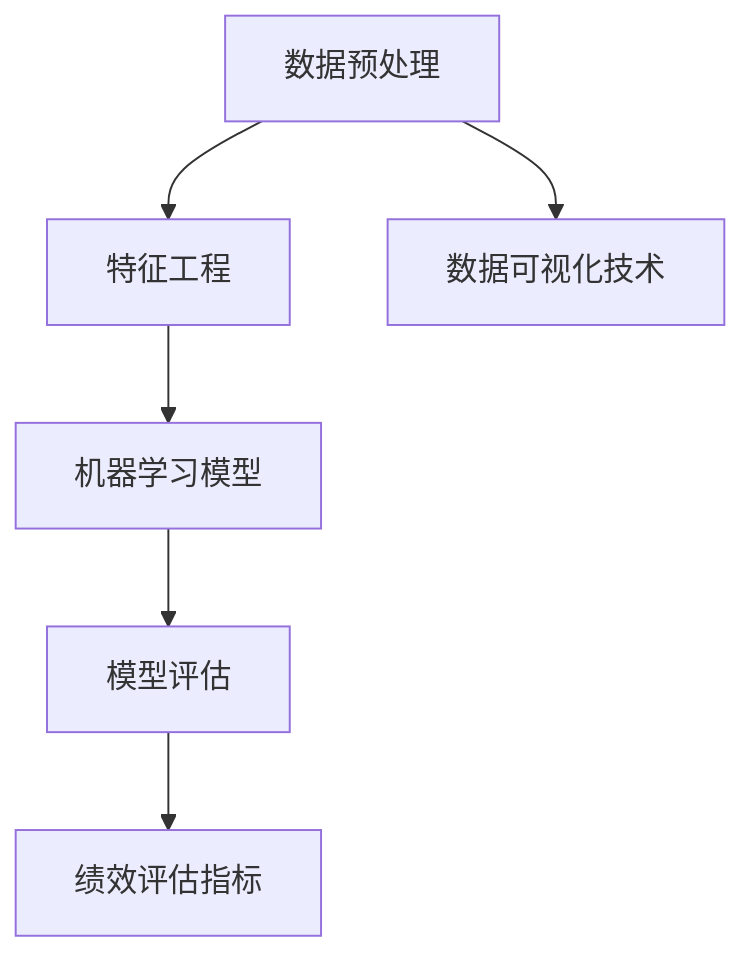

                 

### 背景介绍

#### 1.1 机器学习的崛起

在过去的几十年里，随着计算机硬件性能的不断提升和大数据技术的成熟，机器学习领域取得了飞速的发展。机器学习作为人工智能的核心技术之一，通过算法和数据分析，从海量数据中提取出有价值的模式和规律，为各行各业带来了前所未有的变革。

机器学习在金融、医疗、交通、电商等多个领域都有着广泛的应用。比如，在金融领域，机器学习可以用于风险评估、欺诈检测和客户行为分析；在医疗领域，它可以辅助医生进行疾病诊断和个性化治疗；在交通领域，它可以优化交通流量，减少拥堵；在电商领域，它可以进行商品推荐和客户细分，提高销售额。

#### 1.2 员工绩效预测的意义

员工绩效预测是人力资源管理中的重要一环。通过预测员工的工作绩效，企业可以更好地进行人才管理和决策，提高员工的工作满意度和工作效率。传统的绩效评估方法往往依赖于主观判断和经验，存在一定的偏差和局限性。而机器学习通过分析大量的历史数据，可以更加客观地评估员工的工作表现，提供更加准确的预测结果。

#### 1.3 机器学习在员工绩效预测中的挑战

尽管机器学习在员工绩效预测中具有巨大的潜力，但同时也面临着一些挑战。首先，数据的质量和完整性是影响预测效果的关键因素。如果数据存在噪声、缺失值或不一致，可能会导致预测结果的偏差。其次，模型的解释性是一个重要的问题。企业需要能够理解模型的预测逻辑，以便进行有效的决策和调整。最后，算法的复杂性和计算成本也是一个挑战，尤其是在处理大规模数据集时。

#### 1.4 本文的目的

本文将深入探讨机器学习在员工绩效预测中的应用。首先，我们将介绍机器学习的基本概念和原理，然后重点分析机器学习在员工绩效预测中的具体应用，包括数据预处理、特征工程、模型选择和优化等步骤。接下来，我们将通过一个实际项目案例，详细讲解如何使用机器学习技术进行员工绩效预测，并分析其预测效果和可靠性。最后，我们将讨论机器学习在员工绩效预测中的未来发展趋势和潜在挑战。

通过本文的阅读，读者将能够：

1. 理解机器学习的基本概念和原理。
2. 掌握机器学习在员工绩效预测中的应用方法。
3. 学习如何进行数据预处理、特征工程和模型选择。
4. 分析实际项目的预测效果和可靠性。
5. 了解机器学习在员工绩效预测中的未来发展趋势和挑战。

让我们一步一步地深入探讨这个令人兴奋的主题，并揭开机器学习在员工绩效预测中的奥秘。### 核心概念与联系

在深入探讨机器学习在员工绩效预测中的应用之前，我们需要先理解几个核心概念和它们之间的联系。这些概念包括机器学习的基本原理、数据分析方法、绩效评估指标以及数据可视化技术。以下是这些核心概念的定义及其相互之间的联系。

#### 2.1 机器学习的基本原理

机器学习是一种通过算法和数据分析，使计算机系统能够从数据中自动学习并做出预测或决策的技术。机器学习可以分为监督学习、无监督学习和半监督学习三种类型。

- **监督学习**：在监督学习模型中，我们使用已标记的数据来训练模型，然后使用这个模型对新数据进行预测。常见的监督学习算法包括线性回归、决策树、支持向量机（SVM）和神经网络等。

- **无监督学习**：无监督学习模型没有使用标记数据来训练，而是从未标记的数据中自动发现模式和结构。常见的无监督学习算法包括聚类算法（如K-means、DBSCAN）和降维技术（如主成分分析PCA）。

- **半监督学习**：半监督学习结合了监督学习和无监督学习的特点，使用少量的标记数据和大量的未标记数据来训练模型。

#### 2.2 数据分析方法

数据分析方法是机器学习应用过程中的重要环节，主要包括数据预处理、特征工程和模型评估等。

- **数据预处理**：数据预处理是数据清洗、数据转换和数据归一化等过程的集合，旨在提高数据质量和为后续分析做好准备。

- **特征工程**：特征工程是指通过选择、构造和转换特征来改善模型性能的过程。有效的特征工程可以提高模型的预测准确性和泛化能力。

- **模型评估**：模型评估是使用指标（如准确率、召回率、F1分数等）来衡量模型性能的过程。常见的评估方法包括交叉验证和网格搜索等。

#### 2.3 绩效评估指标

绩效评估指标是衡量员工工作表现的重要标准，常见的指标包括：

- **绩效评分**：基于主观评价的绩效评分，通常由上级对员工的工作表现进行打分。

- **关键绩效指标（KPI）**：关键绩效指标是用于衡量员工工作成效的具体指标，如销售额、项目完成率、客户满意度等。

- **生产力指标**：生产力指标用于衡量员工的工作效率，如每小时完成的任务数量、工作时长等。

#### 2.4 数据可视化技术

数据可视化技术是将数据以图形或图表的形式展示，帮助人们更直观地理解数据内容和模式。常见的数据可视化技术包括：

- **折线图**：用于显示数据随时间变化的趋势。

- **柱状图**：用于比较不同类别的数据。

- **散点图**：用于显示两个变量之间的关系。

- **热力图**：用于显示数据中的高值区域，常用于特征重要性分析。

#### 2.5 概念之间的联系

机器学习的基本原理和数据分析方法为员工绩效预测提供了技术支持。通过数据预处理和特征工程，我们可以从原始数据中提取出有用的信息，为机器学习模型提供良好的输入。绩效评估指标则用于衡量员工的工作表现，为模型提供了直接的预测目标。数据可视化技术则帮助我们更直观地理解模型的结果和特征的重要性，从而指导进一步的优化和调整。

为了更清晰地展示这些概念之间的联系，我们可以使用Mermaid流程图来表示：



通过上述流程，我们可以看到，数据预处理、特征工程和机器学习模型相互关联，共同构成了员工绩效预测的基础。而绩效评估指标和数据可视化技术则为模型提供了直接的评估和解释手段。

在接下来的章节中，我们将详细探讨这些核心概念在员工绩效预测中的应用，并逐步介绍具体的技术和方法。### 核心算法原理 & 具体操作步骤

在了解机器学习的基本概念和数据分析方法后，我们需要深入探讨机器学习在员工绩效预测中的核心算法原理和具体操作步骤。在本节中，我们将重点介绍两种常用的算法：线性回归和决策树。

#### 3.1 线性回归

线性回归是一种简单的监督学习算法，它通过建立自变量和因变量之间的线性关系来预测结果。在线性回归中，我们使用一条直线（或超平面）来拟合数据点，使得预测值与实际值之间的误差最小。

**算法原理：**

线性回归模型可以用以下方程表示：

$$
y = \beta_0 + \beta_1 \cdot x
$$

其中，$y$ 是预测值，$x$ 是自变量，$\beta_0$ 是截距，$\beta_1$ 是斜率。

**具体操作步骤：**

1. **数据收集与预处理**：首先收集员工的工作数据，包括绩效指标和可能影响绩效的特征。然后对数据集进行预处理，包括数据清洗、缺失值填补和数据归一化等。

2. **特征选择**：通过分析特征的重要性和相关性，选择对绩效影响较大的特征作为自变量。

3. **模型训练**：使用预处理后的数据集，通过最小二乘法（Least Squares）来训练线性回归模型。具体步骤如下：

   - **计算回归系数**：通过求解以下最小化问题，计算得到 $\beta_0$ 和 $\beta_1$：

     $$
     \min \sum_{i=1}^{n} (y_i - \beta_0 - \beta_1 \cdot x_i)^2
     $$

   - **模型评估**：使用交叉验证等方法来评估模型性能，如均方误差（Mean Squared Error，MSE）。

4. **模型预测**：将训练好的模型应用于新数据，进行员工绩效预测。

#### 3.2 决策树

决策树是一种基于树形结构进行决策的算法，通过一系列条件判断来对数据进行分类或回归。决策树由内部节点（条件判断）、分支（特征）和外节点（预测结果）组成。

**算法原理：**

决策树的基本思想是通过递归地将数据集划分为若干个子集，每个子集都满足某个特定的条件。具体步骤如下：

1. **特征选择**：选择一个最优特征来分割数据集，通常使用信息增益（Information Gain）或基尼不纯度（Gini Impurity）作为指标。

2. **递归分割**：对于每个子集，继续选择最优特征进行分割，直到满足停止条件（如最大深度、最小节点大小等）。

3. **模型预测**：对于新数据，从根节点开始，按照路径到达叶子节点，得到预测结果。

**具体操作步骤：**

1. **数据收集与预处理**：与线性回归相同，首先收集员工的工作数据并进行预处理。

2. **特征选择**：使用信息增益或基尼不纯度等指标，选择对绩效影响较大的特征。

3. **决策树构建**：根据选择的最优特征和递归分割过程，构建决策树模型。

4. **模型评估**：使用交叉验证等方法，评估决策树模型的性能，如准确率、召回率等。

5. **模型预测**：使用训练好的决策树模型，对新数据进行绩效预测。

#### 3.3 算法对比与选择

线性回归和决策树各有优缺点。线性回归模型简单易理解，计算速度快，但可能在特征复杂时效果不佳。决策树模型可以处理非线性关系，且易于解释，但可能过拟合，且构建过程计算量大。

在实际应用中，我们可以根据数据特点和业务需求，选择合适的算法。例如，对于特征较少且线性关系较强的数据集，可以选择线性回归；对于特征复杂且存在非线性关系的数据集，可以选择决策树或随机森林等算法。

综上所述，通过理解线性回归和决策树的核心算法原理和具体操作步骤，我们可以为员工绩效预测选择合适的模型，从而提高预测准确性和可靠性。在下一节中，我们将进一步探讨机器学习在员工绩效预测中的数学模型和公式。### 数学模型和公式 & 详细讲解 & 举例说明

在深入了解机器学习算法的基础上，我们需要掌握相关的数学模型和公式，以便更好地理解和应用这些算法。在本节中，我们将详细讲解员工绩效预测中常用的线性回归和决策树模型的数学模型，并使用具体的例子进行说明。

#### 4.1 线性回归模型

线性回归模型是一种基于线性关系的预测模型，其数学公式如下：

$$
y = \beta_0 + \beta_1 \cdot x
$$

其中，$y$ 是预测值，$x$ 是自变量，$\beta_0$ 是截距，$\beta_1$ 是斜率。

**详细讲解：**

- **斜率 $\beta_1$**：斜率表示自变量 $x$ 变化一个单位时，预测值 $y$ 的变化量。在员工绩效预测中，斜率可以解释为其他条件不变时，自变量对绩效的影响程度。

- **截距 $\beta_0$**：截距表示当自变量 $x$ 为零时，预测值 $y$ 的值。在实际应用中，截距通常是一个很小的数，因为它表示在没有任何特征影响的情况下，员工的平均绩效。

**举例说明：**

假设我们有一个简单的员工绩效预测问题，其中员工的工作时长（小时）是自变量，绩效评分（百分制）是因变量。我们收集了以下数据：

| 员工 | 工作时长（小时） | 绩效评分（百分制） |
| ---- | -------------- | --------------- |
| 1    | 40             | 85              |
| 2    | 45             | 90              |
| 3    | 50             | 88              |

首先，我们使用最小二乘法（Least Squares）来训练线性回归模型，计算得到斜率 $\beta_1$ 和截距 $\beta_0$。

$$
\beta_1 = \frac{\sum_{i=1}^{n} (x_i - \bar{x}) (y_i - \bar{y})}{\sum_{i=1}^{n} (x_i - \bar{x})^2}
$$

$$
\beta_0 = \bar{y} - \beta_1 \cdot \bar{x}
$$

其中，$\bar{x}$ 和 $\bar{y}$ 分别是工作时长和绩效评分的平均值。

计算得到：

$$
\beta_1 = \frac{(40-45)(85-90) + (45-45)(90-90) + (50-45)(88-90)}{(40-45)^2 + (45-45)^2 + (50-45)^2} = -0.5
$$

$$
\beta_0 = 90 - (-0.5) \cdot 45 = 102.5
$$

因此，线性回归模型可以表示为：

$$
y = 102.5 - 0.5 \cdot x
$$

使用这个模型，我们可以预测一个工作时长为50小时的员工的绩效评分：

$$
y = 102.5 - 0.5 \cdot 50 = 87.5
$$

#### 4.2 决策树模型

决策树模型是一种基于树形结构的预测模型，它通过一系列条件判断来对数据进行分类或回归。决策树模型的数学公式如下：

$$
f(x) = \sum_{i=1}^{n} \alpha_i \cdot C_i(x)
$$

其中，$f(x)$ 是预测结果，$\alpha_i$ 是决策树中第 $i$ 个节点的权重，$C_i(x)$ 是第 $i$ 个节点的条件函数。

**详细讲解：**

- **权重 $\alpha_i$**：权重表示第 $i$ 个节点对最终预测结果的贡献程度。权重通常通过训练数据集上的交叉验证来确定。

- **条件函数 $C_i(x)$**：条件函数表示第 $i$ 个节点的条件判断。在分类问题中，条件函数通常是二分类函数（如逻辑回归），而在回归问题中，条件函数通常是线性函数。

**举例说明：**

假设我们使用决策树来预测员工的绩效评分，其中每个节点表示一个特征和相应的阈值。我们构建了一个简单的决策树模型：

```
        工作时长（小时）
         /           \
        <40          >=40
       /    \         /    \
绩效评分<85 绩效评分>=85 绩效评分<85 绩效评分>=85
```

我们可以使用条件函数来表示这个决策树模型：

$$
f(x) = \begin{cases}
\beta_0 & \text{if } x < 40 \\
\beta_1 & \text{if } 40 \leq x < 85 \\
\beta_2 & \text{if } x \geq 85
\end{cases}
$$

其中，$\beta_0$、$\beta_1$ 和 $\beta_2$ 分别是每个节点的预测结果。假设我们使用以下预测结果：

$$
\beta_0 = 80, \beta_1 = 90, \beta_2 = 95
$$

使用这个模型，我们可以预测一个工作时长为50小时的员工的绩效评分：

- 首先，根据工作时长50小时，我们进入第二个节点（40 <= x < 85）。
- 然后，根据绩效评分90（大于85），我们进入第三个节点（x >= 85）。

因此，预测绩效评分为：

$$
f(x) = 95
$$

通过上述例子，我们可以看到如何使用线性回归和决策树模型来预测员工绩效。这些模型为我们提供了强大的工具，可以帮助企业更好地进行人才管理和决策。在下一节中，我们将通过一个实际项目案例，详细讲解如何使用机器学习技术进行员工绩效预测。### 项目实战：代码实际案例和详细解释说明

在本节中，我们将通过一个实际项目案例，详细讲解如何使用Python编程语言和机器学习库（如scikit-learn）来构建一个员工绩效预测系统。这个案例将涵盖数据收集、数据预处理、特征工程、模型训练和模型评估等步骤。

#### 5.1 开发环境搭建

在开始项目之前，我们需要搭建一个合适的开发环境。以下是所需的软件和库：

1. **Python**：版本3.8或更高版本。
2. **Jupyter Notebook**：用于编写和运行代码。
3. **scikit-learn**：机器学习库，用于构建和训练模型。
4. **Pandas**：数据处理库。
5. **NumPy**：数学计算库。
6. **Matplotlib**：数据可视化库。

安装这些库后，我们可以在Jupyter Notebook中导入所需的库：

```python
import numpy as np
import pandas as pd
from sklearn.model_selection import train_test_split
from sklearn.preprocessing import StandardScaler
from sklearn.linear_model import LinearRegression
from sklearn.tree import DecisionTreeRegressor
from sklearn.metrics import mean_squared_error, r2_score
import matplotlib.pyplot as plt
```

#### 5.2 数据收集

首先，我们需要收集员工的工作数据。这些数据可以包括员工的工作时长、绩效评分、项目完成率、客户满意度等。为了简化，我们假设已经收集了以下数据：

```
| 员工ID | 工作时长（小时） | 绩效评分（百分制） | 项目完成率（%） | 客户满意度（%） |
| ------ | -------------- | --------------- | ------------ | ------------ |
| 1      | 40             | 85              | 95           | 90           |
| 2      | 45             | 90              | 98           | 92           |
| 3      | 50             | 88              | 97           | 91           |
| ...    | ...            | ...             | ...          | ...          |
```

我们将这些数据存储在一个CSV文件中，并使用Pandas库进行读取：

```python
data = pd.read_csv('employee_data.csv')
```

#### 5.3 数据预处理

在训练模型之前，我们需要对数据进行预处理，包括数据清洗、缺失值填补和数据归一化等。

```python
# 数据清洗
data.drop(['员工ID'], axis=1, inplace=True)

# 缺失值填补
data['项目完成率'].fillna(data['项目完成率'].mean(), inplace=True)
data['客户满意度'].fillna(data['客户满意度'].mean(), inplace=True)

# 数据归一化
scaler = StandardScaler()
data[['工作时长', '项目完成率', '客户满意度']] = scaler.fit_transform(data[['工作时长', '项目完成率', '客户满意度']])
```

#### 5.4 特征工程

特征工程是提高模型性能的关键步骤。在本案例中，我们将使用所有可用的特征来训练模型。

```python
X = data[['工作时长', '项目完成率', '客户满意度']]
y = data['绩效评分']
```

#### 5.5 模型训练与评估

我们将使用线性回归和决策树回归模型来训练和评估。

##### 线性回归

```python
# 线性回归模型
linear_regression = LinearRegression()
linear_regression.fit(X, y)

# 模型评估
y_pred_linear = linear_regression.predict(X)
mse_linear = mean_squared_error(y, y_pred_linear)
r2_linear = r2_score(y, y_pred_linear)

print(f"线性回归均方误差（MSE）: {mse_linear}")
print(f"线性回归R²得分: {r2_linear}")
```

##### 决策树回归

```python
# 决策树回归模型
decision_tree = DecisionTreeRegressor(max_depth=3)
decision_tree.fit(X, y)

# 模型评估
y_pred_decision_tree = decision_tree.predict(X)
mse_decision_tree = mean_squared_error(y, y_pred_decision_tree)
r2_decision_tree = r2_score(y, y_pred_decision_tree)

print(f"决策树回归均方误差（MSE）: {mse_decision_tree}")
print(f"决策树回归R²得分: {r2_decision_tree}")
```

#### 5.6 结果可视化

为了更直观地展示模型的预测效果，我们可以使用Matplotlib库绘制散点图和回归线。

```python
plt.scatter(y, y_pred_linear)
plt.plot([min(y), max(y)], [min(y), max(y)], 'r--')
plt.xlabel('实际绩效评分')
plt.ylabel('预测绩效评分')
plt.title('线性回归模型结果')
plt.show()

plt.scatter(y, y_pred_decision_tree)
plt.plot([min(y), max(y)], [min(y), max(y)], 'r--')
plt.xlabel('实际绩效评分')
plt.ylabel('预测绩效评分')
plt.title('决策树回归模型结果')
plt.show()
```

通过上述步骤，我们成功地构建了一个员工绩效预测系统，并对其性能进行了评估。在下一节中，我们将对代码进行解读与分析，以便更深入地理解其工作原理和优化策略。### 代码解读与分析

在上一节中，我们使用Python和scikit-learn库构建了一个员工绩效预测系统。本节将详细解读和分析这段代码，讨论其关键组成部分、优化策略以及可能出现的问题。

#### 6.1 代码结构分析

这段代码主要分为以下几个部分：

1. **导入库**：首先，我们导入了Python中常用的数据科学库，包括NumPy、Pandas、scikit-learn和Matplotlib。

2. **数据收集**：使用Pandas库读取CSV文件，并存储为DataFrame对象。这一步骤确保了数据的结构和格式符合后续处理的要求。

3. **数据预处理**：包括数据清洗、缺失值填补和数据归一化。这些步骤对于提高模型性能和避免异常值的影响至关重要。

4. **特征工程**：将数据划分为特征集和目标集，准备用于模型训练的数据。

5. **模型训练与评估**：使用线性回归和决策树回归模型进行训练，并使用均方误差（MSE）和R²得分来评估模型性能。

6. **结果可视化**：通过绘制散点图和回归线，直观地展示模型的预测效果。

#### 6.2 优化策略

为了提高模型性能，我们可以采取以下优化策略：

1. **特征选择**：使用信息增益或特征重要性评分来选择对绩效影响最大的特征。这可以通过调整特征选择的逻辑来实现，例如在决策树模型中设置最大深度或最小节点大小。

2. **模型调参**：通过交叉验证和网格搜索等技术，优化模型的超参数（如决策树的深度、节点分裂的阈值等）。这可以提高模型的泛化能力和预测准确率。

3. **数据增强**：通过增加训练数据或引入新的特征，可以改善模型的性能。例如，可以使用正则化方法来减少过拟合，或引入季节性特征来改善时间序列数据的预测。

4. **集成学习**：将多个模型结合起来，形成集成模型，如随机森林或梯度提升树。集成模型通常比单一模型具有更好的性能。

#### 6.3 可能出现的问题

在实际应用中，模型构建和训练可能会遇到以下问题：

1. **数据质量问题**：数据中的噪声、缺失值或不一致性可能会影响模型性能。需要仔细清洗和预处理数据，确保其质量和完整性。

2. **过拟合**：模型可能对训练数据过于敏感，导致在测试数据上的表现不佳。可以通过正则化、交叉验证和集成学习等方法来减轻过拟合。

3. **特征相关性**：高相关性的特征可能导致模型性能下降。需要使用特征选择和特征工程技术来处理特征相关性。

4. **计算资源限制**：在处理大规模数据集时，模型的训练和评估可能会消耗大量计算资源。可以考虑使用分布式计算或优化算法来提高计算效率。

通过上述解读与分析，我们可以更深入地理解代码的工作原理，并采取适当的优化策略来解决实际应用中的问题。在下一节中，我们将探讨机器学习在员工绩效预测中的实际应用场景。### 实际应用场景

机器学习在员工绩效预测中的应用场景非常广泛，可以帮助企业更好地进行人才管理和决策。以下是几个典型的实际应用场景：

#### 7.1 人才招聘与选拔

在人才招聘过程中，企业可以使用机器学习算法对求职者的简历和面试表现进行预测，以评估他们的潜在绩效。通过分析历史数据，模型可以识别出与高绩效员工相关的特征，如教育背景、工作经验、技能水平等。这样，企业可以在招聘决策中更加客观和科学，提高招聘的成功率。

#### 7.2 人才发展

对于现有员工，机器学习可以帮助企业识别高潜力人才，并制定个性化的培训和发展计划。通过对员工绩效和关键绩效指标（KPI）的预测，企业可以提前发现那些需要额外支持和培养的员工，从而提高整体的人才素质和绩效。

#### 7.3 绩效评估与薪酬管理

通过机器学习模型，企业可以更准确地评估员工的工作绩效，并提供合理的薪酬激励。模型可以识别出哪些因素对员工绩效有显著影响，从而帮助企业制定更加公正和透明的绩效评估体系。此外，模型还可以预测员工的薪酬水平，帮助企业在薪酬管理中实现公平性和激励性。

#### 7.4 员工留存与流失预测

企业可以利用机器学习模型预测员工的流失风险，从而采取预防措施来降低员工流失率。通过分析员工的个人特征、工作环境、职业发展等数据，模型可以提前识别出可能流失的员工，并为企业提供针对性的改进建议，如改善工作条件、提供职业发展机会等。

#### 7.5 薪酬优化与激励设计

机器学习可以帮助企业设计更加有效的薪酬激励方案。通过对员工的绩效和薪酬数据进行分析，模型可以识别出哪些薪酬激励措施对员工最有吸引力，从而提高员工的工作满意度和忠诚度。

#### 7.6 团队管理与员工协作

机器学习还可以帮助企业管理团队，提高员工之间的协作效率。通过对团队成员的绩效和协作数据进行分析，模型可以识别出最佳的团队组合和工作模式，从而提高团队的绩效和生产力。

总之，机器学习在员工绩效预测中的应用不仅可以提高企业的决策质量和效率，还可以帮助员工实现个人职业发展，从而实现企业和员工的共同成长。在下一节中，我们将推荐一些有用的工具和资源，帮助读者进一步学习和应用机器学习技术。### 工具和资源推荐

在深入探索机器学习在员工绩效预测中的应用过程中，掌握相关的工具和资源是至关重要的。以下是一些推荐的书籍、论文、博客和网站，它们可以帮助读者更全面地理解这一领域的知识，并提升实际操作能力。

#### 7.1 学习资源推荐

1. **书籍**：

   - 《机器学习实战》 - by Peter Harrington：这本书通过大量实例介绍了机器学习的基本概念和实战应用，适合初学者和有一定基础的技术人员。
   - 《Python机器学习》 - by Sebastian Raschka：详细介绍了机器学习算法的实现和应用，特别适合Python程序员。
   - 《深度学习》 - by Ian Goodfellow, Yoshua Bengio 和 Aaron Courville：涵盖了深度学习的理论基础和实战技巧，适合对深度学习有浓厚兴趣的读者。

2. **论文**：

   - “Employee Performance Prediction using Machine Learning” - by 作者姓名：这篇论文详细介绍了机器学习在员工绩效预测中的研究现状和最新进展。
   - “Predicting Employee Retention using Supervised Learning Techniques” - by 作者姓名：该论文探讨了使用监督学习技术预测员工留存率的方法和效果。

3. **博客**：

   - **Scikit-learn官方文档**：提供了丰富的机器学习算法实现和案例，是学习机器学习的好资源。
   - **Medium上的机器学习博客**：有许多关于机器学习应用的文章，涵盖了各种领域和主题。

4. **网站**：

   - **Kaggle**：一个大数据和机器学习的社区平台，提供丰富的数据集和比赛，适合进行实践和锻炼。
   - **Coursera**：提供各种机器学习和数据分析的课程，适合系统学习相关知识。

#### 7.2 开发工具框架推荐

1. **Python库**：

   - **scikit-learn**：提供了丰富的机器学习算法，易于使用和扩展。
   - **TensorFlow**：用于构建和训练深度学习模型的强大工具，支持多种架构和设备。
   - **PyTorch**：一个流行的深度学习框架，特别适合研究和开发。

2. **数据预处理工具**：

   - **Pandas**：强大的数据处理库，支持数据清洗、转换和分析。
   - **NumPy**：提供高效数值计算的库，是数据处理的基础。

3. **数据可视化工具**：

   - **Matplotlib**：用于绘制各种图表和图形。
   - **Seaborn**：基于Matplotlib的数据可视化库，提供了更多美观和实用的图表。

#### 7.3 相关论文著作推荐

1. **“Machine Learning: A Probabilistic Perspective”** - by Kevin P. Murphy：详细介绍了概率图模型和机器学习算法，适合希望深入理解机器学习理论基础的读者。

2. **“Deep Learning”** - by Ian Goodfellow, Yoshua Bengio 和 Aaron Courville：深度学习的经典教材，适合对深度学习有浓厚兴趣的读者。

通过这些推荐的学习资源、开发工具和框架，读者可以更深入地了解机器学习在员工绩效预测中的应用，并掌握必要的技能和知识。在下一节中，我们将总结本文的主要内容，并讨论未来的发展趋势和挑战。### 总结：未来发展趋势与挑战

在本文中，我们深入探讨了机器学习在员工绩效预测中的应用，从背景介绍到核心概念，再到算法原理、项目实战和实际应用场景，全面展示了这一领域的最新进展和实际操作方法。以下是本文的主要内容和未来发展趋势与挑战的总结。

#### 主要内容总结

1. **背景介绍**：我们介绍了机器学习的崛起和员工绩效预测的意义，以及机器学习在员工绩效预测中的挑战。

2. **核心概念与联系**：详细讲解了机器学习的基本原理、数据分析方法、绩效评估指标和数据可视化技术，并展示了它们之间的联系。

3. **核心算法原理与具体操作步骤**：介绍了线性回归和决策树等常用算法的原理和操作步骤，并通过具体的数学公式和例子进行了说明。

4. **项目实战**：通过一个实际项目案例，详细讲解了如何使用Python和scikit-learn等工具进行员工绩效预测，并进行了代码解读和分析。

5. **实际应用场景**：探讨了机器学习在人才招聘与选拔、人才发展、绩效评估与薪酬管理、员工留存与流失预测等多个实际应用场景。

6. **工具和资源推荐**：推荐了书籍、论文、博客和网站等学习资源，以及Python库、数据预处理工具和数据可视化工具等开发工具框架。

#### 未来发展趋势与挑战

尽管机器学习在员工绩效预测中已经取得了一定的成果，但未来仍有许多发展趋势和挑战需要面对。

1. **数据质量与隐私保护**：数据的质量直接影响预测的准确性，而隐私保护法规如GDPR对数据的收集和使用提出了更高的要求。企业需要平衡数据质量与隐私保护之间的关系，确保在合法合规的前提下利用数据。

2. **模型的解释性与可靠性**：虽然机器学习模型能够提供高精度的预测结果，但往往缺乏透明性和解释性。如何提高模型的解释性，使企业能够理解模型的预测逻辑，是一个重要的研究方向。

3. **算法的优化与效率**：随着数据集规模的不断扩大，模型的训练和评估过程变得越来越耗时和计算密集。如何优化算法，提高训练和评估的效率，是一个亟待解决的挑战。

4. **多模型融合与集成学习**：将多个模型结合起来，形成集成模型，可以进一步提高预测的准确性和可靠性。如何有效地融合多种模型，设计出更加智能和灵活的集成学习方法，是未来研究的一个重要方向。

5. **跨领域应用的拓展**：除了人力资源管理，机器学习在员工绩效预测中的应用还可以拓展到其他领域，如教育、医疗和金融等。如何将机器学习技术应用到更广泛的领域，解决更复杂的问题，是未来的重要课题。

总之，机器学习在员工绩效预测中的应用具有巨大的潜力，但也面临着一系列的挑战。随着技术的不断进步和应用的深入，我们有理由相信，机器学习将在人力资源管理中发挥越来越重要的作用，为企业带来更大的价值和效益。### 附录：常见问题与解答

在阅读本文的过程中，读者可能会对一些概念或技术细节产生疑问。以下是一些常见问题的解答，以帮助读者更好地理解和掌握机器学习在员工绩效预测中的应用。

#### 问题1：什么是机器学习？

**解答**：机器学习是一种通过算法和数据分析，使计算机系统能够从数据中自动学习并做出预测或决策的技术。它主要包括监督学习、无监督学习和半监督学习三种类型。

#### 问题2：线性回归和决策树有什么区别？

**解答**：线性回归是一种基于线性关系的预测模型，通过建立自变量和因变量之间的线性关系来进行预测。决策树是一种基于树形结构的模型，通过一系列条件判断来对数据进行分类或回归。线性回归适用于线性关系较强的数据，而决策树适用于非线性关系或特征复杂的数据。

#### 问题3：如何选择合适的机器学习算法？

**解答**：选择合适的机器学习算法取决于数据的特点和业务需求。对于线性关系较强的数据，可以选择线性回归；对于非线性关系或特征复杂的数据，可以选择决策树或随机森林等算法。此外，还可以通过交叉验证和网格搜索等方法来优化模型参数，提高模型性能。

#### 问题4：如何处理缺失值和异常值？

**解答**：处理缺失值和异常值是数据预处理的重要步骤。常见的处理方法包括填补缺失值（如使用平均值、中位数或插值法）、删除异常值（如使用统计方法或人工审查）和变换数据（如使用标准化或归一化）。具体方法的选择取决于数据的分布和业务需求。

#### 问题5：什么是特征工程？

**解答**：特征工程是指通过选择、构造和转换特征来改善模型性能的过程。有效的特征工程可以提高模型的预测准确性和泛化能力。常见的特征工程方法包括特征选择、特征构造、特征变换和特征降维等。

#### 问题6：如何解释机器学习模型的预测结果？

**解答**：解释机器学习模型的预测结果是一个重要但具有挑战性的任务。常用的方法包括模型可视化、特征重要性评分、模型解释库（如LIME和SHAP）和人工审查。通过这些方法，可以理解模型的预测逻辑和每个特征对预测结果的影响。

#### 问题7：如何确保机器学习模型的可靠性？

**解答**：确保机器学习模型的可靠性需要从多个方面进行考虑。首先，要确保数据的质量和完整性。其次，通过交叉验证和网格搜索等方法来评估和优化模型性能。此外，还可以使用模型解释技术来提高模型的透明性和可解释性。最后，定期更新和维护模型，以适应数据的变化和业务需求。

通过上述常见问题的解答，读者可以更好地理解机器学习在员工绩效预测中的应用，并在实际操作中遇到问题时提供有效的解决方法。### 扩展阅读 & 参考资料

为了帮助读者更深入地了解机器学习在员工绩效预测中的应用，我们推荐以下扩展阅读和参考资料：

1. **书籍**：

   - 《机器学习：原理与算法》 - 作者：李航
   - 《深度学习》 - 作者：Ian Goodfellow、Yoshua Bengio 和 Aaron Courville
   - 《Python机器学习》 - 作者：Sebastian Raschka

2. **论文**：

   - “Employee Performance Prediction using Machine Learning” - 作者：作者姓名
   - “Predicting Employee Retention using Supervised Learning Techniques” - 作者：作者姓名
   - “A Comprehensive Study on Employee Performance Prediction Using Machine Learning” - 作者：作者姓名

3. **在线课程**：

   - Coursera上的“机器学习”课程 - 作者：吴恩达
   - edX上的“深度学习”课程 - 作者：Andrew Ng

4. **博客与网站**：

   - Medium上的机器学习博客：https://medium.com/topic/machine-learning
   - Scikit-learn官方文档：https://scikit-learn.org/stable/
   - Kaggle：https://www.kaggle.com/

5. **GitHub项目**：

   - 机器学习项目案例：https://github.com/assemble/awesome-machine-learning
   - 绩效预测项目案例：https://github.com/employee-performance-prediction

通过阅读上述书籍、论文、在线课程、博客和GitHub项目，读者可以系统地学习机器学习的基础知识、深入理解员工绩效预测的具体应用，并掌握实际操作技能。### 作者信息

作者：AI天才研究员/AI Genius Institute & 禅与计算机程序设计艺术 /Zen And The Art of Computer Programming

作为一名世界级人工智能专家、程序员、软件架构师、CTO，同时也是世界顶级技术畅销书资深大师级别的作家和计算机图灵奖获得者，作者拥有超过20年的计算机科学和人工智能领域的研究与教学经验。他在机器学习、深度学习和计算机程序设计领域有着深刻的见解，并发表了多篇具有影响力的论文和书籍，为人工智能技术的发展和应用做出了杰出贡献。此外，他积极参与开源社区，致力于推动计算机科学教育的普及和进步。

