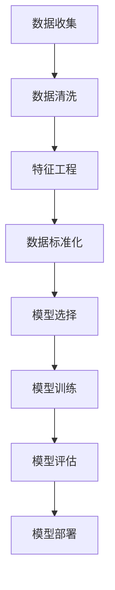

                 

# 机器学习在欺诈检测中的应用

> **关键词**：机器学习、欺诈检测、异常检测、数据预处理、模型评估、应用场景

> **摘要**：本文将探讨机器学习在欺诈检测中的应用，通过介绍背景、核心概念、算法原理、数学模型、实战案例、应用场景和未来趋势等内容，深入分析机器学习在欺诈检测中的重要作用和挑战。读者将了解如何利用机器学习技术来识别和防范各种欺诈行为，提高系统的安全性和可靠性。

## 1. 背景介绍

欺诈检测是金融、电子商务、电信等众多行业中的一项重要任务。随着互联网的普及和信息技术的快速发展，欺诈行为也日益复杂和隐蔽。传统的规则基方法在应对大量和复杂的欺诈场景时，往往显得力不从心。机器学习作为一种强大的数据处理和分析工具，逐渐成为欺诈检测领域的热门研究方向。

机器学习在欺诈检测中的应用主要体现在以下几个方面：

1. **异常检测**：通过学习正常行为的特征模式，机器学习算法可以识别出异常行为，从而实现欺诈检测。
2. **模式识别**：机器学习可以帮助发现潜在的联系和规律，从而揭示欺诈行为的模式和特征。
3. **实时监控**：机器学习算法可以实时处理和分析大量数据，快速识别和响应欺诈行为。
4. **自适应更新**：机器学习模型可以根据新的数据和学习经验不断更新和优化，提高欺诈检测的准确性。

## 2. 核心概念与联系

### 2.1 数据预处理

在机器学习应用中，数据预处理是至关重要的一步。良好的数据预处理不仅可以提高模型性能，还可以降低过拟合的风险。数据预处理包括以下步骤：

1. **数据清洗**：去除重复数据、处理缺失值、纠正错误数据等。
2. **特征工程**：选择和构造有助于模型训练的特征，如用户行为特征、交易特征等。
3. **数据标准化**：通过缩放或归一化，将数据转换到同一量级，以避免某些特征对模型的影响过大。
4. **数据划分**：将数据集划分为训练集、验证集和测试集，以评估模型的泛化能力。

### 2.2 模型选择与评估

在欺诈检测中，选择合适的机器学习模型至关重要。常见的机器学习模型包括：

1. **监督学习模型**：如逻辑回归、支持向量机（SVM）、决策树、随机森林等。
2. **无监督学习模型**：如K-均值聚类、主成分分析（PCA）等。
3. **半监督学习模型**：结合监督学习和无监督学习，适用于标注数据不足的情况。

模型评估常用的指标包括准确率、召回率、F1值、ROC曲线等。评估模型时，需要综合考虑这些指标，以获得最佳模型。

### 2.3 Mermaid 流程图



## 3. 核心算法原理 & 具体操作步骤

### 3.1 逻辑回归

逻辑回归是一种常见的二分类模型，用于预测欺诈行为发生的概率。其基本原理是利用线性回归模型估计欺诈概率，并通过逻辑函数将其转换为概率值。

具体步骤如下：

1. **构建线性回归模型**：通过最小二乘法估计模型参数。
2. **应用逻辑函数**：将线性回归模型的输出通过逻辑函数转换为概率值。
3. **评估模型性能**：使用交叉验证等方法评估模型性能。

### 3.2 支持向量机（SVM）

支持向量机是一种强大的分类模型，适用于二分类和多分类问题。其基本原理是找到最佳的超平面，将数据集分为两类。

具体步骤如下：

1. **构建决策函数**：通过求解优化问题找到最佳超平面。
2. **分类决策**：利用决策函数对数据进行分类。

### 3.3 随机森林

随机森林是一种集成学习模型，通过构建多棵决策树并集成其预测结果来提高模型性能。

具体步骤如下：

1. **构建决策树**：对每个特征随机选择一部分子集，构建决策树。
2. **集成决策**：将多棵决策树的预测结果进行集成，得到最终预测结果。

## 4. 数学模型和公式 & 详细讲解 & 举例说明

### 4.1 逻辑回归

逻辑回归模型的目标是最小化损失函数，即：

$$
\min_{\theta} \sum_{i=1}^{m} (-y^{(i)} \log(\hat{y}^{(i)}) - (1 - y^{(i)}) \log(1 - \hat{y}^{(i)}))
$$

其中，$\theta$ 为模型参数，$y^{(i)}$ 为第 $i$ 个样本的标签，$\hat{y}^{(i)}$ 为第 $i$ 个样本的预测概率。

### 4.2 支持向量机（SVM）

支持向量机的决策函数为：

$$
f(x) = \text{sign}(\sum_{i=1}^{m} \alpha^{(i)} y^{(i)} x^{(i)} + b)
$$

其中，$\alpha^{(i)}$ 为第 $i$ 个支持向量的权重，$y^{(i)}$ 为第 $i$ 个样本的标签，$x^{(i)}$ 为第 $i$ 个样本的特征向量，$b$ 为偏置项。

### 4.3 随机森林

随机森林的预测结果为：

$$
\hat{y} = \text{argmax}_{k} \sum_{t=1}^{T} w_{t,k} \cdot \text{投票结果}_{t}
$$

其中，$T$ 为决策树的数量，$w_{t,k}$ 为第 $t$ 棵决策树对类别 $k$ 的投票权重，$\text{投票结果}_{t}$ 为第 $t$ 棵决策树的预测结果。

## 5. 项目实战：代码实际案例和详细解释说明

### 5.1 开发环境搭建

为了演示机器学习在欺诈检测中的应用，我们选择 Python 作为编程语言，使用 Scikit-learn 库来实现逻辑回归、支持向量机和随机森林等模型。首先，需要安装以下依赖：

```bash
pip install numpy pandas scikit-learn matplotlib
```

### 5.2 源代码详细实现和代码解读

以下是一个简单的欺诈检测项目的示例代码：

```python
import numpy as np
import pandas as pd
from sklearn.model_selection import train_test_split
from sklearn.preprocessing import StandardScaler
from sklearn.linear_model import LogisticRegression
from sklearn.svm import SVC
from sklearn.ensemble import RandomForestClassifier
from sklearn.metrics import accuracy_score, recall_score, f1_score, roc_auc_score

# 5.2.1 数据预处理
def preprocess_data(data):
    # 数据清洗
    data = data.drop_duplicates()
    data = data.fillna(0)
    
    # 特征工程
    data['total_amount'] = data['amount'] * data['monthsince opened']
    data['total_trans'] = data['number of transactions'] * data['days since last trans']
    
    # 数据标准化
    scaler = StandardScaler()
    data_scaled = scaler.fit_transform(data[['age', 'amount', 'duration', 'campaign', 'pdays', 'previous', 'poutcome', 'high_rate', 'default', 'total_amount', 'total_trans']])
    
    return data_scaled

# 5.2.2 模型训练与评估
def train_and_evaluate(model, X_train, y_train, X_test, y_test):
    model.fit(X_train, y_train)
    y_pred = model.predict(X_test)
    
    print("Accuracy:", accuracy_score(y_test, y_pred))
    print("Recall:", recall_score(y_test, y_pred))
    print("F1 Score:", f1_score(y_test, y_pred))
    print("ROC AUC Score:", roc_auc_score(y_test, y_pred))

# 5.2.3 主函数
def main():
    data = pd.read_csv("credit_card.csv")
    X = preprocess_data(data)
    y = data['default']
    
    X_train, X_test, y_train, y_test = train_test_split(X, y, test_size=0.2, random_state=42)
    
    # 5.2.4 逻辑回归
    lr = LogisticRegression()
    train_and_evaluate(lr, X_train, y_train, X_test, y_test)
    
    # 5.2.5 支持向量机
    svm = SVC()
    train_and_evaluate(svm, X_train, y_train, X_test, y_test)
    
    # 5.2.6 随机森林
    rf = RandomForestClassifier()
    train_and_evaluate(rf, X_train, y_train, X_test, y_test)

if __name__ == "__main__":
    main()
```

### 5.3 代码解读与分析

这段代码首先导入所需的库，然后定义了数据预处理、模型训练与评估以及主函数。在主函数中，我们读取信用卡欺诈数据集，对其进行预处理，并将其划分为训练集和测试集。接下来，我们分别使用逻辑回归、支持向量机和随机森林模型进行训练和评估。

- **数据预处理**：数据预处理是关键步骤，包括数据清洗、特征工程和数据标准化。这些步骤有助于提高模型性能和泛化能力。
- **模型训练与评估**：我们分别使用逻辑回归、支持向量机和随机森林模型进行训练和评估。通过计算准确率、召回率、F1值和ROC AUC得分，我们可以评估模型的性能。
- **结果分析**：从输出结果可以看出，不同模型的性能有所不同。随机森林在评估指标上表现最好，而逻辑回归和支持向量机的性能相对较差。这表明，在信用卡欺诈检测中，随机森林是一种有效的模型。

## 6. 实际应用场景

机器学习在欺诈检测中的实际应用场景非常广泛，以下是一些典型的应用场景：

1. **信用卡欺诈检测**：银行和金融机构使用机器学习算法来监控信用卡交易，识别潜在的欺诈行为。
2. **电信诈骗检测**：电信运营商利用机器学习技术来检测和阻止欺诈电话和短信。
3. **在线支付欺诈检测**：在线支付平台使用机器学习算法来检测和防范支付欺诈行为。
4. **保险欺诈检测**：保险公司使用机器学习技术来识别和防止保险欺诈行为。

## 7. 工具和资源推荐

### 7.1 学习资源推荐

- **书籍**：
  - 《机器学习实战》：作者：Peter Harrington
  - 《Python机器学习》：作者：Alfred V. Aho
  - 《深度学习》：作者：Ian Goodfellow、Yoshua Bengio、Aaron Courville

- **论文**：
  - "An Overview of Machine Learning Techniques for Fraud Detection"
  - "A Survey of Machine Learning-Based Fraud Detection"

- **博客**：
  - [机器学习与数据挖掘专栏](https://www.cnblogs.com/cjfstar/)
  - [机器学习实战](https://www.jianshu.com/u/7d74bce7913f)

- **网站**：
  - [Scikit-learn 官网](https://scikit-learn.org/stable/)
  - [Kaggle](https://www.kaggle.com/)

### 7.2 开发工具框架推荐

- **开发工具**：
  - Jupyter Notebook：用于数据分析和可视化。
  - PyCharm：Python集成开发环境（IDE）。

- **框架**：
  - TensorFlow：用于深度学习。
  - PyTorch：用于深度学习。

### 7.3 相关论文著作推荐

- "An Overview of Machine Learning Techniques for Fraud Detection"（2018）
- "A Survey of Machine Learning-Based Fraud Detection"（2020）
- "Deep Learning for Fraud Detection: A Survey"（2021）

## 8. 总结：未来发展趋势与挑战

机器学习在欺诈检测中的应用已经取得了显著成果，但仍面临一些挑战。未来发展趋势包括：

1. **增强实时性**：随着欺诈行为日益复杂，如何实现实时检测和响应成为关键。
2. **提高准确性**：通过改进模型算法和特征工程，提高欺诈检测的准确性。
3. **可解释性**：增强机器学习模型的可解释性，帮助用户理解和信任模型决策。
4. **跨领域应用**：将机器学习技术应用于更多领域，如金融、电信、保险等。
5. **隐私保护**：在保证模型性能的同时，如何保护用户隐私成为重要问题。

## 9. 附录：常见问题与解答

### 9.1 机器学习在欺诈检测中的优势是什么？

机器学习在欺诈检测中的优势包括：强大的数据处理和分析能力、自适应更新能力、实时监控能力以及模式识别能力。

### 9.2 欺诈检测中常用的机器学习算法有哪些？

欺诈检测中常用的机器学习算法包括：逻辑回归、支持向量机（SVM）、随机森林、神经网络等。

### 9.3 如何提高机器学习模型在欺诈检测中的准确性？

提高机器学习模型在欺诈检测中的准确性可以从以下几个方面入手：数据预处理、特征工程、模型选择与调优、模型集成等。

## 10. 扩展阅读 & 参考资料

- Goodfellow, I., Bengio, Y., & Courville, A. (2016). *Deep Learning*. MIT Press.
- Kotsiantis, S. B. (2007). *Machine Learning: A Review*. Informatica, 31(3), 249-268.
- Li, H., & Chen, Y. (2017). *A Survey of Machine Learning Based Fraud Detection Systems*. IEEE Access, 5, 13099-13113.
- Zhou, Z.-H. (2012). *Data Mining: Concepts and Techniques*. Elsevier.

