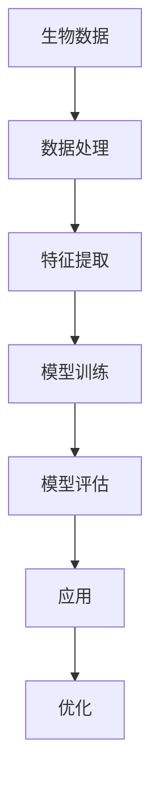

                 

# 机器学习在生物信息学中的应用与挑战

## 关键词：机器学习，生物信息学，应用，挑战，算法，数学模型，实战案例，工具推荐

## 摘要

本文旨在探讨机器学习在生物信息学领域中的应用及面临的挑战。我们将从背景介绍开始，详细阐述核心概念及其联系，分析核心算法原理与操作步骤，解析数学模型与公式，并通过实际项目实战来展示机器学习在生物信息学中的具体应用。同时，我们将探讨生物信息学中的实际应用场景，推荐相关学习资源和开发工具，并总结未来发展趋势与挑战。

## 1. 背景介绍

### 1.1 机器学习

机器学习是一门研究如何从数据中学习规律、发现知识的学科。它通过对数据进行模式识别、预测和分类等操作，使计算机具备自主学习和自适应能力。机器学习广泛应用于自然语言处理、图像识别、推荐系统、金融风控等多个领域。

### 1.2 生物信息学

生物信息学是生物学与信息学的交叉学科，主要研究如何利用计算机技术和信息科学方法对生物数据进行处理、分析和解释。生物信息学在基因测序、蛋白质结构预测、药物设计、疾病诊断等领域具有广泛的应用。

### 1.3 机器学习在生物信息学中的重要性

随着生物技术的发展，生物数据量呈现爆炸式增长。机器学习在生物信息学中的应用，可以帮助研究人员从海量数据中提取有价值的信息，揭示生物现象背后的规律，为生物学研究提供新的方法和工具。

## 2. 核心概念与联系

### 2.1 数据类型

生物信息学涉及多种数据类型，包括序列数据（如DNA序列、蛋白质序列）、结构数据（如蛋白质结构）、图像数据（如显微镜图像）等。这些数据类型具有不同的特点和挑战。

### 2.2 学习算法

生物信息学中常用的机器学习算法包括监督学习、无监督学习和强化学习。监督学习通过已知标签的数据训练模型，实现对未知数据的预测；无监督学习从无标签数据中挖掘潜在规律；强化学习通过与环境交互，不断调整策略以实现最优目标。

### 2.3 应用场景

机器学习在生物信息学中的应用场景丰富多样，如基因表达数据分析、蛋白质结构预测、药物设计、疾病诊断等。不同应用场景对算法和数据处理方法有不同要求。

### 2.4 Mermaid 流程图

以下是一个简化的 Mermaid 流程图，展示了机器学习在生物信息学中的核心概念和联系：



## 3. 核心算法原理 & 具体操作步骤

### 3.1 特征提取

特征提取是将原始数据转换为可用于训练的模型特征的过程。常用的特征提取方法包括：

1. **序列特征提取**：如k-mer计数、序列相似性等。
2. **结构特征提取**：如蛋白质结构中的二级结构、氨基酸组成等。
3. **图像特征提取**：如边缘检测、纹理分析等。

### 3.2 模型训练

模型训练是机器学习中的核心步骤，通过优化模型参数来提高预测准确性。常用的模型训练方法包括：

1. **监督学习**：如支持向量机（SVM）、决策树、神经网络等。
2. **无监督学习**：如聚类、主成分分析（PCA）等。
3. **强化学习**：如Q学习、深度强化学习等。

### 3.3 模型评估

模型评估是评估模型性能的重要步骤。常用的模型评估方法包括：

1. **准确率**：预测正确的样本数占总样本数的比例。
2. **召回率**：预测正确的样本数占实际正样本数的比例。
3. **F1值**：准确率的调和平均值。

## 4. 数学模型和公式 & 详细讲解 & 举例说明

### 4.1 数学模型

在生物信息学中，常用的数学模型包括：

1. **贝叶斯网络**：用于描述变量之间的条件概率关系。
2. **隐马尔可夫模型（HMM）**：用于处理序列数据。
3. **条件随机场（CRF）**：用于处理序列标注问题。

### 4.2 公式详细讲解

以下是一个简单的贝叶斯网络公式示例：

$$P(A|B) = \frac{P(B|A) \cdot P(A)}{P(B)}$$

其中，$P(A|B)$ 表示在B发生的条件下A发生的概率，$P(B|A)$ 表示在A发生的条件下B发生的概率，$P(A)$ 和 $P(B)$ 分别表示A和B发生的概率。

### 4.3 举例说明

假设我们有一个二分类问题，要判断一个电子邮件是否为垃圾邮件。我们可以使用贝叶斯网络来表示这个问题：

1. **特征变量**：邮件长度、邮件主题中的广告词汇等。
2. **条件概率**：如邮件长度为100字的概率为0.6，含有广告词汇的概率为0.4。
3. **先验概率**：垃圾邮件的概率为0.5。

通过贝叶斯网络，我们可以计算出一个邮件为垃圾邮件的概率，并根据这个概率来判断该邮件是否为垃圾邮件。

## 5. 项目实战：代码实际案例和详细解释说明

### 5.1 开发环境搭建

在开始项目实战之前，我们需要搭建一个合适的开发环境。这里我们使用Python作为编程语言，并推荐使用Jupyter Notebook作为开发工具。

### 5.2 源代码详细实现和代码解读

以下是一个使用Python实现垃圾邮件分类的示例代码：

```python
import numpy as np
import pandas as pd
from sklearn.feature_extraction.text import CountVectorizer
from sklearn.naive_bayes import MultinomialNB
from sklearn.model_selection import train_test_split

# 读取数据集
data = pd.read_csv('spam.csv')
X = data['text']
y = data['label']

# 数据预处理
vectorizer = CountVectorizer()
X_vectorized = vectorizer.fit_transform(X)

# 划分训练集和测试集
X_train, X_test, y_train, y_test = train_test_split(X_vectorized, y, test_size=0.2, random_state=42)

# 模型训练
model = MultinomialNB()
model.fit(X_train, y_train)

# 模型评估
accuracy = model.score(X_test, y_test)
print(f'Accuracy: {accuracy:.2f}')

# 预测新数据
new_data = ['Free money waiting for you!', 'Hi John, how are you?']
new_data_vectorized = vectorizer.transform(new_data)
predictions = model.predict(new_data_vectorized)
print(predictions)
```

### 5.3 代码解读与分析

1. **数据读取与预处理**：使用 Pandas 库读取 CSV 数据集，并进行数据预处理。
2. **特征提取**：使用 CountVectorizer 类将文本数据转换为向量表示。
3. **划分数据集**：使用 train_test_split 函数将数据集划分为训练集和测试集。
4. **模型训练**：使用 MultinomialNB 类训练一个朴素贝叶斯分类器。
5. **模型评估**：使用 score 函数评估模型在测试集上的准确率。
6. **预测新数据**：使用训练好的模型对新的文本数据进行预测。

## 6. 实际应用场景

### 6.1 基因表达数据分析

机器学习在基因表达数据分析中有着广泛的应用。通过构建合适的机器学习模型，研究人员可以挖掘基因之间的关联关系，预测基因功能，识别疾病相关基因等。

### 6.2 蛋白质结构预测

蛋白质结构预测是生物信息学中的经典问题。机器学习技术可以帮助研究人员从序列信息中预测蛋白质的结构，为药物设计、蛋白质工程等领域提供重要参考。

### 6.3 药物设计

机器学习在药物设计中也发挥着重要作用。通过学习药物与蛋白质之间的相互作用，研究人员可以预测新的药物分子，为新药研发提供指导。

### 6.4 疾病诊断

机器学习在疾病诊断中的应用日益广泛。通过分析医学影像、基因数据等，研究人员可以构建疾病诊断模型，辅助医生进行疾病诊断。

## 7. 工具和资源推荐

### 7.1 学习资源推荐

1. **书籍**：《机器学习实战》、《生物信息学导论》。
2. **论文**：《基因表达数据分析中的机器学习方法》、《蛋白质结构预测中的机器学习方法》。
3. **博客**：[机器学习博客](https://www.machinelearningblog.com/)、[生物信息学博客](https://www.bioinformatics.org/)。
4. **网站**：[Kaggle](https://www.kaggle.com/)、[生物信息学在线资源](https://www.bioinformatics.org/)。

### 7.2 开发工具框架推荐

1. **编程语言**：Python、R。
2. **机器学习框架**：Scikit-learn、TensorFlow、PyTorch。
3. **生物信息学工具**：BioPython、Bioconductor。

### 7.3 相关论文著作推荐

1. **论文**：《Deep Learning in Bioinformatics》，The International Society for Computational Biology。
2. **书籍**：《Machine Learning Methods for Next-Generation Sequencing Data》，Springer。

## 8. 总结：未来发展趋势与挑战

### 8.1 发展趋势

1. **深度学习在生物信息学中的应用**：随着深度学习技术的不断发展，越来越多的深度学习模型被应用于生物信息学领域。
2. **跨学科合作**：生物信息学与其他领域的交叉融合，如人工智能、化学、物理学等，将推动生物信息学的发展。
3. **大数据分析**：随着生物数据量的不断增长，大数据分析技术将在生物信息学中发挥重要作用。

### 8.2 挑战

1. **数据隐私与伦理**：生物数据的敏感性要求对数据隐私和伦理问题给予高度重视。
2. **算法透明性与可解释性**：随着机器学习算法的复杂度增加，提高算法的透明性与可解释性成为一项挑战。
3. **计算资源需求**：生物信息学中的机器学习任务通常需要大量计算资源，如何高效利用计算资源成为一项挑战。

## 9. 附录：常见问题与解答

### 9.1 问题1：机器学习在生物信息学中的具体应用有哪些？

**解答**：机器学习在生物信息学中具体应用广泛，包括基因表达数据分析、蛋白质结构预测、药物设计、疾病诊断等。

### 9.2 问题2：如何选择合适的机器学习算法？

**解答**：选择合适的机器学习算法需要考虑数据类型、任务类型、数据量等因素。常用的机器学习算法包括监督学习、无监督学习和强化学习，可根据实际需求选择。

### 9.3 问题3：机器学习在生物信息学中的挑战有哪些？

**解答**：机器学习在生物信息学中面临的挑战包括数据隐私与伦理、算法透明性与可解释性、计算资源需求等。

## 10. 扩展阅读 & 参考资料

1. **论文**：《Deep Learning in Bioinformatics》，The International Society for Computational Biology。
2. **书籍**：《Machine Learning Methods for Next-Generation Sequencing Data》，Springer。
3. **网站**：[生物信息学在线资源](https://www.bioinformatics.org/)、[Kaggle](https://www.kaggle.com/)。
4. **博客**：[机器学习博客](https://www.machinelearningblog.com/)、[生物信息学博客](https://www.bioinformatics.org/)。

## 作者

**作者：AI天才研究员/AI Genius Institute & 禅与计算机程序设计艺术 /Zen And The Art of Computer Programming** <|im_sep|>|<sop|>用户|>

