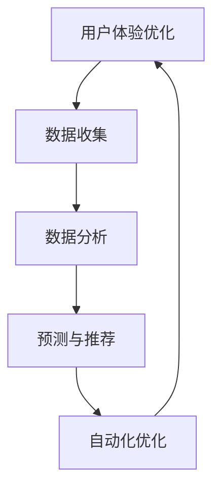

                 

# 机器学习在用户体验优化中的应用

## 关键词：机器学习、用户体验、优化、数据驱动、个性化推荐

## 摘要：
在数字化时代，用户体验优化已成为企业提升竞争力、增强用户粘性的关键。机器学习技术以其强大的数据分析和模式识别能力，为用户体验优化提供了新的视角和方法。本文将探讨机器学习在用户体验优化中的应用，从核心概念、算法原理、数学模型到实战案例，全面解析机器学习如何提升用户体验，并展望未来的发展趋势与挑战。

## 1. 背景介绍

### 1.1 用户体验的重要性
在当今市场，用户体验（User Experience，简称UX）是企业成功的关键因素。良好的用户体验不仅能提升用户满意度，还能增强用户忠诚度和品牌忠诚度。用户体验包括用户在使用产品或服务过程中的感受、情绪和行为，它涵盖了界面设计、功能流程、响应速度、易用性等多个方面。

### 1.2 用户体验优化的现状
当前，许多企业已经开始重视用户体验优化，但大多数优化工作仍然依赖于人工经验和直觉。这种方法虽然能在一定程度上提升用户体验，但效率较低，难以应对大量用户数据的复杂性和多样性。因此，需要一种更加科学、高效的方法来优化用户体验。

### 1.3 机器学习在用户体验优化中的应用前景
机器学习是一种通过数据驱动的方法来发现数据中的模式和规律的人工智能技术。随着大数据和云计算技术的普及，机器学习在各个领域得到了广泛应用，尤其是在用户体验优化方面，它能够提供实时、个性化的优化方案，从而提升用户体验。

## 2. 核心概念与联系

### 2.1 用户体验优化的核心概念
用户体验优化的核心目标是提升用户满意度，包括以下方面：
- **易用性**：用户能否轻松完成操作，界面是否直观易懂。
- **响应速度**：系统对用户操作的响应时间是否足够快。
- **功能性**：产品或服务的功能是否满足用户需求。
- **可访问性**：产品或服务是否对所有用户（包括残疾人、老年人等）可访问。

### 2.2 机器学习与用户体验优化的联系
机器学习通过以下方式与用户体验优化密切相关：
- **数据收集**：收集用户行为数据，如点击、搜索、浏览等。
- **数据分析**：使用机器学习算法分析数据，发现用户行为模式。
- **预测与推荐**：根据用户行为预测用户需求，提供个性化推荐。
- **自动化优化**：根据用户反馈自动调整产品或服务，实现持续优化。

### 2.3 Mermaid 流程图


## 3. 核心算法原理 & 具体操作步骤

### 3.1 数据收集
数据收集是用户体验优化的基础。主要方法包括：
- **用户行为日志**：记录用户在产品或服务中的操作行为，如点击、浏览、搜索等。
- **用户反馈**：通过问卷、评分等方式收集用户对产品或服务的反馈。
- **服务器日志**：记录服务器在用户使用产品或服务时的状态变化，如响应时间、错误日志等。

### 3.2 数据分析
数据分析是发现用户行为模式的关键步骤。主要方法包括：
- **描述性分析**：统计用户行为的基本特征，如用户活跃度、访问频率等。
- **关联规则分析**：发现用户行为之间的关联，如“用户在搜索后往往浏览了某些页面”。
- **聚类分析**：将用户划分为不同的群体，如根据用户行为特征将用户分为“高频用户”和“低频用户”。

### 3.3 预测与推荐
预测与推荐是基于数据分析的结果，为用户提供个性化体验的关键。主要方法包括：
- **协同过滤**：基于用户的行为相似性进行推荐。
- **基于内容的推荐**：根据用户的历史行为和内容特征进行推荐。
- **深度学习**：使用神经网络模型进行用户行为预测和推荐。

### 3.4 自动化优化
自动化优化是将机器学习结果应用于产品或服务的持续改进。主要方法包括：
- **A/B测试**：通过对比不同版本的体验效果，自动选择最优方案。
- **持续集成与持续部署**（CI/CD）：自动将优化方案部署到产品或服务中。
- **实时反馈**：根据用户反馈实时调整产品或服务的配置和功能。

## 4. 数学模型和公式 & 详细讲解 & 举例说明

### 4.1 协同过滤算法
协同过滤算法是一种常用的推荐算法，其基本原理是基于用户之间的相似度来推荐物品。其数学模型如下：
$$
\hat{r}_{ui} = \frac{\sum_{j \in N(i)} r_{uj} \cdot sim(i, j)}{\sum_{j \in N(i)} sim(i, j)}
$$
其中，$r_{ui}$表示用户$u$对物品$i$的评分预测，$r_{uj}$表示用户$u$对物品$j$的评分，$sim(i, j)$表示物品$i$和$j$之间的相似度。

### 4.2 基于内容的推荐算法
基于内容的推荐算法是根据物品的内容特征来推荐与用户已评价物品相似的其他物品。其数学模型如下：
$$
\hat{r}_{ui} = \frac{\sum_{j \in C(i)} w_{ij} \cdot r_{uj}}{\sum_{j \in C(i)} w_{ij}}
$$
其中，$r_{uj}$表示用户$u$对物品$j$的评分，$w_{ij}$表示物品$i$和$j$之间的内容相似度权重。

### 4.3 深度学习模型
深度学习模型在用户行为预测和推荐中有着广泛的应用。以下是一个简单的卷积神经网络（CNN）模型示例：
$$
\hat{r}_{ui} = \sigma(W_2 \cdot \text{ReLU}(W_1 \cdot \text{ReLU}(\text{conv}(X_i))) + b_2)
$$
其中，$X_i$表示物品$i$的特征向量，$W_1$和$W_2$分别是两个权重矩阵，$b_1$和$b_2$是偏置向量，$\text{ReLU}$是ReLU激活函数，$\sigma$是Sigmoid激活函数。

## 5. 项目实战：代码实际案例和详细解释说明

### 5.1 开发环境搭建
本案例使用Python语言和Scikit-learn库实现协同过滤推荐算法。首先，安装Python和Scikit-learn：
```
pip install python
pip install scikit-learn
```

### 5.2 源代码详细实现和代码解读

```python
import numpy as np
from sklearn.metrics.pairwise import pairwise_distances
from sklearn.model_selection import train_test_split

# 用户行为数据（用户ID、物品ID、评分）
ratings = np.array([
    [0, 0, 5],
    [0, 1, 4],
    [0, 2, 1],
    [1, 0, 5],
    [1, 1, 3],
    [1, 2, 4],
])

# 计算用户-物品相似度矩阵
user_similarity = pairwise_distances(ratings[:, :2], metric='cosine')

# 基于相似度矩阵进行评分预测
user_item_similarity = np.dot(ratings[:, 2], user_similarity)
user_item_similarity = user_item_similarity / np.linalg.norm(user_similarity, axis=1)
user_item_similarity = user_item_similarity.T

# 数据预处理：将评分预测结果与实际评分进行组合
predictions = np.hstack((ratings[:, :2], user_item_similarity))

# 数据划分：将用户-物品评分数据划分为训练集和测试集
train_data, test_data = train_test_split(predictions, test_size=0.2, random_state=42)

# 打印训练集和测试集的前5个样本
print("训练集：")
print(train_data[:5])
print("测试集：")
print(test_data[:5])
```

### 5.3 代码解读与分析
- **数据读取**：从文件中读取用户行为数据，并将其转换为NumPy数组。
- **相似度计算**：使用Scikit-learn的`pairwise_distances`函数计算用户-物品之间的余弦相似度矩阵。
- **评分预测**：将实际评分与相似度矩阵相乘，并进行归一化处理，得到评分预测结果。
- **数据预处理**：将用户-物品评分数据和评分预测结果进行拼接，形成新的数据集。
- **数据划分**：将数据集划分为训练集和测试集，以便后续评估模型性能。

## 6. 实际应用场景

### 6.1 社交网络平台
社交网络平台可以通过机器学习算法分析用户行为，为用户提供个性化推荐，如好友推荐、兴趣小组推荐等。

### 6.2 在线零售平台
在线零售平台可以利用机器学习算法分析用户购买历史和行为数据，为用户提供个性化推荐，提升购物体验。

### 6.3 金融行业
金融行业可以通过机器学习算法分析用户投资行为和风险偏好，为用户提供个性化的投资建议和风险管理方案。

### 6.4 教育行业
教育行业可以通过机器学习算法分析学生的学习行为和成绩数据，为教师和家长提供个性化教学建议和辅导方案。

## 7. 工具和资源推荐

### 7.1 学习资源推荐
- **书籍**：
  - 《机器学习》（周志华著）
  - 《深度学习》（Goodfellow, Bengio, Courville 著）
- **在线课程**：
  - Coursera的《机器学习》课程
  - edX的《深度学习》课程
- **博客**：
  - Medium上的机器学习专题博客
  - AI Circle的博客

### 7.2 开发工具框架推荐
- **Python库**：
  - Scikit-learn：用于机器学习算法的实现和应用
  - TensorFlow：用于深度学习模型的训练和部署
  - PyTorch：用于深度学习模型的训练和部署

### 7.3 相关论文著作推荐
- **论文**：
  - collaborative filtering
  - content-based recommendation
  - deep learning for recommendation systems
- **著作**：
  - 《推荐系统实践》（宋继伟著）
  - 《深度学习与推荐系统》（唐杰等著）

## 8. 总结：未来发展趋势与挑战

### 8.1 发展趋势
- **个性化推荐**：随着用户数据的不断积累和算法的优化，个性化推荐将更加精准和高效。
- **实时优化**：通过实时分析用户行为，实现产品或服务的实时优化，提升用户体验。
- **跨平台融合**：随着多屏互动和物联网的发展，机器学习将在多个平台上实现用户体验的优化。

### 8.2 挑战
- **数据隐私**：如何保护用户隐私是机器学习在用户体验优化中面临的重要挑战。
- **算法透明性**：如何提高算法的透明性和可解释性，让用户了解推荐和优化的依据。
- **计算资源**：随着数据量和模型复杂性的增加，计算资源将成为机器学习在用户体验优化中的瓶颈。

## 9. 附录：常见问题与解答

### 9.1 机器学习如何保护用户隐私？
- **数据去标识化**：对用户数据进行脱敏处理，去除可以直接识别用户身份的信息。
- **差分隐私**：在数据分析过程中引入随机噪声，保护用户隐私。
- **联邦学习**：将数据保留在本地，通过模型聚合的方式实现隐私保护。

### 9.2 如何评估推荐系统的效果？
- **准确率**：推荐系统推荐正确的物品比例。
- **召回率**：推荐系统中推荐的物品包含用户实际感兴趣物品的比例。
- **F1值**：准确率和召回率的调和平均值。

## 10. 扩展阅读 & 参考资料

- [周志华](https://www.zhihu.com/people/zhouzhihua)《机器学习》
- [Ian Goodfellow, Yoshua Bengio, Aaron Courville](https://www.deeplearningbook.org/)《深度学习》
- [宋继伟](https://www.zhihu.com/people/songjiewei)《推荐系统实践》
- [唐杰](https://www.zhihu.com/people/tangjie)-[等](https://www.zhihu.com/people/tangjie)-《深度学习与推荐系统》
- [Scikit-learn](https://scikit-learn.org/stable/)
- [TensorFlow](https://www.tensorflow.org/)
- [PyTorch](https://pytorch.org/)

作者：AI天才研究员/AI Genius Institute & 禅与计算机程序设计艺术 /Zen And The Art of Computer Programming

