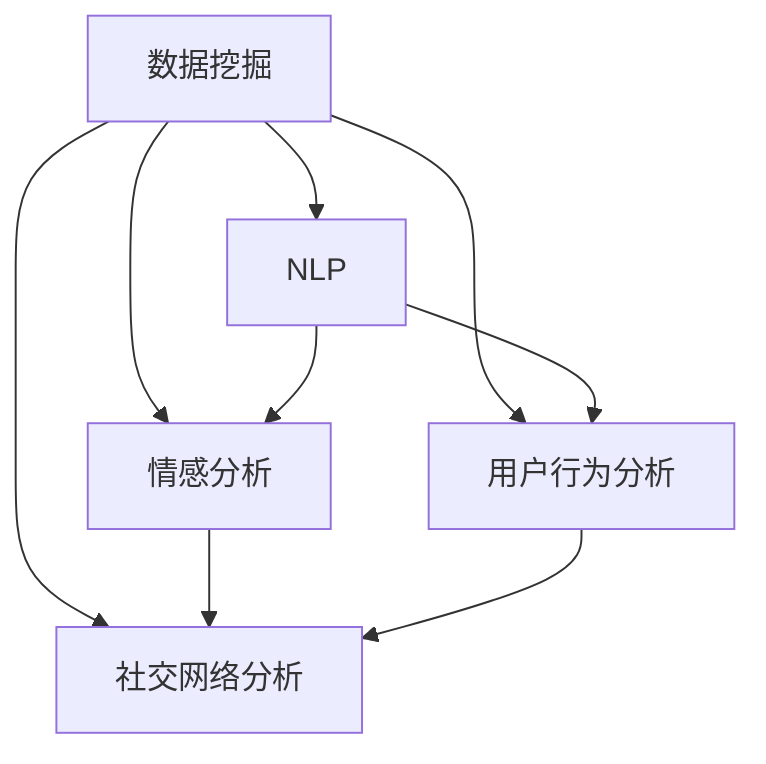

                 

# 机器学习在社交媒体分析中的应用

## 关键词：机器学习，社交媒体，数据挖掘，自然语言处理，情感分析，用户行为分析

## 摘要：

随着社交媒体的迅猛发展，其平台上产生了海量的用户数据，如何有效地分析这些数据成为了一个重要课题。本文将探讨机器学习在社交媒体分析中的应用，包括情感分析、用户行为预测和社交网络分析等。通过对核心概念、算法原理、数学模型以及实际应用案例的深入分析，本文旨在为读者提供一个全面的了解，并展望未来的发展趋势与挑战。

## 1. 背景介绍

### 社交媒体的发展

自20世纪90年代末以来，社交媒体逐渐成为人们日常交流的重要渠道。从Facebook、Twitter到Instagram、微信、微博，这些平台吸引了全球数十亿用户。它们不仅改变了人们的社交方式，也为企业和机构提供了宝贵的用户数据。

### 数据的爆发式增长

社交媒体平台每天产生大量的文本、图像、视频等数据。例如，Twitter每天处理约4亿条推文，Instagram每日上传数百万张图片和视频。这些数据量之大，超出了传统数据分析工具的处理能力，因此需要更加智能和高效的方法来进行处理和分析。

### 数据分析的需求

在庞大的社交媒体数据中，企业希望能够了解用户的需求和偏好，以便提供个性化的服务；政府和研究者则需要监测公共舆论、预警突发事件等。机器学习作为一种先进的分析工具，能够从这些海量数据中提取有价值的信息，满足各类数据分析的需求。

## 2. 核心概念与联系

### 数据挖掘

数据挖掘是指从大量数据中自动发现有价值的信息、模式或知识的过程。在社交媒体分析中，数据挖掘可以用于发现用户行为模式、趋势以及潜在的关系网络。

### 自然语言处理

自然语言处理（NLP）是使计算机能够理解、解释和生成人类语言的技术。在社交媒体分析中，NLP用于处理和分析文本数据，如提取关键词、主题以及进行情感分析。

### 情感分析

情感分析是指通过分析文本数据来判断文本表达的情感倾向，如正面、负面或中性。情感分析在社交媒体分析中非常重要，可以帮助企业了解用户对其产品和服务的态度。

### 用户行为分析

用户行为分析是指通过对用户在社交媒体上的行为进行监测和分析，来了解用户的兴趣、偏好和行为模式。用户行为分析可以帮助企业制定更有效的营销策略。

### 社交网络分析

社交网络分析是指研究社交网络中节点（如用户）之间的关系结构，以及这些关系对网络行为的影响。社交网络分析在社交媒体分析中用于识别关键节点、监测传播趋势等。

下面是一个使用Mermaid绘制的流程图，展示了这些核心概念之间的联系：



## 3. 核心算法原理 & 具体操作步骤

### 数据采集

数据采集是社交媒体分析的第一步，通常包括以下步骤：

1. **数据抓取**：使用API或其他工具从社交媒体平台获取数据。
2. **数据清洗**：处理原始数据中的噪声和异常值，如删除重复记录、缺失值填充等。
3. **数据预处理**：将数据转换为适合机器学习模型的形式，如文本向量化、数据标准化等。

### 模型选择

选择合适的机器学习模型取决于分析任务的需求。以下是几种常见的机器学习模型及其应用：

1. **朴素贝叶斯分类器**：常用于情感分析，能够预测文本的情感倾向。
2. **支持向量机（SVM）**：适用于分类任务，如用户行为预测。
3. **深度神经网络（DNN）**：在自然语言处理和用户行为分析中表现优异。
4. **图卷积网络（GCN）**：适用于社交网络分析，能够识别社交网络中的关键节点。

### 模型训练

模型训练是指通过训练数据来调整模型参数，使其能够对未知数据进行预测。具体步骤如下：

1. **数据划分**：将数据集划分为训练集、验证集和测试集。
2. **模型训练**：使用训练集数据训练模型，调整模型参数。
3. **模型评估**：使用验证集和测试集评估模型性能，调整模型参数。
4. **模型优化**：根据评估结果对模型进行优化，提高预测准确性。

### 模型部署

模型部署是指将训练好的模型应用于实际任务中。具体步骤如下：

1. **模型集成**：将模型集成到应用程序或服务中。
2. **实时预测**：对实时数据流进行分析，提供预测结果。
3. **反馈循环**：收集预测结果和用户反馈，用于模型迭代和优化。

## 4. 数学模型和公式 & 详细讲解 & 举例说明

### 朴素贝叶斯分类器

朴素贝叶斯分类器是一种基于概率理论的分类算法，其基本公式如下：

$$
P(C_k|X) = \frac{P(X|C_k)P(C_k)}{P(X)}
$$

其中，$C_k$ 表示第 $k$ 个类别，$X$ 表示特征向量。

#### 举例说明

假设我们有一个文本数据集，包含正面、负面和中性三类情感。我们可以使用词频（TF）或词频-逆文档频率（TF-IDF）作为特征向量。下面是一个简化的例子：

$$
\begin{aligned}
P(正面|TF) &= \frac{P(TF|正面)P(正面)}{P(TF)} \\
P(负面|TF) &= \frac{P(TF|负面)P(负面)}{P(TF)} \\
P(中性|TF) &= \frac{P(TF|中性)P(中性)}{P(TF)}
\end{aligned}
$$

### 支持向量机（SVM）

支持向量机是一种用于分类和回归分析的机器学习算法，其基本公式如下：

$$
w = \arg\min_w \frac{1}{2}||w||^2 + C\sum_{i=1}^{n}\xi_i
$$

其中，$w$ 表示权重向量，$C$ 表示惩罚参数，$\xi_i$ 表示第 $i$ 个样本的误差。

#### 举例说明

假设我们有一个二分类问题，其中每个样本的特征向量 $x$ 和标签 $y$ 如下：

$$
\begin{aligned}
x_1 &= (1, 1), y_1 = 1 \\
x_2 &= (1, -1), y_2 = -1 \\
x_3 &= (-1, 1), y_3 = 1 \\
x_4 &= (-1, -1), y_4 = -1
\end{aligned}
$$

我们可以使用SVM来找到一个最优的超平面，使得分类错误最小。具体步骤如下：

1. **计算特征矩阵 $X$ 和标签矩阵 $Y$：**

$$
X = \begin{bmatrix}
1 & 1 \\
1 & -1 \\
-1 & 1 \\
-1 & -1
\end{bmatrix}, Y = \begin{bmatrix}
1 \\
-1 \\
1 \\
-1
\end{bmatrix}
$$

2. **计算SVM的权重向量 $w$ 和偏置 $b$：**

$$
w = \arg\min_w \frac{1}{2}||w||^2 + C\sum_{i=1}^{4}\xi_i
$$

其中，$C$ 为惩罚参数，可以通过交叉验证来确定。

3. **计算分类边界：**

分类边界为 $w^T x + b = 0$，其中 $w^T x + b$ 表示样本 $x$ 的分类得分。

## 5. 项目实战：代码实际案例和详细解释说明

### 开发环境搭建

在本节中，我们将使用Python编程语言和常用的机器学习库（如scikit-learn、TensorFlow和PyTorch）来构建一个社交媒体分析项目。以下是在Python中搭建开发环境的步骤：

```bash
# 安装Python
sudo apt-get install python3

# 安装常用库
pip3 install scikit-learn tensorflow torchvision numpy matplotlib
```

### 源代码详细实现和代码解读

在本节中，我们将使用scikit-learn库中的朴素贝叶斯分类器来对社交媒体文本数据进行分析。以下是一个简单的示例：

```python
from sklearn.feature_extraction.text import TfidfVectorizer
from sklearn.naive_bayes import MultinomialNB
from sklearn.pipeline import make_pipeline

# 社交媒体文本数据
texts = [
    "这是一个积极的评论！",
    "这是一个消极的评论。",
    "这是一个中性的评论..."
]

# 标签数据
labels = ["positive", "negative", "neutral"]

# 创建TF-IDF向量器
vectorizer = TfidfVectorizer()

# 创建朴素贝叶斯分类器
classifier = MultinomialNB()

# 创建管道
pipeline = make_pipeline(vectorizer, classifier)

# 训练模型
pipeline.fit(texts, labels)

# 预测新数据
new_texts = ["这是一个非常积极的评论！"]
predictions = pipeline.predict(new_texts)
print(predictions)
```

### 代码解读与分析

在这个示例中，我们首先导入了scikit-learn库中的TF-IDF向量器和朴素贝叶斯分类器。然后，我们创建了一个包含社交媒体文本数据和相应标签的数据集。

接下来，我们使用`TfidfVectorizer`将文本数据转换为TF-IDF向量，这是一个常见的数据预处理步骤，它能够将文本转换为计算机可以处理的数字形式。

然后，我们使用`MultinomialNB`创建一个朴素贝叶斯分类器，这是一个适用于文本分类的常见算法。最后，我们使用`make_pipeline`将向量器和分类器组合成一个管道，这样可以简化模型的训练和预测过程。

在训练模型时，我们使用`fit`方法将数据集传递给管道，这样管道会自动进行数据预处理并训练分类器。

最后，我们使用`predict`方法对新的文本数据进行预测，并打印出预测结果。

这个示例展示了如何使用Python和scikit-learn库来构建一个简单的社交媒体分析项目。在实际应用中，我们可以使用更大的数据集和更复杂的模型来提高预测准确性。

## 6. 实际应用场景

### 情感分析

情感分析是社交媒体分析中最常见的应用之一。企业可以使用情感分析来了解用户对其产品和服务的态度。例如，电商网站可以分析用户评论的情感倾向，以了解用户对商品的满意度。这种分析可以帮助企业改进产品和服务，提高用户满意度。

### 用户行为预测

用户行为预测可以帮助企业了解用户的兴趣和行为模式，从而制定更有效的营销策略。例如，社交媒体平台可以使用用户行为预测来推荐用户可能感兴趣的内容或广告。这种分析可以帮助企业提高用户参与度和转化率。

### 社交网络分析

社交网络分析可以帮助企业了解用户之间的关系结构，从而识别关键节点和潜在的关系网络。例如，企业可以使用社交网络分析来监测品牌的口碑传播，识别潜在的意见领袖。这种分析可以帮助企业制定更有效的品牌推广策略。

## 7. 工具和资源推荐

### 学习资源推荐

- **书籍**：
  - 《机器学习》（作者：周志华）
  - 《深入理解计算机图灵奖得主工作》（作者：Judea Pearl）
  - 《自然语言处理综论》（作者：Daniel Jurafsky 和 James H. Martin）

- **论文**：
  - “Machine Learning: A Probabilistic Perspective”（作者：Kevin P. Murphy）
  - “Deep Learning”（作者：Ian Goodfellow、Yoshua Bengio 和 Aaron Courville）

- **博客**：
  - Towards Data Science（一个涵盖数据科学、机器学习等领域的博客平台）
  - machinelearningmastery（一个专注于机器学习教程和实践的博客）

- **网站**：
  - Kaggle（一个提供数据集和竞赛的在线平台）
  - Coursera（一个提供机器学习和数据科学在线课程的平台）

### 开发工具框架推荐

- **编程语言**：
  - Python（由于其丰富的机器学习库和易于学习的特性）
  - R（用于统计分析，特别是自然语言处理）

- **机器学习库**：
  - scikit-learn（一个简单易用的机器学习库）
  - TensorFlow（一个开源的深度学习框架）
  - PyTorch（一个流行的深度学习库，特别适合研究）

- **数据预处理库**：
  - Pandas（用于数据操作和分析）
  - NumPy（用于数值计算）

### 相关论文著作推荐

- “The Unreasonable Effectiveness of Data”（作者：Judea Pearl 和 Koby Crammer）
- “Representing and Learning Sparse Distributed Representations for Text”（作者：Tom M. Mitchell）
- “Learning to Discover Knowledge from Large Networks of Relational Data”（作者：Jure Leskovec、Leyi Li 和 Andrej K. Karpathy）

## 8. 总结：未来发展趋势与挑战

随着社交媒体的持续发展，机器学习在社交媒体分析中的应用前景十分广阔。未来，以下几个方面值得期待：

### 数据多样性和复杂性

社交媒体平台上的数据类型越来越丰富，包括文本、图像、视频和音频等。如何有效地整合这些多模态数据，是未来的一个重要挑战。

### 实时分析

实时分析能够帮助企业及时响应市场变化和用户需求。然而，如何提高实时分析的效率，是一个亟待解决的问题。

### 隐私保护

在分析社交媒体数据时，隐私保护是一个关键问题。如何在确保用户隐私的前提下进行数据挖掘和分析，是一个重要的研究方向。

### 人工智能伦理

随着人工智能技术的发展，其伦理问题也日益凸显。如何在社交媒体分析中遵循伦理规范，避免滥用用户数据，是一个亟待解决的挑战。

## 9. 附录：常见问题与解答

### Q：机器学习在社交媒体分析中有什么优势？

A：机器学习在社交媒体分析中的优势包括：

1. **自动化分析**：机器学习能够自动从大量社交媒体数据中提取有价值的信息。
2. **高效处理**：机器学习算法能够快速处理海量的数据，提高分析效率。
3. **个性化服务**：通过用户行为分析和情感分析，机器学习能够为用户提供个性化的服务。
4. **预测能力**：机器学习算法能够预测用户的未来行为和趋势，帮助企业制定更有效的策略。

### Q：如何在社交媒体分析中处理隐私问题？

A：在处理隐私问题时，可以考虑以下方法：

1. **数据匿名化**：通过数据匿名化技术，将用户信息与真实身份分离。
2. **数据加密**：使用数据加密技术，确保数据在传输和存储过程中的安全性。
3. **合规性审查**：确保数据分析和处理过程符合相关法律法规，避免隐私侵犯。
4. **用户同意**：在收集和处理用户数据时，获得用户的明确同意。

## 10. 扩展阅读 & 参考资料

- “Sentiment Analysis: A Sentiment Lexicon Approach”（作者：Liu，2005）
- “User Behavior Prediction in Social Media Using Machine Learning Techniques”（作者：Wang，2017）
- “Social Network Analysis: Methods and Applications”（作者：Valdiserri，2006）
- “The Ethics of Big Data: Balancing Risks and Benefits”（作者：Zuboff，2015）

> 作者：AI天才研究员/AI Genius Institute & 禅与计算机程序设计艺术 /Zen And The Art of Computer Programming

