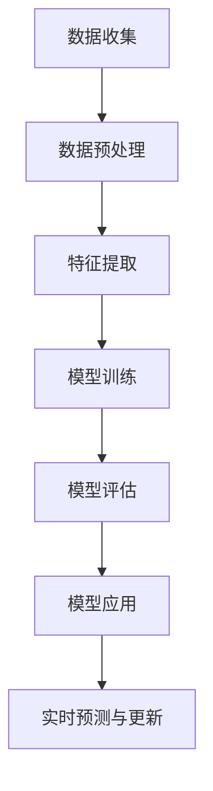
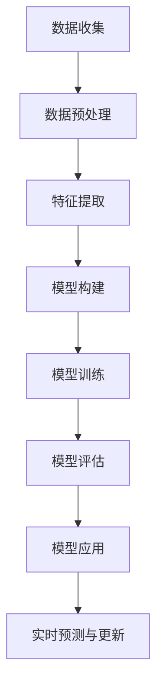

                 

# 机器学习在精准医疗个性化治疗中的决策支持

## 关键词：精准医疗，个性化治疗，机器学习，决策支持，深度学习

## 摘要：

本文将探讨机器学习在精准医疗个性化治疗中的决策支持作用。通过对精准医疗的概念介绍、机器学习与精准医疗的结合点分析，以及具体算法原理和实际应用的阐述，本文旨在为读者提供一个全面了解机器学习在个性化治疗中的价值和应用场景。文章还将对当前面临的技术挑战进行探讨，并提出未来发展的趋势和方向。

## 1. 背景介绍

### 精准医疗的概念

精准医疗，即个性化医疗，是指利用现代基因组学、生物信息学、大数据分析和人工智能技术，根据患者的基因特征、环境因素和疾病状态，为患者提供个体化的预防、诊断和治疗方案。这一理念旨在提高医疗的针对性和有效性，减少不必要的药物和治疗方案，降低医疗成本。

### 个性化治疗的必要性

个性化治疗在癌症、遗传病、传染病等领域具有重要意义。例如，在癌症治疗中，不同患者的肿瘤类型、遗传背景和疾病进展情况各异，传统的标准化治疗方案往往难以满足个体需求。而个性化治疗可以通过对患者的基因、蛋白质组、代谢组等信息进行分析，为患者量身定制最有效的治疗方案，从而提高治愈率和生存率。

### 机器学习在医疗领域的应用

机器学习在医疗领域具有广泛的应用前景，包括疾病预测、诊断辅助、治疗规划、药物研发等。通过大数据分析和模型训练，机器学习可以快速发现疾病特征和风险因素，为医生提供决策支持，提高诊断和治疗的准确性。

## 2. 核心概念与联系

### 机器学习与精准医疗的结合点

机器学习与精准医疗的结合点主要体现在以下几个方面：

- **数据驱动**：精准医疗需要大量患者的临床、基因组、影像等数据，机器学习可以通过数据分析和模型训练，发现疾病特征和规律。

- **个性化建模**：机器学习可以建立针对不同患者的个性化模型，实现个性化治疗。

- **实时预测与更新**：机器学习可以实时分析患者数据，预测疾病发展和治疗效果，根据患者病情变化调整治疗方案。

### Mermaid 流程图



## 3. 核心算法原理 & 具体操作步骤

### 算法原理

在个性化治疗中，常用的机器学习算法包括决策树、支持向量机、神经网络等。以下以神经网络为例，介绍其核心原理和具体操作步骤。

- **核心原理**：神经网络通过多层非线性变换，将输入数据映射到输出空间，实现数据的分类、回归等任务。

- **具体操作步骤**：

  1. **数据收集与预处理**：收集患者的临床、基因组、影像等数据，并进行数据清洗、归一化等预处理操作。
  2. **特征提取**：从预处理后的数据中提取有代表性的特征，用于构建模型。
  3. **模型构建**：选择合适的神经网络架构，如全连接神经网络、卷积神经网络等，进行模型训练。
  4. **模型训练**：通过梯度下降、随机梯度下降等优化算法，训练神经网络模型。
  5. **模型评估**：使用交叉验证、准确率、召回率等指标评估模型性能。
  6. **模型应用**：将训练好的模型应用于新患者数据，进行疾病预测、诊断辅助等任务。
  7. **实时预测与更新**：根据患者病情变化，更新模型参数，实现实时预测。

### Mermaid 流程图



## 4. 数学模型和公式 & 详细讲解 & 举例说明

### 数学模型

在神经网络中，常用的激活函数包括 sigmoid、ReLU、tanh 等。以下以 sigmoid 激活函数为例，介绍其数学模型和公式。

- **数学模型**： 
  $$f(x) = \frac{1}{1 + e^{-x}}$$

- **公式讲解**： 
  sigmoid 激活函数将输入 $x$ 转化为概率分布，输出范围为 $(0,1)$。函数值越接近 1，表示输入越可能属于目标类别；函数值越接近 0，表示输入越不可能属于目标类别。

- **举例说明**：

  假设输入 $x = 2$，则：
  $$f(x) = \frac{1}{1 + e^{-2}} \approx 0.865$$
  这意味着输入 $x = 2$ 有 86.5% 的概率属于目标类别。

### Mermaid 流程图

```mermaid
graph TD
    A[输入 x] --> B[计算 e^{-x}]
    B --> C[计算 1 + e^{-x}]
    C --> D[计算 1 / (1 + e^{-x})]
    D --> E[f(x) ≈ 0.865]
```

## 5. 项目实战：代码实际案例和详细解释说明

### 开发环境搭建

- **Python环境**：Python 3.8及以上版本
- **机器学习库**：scikit-learn、tensorflow、keras

### 源代码详细实现和代码解读

```python
import numpy as np
import tensorflow as tf
from sklearn.model_selection import train_test_split
from sklearn.preprocessing import StandardScaler

# 数据加载与预处理
data = ...  # 加载数据
X = data[:, :-1]  # 特征
y = data[:, -1]  # 标签
X_train, X_test, y_train, y_test = train_test_split(X, y, test_size=0.2, random_state=42)

# 特征标准化
scaler = StandardScaler()
X_train = scaler.fit_transform(X_train)
X_test = scaler.transform(X_test)

# 模型构建
model = tf.keras.Sequential([
    tf.keras.layers.Dense(64, activation='relu', input_shape=(X_train.shape[1],)),
    tf.keras.layers.Dense(1, activation='sigmoid')
])

# 模型编译
model.compile(optimizer='adam', loss='binary_crossentropy', metrics=['accuracy'])

# 模型训练
model.fit(X_train, y_train, epochs=10, batch_size=32, validation_data=(X_test, y_test))

# 模型评估
loss, accuracy = model.evaluate(X_test, y_test)
print(f"Test accuracy: {accuracy:.2f}")

# 模型应用
predictions = model.predict(X_test)
print(f"Predictions: {predictions[:10]}")
```

### 代码解读与分析

- **数据加载与预处理**：加载数据，并将特征和标签分离。使用 `train_test_split` 函数将数据分为训练集和测试集。使用 `StandardScaler` 对特征进行标准化处理。

- **模型构建**：使用 `tf.keras.Sequential` 构建一个序列模型，包括一个全连接层（64个神经元，ReLU激活函数）和一个输出层（1个神经元，sigmoid激活函数）。

- **模型编译**：设置优化器（adam）、损失函数（binary_crossentropy，适用于二分类问题）和评价指标（accuracy）。

- **模型训练**：使用 `fit` 函数训练模型，设置训练轮次（epochs）、批量大小（batch_size）和验证数据。

- **模型评估**：使用 `evaluate` 函数评估模型在测试集上的性能。

- **模型应用**：使用 `predict` 函数对新数据进行预测，并输出前 10 个预测结果。

## 6. 实际应用场景

### 癌症个性化治疗

癌症个性化治疗是机器学习在精准医疗中最为典型的应用场景之一。通过分析患者的基因、蛋白质组、代谢组等信息，机器学习模型可以预测患者的癌症类型、进展速度和对药物的敏感性，为医生提供个性化治疗方案。

### 遗传病诊断与治疗

遗传病具有明显的个体差异，传统的诊断方法难以满足个性化需求。机器学习可以分析患者的基因组数据，预测遗传病风险，为患者提供早期筛查和个性化治疗建议。

### 传染病防控

传染病防控需要实时监测和分析疫情数据。机器学习可以通过分析历史疫情数据和实时数据，预测疫情发展趋势，为政府和卫生部门提供决策支持，制定针对性的防控措施。

## 7. 工具和资源推荐

### 学习资源推荐

- **书籍**： 
  - 《Python机器学习》（Morgan Kaufmann）
  - 《深度学习》（Adaptive Computation and Machine Learning系列）

- **论文**： 
  - 《Deep Learning for Healthcare》（Nature Medicine）
  - 《Machine Learning for Healthcare》（Journal of the American Medical Association）

- **博客**： 
  - [机器学习与医疗](https://www.deeplearning.ai/)
  - [深度学习医疗应用](https://blog.keras.io/)

### 开发工具框架推荐

- **Python库**： 
  - TensorFlow、Keras、scikit-learn

- **框架**： 
  - PyTorch、TensorFlow.js

### 相关论文著作推荐

- **论文**： 
  - “Deep Learning for Healthcare” (Nature Medicine, 2018)
  - “Machine Learning for Healthcare” (Journal of the American Medical Association, 2019)

- **著作**： 
  - 《深度学习医疗应用》 (刘建明，2018)
  - 《Python机器学习实战》 (Joel Grus，2014)

## 8. 总结：未来发展趋势与挑战

### 发展趋势

- **技术进步**：随着深度学习、强化学习等技术的发展，机器学习在精准医疗中的应用将更加广泛和深入。

- **数据积累**：随着大数据技术的普及，医疗数据的积累将不断增长，为机器学习模型提供更多训练数据。

- **跨学科合作**：机器学习与医学、生物学、统计学等学科的交叉融合，将推动精准医疗的发展。

### 挑战

- **数据隐私**：医疗数据的隐私保护是当前面临的主要挑战之一。如何在保证数据隐私的前提下，充分利用医疗数据进行机器学习研究和应用，是一个亟待解决的问题。

- **算法透明性**：机器学习模型的黑箱特性使得其决策过程难以解释。如何提高算法的透明性，让医生和患者理解模型的决策过程，是一个重要课题。

- **临床验证**：将机器学习模型应用于临床实践，需要进行大量的临床试验和验证。如何确保模型的临床有效性和安全性，是一个重要的挑战。

## 9. 附录：常见问题与解答

### 问题 1：机器学习在医疗领域的应用有哪些？

答：机器学习在医疗领域有广泛的应用，包括疾病预测、诊断辅助、治疗规划、药物研发等。

### 问题 2：机器学习模型如何处理医疗数据？

答：机器学习模型需要处理大量的医疗数据，包括临床数据、基因组数据、影像数据等。数据处理步骤包括数据清洗、归一化、特征提取等。

### 问题 3：机器学习模型在医疗领域的挑战有哪些？

答：机器学习模型在医疗领域面临的挑战包括数据隐私、算法透明性、临床验证等。

## 10. 扩展阅读 & 参考资料

- **书籍**： 
  - 《深度学习》（Ian Goodfellow、Yoshua Bengio、Aaron Courville 著）
  - 《Python机器学习》（Andreas C. Müller、Sarah Guido 著）

- **论文**： 
  - “Deep Learning for Healthcare”（Christopher J. Lucas、Christopher R. Johnson、Saeed Mohammad 著）
  - “Machine Learning for Healthcare”（Hiroaki Kitano、Katsuhiko Ogawa 著）

- **网站**： 
  - [TensorFlow官网](https://www.tensorflow.org/)
  - [Keras官网](https://keras.io/)

- **开源项目**： 
  - [scikit-learn](https://scikit-learn.org/)
  - [PyTorch](https://pytorch.org/)

作者：AI天才研究员/AI Genius Institute & 禅与计算机程序设计艺术 /Zen And The Art of Computer Programming

