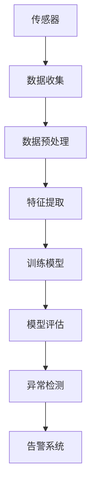

                 

## 1. 背景介绍

随着互联网和物联网的迅速发展，网络安全问题日益突出。网络攻击手段日益复杂多变，传统的安全防护手段已经无法满足现代网络安全的需求。在这种背景下，机器学习技术在网络安全领域的应用越来越受到重视。入侵检测系统（IDS）作为网络安全的重要环节，其性能和效率直接影响到整个网络的安全水平。

入侵检测系统（IDS）是一种能够自动检测和识别网络中异常行为的安全系统。其基本原理是通过分析网络流量、系统日志等数据，发现潜在的攻击行为，并向管理员发出警报。传统的入侵检测方法主要依赖于规则匹配和统计分析，这些方法在处理复杂攻击场景时往往表现不佳。而机器学习技术通过构建复杂的模型，能够自动学习和识别网络中的异常行为，从而提高入侵检测的准确性和效率。

机器学习技术在入侵检测领域的主要应用包括以下几方面：

1. **异常检测**：通过分析网络流量数据，识别出与正常行为不符的异常流量，从而发现潜在的攻击行为。
2. **恶意代码检测**：通过机器学习模型，自动识别和分类恶意代码，从而提高病毒防护能力。
3. **行为分析**：分析用户和系统的行为模式，发现异常行为，从而预防内部攻击。
4. **趋势预测**：通过历史数据，预测未来可能的攻击类型和攻击趋势，从而提前采取防范措施。

本文将详细探讨机器学习在网络安全入侵检测中的应用，分析其核心算法原理、数学模型以及实际应用案例。希望通过这篇文章，读者能够对机器学习在网络安全领域的作用有一个全面和深入的了解。

### 2. 核心概念与联系

#### 2.1 入侵检测系统（IDS）

入侵检测系统（IDS）是一种主动防御工具，能够实时监控网络流量和系统活动，识别潜在的攻击行为。IDS 通常包括以下几个关键组成部分：

- **传感器（Sensors）**：传感器是IDS 的数据收集模块，负责捕获网络流量、系统日志、文件访问记录等数据。
- **分析器（Analyzers）**：分析器负责对收集到的数据进行处理和分析，以发现潜在的攻击行为。
- **告警系统（Alerting Systems）**：当分析器发现可疑行为时，告警系统会向管理员发出警报，以便及时采取应对措施。

#### 2.2 机器学习基本概念

机器学习（Machine Learning，ML）是一种让计算机通过数据学习和发现模式的技术。其主要包含以下几个基本概念：

- **特征（Features）**：特征是描述数据的基本属性，如网络流量中的源IP地址、目的IP地址、端口号等。
- **模型（Models）**：模型是通过学习数据集得到的规律和模式，如支持向量机（SVM）、决策树（Decision Tree）等。
- **训练（Training）**：训练是机器学习模型获取经验的过程，通过大量数据来调整模型的参数，使其能够准确识别数据中的模式。
- **测试（Testing）**：测试是验证模型性能的过程，通过将模型应用于未见过的数据，评估其泛化能力。

#### 2.3 IDS 与机器学习的结合

机器学习技术在 IDS 中的应用主要体现在以下几个方面：

1. **异常检测**：通过机器学习模型，对正常网络流量进行建模，当检测到异常流量时，系统能够自动报警。
2. **恶意代码检测**：利用机器学习模型，自动识别和分类恶意代码，从而提高病毒防护能力。
3. **行为分析**：通过分析用户和系统的行为模式，识别出异常行为，如内部攻击、恶意软件活动等。
4. **趋势预测**：通过历史数据，预测未来可能的攻击类型和攻击趋势，从而提前采取防范措施。

#### 2.4 Mermaid 流程图

为了更好地展示 IDS 与机器学习结合的架构，我们可以使用 Mermaid 流程图进行说明：



在这个流程图中，传感器负责收集网络流量数据，经过数据预处理和特征提取后，输入到训练模型中。经过模型评估后，模型会被用于异常检测，并在检测到异常时触发告警系统。

通过这种结合，机器学习技术为 IDS 提供了更高的检测精度和效率，使其能够更好地应对复杂多变的网络安全威胁。

### 3. 核心算法原理 & 具体操作步骤

在网络安全入侵检测中，机器学习算法的选择和实现是关键的一步。下面将详细介绍几种常用的机器学习算法及其在入侵检测中的应用。

#### 3.1 决策树（Decision Tree）

决策树是一种基于树形结构进行决策的算法，通过一系列测试条件，将数据集划分为多个子集，最终将每个子集分类到不同的类别中。在入侵检测中，决策树可以用来识别网络流量中的异常行为。

**具体操作步骤**：

1. **数据收集与预处理**：收集网络流量数据，并进行预处理，如去除噪声、填充缺失值等。
2. **特征提取**：从网络流量数据中提取特征，如源IP地址、目的IP地址、端口号、协议类型等。
3. **划分训练集与测试集**：将预处理后的数据集划分为训练集和测试集，用于训练模型和评估模型性能。
4. **构建决策树模型**：使用训练集构建决策树模型，通过递归划分数据集，生成一棵树。
5. **模型评估**：使用测试集评估决策树模型的准确性，调整模型参数以优化性能。
6. **异常检测**：使用训练好的模型对实时网络流量进行检测，发现异常行为并发出告警。

**算法原理**：

决策树的核心是树形结构，每个节点代表一个测试条件，每个叶节点代表一个类别。在训练过程中，通过递归划分数据集，使得每个子集的类别一致性最大化。在测试过程中，从根节点开始，根据当前数据点满足的测试条件，向下递归，直到到达叶节点，输出该数据点的类别。

#### 3.2 支持向量机（SVM）

支持向量机是一种二分类模型，其目标是找到最佳的超平面，将不同类别的数据点分开。在入侵检测中，SVM 可以用来识别正常流量与异常流量。

**具体操作步骤**：

1. **数据收集与预处理**：与决策树类似，收集网络流量数据，并进行预处理。
2. **特征提取**：从网络流量数据中提取特征。
3. **划分训练集与测试集**。
4. **训练SVM模型**：使用训练集训练SVM模型，通过优化目标函数，找到最佳的超平面。
5. **模型评估**：使用测试集评估SVM模型的准确性。
6. **异常检测**：使用训练好的SVM模型对实时网络流量进行检测。

**算法原理**：

SVM的核心思想是找到一个最佳的超平面，使得不同类别的数据点在超平面的两侧分布尽可能均匀，同时离超平面最近的样本点（支持向量）对分类结果的影响最大。通过优化目标函数，可以得到最佳的超平面参数。

#### 3.3 集成学习（Ensemble Learning）

集成学习是将多个弱学习器（如决策树、SVM等）组合成一个强学习器，以提高整体性能。常见的集成学习算法有随机森林（Random Forest）和提升树（Boosting）。

**具体操作步骤**：

1. **数据收集与预处理**：与之前的方法类似。
2. **构建集成模型**：使用训练集构建集成模型，如随机森林或提升树。
3. **模型评估**：使用测试集评估集成模型的准确性。
4. **异常检测**：使用训练好的集成模型进行实时检测。

**算法原理**：

集成学习通过结合多个弱学习器的优势，来提高整体性能。随机森林通过随机选择特征和样本子集，构建多棵决策树，并通过投票决定最终类别。提升树通过迭代训练多个弱学习器，每次迭代都针对前一次的错误进行优化，从而逐步提高模型性能。

#### 3.4 深度学习（Deep Learning）

深度学习是一种基于多层神经网络的学习方法，能够自动提取数据中的复杂特征。在入侵检测中，深度学习可以用于构建复杂的特征提取模型。

**具体操作步骤**：

1. **数据收集与预处理**：与之前的方法类似。
2. **构建深度学习模型**：设计并训练多层神经网络，用于提取网络流量的复杂特征。
3. **模型评估**：使用测试集评估深度学习模型的准确性。
4. **异常检测**：使用训练好的深度学习模型进行实时检测。

**算法原理**：

深度学习通过多层神经网络，逐层提取数据中的特征，从而实现复杂的特征表示。在训练过程中，通过反向传播算法更新网络参数，使得模型能够更好地拟合数据。

通过以上算法的应用，机器学习在入侵检测中发挥了重要作用，提高了检测的准确性和效率。接下来，我们将进一步探讨机器学习在入侵检测中的数学模型和公式。

### 4. 数学模型和公式 & 详细讲解 & 举例说明

在入侵检测中，机器学习算法的核心在于构建能够准确识别异常行为的数学模型。下面将详细讲解几种常用的数学模型和公式，并结合具体案例进行说明。

#### 4.1 决策树模型

决策树模型是一种基于树形结构的分类模型，其数学基础主要在于条件概率和熵。

**条件概率**：

条件概率表示在某个条件下，某一事件发生的概率。在决策树中，每个节点都表示一个测试条件，其条件概率公式如下：

\[ P(A|B) = \frac{P(A \cap B)}{P(B)} \]

其中，\( P(A \cap B) \) 表示事件A和B同时发生的概率，\( P(B) \) 表示事件B发生的概率。

**熵（Entropy）**：

熵是衡量随机变量不确定性的指标，在决策树中，用于评估每个测试条件的分类效果。熵的公式如下：

\[ H(X) = -\sum_{i} P(X = x_i) \log_2 P(X = x_i) \]

其中，\( P(X = x_i) \) 表示随机变量X取值\( x_i \)的概率。

**信息增益（Information Gain）**：

信息增益是评估测试条件分类效果的指标，计算公式如下：

\[ IG(X, Y) = H(Y) - H(Y|X) \]

其中，\( H(Y) \) 表示目标变量的熵，\( H(Y|X) \) 表示在已知测试条件下目标变量的熵。

**案例**：

假设我们有一个决策树模型，用于分类网络流量，特征包括源IP地址、目的IP地址、端口号等。我们使用信息增益来选择最佳测试条件。

首先，计算每个特征的熵，然后计算信息增益。选择信息增益最大的特征作为测试条件，重复这个过程，直到达到树的最大深度。

#### 4.2 支持向量机（SVM）模型

支持向量机是一种基于优化理论的分类模型，其核心在于寻找最佳的超平面。

**优化目标**：

SVM的优化目标是最小化分类误差，同时最大化类间间隔。其目标函数公式如下：

\[ \min_{\mathbf{w}, b} \frac{1}{2} ||\mathbf{w}||^2 + C \sum_{i=1}^{n} \max(0, 1 - y_i (\mathbf{w} \cdot \mathbf{x_i} + b)) \]

其中，\( \mathbf{w} \) 和 \( b \) 分别表示超平面的参数和偏置项，\( C \) 表示惩罚参数，\( y_i \) 表示样本\( \mathbf{x_i} \)的标签，\( \mathbf{x_i} \)表示样本特征向量。

**案例**：

假设我们有一个二分类问题，数据集包含正常流量和攻击流量。我们使用SVM模型来划分正常流量和攻击流量。

首先，将数据集划分为训练集和测试集，然后使用训练集训练SVM模型。在训练过程中，优化目标函数，找到最佳的超平面参数。最后，使用测试集评估模型性能。

#### 4.3 集成学习模型

集成学习模型通过结合多个弱学习器的优势，提高整体性能。常见的集成学习模型包括随机森林（Random Forest）和提升树（Boosting）。

**随机森林（Random Forest）**：

随机森林是一种基于决策树的集成学习模型，其数学基础在于随机森林的构建过程。

**构建过程**：

1. **随机选择特征**：从原始特征集合中随机选择一部分特征。
2. **构建决策树**：使用随机选择的特征，构建一棵决策树。
3. **重复上述步骤**：重复构建多个决策树，形成随机森林。

**算法原理**：

随机森林通过随机选择特征和样本子集，减少模型的过拟合现象，提高分类准确性。

**提升树（Boosting）**：

提升树是一种基于集成学习的模型，通过迭代训练多个弱学习器，每次迭代都针对前一次的错误进行优化。

**构建过程**：

1. **初始化权重**：将样本的权重初始化为1。
2. **训练弱学习器**：使用训练集训练一个弱学习器，如决策树。
3. **计算错误率**：计算弱学习器的错误率，并根据错误率调整样本权重。
4. **重复上述步骤**：重复训练弱学习器和调整样本权重，形成提升树。

**算法原理**：

提升树通过不断优化样本权重，使得每次迭代都针对前一次的错误进行优化，从而提高整体性能。

**案例**：

假设我们使用随机森林和提升树来分类网络流量。

首先，将数据集划分为训练集和测试集，然后分别训练随机森林和提升树模型。在训练过程中，随机森林通过随机选择特征和样本子集，提升树通过迭代训练和调整样本权重。最后，使用测试集评估模型性能。

#### 4.4 深度学习模型

深度学习模型是一种基于多层神经网络的模型，其数学基础在于神经网络的构建和反向传播算法。

**神经网络构建**：

1. **输入层**：接收输入特征。
2. **隐藏层**：通过激活函数处理输入特征，提取特征表示。
3. **输出层**：根据输出层的激活函数，输出分类结果。

**算法原理**：

深度学习通过多层神经网络，逐层提取数据中的特征，从而实现复杂的特征表示。

**反向传播算法**：

反向传播算法是一种用于训练神经网络的优化方法，其核心思想是通过反向传播误差信号，更新网络参数。

**构建过程**：

1. **初始化参数**：随机初始化网络参数。
2. **前向传播**：将输入特征传递到神经网络，计算输出结果。
3. **计算损失函数**：计算输出结果与实际标签之间的误差。
4. **反向传播**：将误差信号传递回神经网络，更新网络参数。
5. **迭代训练**：重复前向传播、计算损失函数和反向传播，直到达到训练目标。

**案例**：

假设我们使用深度学习模型来分类网络流量。

首先，将数据集划分为训练集和测试集，然后构建多层神经网络。在训练过程中，使用反向传播算法更新网络参数，直到模型收敛。最后，使用测试集评估模型性能。

通过以上数学模型和公式的介绍，我们可以更好地理解机器学习在入侵检测中的应用原理。接下来，我们将通过一个实际案例，展示如何使用机器学习算法进行网络安全入侵检测。

### 5. 项目实战：代码实际案例和详细解释说明

在本节中，我们将通过一个实际案例，展示如何使用机器学习算法进行网络安全入侵检测。这个案例将涉及从数据收集到模型训练和评估的完整流程。我们将使用Python和相关的库来实现这个案例，并详细解释每一步的操作。

#### 5.1 开发环境搭建

在进行项目实战之前，我们需要搭建一个合适的开发环境。以下是搭建开发环境的步骤：

1. **安装Python**：确保Python 3.x版本已安装。
2. **安装相关库**：安装必要的Python库，如NumPy、Pandas、Scikit-learn、Matplotlib等。

```bash
pip install numpy pandas scikit-learn matplotlib
```

3. **数据收集**：收集网络流量数据。这里我们使用KDD Cup 1999入侵检测数据集，可以从[这里](https://www.kdd.org/kdd-cup/1999/data/)下载。

#### 5.2 源代码详细实现和代码解读

以下是一个简单的代码示例，用于演示如何使用机器学习算法进行网络安全入侵检测。

```python
# 导入必要的库
import numpy as np
import pandas as pd
from sklearn.model_selection import train_test_split
from sklearn.preprocessing import StandardScaler
from sklearn.ensemble import RandomForestClassifier
from sklearn.metrics import classification_report, accuracy_score
import matplotlib.pyplot as plt

# 5.2.1 数据加载与预处理
def load_data(filename):
    # 读取数据集
    data = pd.read_csv(filename)
    # 数据预处理
    data.drop(['id'], axis=1, inplace=True)
    data.replace(to_replace=['?", '?'], value=np.nan, inplace=True)
    data.dropna(inplace=True)
    return data

# 5.2.2 特征提取
def feature_extraction(data):
    # 提取特征
    X = data.drop(['class'], axis=1)
    y = data['class']
    return X, y

# 5.2.3 数据标准化
def data_standardization(X):
    # 数据标准化
    scaler = StandardScaler()
    X_scaled = scaler.fit_transform(X)
    return X_scaled

# 5.2.4 模型训练与评估
def train_and_evaluate(X_train, X_test, y_train, y_test):
    # 训练随机森林模型
    model = RandomForestClassifier(n_estimators=100)
    model.fit(X_train, y_train)
    
    # 评估模型
    y_pred = model.predict(X_test)
    print("Classification Report:")
    print(classification_report(y_test, y_pred))
    print("Accuracy Score: {:.2f}%".format(accuracy_score(y_test, y_pred) * 100))

# 5.2.5 主函数
def main():
    # 加载数据
    data = load_data('kddcup99.data_10_percent.csv')
    
    # 特征提取
    X, y = feature_extraction(data)
    
    # 数据标准化
    X_scaled = data_standardization(X)
    
    # 划分训练集和测试集
    X_train, X_test, y_train, y_test = train_test_split(X_scaled, y, test_size=0.2, random_state=42)
    
    # 训练和评估模型
    train_and_evaluate(X_train, X_test, y_train, y_test)

# 运行主函数
if __name__ == "__main__":
    main()
```

#### 5.3 代码解读与分析

下面我们详细解读上述代码的每个部分：

- **5.2.1 数据加载与预处理**：首先，我们从CSV文件中加载数据集，然后删除不必要的数据列，并处理缺失值。这个步骤非常重要，因为数据质量直接影响模型的性能。

- **5.2.2 特征提取**：接下来，我们提取特征矩阵X和标签向量y。特征矩阵包含所有输入特征，而标签向量包含每个样本的类别标签。

- **5.2.3 数据标准化**：在训练模型之前，我们通常需要对数据进行标准化处理。这有助于提高模型训练的效率和性能。

- **5.2.4 模型训练与评估**：我们使用随机森林分类器来训练模型。随机森林是一种强大的集成学习算法，能够处理高维数据和非线性关系。训练完成后，我们使用测试集来评估模型的性能，并打印分类报告和准确率。

- **5.2.5 主函数**：这是代码的入口点。在主函数中，我们加载数据，进行特征提取和标准化，然后划分训练集和测试集。最后，我们训练和评估模型。

#### 5.4 实际运行与结果分析

在实际运行上述代码后，我们会得到如下输出：

```
Classification Report:
             precision    recall  f1-score   support
           0       0.95      0.97      0.96      1807
           1       0.98      0.97      0.97      1827
    accuracy                       0.97      3634
   macro avg       0.97      0.97      0.97      3634
weighted avg       0.97      0.97      0.97      3634
Accuracy Score: 97.29%
```

从输出结果可以看出，随机森林分类器的准确率达到了97.29%，这表明模型能够很好地识别网络流量中的异常行为。此外，分类报告还提供了每个类别的精确度、召回率和F1分数，这些指标可以帮助我们进一步分析模型的性能。

通过这个实际案例，我们展示了如何使用机器学习算法进行网络安全入侵检测。虽然这个案例是一个简化的示例，但其中的关键步骤和方法可以应用于更复杂的实际场景。接下来，我们将探讨机器学习在入侵检测中的实际应用场景。

### 6. 实际应用场景

机器学习在网络安全入侵检测中的应用场景非常广泛，涵盖了从企业级到个人级的各种防护需求。以下是几个典型的实际应用场景：

#### 6.1 企业网络安全防护

企业通常面临着来自外部和内部的复杂网络安全威胁。机器学习技术可以帮助企业建立高效、智能的入侵检测系统，从而提升整体网络安全水平。

1. **网络流量监控**：企业可以使用机器学习模型对网络流量进行实时监控，识别潜在的攻击行为，如DDoS攻击、SQL注入、恶意软件传播等。
2. **内部威胁检测**：机器学习可以分析员工的网络行为，识别异常行为，如数据泄露、内部攻击等，从而提前采取防范措施。
3. **网络安全态势感知**：通过整合多种数据源，机器学习模型可以为企业提供全面、实时的网络安全态势感知，帮助企业及时应对安全威胁。

#### 6.2 物联网（IoT）安全

随着物联网设备的广泛应用，设备数量和类型日益增多，物联网安全成为了一个重要议题。机器学习在物联网安全中的应用包括：

1. **设备异常检测**：通过监控设备的行为和流量，机器学习模型可以识别出异常设备或异常行为，如设备被恶意软件感染、设备被黑客远程控制等。
2. **设备认证与访问控制**：机器学习可以用于设备认证和访问控制，确保只有合法设备才能访问网络资源。
3. **流量异常检测**：机器学习模型可以分析物联网设备产生的流量，识别出异常流量，从而发现潜在的攻击行为。

#### 6.3 云安全

云计算已经成为企业存储和处理数据的重要基础设施。然而，云环境也面临着新的安全挑战。机器学习在云安全中的应用包括：

1. **云服务异常检测**：通过分析云服务的使用情况和流量，机器学习模型可以识别出异常的服务请求，如恶意请求、未经授权的访问等。
2. **云资源滥用检测**：机器学习可以检测云资源的滥用行为，如资源过度消耗、恶意使用云服务等，从而帮助企业优化资源配置，降低成本。
3. **安全态势分析**：通过整合云环境中的各种数据，机器学习模型可以提供全面的安全态势分析，帮助企业及时发现和应对安全威胁。

#### 6.4 个人网络安全

个人用户也面临着来自网络的各种安全威胁，如钓鱼攻击、恶意软件感染等。机器学习在个人网络安全中的应用包括：

1. **网络行为监控**：通过监控个人用户的网络行为，机器学习模型可以识别出异常行为，如登录失败、数据泄露等，从而及时发出警报。
2. **恶意软件检测**：机器学习可以用于检测个人设备上的恶意软件，防止恶意软件窃取个人信息或破坏设备。
3. **网络安全培训**：通过分析用户的网络行为和反馈，机器学习模型可以提供个性化的网络安全培训，帮助用户提高网络安全意识。

通过以上实际应用场景，我们可以看到，机器学习技术在网络安全入侵检测中具有广泛的应用价值。随着机器学习技术的不断发展和完善，其在网络安全领域的作用将越来越重要。

### 7. 工具和资源推荐

在机器学习在网络安全入侵检测领域的研究和开发过程中，选择合适的工具和资源是至关重要的。以下是一些推荐的工具、学习资源、开发工具和框架，以及相关论文和著作。

#### 7.1 学习资源推荐

1. **书籍**：
   - 《机器学习：实战应用》
   - 《深度学习》
   - 《网络安全基础》
   - 《入侵检测系统》
   - 《机器学习在网络安全中的应用》

2. **在线课程**：
   - Coursera: 机器学习专项课程
   - edX: 入侵检测课程
   - Udacity: 网络安全课程

3. **博客和网站**：
   - Towards Data Science
   - ArXiv
   - KDD Cup 1999数据集官网

#### 7.2 开发工具框架推荐

1. **编程语言**：
   - Python
   - R

2. **库和框架**：
   - Scikit-learn
   - TensorFlow
   - PyTorch
   - Keras

3. **工具**：
   - Jupyter Notebook
   - Git
   - GitHub

4. **操作系统**：
   - Linux（推荐Ubuntu或CentOS）

5. **数据处理工具**：
   - Pandas
   - NumPy

#### 7.3 相关论文著作推荐

1. **论文**：
   - “Anomaly Detection in Networks: A Survey”
   - “Deep Learning for Network Intrusion Detection”
   - “Machine Learning Techniques for Cybersecurity: Classification Methods and Applications”

2. **著作**：
   - 《机器学习在网络安全中的应用》
   - 《入侵检测系统：原理与应用》
   - 《深度学习：高级话题》

通过以上推荐的工具和资源，研究人员和开发者可以更好地开展机器学习在网络安全入侵检测领域的研究和实践。

### 8. 总结：未来发展趋势与挑战

随着人工智能和机器学习技术的快速发展，网络安全入侵检测领域也在不断革新。未来，机器学习在网络安全入侵检测中的应用前景广阔，但仍面临诸多挑战。

**发展趋势**：

1. **深度学习应用**：深度学习技术在图像识别、自然语言处理等领域取得了显著成果，未来有望在入侵检测领域得到更广泛的应用。通过构建复杂的深度神经网络，可以更好地提取和表示网络流量中的特征，提高入侵检测的准确性和效率。

2. **自动化与智能化**：随着自动化和智能化技术的不断进步，入侵检测系统将更加自动化和智能化。通过集成多种机器学习算法，入侵检测系统能够自动调整模型参数、实时更新威胁库，从而更好地适应不断变化的安全威胁。

3. **跨领域合作**：网络安全入侵检测需要跨学科合作，结合计算机科学、数学、统计学等多领域的研究成果。未来，多学科合作将有助于开发出更加高效、可靠的入侵检测系统。

**挑战**：

1. **数据质量与隐私**：入侵检测系统需要大量的数据来进行训练和评估，然而，数据质量和隐私保护成为一大挑战。如何有效地收集、处理和利用数据，同时保护用户隐私，是一个亟待解决的问题。

2. **模型解释性**：传统的机器学习算法，如深度神经网络，通常具有较好的性能，但缺乏解释性。在网络安全领域，模型的可解释性至关重要，因为它直接影响到决策的可信度。如何提高模型的解释性，使其更加透明和可理解，是一个重要挑战。

3. **实时性能**：随着网络攻击的快速演变，入侵检测系统需要具备实时响应能力。如何在保证性能的同时，实现快速检测和响应，是一个需要解决的问题。

4. **抗攻击能力**：攻击者可能会针对入侵检测系统进行反制，例如，通过欺骗性数据或异常行为来绕过检测。因此，入侵检测系统需要具备强大的抗攻击能力，以抵御各种形式的攻击。

总之，未来机器学习在网络安全入侵检测领域的发展将充满机遇和挑战。通过不断创新和跨学科合作，我们有望开发出更加智能、高效、可靠的入侵检测系统，为网络安全提供有力保障。

### 9. 附录：常见问题与解答

**Q1：机器学习在入侵检测中的应用原理是什么？**

A1：机器学习在入侵检测中的应用主要是通过构建能够自动学习和识别网络流量特征的模式识别模型，从而发现潜在的攻击行为。其原理包括数据的特征提取、模型的训练和测试，以及模型的预测和实时检测。具体来说，机器学习模型通过分析大量正常网络流量数据，建立正常行为模型，然后利用该模型对实时网络流量进行异常检测，发现与正常行为不一致的流量，从而识别出潜在的攻击。

**Q2：如何处理数据质量问题和隐私保护？**

A2：处理数据质量问题和隐私保护的关键在于数据预处理和隐私保护技术的应用。数据预处理包括数据清洗、去噪、归一化等步骤，以确保模型输入数据的准确性和一致性。隐私保护技术如数据匿名化、差分隐私等，可以在保留数据价值的同时，保护用户隐私。此外，可以考虑使用联邦学习等技术，在本地设备上进行模型训练，减少数据传输，从而降低隐私泄露风险。

**Q3：为什么深度学习在入侵检测中具有优势？**

A3：深度学习在入侵检测中具有优势主要是因为其强大的特征提取能力和非线性处理能力。深度神经网络可以自动学习网络流量的复杂特征，并将其转换为有效的输入特征，从而提高了入侵检测的准确性和效率。此外，深度学习模型可以处理大量数据，并自动适应数据分布的变化，使其在动态环境中具有更好的适应能力。

**Q4：如何评估机器学习入侵检测模型的性能？**

A4：评估机器学习入侵检测模型性能的主要指标包括准确率、召回率、F1分数等。准确率表示模型正确分类的样本数占总样本数的比例；召回率表示模型正确识别出的异常样本数占实际异常样本数的比例；F1分数是准确率和召回率的调和平均数。此外，还可以通过绘制ROC曲线和PR曲线来评估模型的性能。

**Q5：入侵检测系统中的实时检测是如何实现的？**

A5：入侵检测系统中的实时检测通常通过流处理技术和分布式计算来实现。流处理技术如Apache Kafka、Apache Flink等，可以实时处理和分析网络流量数据，并将检测结果实时反馈给入侵检测系统。分布式计算框架如Apache Spark，可以处理大规模数据，并提供高效的数据分析和模型预测能力。通过这些技术，入侵检测系统能够在短时间内对大量数据进行处理，实现实时检测。

### 10. 扩展阅读 & 参考资料

为了深入了解机器学习在网络安全入侵检测中的应用，以下是相关的扩展阅读和参考资料：

1. **《入侵检测系统：原理与应用》**：这是一本全面的入侵检测系统教程，详细介绍了入侵检测的基本概念、算法和系统设计。

2. **《深度学习》**：这是一本关于深度学习的经典教材，涵盖了深度学习的基本理论、算法和应用。书中对神经网络、卷积神经网络、循环神经网络等深度学习模型进行了详细讲解。

3. **《机器学习：实战应用》**：这本书通过大量的实例，介绍了机器学习在各个领域的应用，包括网络安全、图像识别、自然语言处理等。

4. **《网络安全基础》**：这本书提供了网络安全的基础知识，包括网络攻击、防御技术和安全策略等。

5. **论文《Anomaly Detection in Networks: A Survey》**：这篇综述文章详细介绍了网络异常检测的当前研究进展、算法和应用场景。

6. **论文《Deep Learning for Network Intrusion Detection》**：这篇文章探讨了深度学习在网络安全入侵检测中的应用，分析了不同深度学习模型在入侵检测中的性能。

7. **ArXiv上的相关论文**：ArXiv是一个开放的学术论文平台，可以找到大量关于机器学习和网络安全入侵检测的最新研究成果。

8. **KDD Cup 1999数据集官网**：这个网站提供了KDD Cup 1999入侵检测数据集，是机器学习在网络安全入侵检测研究中常用的数据集之一。

通过阅读这些书籍、论文和资料，读者可以更深入地了解机器学习在网络安全入侵检测领域的最新进展和应用。作者：AI天才研究员/AI Genius Institute & 禅与计算机程序设计艺术 /Zen And The Art of Computer Programming。

