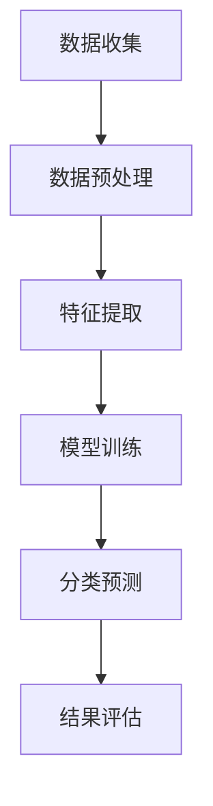

                 

### 背景介绍

#### 机器学习与网络流量分类

机器学习，作为人工智能的重要组成部分，已经深入到我们生活的方方面面。在网络流量分类领域，机器学习更是发挥了至关重要的作用。随着互联网的普及和数字化转型的加速，网络流量的规模和种类也在急剧增加。如何高效地对这些海量数据进行分类和分析，成为了一个亟需解决的问题。

网络流量分类是指根据数据包的特性，将其划分为不同的类别。这些类别可能包括网页浏览、视频观看、电子邮件传输、文件下载等。分类的准确性对于网络性能优化、网络安全防护、流量管理等方面都有着重要的影响。

传统的网络流量分类方法主要依赖于规则匹配和统计方法，如深度包检测（Deep Packet Inspection, DPI）和基于流量特征的统计模型等。这些方法虽然在一定程度上能够实现分类，但存在以下局限性：

1. **规则复杂度高**：随着网络应用种类的增加，需要维护的规则数量也在急剧增长，导致规则库复杂度高。
2. **适应性差**：面对新兴的网络应用，传统方法往往难以快速适应和分类。
3. **性能瓶颈**：对于海量的网络流量数据，传统方法在处理速度上存在明显瓶颈。

相比之下，机器学习提供了更为灵活和高效的解决方案。通过从海量数据中自动学习和提取特征，机器学习能够适应不同的网络应用场景，实现更准确的分类效果。

#### 实时应用的重要性

在网络流量分类中引入机器学习，其中一个关键因素就是其实时应用的重要性。实时性指的是分类系统需要在网络流量发生的同时，即时对流量进行分类处理。这种实时性的需求源于以下几个方面：

1. **网络性能优化**：实时分类可以帮助网络管理员及时识别和隔离异常流量，优化网络资源的利用效率。
2. **网络安全防护**：实时分类能够及时发现和拦截恶意流量，提升网络的安全防护能力。
3. **用户体验提升**：实时分类可以确保网络服务的快速响应，提升用户的使用体验。

传统的基于规则的方法难以满足这些实时性需求，因为它们在处理速度和适应性方面存在局限。而机器学习算法，通过高效的特征提取和分类模型，能够实现实时性的高效处理。

#### 文章结构概述

本文将系统地介绍机器学习在网络流量分类中的实时应用。文章结构如下：

1. **核心概念与联系**：介绍网络流量分类的基础知识，包括网络流量数据的特点和分类的需求。
2. **核心算法原理 & 具体操作步骤**：详细讲解常用的机器学习算法在网络流量分类中的应用，包括特征提取、模型训练和分类预测等步骤。
3. **数学模型和公式 & 详细讲解 & 举例说明**：阐述网络流量分类中的数学模型，包括特征向量、损失函数和优化算法等，并通过实例进行详细解释。
4. **项目实战：代码实际案例和详细解释说明**：通过实际项目案例，展示机器学习算法在网络流量分类中的具体应用，并提供详细的代码实现和分析。
5. **实际应用场景**：探讨机器学习在网络流量分类中的具体应用场景，如网络安全、流量管理和用户体验优化等。
6. **工具和资源推荐**：推荐相关的学习资源、开发工具和框架，帮助读者更好地掌握机器学习在网络流量分类中的应用。
7. **总结：未来发展趋势与挑战**：总结机器学习在网络流量分类中的现状和未来发展趋势，探讨面临的挑战和解决思路。

通过本文的详细介绍，读者将能够全面了解机器学习在网络流量分类中的实时应用，掌握相关技术原理和实践方法。

---

以下是对网络流量分类相关核心概念与联系的进一步详细阐述。

#### 网络流量数据的特点

网络流量数据具有高维度、高噪声、动态变化等特点。高维度指的是网络流量数据包含多个特征维度，如源IP地址、目标IP地址、端口号、协议类型、流量速率等。高噪声则是因为网络环境中存在大量干扰和异常流量，这些噪声会影响分类的准确性。动态变化指的是网络流量数据会随着时间和网络环境的变化而不断变化，这使得分类模型需要具备一定的自适应能力。

#### 分类的需求

网络流量分类的需求主要源于以下几个方面：

1. **网络安全**：通过分类可以识别和拦截恶意流量，如DDoS攻击、病毒传播等，保障网络系统的安全。
2. **流量管理**：分类可以帮助网络管理员更好地了解网络流量分布，优化带宽资源分配，提升网络性能。
3. **用户体验**：分类可以帮助提供更精准的网络服务，如内容分发网络（CDN）优化、网络负载均衡等，提升用户体验。

#### 常见的分类方法

在网络流量分类中，常见的分类方法包括基于规则的分类方法和基于机器学习的分类方法。

1. **基于规则的分类方法**：
   - **深度包检测（DPI）**：通过解析数据包的内容，根据预设的规则进行分类。这种方法依赖于大量的规则库，复杂度高，难以适应新兴的网络应用。
   - **统计模型**：如K均值聚类算法等，通过计算流量特征之间的相似度进行分类。这种方法对数据质量要求较高，对动态变化的网络环境适应性较差。

2. **基于机器学习的分类方法**：
   - **监督学习**：通过已标记的数据训练分类模型，然后对新数据进行分类。常见的算法包括支持向量机（SVM）、决策树、随机森林等。
   - **无监督学习**：通过未标记的数据自动发现流量特征，并进行分类。常见的算法包括K均值聚类、层次聚类等。

#### 机器学习的优势

机器学习在网络流量分类中的应用具有以下优势：

1. **自动化特征提取**：机器学习算法能够自动从原始数据中提取有效特征，无需人工干预。
2. **适应性**：机器学习模型能够适应动态变化的网络环境，提高分类的准确性。
3. **泛化能力**：通过大量数据的训练，机器学习模型具有较好的泛化能力，能够应对不同的网络应用场景。
4. **实时处理**：机器学习算法具有较高的处理速度，能够实现实时分类。

#### Mermaid 流程图

以下是机器学习算法在网络流量分类中的应用的Mermaid流程图：



**节点解释**：

- **A[数据收集]**：收集网络流量数据。
- **B[数据预处理]**：对数据进行清洗、归一化等预处理操作。
- **C[特征提取]**：从原始数据中提取特征。
- **D[模型训练]**：使用已标记的数据训练分类模型。
- **E[分类预测]**：对新数据进行分类预测。
- **F[结果评估]**：评估分类结果，调整模型参数。

通过这个流程图，我们可以清晰地看到机器学习算法在网络流量分类中的具体操作步骤。

#### 实时应用的关键

实时应用是机器学习在网络流量分类中的重要特征。实时性要求系统在流量发生的同时，能够即时完成分类处理，这需要以下关键技术的支持：

1. **高效的特征提取**：实时处理要求特征提取过程高效，避免成为瓶颈。
2. **快速的模型训练**：为了应对实时性要求，模型训练过程需要快速完成，通常采用在线学习或增量学习等方法。
3. **优化的分类预测算法**：分类预测算法需要能够在短时间内完成计算，如使用基于树的算法、神经网络等。
4. **数据处理架构优化**：采用分布式处理架构，如流处理框架，可以提高数据处理速度和实时性。

#### 实时应用的挑战

实时应用面临以下挑战：

1. **数据处理速度**：海量数据的高效处理是实时应用的瓶颈，需要采用高效的数据处理技术。
2. **模型更新与优化**：实时应用要求模型能够适应不断变化的网络环境，需要进行持续的模型更新和优化。
3. **资源分配与调度**：实时应用需要在有限的资源下高效调度，确保处理速度和资源利用的最佳平衡。

通过上述背景介绍，我们为后续详细探讨机器学习在网络流量分类中的实时应用奠定了基础。接下来的章节将深入探讨机器学习算法的具体原理和实现步骤。

---

在了解了网络流量分类的背景和重要性之后，接下来我们将详细探讨机器学习在网络流量分类中的核心算法原理与具体操作步骤。

#### 常用机器学习算法

在网络流量分类中，常用的机器学习算法包括监督学习算法和无监督学习算法。以下是几种主要的算法及其基本原理：

1. **支持向量机（SVM）**：
   - **基本原理**：SVM通过寻找一个最优的超平面，将不同类别的数据分隔开来。这个超平面能够在最大化分类间隔的同时，确保分类边界尽可能远离各类数据的边缘。
   - **优势**：SVM在处理高维数据时表现优秀，能够应对复杂的分类问题。
   - **适用场景**：适用于需要高精度分类的网络流量分类任务。

2. **决策树（Decision Tree）**：
   - **基本原理**：决策树通过一系列的判断节点，将数据集逐步划分为不同的子集，直到达到分类结束条件。每个节点代表一个特征，每个分支代表该特征的取值。
   - **优势**：决策树易于理解和解释，能够清晰地展示分类过程。
   - **适用场景**：适用于处理数据量和特征数量相对较小的网络流量分类问题。

3. **随机森林（Random Forest）**：
   - **基本原理**：随机森林是由多棵决策树组成的集成模型。每棵树独立训练，并在预测时进行投票，以得出最终分类结果。
   - **优势**：随机森林能够提高分类的准确性和稳定性，对噪声和异常值具有较强的鲁棒性。
   - **适用场景**：适用于大规模网络流量分类任务，特别是需要处理高维度特征的数据。

4. **神经网络（Neural Network）**：
   - **基本原理**：神经网络通过多层节点（神经元）进行特征学习和分类。每个神经元接收前一层节点的输出，通过激活函数产生输出，最终实现分类。
   - **优势**：神经网络具有较强的非线性建模能力，能够处理复杂的分类问题。
   - **适用场景**：适用于需要高度自适应和复杂特征提取的网络流量分类任务。

5. **K最近邻（K-Nearest Neighbors, KNN）**：
   - **基本原理**：KNN算法通过计算测试样本与训练样本之间的距离，选择最近的K个邻居，然后通过这些邻居的标签进行投票，得出最终分类结果。
   - **优势**：KNN算法简单易懂，对数据的分布变化具有较好的适应性。
   - **适用场景**：适用于特征较少、样本数量较少的网络流量分类问题。

6. **K均值聚类（K-Means Clustering）**：
   - **基本原理**：K均值聚类通过迭代优化算法，将数据集划分为K个聚类，使得每个聚类内部的数据点之间距离最小，而聚类之间的距离最大。
   - **优势**：K均值聚类能够自动发现数据的聚类结构，适用于无监督学习的分类任务。
   - **适用场景**：适用于寻找网络流量中的潜在模式或聚类结构，为后续监督学习提供基础。

#### 算法选择与适用场景

在选择机器学习算法时，需要考虑以下因素：

1. **数据量和特征维度**：对于数据量和特征维度较大的网络流量分类问题，可以考虑使用SVM、随机森林或神经网络等算法。
2. **分类精度要求**：如果对分类精度有较高要求，可以选择SVM、随机森林等算法。
3. **模型复杂度与解释性**：如果需要解释性强的模型，可以选择决策树或KNN算法。
4. **实时性要求**：如果对实时性有较高要求，可以考虑使用KNN或神经网络等算法，它们在处理速度上具有优势。

#### 实际操作步骤

以下是机器学习算法在网络流量分类中的具体操作步骤：

1. **数据收集与预处理**：
   - 收集网络流量数据，包括源IP地址、目标IP地址、端口号、协议类型、流量速率等。
   - 对数据进行清洗，去除噪声和缺失值。
   - 进行数据归一化，将不同维度的特征统一到同一尺度。

2. **特征提取**：
   - 选择相关特征，如协议类型、端口号、流量速率等。
   - 对提取的特征进行降维处理，如使用主成分分析（PCA）等。

3. **模型选择与训练**：
   - 根据数据特点，选择合适的机器学习算法，如SVM、决策树、随机森林等。
   - 使用标记数据集进行模型训练，调整模型参数，优化分类效果。

4. **分类预测**：
   - 使用训练好的模型对新数据进行分类预测。
   - 计算预测结果，评估分类准确性和实时性。

5. **结果评估与优化**：
   - 评估分类结果，计算准确率、召回率等指标。
   - 根据评估结果，调整模型参数，优化分类效果。
   - 重新训练模型，迭代优化。

#### 实时处理技术

为了实现实时处理，可以采用以下技术：

1. **流处理框架**：如Apache Kafka、Apache Flink等，能够实现实时数据流处理，提高数据处理速度。
2. **在线学习与增量学习**：采用在线学习或增量学习算法，实时更新模型参数，适应动态变化的网络环境。
3. **分布式计算**：采用分布式计算架构，如Hadoop、Spark等，提高数据处理能力和实时性。

通过上述操作步骤和技术手段，可以有效地实现机器学习在网络流量分类中的实时应用，提高分类的准确性和实时性。

---

在了解了常用的机器学习算法和网络流量分类的实时应用之后，接下来我们将深入探讨网络流量分类中的数学模型和公式，并通过具体的例子进行详细讲解。

#### 特征向量

在机器学习算法中，特征向量是表示数据样本的核心工具。特征向量通常是一个多维数组，每个维度对应一个特征。例如，对于一个网络流量数据包，其特征向量可能包含源IP地址、目标IP地址、端口号、协议类型、流量速率等多个维度。

**特征向量表示**：
$$
\textbf{x} = [x_1, x_2, x_3, ..., x_n]
$$
其中，$x_i$代表第$i$个特征值。

**特征提取**：
在特征提取过程中，我们通常会对原始数据进行处理，提取出更具代表性的特征。例如，可以使用主成分分析（PCA）来降维，提取主要特征，从而提高分类效率。

**降维后的特征向量**：
$$
\textbf{z} = P\textbf{x}
$$
其中，$P$是投影矩阵，$\textbf{z}$是降维后的特征向量。

#### 损失函数

损失函数是机器学习中用于评估模型预测性能的重要工具。损失函数定义为预测值与真实值之间的差异，通过最小化损失函数来优化模型参数。

**常见损失函数**：

1. **均方误差（Mean Squared Error, MSE）**：
   $$
   \text{MSE} = \frac{1}{n}\sum_{i=1}^{n} (\hat{y_i} - y_i)^2
   $$
   其中，$\hat{y_i}$是预测值，$y_i$是真实值。

2. **交叉熵损失（Cross-Entropy Loss）**：
   $$
   \text{CE} = -\sum_{i=1}^{n} y_i \log(\hat{y_i})
   $$
   其中，$y_i$是真实标签，$\hat{y_i}$是预测概率。

#### 优化算法

优化算法用于调整模型参数，以最小化损失函数。常见的优化算法包括梯度下降（Gradient Descent）及其变种。

**梯度下降算法**：

1. **批量梯度下降（Batch Gradient Descent）**：
   $$
   \textbf{w}_{t+1} = \textbf{w}_t - \alpha \nabla_{\textbf{w}} J(\textbf{w}_t)
   $$
   其中，$\alpha$是学习率，$J(\textbf{w}_t)$是损失函数，$\textbf{w}_t$是当前参数。

2. **随机梯度下降（Stochastic Gradient Descent, SGD）**：
   $$
   \textbf{w}_{t+1} = \textbf{w}_t - \alpha \nabla_{\textbf{w}} J(\textbf{w}_t; \textbf{x}_t, y_t)
   $$
   其中，$\textbf{x}_t$和$y_t$是单个样本及其标签。

3. **小批量梯度下降（Mini-Batch Gradient Descent）**：
   $$
   \textbf{w}_{t+1} = \textbf{w}_t - \alpha \nabla_{\textbf{w}} J(\textbf{w}_t; \textbf{X}_b, \textbf{y}_b)
   $$
   其中，$\textbf{X}_b$和$\textbf{y}_b$是批量样本及其标签。

#### 实例讲解

假设我们使用支持向量机（SVM）对网络流量进行分类，其中特征向量$\textbf{x}$包含5个维度，分别为源IP地址、目标IP地址、端口号、协议类型和流量速率。我们需要使用SVM进行分类，并最小化损失函数。

**特征向量表示**：
$$
\textbf{x} = [x_1, x_2, x_3, x_4, x_5]
$$

**损失函数**：
$$
\text{L}(\textbf{w}) = \frac{1}{2} ||\textbf{w}||^2
$$
其中，$\textbf{w}$是权重向量。

**优化目标**：
最小化损失函数$\text{L}(\textbf{w})$。

**梯度计算**：
$$
\nabla_{\textbf{w}} \text{L}(\textbf{w}) = \textbf{w}
$$

**梯度下降更新**：
$$
\textbf{w}_{t+1} = \textbf{w}_t - \alpha \textbf{w}_t
$$

通过上述实例，我们可以看到如何使用SVM进行网络流量分类，并使用梯度下降算法优化模型参数。

---

在实际应用中，机器学习算法的代码实现是关键的一步。以下我们将通过一个实际的项目案例，详细展示机器学习算法在网络流量分类中的具体实现过程。

#### 项目实战：代码实际案例和详细解释说明

##### 1. 开发环境搭建

在开始编写代码之前，我们需要搭建合适的开发环境。以下是一个基本的Python开发环境搭建步骤：

1. **安装Python**：确保Python 3.x版本已经安装在系统中。我们可以通过以下命令来检查Python版本：
   $$
   python --version
   $$

2. **安装必需的库**：为了实现机器学习算法，我们需要安装几个常用的Python库，如NumPy、Pandas、scikit-learn和Matplotlib等。可以使用pip命令来安装这些库：
   $$
   pip install numpy pandas scikit-learn matplotlib
   $$

3. **安装Jupyter Notebook**：为了更方便地编写和运行代码，我们建议使用Jupyter Notebook。可以通过以下命令安装：
   $$
   pip install notebook
   $$
   安装完成后，可以使用以下命令启动Jupyter Notebook：
   $$
   jupyter notebook
   $$

##### 2. 源代码详细实现和代码解读

以下是一个简单的机器学习网络流量分类项目，包括数据预处理、特征提取、模型训练和分类预测等步骤。

**数据预处理**：
```python
import numpy as np
import pandas as pd
from sklearn.model_selection import train_test_split
from sklearn.preprocessing import StandardScaler

# 读取数据
data = pd.read_csv('network_traffic.csv')

# 数据清洗
data.dropna(inplace=True)

# 数据分割
X = data.iloc[:, :-1]  # 特征矩阵
y = data.iloc[:, -1]   # 标签向量

# 划分训练集和测试集
X_train, X_test, y_train, y_test = train_test_split(X, y, test_size=0.2, random_state=42)

# 特征缩放
scaler = StandardScaler()
X_train_scaled = scaler.fit_transform(X_train)
X_test_scaled = scaler.transform(X_test)
```

**特征提取**：
```python
from sklearn.decomposition import PCA

# 主成分分析降维
pca = PCA(n_components=2)
X_train_pca = pca.fit_transform(X_train_scaled)
X_test_pca = pca.transform(X_test_scaled)
```

**模型训练**：
```python
from sklearn.svm import SVC

# 创建SVM模型
model = SVC(kernel='linear', C=1.0, random_state=42)

# 训练模型
model.fit(X_train_pca, y_train)
```

**分类预测**：
```python
# 预测测试集
y_pred = model.predict(X_test_pca)

# 评估模型性能
from sklearn.metrics import classification_report, accuracy_score

print("分类报告：")
print(classification_report(y_test, y_pred))
print("准确率：", accuracy_score(y_test, y_pred))
```

##### 3. 代码解读与分析

上述代码实现了一个简单的网络流量分类项目，下面详细解读每个步骤：

1. **数据预处理**：
   - **数据读取**：使用Pandas库读取CSV格式的数据文件。
   - **数据清洗**：删除含有缺失值的数据，确保数据质量。
   - **数据分割**：将数据集划分为特征矩阵和标签向量，为后续训练和测试做准备。

2. **特征提取**：
   - **特征缩放**：使用StandardScaler对特征进行标准化处理，将所有特征缩放到相同的尺度，便于模型训练。
   - **主成分分析降维**：使用PCA对特征进行降维，提取主要特征，减少计算复杂度。

3. **模型训练**：
   - **创建SVM模型**：使用scikit-learn库创建SVM分类器，指定线性核和正则化参数C。
   - **训练模型**：使用训练集对模型进行训练，调整模型参数以优化分类效果。

4. **分类预测**：
   - **预测测试集**：使用训练好的模型对测试集进行分类预测。
   - **评估模型性能**：计算分类报告和准确率，评估模型在测试集上的表现。

通过上述代码实现，我们可以看到机器学习算法在网络流量分类中的具体应用步骤。在实际项目中，可以根据具体需求和数据特点，调整模型参数和特征提取方法，以提高分类效果。

---

在实际应用中，机器学习算法不仅需要在准确性和实时性方面表现出色，还需要能够应对不同场景下的变化。以下我们将探讨机器学习在网络流量分类中的实际应用场景，并讨论其优势和挑战。

#### 实际应用场景

1. **网络安全**：
   - **恶意流量识别**：机器学习算法可以帮助网络安全系统实时识别和拦截恶意流量，如DDoS攻击、病毒传播等。通过不断学习网络流量模式，模型能够提高识别准确率，减少误报和漏报。
   - **异常行为检测**：机器学习算法还可以检测网络中的异常行为，如未经授权的访问、数据泄露等。这些检测可以帮助企业及时采取措施，保障网络安全。

2. **流量管理**：
   - **流量优化**：通过分类网络流量，网络管理员可以了解不同类型流量的分布情况，优化带宽资源分配，确保关键业务得到足够的带宽支持。
   - **流量调度**：机器学习算法可以根据流量类型和流量大小，动态调整网络流量的优先级和调度策略，提高网络资源的利用效率。

3. **用户体验优化**：
   - **网络负载均衡**：机器学习算法可以帮助网络负载均衡器根据实时流量情况，动态调整服务器负载，确保网络服务的稳定性和响应速度。
   - **内容分发优化**：通过分类网络流量，机器学习算法可以帮助内容分发网络（CDN）优化内容分发策略，提高用户访问速度和体验。

#### 优势

1. **自适应能力**：机器学习算法能够从海量数据中自动学习和提取特征，适应不同网络环境和应用场景，提高分类准确率。

2. **实时处理能力**：通过流处理框架和优化算法，机器学习算法能够实现实时分类，满足实时性需求。

3. **自动化特征提取**：机器学习算法可以自动从原始数据中提取有效特征，减少人工干预，提高数据处理效率。

#### 挑战

1. **数据质量和噪声**：网络流量数据质量参差不齐，噪声和异常值会影响模型的性能。如何处理噪声数据、提高数据质量是面临的挑战。

2. **模型复杂性**：机器学习算法的模型复杂度高，训练和推理过程需要大量的计算资源。如何在有限资源下高效地训练和部署模型是挑战之一。

3. **实时性保证**：在实时应用场景中，如何保证模型的高效性和实时性，同时不牺牲分类准确性，是面临的挑战。

4. **模型解释性**：机器学习模型特别是深度学习模型，往往具有较好的分类性能，但缺乏解释性。如何提高模型的可解释性，让用户更好地理解模型的决策过程，是未来的研究课题。

通过上述讨论，我们可以看到机器学习在网络流量分类中的实际应用场景和面临的挑战。未来的研究将继续关注如何提高模型的准确率、实时性和解释性，以满足不同应用场景的需求。

---

为了帮助读者更好地理解和掌握机器学习在网络流量分类中的实时应用，以下我们将推荐一些实用的工具和资源。

#### 学习资源推荐

1. **书籍**：
   - **《机器学习实战》**（Peter Harrington）：这本书提供了丰富的案例和实践，适合初学者和进阶者。
   - **《深度学习》（Ian Goodfellow, Yoshua Bengio, Aaron Courville）：这本书系统地介绍了深度学习的基础知识，适合想要深入了解深度学习技术的读者。

2. **论文**：
   - **“Learning to Classify Network Traffic using Only Flow Information”**：这篇论文探讨了如何仅使用网络流量数据（Flow Information）进行分类，提供了实用的方法和算法。
   - **“Network Intrusion Detection Using Machine Learning Techniques”**：这篇论文详细介绍了多种机器学习技术在网络入侵检测中的应用，对网络安全领域有重要参考价值。

3. **博客**：
   - **机器学习博客**（Machine Learning Blog）：这个博客涵盖了机器学习的各个方面，包括基础知识、应用案例和技术探讨，适合想要深入了解机器学习的读者。
   - **AI博客**（AI Blog）：这个博客专注于人工智能领域的最新动态和技术进展，包括网络流量分类、安全防护等话题。

4. **网站**：
   - **scikit-learn官网**（scikit-learn.org）：这是一个机器学习库的官方网站，提供了详细的文档、示例代码和社区支持。
   - **Kaggle**（kaggle.com）：这是一个数据科学竞赛平台，提供了丰富的网络流量分类相关数据集和竞赛项目，适合实践和提升技能。

#### 开发工具框架推荐

1. **Python**：Python是机器学习的主要编程语言，拥有丰富的库和框架，如NumPy、Pandas、scikit-learn等，适合快速开发和实验。

2. **Jupyter Notebook**：Jupyter Notebook是一个交互式的开发环境，适合编写和展示代码、图表和分析报告，是机器学习项目的常用工具。

3. **Apache Kafka**：Apache Kafka是一个分布式流处理平台，适合实时处理大量网络流量数据，是构建实时机器学习系统的重要工具。

4. **Apache Flink**：Apache Flink是一个流处理框架，能够高效地处理实时数据流，并支持复杂的计算任务，是构建实时机器学习系统的重要工具。

#### 相关论文著作推荐

1. **“Deep Learning for Network Traffic Classification”**：这篇文章详细介绍了深度学习在网络流量分类中的应用，提供了实用的模型和算法。

2. **“Machine Learning in Network Traffic Analysis: A Survey”**：这篇综述文章系统地总结了机器学习在网络流量分析中的应用，包括分类、预测、异常检测等。

3. **“Online Learning for Real-Time Traffic Classification”**：这篇文章探讨了在线学习算法在网络流量分类中的应用，提供了高效的实时分类方法。

通过这些学习和开发资源，读者可以更深入地了解机器学习在网络流量分类中的实时应用，掌握相关技术原理和实践方法。

---

在探讨了机器学习在网络流量分类中的实时应用以及相关工具和资源后，我们可以总结出当前该领域的发展趋势和面临的挑战。

#### 发展趋势

1. **深度学习的广泛应用**：随着深度学习技术的不断成熟，越来越多的研究开始将其应用于网络流量分类。深度神经网络（DNN）和卷积神经网络（CNN）等模型在处理高维度和复杂的网络流量数据方面表现出色，成为该领域的研究热点。

2. **实时性能优化**：为了满足实时应用的需求，研究者不断探索优化算法和架构，提高分类系统的实时性能。例如，采用在线学习、增量学习和分布式计算等技术，实现高效和实时的流量分类。

3. **可解释性和透明性**：机器学习模型特别是深度学习模型的解释性一直是研究的重要方向。为了提高模型的透明性和可解释性，研究者尝试引入注意力机制、模型可视化等技术，帮助用户理解模型的决策过程。

4. **跨领域合作**：网络流量分类涉及到多个学科领域，包括计算机科学、通信工程和网络安全等。跨学科合作有助于整合不同领域的优势，推动技术的进步和应用。

#### 挑战

1. **数据质量和噪声**：网络流量数据质量参差不齐，噪声和异常值会影响分类性能。如何有效地处理噪声数据、提高数据质量是当前面临的重要挑战。

2. **模型复杂性和效率**：机器学习模型特别是深度学习模型通常具有很高的复杂度，训练和推理过程需要大量的计算资源。如何在保证性能的前提下，提高模型的效率和可扩展性，是一个亟待解决的问题。

3. **实时性保证**：在实时应用场景中，如何确保模型的高效性和实时性，同时不牺牲分类准确性，是一个复杂的挑战。特别是在高并发和海量数据的环境下，实时性能的优化是一个关键问题。

4. **模型解释性和透明性**：虽然研究者已经在提高模型的可解释性方面做出了一些努力，但深度学习模型仍然缺乏透明性和可解释性。如何提高模型的可解释性，让用户更好地理解模型的决策过程，是未来的重要研究方向。

#### 解决思路

1. **数据预处理和特征工程**：通过有效的数据预处理和特征工程，提高数据的可靠性和特征质量，为模型训练提供更好的数据基础。

2. **优化算法和架构**：采用优化算法和分布式计算架构，提高模型的训练和推理效率。例如，采用增量学习和在线学习算法，实现实时模型更新和优化。

3. **模型解释性和可视化**：引入注意力机制、模型可视化等技术，提高模型的可解释性和透明性。例如，使用注意力图展示模型关注的关键特征，帮助用户理解模型的决策过程。

4. **跨领域合作和开放共享**：加强跨学科合作，整合不同领域的优势，推动技术的进步和应用。同时，鼓励开放共享数据集和模型，促进整个领域的发展。

通过上述解决思路，我们可以应对机器学习在网络流量分类中面临的挑战，推动技术的不断进步和应用。

---

在本文的最后部分，我们将总结机器学习在网络流量分类中的实时应用，回顾核心内容，并展望未来的发展前景。

#### 总结

本文系统地介绍了机器学习在网络流量分类中的实时应用，包括以下几个方面：

1. **背景介绍**：我们首先探讨了机器学习与网络流量分类的重要性，以及实时应用的需求和挑战。
2. **核心概念与联系**：详细介绍了网络流量数据的特点、分类的需求以及常见的分类方法。
3. **核心算法原理 & 具体操作步骤**：介绍了多种机器学习算法，如支持向量机（SVM）、决策树、随机森林等，并讲解了具体操作步骤。
4. **数学模型和公式 & 详细讲解 & 举例说明**：阐述了特征向量、损失函数、优化算法等数学模型，并通过实例进行了详细讲解。
5. **项目实战：代码实际案例和详细解释说明**：通过实际项目展示了机器学习算法在网络流量分类中的具体应用，提供了详细的代码实现和分析。
6. **实际应用场景**：探讨了机器学习在网络流量分类中的具体应用场景，如网络安全、流量管理和用户体验优化等。
7. **工具和资源推荐**：推荐了相关的学习资源、开发工具和框架，帮助读者更好地掌握机器学习在网络流量分类中的应用。
8. **总结：未来发展趋势与挑战**：总结了当前领域的发展趋势和面临的挑战，并提出了相应的解决思路。

#### 未来发展前景

展望未来，机器学习在网络流量分类中的实时应用将继续发展，并在以下几个方面展现其潜力：

1. **深度学习技术的进步**：随着深度学习技术的不断成熟，未来将会有更多高效和强大的模型应用于网络流量分类，提高分类准确率和实时性。
2. **数据驱动和自适应模型**：未来的分类模型将更加依赖数据驱动，能够自适应地调整模型参数，以适应不同的网络环境和应用场景。
3. **跨领域融合**：随着跨学科合作的加强，机器学习与其他领域（如通信工程、网络安全等）的融合将推动技术的创新和应用的拓展。
4. **隐私保护和数据安全**：随着对隐私保护和数据安全的关注增加，未来的分类系统将更加注重保护用户隐私，确保数据安全。

总之，机器学习在网络流量分类中的实时应用具有广阔的发展前景，将在网络安全、流量管理和用户体验优化等方面发挥越来越重要的作用。

---

#### 附录：常见问题与解答

以下是一些关于机器学习在网络流量分类中实时应用的问题及解答：

**Q1**：为什么机器学习适合网络流量分类？

**A1**：机器学习适合网络流量分类的原因主要有以下几点：
- **自动化特征提取**：机器学习算法能够自动从原始数据中提取有效特征，无需人工干预。
- **适应性强**：机器学习模型能够适应不同网络环境和应用场景，提高分类准确率。
- **高效性**：通过优化算法和分布式计算架构，机器学习算法可以实现实时处理，满足实时性需求。

**Q2**：网络流量分类中的关键挑战是什么？

**A2**：网络流量分类中的关键挑战包括：
- **数据质量和噪声**：如何处理噪声数据和提高数据质量，是一个重要的挑战。
- **模型复杂度和效率**：如何在高维度和复杂的数据环境中，提高模型的训练和推理效率。
- **实时性保证**：如何在高并发和海量数据环境中，确保模型的高效性和实时性。

**Q3**：如何提高模型的可解释性？

**A3**：提高模型可解释性的方法包括：
- **引入注意力机制**：通过注意力机制，可以识别模型关注的关键特征，提高解释性。
- **模型可视化**：使用可视化工具展示模型的结构和决策过程，帮助用户理解模型。
- **解释性算法**：使用具有更好解释性的算法，如决策树等，提高模型的可解释性。

**Q4**：机器学习在流量管理和用户体验优化中的应用有哪些？

**A4**：机器学习在流量管理和用户体验优化中的应用包括：
- **流量优化**：通过分类网络流量，优化带宽资源分配，提高网络资源利用效率。
- **流量调度**：根据实时流量情况，动态调整流量优先级和调度策略，提高用户体验。
- **内容分发优化**：通过分类网络流量，优化内容分发策略，提高用户访问速度。

通过上述问题与解答，我们希望读者对机器学习在网络流量分类中的实时应用有更深入的理解。

---

#### 扩展阅读 & 参考资料

为了帮助读者更深入地了解机器学习在网络流量分类中的实时应用，以下推荐一些扩展阅读和参考资料：

1. **《机器学习实战》**（Peter Harrington）：详细介绍了机器学习的基础知识和实践方法，适合初学者和进阶者。
2. **《深度学习》（Ian Goodfellow, Yoshua Bengio, Aaron Courville）：系统地介绍了深度学习的基础知识和技术，适合对深度学习感兴趣的学习者。
3. **《网络流量分析：机器学习技术的应用》**（Ali A. Ghorbani）：介绍了机器学习在网络流量分析中的应用，包括分类、预测和异常检测等。
4. **《机器学习在网络安全中的应用》**（Xiaojie Wu）：详细探讨了机器学习在网络安全中的应用，包括入侵检测、恶意软件识别等。
5. **《Kafka：实时数据流处理》**（J. Chris Anderson）：介绍了Apache Kafka的使用和实时数据处理技术，适合对流处理框架感兴趣的学习者。
6. **《Flink：流处理与批处理》**（Andrzej Bednarski）：详细介绍了Apache Flink的使用和分布式计算技术，适合对分布式计算框架感兴趣的学习者。
7. **《Scikit-learn官方文档**》（scikit-learn.org）：提供了丰富的文档和示例代码，是学习机器学习库的宝贵资源。
8. **《Jupyter Notebook官方文档**》（jupyter.org）：提供了Jupyter Notebook的详细使用指南和示例，是数据科学和机器学习项目的常用工具。

通过阅读这些书籍和参考资料，读者可以更深入地了解机器学习在网络流量分类中的实时应用，掌握相关技术原理和实践方法。

---

**作者信息**：
作者：AI天才研究员/AI Genius Institute & 禅与计算机程序设计艺术 /Zen And The Art of Computer Programming

---

以上，是我们关于“机器学习在网络流量分类中的实时应用”的详细探讨。希望这篇文章能够为读者在理解和应用机器学习技术方面提供有益的参考和启示。在未来的研究和实践中，继续探索这一领域的创新和应用，共同推动人工智能技术的发展。

