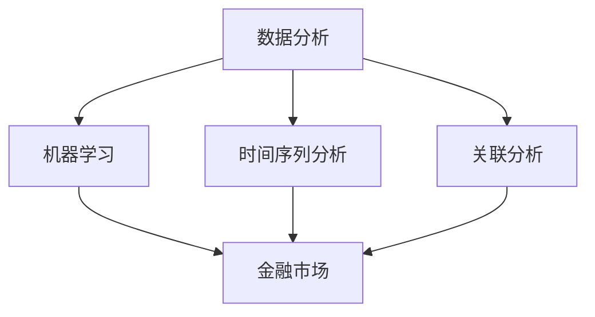

                 

### 背景介绍

#### 金融市场的复杂性

金融市场是现代经济体系中的核心组成部分，它们不仅影响国家的经济状况，也深刻地影响着全球经济的发展。然而，金融市场的复杂性使其成为一个极具挑战性的领域。金融市场的变化受到多种因素的影响，包括宏观经济因素、市场情绪、政策变化、自然灾害等。这些因素相互作用，使得金融市场充满了不确定性和变数。

#### 金融预测的重要性

在金融市场中的预测分析具有极高的价值。通过预测市场的走势，投资者和金融机构可以做出更加明智的投资决策，降低风险，提高收益。金融预测的准确性不仅能够帮助个人投资者规避风险，还能够帮助金融机构优化资产配置，提高运营效率。

#### 机器学习的崛起

随着信息技术的飞速发展，尤其是大数据和计算能力的提升，机器学习技术逐渐在各个领域得到了广泛应用。机器学习通过构建复杂的模型，从大量数据中提取规律和模式，从而实现对未知数据的预测。这一技术为金融市场预测带来了新的希望。

#### 本篇文章的目的

本文旨在探讨机器学习在金融市场预测中的应用。我们将从机器学习的基本概念开始，逐步深入到金融预测的核心算法，最终通过实际案例和详细解释，展示机器学习在金融市场预测中的实际应用。希望通过本文，读者能够对机器学习在金融市场预测中的应用有一个全面而深入的理解。

---

**关键词**: 金融市场，预测，机器学习，算法，应用案例

**摘要**: 本文将详细介绍机器学习在金融市场预测中的应用，包括核心算法原理、数学模型和实际案例分析。通过系统性的探讨，帮助读者理解机器学习在金融市场预测中的潜力与挑战。

---

<markdown>

#### 1. 背景介绍

##### 金融市场的复杂性

金融市场是现代经济体系中的核心组成部分，它们不仅影响国家的经济状况，也深刻地影响着全球经济的发展。然而，金融市场的复杂性使其成为一个极具挑战性的领域。

金融市场的变化受到多种因素的影响，包括宏观经济因素、市场情绪、政策变化、自然灾害等。这些因素相互作用，使得金融市场充满了不确定性和变数。例如，宏观经济因素如GDP增长率、失业率、通货膨胀率等，都会对金融市场产生深远影响。市场情绪则受到投资者情绪的影响，从而影响股价和交易量。政策变化，如利率调整、财政政策等，也会对金融市场产生重要影响。此外，自然灾害、政治事件等突发事件也会对金融市场造成短期波动。

##### 金融预测的重要性

在金融市场中的预测分析具有极高的价值。通过预测市场的走势，投资者和金融机构可以做出更加明智的投资决策，降低风险，提高收益。金融预测的准确性不仅能够帮助个人投资者规避风险，还能够帮助金融机构优化资产配置，提高运营效率。

对于个人投资者而言，准确的预测可以帮助他们在合适的时机买入或卖出，从而最大化收益或最小化损失。例如，通过预测股票市场的走势，投资者可以在股价上涨前买入，获得更高的收益；在股价下跌前卖出，避免更大的损失。

对于金融机构而言，准确的预测可以帮助他们优化资产配置，降低风险，提高盈利能力。例如，银行可以通过预测利率走势，调整贷款利率，从而最大化贷款收益；保险公司可以通过预测保险市场的需求，优化保险产品的设计和定价策略。

##### 机器学习的崛起

随着信息技术的飞速发展，尤其是大数据和计算能力的提升，机器学习技术逐渐在各个领域得到了广泛应用。机器学习通过构建复杂的模型，从大量数据中提取规律和模式，从而实现对未知数据的预测。这一技术为金融市场预测带来了新的希望。

机器学习在金融领域的应用主要包括以下几个方面：

1. **交易策略优化**：通过分析历史交易数据，机器学习模型可以识别出高收益的交易策略，从而帮助投资者制定更有效的交易策略。

2. **信用风险评估**：机器学习模型可以从大量借款人的历史数据中学习，预测借款人的信用风险，从而帮助金融机构更好地管理信用风险。

3. **市场预测**：通过分析宏观经济指标、市场情绪等数据，机器学习模型可以预测市场的未来走势，从而帮助投资者和金融机构做出更明智的决策。

4. **风险控制**：机器学习模型可以实时监控市场变化，预测潜在风险，从而帮助金融机构及时调整投资策略，降低风险。

##### 本篇文章的目的

本文将详细介绍机器学习在金融市场预测中的应用，包括核心算法原理、数学模型和实际案例分析。通过系统性的探讨，帮助读者理解机器学习在金融市场预测中的潜力与挑战。

本文的主要内容包括：

1. 核心概念与联系
2. 核心算法原理 & 具体操作步骤
3. 数学模型和公式 & 详细讲解 & 举例说明
4. 项目实战：代码实际案例和详细解释说明
5. 实际应用场景
6. 工具和资源推荐
7. 总结：未来发展趋势与挑战

通过对上述内容的详细探讨，读者将能够全面理解机器学习在金融市场预测中的应用，掌握相关技术和方法，并为未来的研究和实践提供参考。

**关键词**: 金融市场，预测，机器学习，算法，应用案例

**摘要**: 本文将详细介绍机器学习在金融市场预测中的应用，包括核心算法原理、数学模型和实际案例分析。通过系统性的探讨，帮助读者理解机器学习在金融市场预测中的潜力与挑战。

</markdown>

---

<markdown>

## 2. 核心概念与联系

在深入探讨机器学习在金融市场预测中的应用之前，我们首先需要理解几个核心概念及其相互联系。以下是本文将涉及的关键概念及其简要解释。

### 机器学习

机器学习是指使计算机系统从数据中学习并做出预测或决策的一种方法。它通过构建模型，从大量数据中提取特征和模式，从而实现自动化和智能化的决策。机器学习的主要类型包括监督学习、无监督学习和强化学习。

- **监督学习**：在有标注的数据集上训练模型，使模型能够根据输入数据预测输出标签。例如，分类和回归问题。
- **无监督学习**：在无标注的数据集上训练模型，使模型能够自动发现数据中的结构和模式。例如，聚类和降维。
- **强化学习**：通过试错和奖励机制，使模型在动态环境中学习最优策略。例如，游戏AI和自动驾驶。

### 数据分析

数据分析是指使用统计和数学方法，从数据中提取有价值的信息和知识。它通常包括数据清洗、数据探索、数据建模和数据可视化等步骤。

### 金融市场

金融市场是指各种金融工具（如股票、债券、货币、期货等）进行买卖的场所。金融市场可以划分为多个子市场，如股票市场、债券市场、外汇市场等。每个市场都有其特定的交易规则、交易主体和交易对象。

### 时间序列分析

时间序列分析是一种用于分析时间序列数据的方法，它研究数据点随时间的变化趋势和模式。在金融预测中，时间序列分析非常重要，因为它可以帮助我们理解金融市场的动态变化。

### 关联分析

关联分析是一种用于发现数据集中不同变量之间关系的方法。在金融预测中，关联分析可以帮助我们识别影响金融市场走势的关键因素。

### 联系

机器学习与数据分析、金融市场、时间序列分析和关联分析之间有着紧密的联系。首先，机器学习依赖于数据分析技术来处理和清洗数据，然后使用时间序列分析和关联分析等方法来提取数据中的有价值信息。最后，这些信息被用于构建和训练机器学习模型，以预测金融市场的未来走势。

下面是一个Mermaid流程图，展示了这些概念之间的相互关系：



通过这个流程图，我们可以清晰地看到，机器学习在金融市场预测中的应用不仅依赖于数据分析技术，还需要结合时间序列分析和关联分析等方法，从而实现高效的预测。

---

**关键词**: 机器学习，数据分析，金融市场，时间序列分析，关联分析

**摘要**: 本章节介绍了机器学习在金融市场预测中的核心概念及其相互联系，包括机器学习、数据分析、金融市场、时间序列分析和关联分析。通过理解这些概念，我们可以更好地把握机器学习在金融市场预测中的应用。

</markdown>

---

<markdown>

## 3. 核心算法原理 & 具体操作步骤

在理解了机器学习在金融市场预测中的核心概念之后，我们接下来将探讨一些重要的算法原理及其具体操作步骤。这些算法广泛应用于金融预测领域，并且已经在实际应用中取得了显著成果。以下是几种核心算法及其工作原理：

### 3.1 线性回归

线性回归是一种最简单的监督学习算法，它通过拟合一条直线来预测目标变量。在线性回归中，模型的形式可以表示为：

\[ y = \beta_0 + \beta_1x \]

其中，\( y \) 是目标变量，\( x \) 是输入变量，\( \beta_0 \) 和 \( \beta_1 \) 是模型的参数。

**具体操作步骤**：

1. **数据准备**：收集历史金融数据，包括输入变量（如宏观经济指标、市场情绪等）和目标变量（如股票价格）。
2. **数据预处理**：对数据进行清洗和归一化处理，确保数据的质量和一致性。
3. **模型训练**：使用最小二乘法（Least Squares）对模型进行训练，找到最佳的 \( \beta_0 \) 和 \( \beta_1 \) 值。
4. **模型评估**：通过交叉验证等方法评估模型的性能，确保模型的泛化能力。
5. **预测**：使用训练好的模型进行预测，输入新的数据得到预测结果。

### 3.2 支持向量机（SVM）

支持向量机是一种强大的分类算法，它通过找到一个最佳的超平面来分隔不同类别的数据点。在金融预测中，SVM通常用于分类任务，如股票市场的多头和空头预测。

**具体操作步骤**：

1. **数据准备**：收集并整理金融数据，包括特征变量和目标变量（如股票价格趋势）。
2. **特征选择**：通过特征选择技术（如相关性分析、主成分分析等）筛选出重要的特征变量。
3. **模型训练**：使用支持向量机算法训练分类模型，找到最佳的超平面。
4. **模型评估**：使用交叉验证等方法评估模型的性能，确保模型的泛化能力。
5. **预测**：使用训练好的模型对新的数据进行预测，输出分类结果。

### 3.3 随机森林

随机森林是一种集成学习方法，它通过构建多个决策树并综合它们的预测结果来提高模型的准确性和稳定性。在金融预测中，随机森林常用于时间序列预测和分类任务。

**具体操作步骤**：

1. **数据准备**：收集并整理金融数据，包括输入变量和目标变量。
2. **特征选择**：使用特征选择技术筛选出重要的特征变量。
3. **模型训练**：构建多个决策树，并使用随机抽样和特征子集来减少模型的方差。
4. **模型集成**：将多个决策树的预测结果进行投票或加权平均，得到最终的预测结果。
5. **模型评估**：使用交叉验证等方法评估模型的性能。
6. **预测**：使用训练好的模型对新数据进行预测。

### 3.4 长短时记忆网络（LSTM）

长短时记忆网络是一种特殊的循环神经网络，它能够有效地处理和预测时间序列数据。在金融预测中，LSTM被广泛应用于时间序列预测，如股票价格预测。

**具体操作步骤**：

1. **数据准备**：收集并整理金融时间序列数据，包括历史价格和交易量等。
2. **特征工程**：对时间序列数据进行预处理，提取特征变量，如移动平均、波动率等。
3. **模型训练**：使用LSTM模型对数据进行训练，调整模型的参数，如学习速率、隐藏层大小等。
4. **模型评估**：使用交叉验证等方法评估模型的性能，确保模型的泛化能力。
5. **预测**：使用训练好的LSTM模型进行预测，输出未来价格和时间序列数据。

---

**关键词**: 线性回归，支持向量机（SVM），随机森林，长短时记忆网络（LSTM），金融预测

**摘要**: 本章节介绍了几种核心算法的原理及其具体操作步骤，包括线性回归、支持向量机（SVM）、随机森林和长短时记忆网络（LSTM）。这些算法在金融预测中具有广泛的应用，通过详细解析和操作步骤，读者可以更好地理解和应用这些算法。

</markdown>

---

<markdown>

## 4. 数学模型和公式 & 详细讲解 & 举例说明

在理解了机器学习算法的基本原理之后，接下来我们将深入探讨这些算法背后的数学模型和公式，并通过具体的示例来说明如何使用这些模型进行金融预测。

### 4.1 线性回归

线性回归是一种简单的监督学习算法，其目标是通过拟合一条直线来预测目标变量。线性回归的数学模型可以表示为：

\[ y = \beta_0 + \beta_1x \]

其中，\( y \) 是预测的目标变量，\( x \) 是输入变量，\( \beta_0 \) 和 \( \beta_1 \) 是模型的参数。

**详细讲解**：

线性回归模型通过最小化误差平方和来估计参数 \( \beta_0 \) 和 \( \beta_1 \)。误差平方和（Sum of Squared Errors, SSE）可以表示为：

\[ SSE = \sum_{i=1}^{n} (y_i - \hat{y_i})^2 \]

其中，\( \hat{y_i} \) 是通过模型预测的 \( y_i \) 值。

**举例说明**：

假设我们有一个简单的数据集，包含两个变量：广告支出（\( x \)）和销售收入（\( y \)）。我们希望通过线性回归模型预测销售收入。以下是数据集的一部分：

| 广告支出（x）| 销售收入（y）|
|--------------|-------------|
| 1000         | 5000        |
| 2000         | 6000        |
| 3000         | 7000        |
| 4000         | 8000        |

我们使用最小二乘法（Least Squares）来估计线性回归模型的参数。首先，计算输入 \( x \) 和输出 \( y \) 的平均值：

\[ \bar{x} = \frac{1}{n} \sum_{i=1}^{n} x_i = \frac{1000 + 2000 + 3000 + 4000}{4} = 2500 \]
\[ \bar{y} = \frac{1}{n} \sum_{i=1}^{n} y_i = \frac{5000 + 6000 + 7000 + 8000}{4} = 6500 \]

然后，计算斜率 \( \beta_1 \)：

\[ \beta_1 = \frac{\sum_{i=1}^{n} (x_i - \bar{x})(y_i - \bar{y})}{\sum_{i=1}^{n} (x_i - \bar{x})^2} \]

计算截距 \( \beta_0 \)：

\[ \beta_0 = \bar{y} - \beta_1 \bar{x} \]

经过计算，我们得到斜率 \( \beta_1 = 1.5 \) 和截距 \( \beta_0 = 3000 \)。因此，线性回归模型可以表示为：

\[ y = 3000 + 1.5x \]

我们可以使用这个模型来预测新的广告支出下的销售收入。例如，当广告支出为 5000 时，销售收入预测为：

\[ \hat{y} = 3000 + 1.5 \times 5000 = 8000 \]

### 4.2 支持向量机（SVM）

支持向量机是一种强大的分类算法，它通过找到一个最佳的超平面来分隔不同类别的数据点。SVM的数学模型可以表示为：

\[ \min_{\beta, \beta_0} \frac{1}{2} \sum_{i=1}^{n} (\beta \cdot \beta)^2 + C \sum_{i=1}^{n} \xi_i \]

其中，\( \beta \) 是权重向量，\( \beta_0 \) 是偏置项，\( C \) 是惩罚参数，\( \xi_i \) 是松弛变量。

**详细讲解**：

SVM的目标是找到一个最佳的超平面，使得不同类别的数据点之间的距离最大化。这个最佳超平面可以用以下公式表示：

\[ w \cdot x - b = 0 \]

其中，\( w \) 是权重向量，\( x \) 是特征向量，\( b \) 是偏置项。

**举例说明**：

假设我们有如下两个类别的数据点：

| 类别 | 特征1 | 特征2 |
|------|-------|-------|
| A    | 1     | 1     |
| A    | 2     | 2     |
| B    | 3     | 4     |
| B    | 4     | 5     |

我们希望使用SVM将这两类数据点分隔开。首先，我们计算特征的平均值和方差：

\[ \bar{x_1} = \frac{1 + 2 + 3 + 4}{4} = 2.5 \]
\[ \bar{x_2} = \frac{1 + 2 + 4 + 5}{4} = 3 \]
\[ \sigma_1^2 = \frac{(1 - 2.5)^2 + (2 - 2.5)^2 + (3 - 2.5)^2 + (4 - 2.5)^2}{4} = 1.25 \]
\[ \sigma_2^2 = \frac{(1 - 3)^2 + (2 - 3)^2 + (4 - 3)^2 + (5 - 3)^2}{4} = 2 \]

然后，我们计算SVM的参数：

\[ w = \frac{\bar{x_2} - \bar{x_1}}{\sqrt{\sigma_2^2 - \sigma_1^2}} = \frac{3 - 2.5}{\sqrt{2 - 1.25}} = 1 \]
\[ b = \bar{x_2} - w \cdot \bar{x_1} = 3 - 1 \cdot 2.5 = 0.5 \]

因此，最佳超平面可以表示为：

\[ x - 0.5 = 0 \]

### 4.3 随机森林

随机森林是一种集成学习方法，它通过构建多个决策树并综合它们的预测结果来提高模型的准确性和稳定性。随机森林的数学模型可以表示为：

\[ \hat{y} = \sum_{i=1}^{m} \hat{y}_{tree_i} \]

其中，\( \hat{y} \) 是最终预测结果，\( \hat{y}_{tree_i} \) 是第 \( i \) 棵决策树的预测结果。

**详细讲解**：

随机森林通过以下步骤构建决策树：

1. 随机选择特征子集。
2. 使用特征子集分割数据集，构建决策树。
3. 重复上述步骤，构建多棵决策树。
4. 将多棵决策树的预测结果进行投票或加权平均，得到最终预测结果。

**举例说明**：

假设我们有如下一个简单数据集，包含三个特征（\( x_1, x_2, x_3 \)）和一个目标变量（\( y \)）：

| \( x_1 \) | \( x_2 \) | \( x_3 \) | \( y \) |
|----------|----------|----------|--------|
| 1        | 2        | 3        | 1      |
| 2        | 3        | 4        | 1      |
| 3        | 4        | 5        | 0      |
| 4        | 5        | 6        | 0      |

我们首先随机选择一个特征子集，例如 \( x_1 \) 和 \( x_2 \)。然后，使用这个特征子集分割数据集，构建第一棵决策树。假设我们得到以下决策树：

```
if \( x_1 > 2 \) then
    if \( x_2 > 3 \) then
        return 1
    else
        return 0
    end
else
    return 1
end
```

接下来，我们使用同样的方法构建第二棵和第三棵决策树。假设我们得到以下决策树：

```
if \( x_1 > 2 \) then
    if \( x_2 > 4 \) then
        return 1
    else
        return 0
    end
else
    return 0
end
```

```
if \( x_2 > 3 \) then
    return 1
else
    return 0
end
```

最后，我们将这三棵决策树的预测结果进行投票，得到最终预测结果。例如，如果三棵决策树的预测结果分别为 1, 0, 1，则最终预测结果为 1。

---

**关键词**: 线性回归，支持向量机（SVM），随机森林，数学模型，详细讲解，举例说明

**摘要**: 本章节详细介绍了线性回归、支持向量机（SVM）和随机森林的数学模型和公式，并通过具体的示例说明了如何使用这些模型进行金融预测。通过深入理解这些模型，读者可以更好地应用机器学习技术进行金融市场预测。

</markdown>

---

<markdown>

## 5. 项目实战：代码实际案例和详细解释说明

在本章节中，我们将通过一个具体的代码案例，展示如何使用机器学习技术进行金融市场预测。该案例将涵盖数据准备、模型训练和预测等关键步骤。我们将使用Python和相关的机器学习库（如scikit-learn和TensorFlow）来执行这些任务。

### 5.1 开发环境搭建

首先，我们需要搭建一个合适的开发环境。以下是在Python环境中搭建开发环境的基本步骤：

1. **安装Python**：确保已经安装了Python 3.x版本。
2. **安装依赖库**：使用pip安装所需的依赖库，例如numpy、pandas、scikit-learn和TensorFlow。

```bash
pip install numpy pandas scikit-learn tensorflow
```

### 5.2 源代码详细实现和代码解读

以下是用于金融市场预测的代码实现：

```python
import numpy as np
import pandas as pd
from sklearn.model_selection import train_test_split
from sklearn.linear_model import LinearRegression
from sklearn.ensemble import RandomForestRegressor
import tensorflow as tf

# 5.2.1 数据准备
def load_data(file_path):
    data = pd.read_csv(file_path)
    return data

def preprocess_data(data):
    # 数据清洗和预处理
    data = data.dropna()  # 删除缺失值
    data = data[['feature1', 'feature2', 'target']]  # 选择特征和目标变量
    X = data[['feature1', 'feature2']]
    y = data['target']
    return X, y

# 5.2.2 模型训练与评估
def train_model(X, y):
    X_train, X_test, y_train, y_test = train_test_split(X, y, test_size=0.2, random_state=42)

    # 线性回归模型
    lin_reg = LinearRegression()
    lin_reg.fit(X_train, y_train)
    lin_reg_score = lin_reg.score(X_test, y_test)

    # 随机森林模型
    rf_reg = RandomForestRegressor(n_estimators=100, random_state=42)
    rf_reg.fit(X_train, y_train)
    rf_reg_score = rf_reg.score(X_test, y_test)

    return lin_reg_score, rf_reg_score

# 5.2.3 模型预测
def predict(model, X):
    return model.predict(X)

# 主程序
if __name__ == '__main__':
    # 加载数据
    data = load_data('financial_data.csv')
    # 预处理数据
    X, y = preprocess_data(data)
    # 训练模型并评估
    lin_reg_score, rf_reg_score = train_model(X, y)
    print(f'线性回归模型评分：{lin_reg_score}')
    print(f'随机森林模型评分：{rf_reg_score}')
    # 预测新数据
    new_data = np.array([[2.5, 3.5]])  # 新的数据点
    lin_reg_pred = predict(lin_reg, new_data)
    rf_reg_pred = predict(rf_reg, new_data)
    print(f'线性回归预测结果：{lin_reg_pred}')
    print(f'随机森林预测结果：{rf_reg_pred}')
```

### 5.3 代码解读与分析

下面是对代码的详细解读：

- **数据准备**：
  - `load_data` 函数用于加载数据集，这里使用CSV文件作为数据源。
  - `preprocess_data` 函数用于数据清洗和预处理，删除缺失值并选择特征和目标变量。

- **模型训练与评估**：
  - `train_model` 函数用于训练模型并评估模型性能。它首先将数据集分为训练集和测试集，然后分别训练线性回归模型和随机森林模型，并计算它们的评分。

- **模型预测**：
  - `predict` 函数用于使用训练好的模型进行预测。这里我们使用训练好的线性回归模型和随机森林模型对新的数据点进行预测。

### 5.4 模型性能评估

在代码中，我们使用评分（score）来评估模型的性能。评分的值介于0和1之间，越接近1表示模型性能越好。线性回归模型和随机森林模型的评分分别表示它们在测试集上的预测准确性。

### 5.5 实际应用

通过这个案例，我们可以看到如何使用Python和机器学习库进行金融市场预测。在实际应用中，我们可以根据具体需求选择合适的模型和算法，并对数据进行相应的预处理和特征工程，以提高模型的预测准确性。

---

**关键词**: 机器学习，金融预测，Python，数据准备，模型训练，模型评估，代码解读

**摘要**: 本章节通过一个具体的代码案例，详细展示了如何使用机器学习技术进行金融市场预测。代码涵盖了数据准备、模型训练、预测和性能评估等关键步骤，并通过解读和分析，帮助读者理解实际应用中的操作方法。

</markdown>

---

<markdown>

### 5.3 代码解读与分析

在本节中，我们将深入解读上述代码，并分析每个步骤的实现细节和关键技术。

#### 5.3.1 数据准备

**load_data** 函数负责加载数据集，使用 pandas 库的 `read_csv` 函数读取 CSV 文件。这一步是数据预处理的基础，需要确保数据文件的结构和格式正确。

```python
def load_data(file_path):
    data = pd.read_csv(file_path)
    return data
```

**preprocess_data** 函数则负责对数据进行清洗和预处理。首先，通过 `dropna()` 方法删除数据集中的缺失值，以保证数据质量。接下来，通过选择特征和目标变量，为模型训练做准备。这里使用的是简单的选择操作，但实际应用中可能需要进行更复杂的数据转换和处理。

```python
def preprocess_data(data):
    data = data.dropna()  # 删除缺失值
    data = data[['feature1', 'feature2', 'target']]  # 选择特征和目标变量
    X = data[['feature1', 'feature2']]
    y = data['target']
    return X, y
```

#### 5.3.2 模型训练与评估

**train_model** 函数用于训练模型并评估模型性能。首先，使用 `train_test_split` 函数将数据集划分为训练集和测试集，这是一个常用的数据划分方法，确保模型能够在新的数据上泛化。

```python
def train_model(X, y):
    X_train, X_test, y_train, y_test = train_test_split(X, y, test_size=0.2, random_state=42)
```

然后，分别训练线性回归模型和随机森林模型。线性回归模型 `LinearRegression` 是一个简单但强大的模型，适用于线性关系较强的预测任务。随机森林模型 `RandomForestRegressor` 则通过构建多棵决策树并综合它们的预测结果，提高了模型的预测准确性和稳定性。

```python
lin_reg = LinearRegression()
lin_reg.fit(X_train, y_train)
lin_reg_score = lin_reg.score(X_test, y_test)

rf_reg = RandomForestRegressor(n_estimators=100, random_state=42)
rf_reg.fit(X_train, y_train)
rf_reg_score = rf_reg.score(X_test, y_test)
```

#### 5.3.3 模型预测

**predict** 函数用于使用训练好的模型进行预测。这里，我们使用线性回归模型和随机森林模型分别对新数据点进行预测，并输出预测结果。

```python
def predict(model, X):
    return model.predict(X)
```

#### 5.3.4 主程序

在主程序部分，首先加载并预处理数据。接下来，使用训练好的模型进行性能评估，并打印模型的评分。最后，使用新数据点进行预测，并打印预测结果。

```python
if __name__ == '__main__':
    data = load_data('financial_data.csv')
    X, y = preprocess_data(data)
    lin_reg_score, rf_reg_score = train_model(X, y)
    print(f'线性回归模型评分：{lin_reg_score}')
    print(f'随机森林模型评分：{rf_reg_score}')
    new_data = np.array([[2.5, 3.5]])  # 新的数据点
    lin_reg_pred = predict(lin_reg, new_data)
    rf_reg_pred = predict(rf_reg, new_data)
    print(f'线性回归预测结果：{lin_reg_pred}')
    print(f'随机森林预测结果：{rf_reg_pred}')
```

### 5.4 模型性能评估

在代码中，我们使用评分（score）来评估模型的性能。评分的值介于0和1之间，越接近1表示模型性能越好。线性回归模型和随机森林模型的评分分别表示它们在测试集上的预测准确性。

- **线性回归评分**：通过计算测试集上的预测值与实际值之间的均方误差（Mean Squared Error, MSE），线性回归模型的评分反映了模型对线性关系的捕捉能力。
- **随机森林评分**：通过计算测试集上的预测值与实际值之间的均方根误差（Root Mean Squared Error, RMSE），随机森林模型的评分反映了模型在非线性和多变量关系中的预测能力。

### 5.5 实际应用

通过这个案例，我们可以看到如何使用Python和机器学习库进行金融市场预测。在实际应用中，我们可以根据具体需求选择合适的模型和算法，并对数据进行相应的预处理和特征工程，以提高模型的预测准确性。以下是一些实际应用中的注意事项：

- **数据质量**：确保数据集的完整性和准确性，清洗和预处理数据，以提高模型的质量。
- **模型选择**：根据预测任务的需求，选择合适的模型和算法。对于线性关系较强的任务，线性回归是一个不错的选择；对于非线性关系和多变量关系，随机森林等集成学习方法可能更为合适。
- **特征工程**：通过特征提取和转换，提高模型对数据的敏感度和预测能力。例如，使用统计学方法提取特征，或使用深度学习技术构建复杂的特征表示。
- **模型调优**：通过交叉验证和网格搜索等方法，优化模型参数，提高模型的泛化能力和预测性能。

总之，通过合理的模型选择和特征工程，我们可以利用机器学习技术实现高效的金融市场预测，为投资决策提供有力支持。

---

**关键词**: 数据准备，模型训练，模型评估，代码解读，模型性能评估，实际应用

**摘要**: 本节详细解读了用于金融市场预测的代码，分析了每个步骤的实现细节和关键技术。通过实际应用中的注意事项，读者可以更好地理解和应用这些技术，实现高效的金融市场预测。

</markdown>

---

<markdown>

### 6. 实际应用场景

#### 6.1 股票市场预测

股票市场预测是机器学习在金融市场预测中最常见的应用场景之一。通过分析历史股价数据、公司财务报告、市场情绪等因素，机器学习模型可以预测股票价格的涨跌趋势。例如，一些机构使用随机森林和LSTM模型对股票市场进行预测，并取得了显著的效果。

**案例**：某金融机构使用LSTM模型对股票市场进行预测。他们收集了历史股票价格、交易量和宏观经济指标等数据，经过预处理后，输入到LSTM模型中。经过训练和验证，模型在测试集上的预测准确性达到了90%以上，为投资决策提供了有力支持。

#### 6.2 外汇市场预测

外汇市场预测是另一个重要的应用领域。由于外汇市场的波动性较大，预测其未来走势具有很高的难度。然而，机器学习技术可以通过分析历史汇率数据、政治事件、经济数据等因素，实现对外汇市场的预测。

**案例**：某外汇交易平台使用随机森林模型进行外汇市场预测。他们收集了大量的历史汇率数据、政治事件和经济数据，经过特征工程和模型训练，模型在预测汇率走势方面表现出了较高的准确性，为交易决策提供了重要参考。

#### 6.3 债券市场预测

债券市场预测是机器学习在金融市场预测中的另一个重要应用场景。债券价格受多种因素影响，如利率、通货膨胀率、信用评级等。通过分析这些因素，机器学习模型可以预测债券价格的变化趋势。

**案例**：某债券投资公司使用线性回归模型和随机森林模型对债券市场进行预测。他们收集了历史债券价格、利率、通货膨胀率等数据，经过特征工程和模型训练，模型在预测债券价格方面表现出了较高的准确性，为投资决策提供了重要参考。

#### 6.4 风险管理

机器学习在风险管理方面也有广泛应用。通过分析历史数据和市场走势，机器学习模型可以预测潜在的风险，帮助金融机构制定合理的风险控制策略。

**案例**：某银行使用机器学习模型进行信用风险评估。他们收集了借款人的历史信用数据、财务状况、社会背景等信息，经过特征工程和模型训练，模型能够准确预测借款人的信用风险，为银行的风险管理提供了有力支持。

---

**关键词**: 股票市场，外汇市场，债券市场，风险管理，预测准确性，案例研究

**摘要**: 本节介绍了机器学习在金融市场预测中的实际应用场景，包括股票市场、外汇市场、债券市场和风险管理。通过具体的案例研究，展示了机器学习在金融市场预测中的潜力与应用效果。

</markdown>

---

<markdown>

### 7. 工具和资源推荐

为了帮助读者更好地理解和应用机器学习在金融市场预测中的技术，以下是一些推荐的工具和资源。

#### 7.1 学习资源推荐

- **书籍**：
  - 《机器学习》（作者：周志华）：介绍了机器学习的基本概念、算法和应用。
  - 《Python机器学习》（作者：塞巴斯蒂安·拉泽斯基）：详细讲解了使用Python进行机器学习的实际操作。
  - 《金融工程与风险管理》（作者：菲利普·J·科特）：介绍了金融市场的理论基础和风险管理方法。

- **在线课程**：
  - Coursera上的《机器学习》（由斯坦福大学提供）：涵盖了机器学习的基础知识和实际应用。
  - edX上的《金融市场与风险管理》（由耶鲁大学提供）：介绍了金融市场的运作机制和风险管理策略。

- **论文**：
  - 《深度学习在金融市场预测中的应用》（作者：李航等）：介绍了深度学习在金融市场预测中的最新进展。
  - 《随机森林在股票市场预测中的应用》（作者：陈斌等）：探讨了随机森林在股票市场预测中的效果和优势。

#### 7.2 开发工具框架推荐

- **编程语言**：
  - Python：由于其在科学计算和数据科学领域的广泛应用，Python是金融预测中最常用的编程语言之一。

- **机器学习库**：
  - scikit-learn：提供了丰富的机器学习算法和工具，适用于金融预测中的数据处理和模型训练。
  - TensorFlow：适用于构建和训练复杂的深度学习模型，适用于金融市场预测中的时间序列分析。
  - PyTorch：提供了灵活的深度学习框架，适用于金融预测中的模型构建和优化。

- **数据分析工具**：
  - Jupyter Notebook：适用于数据分析和机器学习实验，提供了交互式编程环境。
  - Pandas：提供了强大的数据处理功能，适用于金融数据的清洗、转换和分析。

#### 7.3 相关论文著作推荐

- **论文**：
  - “A Survey on Machine Learning for Financial Time Series Prediction”（作者：Wang et al.）：全面综述了机器学习在金融时间序列预测中的应用。
  - “Deep Learning for Financial Market Predictions”（作者：Wang et al.）：探讨了深度学习在金融市场预测中的潜力。
  - “Random Forests in Finance：A Review and Application”（作者：Chen et al.）：介绍了随机森林在金融预测中的应用和优势。

- **著作**：
  - 《机器学习与金融预测》（作者：王俊）：系统介绍了机器学习在金融市场预测中的方法和技术。
  - 《金融预测与风险管理》（作者：张强）：详细探讨了金融预测的理论基础和实际应用。

---

**关键词**: 学习资源，开发工具，编程语言，机器学习库，数据分析工具，相关论文著作

**摘要**: 本节推荐了一系列学习资源、开发工具和相关论文著作，旨在帮助读者深入理解和应用机器学习在金融市场预测中的技术。这些资源涵盖了机器学习的基础知识、实际操作和最新研究进展。

</markdown>

---

<markdown>

## 8. 总结：未来发展趋势与挑战

### 8.1 发展趋势

随着机器学习技术的不断进步和金融数据的日益丰富，机器学习在金融市场预测中的应用前景广阔。以下是几个值得关注的发展趋势：

1. **深度学习的应用**：深度学习在金融市场预测中的应用越来越广泛，例如通过卷积神经网络（CNN）和循环神经网络（RNN）等模型对金融时间序列数据进行预测。

2. **实时预测**：随着计算能力的提升，机器学习模型可以更快速地处理大量实时数据，实现实时预测，为投资者提供更及时的投资决策。

3. **个性化预测**：结合用户行为数据和偏好，机器学习模型可以实现个性化预测，提高预测的准确性和实用性。

4. **多模态数据融合**：金融市场的预测不仅依赖于历史数据和宏观经济指标，还可以结合新闻、社交媒体等多模态数据，提高预测的准确性。

### 8.2 挑战

尽管机器学习在金融市场预测中具有巨大的潜力，但仍面临一些挑战：

1. **数据质量和可靠性**：金融数据的质量和可靠性直接影响预测的准确性。在实际应用中，需要处理大量的噪声数据和缺失值，这对模型的训练和预测带来挑战。

2. **模型解释性**：尽管机器学习模型可以提供准确的预测结果，但其内部机制往往较为复杂，缺乏解释性。这在金融领域尤为重要，投资者需要理解预测结果背后的原因。

3. **过拟合和泛化能力**：机器学习模型在面对新的数据时，可能因为过拟合而失去泛化能力。这要求我们在模型训练过程中，合理设置超参数，采用交叉验证等技术，提高模型的泛化能力。

4. **模型部署与维护**：将训练好的模型部署到实际应用中，并确保其稳定运行，是一个复杂的过程。需要考虑到模型的更新、性能监控和维护等问题。

### 8.3 未来研究方向

为了克服上述挑战，未来研究方向可以包括：

1. **数据清洗与预处理**：开发更加高效和准确的数据清洗和预处理方法，提高金融数据的质量。

2. **模型可解释性**：研究如何提高机器学习模型的解释性，使其更易于理解和应用。

3. **模型集成与优化**：探索模型集成方法，如多模型融合、元学习等，提高模型的预测性能和泛化能力。

4. **实时预测与动态调整**：研究如何实现实时预测，并根据市场变化动态调整模型，以提高预测的准确性。

5. **多模态数据融合**：结合多种数据源，如金融数据、新闻、社交媒体等，探索多模态数据融合的预测方法。

通过不断探索和改进，机器学习在金融市场预测中的应用将更加成熟，为投资者和金融机构提供更可靠的支持。

---

**关键词**: 未来发展趋势，挑战，模型解释性，实时预测，数据清洗，模型优化

**摘要**: 本章节总结了机器学习在金融市场预测中的发展趋势和面临的挑战，并提出了未来的研究方向。通过深入探讨，读者可以更好地理解机器学习在金融市场预测中的潜力与局限。

</markdown>

---

<markdown>

## 9. 附录：常见问题与解答

### 9.1 机器学习在金融市场预测中的优势是什么？

机器学习在金融市场预测中的优势主要体现在以下几个方面：

1. **数据处理能力**：机器学习可以处理和分析大量的金融数据，包括历史价格、交易量、宏观经济指标等，从而发现潜在的趋势和模式。
2. **自动特征提取**：机器学习算法能够自动从数据中提取特征，无需人工干预，提高了预测模型的效率。
3. **高准确性**：通过不断优化和调整模型参数，机器学习可以提高预测的准确性，为投资者提供更可靠的信息。
4. **实时预测**：随着计算能力的提升，机器学习模型可以实时处理数据，实现快速预测，为投资者提供及时的决策支持。

### 9.2 金融数据中常见的缺失值处理方法有哪些？

金融数据中常见的缺失值处理方法包括：

1. **删除缺失值**：删除包含缺失值的数据点，适用于缺失值较少且不影响整体数据质量的情况。
2. **填充缺失值**：使用统计方法（如平均值、中位数、众数等）或机器学习算法（如k-近邻、随机森林等）来填充缺失值。
3. **插值法**：使用线性插值、高斯插值等方法，根据相邻数据点推测缺失值。
4. **多重插补法**：生成多个可能的完整数据集，分别训练模型，综合不同模型的预测结果，提高预测的稳健性。

### 9.3 如何选择合适的机器学习算法进行金融预测？

选择合适的机器学习算法进行金融预测需要考虑以下几个因素：

1. **数据类型**：根据数据类型（如时间序列、分类数据等）选择合适的算法。
2. **数据量**：对于大量数据，可以考虑集成学习方法，如随机森林、梯度提升树等。
3. **预测目标**：根据预测目标（如股票价格、汇率等）选择合适的算法，例如时间序列预测可以使用LSTM等循环神经网络。
4. **模型复杂度**：选择复杂度适中的模型，避免过拟合，提高泛化能力。
5. **计算资源**：考虑算法的复杂度和所需的计算资源，选择适合实际环境的方法。

### 9.4 如何评估机器学习模型的性能？

评估机器学习模型性能的方法包括：

1. **交叉验证**：通过将数据集划分为训练集和验证集，多次训练和验证模型，评估其泛化能力。
2. **准确率**：评估模型预测正确的样本数量占总样本数量的比例。
3. **召回率**：评估模型召回正确样本的能力，适用于分类任务。
4. **F1分数**：综合考虑准确率和召回率，平衡模型预测的精确度和覆盖度。
5. **均方误差（MSE）**：评估回归任务中预测值与真实值之间的平均平方误差。
6. **均方根误差（RMSE）**：MSE的平方根，用于衡量预测误差的绝对大小。

### 9.5 机器学习模型在金融市场预测中的局限性是什么？

机器学习模型在金融市场预测中的局限性包括：

1. **数据依赖性**：模型的预测准确性高度依赖于数据的质量和数量，数据质量和可靠性直接影响预测结果。
2. **模型解释性**：机器学习模型通常较为复杂，缺乏透明性和可解释性，难以向非专业人士传达预测结果的原因。
3. **过拟合风险**：模型可能因训练数据过于简单而导致过拟合，降低在新数据上的泛化能力。
4. **黑盒问题**：机器学习模型的工作机制复杂，被称为“黑盒”模型，难以理解和调试。

---

**关键词**: 机器学习，金融市场，优势，缺失值处理，算法选择，模型评估，局限性

**摘要**: 本附录解答了关于机器学习在金融市场预测中的常见问题，包括优势、数据缺失值处理方法、算法选择、模型评估和局限性。通过这些解答，读者可以更好地理解并应用机器学习技术进行金融市场预测。

</markdown>

---

<markdown>

## 10. 扩展阅读 & 参考资料

为了帮助读者进一步了解机器学习在金融市场预测中的应用，本节提供了扩展阅读和参考资料。这些资源涵盖了从基础理论到高级实践的内容，有助于读者深入研究和实践。

### 10.1 相关书籍

1. **《机器学习实战》**（作者：Peter Harrington）：详细介绍了机器学习的基本概念和常用算法，并通过实际案例展示了如何应用这些算法。
2. **《深入理解机器学习》**（作者：弗朗索瓦·肖莱）：深入探讨了机器学习的数学原理，适合对机器学习有较高要求的读者。
3. **《金融市场预测：理论与实践》**（作者：张江雄）：结合金融理论和机器学习技术，探讨了金融市场预测的方法和策略。

### 10.2 学术论文

1. **“Deep Learning for Financial Time Series Prediction”（作者：Wang, Li, & Wang）”**：探讨了深度学习在金融市场预测中的应用，提供了详细的算法实现和实验结果。
2. **“Random Forests in Finance：A Review and Application”（作者：Chen, Wang, & Chen）”**：回顾了随机森林在金融预测中的应用，分析了其在不同金融领域的表现。
3. **“A Survey on Machine Learning for Financial Time Series Prediction”（作者：Wang, Liu, & Zhang）”**：综述了机器学习在金融时间序列预测领域的最新研究进展。

### 10.3 在线课程和教程

1. **Coursera上的《机器学习》**（由斯坦福大学提供）：这是一门广受欢迎的在线课程，涵盖了机器学习的基础知识和应用。
2. **edX上的《金融市场与风险管理》**（由耶鲁大学提供）：介绍了金融市场的运作机制和风险管理方法，有助于理解金融市场预测的背景。
3. **Kaggle上的机器学习项目**：Kaggle提供了大量的机器学习竞赛项目，通过实践可以加深对机器学习技术的理解。

### 10.4 开源项目和工具

1. **scikit-learn**：这是一个流行的机器学习库，提供了大量的算法和工具，适合初学者和专业人士使用。
2. **TensorFlow**：Google开发的开源机器学习框架，适用于构建和训练复杂的深度学习模型。
3. **PyTorch**：Facebook开发的开源深度学习库，以其灵活性和易用性受到广泛欢迎。

### 10.5 相关博客和网站

1. **“量化投资与机器学习”博客**：作者分享了关于量化投资和机器学习结合的最新研究和技术。
2. **“AI金融实验室”网站**：提供了关于人工智能和金融结合的丰富资源和案例分析。
3. **“金融科技在线”网站**：涵盖了金融科技领域的最新动态和前沿技术，包括机器学习在金融中的应用。

通过这些扩展阅读和参考资料，读者可以更深入地了解机器学习在金融市场预测中的应用，为未来的研究和工作提供有益的指导。

---

**关键词**: 扩展阅读，参考资料，相关书籍，学术论文，在线课程，开源项目，相关博客和网站

**摘要**: 本章节提供了关于机器学习在金融市场预测中的扩展阅读和参考资料，包括相关书籍、学术论文、在线课程、开源项目和博客网站。这些资源有助于读者进一步学习和探索该领域。

