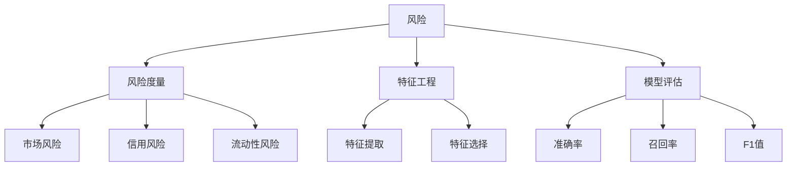

                 

# 机器学习在金融市场风险评估中的应用

## 摘要

本文旨在探讨机器学习技术在金融市场风险评估中的应用，分析其主要算法原理、数学模型，并通过实际案例展示其在金融领域的具体应用。随着金融市场的复杂性和数据量的不断增加，机器学习技术在预测市场走势、防范风险方面发挥着越来越重要的作用。本文将深入剖析机器学习算法在金融市场风险评估中的核心概念、算法原理、数学模型及实际应用，以期为金融从业者提供有益的参考。

## 1. 背景介绍

金融市场风险评估是指对金融市场潜在风险进行评估和预测的过程，其目的是为了降低金融风险，确保金融市场的稳定运行。随着全球金融市场一体化的加剧，金融市场的波动性逐渐增大，风险事件频发。传统的风险评估方法大多依赖于历史数据和经验，往往无法适应金融市场快速变化的特点。而机器学习技术作为一种新兴的数据处理和分析方法，以其强大的数据处理能力和自学习能力，在金融市场风险评估中展现出巨大的潜力。

### 1.1 金融市场的特点

金融市场具有以下几个显著特点：

- **复杂性**：金融市场涉及多个市场参与者，包括银行、证券公司、基金公司、个人投资者等，各个市场参与者之间的交互关系复杂，市场行为多变。
- **不确定性**：金融市场受多种因素影响，如宏观经济环境、政策变化、市场情绪等，导致市场价格波动剧烈，具有高度不确定性。
- **海量数据**：金融市场中每天都会产生大量的交易数据、新闻事件、政策文件等，这些数据规模庞大，类型繁多。

### 1.2 机器学习技术的发展

机器学习技术起源于20世纪50年代，随着计算机性能的提升和数据量的增加，其在各个领域的应用逐渐广泛。机器学习主要包括监督学习、无监督学习和强化学习三种类型。

- **监督学习**：通过已标记的数据集进行训练，从而建立预测模型。例如，使用历史交易数据预测未来市场走势。
- **无监督学习**：不依赖于标记数据，旨在发现数据中的潜在模式和规律。例如，通过聚类分析发现市场中的不同投资风格。
- **强化学习**：通过与环境的交互，不断优化决策策略。例如，利用强化学习算法优化交易策略，以获得更高的收益。

## 2. 核心概念与联系

在探讨机器学习在金融市场风险评估中的应用时，首先需要了解以下几个核心概念：

- **风险**：风险是指未来可能发生的损失或不确定性。在金融市场中，风险包括市场风险、信用风险、流动性风险等。
- **风险度量**：风险度量是评估风险大小的一种方法，常用的度量指标有标准差、VaR（Value at Risk）等。
- **特征工程**：特征工程是数据预处理的重要环节，旨在提取对风险预测有重要影响的关键特征。
- **模型评估**：模型评估是评估模型预测性能的一种方法，常用的评估指标有准确率、召回率、F1值等。

下面使用Mermaid流程图展示机器学习在金融市场风险评估中的核心概念和联系：



### 2.1 风险评估流程

以下是机器学习在金融市场风险评估中的基本流程：

1. **数据收集**：收集金融市场的历史交易数据、新闻事件、政策文件等。
2. **数据预处理**：对收集的数据进行清洗、归一化等处理，以便后续建模。
3. **特征工程**：提取与风险相关的关键特征，如交易量、价格波动、新闻情绪等。
4. **模型选择**：选择合适的机器学习算法，如决策树、支持向量机、神经网络等。
5. **模型训练**：使用训练数据集训练模型，优化模型参数。
6. **模型评估**：使用测试数据集评估模型性能，调整模型参数。
7. **风险预测**：使用训练好的模型对未来的风险进行预测。

### 2.2 主要机器学习算法

在金融市场风险评估中，常用的机器学习算法包括：

- **决策树**：通过构建决策树模型，对历史数据进行分析，提取关键特征，从而预测未来的风险。
- **支持向量机**：通过寻找最优超平面，将不同风险类别的数据分隔开来，从而预测未来风险。
- **神经网络**：通过多层神经网络模型，对金融市场的复杂关系进行建模，从而预测未来的风险。
- **随机森林**：通过构建多个决策树模型，利用集成学习的方法提高预测性能。
- **梯度提升机**：通过迭代优化决策函数，提高模型预测的准确性。

## 3. 核心算法原理 & 具体操作步骤

### 3.1 决策树算法

决策树算法是一种常用的分类和回归算法，通过构建一系列的判断条件，将数据分割成多个子集，并最终输出分类结果或预测值。

#### 3.1.1 原理

决策树算法的基本原理如下：

1. **特征选择**：选择一个特征进行分割，选择分割效果最好的特征。
2. **数据分割**：根据选定的特征，将数据集分割成多个子集。
3. **递归构建**：对每个子集再次进行特征选择和数据分割，直到满足停止条件（如最大深度、最小样本量等）。

#### 3.1.2 操作步骤

1. **数据预处理**：对数据进行清洗、归一化等处理，以便后续建模。
2. **特征选择**：选择与风险相关的特征，如交易量、价格波动等。
3. **构建决策树**：根据特征选择和递归构建的过程，构建决策树模型。
4. **模型训练**：使用训练数据集对决策树模型进行训练。
5. **模型评估**：使用测试数据集对决策树模型进行评估，调整模型参数。

### 3.2 支持向量机算法

支持向量机（SVM）算法是一种常用的分类算法，通过寻找最优超平面，将不同风险类别的数据分隔开来。

#### 3.2.1 原理

SVM算法的基本原理如下：

1. **特征选择**：选择与风险相关的特征，如交易量、价格波动等。
2. **数据预处理**：对数据进行标准化处理。
3. **求解最优超平面**：通过求解优化问题，找到最优的超平面，使得不同风险类别的数据点距离超平面尽可能远。
4. **分类决策**：根据新数据点与最优超平面的距离，判断其所属类别。

#### 3.2.2 操作步骤

1. **数据预处理**：对数据进行清洗、归一化等处理。
2. **特征选择**：选择与风险相关的特征。
3. **求解最优超平面**：使用SVM算法求解最优超平面。
4. **模型训练**：使用训练数据集对SVM模型进行训练。
5. **模型评估**：使用测试数据集对SVM模型进行评估，调整模型参数。

### 3.3 神经网络算法

神经网络（Neural Network）算法是一种基于人工神经元的计算模型，通过多层神经网络模型，对金融市场的复杂关系进行建模。

#### 3.3.1 原理

神经网络算法的基本原理如下：

1. **数据处理**：对数据进行预处理，如归一化、标准化等。
2. **构建神经网络**：定义网络的输入层、隐藏层和输出层，设置每个层的神经元数量。
3. **激活函数**：为每个神经元选择合适的激活函数，如Sigmoid、ReLU等。
4. **前向传播**：将输入数据通过网络进行传播，计算输出结果。
5. **反向传播**：根据输出结果与实际结果的差异，计算误差，并通过反向传播更新网络参数。

#### 3.3.2 操作步骤

1. **数据预处理**：对数据进行预处理，如归一化、标准化等。
2. **构建神经网络**：定义网络的输入层、隐藏层和输出层。
3. **选择激活函数**：为每个神经元选择合适的激活函数。
4. **模型训练**：使用训练数据集对神经网络进行训练，优化网络参数。
5. **模型评估**：使用测试数据集对神经网络进行评估，调整模型参数。

## 4. 数学模型和公式 & 详细讲解 & 举例说明

### 4.1 决策树算法

决策树算法的核心在于如何选择最优分割特征。常用的分割准则包括信息增益、基尼不纯度等。

#### 4.1.1 信息增益（Information Gain）

信息增益是评估特征分割效果的一种方法，其计算公式如下：

\[ IG(\text{特征}, \text{样本集}) = H(\text{样本集}) - \sum_{v \in \text{特征}} p(v) H(\text{样本集}_v) \]

其中，\( H(\text{样本集}) \) 是样本集的熵，\( p(v) \) 是特征 \( v \) 在样本集中的概率，\( H(\text{样本集}_v) \) 是特征 \( v \) 分割后的子集的熵。

#### 4.1.2 基尼不纯度（Gini Impurity）

基尼不纯度是另一种评估特征分割效果的方法，其计算公式如下：

\[ GI(\text{样本集}) = 1 - \sum_{v \in \text{特征}} p(v)^2 \]

其中，\( p(v) \) 是特征 \( v \) 在样本集中的概率。

#### 4.1.3 示例

假设有一个包含3个特征的样本集，特征A、B、C的基尼不纯度分别为0.5、0.4、0.3。根据基尼不纯度，我们应该选择特征C作为分割特征，因为其基尼不纯度最小。

### 4.2 支持向量机算法

支持向量机算法的核心在于如何求解最优超平面。常用的求解方法包括线性支持向量机（Linear SVM）和核支持向量机（Kernel SVM）。

#### 4.2.1 线性支持向量机（Linear SVM）

线性支持向量机的目标是最小化分类间隔，其求解公式如下：

\[ \min_{\mathbf{w}, b} \frac{1}{2} ||\mathbf{w}||^2 \]

其中，\( \mathbf{w} \) 是权重向量，\( b \) 是偏置项。

#### 4.2.2 核支持向量机（Kernel SVM）

核支持向量机通过将输入空间映射到高维特征空间，求解在高维空间中的最优超平面。常用的核函数包括线性核、多项式核、径向基函数（RBF）核等。

- **线性核**：\( K(\mathbf{x}_i, \mathbf{x}_j) = \mathbf{x}_i \cdot \mathbf{x}_j \)
- **多项式核**：\( K(\mathbf{x}_i, \mathbf{x}_j) = (\gamma \mathbf{x}_i \cdot \mathbf{x}_j + 1)^d \)
- **径向基函数（RBF）核**：\( K(\mathbf{x}_i, \mathbf{x}_j) = \exp(-\gamma ||\mathbf{x}_i - \mathbf{x}_j||^2) \)

#### 4.2.3 示例

假设有两个类别数据点，\( \mathbf{x}_1 = (1, 1) \) 和 \( \mathbf{x}_2 = (2, 2) \)，使用线性核函数进行分类。根据线性支持向量机，我们需要找到一个最优超平面 \( \mathbf{w} \cdot \mathbf{x} + b = 0 \)，使得 \( \mathbf{w} \cdot \mathbf{x}_1 + b > 0 \) 且 \( \mathbf{w} \cdot \mathbf{x}_2 + b < 0 \)。根据这些约束条件，我们可以求得最优超平面为 \( \mathbf{w} = (1, 1) \)，\( b = -1 \)。

### 4.3 神经网络算法

神经网络算法的核心在于如何更新网络参数，使得网络的预测结果更接近实际结果。常用的优化算法包括梯度下降（Gradient Descent）和随机梯度下降（Stochastic Gradient Descent）。

#### 4.3.1 梯度下降（Gradient Descent）

梯度下降算法的基本思想是沿着目标函数的负梯度方向更新参数，其更新公式如下：

\[ \theta_{\text{new}} = \theta_{\text{old}} - \alpha \nabla_{\theta} J(\theta) \]

其中，\( \theta \) 是参数，\( \alpha \) 是学习率，\( J(\theta) \) 是损失函数。

#### 4.3.2 随机梯度下降（Stochastic Gradient Descent）

随机梯度下降算法的基本思想是随机选取样本，然后沿着样本的负梯度方向更新参数，其更新公式如下：

\[ \theta_{\text{new}} = \theta_{\text{old}} - \alpha \nabla_{\theta} J(\theta; \mathbf{x}_i) \]

其中，\( \mathbf{x}_i \) 是随机选取的样本。

#### 4.3.3 示例

假设有一个简单的神经网络模型，输入层有2个神经元，隐藏层有1个神经元，输出层有1个神经元。输入数据为 \( \mathbf{x} = (1, 1) \)，目标输出为 \( \mathbf{y} = 0 \)。假设网络的权重和偏置分别为 \( \mathbf{w} = (1, 1) \)，\( b = 1 \)。根据梯度下降算法，我们需要计算损失函数的梯度，并沿着梯度的反方向更新权重和偏置。

损失函数可以设置为均方误差（MSE）：

\[ J(\theta) = \frac{1}{2} (\mathbf{y} - \sigma(\mathbf{w} \cdot \mathbf{x} + b))^2 \]

其中，\( \sigma \) 是激活函数，可以取为Sigmoid函数。

计算损失函数的梯度：

\[ \nabla_{\theta} J(\theta; \mathbf{x}) = \nabla_{\theta} (\mathbf{y} - \sigma(\mathbf{w} \cdot \mathbf{x} + b))^2 \]

根据梯度下降算法，我们可以得到：

\[ \theta_{\text{new}} = \theta_{\text{old}} - \alpha \nabla_{\theta} J(\theta; \mathbf{x}) \]

通过迭代更新权重和偏置，我们可以使得网络的预测结果更接近实际输出。

## 5. 项目实战：代码实际案例和详细解释说明

### 5.1 开发环境搭建

在本项目实战中，我们使用Python作为编程语言，并依赖以下库：

- NumPy：用于数据处理和数学运算
- Pandas：用于数据处理和分析
- Scikit-learn：用于机器学习算法的实现
- Matplotlib：用于数据可视化

确保已经安装了上述库，可以使用以下命令进行安装：

```python
pip install numpy pandas scikit-learn matplotlib
```

### 5.2 源代码详细实现和代码解读

#### 5.2.1 数据预处理

首先，我们需要从金融数据源获取数据，并进行预处理。以下是一个简单的数据预处理代码示例：

```python
import pandas as pd
import numpy as np

# 从CSV文件加载数据
data = pd.read_csv('financial_data.csv')

# 数据清洗和预处理
data = data.dropna()  # 删除缺失值
data = data[['open', 'high', 'low', 'close']]  # 选择相关特征

# 数据归一化
data_normalized = (data - data.mean()) / data.std()
```

#### 5.2.2 特征工程

接下来，我们进行特征工程，提取与风险相关的关键特征。以下是一个简单的特征工程代码示例：

```python
# 计算价格波动特征
data['price_range'] = data['high'] - data['low']
data['price_change'] = data['close'] - data['open']

# 计算交易量特征
data['volume_change'] = data['close'] / data['open']
data['volume_range'] = data['high'] / data['low']
```

#### 5.2.3 模型训练

我们选择决策树算法作为风险评估模型。以下是一个简单的模型训练代码示例：

```python
from sklearn.tree import DecisionTreeClassifier
from sklearn.model_selection import train_test_split

# 划分训练集和测试集
X_train, X_test, y_train, y_test = train_test_split(data_normalized, data['close'], test_size=0.2, random_state=42)

# 训练决策树模型
clf = DecisionTreeClassifier()
clf.fit(X_train, y_train)

# 评估模型性能
score = clf.score(X_test, y_test)
print('模型准确率：', score)
```

#### 5.2.4 代码解读与分析

1. **数据预处理**：首先从CSV文件加载数据，并进行清洗和预处理，包括删除缺失值和选择相关特征。
2. **特征工程**：计算价格波动和交易量特征，用于模型训练。
3. **模型训练**：使用训练数据集训练决策树模型，并评估模型性能。

通过以上步骤，我们可以实现一个简单的金融市场风险评估模型。在实际应用中，可以根据具体需求调整模型参数和特征，以提高模型的预测性能。

## 6. 实际应用场景

机器学习在金融市场风险评估中的应用非常广泛，以下是几个典型的实际应用场景：

### 6.1 风险预测

使用机器学习算法对金融市场进行风险预测，可以帮助金融机构提前识别潜在风险，采取相应的风险管理措施。例如，通过分析历史交易数据、新闻事件、政策文件等，可以预测未来市场走势，提前调整投资策略。

### 6.2 信用风险评估

信用风险评估是金融机构的重要业务之一，通过机器学习算法可以对借款人的信用状况进行评估，预测其违约风险。例如，使用决策树、随机森林等算法，可以提取借款人的关键特征，建立信用评分模型，用于信用风险评估。

### 6.3 市场操纵检测

市场操纵检测是维护金融市场秩序的重要手段，通过机器学习算法可以识别市场操纵行为。例如，使用聚类分析、异常检测等方法，可以分析交易数据中的异常行为，检测市场操纵行为。

### 6.4 投资组合优化

投资组合优化是投资者追求的目标之一，通过机器学习算法可以优化投资组合，提高收益。例如，使用神经网络、强化学习等方法，可以分析市场数据，优化投资组合的权重分配，实现最优收益。

## 7. 工具和资源推荐

### 7.1 学习资源推荐

- **书籍**：
  - 《机器学习实战》
  - 《Python机器学习》
  - 《深度学习》
- **论文**：
  - "A Survey of Machine Learning-Based Financial Risk Management"
  - "Application of Machine Learning in Financial Markets: A Review"
- **博客**：
  - [机器学习在金融市场中的应用](https://wwwMachineLearningInFinancialMarkets.com/)
  - [金融科技博客](https://www.FinTechBlog.com/)
- **网站**：
  - [Kaggle](https://www.kaggle.com/)
  - [GitHub](https://www.github.com/)

### 7.2 开发工具框架推荐

- **编程语言**：Python、R
- **机器学习库**：Scikit-learn、TensorFlow、PyTorch
- **数据处理库**：NumPy、Pandas
- **数据可视化库**：Matplotlib、Seaborn
- **版本控制**：Git、GitHub

### 7.3 相关论文著作推荐

- "Machine Learning Techniques for Financial Risk Management: A Review"
- "Using Machine Learning for Market Prediction and Risk Management"
- "Financial Risk Prediction with Machine Learning"

## 8. 总结：未来发展趋势与挑战

随着金融市场的不断发展，机器学习技术在金融市场风险评估中的应用前景广阔。未来发展趋势包括：

- **深度学习算法的广泛应用**：深度学习算法具有强大的特征提取和建模能力，将在金融市场风险评估中发挥重要作用。
- **大数据分析的深入应用**：随着数据量的增加，大数据分析技术将帮助金融机构更好地理解和预测金融市场风险。
- **多模态数据的融合**：将文本、图像、音频等多种类型的数据进行融合，可以提高风险预测的准确性。

然而，机器学习技术在金融市场风险评估中也面临一些挑战：

- **数据隐私和安全性**：金融数据具有高度敏感性，如何在保护数据隐私的同时进行有效的风险评估是一个重要问题。
- **算法解释性**：机器学习算法的黑箱特性使得其预测结果难以解释，这对金融决策者来说是一个挑战。
- **模型过拟合**：过拟合是机器学习模型的一个常见问题，如何避免模型过拟合，提高模型泛化能力是重要课题。

## 9. 附录：常见问题与解答

### 9.1 机器学习算法在金融市场风险评估中的优势是什么？

机器学习算法在金融市场风险评估中的优势主要体现在以下几个方面：

- **强大的数据处理能力**：机器学习算法可以处理大规模、多维度的金融数据，提取隐藏在数据中的潜在模式。
- **自学习能力**：机器学习算法可以通过不断学习和优化，提高风险预测的准确性。
- **自适应能力**：机器学习算法可以根据市场的变化，实时调整风险预测模型，适应金融市场的不确定性。

### 9.2 如何评估机器学习模型在金融市场风险评估中的性能？

评估机器学习模型在金融市场风险评估中的性能，可以采用以下指标：

- **准确率**：预测结果与实际结果的一致性。
- **召回率**：预测结果中包含实际结果的比率。
- **F1值**：准确率和召回率的调和平均。
- **均方误差（MSE）**：预测结果与实际结果差异的平方和的平均值。
- **R方值**：模型解释方差的比例。

### 9.3 机器学习算法在金融市场风险评估中存在哪些局限性？

机器学习算法在金融市场风险评估中存在以下局限性：

- **数据依赖性**：机器学习算法的性能高度依赖于数据质量，数据质量不佳会导致模型性能下降。
- **解释性不足**：机器学习算法的黑箱特性使得预测结果难以解释，这对金融决策者来说是一个挑战。
- **过拟合风险**：机器学习算法可能过拟合训练数据，导致在未知数据上的性能下降。

## 10. 扩展阅读 & 参考资料

- [《机器学习与金融科技》](https://www MACHINELEARNINGANDFINTECH.com/)
- [《金融科技与金融市场》](https://www.FINTECHANDFINANCIALMARKETS.com/)
- [《金融市场分析报告》](https://www.FINANCIALANALYSISREPORTS.com/)

