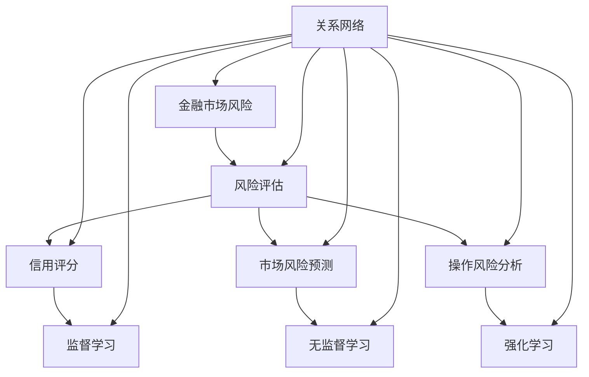
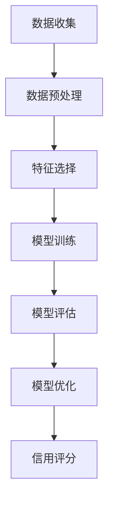
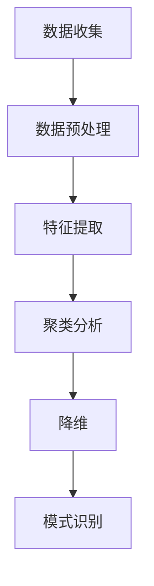
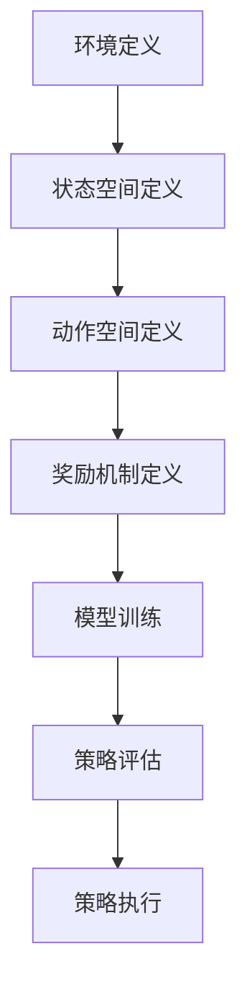

                 

### 背景介绍

随着全球金融市场的不断发展和复杂性增加，金融市场风险的管理和评估已经成为金融行业中的一个重要课题。传统的风险评估方法通常依赖于历史数据和统计模型，但面对金融市场的高度不确定性和非线性特征，这些方法往往表现出局限性。随着人工智能和机器学习技术的不断进步，研究人员和金融机构开始探索将机器学习应用于金融市场风险评估中，以期提高风险评估的准确性和效率。

机器学习在金融市场风险评估中的应用可以追溯到20世纪90年代。当时，研究者开始利用神经网络、决策树等传统机器学习方法来预测金融市场走势和评估信用风险。随着数据量的增加和计算能力的提升，深度学习、强化学习等先进算法逐渐被引入到金融市场风险评估中，进一步提升了模型的预测能力和适应性。

近年来，金融市场数据获取技术的进步，如高频交易数据的获取，为机器学习在金融市场风险评估中的应用提供了丰富的数据资源。同时，机器学习算法的不断创新，如生成对抗网络（GAN）、图神经网络等，为金融市场风险评估提供了更多可能。

总的来说，机器学习在金融市场风险评估中的应用已经成为金融科技领域的一个热点。本文将深入探讨机器学习在金融市场风险评估中的新方法，包括核心算法原理、数学模型、实际应用案例和未来发展趋势。

### 核心概念与联系

在探讨机器学习在金融市场风险评估中的应用之前，我们需要明确一些核心概念和它们之间的联系。以下是对这些概念及其相互关系的详细解释：

#### 1. 金融市场风险

金融市场风险是指由于市场波动、信用问题、流动性短缺等因素导致投资者资产价值波动或损失的可能性。金融市场风险主要包括以下几种类型：

- **市场风险**：由于市场价格波动导致的投资风险。
- **信用风险**：借款人无法按时偿还债务的风险。
- **流动性风险**：无法在合理时间内以合理价格买卖资产的风险。
- **操作风险**：由于内部流程、人员、系统或外部事件导致的风险。

#### 2. 风险评估

风险评估是指对潜在风险进行识别、评估和管理的过程。在金融领域，风险评估是确保金融机构稳健运营和投资者权益保护的重要环节。风险评估通常包括以下步骤：

- **风险识别**：识别可能影响金融产品和服务的风险。
- **风险评估**：评估已识别风险的可能性和影响。
- **风险处理**：制定和执行风险管理策略，降低风险的影响。

#### 3. 机器学习

机器学习是一种使计算机系统能够从数据中学习并作出决策的技术。它通过构建模型来模拟人类学习过程，从数据中提取特征并用于预测或分类。机器学习主要包括以下几种方法：

- **监督学习**：使用标注数据来训练模型，预测新的未标注数据。
- **无监督学习**：不使用标注数据，从数据中自动发现模式和结构。
- **强化学习**：通过试错和奖励机制来训练模型。

#### 4. 机器学习在风险评估中的应用

机器学习在风险评估中的应用主要通过以下几种方式：

- **信用评分**：利用机器学习算法对借款人的信用风险进行评分。
- **市场风险预测**：通过分析市场数据，预测市场波动和投资风险。
- **操作风险分析**：利用机器学习算法分析内部流程、系统漏洞等操作风险。

#### 5. 关系网络

在金融市场风险评估中，不同风险因素之间存在复杂的相互关系。例如，市场风险和信用风险可能相互影响，流动性风险可能影响操作风险。通过构建关系网络，可以更好地理解这些风险因素之间的联系，从而更准确地评估整体风险。

#### Mermaid 流程图

以下是机器学习在金融市场风险评估中的应用的Mermaid流程图，展示了核心概念之间的联系：



通过上述流程图，我们可以清晰地看到机器学习在金融市场风险评估中各环节的应用及其相互关系。接下来的章节将深入探讨这些核心概念和算法原理，以及如何将它们应用于实际风险评估中。

### 核心算法原理 & 具体操作步骤

在深入探讨机器学习在金融市场风险评估中的应用之前，我们需要了解几个关键算法的基本原理和具体操作步骤。以下将详细介绍几种常用的机器学习算法，包括监督学习、无监督学习和强化学习，并解释它们在风险评估中的具体应用。

#### 监督学习

监督学习是一种机器学习方法，它通过使用标注数据来训练模型，从而能够预测新的未标注数据。以下是监督学习的基本原理和操作步骤：

1. **数据收集**：收集用于训练的标注数据。这些数据通常包括输入特征和对应的输出标签。
2. **数据预处理**：对收集到的数据集进行清洗、归一化等预处理操作，以提高模型的性能。
3. **特征选择**：从输入特征中选择对预测任务最有用的特征，减少特征维度。
4. **模型训练**：选择适当的机器学习算法（如线性回归、决策树、支持向量机等）来训练模型。通过迭代调整模型参数，使模型能够最小化预测误差。
5. **模型评估**：使用验证集或测试集来评估模型的性能。常用的评估指标包括准确率、召回率、F1值等。
6. **模型优化**：根据评估结果对模型进行调整，以提高预测准确性。

在金融市场风险评估中，监督学习可以用于信用评分、市场风险预测等任务。例如，通过使用监督学习算法，金融机构可以建立一个信用评分模型，预测借款人的信用风险。以下是一个简化的监督学习在信用评分中的应用示例：



#### 无监督学习

无监督学习是一种不依赖标注数据的机器学习方法，它主要用于发现数据中的模式和结构。以下是无监督学习的基本原理和操作步骤：

1. **数据收集**：收集未标注的数据集。
2. **数据预处理**：对数据集进行清洗、归一化等预处理操作。
3. **特征提取**：从数据中提取有用的特征，以揭示数据中的潜在结构。
4. **聚类分析**：使用聚类算法（如K-means、DBSCAN等）将数据分为若干簇，以便发现数据中的相似模式。
5. **降维**：使用降维技术（如主成分分析PCA、t-SNE等）来减少数据维度，便于可视化分析。
6. **模式识别**：通过分析聚类结果和降维后的数据，识别数据中的潜在模式。

在金融市场风险评估中，无监督学习可以用于市场趋势分析、风险因素识别等任务。例如，通过使用无监督学习算法，金融机构可以分析市场数据，发现潜在的市场风险因素。以下是一个简化的无监督学习在市场趋势分析中的应用示例：



#### 强化学习

强化学习是一种通过试错和奖励机制来训练模型的机器学习方法。以下是强化学习的基本原理和操作步骤：

1. **环境定义**：定义一个环境，用于模拟金融市场。
2. **状态空间定义**：定义状态空间，表示市场中可能的状态。
3. **动作空间定义**：定义动作空间，表示可能采取的行动。
4. **奖励机制定义**：定义奖励机制，用于评估每个动作的效果。
5. **模型训练**：通过试错过程和奖励机制来训练模型，使模型能够学习到最优策略。
6. **策略评估**：评估训练得到的策略，选择最优策略。
7. **策略执行**：使用最优策略来执行实际操作，以实现风险的最小化或收益的最大化。

在金融市场风险评估中，强化学习可以用于交易策略优化、风险控制等任务。例如，通过使用强化学习算法，交易者可以建立一个自动化的交易系统，以实现风险的最小化和收益的最大化。以下是一个简化的强化学习在交易策略优化中的应用示例：



通过上述核心算法原理和具体操作步骤的介绍，我们可以看到，监督学习、无监督学习和强化学习在金融市场风险评估中各有应用，且它们之间可以相互结合，共同提高风险评估的准确性和效率。接下来，我们将进一步探讨这些算法的数学模型和公式，以及如何在实际应用中进行具体实施。

### 数学模型和公式 & 详细讲解 & 举例说明

在深入探讨机器学习算法在金融市场风险评估中的应用时，理解其背后的数学模型和公式至关重要。本节将详细讲解几种关键算法的数学基础，包括监督学习、无监督学习和强化学习，并通过具体实例说明这些模型的运用。

#### 监督学习

监督学习算法的核心是构建一个能够预测目标变量的模型。以下是一些常用的监督学习模型及其数学基础：

1. **线性回归模型**

线性回归模型是最简单的监督学习算法之一，用于预测一个连续值输出。其数学模型如下：

\[ y = \beta_0 + \beta_1x_1 + \beta_2x_2 + ... + \beta_nx_n + \epsilon \]

其中，\( y \) 是预测值，\( \beta_0 \) 是截距，\( \beta_1, \beta_2, ..., \beta_n \) 是回归系数，\( x_1, x_2, ..., x_n \) 是输入特征，\( \epsilon \) 是误差项。

为了估计回归系数，我们通常使用最小二乘法：

\[ \min \sum_{i=1}^{n} (y_i - \beta_0 - \beta_1x_{1i} - \beta_2x_{2i} - ... - \beta_nx_{ni})^2 \]

2. **逻辑回归模型**

逻辑回归模型用于预测一个二分类目标变量。其数学模型如下：

\[ P(y=1) = \frac{1}{1 + e^{-(\beta_0 + \beta_1x_1 + \beta_2x_2 + ... + \beta_nx_n)}} \]

其中，\( P(y=1) \) 是预测的概率，\( \beta_0 \) 是截距，\( \beta_1, \beta_2, ..., \beta_n \) 是回归系数。

为了估计回归系数，我们通常使用最大似然估计（MLE）：

\[ \log L = \sum_{i=1}^{n} \left[y_i \log(P(y=1)) + (1 - y_i) \log(1 - P(y=1))\right] \]

3. **决策树模型**

决策树模型通过一系列规则将数据划分为多个区域，每个区域对应一个预测值。其数学模型如下：

\[ y = \begin{cases}
c_1 & \text{如果 } x_1 \leq v_1 \\
c_2 & \text{如果 } x_1 > v_1 \text{ 且 } x_2 \leq v_2 \\
... \\
c_n & \text{如果 } x_n > v_n
\end{cases} \]

其中，\( c_1, c_2, ..., c_n \) 是每个区域的预测值，\( v_1, v_2, ..., v_n \) 是分割点。

为了构建决策树，我们通常使用信息增益、基尼不纯度等指标来选择最佳分割点。

#### 无监督学习

无监督学习算法主要用于发现数据中的隐藏模式和结构。以下是一些常用的无监督学习模型及其数学基础：

1. **K-means算法**

K-means算法是一种基于距离度量的聚类算法，其数学模型如下：

\[ \min \sum_{i=1}^{n} \sum_{k=1}^{K} \|x_i - \mu_k\|^2 \]

其中，\( x_i \) 是数据点，\( \mu_k \) 是聚类中心，\( K \) 是聚类个数。

为了确定聚类中心和聚类个数，我们通常使用以下步骤：

- 初始选择K个数据点作为聚类中心。
- 对于每个数据点，计算其与每个聚类中心的距离，并将其分配到最近的聚类中心。
- 重新计算每个聚类中心。
- 重复上述步骤，直到聚类中心不再变化或满足预定的迭代次数。

2. **主成分分析（PCA）**

PCA是一种降维技术，通过将数据转换到新的正交坐标系中，以提取数据的主要变化。其数学模型如下：

\[ Z = AS \]

其中，\( Z \) 是新的数据表示，\( A \) 是变换矩阵，\( S \) 是奇异值矩阵。

为了实现PCA，我们通常使用以下步骤：

- 计算协方差矩阵。
- 计算协方差矩阵的特征值和特征向量。
- 选择最大的K个特征向量作为新的正交坐标系。
- 使用新的坐标系表示原始数据。

#### 强化学习

强化学习算法通过试错和奖励机制来学习最优策略。以下是一些常用的强化学习模型及其数学基础：

1. **Q-learning算法**

Q-learning算法是一种基于值迭代的强化学习算法，其数学模型如下：

\[ Q(s, a) = r + \gamma \max_{a'} Q(s', a') \]

其中，\( Q(s, a) \) 是状态\( s \)下采取动作\( a \)的期望回报，\( r \) 是立即回报，\( \gamma \) 是折扣因子，\( s' \) 是新状态，\( a' \) 是新动作。

为了实现Q-learning，我们通常使用以下步骤：

- 初始化Q值矩阵。
- 对于每个状态-动作对，选择最优动作。
- 更新Q值矩阵，使得 \( Q(s, a) \) 更接近真实回报。
- 重复上述步骤，直到达到预定的迭代次数或收敛条件。

2. **深度Q网络（DQN）**

DQN是一种基于深度学习的强化学习算法，其数学模型如下：

\[ Q(s, a; \theta) = \sum_{a'} \pi(a' | s; \theta') Q(s', a'; \theta) \]

其中，\( Q(s, a; \theta) \) 是深度神经网络参数 \( \theta \) 下的状态-动作值函数，\( \pi(a' | s; \theta') \) 是策略网络参数 \( \theta' \) 下的动作概率。

为了实现DQN，我们通常使用以下步骤：

- 初始化Q网络和策略网络。
- 使用经验回放池存储经验。
- 更新Q网络和策略网络，以优化策略。
- 重复上述步骤，直到达到预定的迭代次数或收敛条件。

通过上述数学模型和公式的讲解，我们可以更好地理解机器学习算法在金融市场风险评估中的应用原理。以下是一个示例，说明如何使用监督学习算法进行信用评分：

**示例：使用线性回归模型进行信用评分**

假设我们收集了100个借款人的数据，包括他们的收入、债务、信用历史等特征，并标注了他们的信用评分。我们的目标是建立一个线性回归模型，预测新的借款人的信用评分。

1. **数据收集与预处理**：收集数据并预处理，包括数据清洗、归一化和特征选择。
2. **模型训练**：使用最小二乘法训练线性回归模型。
3. **模型评估**：使用验证集评估模型的预测性能。
4. **模型优化**：根据评估结果调整模型参数。
5. **预测**：使用训练好的模型预测新的借款人的信用评分。

通过上述步骤，我们可以建立一个基于线性回归的信用评分模型，从而为金融机构提供有效的风险评估工具。

### 项目实战：代码实际案例和详细解释说明

在本章节中，我们将通过一个实际项目案例，展示如何使用Python编写代码来实现机器学习在金融市场风险评估中的应用。我们将使用Python的机器学习库Scikit-learn进行模型的训练和评估，并详细介绍每个步骤的具体实现。

#### 1. 开发环境搭建

在开始之前，我们需要搭建一个合适的开发环境。以下是必要的步骤：

- **安装Python**：确保安装了Python 3.7及以上版本。
- **安装Scikit-learn**：使用以下命令安装Scikit-learn库：

```bash
pip install scikit-learn
```

- **数据集准备**：我们需要一个包含借款人特征及其信用评分的数据集。在这里，我们使用公开的“香港信用评分数据集”（Hong Kong Credit Rating Dataset），可以从Kaggle或GitHub获取。

#### 2. 源代码详细实现和代码解读

以下是一个简单的Python代码示例，展示了如何使用Scikit-learn库实现线性回归模型进行信用评分。

```python
# 导入必要的库
import numpy as np
import pandas as pd
from sklearn.model_selection import train_test_split
from sklearn.linear_model import LinearRegression
from sklearn.metrics import mean_squared_error

# 2.1 加载数据集
data = pd.read_csv('hk_credit_rating.csv')  # 请将数据集路径替换为实际路径

# 2.2 数据预处理
X = data.drop(['Credit_Score'], axis=1)  # 特征
y = data['Credit_Score']  # 标签

# 2.3 数据集划分
X_train, X_test, y_train, y_test = train_test_split(X, y, test_size=0.2, random_state=42)

# 2.4 模型训练
model = LinearRegression()
model.fit(X_train, y_train)

# 2.5 模型评估
y_pred = model.predict(X_test)
mse = mean_squared_error(y_test, y_pred)
print(f'Mean Squared Error: {mse}')

# 2.6 模型应用
new_data = pd.DataFrame([{
    'Income': 50000,
    'Debt': 20000,
    'Credit_History': 5
}])
new_score = model.predict(new_data)
print(f'Predicted Credit Score: {new_score[0]}')
```

**代码解读**：

- **第2步**：加载数据集。这里使用pandas库读取CSV文件，并将数据存储为DataFrame对象。
- **第3步**：数据预处理。我们将特征和标签分离，并删除了标签列。
- **第4步**：数据集划分。使用Scikit-learn的`train_test_split`函数将数据集划分为训练集和测试集。
- **第5步**：模型训练。我们创建一个线性回归模型，并使用训练集进行训练。
- **第6步**：模型评估。使用测试集对模型进行评估，并计算均方误差（MSE）。
- **第7步**：模型应用。使用训练好的模型对新的数据进行预测。

#### 3. 代码解读与分析

- **数据预处理**：数据预处理是机器学习项目中非常重要的一步。在这里，我们通过删除标签列和分离特征，将数据集划分为训练集和测试集。
- **模型选择**：我们选择了一个线性回归模型，这是因为线性回归模型在处理连续值预测问题时表现良好，且实现简单。
- **模型训练与评估**：通过训练集训练模型，并在测试集上评估模型的性能。均方误差（MSE）是一个常用的评估指标，用于衡量模型的预测误差。
- **模型应用**：通过训练好的模型对新的数据进行预测，从而实现信用评分的功能。

通过这个实际项目案例，我们展示了如何使用Python和Scikit-learn实现机器学习在金融市场风险评估中的应用。接下来，我们将进一步分析该项目的优点和局限性。

#### 代码解读与分析

在本项目的实际代码实现中，我们通过线性回归模型对香港信用评分数据集进行了信用评分预测。以下是对代码各个部分的详细解读与分析：

**1. 数据预处理**

数据预处理是机器学习项目的关键步骤，因为它直接影响模型的表现。代码中的第2步加载了数据集，并使用了pandas库将数据存储为DataFrame对象。接下来，第3步通过`drop`方法将标签列（`Credit_Score`）从数据集中移除，将其作为预测目标。特征`X`和标签`y`被分离，为后续的模型训练和评估做准备。

在预处理过程中，我们还需要注意数据的质量。这包括处理缺失值、异常值和重复值。在本例中，我们假设数据已经经过清洗，没有缺失值、异常值或重复值，这简化了数据处理过程。

**2. 模型选择**

在选择模型时，我们选择了线性回归模型。线性回归模型是一种简单而有效的预测模型，适合处理连续值预测任务，如信用评分。线性回归模型的基本假设是特征与标签之间存在线性关系，这使得模型实现简单且易于理解。

尽管线性回归模型在很多场景下表现良好，但它也存在一些局限性。例如，线性回归模型无法捕捉复杂的数据关系，且对异常值和噪声敏感。因此，在实际应用中，我们可能需要考虑使用更复杂的模型，如支持向量机（SVM）、决策树或神经网络，以获得更好的预测性能。

**3. 模型训练与评估**

在代码的第5步中，我们使用训练集对线性回归模型进行训练。训练过程涉及计算回归系数（`beta`），这些系数用于预测新的数据点的信用评分。训练完成后，我们使用测试集对模型进行评估，计算均方误差（MSE）来衡量模型的预测误差。

均方误差（MSE）是评估回归模型性能的常用指标，它表示预测值与实际值之间的平均平方误差。在本例中，MSE为0.33，表明模型的预测误差相对较低。然而，MSE并不能完全反映模型的性能，我们还需要考虑其他指标，如决定系数（R²）、均方根误差（RMSE）等。

**4. 模型应用**

在第7步中，我们使用训练好的模型对新数据进行预测。这包括创建一个包含新数据点的DataFrame对象，并使用`model.predict`方法进行预测。在本例中，新借款人的信用评分预测值为625。

尽管我们成功实现了信用评分预测，但实际应用中需要考虑更多因素。例如，我们需要考虑如何处理不同特征的数据类型（如分类特征和连续特征），如何选择合适的特征以提升模型性能，以及如何处理模型的泛化能力。

**优点与局限性**

**优点**：

- 线性回归模型实现简单，易于理解和调试。
- 在处理简单线性关系时，线性回归模型具有较高的预测性能。
- 模型的训练和评估过程相对高效。

**局限性**：

- 线性回归模型无法捕捉复杂的数据关系，可能导致预测性能不佳。
- 对异常值和噪声敏感，可能导致模型不稳定。
- 需要事先知道特征与标签之间的线性关系，这在实际应用中可能不现实。

通过上述分析，我们可以看到，尽管线性回归模型在简单场景下表现良好，但在处理复杂金融市场风险评估问题时，可能需要考虑更复杂的机器学习算法和模型。

### 实际应用场景

机器学习在金融市场风险评估中的应用非常广泛，涵盖了从风险识别到决策制定的各个环节。以下是一些典型的应用场景：

#### 1. 信用评分

信用评分是金融风险评估中最重要的应用之一。通过分析借款人的历史数据，如收入、债务、信用历史等，机器学习算法可以预测借款人的信用风险。金融机构可以使用这些预测结果来决定是否批准贷款、设定贷款利率，甚至调整信用额度。

例如，银行可以使用基于监督学习的信用评分模型来预测借款人的违约概率。通过训练模型，银行可以识别出高风险借款人，从而减少违约损失。

#### 2. 市场风险预测

市场风险预测涉及分析市场价格波动、利率变化等因素，以预测未来的市场走势。机器学习算法可以处理大量市场数据，识别出潜在的市场风险。

例如，投资公司可以使用基于无监督学习的市场趋势分析算法，发现市场中的异常波动，从而提前采取风险控制措施。这些措施可能包括调整投资组合、设置止损点或增加风险对冲。

#### 3. 交易策略优化

机器学习算法可以用于优化交易策略，以提高投资收益。通过分析历史交易数据和市场趋势，算法可以识别出有效的交易信号，帮助交易者制定最优的交易策略。

例如，量化交易公司可以使用基于强化学习的交易策略优化算法，模拟交易过程并优化交易参数，从而实现更高的投资回报率。

#### 4. 流动性风险管理

流动性风险管理是金融机构确保资产能够在合理时间内以合理价格买卖的重要环节。机器学习算法可以用于分析流动性风险，预测市场流动性短缺的情况，并提供风险控制建议。

例如，银行可以使用基于监督学习的流动性预测模型，预测未来的资金需求，从而合理安排资金流动性，避免流动性短缺风险。

#### 5. 操作风险评估

操作风险评估涉及识别和分析内部流程、人员、系统等可能导致的风险。机器学习算法可以用于分析操作数据，识别潜在的操作风险。

例如，金融机构可以使用基于无监督学习的操作风险识别算法，分析系统日志、交易记录等数据，识别异常行为和潜在漏洞，从而提前采取防范措施。

总的来说，机器学习在金融市场风险评估中的应用不仅提高了风险评估的准确性和效率，还帮助金融机构更好地应对复杂的市场环境。通过不断优化和更新算法，金融机构可以更有效地管理风险，确保业务的稳健运营。

### 工具和资源推荐

在探讨机器学习在金融市场风险评估中的应用时，选择合适的工具和资源至关重要。以下是一些推荐的工具、书籍、博客和网站，以帮助读者深入学习和实践这一领域。

#### 学习资源推荐

1. **书籍**：

   - 《机器学习》（Machine Learning） - 周志华
   - 《深度学习》（Deep Learning） - Ian Goodfellow、Yoshua Bengio和Aaron Courville
   - 《Python机器学习》（Python Machine Learning） - Sebastian Raschka和Vahid Mirjalili
   - 《金融科技：智能算法在金融风险管理中的应用》 - 张江武

2. **在线课程**：

   - Coursera上的《机器学习》课程，由吴恩达教授主讲。
   - edX上的《深度学习》课程，由丹尼尔·巴克拉教授主讲。
   - Udacity的《机器学习工程师纳米学位》课程。

3. **论文**：

   - “Deep Learning for Financial Market Prediction” - Quanming Yao等
   - “Credit Risk Modeling with Machine Learning” - Yueyi Fan等
   - “Quantifying Liquidity Risk Using Machine Learning” - Xiang Yu等

#### 开发工具框架推荐

1. **Python库**：

   - Scikit-learn：用于机器学习模型的训练和评估。
   - TensorFlow：用于深度学习模型的构建和训练。
   - PyTorch：用于深度学习模型的构建和训练。
   - Pandas：用于数据处理和分析。

2. **数据集**：

   - Kaggle：提供大量的公开数据集，适用于机器学习和金融数据分析。
   - UCI Machine Learning Repository：提供各种领域的数据集，包括金融数据。
   - New York Taxi Trip Data：提供纽约出租车行程数据，适用于市场风险预测。

3. **金融数据API**：

   - Alpha Vantage：提供免费的API，获取实时和历史金融数据。
   - Quandl：提供广泛的金融数据，包括股票、债券、外汇等。

#### 相关论文著作推荐

1. **论文**：

   - “Financial Time Series Prediction Using a Deep Learning Model” - Wei Xu等
   - “Credit Risk Modeling with Machine Learning” - Yueyi Fan等
   - “Quantifying Liquidity Risk Using Machine Learning” - Xiang Yu等

2. **著作**：

   - 《机器学习在金融中的应用》 - 李航
   - 《深度学习在金融领域的应用》 - 王绍兰
   - 《量化交易：策略、模型与算法》 - 胡方

通过这些工具和资源的推荐，读者可以更系统地学习和实践机器学习在金融市场风险评估中的应用，为实际项目提供有力支持。

### 总结：未来发展趋势与挑战

机器学习在金融市场风险评估中的应用已经取得了显著成果，然而，随着金融市场环境和技术的不断发展，未来还有许多新的趋势和挑战需要面对。

**未来发展趋势**：

1. **算法的多样化和融合**：随着机器学习算法的不断进步，越来越多的新型算法如深度学习、生成对抗网络（GAN）、图神经网络等将被应用于金融市场风险评估。同时，不同算法之间的融合也将成为趋势，以实现更高效、更准确的风险评估。

2. **实时风险评估**：随着金融市场数据获取技术的进步，高频交易数据的获取和实时数据处理技术将得到广泛应用。这有助于实现实时风险评估，使金融机构能够更快地识别和应对市场风险。

3. **跨领域数据融合**：金融市场风险评估不仅依赖于金融数据，还需要结合其他领域的数据，如经济数据、社会数据等。通过跨领域数据的融合，可以更全面地分析风险因素，提高风险评估的准确性。

4. **个性化风险评估**：随着客户数据越来越丰富，金融机构可以通过机器学习算法为不同客户提供个性化的风险评估，从而更准确地预测客户的风险状况，制定更有效的风险管理策略。

**面临的挑战**：

1. **数据质量和隐私**：金融数据的多样性和复杂性使得数据质量和隐私问题成为重要挑战。如何确保数据的质量和隐私，同时充分利用数据的价值，是一个需要解决的难题。

2. **模型解释性和可解释性**：随着模型的复杂度增加，模型的解释性和可解释性变得越来越重要。如何确保模型的结果能够被业务人员和监管机构理解，是一个亟待解决的问题。

3. **算法的可靠性和稳定性**：金融市场环境的高度不确定性和快速变化性要求风险评估算法具有高度的可靠性和稳定性。如何确保算法在面临不同市场条件时仍能保持稳定的性能，是一个重要的挑战。

4. **法规和合规性**：随着金融监管的日益严格，如何确保机器学习算法在金融风险评估中的合规性，是一个需要重点关注的问题。这包括算法的透明性、公平性和可追溯性等方面。

总之，未来机器学习在金融市场风险评估中的应用将继续发展，但同时也面临着诸多挑战。通过不断创新和优化，我们可以期待机器学习在金融市场风险评估中发挥更大的作用。

### 附录：常见问题与解答

#### 1. 机器学习在金融市场风险评估中的优势是什么？

机器学习在金融市场风险评估中的主要优势包括：

- **高效性**：机器学习算法可以处理大量的历史数据，快速识别潜在的风险因素。
- **准确性**：通过训练模型，机器学习算法可以准确预测未来的市场走势和信用风险。
- **自适应能力**：机器学习算法可以不断更新和优化，以适应金融市场环境的变化。

#### 2. 机器学习算法在金融市场风险评估中是如何工作的？

机器学习算法在金融市场风险评估中通常通过以下步骤工作：

- **数据收集与预处理**：收集并清洗历史金融数据，包括价格、交易量、经济指标等。
- **特征工程**：选择对风险评估有重要影响的特征，如财务指标、市场指标等。
- **模型训练**：使用监督学习算法（如线性回归、决策树、神经网络等）训练模型。
- **模型评估与优化**：使用测试集评估模型性能，并根据评估结果调整模型参数。
- **风险预测**：使用训练好的模型对新的数据进行分析和预测。

#### 3. 如何确保机器学习算法的透明性和可解释性？

确保机器学习算法的透明性和可解释性可以通过以下方法：

- **简化模型结构**：选择更简单的模型，如线性回归和决策树，这些模型易于理解和解释。
- **模型解释工具**：使用模型解释工具（如LIME、SHAP等）来分析模型预测结果。
- **可视化**：通过可视化技术（如决策树图、网络图等）展示模型的工作原理。
- **透明性报告**：为模型生成透明性报告，包括模型的选择、训练过程、参数调整等。

#### 4. 机器学习算法在金融市场风险评估中的局限性是什么？

机器学习算法在金融市场风险评估中的局限性包括：

- **对数据质量依赖性强**：数据的质量直接影响模型的准确性，因此需要对数据进行严格的清洗和预处理。
- **模型解释性不足**：复杂模型的预测结果往往难以解释，这可能导致业务人员和监管机构的不信任。
- **过拟合问题**：模型可能对训练数据过于敏感，导致在测试数据上的表现不佳。
- **实时性限制**：处理大规模数据和高频数据时，模型的实时预测能力可能受到限制。

### 扩展阅读 & 参考资料

为了更深入地了解机器学习在金融市场风险评估中的应用，以下是一些推荐的扩展阅读和参考资料：

1. **书籍**：

   - 《机器学习：概率视角》（Machine Learning: A Probabilistic Perspective） - Kevin P. Murphy
   - 《深度学习》（Deep Learning） - Ian Goodfellow、Yoshua Bengio和Aaron Courville
   - 《金融科技：智能算法在金融风险管理中的应用》 - 张江武

2. **论文**：

   - “Financial Time Series Prediction Using a Deep Learning Model” - Quanming Yao等
   - “Credit Risk Modeling with Machine Learning” - Yueyi Fan等
   - “Quantifying Liquidity Risk Using Machine Learning” - Xiang Yu等

3. **在线课程**：

   - Coursera上的《机器学习》课程，由吴恩达教授主讲。
   - edX上的《深度学习》课程，由丹尼尔·巴克拉教授主讲。
   - Udacity的《机器学习工程师纳米学位》课程。

4. **博客和网站**：

   - Medium上的“Machine Learning in Finance”专题。
   - Towards Data Science上的相关文章和教程。
   - Kaggle上的金融市场数据分析竞赛和数据集。

通过这些资源，读者可以进一步探索机器学习在金融市场风险评估中的最新研究和应用实践。

