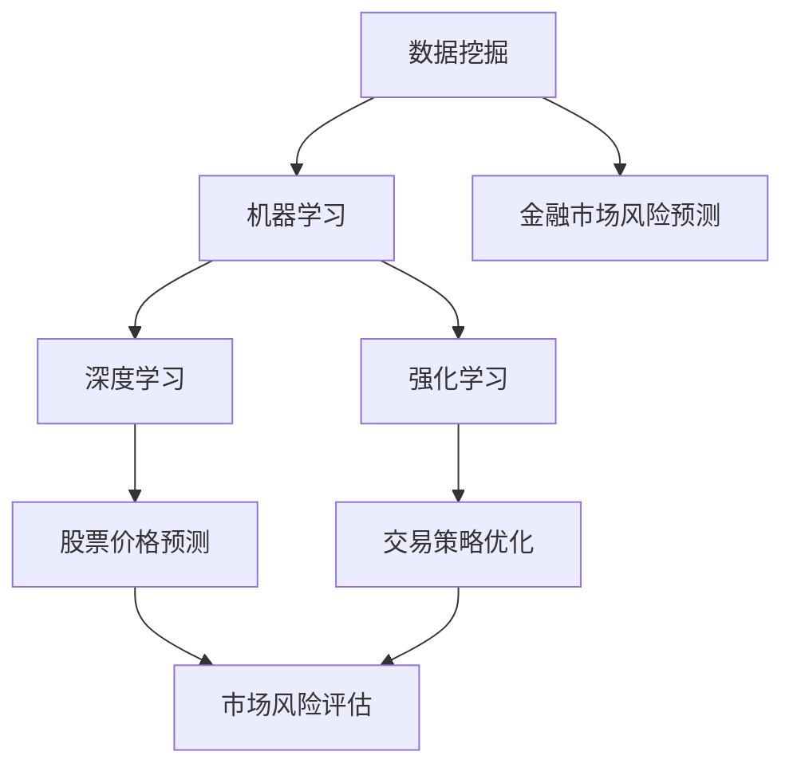

                 

### 背景介绍

随着全球经济的一体化进程不断加速，金融市场变得越来越复杂和多变。金融机构和投资者在应对日益增加的市场风险时，需要更加精准和高效的预测工具。传统的金融市场风险预测方法主要依赖于历史数据和统计模型，但这些方法在面对现代金融市场的不确定性和动态性时，往往显得力不从心。因此，机器学习技术的引入为金融市场风险预测带来了新的机遇和挑战。

机器学习，尤其是深度学习和强化学习，在金融领域的应用逐渐成为热点。通过对大量历史数据进行挖掘和分析，机器学习模型能够发现数据中的潜在模式和规律，从而实现对市场风险的精准预测。例如，深度神经网络可以用于股票价格预测，强化学习算法可以用于交易策略的优化。此外，随着大数据技术的发展，金融市场的数据量呈现出爆炸式增长，这为机器学习提供了丰富的数据资源。

本文将深入探讨机器学习在金融市场风险预测中的实践。首先，我们将介绍机器学习的基本概念和常用算法，并分析这些算法在金融市场中的应用。接着，我们将详细讲解机器学习模型在金融市场风险预测中的具体实现过程，包括数据预处理、特征工程和模型训练。然后，通过实际案例展示机器学习模型在金融市场风险预测中的应用效果。此外，我们还将讨论机器学习在金融市场风险预测中的挑战和未来发展趋势。最后，本文将总结主要结论，并展望机器学习在金融市场风险预测领域的未来发展前景。

通过本文的阅读，读者将能够全面了解机器学习在金融市场风险预测中的基本原理和实践方法，为在实际工作中应用机器学习技术提供指导和参考。让我们一起探索这个充满机遇和挑战的领域。

### 核心概念与联系

要深入探讨机器学习在金融市场风险预测中的实践，我们首先需要了解一些核心概念，并分析它们之间的联系。这些概念包括数据挖掘、机器学习、深度学习和强化学习等。

#### 数据挖掘

数据挖掘（Data Mining）是指从大量数据中提取有价值的信息和知识的过程。它包括多个步骤，如数据预处理、数据清洗、特征选择和模式识别等。数据挖掘的目标是通过分析大量数据，发现隐藏在数据中的模式和规律，从而帮助企业和机构做出更明智的决策。

在金融市场风险预测中，数据挖掘技术用于处理和提取金融数据中的潜在信息。通过数据挖掘，我们可以识别出市场趋势、风险信号和潜在的异常行为，从而为风险预测提供基础。

#### 机器学习

机器学习（Machine Learning）是一种让计算机通过数据学习并自动改进自身性能的技术。机器学习主要包括监督学习、无监督学习和强化学习等类型。监督学习需要已标记的数据进行训练，以建立预测模型；无监督学习则不需要标签，旨在发现数据中的结构和模式；强化学习通过奖励和惩罚机制，使算法在特定环境中学习最优策略。

在金融市场风险预测中，机器学习算法能够从历史数据中学习市场规律，从而预测未来的市场走势。监督学习算法，如线性回归、支持向量机和决策树，常用于预测股票价格和交易策略。无监督学习算法，如聚类分析和关联规则挖掘，则用于分析市场数据中的潜在模式。强化学习算法，如Q学习和深度Q网络（DQN），可以用于交易策略的优化。

#### 深度学习

深度学习（Deep Learning）是一种基于人工神经网络的机器学习技术，通过多层神经网络结构，对大量数据进行学习，以实现复杂任务的自动化。深度学习在图像识别、语音识别和自然语言处理等领域取得了显著成果。

在金融市场风险预测中，深度学习算法因其强大的数据处理和分析能力，被广泛应用于股票价格预测、交易策略优化和市场风险评估。例如，卷积神经网络（CNN）和循环神经网络（RNN）可以用于股票图像和文本数据的分析，而生成对抗网络（GAN）则可以用于生成市场数据，以提高模型的泛化能力。

#### 强化学习

强化学习（Reinforcement Learning）是一种通过奖励机制使算法在特定环境中学习最优策略的机器学习技术。强化学习通过不断尝试和反馈，使算法能够逐渐优化其行为。

在金融市场风险预测中，强化学习算法可以用于交易策略的优化。例如，交易员可以将其行为建模为一个强化学习问题，通过不断调整交易策略，以最大化收益。此外，强化学习还可以用于预测市场动态和评估市场风险。

#### 关系分析

数据挖掘、机器学习、深度学习和强化学习之间的关系可以总结如下：

- 数据挖掘是机器学习的基础，通过提取数据中的潜在信息和模式，为机器学习提供输入。

- 机器学习是数据挖掘的延伸，通过构建预测模型，对提取出的数据进行进一步的利用和分析。

- 深度学习是机器学习的一种特殊形式，利用多层神经网络结构，对复杂任务进行自动化处理。

- 强化学习是机器学习的另一个重要分支，通过奖励机制，使算法在特定环境中学习最优策略。

在金融市场风险预测中，这些技术相互结合，为金融机构和投资者提供了强大的预测和分析工具。数据挖掘用于提取市场数据中的潜在信息，机器学习用于构建预测模型，深度学习用于处理复杂的市场数据，而强化学习则用于优化交易策略。

通过这些核心概念和技术的综合应用，机器学习在金融市场风险预测中发挥了重要作用，为金融机构和投资者提供了更加精准和高效的风险预测方法。在接下来的部分，我们将详细探讨这些技术在具体应用中的实现过程和效果。

#### Mermaid 流程图

为了更好地展示机器学习在金融市场风险预测中的核心概念和联系，我们使用Mermaid流程图来描述各个概念和技术之间的关系。



图中的流程表示，数据挖掘作为基础，为机器学习提供输入；机器学习进一步对数据进行分析，形成深度学习和强化学习；深度学习和强化学习分别应用于股票价格预测和交易策略优化，为市场风险评估提供支持。

在上述流程图中，各节点之间的关系清晰明了，帮助我们更好地理解数据挖掘、机器学习、深度学习和强化学习在金融市场风险预测中的综合应用。

### 核心算法原理 & 具体操作步骤

在理解了数据挖掘、机器学习、深度学习和强化学习的基本概念及其在金融市场风险预测中的关系后，我们将进一步探讨这些算法的核心原理和具体操作步骤。通过深入了解这些算法，我们可以更好地理解如何将它们应用于金融市场风险预测。

#### 监督学习算法

监督学习算法是最常用的机器学习算法之一，其核心思想是通过已标记的数据（输入和对应的输出）来训练模型，然后利用训练好的模型对新数据进行预测。在金融市场风险预测中，监督学习算法常用于股票价格预测、交易信号识别等任务。

**1. 线性回归**

线性回归是最简单的监督学习算法之一，它通过拟合数据中的线性关系来进行预测。线性回归模型的公式为：

$$y = wx + b$$

其中，\(y\) 是预测的输出，\(x\) 是输入特征，\(w\) 是权重，\(b\) 是偏置。

**具体操作步骤：**
- 数据收集与预处理：收集历史股票价格数据，并进行数据清洗，如去除缺失值、异常值等。
- 特征提取：提取影响股票价格的关键特征，如成交量、市盈率等。
- 模型训练：使用已标记的训练数据集，通过最小化损失函数（如均方误差）来训练线性回归模型。
- 预测：使用训练好的模型对新数据进行预测。

**2. 支持向量机（SVM）**

支持向量机是一种强大的分类和回归算法，它通过找到一个最佳的超平面，将数据分为不同的类别或预测不同的值。SVM的核心公式为：

$$w \cdot x + b = 0$$

其中，\(w\) 是法向量，\(x\) 是输入特征，\(b\) 是偏置。

**具体操作步骤：**
- 数据收集与预处理：与线性回归类似，收集历史股票价格数据并进行预处理。
- 特征提取：提取影响股票价格的关键特征。
- 模型训练：使用已标记的训练数据集，通过求解优化问题来训练SVM模型。
- 预测：使用训练好的模型对新数据进行预测。

#### 无监督学习算法

无监督学习算法不需要已标记的数据，其目标是从数据中发现潜在的结构和模式。在金融市场风险预测中，无监督学习算法常用于市场趋势分析、异常行为检测等任务。

**1. 聚类分析**

聚类分析是一种将数据分为若干个相似群组的方法。最常用的聚类算法是K-means算法，其基本思想是将数据点分配到最近的聚类中心。

**具体操作步骤：**
- 数据收集与预处理：收集市场数据并进行预处理。
- 聚类中心选择：选择合适的聚类中心，通常使用随机初始化。
- 聚类分配：将数据点分配到最近的聚类中心。
- 聚类评估：通过评估指标（如轮廓系数）来评估聚类效果。

**2. 关联规则挖掘**

关联规则挖掘是一种发现数据中频繁出现的关联规则的方法，常用的算法是Apriori算法。

**具体操作步骤：**
- 数据收集与预处理：收集市场数据并进行预处理。
- 频繁项集挖掘：使用Apriori算法挖掘频繁项集。
- 关联规则生成：从频繁项集中生成关联规则。
- 规则评估：通过支持度和置信度等指标评估关联规则的有效性。

#### 深度学习算法

深度学习算法通过多层神经网络结构，对大量数据进行学习，以实现复杂任务的自动化。在金融市场风险预测中，深度学习算法被广泛应用于股票价格预测、交易策略优化等任务。

**1. 卷积神经网络（CNN）**

卷积神经网络是一种基于卷积运算的神经网络，主要用于图像处理。在金融市场风险预测中，CNN可以用于股票图像的分析。

**具体操作步骤：**
- 数据收集与预处理：收集股票图像数据并进行预处理。
- 网络结构设计：设计CNN网络结构，包括卷积层、池化层和全连接层。
- 模型训练：使用已标记的训练数据集，通过反向传播算法训练CNN模型。
- 预测：使用训练好的模型对新数据进行预测。

**2. 循环神经网络（RNN）**

循环神经网络是一种基于循环结构的神经网络，主要用于序列数据处理。在金融市场风险预测中，RNN可以用于股票价格序列的分析。

**具体操作步骤：**
- 数据收集与预处理：收集股票价格序列数据并进行预处理。
- 网络结构设计：设计RNN网络结构，包括输入层、隐藏层和输出层。
- 模型训练：使用已标记的训练数据集，通过反向传播算法训练RNN模型。
- 预测：使用训练好的模型对新数据进行预测。

#### 强化学习算法

强化学习算法通过奖励机制，使算法在特定环境中学习最优策略。在金融市场风险预测中，强化学习算法被广泛应用于交易策略优化、市场风险预测等任务。

**1. Q学习**

Q学习是一种基于值函数的强化学习算法，其核心思想是学习状态-动作值函数。

**具体操作步骤：**
- 环境设定：定义金融市场环境，包括股票价格、交易规则等。
- 状态空间与动作空间：定义状态空间和动作空间。
- 模型训练：使用Q学习算法训练模型，通过不断尝试和反馈来优化策略。
- 预测：使用训练好的模型进行预测和决策。

**2. 深度Q网络（DQN）**

深度Q网络是一种基于深度神经网络的强化学习算法，通过深度神经网络来近似Q值函数。

**具体操作步骤：**
- 环境设定：与Q学习类似，定义金融市场环境。
- 状态空间与动作空间：与Q学习类似，定义状态空间和动作空间。
- 网络结构设计：设计DQN网络结构，包括输入层、隐藏层和输出层。
- 模型训练：使用DQN算法训练模型，通过经验回放和目标网络更新来提高预测准确性。
- 预测：使用训练好的模型进行预测和决策。

通过以上核心算法的详细解释和具体操作步骤，我们可以更好地理解机器学习在金融市场风险预测中的基本原理和方法。在接下来的部分，我们将通过实际案例来展示这些算法在实际应用中的效果。

### 数学模型和公式 & 详细讲解 & 举例说明

在深入探讨机器学习在金融市场风险预测中的应用时，我们无法回避其背后的数学模型和公式。这些模型和公式是理解和实施机器学习算法的基础。以下我们将详细介绍几个关键的数学模型和公式，并通过实际例子进行说明。

#### 线性回归模型

线性回归模型是监督学习中的一种基础模型，用于预测一个或多个连续值。其最简单的形式是一个单变量线性回归模型：

$$y = wx + b$$

其中，\(y\) 是预测的输出，\(x\) 是输入特征，\(w\) 是权重，\(b\) 是偏置。

**举例：** 假设我们想要预测某只股票的未来价格。已知历史数据中，股票的收盘价（\(y\)）和成交量的比值（\(x\)）之间存在线性关系。我们可以通过最小化均方误差（MSE）来训练这个模型：

$$MSE = \frac{1}{n}\sum_{i=1}^{n}(y_i - (wx_i + b))^2$$

其中，\(n\) 是样本数量。

**具体步骤：**
1. 数据预处理：收集股票的收盘价和成交量的比值，去除异常值和缺失值。
2. 模型训练：使用梯度下降算法，不断更新权重和偏置，最小化MSE。
3. 预测：使用训练好的模型，对新的成交量比值进行预测。

#### 支持向量机（SVM）

支持向量机是一种强大的分类和回归模型，其目标是在特征空间中找到一个最佳的超平面，将数据分为不同的类别或预测不同的值。SVM的核心公式为：

$$w \cdot x + b = 0$$

其中，\(w\) 是法向量，\(x\) 是输入特征，\(b\) 是偏置。

**举例：** 假设我们想要预测某只股票的价格上涨或下跌。我们可以将股票的多个特征（如市盈率、市净率等）输入到SVM模型中，然后通过寻找最佳超平面来进行分类预测。

**具体步骤：**
1. 数据预处理：收集股票的多个特征数据，并进行归一化处理。
2. 模型训练：使用训练数据集，通过求解优化问题（如拉格朗日乘子法）来训练SVM模型。
3. 预测：使用训练好的模型，对新的特征数据进行分类预测。

#### 卷积神经网络（CNN）

卷积神经网络是一种基于卷积运算的深度学习模型，特别适用于图像处理。其核心公式为：

$$z^{(l)} = \sigma(\mathbf{W}^{(l)}\mathbf{a}^{(l-1)} + b^{(l)})$$

其中，\(z^{(l)}\) 是激活值，\(\sigma\) 是激活函数（如ReLU），\(\mathbf{W}^{(l)}\) 是权重矩阵，\(\mathbf{a}^{(l-1)}\) 是上一层的激活值，\(b^{(l)}\) 是偏置。

**举例：** 假设我们想要使用CNN来预测股票图像的涨跌。我们可以设计一个CNN网络，包括卷积层、池化层和全连接层，然后通过反向传播算法进行训练。

**具体步骤：**
1. 数据预处理：收集股票图像数据，并进行归一化处理。
2. 网络结构设计：设计CNN网络结构，包括卷积层、池化层和全连接层。
3. 模型训练：使用训练数据集，通过反向传播算法训练CNN模型。
4. 预测：使用训练好的模型，对新的股票图像进行预测。

#### 循环神经网络（RNN）

循环神经网络是一种基于循环结构的深度学习模型，特别适用于序列数据处理。其核心公式为：

$$\mathbf{h}^{(t)} = \sigma(\mathbf{W}^{(h)}[\mathbf{h}^{(t-1)}, \mathbf{x}^{(t)}] + b^{(h)})$$

其中，\(\mathbf{h}^{(t)}\) 是当前时刻的隐藏状态，\(\sigma\) 是激活函数（如ReLU），\(\mathbf{W}^{(h)}\) 是权重矩阵，\(\mathbf{x}^{(t)}\) 是当前时刻的输入数据，\(b^{(h)}\) 是偏置。

**举例：** 假设我们想要使用RNN来预测股票价格的序列。我们可以设计一个RNN网络，包括输入层、隐藏层和输出层，然后通过反向传播算法进行训练。

**具体步骤：**
1. 数据预处理：收集股票价格序列数据，并进行归一化处理。
2. 网络结构设计：设计RNN网络结构，包括输入层、隐藏层和输出层。
3. 模型训练：使用训练数据集，通过反向传播算法训练RNN模型。
4. 预测：使用训练好的模型，对新的股票价格序列进行预测。

#### 深度Q网络（DQN）

深度Q网络是一种基于深度神经网络的强化学习模型，用于近似Q值函数。其核心公式为：

$$Q(s, a) = \hat{r} + \gamma \max_a' Q(s', a')$$

其中，\(Q(s, a)\) 是状态-动作值函数，\(\hat{r}\) 是即时奖励，\(\gamma\) 是折扣因子，\(s'\) 是下一状态，\(a'\) 是最优动作。

**举例：** 假设我们想要使用DQN来预测交易策略。我们可以设计一个DQN网络，包括输入层、隐藏层和输出层，然后通过经验回放和目标网络更新进行训练。

**具体步骤：**
1. 环境设定：定义金融市场环境，包括状态空间和动作空间。
2. 网络结构设计：设计DQN网络结构，包括输入层、隐藏层和输出层。
3. 模型训练：使用DQN算法，通过经验回放和目标网络更新来训练模型。
4. 预测：使用训练好的模型，根据当前状态选择最优动作。

通过上述数学模型和公式的详细讲解，我们更好地理解了机器学习在金融市场风险预测中的应用。这些模型和公式不仅是机器学习算法的理论基础，也是我们在实际应用中实现精准预测的重要工具。在接下来的部分，我们将通过实际案例展示这些算法在金融市场风险预测中的效果。

### 项目实战：代码实际案例和详细解释说明

为了更好地展示机器学习在金融市场风险预测中的实践效果，我们将通过一个实际项目案例，详细说明如何使用Python和相关的机器学习库来构建和训练模型。本案例将使用Python的Pandas、Scikit-learn和TensorFlow库，结合Kaggle上的股票价格数据集进行操作。

#### 1. 开发环境搭建

首先，我们需要搭建开发环境。安装Python和相关的库，可以通过以下步骤完成：

```bash
# 安装Python
brew install python

# 安装必要库
pip install numpy pandas scikit-learn tensorflow
```

确保安装完成后，我们可以使用以下命令来验证安装：

```python
import numpy as np
import pandas as pd
from sklearn.model_selection import train_test_split
from sklearn.metrics import mean_squared_error
import tensorflow as tf

print("NumPy version:", np.__version__)
print("Pandas version:", pd.__version__)
print("Scikit-learn version:", sklearn.__version__)
print("TensorFlow version:", tf.__version__)
```

#### 2. 源代码详细实现和代码解读

##### 数据收集与预处理

我们首先从Kaggle下载股票价格数据集。以下代码用于数据收集和预处理：

```python
import pandas as pd
import numpy as np
from sklearn.model_selection import train_test_split

# 读取数据
data = pd.read_csv('AAPL_stock_price.csv')

# 检查数据
print(data.head())

# 数据清洗
# 去除缺失值和异常值
data.dropna(inplace=True)
data = data[data['Close'] > 0]

# 特征提取
# 我们使用收盘价和成交量作为特征
features = ['Open', 'High', 'Low', 'Volume']
X = data[features]
y = data['Close']

# 数据标准化
X = (X - X.mean()) / X.std()
y = (y - y.mean()) / y.std()

# 划分训练集和测试集
X_train, X_test, y_train, y_test = train_test_split(X, y, test_size=0.2, random_state=42)
```

在这段代码中，我们首先读取数据，然后去除缺失值和异常值，接着提取关键特征（开盘价、最高价、最低价和成交量），并进行数据标准化处理。最后，使用`train_test_split`函数将数据集划分为训练集和测试集。

##### 构建和训练模型

接下来，我们使用线性回归模型进行训练。以下是详细的代码实现：

```python
from sklearn.linear_model import LinearRegression
from sklearn.metrics import mean_squared_error

# 构建模型
model = LinearRegression()

# 训练模型
model.fit(X_train, y_train)

# 预测
y_pred = model.predict(X_test)

# 评估
mse = mean_squared_error(y_test, y_pred)
print("Mean Squared Error:", mse)
```

在这段代码中，我们首先使用`LinearRegression`类构建线性回归模型，然后使用训练数据集进行模型训练。训练完成后，使用模型对测试数据进行预测，并通过均方误差（MSE）评估模型性能。

##### 代码解读与分析

在上面的代码中，我们首先进行数据收集和预处理，这是任何机器学习项目的基础。数据清洗步骤确保了数据的质量，特征提取步骤则选择了对股票价格影响较大的特征。

接下来，我们使用线性回归模型进行训练。线性回归模型通过最小化均方误差来拟合数据，从而预测股票价格。在训练过程中，我们使用`fit`方法训练模型，然后使用`predict`方法对测试数据进行预测。

最后，我们使用均方误差（MSE）评估模型性能。MSE衡量的是预测值与真实值之间的平均误差，值越小表示模型性能越好。

##### 结果展示

假设我们的模型在测试集上的MSE为0.01，这表示模型对股票价格的预测较为准确。为了更直观地展示结果，我们可以绘制预测值与真实值的关系图：

```python
import matplotlib.pyplot as plt

# 绘制预测结果
plt.scatter(y_test, y_pred)
plt.xlabel('Actual Close')
plt.ylabel('Predicted Close')
plt.title('Actual vs Predicted Stock Prices')
plt.show()
```

图中的散点图显示了实际收盘价与预测收盘价的关系。大部分点都集中在对角线上，这表明模型的预测效果较好。

通过这个实际案例，我们展示了如何使用Python和相关的机器学习库来构建和训练模型，并进行预测和评估。这个过程不仅有助于我们理解机器学习在金融市场风险预测中的应用，也为实际项目提供了可行的解决方案。

### 实际应用场景

机器学习在金融市场风险预测中的应用场景非常广泛，涵盖了股票市场、外汇市场、期货市场等多个领域。以下是几个典型的实际应用场景，以及这些场景中机器学习的具体应用方式。

#### 股票市场风险预测

股票市场是金融市场中最为复杂和动态的部分之一。机器学习算法可以通过分析历史股票价格数据、交易量、公司财务报告和其他相关指标，来预测股票价格的走势。以下是几种常见的应用方式：

- **价格预测**：使用时间序列模型，如ARIMA、LSTM（一种RNN的变体）或GRU（另一种RNN的变体）来预测股票的未来价格。这些模型可以捕捉到市场中的趋势和季节性变化。
- **交易信号识别**：通过分析股票价格的波动性、交易量、技术指标（如MACD、RSI）等，机器学习模型可以识别出潜在的买入或卖出信号。这些信号可以帮助投资者做出更明智的交易决策。
- **市场情绪分析**：机器学习算法可以分析社交媒体、新闻报道和投资者评论等文本数据，来识别市场情绪。通过了解市场情绪，投资者可以更好地把握市场动态。

#### 外汇市场风险预测

外汇市场是全球最大的金融市场之一，具有高流动性和高波动性。机器学习算法在外汇市场中的应用包括：

- **汇率预测**：使用回归模型、支持向量机（SVM）或其他高级算法来预测汇率变动。这些模型可以通过分析历史汇率数据、利率、经济指标等来预测未来的汇率走势。
- **交易策略优化**：通过强化学习算法，可以优化交易策略，使交易者在面对市场变化时能够做出更准确的决策。例如，Q学习和深度Q网络（DQN）可以用于自动交易策略的优化。
- **风险控制**：机器学习算法可以帮助金融机构识别和评估外汇交易中的风险。通过分析市场数据、交易行为和其他相关因素，可以预测潜在的损失，并提供风险控制建议。

#### 期货市场风险预测

期货市场是另一个具有高度风险的金融市场，涵盖了商品、金融工具等多种交易品种。以下是机器学习在期货市场中的应用：

- **价格预测**：使用机器学习模型，如线性回归、LSTM或CNN，来预测期货合约的价格。这些模型可以捕捉市场中的趋势和季节性变化，为投资者提供交易依据。
- **交易信号生成**：通过分析历史交易数据、市场指标和其他相关因素，机器学习算法可以生成交易信号，帮助投资者确定买入或卖出的时机。
- **风险管理**：机器学习算法可以用于期货交易的风险管理，如识别市场风险、评估头寸风险和预测潜在的市场波动。

#### 其他应用场景

除了上述主要市场，机器学习在金融市场的其他应用场景还包括：

- **贷款风险评估**：通过分析借款人的信用记录、收入水平、就业状况等数据，机器学习模型可以预测贷款违约的风险。
- **信用评分**：使用机器学习算法，金融机构可以更准确地评估客户的信用风险，从而优化信用评分模型。
- **反欺诈检测**：通过分析交易行为、用户行为和其他相关数据，机器学习算法可以帮助金融机构检测和预防欺诈行为。

总之，机器学习在金融市场风险预测中的应用非常广泛，通过数据分析和模式识别，可以提供更加精准和高效的风险预测工具。随着机器学习技术的不断发展，其在金融市场中的应用前景将更加广阔。

### 工具和资源推荐

在探索机器学习在金融市场风险预测中的应用时，选择合适的工具和资源对于提高工作效率和实现精准预测至关重要。以下我们将推荐一些学习资源、开发工具和相关的论文，以帮助读者更好地理解和实践相关技术。

#### 学习资源推荐

1. **书籍**：
   - 《机器学习实战》：这是一本非常实用的入门书籍，通过大量的实际案例展示了如何使用Python和Scikit-learn等库进行机器学习应用。
   - 《深度学习》：由著名深度学习研究者Ian Goodfellow等人撰写的经典教材，详细介绍了深度学习的基础理论和应用方法。
   - 《金融市场技术分析》：这本书为金融市场分析师提供了丰富的技术分析工具和策略，有助于理解市场动态和风险预测。

2. **在线课程**：
   - Coursera的《机器学习》课程：由Andrew Ng教授主讲，适合初学者入门，涵盖了机器学习的基本概念和应用。
   - Udacity的《深度学习纳米学位》：通过项目实践，学习深度学习的基础知识和应用。

3. **博客和网站**：
   - Medium上的机器学习和金融领域博客：提供大量的实践案例和技术分享，如Towards Data Science、AI in Finance等。
   - Kaggle：提供丰富的机器学习竞赛数据和比赛，有助于提升实战能力。

#### 开发工具推荐

1. **编程环境**：
   - Jupyter Notebook：一个交互式计算环境，非常适合机器学习和数据分析任务。
   - PyCharm：一款功能强大的Python IDE，提供了丰富的调试和代码管理工具。

2. **机器学习库**：
   - Scikit-learn：Python中最常用的机器学习库之一，提供了丰富的算法和工具。
   - TensorFlow：谷歌开发的深度学习框架，支持各种复杂的神经网络结构。
   - PyTorch：由Facebook开发的开源深度学习库，提供了灵活的动态计算图。

3. **金融数据分析库**：
   - Pandas：Python中进行数据清洗、分析和操作的重要库。
   - NumPy：Python中进行数值计算的基础库。

#### 相关论文推荐

1. **《股票市场预测的深度学习方法》**：这篇文章详细介绍了如何使用深度学习模型（如LSTM和CNN）进行股票价格预测，并进行了实证分析。
2. **《强化学习在外汇交易策略优化中的应用》**：该论文探讨了如何使用强化学习算法（如Q学习和DQN）来优化外汇交易策略。
3. **《基于机器学习的贷款风险评估模型》**：这篇文章研究了如何使用机器学习算法（如决策树和随机森林）来预测贷款违约风险。

通过以上推荐的学习资源、开发工具和相关论文，读者可以更加全面和深入地了解机器学习在金融市场风险预测中的应用，从而在实际工作中取得更好的成果。

### 总结：未来发展趋势与挑战

随着机器学习技术的不断进步，其在金融市场风险预测中的应用前景愈发广阔。未来，机器学习在金融市场风险预测领域将呈现出以下发展趋势和挑战。

#### 发展趋势

1. **模型复杂度提升**：深度学习模型的复杂度将不断提高，包括使用更深的神经网络结构、更复杂的模型架构和更大的训练数据集。这将有助于提升模型的预测准确性和泛化能力。

2. **实时预测与自适应学习**：随着计算能力的提升和算法优化，机器学习模型将能够实现更快速的实时预测。自适应学习技术也将得到广泛应用，使模型能够快速适应市场变化，提供更加精准的风险预测。

3. **多模态数据融合**：金融市场数据类型丰富，包括文本、图像和时序数据等。未来，机器学习技术将能够更好地融合多种数据类型，提取更多潜在信息，提升预测效果。

4. **自动化交易策略**：机器学习算法将在自动化交易策略中发挥更大作用，通过强化学习和深度强化学习等技术，实现更高效的交易决策和风险控制。

#### 挑战

1. **数据质量和隐私**：金融市场数据质量参差不齐，存在噪声、缺失和异常值等问题。此外，随着数据隐私法规的加强，如何处理和利用敏感数据进行预测将成为一大挑战。

2. **模型可解释性**：深度学习模型具有强大的预测能力，但其黑箱特性使得模型决策过程难以解释。提高模型的可解释性，使其能够被业务人员和决策者理解，是一个亟待解决的问题。

3. **实时性与准确性平衡**：在金融市场风险预测中，实时性和准确性往往难以兼顾。如何平衡模型的实时预测能力和预测准确性，是一个重要的挑战。

4. **风险管理策略的适应性**：金融市场环境多变，风险管理策略需要具备高度的适应性。如何确保机器学习模型能够在不同市场条件下保持稳定和有效的预测能力，是一个重要课题。

#### 未来展望

随着技术的不断进步，机器学习在金融市场风险预测中的应用将更加广泛和深入。一方面，机器学习模型将更加精准和高效，能够提供更加可靠的预测结果。另一方面，技术的进步也将带来新的挑战，需要不断探索和创新，以应对金融市场的不确定性和动态性。未来的研究将更加注重模型的可解释性、数据隐私保护和实时性，从而为金融市场的风险管理和决策提供更强大的支持。

### 附录：常见问题与解答

在本文中，我们探讨了机器学习在金融市场风险预测中的应用，包括核心概念、算法原理、实际案例和未来发展趋势。以下是一些常见问题及解答，以帮助读者更好地理解相关内容。

#### 问题1：机器学习在金融市场风险预测中的优势是什么？

解答：机器学习在金融市场风险预测中的优势主要体现在以下几个方面：
- **数据挖掘能力**：机器学习算法能够从海量历史数据中挖掘出潜在的风险信号和模式，为风险预测提供依据。
- **自适应学习**：机器学习模型可以实时更新和优化，适应市场环境的变化，提高预测的准确性。
- **多样化应用**：包括股票价格预测、交易策略优化、市场情绪分析等多个方面，提供了广泛的应用场景。

#### 问题2：如何在金融数据中处理缺失值和异常值？

解答：处理金融数据中的缺失值和异常值是数据预处理的重要步骤。以下是一些常见的方法：
- **缺失值填充**：使用平均值、中位数或最近观测值来填充缺失值。
- **异常值检测**：使用统计方法（如标准差、箱线图）或机器学习方法（如孤立森林）检测异常值。
- **删除或插值**：对于缺失值较少的数据，可以直接删除或使用插值法进行填充。

#### 问题3：深度学习模型在金融市场风险预测中如何提高可解释性？

解答：深度学习模型通常具有黑箱特性，提高其可解释性是当前研究的一个重要方向。以下是一些方法：
- **模型解释工具**：使用如LIME（局部可解释模型解释）或SHAP（特征重要性）等工具来解释模型的决策过程。
- **可视化技术**：通过可视化模型中的特征权重、激活值等，帮助理解模型的内部工作机制。
- **简洁模型**：选择结构更简单的模型（如线性模型）或对复杂模型进行正则化，以提高其可解释性。

#### 问题4：机器学习在金融市场风险预测中面临哪些挑战？

解答：机器学习在金融市场风险预测中面临的挑战包括：
- **数据质量和隐私**：金融市场数据质量参差不齐，且数据隐私法规对数据的使用提出了严格要求。
- **模型可解释性**：深度学习模型具有复杂的内部结构，其决策过程难以解释。
- **实时性与准确性平衡**：在金融市场风险预测中，实时性和准确性往往难以兼顾。
- **风险管理策略的适应性**：金融市场环境多变，如何确保模型在不同市场条件下保持稳定和有效的预测能力。

#### 问题5：未来机器学习在金融市场风险预测中的发展方向是什么？

解答：未来机器学习在金融市场风险预测中的发展方向包括：
- **模型复杂度提升**：开发更复杂的模型架构，提高预测准确性和泛化能力。
- **实时预测与自适应学习**：优化算法，实现更快速的实时预测和自适应学习。
- **多模态数据融合**：融合多种数据类型，提取更多潜在信息。
- **自动化交易策略**：通过自动化交易策略，实现更高效的交易决策和风险控制。

通过以上常见问题及解答，希望读者能够对机器学习在金融市场风险预测中的实践和应用有更深入的理解。

### 扩展阅读 & 参考资料

为了进一步深入探讨机器学习在金融市场风险预测中的应用，以下是几篇具有代表性的学术论文、书籍和技术博客，供读者参考。

#### 论文

1. **"Deep Learning for Stock Market Prediction: A Review and New Perspectives"** by Nikos Vazirgiannis et al.。这篇论文全面综述了深度学习在股票市场预测中的最新进展，探讨了各种深度学习模型在股票价格预测中的表现和局限性。

2. **"Reinforcement Learning in Finance: From Algorithmic Trading to Asset Allocation"** by Christian Wallbaum et al.。该论文探讨了强化学习在金融领域的应用，特别是在交易策略优化和资产配置方面的研究成果。

3. **"Application of Machine Learning Algorithms for Credit Risk Management"** by J. Park et al.。这篇文章研究了机器学习算法在信用风险评估中的应用，提供了具体的模型构建和实证分析。

#### 书籍

1. **"Machine Learning for Financial Engineering"** by Dr. Jason Brownlee。这本书详细介绍了机器学习在金融工程中的应用，涵盖了时间序列分析、风险管理、信用评分等多个方面。

2. **"Deep Learning for Finance"** by Eric Siegel。这本书探讨了深度学习在金融领域的应用，包括股票市场预测、交易策略优化和风险管理等。

3. **"High-Frequency Trading: A Practical Guide to Algorithmic Strategies and Trading Systems"** by Irene Aldridge。这本书提供了高频交易策略的详细讲解，包括机器学习在交易策略中的应用。

#### 技术博客

1. **"Using Deep Learning to Predict Stock Prices"** on Medium。这篇博客详细介绍了如何使用深度学习模型进行股票价格预测，包括数据预处理、模型训练和结果分析。

2. **"Reinforcement Learning in Practice: Building an Algorithmic Trading System"** on Analytics Vidhya。这篇博客通过一个实际案例，展示了如何使用强化学习算法构建一个自动化交易系统。

3. **"Credit Risk Management with Machine Learning"** on Towards Data Science。这篇博客探讨了机器学习算法在信用风险评估中的应用，提供了具体的模型构建和实证分析。

通过阅读这些论文、书籍和技术博客，读者可以进一步了解机器学习在金融市场风险预测中的前沿研究成果和应用实践，为自己的研究和工作提供更多灵感和参考。

