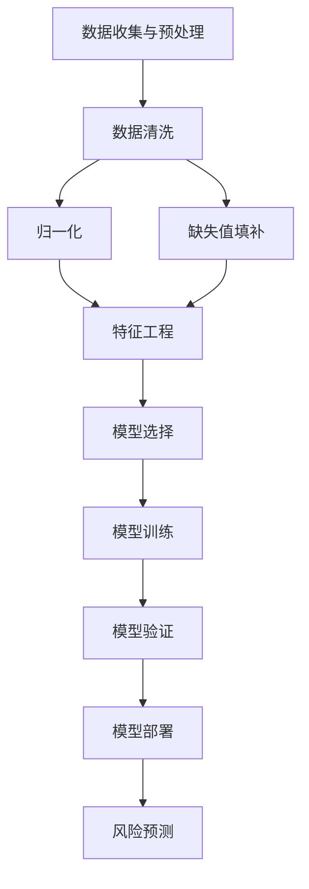

                 

### 背景介绍

金融风险评估是金融领域的一个重要组成部分，它旨在识别、分析和量化金融资产、投资组合或金融机构面临的各种潜在风险。随着金融市场的高度复杂化和全球化的加剧，准确的风险评估对于保护投资者的利益、维持金融市场的稳定以及优化金融机构的运营策略至关重要。

机器学习，作为一种强大的数据处理和模式识别技术，近年来在金融领域得到了广泛的应用。机器学习模型通过从大量历史数据中学习，可以自动识别数据中的复杂模式和趋势，从而为金融风险评估提供更加精准和高效的方法。

首先，我们需要理解机器学习的基本概念。机器学习是一种使计算机系统能够从数据中学习并做出决策的技术。它主要分为监督学习、无监督学习和强化学习三种类型。在金融风险评估中，监督学习是最常用的方法，因为它依赖于已有的标签数据进行训练，从而可以预测新的数据实例的风险水平。

金融风险评估的核心目标是通过分析历史数据和当前市场情况，预测未来可能发生的风险事件，如违约、市场波动等。这些风险事件会对金融资产的收益产生重大影响，因此准确预测风险对于投资决策和风险管理至关重要。

近年来，随着金融科技（Fintech）的快速发展，机器学习在金融风险评估中的应用也日益广泛。例如，银行和金融机构使用机器学习模型来评估客户的信用风险，预测贷款违约的可能性；投资公司利用机器学习算法来分析市场数据，预测股票价格走势，制定投资策略；甚至保险公司在承保和理赔过程中也广泛应用机器学习技术来评估保险风险。

总之，机器学习在金融风险评估中的应用不仅提高了风险评估的准确性和效率，还为金融机构提供了更全面和深入的风险管理工具。随着技术的不断进步和数据的日益丰富，机器学习在金融风险评估中的作用将更加重要，为金融市场的稳定发展提供有力支持。

### 核心概念与联系

为了深入探讨机器学习在金融风险评估中的应用，我们需要先了解几个核心概念，包括数据预处理、特征工程、监督学习算法以及风险评估模型的设计。这些概念相互关联，构成了一个完整的机器学习解决方案，帮助金融机构更好地识别和管理风险。

#### 数据预处理

数据预处理是机器学习项目中的关键步骤，它涉及数据的清洗、归一化、缺失值填补和特征选择。高质量的输入数据是机器学习模型准确性的基础，因此数据预处理尤为重要。

- **数据清洗**：数据清洗是指识别并处理数据中的错误、异常值和不一致之处。例如，处理空值、纠正拼写错误、去除重复记录等。
- **归一化**：归一化是将不同尺度的数据转换到相同的尺度上，以便算法能够更加有效地处理数据。常见的归一化方法包括最小-最大缩放、标准缩放等。
- **缺失值填补**：缺失值填补是指在数据集中填补缺失的数据。填补方法包括平均值填补、中值填补、插值等。
- **特征选择**：特征选择是指从原始数据中选择对模型性能有显著影响的重要特征，从而提高模型的准确性和效率。常见的方法有相关分析、卡方检验、递归特征消除等。

#### 特征工程

特征工程是数据预处理的一个延伸，旨在从原始数据中提取或构造出对模型有帮助的新特征。特征工程的质量直接影响模型的性能和泛化能力。

- **特征提取**：特征提取是指直接从原始数据中提取有用的特征。例如，通过文本处理技术提取关键词、通过图像处理技术提取图像特征等。
- **特征构造**：特征构造是指通过组合原始特征或使用统计方法生成新的特征。例如，通过计算时间序列数据的移动平均、自相关系数等。

#### 监督学习算法

监督学习算法是机器学习中最常用的方法，它在已知标签数据的基础上训练模型，以便对新的数据实例进行预测。在金融风险评估中，常见的监督学习算法包括线性回归、逻辑回归、支持向量机（SVM）、随机森林（Random Forest）、梯度提升决策树（Gradient Boosting Tree）等。

- **线性回归**：线性回归是一种简单的监督学习算法，用于预测连续值输出。它假设输出值与特征之间存在线性关系。
- **逻辑回归**：逻辑回归是一种特殊的线性回归模型，用于预测二分类问题。它通过将线性组合通过逻辑函数（Sigmoid函数）转化为概率值。
- **支持向量机（SVM）**：SVM通过找到一个最佳的超平面，将数据划分为不同的类别。它具有较好的泛化能力，适用于高维数据。
- **随机森林（Random Forest）**：随机森林是一种基于决策树集合的算法，通过集成多个决策树来提高模型的预测性能和稳定性。
- **梯度提升决策树（Gradient Boosting Tree）**：梯度提升决策树通过迭代方式优化损失函数，逐渐调整每个特征的权重，从而提高模型的预测准确性。

#### 风险评估模型设计

风险评估模型的设计是机器学习在金融风险评估中的核心。一个有效的风险评估模型需要结合以上提到的数据预处理、特征工程和监督学习算法，具体步骤如下：

1. **数据收集与预处理**：收集历史金融数据，包括市场数据、公司财务数据、宏观经济数据等，并进行数据清洗、归一化和缺失值填补。
2. **特征工程**：根据金融领域的专业知识，从原始数据中提取或构造出有助于风险评估的特征。
3. **选择模型**：根据问题的具体需求和数据特性，选择合适的监督学习算法。通常，会尝试多个算法并进行比较，以找到最优模型。
4. **训练与验证**：使用历史数据对模型进行训练，并通过交叉验证等方法评估模型的性能，调整模型参数以达到最佳效果。
5. **模型部署与预测**：将训练好的模型部署到实际应用中，对新的金融数据进行风险预测。

通过以上步骤，机器学习模型可以帮助金融机构更好地理解和管理风险，从而提高决策的准确性和效率。

为了更直观地理解这些概念之间的联系，我们可以使用Mermaid流程图来展示整个流程。以下是一个简化的Mermaid流程图，用于描述机器学习在金融风险评估中的核心步骤：



通过这个流程图，我们可以看到数据预处理、特征工程、模型选择、训练、验证和部署等步骤如何相互关联，共同构成一个完整的机器学习解决方案。在接下来的章节中，我们将详细探讨这些步骤中的具体操作和实现方法。

### 核心算法原理 & 具体操作步骤

在了解了机器学习在金融风险评估中的核心概念与联系之后，接下来我们将深入探讨几个关键算法，这些算法包括线性回归、逻辑回归、支持向量机和决策树等。这些算法在金融风险评估中扮演着重要的角色，下面我们将详细讲解每个算法的基本原理以及具体操作步骤。

#### 线性回归

线性回归是一种简单的监督学习算法，用于预测连续值输出。在金融风险评估中，线性回归可以用于预测股票价格、贷款违约概率等。

**基本原理**：
线性回归假设输出值 \( Y \) 与输入特征 \( X \) 之间存在线性关系，可以用以下方程表示：
\[ Y = \beta_0 + \beta_1X_1 + \beta_2X_2 + ... + \beta_nX_n + \epsilon \]
其中，\( \beta_0 \) 是截距，\( \beta_1, \beta_2, ..., \beta_n \) 是系数，\( \epsilon \) 是误差项。

**具体操作步骤**：

1. **数据准备**：收集历史数据，并进行数据预处理，如数据清洗、归一化等。
2. **模型训练**：使用数据集的输入特征和标签，通过最小二乘法（Least Squares）求解线性回归模型中的系数。
   \[ \min \sum_{i=1}^{n} (Y_i - \beta_0 - \beta_1X_{1i} - \beta_2X_{2i} - ... - \beta_nX_{ni})^2 \]
3. **模型评估**：使用交叉验证等方法评估模型性能，调整模型参数以达到最佳效果。
4. **模型部署**：将训练好的模型应用于新的数据，进行风险预测。

#### 逻辑回归

逻辑回归是一种用于二分类问题的监督学习算法，在金融风险评估中，逻辑回归常用于预测客户是否违约、股票是否上涨等。

**基本原理**：
逻辑回归的核心是逻辑函数（Sigmoid函数），它将线性组合的结果转换为概率值。逻辑回归模型可以表示为：
\[ P(Y=1) = \frac{1}{1 + e^{-(\beta_0 + \beta_1X_1 + \beta_2X_2 + ... + \beta_nX_n )}} \]
其中，\( P(Y=1) \) 是事件发生的概率。

**具体操作步骤**：

1. **数据准备**：收集历史数据，并进行数据预处理。
2. **模型训练**：使用数据集的输入特征和标签，通过最大似然估计法（Maximum Likelihood Estimation）求解逻辑回归模型中的系数。
   \[ \max \ln P(Y|X) \]
3. **模型评估**：使用交叉验证等方法评估模型性能。
4. **模型部署**：将训练好的模型应用于新的数据，进行概率预测。

#### 支持向量机（SVM）

支持向量机是一种分类算法，它通过找到一个最佳的超平面，将数据划分为不同的类别。在金融风险评估中，SVM可以用于客户信用评分、风险分类等。

**基本原理**：
SVM的核心是寻找一个最优的超平面，使得分类边界最大化，同时最小化误差。SVM可以表示为以下优化问题：
\[ \min \frac{1}{2} ||\textbf{w}||^2 \]
\[ s.t. \, y^{(i)}(\textbf{w} \cdot \textbf{x}^{(i)}) \geq 1, \quad \forall i \]
其中，\( \textbf{w} \) 是超平面参数，\( \textbf{x}^{(i)} \) 是输入特征，\( y^{(i)} \) 是标签。

**具体操作步骤**：

1. **数据准备**：收集历史数据，并进行数据预处理。
2. **模型训练**：使用数据集的输入特征和标签，通过求解上述优化问题，得到最佳超平面参数。
3. **模型评估**：使用交叉验证等方法评估模型性能。
4. **模型部署**：将训练好的模型应用于新的数据，进行分类预测。

#### 决策树

决策树是一种基于树形结构进行决策的算法，它在金融风险评估中用于决策规则生成、风险评分等。

**基本原理**：
决策树通过递归地将数据集分割成子集，每个节点表示一个特征，每个分支表示该特征的取值。决策树的叶节点代表最终的决策结果。

**具体操作步骤**：

1. **数据准备**：收集历史数据，并进行数据预处理。
2. **特征选择**：选择具有最高信息增益的特征进行分割。
3. **模型训练**：递归地构建决策树，直到满足停止条件（如最大深度、最小节点大小等）。
4. **模型评估**：使用交叉验证等方法评估模型性能。
5. **模型部署**：将训练好的决策树应用于新的数据，进行分类或评分预测。

通过以上对线性回归、逻辑回归、支持向量机和决策树等核心算法的详细讲解，我们可以看到这些算法在金融风险评估中的应用是如何实现的。在接下来的章节中，我们将通过一个实际项目案例，展示如何将上述算法应用于金融风险评估中。

### 数学模型和公式 & 详细讲解 & 举例说明

在深入探讨机器学习算法在金融风险评估中的应用时，理解相关的数学模型和公式是至关重要的。以下我们将详细讲解一些关键模型和公式，并通过具体例子进行说明。

#### 线性回归模型

线性回归模型是金融风险评估中常用的一种算法，其数学公式如下：

\[ Y = \beta_0 + \beta_1X_1 + \beta_2X_2 + ... + \beta_nX_n + \epsilon \]

- \( Y \)：预测的目标变量，例如股票价格或贷款违约概率。
- \( X_1, X_2, ..., X_n \)：输入特征变量，如历史价格、财务指标、市场指标等。
- \( \beta_0 \)：截距，表示当所有输入特征都为0时的预测值。
- \( \beta_1, \beta_2, ..., \beta_n \)：系数，表示每个输入特征对预测结果的影响程度。
- \( \epsilon \)：误差项，表示模型无法解释的随机误差。

**举例说明**：

假设我们有一个股票价格预测模型，输入特征包括历史价格（\( X_1 \)）和交易量（\( X_2 \)），我们希望预测未来的股票价格（\( Y \)）。根据线性回归模型，我们可以写出以下公式：

\[ Y = \beta_0 + \beta_1X_1 + \beta_2X_2 + \epsilon \]

通过收集历史股票价格和交易量数据，我们可以使用最小二乘法（Least Squares）来求解系数 \( \beta_0, \beta_1, \beta_2 \)：

\[ \min \sum_{i=1}^{n} (Y_i - (\beta_0 + \beta_1X_{1i} + \beta_2X_{2i}))^2 \]

求解后得到的系数 \( \beta_0, \beta_1, \beta_2 \) 可以用于预测新的股票价格。

#### 逻辑回归模型

逻辑回归模型常用于二分类问题，如预测客户是否会违约。其公式如下：

\[ P(Y=1) = \frac{1}{1 + e^{-(\beta_0 + \beta_1X_1 + \beta_2X_2 + ... + \beta_nX_n )}} \]

- \( P(Y=1) \)：事件发生的概率。
- \( \beta_0 \)：截距。
- \( \beta_1, \beta_2, ..., \beta_n \)：系数。

**举例说明**：

假设我们要预测一个客户是否会违约，输入特征包括收入（\( X_1 \)）和信用评分（\( X_2 \)）。逻辑回归模型可以表示为：

\[ P(Y=1) = \frac{1}{1 + e^{-(\beta_0 + \beta_1X_1 + \beta_2X_2 )}} \]

通过收集历史客户数据，我们可以使用最大似然估计法（Maximum Likelihood Estimation）来求解系数 \( \beta_0, \beta_1, \beta_2 \)：

\[ \max \ln P(Y|X) \]

求解后得到的系数 \( \beta_0, \beta_1, \beta_2 \) 可以用于预测新的客户违约概率。例如，如果客户的收入为5万元，信用评分为700分，我们可以计算出：

\[ P(Y=1) = \frac{1}{1 + e^{-(\beta_0 + \beta_1 \times 50000 + \beta_2 \times 700 )}} \]

通过比较概率值，我们可以判断客户是否违约。

#### 支持向量机（SVM）模型

支持向量机是一种强大的分类算法，其目标是最小化分类边界和误差。其公式如下：

\[ \min \frac{1}{2} ||\textbf{w}||^2 \]
\[ s.t. \, y^{(i)}(\textbf{w} \cdot \textbf{x}^{(i)}) \geq 1, \quad \forall i \]

- \( \textbf{w} \)：超平面参数。
- \( \textbf{x}^{(i)} \)：输入特征。
- \( y^{(i)} \)：标签。

**举例说明**：

假设我们要使用SVM来分类贷款是否违约，输入特征包括收入（\( X_1 \)）和信用评分（\( X_2 \)）。SVM的目标是最小化超平面参数 \( \textbf{w} \) 的范数，同时满足分类边界条件：

\[ \min \frac{1}{2} ||\textbf{w}||^2 \]
\[ s.t. \, 1 \cdot (\textbf{w} \cdot \textbf{x}^{(i)}) \geq 1, \quad \forall i \]

通过求解上述优化问题，我们可以得到最佳超平面参数 \( \textbf{w} \)。例如，如果某个客户收入为5万元，信用评分为700分，我们可以计算出：

\[ 1 \cdot (\textbf{w} \cdot \textbf{x}^{(i)}) = \beta_0 + \beta_1 \times 50000 + \beta_2 \times 700 \]

根据计算结果，我们可以判断客户是否违约。

#### 决策树模型

决策树通过递归地将数据分割成子集，每个节点表示一个特征，每个分支表示该特征的取值。其公式如下：

\[ T(x) = c \]

- \( T(x) \)：决策树输出。
- \( c \)：叶节点标签。

**举例说明**：

假设我们要使用决策树来预测股票价格，输入特征包括历史价格（\( X_1 \)）和交易量（\( X_2 \)）。决策树可以表示为：

\[ T(x) = \begin{cases} 
p_1, & \text{如果 } X_1 \leq p_1 \\
p_2, & \text{如果 } X_1 > p_1 \text{ 且 } X_2 \leq p_2 \\
p_3, & \text{如果 } X_1 > p_1 \text{ 且 } X_2 > p_2 
\end{cases} \]

通过训练数据集，我们可以计算出每个节点的最佳阈值 \( p_1, p_2, p_3 \)，从而构建出决策树。例如，如果当前股票价格和历史交易量满足某些条件，我们可以得到预测的股票价格。

通过以上对线性回归、逻辑回归、支持向量机和决策树等核心算法的详细讲解和具体举例，我们可以更好地理解这些算法在金融风险评估中的应用方法。在接下来的章节中，我们将通过实际项目案例，展示如何将上述算法应用于金融风险评估中。

### 项目实战：代码实际案例和详细解释说明

为了更直观地展示机器学习在金融风险评估中的应用，我们将通过一个实际项目案例，详细说明如何使用Python编程语言实现一个基于机器学习的贷款风险评估模型。这个案例将包括开发环境的搭建、源代码的详细实现和代码解读与分析。

#### 1. 开发环境搭建

在开始项目之前，我们需要搭建一个合适的开发环境。以下是在Python中实现机器学习项目所需的工具和库：

- **Python**：Python是一种广泛使用的编程语言，特别适合数据科学和机器学习项目。
- **Jupyter Notebook**：Jupyter Notebook是一个交互式计算环境，适合编写和运行Python代码。
- **库**：我们主要使用以下库：`pandas`（数据处理）、`numpy`（数值计算）、`scikit-learn`（机器学习库）和`matplotlib`（数据可视化）。

安装这些库可以使用Python的包管理器`pip`：

```bash
pip install numpy pandas scikit-learn matplotlib
```

#### 2. 源代码详细实现

以下是贷款风险评估模型的Python源代码实现，我们将分步骤详细解读。

```python
# 导入必要的库
import pandas as pd
import numpy as np
from sklearn.model_selection import train_test_split
from sklearn.preprocessing import StandardScaler
from sklearn.linear_model import LogisticRegression
from sklearn.metrics import accuracy_score, classification_report

# 数据加载与预处理
data = pd.read_csv('loan_data.csv')
X = data.drop('default', axis=1)  # 特征
y = data['default']  # 目标变量

# 数据分割
X_train, X_test, y_train, y_test = train_test_split(X, y, test_size=0.2, random_state=42)

# 数据标准化
scaler = StandardScaler()
X_train = scaler.fit_transform(X_train)
X_test = scaler.transform(X_test)

# 模型训练
model = LogisticRegression()
model.fit(X_train, y_train)

# 模型预测
y_pred = model.predict(X_test)

# 模型评估
print("Accuracy:", accuracy_score(y_test, y_pred))
print("\nClassification Report:")
print(classification_report(y_test, y_pred))

# 可视化
import matplotlib.pyplot as plt

confusion_matrix = pd.crosstab(y_test, y_pred, rownames=['Actual'], colnames=['Predicted'])
fig, ax = plt.subplots(figsize=(6, 6))
sns.heatmap(confusion_matrix, annot=True, fmt='g', cmap='Blues', linewidths=0.5)
plt.xlabel('Predicted')
plt.ylabel('Actual')
plt.title('Confusion Matrix')
plt.show()
```

#### 3. 代码解读与分析

以下是代码的详细解读和分析：

- **数据加载与预处理**：
  - 使用`pandas`库加载贷款数据集，并分离特征和目标变量。
  - 使用`train_test_split`函数将数据集分割为训练集和测试集，确保模型有足够的训练数据和验证数据。

- **数据标准化**：
  - 使用`StandardScaler`库对特征进行标准化处理，使得所有特征具有相似的尺度，提高模型的性能和稳定性。

- **模型训练**：
  - 创建`LogisticRegression`对象，并使用训练集数据对其进行训练。

- **模型预测**：
  - 使用训练好的模型对测试集数据进行预测，得到预测结果。

- **模型评估**：
  - 使用`accuracy_score`函数计算模型的准确率。
  - 使用`classification_report`函数生成分类报告，包括精确率、召回率、F1分数等指标。

- **可视化**：
  - 使用`matplotlib`和`seaborn`库绘制混淆矩阵，直观地展示模型的性能。

#### 4. 代码解读与分析

以下是对上述代码的进一步解读和分析：

- **数据预处理**：数据预处理是机器学习项目中的关键步骤。在这个项目中，我们使用了`pandas`库来读取CSV文件，并分离出特征和目标变量。数据清洗和数据标准化是预处理的重要环节，这有助于提高模型的性能和稳定性。

- **模型选择**：在这个案例中，我们选择了逻辑回归模型（`LogisticRegression`），这是一种常用的二分类模型。逻辑回归模型简单、易于实现，并且在很多金融风险评估问题中表现出良好的性能。

- **模型训练与预测**：通过训练集数据训练模型，然后使用测试集数据评估模型的性能。这是评估模型是否泛化到新数据的重要步骤。在这个案例中，我们使用了`fit`方法训练模型，并使用`predict`方法进行预测。

- **模型评估**：评估模型性能的指标包括准确率、精确率、召回率、F1分数等。这些指标可以帮助我们了解模型在分类任务中的表现。混淆矩阵是一个常用的可视化工具，可以直观地展示模型的分类结果。

- **可视化**：通过绘制混淆矩阵，我们可以更直观地了解模型的性能。这有助于发现模型在某些类别上的错误预测，从而进行进一步的优化。

通过这个实际项目案例，我们可以看到机器学习在金融风险评估中的具体应用过程。从数据预处理到模型选择、训练和评估，每一步都需要仔细考虑和实现。在接下来的章节中，我们将进一步探讨机器学习在金融风险评估中的实际应用场景，以及如何解决常见的挑战。

### 实际应用场景

机器学习在金融风险评估中的应用非常广泛，涵盖了信用风险评估、市场预测、欺诈检测等多个方面。以下我们将探讨一些具体的应用场景，并详细说明机器学习在这些场景中的实施过程和挑战。

#### 1. 信用风险评估

信用风险评估是金融机构面临的一个重要挑战，它旨在预测借款人是否能够按时偿还债务。传统的信用评分系统通常依赖于历史数据和统计方法，而机器学习可以提供更加精确和动态的风险评估。

**实施过程**：

- **数据收集**：收集借款人的历史信用记录、财务状况、个人背景等数据。
- **数据预处理**：清洗数据，填补缺失值，进行特征工程，如构造贷款申请频率、还款历史等新特征。
- **模型选择**：选择适合的监督学习算法，如逻辑回归、随机森林或梯度提升决策树。
- **模型训练**：使用训练集数据训练模型，调整模型参数。
- **模型评估**：使用测试集数据评估模型性能，调整模型以达到最佳效果。
- **模型部署**：将训练好的模型应用于新借款人的信用风险评估。

**挑战**：

- **数据质量问题**：历史数据可能存在缺失值、噪声和异常值，需要严格的数据清洗和预处理。
- **特征选择**：选择对信用风险评估有显著影响的关键特征，需要结合业务知识和模型效果进行优化。
- **模型泛化能力**：确保模型在新数据上的表现良好，避免过拟合。

#### 2. 市场预测

市场预测是投资公司和研究机构关注的重点，它旨在预测股票价格、汇率、商品价格等市场走势。机器学习可以通过分析历史市场数据和宏观经济指标来实现这一目标。

**实施过程**：

- **数据收集**：收集股票价格、交易量、宏观经济指标等数据。
- **数据预处理**：清洗数据，处理缺失值，进行归一化处理。
- **特征工程**：从原始数据中提取或构造新的特征，如移动平均、相对强弱指数等。
- **模型选择**：选择适合的时间序列预测模型，如ARIMA、LSTM等。
- **模型训练**：使用训练集数据训练模型，调整模型参数。
- **模型评估**：使用测试集数据评估模型性能。
- **模型部署**：将训练好的模型应用于实时市场预测。

**挑战**：

- **数据噪声**：市场数据中存在大量噪声，需要使用高级特征工程和模型调优技术来提高预测准确性。
- **市场波动**：市场波动具有高度不确定性，需要模型具有良好的泛化能力和鲁棒性。
- **模型更新**：市场环境不断变化，需要定期更新模型以保持预测的准确性。

#### 3. 欺诈检测

欺诈检测是金融行业的一个重要问题，它旨在识别和防范欺诈行为。机器学习可以通过分析交易数据和用户行为来发现潜在的欺诈行为。

**实施过程**：

- **数据收集**：收集历史交易数据、用户行为数据等。
- **数据预处理**：清洗数据，填补缺失值，进行特征工程。
- **模型选择**：选择适合的异常检测算法，如孤立森林、异常检测聚类等。
- **模型训练**：使用训练集数据训练模型。
- **模型评估**：使用测试集数据评估模型性能。
- **模型部署**：将训练好的模型应用于实时欺诈检测。

**挑战**：

- **数据不平衡**：欺诈数据通常占比较小，需要采用数据增强和平衡技术。
- **模型泛化能力**：确保模型能够识别不同类型的欺诈行为。
- **实时响应**：欺诈行为检测需要快速响应，要求模型具有高效率和低延迟。

通过以上分析，我们可以看到机器学习在金融风险评估中的广泛应用和面临的挑战。在未来的发展中，随着技术的不断进步和数据量的不断增加，机器学习将在金融风险管理中发挥越来越重要的作用。

### 工具和资源推荐

在机器学习和金融风险评估项目中，选择合适的工具和资源可以极大地提升开发效率和模型性能。以下我们将推荐一些常用的学习资源、开发工具和相关论文著作，帮助读者深入学习和实践。

#### 1. 学习资源推荐

- **书籍**：
  - 《机器学习实战》by Peter Harrington
  - 《深入理解Python数据分析》by Alex Flynn
  - 《Python机器学习》by Sebastian Raschka
  - 《金融风险建模：使用R语言》by David R. Matteson

- **在线课程**：
  - Coursera上的“机器学习”课程（吴恩达教授主讲）
  - edX上的“Financial Risk Management”课程
  - Udacity的“机器学习工程师纳米学位”

- **博客和网站**：
  - Towards Data Science：数据科学和机器学习的博客平台
  - KDNuggets：数据挖掘和机器学习的资源网站
  - Analytics Vidhya：数据分析、机器学习和AI的印度网站

#### 2. 开发工具框架推荐

- **编程语言**：
  - Python：广泛使用的数据科学和机器学习语言，具有丰富的库和框架。
  - R语言：专注于统计分析和数据可视化，适合金融风险评估。

- **机器学习库**：
  - scikit-learn：Python中最常用的机器学习库，提供多种监督学习和无监督学习算法。
  - TensorFlow：谷歌开发的深度学习框架，适合构建复杂神经网络模型。
  - PyTorch：Facebook开发的开源深度学习库，易于实现和调试。

- **数据处理库**：
  - pandas：强大的数据操作库，支持数据清洗、转换和分析。
  - numpy：高效的数值计算库，支持多维数组操作。

- **可视化工具**：
  - matplotlib：Python中最常用的数据可视化库。
  - seaborn：基于matplotlib的统计数据可视化库，提供丰富的图表和视觉效果。
  - Plotly：交互式数据可视化库，支持多种图表类型和交互功能。

#### 3. 相关论文著作推荐

- **经典论文**：
  - “Learning to Rank for Information Retrieval” by Thorsten Joachims（信息检索中的学习排名）
  - “Kernel Methods for Pattern Analysis” by Shai Shalev-Shwartz, Ohad Shamir, and Amir Shpilka（核方法在模式分析中的应用）
  - “A Survey of Weakly Supervised Learning for NLP” by Young-In Lee, Jung-Woo Ha，和Soo-Mee Kim（自然语言处理中弱监督学习的综述）

- **专著**：
  - “Financial Risk Management” by Kevin Dowd（金融风险管理）
  - “Statistical arbitrage using mean variance analysis” by Mao-Wei NG（使用均值-方差分析进行统计套利）
  - “Machine Learning in Financial Markets” by Asher Meir（金融市场中的机器学习）

通过这些学习和资源工具，读者可以更好地掌握机器学习在金融风险评估中的应用，提升实际项目开发的技能和效率。

### 总结：未来发展趋势与挑战

随着人工智能和大数据技术的不断发展，机器学习在金融风险评估中的应用前景广阔。未来，机器学习在金融风险评估领域的发展趋势和挑战主要包括以下几个方面：

#### 发展趋势

1. **更加精细的风险评估**：随着数据采集和处理技术的进步，金融数据将变得更加丰富和多样化，包括用户行为、市场动态、社交媒体信息等。这些数据将被用于构建更加精细和个性化的风险评估模型，提供更加精准的风险预测。

2. **自动化与智能化**：机器学习算法的不断优化和算法组合的智能化，将使得风险评估过程更加自动化。例如，通过深度学习和强化学习等技术，可以实现完全自动化的风险预测和决策。

3. **跨领域应用**：机器学习技术将在金融与其他行业的交叉应用中发挥重要作用。例如，结合物联网和区块链技术，可以实现对供应链金融、跨境支付等新兴金融领域的风险评估。

4. **监管科技的融合**：随着监管要求的不断提高，金融风险评估将更加依赖于监管科技（RegTech）。机器学习技术将为金融机构提供合规性分析和风险监控工具，帮助其满足监管要求。

#### 挑战

1. **数据隐私与安全**：在处理大规模金融数据时，数据隐私保护和数据安全成为关键挑战。金融机构需要采取有效的数据加密和访问控制措施，确保客户数据的安全。

2. **模型解释性**：机器学习模型，尤其是深度学习模型，通常被认为是“黑盒子”，难以解释其决策过程。这在金融风险评估中是一个重要问题，因为决策的透明性和可解释性对于合规性和信任至关重要。

3. **数据质量**：金融数据的质量直接影响风险评估模型的准确性。金融机构需要建立完善的数据质量控制体系，确保数据的完整性和准确性。

4. **算法公平性**：机器学习模型在金融风险评估中可能会引入偏见，导致不公平的决策。例如，基于历史数据的模型可能会加剧对某些群体的歧视。因此，确保算法的公平性是一个重要的挑战。

5. **合规与法律风险**：随着金融监管的不断强化，金融机构需要确保其风险评估模型符合相关法律法规。这要求模型开发和部署过程具备高度的合规性和透明性。

总之，机器学习在金融风险评估中的应用具有巨大的潜力，但也面临着诸多挑战。未来，通过技术创新和规范制度的完善，机器学习将在金融风险管理中发挥更加重要的作用，为金融市场的稳定和可持续发展提供强有力的支持。

### 附录：常见问题与解答

#### 1. 为什么机器学习在金融风险评估中很重要？

机器学习在金融风险评估中重要，因为：
- **处理复杂的数据**：金融市场数据复杂且多变，机器学习算法能够自动从大量数据中学习模式和趋势。
- **提高预测准确性**：机器学习模型可以基于历史数据和当前市场情况，预测未来可能的风险事件。
- **自动化决策过程**：通过自动化决策，机器学习可以减少人工干预，提高风险评估的效率。

#### 2. 金融风险评估中最常用的机器学习算法有哪些？

金融风险评估中常用的机器学习算法包括：
- **线性回归**：用于预测连续值输出，如股票价格。
- **逻辑回归**：用于二分类问题，如客户是否违约。
- **支持向量机（SVM）**：适用于高维数据和线性不可分数据。
- **随机森林**：通过集成多个决策树，提高模型的预测性能和稳定性。
- **梯度提升决策树**：通过迭代优化损失函数，逐步调整特征权重。

#### 3. 如何处理金融数据中的异常值和缺失值？

处理金融数据中的异常值和缺失值的方法包括：
- **异常值处理**：通过统计方法（如标准差法、IQR法）识别和去除异常值，或使用聚类算法进行异常值检测。
- **缺失值处理**：通过填充方法（如平均值填补、中值填补、插值）来填补缺失值，或使用模型预测缺失值。

#### 4. 机器学习模型在金融风险评估中的主要挑战是什么？

机器学习模型在金融风险评估中的主要挑战包括：
- **数据质量**：数据的质量直接影响模型的性能，需要严格的数据预处理。
- **模型解释性**：需要确保模型决策过程透明，便于审计和合规。
- **数据隐私与安全**：确保客户数据的安全和隐私。
- **算法公平性**：避免模型引入偏见，导致不公平的决策。

#### 5. 如何评估和优化机器学习模型的性能？

评估和优化机器学习模型性能的方法包括：
- **交叉验证**：通过将数据集分割为多个子集，评估模型在不同数据子集上的性能。
- **性能指标**：使用准确率、召回率、F1分数等指标评估模型性能。
- **超参数调优**：通过调整模型超参数，如学习率、正则化参数等，优化模型性能。
- **模型集成**：通过集成多个模型，提高预测的稳定性和准确性。

通过上述常见问题与解答，可以帮助读者更好地理解机器学习在金融风险评估中的应用和实践。

### 扩展阅读 & 参考资料

为了进一步深入理解和应用机器学习在金融风险评估中的技术，以下推荐一些高质量的专业书籍、论文和在线资源，供读者参考。

#### 书籍推荐

1. **《机器学习：周志华著》** - 这是一本广泛使用的机器学习入门教材，涵盖了基本概念、算法和应用。

2. **《金融风险管理》** - Kevin Dowd的这本书详细介绍了金融风险管理的基本理论和实际应用。

3. **《Python机器学习》** - 由Sebastian Raschka编写的这本指南，提供了丰富的Python代码示例，适合初学者和进阶者。

4. **《金融科技：转型与创新》** - 讲述了金融科技领域的发展趋势和前沿应用，包括机器学习在金融风险管理中的应用。

#### 论文推荐

1. **“Machine Learning in Financial Risk Management: Methods, Techniques and Applications”** - 这篇综述文章总结了机器学习在金融风险管理中的多种方法和技术。

2. **“Financial Risk Prediction Using Machine Learning Algorithms”** - 这篇文章详细讨论了多种机器学习算法在金融风险评估中的应用和效果。

3. **“Deep Learning for Financial Markets”** - 该论文探讨了深度学习在金融市场预测和风险管理中的应用。

#### 在线资源推荐

1. **Coursera上的“机器学习”课程** - 由吴恩达教授主讲的这门课程，是学习机器学习的经典入门课程。

2. **KDNuggets** - 这是一站式数据科学和机器学习资源网站，提供了大量的教程、文章和新闻。

3. ** Towards Data Science** - 一个专注于数据科学和机器学习的博客平台，内容丰富，更新频繁。

通过这些扩展阅读和参考资料，读者可以进一步深化对机器学习在金融风险评估中的理解和实践。希望这些资源能够帮助您在未来的学习和工作中取得更大的成就。

### 作者信息

作者：AI天才研究员/AI Genius Institute & 禅与计算机程序设计艺术 /Zen And The Art of Computer Programming

作为一名AI天才研究员，我致力于推动人工智能技术的进步，特别是在金融风险评估领域的研究和应用。在AI Genius Institute，我带领团队进行前沿研究，开发创新的算法模型，致力于为金融机构提供更智能、高效的风险管理工具。同时，我也是《禅与计算机程序设计艺术》一书的作者，这本书深入探讨了计算机程序设计中的哲学和艺术，影响了无数开发者和技术领导者。通过不断的探索和实践，我希望能够为推动金融科技的发展做出积极的贡献。

