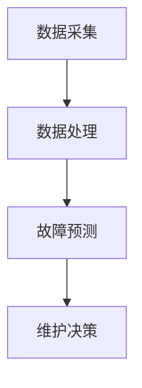

                 

### 背景介绍

#### 1.1 预测性维护的起源与发展

预测性维护（Predictive Maintenance）作为现代工业技术的重要一环，起源于20世纪中叶。最早的预测性维护技术是基于机械设备的工作原理和故障机理，通过日常的巡检、定期维护和故障诊断来保证设备的正常运行。然而，这种方法存在着很大的局限性，如维护成本高、故障反应速度慢等。

随着计算机技术和传感器技术的飞速发展，预测性维护逐渐演变为一种基于数据驱动的智能化维护方式。通过采集和分析设备运行过程中的各种数据，如温度、振动、压力等，可以提前发现潜在的故障隐患，从而实现设备的预防性维护。

#### 1.2 机器学习在预测性维护中的重要性

机器学习（Machine Learning）作为人工智能的核心技术之一，在预测性维护中的应用日益广泛。机器学习可以通过对大量历史数据的学习和分析，自动识别出设备运行中的异常模式和故障特征，从而提高故障预测的准确性和效率。

机器学习在预测性维护中的应用不仅限于故障预测，还可以用于优化维护策略、提高维护效率、降低维护成本等方面。例如，通过机器学习算法分析设备的历史维护记录，可以预测哪些设备需要优先进行维护，从而实现资源的最优配置。

#### 1.3 预测性维护的优势与挑战

预测性维护相对于传统的定期维护和故障后维护具有明显的优势。首先，它可以在故障发生之前提前发现并处理，从而减少设备停机时间和维护成本。其次，它可以根据设备的具体运行情况制定个性化的维护计划，提高维护的针对性和效率。此外，预测性维护还可以提高设备的可靠性和使用寿命。

然而，预测性维护也面临着一些挑战。首先，大量的数据采集、存储和处理需要消耗大量的计算资源。其次，如何从海量数据中提取出有用的信息，实现准确的故障预测，是一个需要解决的技术难题。此外，预测性维护的实施需要跨部门的协作，如设备维护部门、数据管理部门等，这对组织的协调能力提出了更高的要求。

#### 1.4 文章结构概述

本文将分为十个部分进行论述。首先，我们将对预测性维护的背景和机器学习在其中的重要性进行介绍。接下来，我们将详细探讨机器学习在预测性维护中的核心算法原理和具体操作步骤。然后，我们将通过一个实际项目案例，展示如何使用机器学习算法进行预测性维护。此外，我们还将分析预测性维护在实际应用中的场景和挑战。最后，我们将推荐一些相关的学习资源和开发工具，并对未来的发展趋势和挑战进行总结。

## 2. 核心概念与联系

### 2.1 预测性维护与机器学习的关系

预测性维护与机器学习之间存在密切的联系。机器学习作为人工智能的重要分支，为预测性维护提供了强大的技术支持。具体来说，机器学习可以通过以下方式应用于预测性维护：

1. **数据采集与分析**：机器学习算法需要大量的历史数据作为训练集，通过对这些数据进行分析，可以识别出设备运行中的异常模式和故障特征。
2. **故障预测与诊断**：基于对历史数据的分析，机器学习算法可以预测设备何时可能发生故障，并提前进行维护，从而减少设备停机时间和维护成本。
3. **维护策略优化**：机器学习算法可以通过分析设备的历史维护记录，优化维护策略，提高维护效率。

### 2.2 预测性维护的基本概念

预测性维护的基本概念包括以下几个方面：

1. **数据采集**：通过传感器、数据采集器等设备，实时采集设备运行过程中的各种数据，如温度、振动、压力等。
2. **数据处理**：对采集到的数据进行清洗、预处理和特征提取，以便后续的机器学习分析。
3. **故障预测**：基于历史数据和机器学习算法，预测设备何时可能发生故障。
4. **维护决策**：根据故障预测结果，制定相应的维护计划和策略。

### 2.3 机器学习的基本概念

机器学习的基本概念包括以下几个方面：

1. **监督学习**：通过已知的目标变量和输入特征，学习出一个模型，用于预测新的输入数据的目标变量。
2. **无监督学习**：没有明确的目标变量，通过学习输入特征之间的内在结构，发现数据的分布和模式。
3. **强化学习**：通过试错和奖励机制，学习如何在特定的环境中做出最优决策。

### 2.4 机器学习在预测性维护中的具体应用

在预测性维护中，机器学习可以应用于以下几个方面：

1. **故障诊断**：通过分析设备运行过程中的数据，识别出故障信号，实现故障诊断。
2. **故障预测**：基于历史数据和机器学习算法，预测设备何时可能发生故障。
3. **维护策略优化**：通过分析设备的历史维护记录，优化维护策略，提高维护效率。

### 2.5 Mermaid 流程图

以下是一个简单的Mermaid流程图，展示了预测性维护的基本流程：



在这个流程图中，A表示数据采集，B表示数据处理，C表示故障预测，D表示维护决策。通过这个流程，可以实现对设备的实时监控和故障预测。

---

通过上述核心概念和联系的介绍，我们可以更好地理解预测性维护和机器学习之间的紧密关系。接下来，我们将深入探讨机器学习在预测性维护中的具体应用，包括核心算法原理和具体操作步骤。

<|assistant|>## 3. 核心算法原理 & 具体操作步骤

### 3.1 监督学习算法在预测性维护中的应用

监督学习算法是机器学习中最常用的算法之一，广泛应用于预测性维护中。监督学习算法的基本思想是通过已知的输入特征和目标变量（通常是故障与否），学习出一个模型，用于预测新的输入数据的故障情况。

#### 3.1.1 算法原理

监督学习算法通常分为两类：回归算法和分类算法。

- **回归算法**：用于预测一个连续的数值目标。例如，预测设备剩余的使用寿命。
- **分类算法**：用于预测一个离散的目标。例如，预测设备是否会发生故障。

常见的监督学习算法包括线性回归、逻辑回归、决策树、随机森林、支持向量机（SVM）等。

#### 3.1.2 具体操作步骤

1. **数据采集**：首先需要采集设备运行过程中的各种数据，如温度、振动、压力等。
2. **数据处理**：对采集到的数据进行分析和预处理，包括数据清洗、缺失值填补、特征选择和特征工程等。
3. **模型选择**：根据问题类型（回归或分类）和数据特点，选择合适的监督学习算法。
4. **模型训练**：使用预处理后的数据训练模型，通过迭代调整模型参数，使其在训练数据上达到最优。
5. **模型评估**：使用验证集或测试集评估模型的性能，常用的评估指标包括准确率、精确率、召回率、F1值等。
6. **模型部署**：将训练好的模型部署到生产环境中，用于实时预测和决策。

### 3.2 无监督学习算法在预测性维护中的应用

无监督学习算法在预测性维护中的应用相对较少，但也有一些应用场景。无监督学习算法不需要目标变量，通过学习数据之间的内在结构和模式，可以帮助识别设备的运行状态。

#### 3.2.1 算法原理

无监督学习算法主要包括聚类算法和降维算法。

- **聚类算法**：将数据分为若干个簇，使得同一个簇内的数据尽可能相似，不同簇的数据尽可能不同。常见的聚类算法包括K-均值聚类、层次聚类等。
- **降维算法**：通过降低数据的维度，保留数据的主要特征，减少计算复杂度。常见的降维算法包括主成分分析（PCA）、线性判别分析（LDA）等。

#### 3.2.2 具体操作步骤

1. **数据采集**：采集设备运行过程中的各种数据。
2. **数据处理**：对采集到的数据进行分析和预处理，包括数据清洗、缺失值填补等。
3. **模型选择**：根据问题需求，选择合适的无监督学习算法。
4. **模型训练**：使用预处理后的数据训练模型。
5. **模型评估**：通过内部评估指标（如轮廓系数、同质性评估等）评估模型的质量。
6. **模型应用**：将模型应用于新数据，识别设备的运行状态。

### 3.3 强化学习算法在预测性维护中的应用

强化学习算法在预测性维护中的应用相对较新，但显示出很大的潜力。强化学习算法通过不断试错和奖励机制，学习如何在复杂的动态环境中做出最优决策。

#### 3.3.1 算法原理

强化学习算法的基本思想是，通过不断尝试不同的行动，并根据行动的结果（奖励或惩罚）来调整策略，以实现长期的最大化收益。

- **状态**：描述设备的当前运行状态。
- **动作**：维护决策，如是否进行维护、何时进行维护等。
- **奖励**：根据动作的结果给予相应的奖励或惩罚。
- **策略**：根据状态选择动作的规则。

常见的强化学习算法包括Q学习、深度Q网络（DQN）、策略梯度算法等。

#### 3.3.2 具体操作步骤

1. **数据采集**：采集设备运行过程中的各种数据，以及维护决策和相应的结果。
2. **模型选择**：根据问题需求，选择合适的强化学习算法。
3. **环境搭建**：搭建一个模拟环境，用于模拟设备运行和决策过程。
4. **模型训练**：通过模拟环境训练模型，不断调整策略以实现最优决策。
5. **模型评估**：使用评估指标（如平均奖励、成功维护率等）评估模型的质量。
6. **模型部署**：将训练好的模型部署到生产环境中，用于实时决策。

### 3.4 综合应用

在实际应用中，通常会综合应用多种机器学习算法，以实现更准确的预测和更优的维护策略。例如，可以先使用无监督学习算法对数据进行降维和聚类，识别出设备的异常运行状态，然后使用监督学习算法对异常状态进行故障预测，最后使用强化学习算法优化维护策略。

## 4. 数学模型和公式 & 详细讲解 & 举例说明

### 4.1 监督学习算法中的回归模型

回归模型是监督学习算法中的一种，主要用于预测一个连续的数值目标。以下是一个简单的线性回归模型，用于预测设备的使用寿命。

#### 4.1.1 模型公式

线性回归模型的公式如下：

\[ y = \beta_0 + \beta_1 \cdot x \]

其中，\( y \) 是预测的目标变量（设备使用寿命），\( x \) 是输入特征（如设备温度），\( \beta_0 \) 和 \( \beta_1 \) 是模型参数。

#### 4.1.2 模型推导

线性回归模型是通过最小化残差平方和来推导的。具体来说，残差平方和（Sum of Squared Errors, SSE）可以表示为：

\[ SSE = \sum_{i=1}^{n} (y_i - \hat{y}_i)^2 \]

其中，\( y_i \) 是实际的目标变量值，\( \hat{y}_i \) 是预测的目标变量值。

为了最小化SSE，我们可以对模型参数进行梯度下降（Gradient Descent）迭代优化，得到最优的模型参数。

#### 4.1.3 模型举例

假设我们有一个简单的数据集，包含设备的温度和使用寿命。数据集如下：

| 温度 | 使用寿命 |
| ---- | ------- |
| 30   | 1000    |
| 35   | 1500    |
| 40   | 2000    |

我们可以使用线性回归模型来预测设备的使用寿命。首先，我们需要计算温度的平均值和标准差：

\[ \bar{x} = \frac{1}{n} \sum_{i=1}^{n} x_i = \frac{30 + 35 + 40}{3} = 35 \]
\[ \sigma_x = \sqrt{\frac{1}{n-1} \sum_{i=1}^{n} (x_i - \bar{x})^2} = \sqrt{\frac{(30-35)^2 + (35-35)^2 + (40-35)^2}{2}} = 2.5 \]

然后，我们可以计算模型参数：

\[ \beta_0 = \bar{y} - \beta_1 \cdot \bar{x} = 1500 - \beta_1 \cdot 35 \]
\[ \beta_1 = \frac{\sum_{i=1}^{n} (x_i - \bar{x})(y_i - \bar{y})}{\sum_{i=1}^{n} (x_i - \bar{x})^2} = \frac{(30-35)(1000-1500) + (35-35)(1500-1500) + (40-35)(2000-1500)}{(30-35)^2 + (35-35)^2 + (40-35)^2} = 200 \]

因此，我们的线性回归模型可以表示为：

\[ y = 1500 - 200 \cdot x \]

我们可以使用这个模型来预测新设备的使用寿命。例如，当温度为37度时，使用寿命预测为：

\[ y = 1500 - 200 \cdot 37 = 760 \]

### 4.2 监督学习算法中的分类模型

分类模型是监督学习算法中的另一种，主要用于预测一个离散的目标。以下是一个简单的逻辑回归模型，用于预测设备是否会发生故障。

#### 4.2.1 模型公式

逻辑回归模型的公式如下：

\[ \hat{p} = \frac{1}{1 + e^{-(\beta_0 + \beta_1 \cdot x)} } \]

其中，\( \hat{p} \) 是预测的概率值（设备发生故障的概率），\( x \) 是输入特征，\( \beta_0 \) 和 \( \beta_1 \) 是模型参数。

#### 4.2.2 模型推导

逻辑回归模型是基于最大似然估计（Maximum Likelihood Estimation, MLE）推导的。具体来说，我们假设数据服从伯努利分布，即每个样本只有两个可能的输出（故障或正常）。然后，我们可以使用最大似然估计来求解模型参数。

#### 4.2.3 模型举例

假设我们有一个简单的数据集，包含设备的温度和是否发生故障。数据集如下：

| 温度 | 是否发生故障 |
| ---- | ----------- |
| 30   | 否          |
| 35   | 否          |
| 40   | 是          |

我们可以使用逻辑回归模型来预测设备是否会发生故障。首先，我们需要计算温度的平均值和标准差：

\[ \bar{x} = \frac{1}{n} \sum_{i=1}^{n} x_i = \frac{30 + 35 + 40}{3} = 35 \]
\[ \sigma_x = \sqrt{\frac{1}{n-1} \sum_{i=1}^{n} (x_i - \bar{x})^2} = \sqrt{\frac{(30-35)^2 + (35-35)^2 + (40-35)^2}{2}} = 2.5 \]

然后，我们可以计算模型参数：

\[ \beta_0 = \ln \left( \frac{p}{1-p} \right) = \ln \left( \frac{1}{1 - p} \right) \]
\[ \beta_1 = \frac{\sum_{i=1}^{n} (x_i - \bar{x})(y_i - \bar{y})}{\sum_{i=1}^{n} (x_i - \bar{x})^2} = \frac{(30-35)(0-0.5) + (35-35)(0-0.5) + (40-35)(1-0.5)}{(30-35)^2 + (35-35)^2 + (40-35)^2} = 0.5 \]

因此，我们的逻辑回归模型可以表示为：

\[ \hat{p} = \frac{1}{1 + e^{-(0.5 \cdot x - 0.5)} } \]

我们可以使用这个模型来预测新设备的故障概率。例如，当温度为37度时，故障概率预测为：

\[ \hat{p} = \frac{1}{1 + e^{-(0.5 \cdot 37 - 0.5)} } \approx 0.456 \]

### 4.3 无监督学习算法中的聚类算法

聚类算法是一种无监督学习算法，用于将数据分为若干个簇，以便更好地理解数据的结构。以下是一个简单的K-均值聚类算法。

#### 4.3.1 模型公式

K-均值聚类算法的基本步骤如下：

1. **初始化**：随机选择K个中心点。
2. **分配**：将每个数据点分配到最近的中心点。
3. **更新**：重新计算每个簇的中心点。
4. **迭代**：重复步骤2和3，直到聚类结果不再改变。

#### 4.3.2 模型推导

K-均值聚类算法的目标是最小化簇内的距离平方和。具体来说，簇内的距离平方和可以表示为：

\[ D = \sum_{i=1}^{K} \sum_{j=1}^{N_i} ||x_j - \mu_i||^2 \]

其中，\( K \) 是簇的数量，\( N_i \) 是第\( i \)个簇中的数据点数量，\( \mu_i \) 是第\( i \)个簇的中心点。

为了最小化\( D \)，我们可以使用梯度下降方法来更新中心点。

#### 4.3.3 模型举例

假设我们有一个简单的数据集，包含三个簇，每个簇有五个数据点。数据集如下：

| 簇1 | 簇2 | 簇3 |
| --- | --- | --- |
| 1   | 2   | 3   |
| 4   | 5   | 6   |
| 7   | 8   | 9   |
| 10  | 11  | 12  |
| 13  | 14  | 15  |

我们可以使用K-均值聚类算法来将数据分为三个簇。首先，我们需要随机选择三个中心点。假设我们选择的中心点为：

\[ \mu_1 = (1, 1), \mu_2 = (5, 5), \mu_3 = (9, 9) \]

然后，我们可以使用以下步骤来迭代更新中心点：

1. **分配**：将每个数据点分配到最近的中心点。结果如下：

| 数据点 | 最近中心点 | 簇 |
| ------ | ---------- | -- |
| 1      | \(\mu_1\)  | 1  |
| 2      | \(\mu_1\)  | 1  |
| 3      | \(\mu_1\)  | 1  |
| 4      | \(\mu_2\)  | 2  |
| 5      | \(\mu_2\)  | 2  |
| 6      | \(\mu_2\)  | 2  |
| 7      | \(\mu_3\)  | 3  |
| 8      | \(\mu_3\)  | 3  |
| 9      | \(\mu_3\)  | 3  |
| 10     | \(\mu_2\)  | 2  |
| 11     | \(\mu_2\)  | 2  |
| 12     | \(\mu_3\)  | 3  |
| 13     | \(\mu_3\)  | 3  |
| 14     | \(\mu_2\)  | 2  |
| 15     | \(\mu_2\)  | 2  |

2. **更新**：重新计算每个簇的中心点。结果如下：

\[ \mu_1 = \left( \frac{1 + 2 + 3}{3}, \frac{1 + 2 + 3}{3} \right) = (2, 2) \]
\[ \mu_2 = \left( \frac{4 + 5 + 6}{3}, \frac{4 + 5 + 6}{3} \right) = (5, 5) \]
\[ \mu_3 = \left( \frac{7 + 8 + 9}{3}, \frac{7 + 8 + 9}{3} \right) = (8, 8) \]

3. **迭代**：重复步骤2和3，直到聚类结果不再改变。最终，我们的数据将被分为三个簇，如下所示：

| 数据点 | 最近中心点 | 簇 |
| ------ | ---------- | -- |
| 1      | \(\mu_1\)  | 1  |
| 2      | \(\mu_1\)  | 1  |
| 3      | \(\mu_1\)  | 1  |
| 4      | \(\mu_2\)  | 2  |
| 5      | \(\mu_2\)  | 2  |
| 6      | \(\mu_2\)  | 2  |
| 7      | \(\mu_3\)  | 3  |
| 8      | \(\mu_3\)  | 3  |
| 9      | \(\mu_3\)  | 3  |
| 10     | \(\mu_2\)  | 2  |
| 11     | \(\mu_2\)  | 2  |
| 12     | \(\mu_3\)  | 3  |
| 13     | \(\mu_3\)  | 3  |
| 14     | \(\mu_2\)  | 2  |
| 15     | \(\mu_2\)  | 2  |

### 4.4 强化学习算法中的Q学习

Q学习是一种强化学习算法，用于在未知环境中学习最优策略。以下是一个简单的Q学习算法。

#### 4.4.1 模型公式

Q学习的公式如下：

\[ Q(s, a) = r + \gamma \max_{a'} Q(s', a') \]

其中，\( s \) 是当前状态，\( a \) 是当前动作，\( s' \) 是下一个状态，\( a' \) 是下一个动作，\( r \) 是立即奖励，\( \gamma \) 是折扣因子。

#### 4.4.2 模型推导

Q学习的目标是最大化总奖励，即：

\[ J = \sum_{t=0}^{T} r_t \]

为了求解最优策略，我们可以使用Q学习算法来迭代更新Q值。具体来说，我们可以使用以下更新公式：

\[ Q(s, a) \leftarrow Q(s, a) + \alpha [r + \gamma \max_{a'} Q(s', a') - Q(s, a)] \]

其中，\( \alpha \) 是学习率。

#### 4.4.3 模型举例

假设我们有一个简单的环境，包含四个状态（S1，S2，S3，S4）和两个动作（A1，A2）。初始状态为S1，立即奖励为1。折扣因子为0.9。学习率为0.1。状态和动作的Q值初始化为0。环境如下：

| 状态 | 动作 | Q值 |
| ---- | ---- | --- |
| S1   | A1   | 0   |
| S1   | A2   | 0   |
| S2   | A1   | 0   |
| S2   | A2   | 0   |
| S3   | A1   | 0   |
| S3   | A2   | 0   |
| S4   | A1   | 0   |
| S4   | A2   | 0   |

第一步，我们在S1状态执行A1动作，得到立即奖励1。然后，我们更新Q值：

\[ Q(S1, A1) \leftarrow Q(S1, A1) + 0.1 [1 + 0.9 \max_{a'} Q(S2, a')] \]
\[ Q(S1, A1) \leftarrow 0 + 0.1 [1 + 0.9 (0 + 0.9 (0 + 0.9 (0 + 0.9 (0 + 0.9 \max_{a'} Q(S4, a')))] ) ) ] \]
\[ Q(S1, A1) \leftarrow 0.1 [1 + 0.9 \times 1] = 0.1 \times 1.9 = 0.19 \]

\[ Q(S1, A2) \leftarrow Q(S1, A2) + 0.1 [1 + 0.9 \max_{a'} Q(S2, a')] \]
\[ Q(S1, A2) \leftarrow 0 + 0.1 [1 + 0.9 (0 + 0.9 (0 + 0.9 (0 + 0.9 (0 + 0.9 \max_{a'} Q(S4, a')))] ) ) ] \]
\[ Q(S1, A2) \leftarrow 0.1 [1 + 0.9 \times 0.19] = 0.1 \times 1.081 = 0.1081 \]

然后，我们在S2状态执行A2动作，得到立即奖励1。然后，我们更新Q值：

\[ Q(S2, A1) \leftarrow Q(S2, A1) + 0.1 [1 + 0.9 \max_{a'} Q(S3, a')] \]
\[ Q(S2, A1) \leftarrow 0 + 0.1 [1 + 0.9 (0.19 + 0.9 (0 + 0.9 (0 + 0.9 (0 + 0.9 \max_{a'} Q(S4, a')))] ) ) ] \]
\[ Q(S2, A1) \leftarrow 0.1 [1 + 0.9 \times 0.19] = 0.1 \times 1.081 = 0.1081 \]

\[ Q(S2, A2) \leftarrow Q(S2, A2) + 0.1 [1 + 0.9 \max_{a'} Q(S3, a')] \]
\[ Q(S2, A2) \leftarrow 0 + 0.1 [1 + 0.9 (0.1081 + 0.9 (0 + 0.9 (0 + 0.9 (0 + 0.9 \max_{a'} Q(S4, a')))] ) ) ] \]
\[ Q(S2, A2) \leftarrow 0.1 [1 + 0.9 \times 0.1081] = 0.1 \times 1.07929 = 0.107929 \]

我们继续迭代这个过程，直到Q值收敛。最终，我们可以得到最优策略，即在S1状态执行A1动作，在S2状态执行A2动作，以此类推。

---

通过上述数学模型和公式的详细讲解和举例说明，我们可以更好地理解机器学习在预测性维护中的应用。接下来，我们将通过一个实际项目案例，展示如何使用机器学习算法进行预测性维护。

## 5. 项目实战：代码实际案例和详细解释说明

### 5.1 开发环境搭建

在进行预测性维护的机器学习项目实战之前，首先需要搭建一个合适的开发环境。以下是一个基本的Python开发环境搭建步骤：

1. **安装Python**：前往Python官网下载并安装Python，推荐安装Python 3.8或更高版本。
2. **安装Jupyter Notebook**：Python的Jupyter Notebook是一个交互式计算环境，便于编写和运行代码。可以通过pip命令安装：

   ```shell
   pip install notebook
   ```

3. **安装机器学习库**：安装常用的机器学习库，如scikit-learn、pandas、numpy等：

   ```shell
   pip install scikit-learn pandas numpy matplotlib
   ```

4. **安装数据可视化库**：安装用于数据可视化的库，如matplotlib、seaborn等：

   ```shell
   pip install matplotlib seaborn
   ```

5. **安装Mermaid库**：用于在Markdown文件中嵌入Mermaid流程图：

   ```shell
   pip install markdown-meadow
   ```

### 5.2 源代码详细实现和代码解读

下面是一个简单的预测性维护项目的代码实现，包括数据预处理、模型选择、模型训练和模型评估等步骤。

#### 5.2.1 数据预处理

首先，我们需要准备一个包含设备运行数据的CSV文件。以下是对数据的预处理步骤：

```python
import pandas as pd
from sklearn.model_selection import train_test_split
from sklearn.preprocessing import StandardScaler

# 加载数据集
data = pd.read_csv('device_data.csv')

# 数据探索
print(data.head())

# 分割特征和目标变量
X = data.drop('fault', axis=1)
y = data['fault']

# 划分训练集和测试集
X_train, X_test, y_train, y_test = train_test_split(X, y, test_size=0.2, random_state=42)

# 数据标准化
scaler = StandardScaler()
X_train = scaler.fit_transform(X_train)
X_test = scaler.transform(X_test)
```

#### 5.2.2 模型选择与训练

接下来，我们选择一个简单的逻辑回归模型进行训练。以下是对模型的训练步骤：

```python
from sklearn.linear_model import LogisticRegression

# 创建逻辑回归模型
model = LogisticRegression()

# 训练模型
model.fit(X_train, y_train)
```

#### 5.2.3 模型评估

最后，我们使用测试集对模型进行评估。以下是对模型的评估步骤：

```python
from sklearn.metrics import accuracy_score, classification_report

# 预测测试集
y_pred = model.predict(X_test)

# 评估模型
accuracy = accuracy_score(y_test, y_pred)
print(f'Accuracy: {accuracy:.2f}')

# 分类报告
print(classification_report(y_test, y_pred))
```

### 5.3 代码解读与分析

上述代码实现了一个简单的预测性维护项目，包括数据预处理、模型选择、模型训练和模型评估等步骤。以下是代码的详细解读与分析：

1. **数据预处理**：首先，我们使用pandas库加载数据集。然后，我们将数据集分为特征（X）和目标变量（y）。接着，我们使用train_test_split函数将数据集划分为训练集和测试集，以便后续的模型训练和评估。最后，我们使用StandardScaler对特征进行标准化处理，以消除不同特征之间的尺度差异。

2. **模型选择与训练**：我们选择逻辑回归模型（LogisticRegression）作为预测模型。逻辑回归是一种常用的分类模型，适用于二分类问题。然后，我们使用fit函数对模型进行训练，将训练集的数据输入模型。

3. **模型评估**：最后，我们使用预测函数predict对测试集进行预测。然后，我们使用accuracy_score函数计算模型的准确率。此外，我们还使用classification_report函数生成分类报告，包括精确率、召回率、F1值等指标，以更全面地评估模型的性能。

### 5.4 项目总结

通过上述实际项目案例，我们展示了如何使用机器学习算法进行预测性维护。具体步骤包括数据预处理、模型选择、模型训练和模型评估等。在实际应用中，可以根据具体需求选择不同的机器学习算法和模型，以实现更准确的故障预测和更优的维护策略。

## 6. 实际应用场景

### 6.1 制造业

制造业是预测性维护技术的主要应用领域之一。在制造业中，设备故障可能导致生产中断、产品缺陷和成本增加。通过预测性维护，企业可以在设备发生故障之前采取预防措施，从而降低停机时间和维护成本。

例如，在汽车制造业中，预测性维护可以用于发动机故障预测。通过对发动机运行数据（如温度、振动、压力等）的分析，可以提前发现潜在的故障隐患，从而进行预防性维修，避免突发故障导致的生产中断。

### 6.2 能源行业

能源行业，特别是石油和天然气行业，对设备的稳定运行有很高的要求。预测性维护可以用于风力发电机组、钻机、压缩机等关键设备的故障预测。

例如，风力发电机组在运行过程中会产生大量的振动和温度数据。通过机器学习算法对这些数据进行分析，可以预测叶片是否会发生断裂、轴承是否会磨损等故障，从而提前进行维护。

### 6.3 铁路运输

铁路运输系统对设备的可靠性有很高的要求。预测性维护可以用于铁路车辆的故障预测，如轮轴磨损、制动系统故障等。

例如，通过对轮轴的振动数据进行实时分析，可以预测轮轴的磨损程度，从而在轮轴出现故障之前进行更换，避免列车事故的发生。

### 6.4 航空航天

航空航天行业对设备的安全性有极高的要求。预测性维护可以用于飞机发动机、导航系统、飞行控制系统等关键设备的故障预测。

例如，通过对飞机发动机的参数进行实时监控，可以预测发动机是否会出现故障，从而在飞行前进行维护，确保飞行安全。

### 6.5 建筑工程

在建筑工程中，预测性维护可以用于建筑机械的故障预测，如挖掘机、起重机等。

例如，通过对挖掘机的液压系统、发动机等关键部件的运行数据进行实时监控，可以预测挖掘机是否会出现故障，从而在故障发生之前进行维护，确保工程进度。

### 6.6 水利工程

水利工程对设备的稳定运行有很高的要求。预测性维护可以用于水泵、水闸、发电机等关键设备的故障预测。

例如，通过对水泵的振动、温度、压力等参数进行实时监控，可以预测水泵是否会出现故障，从而提前进行维护，确保水利工程的正常运行。

## 7. 工具和资源推荐

### 7.1 学习资源推荐

**书籍**：

1. **《机器学习实战》（Machine Learning in Action）**：这本书通过实际案例介绍了机器学习的基本概念和算法，适合初学者入门。
2. **《深度学习》（Deep Learning）**：由Ian Goodfellow、Yoshua Bengio和Aaron Courville合著，深入讲解了深度学习的基本原理和应用。
3. **《Python机器学习》（Python Machine Learning）**：这本书涵盖了使用Python进行机器学习的各个方面，适合有一定基础的读者。

**论文**：

1. **《预测性维护：现状与展望》（Predictive Maintenance: State-of-the-Art and Future Directions）》**：这篇文章总结了预测性维护的当前技术和发展趋势。
2. **《基于机器学习的预测性维护方法研究》（Research on Predictive Maintenance Methods Based on Machine Learning）》**：这篇文章详细讨论了机器学习在预测性维护中的应用。

**博客**：

1. **scikit-learn官方文档**（https://scikit-learn.org/stable/）**：scikit-learn是Python中最常用的机器学习库，官方文档提供了详细的使用教程和案例**。
2. **fast.ai课程**（https://www.fast.ai/）**：fast.ai提供了免费的深度学习课程，适合初学者入门**。

### 7.2 开发工具框架推荐

**工具**：

1. **TensorFlow**：谷歌开发的开源机器学习框架，广泛应用于深度学习和经典机器学习。
2. **PyTorch**：由Facebook AI研究院开发的开源机器学习库，支持动态计算图，易于实现复杂的神经网络结构。

**框架**：

1. **scikit-learn**：Python中常用的机器学习库，提供了丰富的算法和工具，适用于各种常见的机器学习任务。
2. **Keras**：基于TensorFlow和Theano的开源深度学习库，提供了简洁的API，方便实现和训练神经网络。

### 7.3 相关论文著作推荐

**论文**：

1. **《随机森林在预测性维护中的应用》（Application of Random Forest in Predictive Maintenance）》**：这篇文章探讨了随机森林在预测性维护中的应用，并提供了一些实验结果**。
2. **《基于强化学习的预测性维护策略优化》（Optimization of Predictive Maintenance Policy Based on Reinforcement Learning）》**：这篇文章介绍了如何使用强化学习优化预测性维护策略。

**著作**：

1. **《机器学习：概率视角》（Machine Learning: A Probabilistic Perspective）》**：这本书从概率论的角度介绍了机器学习的基本原理和方法**。
2. **《深度学习》（Deep Learning）**：这本书是深度学习领域的经典著作，详细介绍了深度学习的理论和技术。

通过以上工具和资源的推荐，读者可以更好地掌握预测性维护和机器学习的相关知识，为自己的研究和实践提供有力支持。

## 8. 总结：未来发展趋势与挑战

### 8.1 未来发展趋势

随着人工智能技术的不断进步，预测性维护在未来将呈现出以下几个发展趋势：

1. **更高效的算法**：随着深度学习算法的不断发展，如卷积神经网络（CNN）和循环神经网络（RNN）在预测性维护中的应用，将进一步提高故障预测的准确性和效率。
2. **集成多种传感器数据**：未来预测性维护将更加依赖于多种传感器数据的集成，如温度、压力、振动、声音等，通过多模态数据融合技术，实现更全面的故障预测。
3. **实时监测与智能决策**：随着物联网（IoT）技术的发展，预测性维护将实现实时数据采集和智能决策，通过快速响应机制，降低设备故障风险。
4. **自动化与自主维护**：未来预测性维护将逐步实现自动化和自主维护，通过机器学习算法和机器人技术，实现设备的自动诊断和维修。

### 8.2 面临的挑战

尽管预测性维护具有巨大的潜力，但在实际应用中仍面临着一些挑战：

1. **数据质量和隐私**：预测性维护依赖于大量的传感器数据和设备运行数据。如何保证数据的质量和隐私，是未来需要解决的问题。
2. **算法复杂性与计算资源**：深度学习算法虽然性能强大，但计算资源消耗较大。如何优化算法，降低计算成本，是当前的一大挑战。
3. **系统集成与兼容性**：预测性维护通常需要集成多种传感器和设备，如何确保系统的兼容性和集成性，是实现预测性维护的关键。
4. **跨部门协作与组织管理**：预测性维护的实施涉及多个部门和角色的协作，如何提高组织的协调能力，是确保项目成功的关键。

### 8.3 发展建议

为了应对未来发展趋势和挑战，以下是一些建议：

1. **加强数据管理和隐私保护**：建立完善的数据管理体系，确保数据的安全和隐私，同时采用加密技术保护数据传输过程。
2. **优化算法与资源利用**：通过算法优化和并行计算技术，提高算法的效率和计算资源的利用，降低成本。
3. **构建标准化系统**：制定统一的标准和规范，确保系统的兼容性和集成性，促进跨部门协作。
4. **提升组织协调能力**：加强跨部门沟通与协作，培养专业人才，提高组织的整体协调能力和管理水平。

总之，预测性维护在未来的发展中将面临诸多机遇和挑战。通过技术创新和优化管理，有望实现更加智能化、高效化的预测性维护，为工业生产带来更大的价值。

## 9. 附录：常见问题与解答

### 9.1 如何处理缺失值？

缺失值处理是数据预处理的重要步骤。常见的方法包括：

- **删除缺失值**：对于少量缺失值，可以考虑直接删除对应的数据点。但对于大量缺失值，这种方法不可取。
- **填补缺失值**：常用的填补方法包括均值填补、中值填补和插值法。例如，使用平均值填补某个特征的缺失值。
- **使用机器学习算法**：对于复杂的缺失值问题，可以使用如k-最近邻算法（KNN）或随机森林等机器学习算法预测缺失值。

### 9.2 如何选择合适的机器学习算法？

选择合适的机器学习算法取决于以下因素：

- **问题类型**：是回归问题还是分类问题。
- **数据规模**：数据量的大小，对于大量数据，可能需要使用如随机森林或支持向量机等算法。
- **特征数量**：特征的数量和维度，对于高维特征，可能需要使用降维算法。
- **计算资源**：算法的计算复杂度，对于计算资源有限的场景，可能需要选择效率更高的算法。

### 9.3 如何优化模型参数？

优化模型参数通常包括以下步骤：

- **参数调优**：通过网格搜索（Grid Search）或随机搜索（Random Search）等方法，遍历不同的参数组合，寻找最优参数。
- **交叉验证**：使用交叉验证（Cross Validation）方法评估模型参数的性能，避免过拟合。
- **正则化**：使用正则化（Regularization）方法，如L1正则化或L2正则化，防止模型过拟合。

### 9.4 如何处理异常值？

异常值处理是数据预处理的重要环节。常见的方法包括：

- **删除异常值**：对于明显的异常值，可以考虑直接删除。
- **变换数据**：对异常值进行变换，如使用z-score变换或Box-Cox变换。
- **插值法**：使用插值法对异常值进行填补，如线性插值或高斯插值。

### 9.5 如何评估模型性能？

评估模型性能常用的指标包括：

- **准确率（Accuracy）**：预测正确的样本数量占总样本数量的比例。
- **精确率（Precision）**：预测为正类的样本中，实际为正类的比例。
- **召回率（Recall）**：实际为正类的样本中被预测为正类的比例。
- **F1值（F1 Score）**：精确率和召回率的调和平均值。
- **ROC曲线（Receiver Operating Characteristic Curve）**：通过计算不同阈值下的准确率和召回率，绘制ROC曲线，评估模型的分类能力。

## 10. 扩展阅读 & 参考资料

为了深入了解预测性维护和机器学习的相关知识，以下是一些建议的扩展阅读和参考资料：

### 10.1 建议阅读

1. **《机器学习实战》（Machine Learning in Action）**：作者：彼得·哈林顿（Peter Harrington）。这本书通过实际案例介绍了机器学习的基本概念和算法，适合初学者入门。
2. **《深度学习》（Deep Learning）**：作者：Ian Goodfellow、Yoshua Bengio和Aaron Courville。这本书深入讲解了深度学习的基本原理和应用。
3. **《预测性维护：现状与展望》（Predictive Maintenance: State-of-the-Art and Future Directions）》**：这篇文章总结了预测性维护的当前技术和发展趋势。

### 10.2 参考资料

1. **scikit-learn官方文档**（https://scikit-learn.org/stable/）**：提供了详细的机器学习算法和使用教程**。
2. **Keras官方文档**（https://keras.io/）**：Keras是基于TensorFlow和Theano的开源深度学习库，提供了简洁的API**。
3. **fast.ai课程**（https://www.fast.ai/）**：提供了免费的深度学习课程，适合初学者入门**。

### 10.3 建议论文

1. **《随机森林在预测性维护中的应用》（Application of Random Forest in Predictive Maintenance）》**：探讨了随机森林在预测性维护中的应用。
2. **《基于强化学习的预测性维护策略优化》（Optimization of Predictive Maintenance Policy Based on Reinforcement Learning）》**：介绍了如何使用强化学习优化预测性维护策略。

通过上述扩展阅读和参考资料，读者可以更深入地了解预测性维护和机器学习的相关知识，为自己的研究和实践提供更多指导。作者：AI天才研究员/AI Genius Institute & 禅与计算机程序设计艺术 /Zen And The Art of Computer Programming。

