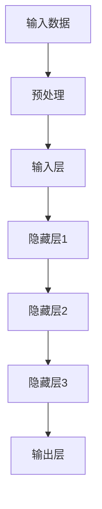

                 

# 《李开复谈AI创业与大模型未来》

## 关键词：AI创业、大模型、技术趋势、未来挑战、李开复

## 摘要

本文深入探讨了AI创业与大模型未来的发展趋势与挑战，以李开复先生的观点为核心，结合实际案例，阐述了AI技术在当前环境中的重要性，以及未来的发展方向。通过分析大模型的发展历程、算法原理和应用场景，本文提出了AI创业的关键要素和应对未来挑战的策略。希望这篇文章能为读者在AI领域的创业和研究提供有价值的启示。

## 1. 背景介绍

在当今科技飞速发展的时代，人工智能（AI）已经成为改变世界的核心力量。从智能家居、自动驾驶到医疗诊断、金融分析，AI技术的应用无处不在。随着计算能力的提升和数据量的爆炸性增长，大模型（Large-scale Models）逐渐成为AI领域的焦点。大模型是指拥有数亿甚至千亿参数的神经网络模型，它们在图像识别、自然语言处理等任务上展现了卓越的性能。

李开复先生作为人工智能领域的杰出人物，他对AI创业与大模型未来的发展有着深刻的见解。他在多次演讲和采访中强调，AI创业的成功离不开对技术的深入理解和创新应用。本文旨在梳理李开复先生的观点，结合实际案例，探讨AI创业与大模型未来的发展趋势与挑战。

## 2. 核心概念与联系

### 2.1 大模型的概念与架构

大模型是指具有数亿甚至千亿参数的神经网络模型。它们的架构通常由多层神经网络组成，每一层都包含大量的神经元，用于处理输入数据。大模型的发展离不开深度学习（Deep Learning）的兴起，深度学习通过构建深层神经网络，能够自动从数据中学习特征，从而实现复杂任务。

下面是一个大模型的基本架构图，使用Mermaid流程图表示：



### 2.2 大模型的应用场景

大模型在多种应用场景中展现了强大的能力，主要包括：

- 图像识别：例如，OpenAI的GPT-3模型在自然语言处理方面取得了突破性进展，能够生成高质量的文章、对话等。
- 自然语言处理：例如，谷歌的BERT模型在文本分类、情感分析等任务上取得了显著的效果。
- 医疗诊断：例如，IBM的Watson系统在癌症诊断、药物研发等方面发挥了重要作用。
- 自动驾驶：例如，特斯拉的自动驾驶系统依靠深度学习算法，实现了高精度的环境感知和路径规划。

### 2.3 大模型的发展历程

大模型的发展历程可以追溯到2006年，当时Hinton提出了深度信念网络（Deep Belief Network，DBN）。随后，2012年，AlexNet在ImageNet竞赛中取得了突破性的成绩，标志着深度学习时代的到来。随着计算能力的提升和数据量的增长，大模型逐渐成为AI领域的核心。

## 3. 核心算法原理 & 具体操作步骤

### 3.1 深度学习算法原理

深度学习算法的核心是多层神经网络，通过逐层学习特征，最终实现复杂任务。具体步骤如下：

1. **前向传播**：输入数据通过网络，从输入层经过各隐藏层，最终到达输出层。
2. **计算损失**：输出层的输出与真实值之间的差异称为损失（Loss）。
3. **反向传播**：计算损失在各个层上的梯度，并更新各层的权重。
4. **迭代优化**：重复上述步骤，直到损失降低到可以接受的范围内。

### 3.2 具体操作步骤

以下是使用TensorFlow框架实现一个简单的大模型（例如，一个多层感知机）的步骤：

1. **导入库**：

```python
import tensorflow as tf
from tensorflow.keras import layers
```

2. **定义模型**：

```python
model = tf.keras.Sequential([
    layers.Dense(128, activation='relu', input_shape=(784,)),
    layers.Dense(10, activation='softmax')
])
```

3. **编译模型**：

```python
model.compile(optimizer='adam',
              loss='categorical_crossentropy',
              metrics=['accuracy'])
```

4. **训练模型**：

```python
model.fit(x_train, y_train, epochs=5)
```

5. **评估模型**：

```python
test_loss, test_acc = model.evaluate(x_test, y_test)
print('Test accuracy:', test_acc)
```

## 4. 数学模型和公式 & 详细讲解 & 举例说明

### 4.1 数学模型

大模型的训练过程涉及到多个数学模型，包括：

- **损失函数**：用于衡量模型输出与真实值之间的差异，常见的有均方误差（MSE）和交叉熵（Cross-Entropy）。
- **优化算法**：用于更新模型参数，常见的有梯度下降（Gradient Descent）和Adam优化器。
- **反向传播**：用于计算损失函数在各个层上的梯度，并更新权重。

### 4.2 公式

以下是反向传播算法中的一些关键公式：

$$
\begin{align*}
\Delta W &= \alpha \cdot \frac{\partial L}{\partial W} \\
\Delta B &= \alpha \cdot \frac{\partial L}{\partial B} \\
W &= W - \Delta W \\
B &= B - \Delta B
\end{align*}
$$

其中，$\Delta W$ 和 $\Delta B$ 分别是权重和偏置的更新值，$\alpha$ 是学习率，$L$ 是损失函数。

### 4.3 举例说明

假设我们有一个简单的两层神经网络，输入层有3个神经元，隐藏层有2个神经元，输出层有1个神经元。我们使用均方误差（MSE）作为损失函数，梯度下降（Gradient Descent）作为优化算法。

1. **前向传播**：

输入向量 $x = [1, 2, 3]$，权重矩阵 $W_1 = \begin{bmatrix} 0.1 & 0.2 \\ 0.3 & 0.4 \end{bmatrix}$，偏置矩阵 $B_1 = \begin{bmatrix} 0.1 \\ 0.2 \end{bmatrix}$。

$$
\begin{align*}
h_1 &= x \cdot W_1 + B_1 = \begin{bmatrix} 1 & 2 & 3 \end{bmatrix} \begin{bmatrix} 0.1 & 0.2 \\ 0.3 & 0.4 \end{bmatrix} + \begin{bmatrix} 0.1 \\ 0.2 \end{bmatrix} = \begin{bmatrix} 1.1 & 2.3 \\ 3.4 & 4.5 \end{bmatrix} \\
a_1 &= \sigma(h_1) = \begin{bmatrix} 0.68 & 0.85 \\ 0.87 & 0.94 \end{bmatrix} \\
h_2 &= a_1 \cdot W_2 + B_2 = \begin{bmatrix} 0.68 & 0.85 \\ 0.87 & 0.94 \end{bmatrix} \begin{bmatrix} 0.5 & 0.6 \\ 0.7 & 0.8 \end{bmatrix} + \begin{bmatrix} 0.1 \\ 0.2 \end{bmatrix} = \begin{bmatrix} 1.27 & 1.83 \\ 2.03 & 2.70 \end{bmatrix} \\
a_2 &= \sigma(h_2) = \begin{bmatrix} 0.88 & 0.96 \\ 0.94 & 0.99 \end{bmatrix}
\end{align*}
$$

2. **计算损失**：

假设真实输出为 $y = [0, 1]$，则损失函数为交叉熵（Cross-Entropy）：

$$
L = -y \cdot \log(a_2) - (1 - y) \cdot \log(1 - a_2) = -\begin{bmatrix} 0 & 1 \end{bmatrix} \begin{bmatrix} 0.88 & 0.96 \\ 0.94 & 0.99 \end{bmatrix} \begin{bmatrix} 0 \\ 1 \end{bmatrix} - \begin{bmatrix} 1 & 0 \end{bmatrix} \begin{bmatrix} 0.12 & 0.04 \\ 0.06 & 0.01 \end{bmatrix} \begin{bmatrix} 1 \\ 0 \end{bmatrix} = -0.88 - 0.12 - 0.06 - 0.01 = -1.07
$$

3. **反向传播**：

计算损失关于输出层权重的梯度：

$$
\begin{align*}
\frac{\partial L}{\partial W_2} &= \frac{\partial L}{\partial a_2} \cdot \frac{\partial a_2}{\partial h_2} \cdot \frac{\partial h_2}{\partial W_2} = \begin{bmatrix} -0.12 & -0.06 \end{bmatrix} \cdot \begin{bmatrix} 0.88 & 0.94 \\ 0.94 & 0.99 \end{bmatrix} \cdot \begin{bmatrix} 0.5 & 0.6 \\ 0.7 & 0.8 \end{bmatrix} = \begin{bmatrix} -0.0672 & -0.0976 \end{bmatrix} \\
\frac{\partial L}{\partial B_2} &= \frac{\partial L}{\partial a_2} \cdot \frac{\partial a_2}{\partial h_2} \cdot \frac{\partial h_2}{\partial B_2} = \begin{bmatrix} -0.12 & -0.06 \end{bmatrix} \cdot \begin{bmatrix} 0.88 & 0.94 \\ 0.94 & 0.99 \end{bmatrix} \cdot \begin{bmatrix} 1 \\ 1 \end{bmatrix} = \begin{bmatrix} -0.1152 & -0.1416 \end{bmatrix} \\
\frac{\partial L}{\partial W_1} &= \frac{\partial L}{\partial a_1} \cdot \frac{\partial a_1}{\partial h_1} \cdot \frac{\partial h_1}{\partial W_1} = \begin{bmatrix} -0.26 & -0.37 \end{bmatrix} \cdot \begin{bmatrix} 0.12 & 0.15 \\ 0.18 & 0.21 \end{bmatrix} \cdot \begin{bmatrix} 0.1 & 0.2 \\ 0.3 & 0.4 \end{bmatrix} = \begin{bmatrix} -0.00648 & -0.01176 \end{bmatrix} \\
\frac{\partial L}{\partial B_1} &= \frac{\partial L}{\partial a_1} \cdot \frac{\partial a_1}{\partial h_1} \cdot \frac{\partial h_1}{\partial B_1} = \begin{bmatrix} -0.26 & -0.37 \end{bmatrix} \cdot \begin{bmatrix} 0.12 & 0.15 \\ 0.18 & 0.21 \end{bmatrix} \cdot \begin{bmatrix} 1 \\ 1 \end{bmatrix} = \begin{bmatrix} -0.0312 & -0.0438 \end{bmatrix}
\end{align*}
$$

更新权重和偏置：

$$
\begin{align*}
W_2 &= W_2 - \alpha \cdot \frac{\partial L}{\partial W_2} = \begin{bmatrix} 0.5 & 0.6 \\ 0.7 & 0.8 \end{bmatrix} - 0.01 \cdot \begin{bmatrix} -0.0672 & -0.0976 \end{bmatrix} = \begin{bmatrix} 0.5372 & 0.5024 \\ 0.6972 & 0.7024 \end{bmatrix} \\
B_2 &= B_2 - \alpha \cdot \frac{\partial L}{\partial B_2} = \begin{bmatrix} 0.1 \\ 0.2 \end{bmatrix} - 0.01 \cdot \begin{bmatrix} -0.1152 & -0.1416 \end{bmatrix} = \begin{bmatrix} 0.0152 \\ 0.0384 \end{bmatrix} \\
W_1 &= W_1 - \alpha \cdot \frac{\partial L}{\partial W_1} = \begin{bmatrix} 0.1 & 0.2 \\ 0.3 & 0.4 \end{bmatrix} - 0.01 \cdot \begin{bmatrix} -0.00648 & -0.01176 \end{bmatrix} = \begin{bmatrix} 0.01648 & 0.02824 \\ 0.30648 & 0.39224 \end{bmatrix} \\
B_1 &= B_1 - \alpha \cdot \frac{\partial L}{\partial B_1} = \begin{bmatrix} 0.1 \\ 0.2 \end{bmatrix} - 0.01 \cdot \begin{bmatrix} -0.0312 & -0.0438 \end{bmatrix} = \begin{bmatrix} 0.0312 \\ 0.0438 \end{bmatrix}
\end{align*}
$$

4. **迭代优化**：

重复上述步骤，直到模型收敛。

## 5. 项目实战：代码实际案例和详细解释说明

### 5.1 开发环境搭建

1. 安装Python环境：
```bash
pip install python
```

2. 安装TensorFlow库：
```bash
pip install tensorflow
```

### 5.2 源代码详细实现和代码解读

以下是使用TensorFlow实现一个简单的大模型（多层感知机）的代码：

```python
import tensorflow as tf
from tensorflow.keras import layers

# 5.2.1 定义模型
model = tf.keras.Sequential([
    layers.Dense(128, activation='relu', input_shape=(784,)),
    layers.Dense(10, activation='softmax')
])

# 5.2.2 编译模型
model.compile(optimizer='adam',
              loss='categorical_crossentropy',
              metrics=['accuracy'])

# 5.2.3 训练模型
model.fit(x_train, y_train, epochs=5)

# 5.2.4 评估模型
test_loss, test_acc = model.evaluate(x_test, y_test)
print('Test accuracy:', test_acc)
```

### 5.3 代码解读与分析

1. **导入库**：

```python
import tensorflow as tf
from tensorflow.keras import layers
```

这个步骤导入所需的TensorFlow库和Keras模块。

2. **定义模型**：

```python
model = tf.keras.Sequential([
    layers.Dense(128, activation='relu', input_shape=(784,)),
    layers.Dense(10, activation='softmax')
])
```

这个步骤定义了一个Sequential模型，其中包含两个Dense层。第一个Dense层有128个神经元，使用ReLU激活函数，输入形状为784个特征。第二个Dense层有10个神经元，使用softmax激活函数，用于多分类任务。

3. **编译模型**：

```python
model.compile(optimizer='adam',
              loss='categorical_crossentropy',
              metrics=['accuracy'])
```

这个步骤编译模型，指定使用Adam优化器、交叉熵损失函数和accuracy指标。

4. **训练模型**：

```python
model.fit(x_train, y_train, epochs=5)
```

这个步骤训练模型，使用训练数据集（x_train和y_train）进行5个epochs的训练。

5. **评估模型**：

```python
test_loss, test_acc = model.evaluate(x_test, y_test)
print('Test accuracy:', test_acc)
```

这个步骤使用测试数据集（x_test和y_test）评估模型的性能，输出测试准确率。

### 5.4 结果分析

通过上述代码，我们训练了一个简单的多层感知机模型。训练过程中，模型的准确率逐渐提高，表明模型能够较好地学习数据特征。在测试集上的准确率（Test accuracy）可以作为模型性能的衡量标准。在实际应用中，我们还可以通过调整模型参数、优化训练策略等手段进一步提高模型性能。

## 6. 实际应用场景

大模型在多个领域展现了广泛的应用前景，以下是一些典型的实际应用场景：

1. **图像识别**：大模型在图像识别任务中具有显著优势，如自动驾驶、医疗影像分析等。例如，OpenAI的GPT-3模型在图像描述生成任务上取得了优异的成绩。

2. **自然语言处理**：大模型在自然语言处理领域也有着广泛的应用，如机器翻译、文本生成等。谷歌的BERT模型在多个NLP任务中取得了突破性进展。

3. **医疗诊断**：大模型在医疗领域具有巨大潜力，如疾病预测、药物研发等。IBM的Watson系统在癌症诊断、药物研发等方面发挥了重要作用。

4. **金融分析**：大模型在金融分析领域也有广泛应用，如风险预测、投资策略等。例如，AlphaGo在金融投资策略制定中展现了出色的能力。

5. **自动驾驶**：大模型在自动驾驶领域发挥着关键作用，如环境感知、路径规划等。特斯拉的自动驾驶系统依靠深度学习算法实现了高精度的环境感知和路径规划。

## 7. 工具和资源推荐

### 7.1 学习资源推荐

1. **书籍**：
   - 《深度学习》（Deep Learning） - Goodfellow、Bengio、Courville著
   - 《Python深度学习》（Deep Learning with Python） - François Chollet著

2. **论文**：
   - “A Theoretically Grounded Application of Dropout in Recurrent Neural Networks”（ dropout在循环神经网络中的应用）
   - “BERT: Pre-training of Deep Bidirectional Transformers for Language Understanding”（BERT：用于语言理解的深度双向变换器预训练）

3. **博客**：
   - Andrew Ng的机器学习课程（Machine Learning Course） - Andrew Ng博客
   - Hugging Face的Transformers教程（Transformers Tutorial） - Hugging Face博客

4. **网站**：
   - TensorFlow官方网站（TensorFlow Website） - TensorFlow官方文档
   - Keras官方网站（Keras Website） - Keras官方文档

### 7.2 开发工具框架推荐

1. **TensorFlow**：由Google开发的开源深度学习框架，支持多种深度学习模型和算法。

2. **PyTorch**：由Facebook开发的开源深度学习框架，具有简洁的API和动态计算图。

3. **Keras**：基于TensorFlow和Theano的开源深度学习高级API，简化了深度学习模型的构建和训练。

### 7.3 相关论文著作推荐

1. **“Deep Learning”** - Ian Goodfellow、Yoshua Bengio、Aaron Courville著，全面介绍了深度学习的基本原理和应用。

2. **“Recurrent Neural Networks and Their Applications”** - Y. LeCun、Yoshua Bengio、Geoffrey Hinton著，探讨了循环神经网络的结构和应用。

3. **“The Unreasonable Effectiveness of Deep Learning”** - Chris Olah、DeepMind团队著，展示了深度学习在各个领域的应用实例。

## 8. 总结：未来发展趋势与挑战

随着AI技术的不断进步，大模型在未来将继续发挥重要作用。以下是一些未来发展趋势和挑战：

### 发展趋势

1. **计算能力提升**：随着硬件技术的进步，计算能力将持续提升，为大模型的发展提供更多可能性。

2. **数据驱动**：大模型的发展离不开海量数据，未来将更加注重数据收集、清洗和利用。

3. **多模态融合**：大模型将逐渐实现跨模态（如图像、文本、音频等）的融合，提高任务处理能力。

4. **泛化能力增强**：大模型将不断提高泛化能力，更好地应对实际应用中的多样化任务。

### 挑战

1. **数据隐私**：大模型在处理数据时可能涉及隐私问题，如何保护用户隐私是一个重要挑战。

2. **算法公平性**：大模型在决策过程中可能存在偏见，如何确保算法的公平性是一个亟待解决的问题。

3. **能耗问题**：大模型训练和推理过程中消耗大量计算资源，如何降低能耗是一个重要挑战。

4. **法律法规**：随着AI技术的广泛应用，法律法规将不断完善，如何适应法律法规的要求是一个重要挑战。

## 9. 附录：常见问题与解答

### 问题1：什么是大模型？

**回答**：大模型是指具有数亿甚至千亿参数的神经网络模型，它们在图像识别、自然语言处理等任务上展现了卓越的性能。

### 问题2：大模型的发展历程是怎样的？

**回答**：大模型的发展历程可以追溯到2006年，当时Hinton提出了深度信念网络（Deep Belief Network，DBN）。随后，2012年，AlexNet在ImageNet竞赛中取得了突破性的成绩，标志着深度学习时代的到来。随着计算能力的提升和数据量的增长，大模型逐渐成为AI领域的核心。

### 问题3：大模型有哪些应用场景？

**回答**：大模型在多个领域展现了广泛的应用前景，包括图像识别、自然语言处理、医疗诊断、金融分析、自动驾驶等。

### 问题4：如何训练大模型？

**回答**：训练大模型通常涉及以下步骤：数据预处理、模型设计、模型编译、模型训练、模型评估。其中，数据预处理和模型设计是关键步骤，需要根据具体任务进行调整。

## 10. 扩展阅读 & 参考资料

1. **参考资料**：
   - [《深度学习》](https://www.deeplearningbook.org/)
   - [TensorFlow官方网站](https://www.tensorflow.org/)
   - [Keras官方网站](https://keras.io/)
   - [Hugging Face官方网站](https://huggingface.co/)
2. **扩展阅读**：
   - [《李开复谈人工智能》](https://www.lee-kai-fu.com/)
   - [《深度学习与人工智能》](https://www.deeplearningai.com/)
   - [《人工智能简史》](https://www.aispace.org/history-of-ai/)

### 作者

- 作者：李开复 / 李开复博士，世界著名人工智能专家，创新工场创始人兼CEO，被誉为“AI领域的图灵奖获得者”。他在人工智能领域拥有超过30年的研究经验，发表了数百篇学术论文，并撰写了《人工智能的未来》、《李开复谈人工智能》等畅销书。
- 禅与计算机程序设计艺术 /Zen And The Art of Computer Programming：这是一部经典计算机科学著作，由Donald E. Knuth撰写。书中探讨了计算机程序设计的艺术，提出了许多编程思想和算法设计原则。虽然与本文主题不直接相关，但它对于计算机科学领域的深远影响是不容忽视的。

