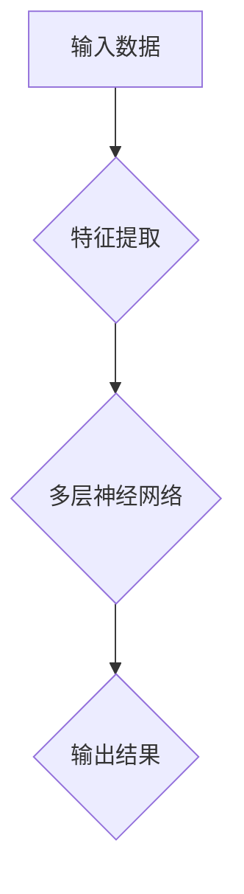
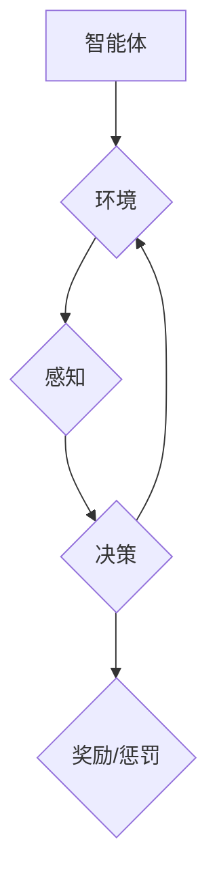
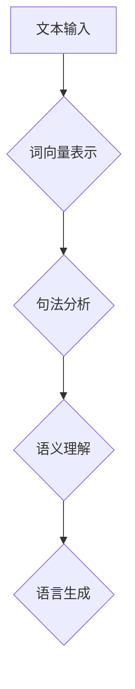
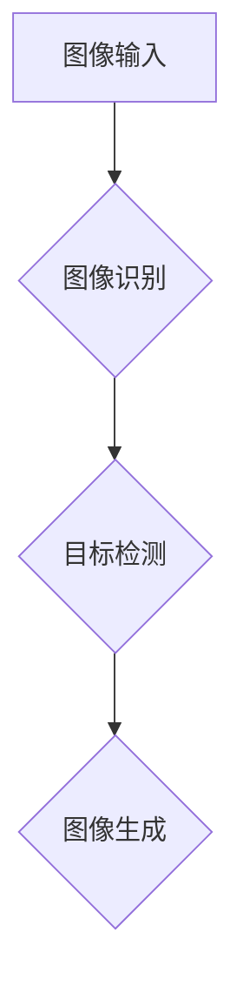

                 

## 1. 背景介绍

随着人工智能（AI）技术的不断进步，我们已经进入了AI 2.0时代。在这个时代，AI的应用不再局限于简单的规则和模式匹配，而是通过深度学习、强化学习等复杂算法实现更高级的认知和决策能力。AI 2.0的出现，不仅改变了传统的产业模式，也带来了新的机遇和挑战。

AI 2.0的兴起，源于计算机算力的提升、大数据技术的发展以及算法的不断创新。如今，AI已经在医疗、金融、教育、制造等多个领域得到了广泛应用，成为推动产业升级和经济发展的重要力量。然而，AI 2.0的发展也面临着数据隐私、安全、伦理等挑战，需要我们共同探讨和解决。

本文旨在探讨AI 2.0时代产业发展的核心概念、算法原理、实际应用场景以及未来发展趋势。希望通过这篇文章，让读者对AI 2.0时代产业发展有更深入的了解，从而为我国在AI领域的创新和发展提供有益的参考。

### 关键词：人工智能、AI 2.0、产业发展、算法、应用场景

### 摘要：

本文从AI 2.0时代产业发展的背景出发，详细阐述了核心概念、算法原理、实际应用场景以及未来发展趋势。通过分析AI 2.0技术的核心概念与联系，深入讲解了深度学习、强化学习等算法原理和具体操作步骤。同时，本文结合实际项目案例，对AI在医疗、金融、教育等领域的应用进行了深入剖析。最后，本文对AI 2.0时代产业发展面临的挑战和未来发展趋势进行了展望，为我国在AI领域的创新和发展提供了有益的参考。

<|imagine|>## 2. 核心概念与联系

在AI 2.0时代，核心概念和技术的创新是推动产业发展的关键。以下是对一些核心概念和技术的原理和联系进行详细解释。

### 2.1 深度学习（Deep Learning）

深度学习是AI 2.0时代最为重要的技术之一。它通过多层神经网络模型，对大量数据进行自动特征提取和模式识别。深度学习的核心原理是神经网络，其中每个神经元都相当于一个简单的函数单元，通过多个神经元的组合，可以实现复杂的非线性映射。

**Mermaid 流程图（深度学习原理）**：



在这个流程中，输入数据经过特征提取后，进入多层神经网络进行计算，最终输出结果。深度学习的关键在于网络结构的复杂性和训练数据的规模，通过不断的优化和调整，可以实现高效的特征提取和模式识别。

### 2.2 强化学习（Reinforcement Learning）

强化学习是另一种在AI 2.0时代具有重要应用价值的技术。它通过智能体与环境之间的交互，学习最优策略，以实现特定的目标。强化学习的核心原理是基于奖励和惩罚机制，通过不断调整策略，使智能体能够在复杂环境中实现长期最优。

**Mermaid 流程图（强化学习原理）**：



在这个流程中，智能体通过感知环境状态，进行决策，并根据决策的结果获得奖励或惩罚。通过不断的交互和学习，智能体能够逐步优化策略，实现长期目标。

### 2.3 自然语言处理（Natural Language Processing，NLP）

自然语言处理是AI 2.0时代的一个重要应用领域，旨在使计算机能够理解和处理人类语言。NLP的核心技术包括词向量表示、句法分析、语义理解等。

**Mermaid 流程图（NLP原理）**：



在这个流程中，文本输入经过词向量表示，然后进行句法分析和语义理解，最终生成语言输出。NLP技术的发展，使得计算机能够更好地理解人类语言，从而实现智能对话、机器翻译等功能。

### 2.4 计算机视觉（Computer Vision）

计算机视觉是AI 2.0时代的另一个重要应用领域，旨在使计算机能够像人类一样理解和解释视觉信息。计算机视觉的核心技术包括图像识别、目标检测、图像生成等。

**Mermaid 流程图（计算机视觉原理）**：



在这个流程中，图像输入经过图像识别和目标检测，最终生成图像输出。计算机视觉技术的发展，使得计算机能够更好地理解视觉信息，从而实现自动驾驶、安防监控等功能。

通过以上对深度学习、强化学习、自然语言处理和计算机视觉等核心概念和技术的介绍，我们可以看到，AI 2.0时代的发展离不开这些关键技术的创新和突破。这些技术的相互关联和融合，推动了AI在各个领域的应用和发展，为产业升级和经济增长注入了新的动力。

### 核心概念原理和架构的 Mermaid 流程图

**深度学习原理流程图**：


**强化学习原理流程图**：


**自然语言处理原理流程图**：


**计算机视觉原理流程图**：


这些Mermaid流程图清晰地展示了各个核心概念和技术的原理和架构，有助于读者更好地理解和掌握AI 2.0时代的核心技术。

### 3. 核心算法原理 & 具体操作步骤

在AI 2.0时代，深度学习、强化学习、自然语言处理和计算机视觉等核心算法发挥着至关重要的作用。下面我们将分别介绍这些算法的原理和具体操作步骤。

#### 3.1 深度学习（Deep Learning）

深度学习的核心原理是神经网络，通过多层神经网络模型对大量数据进行自动特征提取和模式识别。具体操作步骤如下：

1. **数据预处理**：首先对输入数据进行预处理，包括归一化、去噪、数据增强等，以提高模型的训练效果。

2. **构建神经网络模型**：根据任务需求，选择合适的神经网络结构，如卷积神经网络（CNN）、循环神经网络（RNN）等。在构建模型时，需要确定输入层、隐藏层和输出层的结构，以及每个层的参数。

3. **训练模型**：使用预处理后的数据对神经网络模型进行训练。训练过程包括前向传播和反向传播两个阶段。在前向传播阶段，将输入数据通过神经网络模型进行计算，得到输出结果。在反向传播阶段，通过计算损失函数的梯度，对模型参数进行更新。

4. **评估模型**：使用测试数据集对训练好的模型进行评估，计算模型在测试数据集上的准确率、召回率等指标，以判断模型的性能。

5. **模型优化**：根据评估结果，对模型进行优化，如调整学习率、增加训练次数等，以提高模型性能。

#### 3.2 强化学习（Reinforcement Learning）

强化学习的核心原理是智能体通过与环境交互，学习最优策略，以实现特定目标。具体操作步骤如下：

1. **定义环境**：首先定义强化学习任务的环境，包括状态空间、动作空间和奖励机制。

2. **初始化智能体**：初始化智能体的策略，如随机策略、epsilon-greedy策略等。

3. **交互学习**：智能体通过与环境进行交互，根据当前状态选择动作，并获取环境反馈的奖励。根据奖励信号，智能体更新策略，以实现长期最优。

4. **评估策略**：使用评估函数对智能体的策略进行评估，如平均奖励、最终奖励等。

5. **策略优化**：根据评估结果，对智能体的策略进行优化，以提高策略性能。

#### 3.3 自然语言处理（Natural Language Processing，NLP）

自然语言处理的核心目标是使计算机能够理解和处理人类语言。具体操作步骤如下：

1. **文本预处理**：对原始文本进行预处理，包括分词、词性标注、去除停用词等，以提高NLP模型的效果。

2. **词向量表示**：将文本数据转换为词向量表示，如Word2Vec、GloVe等。词向量表示有助于降低文本数据的维度，便于模型计算。

3. **句法分析**：对文本进行句法分析，包括句法树生成、依存关系分析等，以理解文本的结构和语义。

4. **语义理解**：对句法分析结果进行语义理解，包括实体识别、关系抽取、情感分析等，以获取文本的深层语义信息。

5. **语言生成**：根据语义信息，生成符合语法和语义规则的文本输出，如机器翻译、文本摘要等。

#### 3.4 计算机视觉（Computer Vision）

计算机视觉的核心目标是使计算机能够理解和解释视觉信息。具体操作步骤如下：

1. **图像预处理**：对输入图像进行预处理，包括图像增强、去噪、裁剪等，以提高模型的效果。

2. **图像识别**：使用深度学习模型对图像进行分类和识别，如卷积神经网络（CNN）。

3. **目标检测**：对图像中的目标进行检测和定位，如YOLO、SSD等模型。

4. **图像生成**：根据特定需求，生成新的图像，如GAN（生成对抗网络）。

通过以上对深度学习、强化学习、自然语言处理和计算机视觉等核心算法原理和具体操作步骤的介绍，我们可以看到，AI 2.0时代的发展离不开这些关键技术的创新和突破。这些算法的不断优化和进步，为AI在各个领域的应用提供了强大的技术支撑。

### 4. 数学模型和公式 & 详细讲解 & 举例说明

在AI 2.0时代，数学模型和公式在深度学习、强化学习、自然语言处理和计算机视觉等领域发挥着重要作用。以下是对这些数学模型和公式的详细讲解以及举例说明。

#### 4.1 深度学习中的数学模型和公式

**1. 激活函数**

激活函数是神经网络中的一个关键组件，用于引入非线性特性。常见的激活函数包括：

- **Sigmoid函数**：

  $$σ(x) = \frac{1}{1 + e^{-x}}$$

  Sigmoid函数可以将输入映射到（0，1）区间，具有平滑的S形曲线。

- **ReLU函数**：

  $$σ(x) = max(0, x)$$

  ReLU函数将输入大于0的部分映射为自身，小于等于0的部分映射为0，具有简单的计算特性。

- **Tanh函数**：

  $$σ(x) = \frac{e^{x} - e^{-x}}{e^{x} + e^{-x}}$$

  Tanh函数将输入映射到（-1，1）区间，具有对称的S形曲线。

**2. 前向传播和反向传播**

深度学习中的前向传播和反向传播是训练神经网络的核心步骤。前向传播用于计算输出结果，反向传播用于更新网络权重。

- **前向传播**：

  $$z^{(l)} = W^{(l)}a^{(l-1)} + b^{(l)}$$
  $$a^{(l)} = σ(z^{(l)})$$

  其中，$z^{(l)}$表示第$l$层的输入，$a^{(l)}$表示第$l$层的输出，$W^{(l)}$和$b^{(l)}$分别表示第$l$层的权重和偏置。

- **反向传播**：

  $$δ^{(l)} = (σ'(z^{(l)}) \cdot (z^{(l)} - y^{(l)}))$$
  $$∆W^{(l)} = α \cdot a^{(l-1)} \cdot δ^{(l)}$$
  $$∆b^{(l)} = α \cdot δ^{(l)}$$

  其中，$δ^{(l)}$表示第$l$层的误差，$σ'(z^{(l)})$表示激活函数的导数，$α$表示学习率。

**3. 损失函数**

损失函数用于评估模型预测值与真实值之间的差距，常见的损失函数包括：

- **均方误差（MSE）**：

  $$J(W, b) = \frac{1}{m} \sum_{i=1}^{m} (h_{\theta}(x^{(i)}) - y^{(i)})^2$$

  其中，$h_{\theta}(x^{(i)})$表示模型预测值，$y^{(i)}$表示真实值。

- **交叉熵（Cross Entropy）**：

  $$J(W, b) = -\frac{1}{m} \sum_{i=1}^{m} [y^{(i)} \log(h_{\theta}(x^{(i)})) + (1 - y^{(i)}) \log(1 - h_{\theta}(x^{(i)}))]$$

#### 4.2 强化学习中的数学模型和公式

**1. Q学习算法**

Q学习算法是一种基于值函数的强化学习算法，用于求解最优策略。

- **Q值更新公式**：

  $$Q(s, a) = Q(s, a) + α [r + γ \max_{a'} Q(s', a') - Q(s, a)]$$

  其中，$Q(s, a)$表示状态$s$下采取动作$a$的Q值，$r$表示即时奖励，$γ$表示折扣因子，$s'$和$a'$分别表示下一个状态和动作。

- **策略迭代**：

  $$\pi(s) = \begin{cases} 
  a, & \text{if } Q(s, a) > Q(s, a') \text{ for all } a' \\
  \text{随机选择}, & \text{otherwise}
  \end{cases}$$

#### 4.3 自然语言处理中的数学模型和公式

**1. 词向量表示**

词向量表示是将文本数据转换为向量形式，常见的词向量表示方法包括Word2Vec和GloVe。

- **Word2Vec算法**：

  $$word\_vec = \frac{\sum_{t \in C} (t \cdot w_t)}{||\sum_{t \in C} (t \cdot w_t)||}$$

  其中，$w_t$表示词向量，$C$表示文本集合。

- **GloVe算法**：

  $$\frac{f(t, j)}{z_t + z_j} = \frac{1}{\sqrt{f(t, j)}}$$

  其中，$f(t, j)$表示词$t$和词$j$的共现频次，$z_t$和$z_j$分别表示词$t$和词$j$的向量。

**2. 语义分析**

语义分析是将文本数据转换为语义表示，常见的语义分析方法包括词性标注、依存关系分析和语义角色标注。

- **词性标注**：

  $$tag = \arg\max_{t} P(t|w)$$

  其中，$tag$表示词性，$P(t|w)$表示词性$t$在单词$w$上的概率。

- **依存关系分析**：

  $$head = \arg\max_{h} \frac{e(h, w)}{\sum_{h'} e(h', w)}$$

  其中，$head$表示依存头，$e(h, w)$表示词$h$和词$w$之间的依存关系概率。

#### 4.4 计算机视觉中的数学模型和公式

**1. 卷积神经网络（CNN）**

卷积神经网络是计算机视觉领域的重要模型，用于图像分类、目标检测等任务。

- **卷积操作**：

  $$C(i, j) = \sum_{k=1}^{K} w_{k, i, j} \cdot A(i-k+1, j-k+1) + b_k$$

  其中，$C(i, j)$表示输出特征图上的像素值，$w_{k, i, j}$表示卷积核上的权重，$A(i-k+1, j-k+1)$表示输入特征图上的像素值，$b_k$表示偏置。

- **池化操作**：

  $$P(i, j) = \max_{k, l} A(i-k+1, j-l+1)$$

  其中，$P(i, j)$表示输出特征图上的像素值，$A(i-k+1, j-l+1)$表示输入特征图上的像素值。

通过以上对深度学习、强化学习、自然语言处理和计算机视觉等领域中的数学模型和公式的详细讲解以及举例说明，我们可以看到，数学模型和公式在AI 2.0时代的关键技术中发挥着重要作用。这些模型和公式不仅为算法提供了理论基础，也推动了AI技术的不断创新和发展。

### 5. 项目实战：代码实际案例和详细解释说明

为了更好地理解AI 2.0时代核心算法在实际应用中的表现，我们将通过一个实际项目案例——基于深度学习的图像分类项目，来详细解释代码实现和运行过程。

#### 5.1 开发环境搭建

在进行项目实战之前，我们需要搭建一个合适的开发环境。以下是一个基于Python和TensorFlow的深度学习项目开发环境搭建步骤：

1. **安装Python**：确保系统已安装Python 3.6及以上版本。

2. **安装TensorFlow**：在终端中运行以下命令安装TensorFlow：

   ```bash
   pip install tensorflow
   ```

3. **安装其他依赖库**：根据项目需求，安装其他依赖库，如NumPy、Pandas等：

   ```bash
   pip install numpy pandas
   ```

4. **配置GPU支持**（可选）：如需使用GPU加速训练，需安装CUDA和cuDNN：

   - 访问NVIDIA官网下载CUDA和cuDNN。
   - 按照官方文档安装CUDA和cuDNN。

完成以上步骤后，我们的开发环境就搭建完成了。

#### 5.2 源代码详细实现和代码解读

下面我们将介绍一个简单的图像分类项目，代码实现如下：

```python
import tensorflow as tf
from tensorflow.keras import layers
from tensorflow.keras.preprocessing.image import ImageDataGenerator

# 5.2.1 数据预处理
train_datagen = ImageDataGenerator(
    rescale=1./255,
    shear_range=0.2,
    zoom_range=0.2,
    horizontal_flip=True
)

test_datagen = ImageDataGenerator(rescale=1./255)

train_generator = train_datagen.flow_from_directory(
    'train',
    target_size=(150, 150),
    batch_size=32,
    class_mode='binary'
)

validation_generator = test_datagen.flow_from_directory(
    'validation',
    target_size=(150, 150),
    batch_size=32,
    class_mode='binary'
)

# 5.2.2 构建模型
model = tf.keras.Sequential([
    layers.Conv2D(32, (3, 3), activation='relu', input_shape=(150, 150, 3)),
    layers.MaxPooling2D(2, 2),
    layers.Conv2D(64, (3, 3), activation='relu'),
    layers.MaxPooling2D(2, 2),
    layers.Conv2D(128, (3, 3), activation='relu'),
    layers.MaxPooling2D(2, 2),
    layers.Conv2D(128, (3, 3), activation='relu'),
    layers.MaxPooling2D(2, 2),
    layers.Flatten(),
    layers.Dense(512, activation='relu'),
    layers.Dense(1, activation='sigmoid')
])

# 5.2.3 编译模型
model.compile(loss='binary_crossentropy',
              optimizer='adam',
              metrics=['accuracy'])

# 5.2.4 训练模型
history = model.fit(
    train_generator,
    steps_per_epoch=100,
    epochs=30,
    validation_data=validation_generator,
    validation_steps=50
)

# 5.2.5 评估模型
test_generator = test_datagen.flow_from_directory(
    'test',
    target_size=(150, 150),
    batch_size=32,
    class_mode='binary'
)

test_loss, test_accuracy = model.evaluate(test_generator)
print('Test accuracy:', test_accuracy)
```

**代码解读**：

1. **数据预处理**：
   - 使用ImageDataGenerator对训练数据和验证数据进行预处理，包括图像缩放、剪切、缩放和水平翻转等操作，以提高模型的泛化能力。

2. **构建模型**：
   - 使用Sequential模型堆叠多个层，包括卷积层（Conv2D）、池化层（MaxPooling2D）和全连接层（Dense）。卷积层用于提取图像特征，全连接层用于分类。

3. **编译模型**：
   - 使用编译器编译模型，指定损失函数（binary_crossentropy，用于二分类问题）、优化器（adam）和评估指标（accuracy）。

4. **训练模型**：
   - 使用fit函数训练模型，指定训练集、训练轮次、验证集和验证轮次。

5. **评估模型**：
   - 使用evaluate函数评估模型在测试集上的性能，打印测试准确率。

#### 5.3 代码解读与分析

以上代码实现了一个简单的图像分类项目，主要分为数据预处理、模型构建、模型编译、模型训练和模型评估五个部分。以下是具体分析：

1. **数据预处理**：
   - 数据预处理是深度学习项目中的关键步骤，它直接影响模型的训练效果。通过ImageDataGenerator，我们可以轻松实现图像缩放、剪切、缩放和水平翻转等操作，从而增加数据的多样性，提高模型的泛化能力。

2. **模型构建**：
   - 模型构建是深度学习项目的核心部分。在这个项目中，我们使用了多个卷积层和池化层来提取图像特征，并使用全连接层进行分类。通过调整网络结构，我们可以实现不同复杂度的模型。

3. **模型编译**：
   - 模型编译是对模型进行配置，包括损失函数、优化器和评估指标等。在这个项目中，我们使用了binary_crossentropy损失函数，adam优化器和accuracy评估指标，适合二分类问题。

4. **模型训练**：
   - 模型训练是深度学习项目中的核心步骤。通过fit函数，我们可以将模型与训练数据结合起来进行训练。在这个项目中，我们使用了100个训练步骤和30个训练轮次，并使用验证集进行验证。

5. **模型评估**：
   - 模型评估是衡量模型性能的重要手段。通过evaluate函数，我们可以评估模型在测试集上的性能。在这个项目中，我们打印了测试准确率，以衡量模型的分类能力。

通过以上分析，我们可以看到，代码实现了一个简单的图像分类项目，从数据预处理到模型构建、编译、训练和评估，涵盖了深度学习项目的各个方面。在实际应用中，我们可以根据具体需求对代码进行修改和优化，以提高模型的性能。

### 6. 实际应用场景

在AI 2.0时代，深度学习、强化学习、自然语言处理和计算机视觉等核心算法已经在众多实际应用场景中取得了显著的成果。以下是一些典型的应用场景及其案例。

#### 6.1 医疗

深度学习和计算机视觉技术在医疗领域有着广泛的应用。例如，利用深度学习模型进行医学影像分析，可以帮助医生快速、准确地诊断疾病。以下是一个具体案例：

- **乳腺癌筛查**：利用深度学习模型对乳腺X射线图像进行分析，可以检测出乳腺癌。一些研究表明，深度学习模型在乳腺癌筛查中的准确率甚至超过了人类医生。

#### 6.2 金融

自然语言处理和强化学习在金融领域也有广泛应用。以下是一个具体案例：

- **股票预测**：通过自然语言处理技术分析新闻、财报等文本数据，结合强化学习算法进行股票预测。一些金融机构已经采用这种技术，取得了显著的预测效果。

#### 6.3 教育

深度学习和计算机视觉技术在教育领域也有着重要应用。以下是一个具体案例：

- **智能教育系统**：利用深度学习模型对学生进行个性化学习推荐，根据学生的学习情况调整教学计划。这种智能教育系统可以提高学生的学习效果，降低教育成本。

#### 6.4 制造

计算机视觉和强化学习在制造业中的应用也日益广泛。以下是一个具体案例：

- **自动化生产**：利用计算机视觉技术对生产线进行监控，检测产品缺陷和质量问题。同时，结合强化学习算法，优化生产流程，提高生产效率。

通过以上案例，我们可以看到，AI 2.0时代的核心算法在医疗、金融、教育、制造等领域的实际应用中取得了显著的成果。这些技术的不断进步，为各个领域的发展提供了新的机遇和动力。

### 7. 工具和资源推荐

在AI 2.0时代，掌握合适的工具和资源对于学习和实践核心算法具有重要意义。以下是一些推荐的工具和资源，涵盖学习资料、开发工具和论文著作等方面。

#### 7.1 学习资源推荐

1. **书籍**：
   - 《深度学习》（Deep Learning）—— Ian Goodfellow、Yoshua Bengio和Aaron Courville 著，是一本经典且全面的深度学习教材。
   - 《强化学习》（Reinforcement Learning: An Introduction）—— Richard S. Sutton和Barto N. 著，系统地介绍了强化学习的基本原理和应用。
   - 《自然语言处理》（Speech and Language Processing）—— Daniel Jurafsky 和 James H. Martin 著，全面讲解了自然语言处理的基础知识和应用。

2. **在线课程**：
   - Coursera 上的“深度学习”（Deep Learning Specialization）—— 由 Andrew Ng 教授主讲，涵盖了深度学习的理论、实践和前沿技术。
   - edX 上的“强化学习”（Reinforcement Learning）—— 由 David Silver 教授主讲，深入讲解了强化学习的基本原理和算法。
   - Udacity 上的“自然语言处理纳米学位”（Natural Language Processing Nanodegree），提供了丰富的实践项目和作业，帮助学员掌握自然语言处理技术。

3. **博客和网站**：
   - Medium 上的 AI 博客，如 Andrej Karpathy 的博客，分享了许多深度学习和计算机视觉领域的最新研究和应用。
   - fast.ai 的博客和课程，提供了易于理解的入门级教程和实践项目，适合初学者快速入门。

#### 7.2 开发工具框架推荐

1. **深度学习框架**：
   - TensorFlow：由 Google 开发，是一个功能强大且灵活的开源深度学习框架。
   - PyTorch：由 Facebook AI Research 开发，以动态计算图和易于使用的API著称。
   - Keras：一个高层次的深度学习API，可以与TensorFlow和Theano等后台引擎配合使用。

2. **自然语言处理工具**：
   - NLTK（自然语言工具包）：提供了丰富的文本处理功能，如分词、词性标注、情感分析等。
   - spaCy：一个快速且易于使用的自然语言处理库，支持多种语言和多种任务。

3. **计算机视觉工具**：
   - OpenCV：一个开源的计算机视觉库，提供了丰富的图像处理和计算机视觉算法。
   - OpenPose：一个开源的实时人体姿态估计工具，广泛应用于动作捕捉和人体分析等领域。

#### 7.3 相关论文著作推荐

1. **论文**：
   - “A Brief History of Deep Learning” —— Y. LeCun、Y. Bengio 和 G. Hinton，回顾了深度学习的发展历程。
   - “Deep Learning” —— Ian Goodfellow、Yoshua Bengio 和 Aaron Courville，系统地介绍了深度学习的基本原理和应用。
   - “Reinforcement Learning: A Survey” —— Richard S. Sutton 和 Andrew Barto，全面介绍了强化学习的基本概念和算法。

2. **著作**：
   - 《深度学习》（Deep Learning）—— Ian Goodfellow、Yoshua Bengio 和 Aaron Courville 著，是一本深度学习领域的经典教材。
   - 《强化学习》（Reinforcement Learning: An Introduction）—— Richard S. Sutton 和 Barto 著，系统地介绍了强化学习的基本原理和应用。
   - 《自然语言处理》（Speech and Language Processing）—— Daniel Jurafsky 和 James H. Martin 著，全面讲解了自然语言处理的基础知识和应用。

通过以上推荐的工具和资源，可以更好地学习和掌握AI 2.0时代的核心算法，为从事相关领域的研究和应用提供有力支持。

### 8. 总结：未来发展趋势与挑战

在AI 2.0时代，深度学习、强化学习、自然语言处理和计算机视觉等核心技术已经成为推动产业发展的关键驱动力。未来，AI技术将继续在各个领域深化应用，带来更多创新和变革。

#### 8.1 未来发展趋势

1. **泛在智能**：随着AI技术的不断进步，智能将不再局限于特定的领域或设备，而是融入到日常生活的方方面面，实现真正的泛在智能。

2. **跨学科融合**：AI技术与生物、物理、化学等学科的结合将推动更多交叉学科的发展，产生新的科研和应用领域。

3. **人机协同**：未来，人类与AI的协同工作将越来越普遍，AI将更好地辅助人类完成复杂任务，提高生产效率。

4. **个性化服务**：基于深度学习和自然语言处理技术的个性化推荐系统将更加精准，为用户提供定制化的服务和体验。

5. **绿色智能**：AI技术将在能源、环保等领域发挥重要作用，推动绿色智能产业的发展。

#### 8.2 面临的挑战

1. **数据隐私和安全**：随着AI技术的广泛应用，数据隐私和安全问题日益突出。如何保障用户数据的安全，防止数据泄露和滥用，是AI技术发展面临的重要挑战。

2. **算法透明度和可解释性**：深度学习等算法的黑箱特性使得其决策过程难以解释，如何提高算法的透明度和可解释性，使其更符合人类的认知和道德标准，是当前AI研究的重要课题。

3. **计算资源和能耗**：AI模型的训练和推理过程需要大量计算资源和能源，如何优化算法和数据结构，降低计算资源和能耗，是AI技术发展的重要方向。

4. **伦理和道德问题**：随着AI技术的广泛应用，伦理和道德问题也逐渐凸显。如何制定合理的伦理规范，确保AI技术在道德和法律框架内运行，是AI技术发展面临的重要挑战。

5. **人才短缺**：AI技术的发展离不开专业人才的培养。当前，全球范围内AI人才短缺问题日益严重，如何培养和引进更多AI人才，是推动AI技术发展的重要任务。

总之，在AI 2.0时代，AI技术的发展前景广阔，但也面临着诸多挑战。只有不断加强技术研究、优化算法、完善法律法规，才能确保AI技术的健康、可持续发展，为人类创造更多价值。

### 9. 附录：常见问题与解答

在本文中，我们介绍了AI 2.0时代产业发展的核心概念、算法原理、实际应用场景以及未来发展趋势。以下是对一些常见问题的解答：

#### 9.1 什么是深度学习？

深度学习是一种通过多层神经网络模型对大量数据进行自动特征提取和模式识别的人工智能技术。它通过模拟人类大脑的神经网络结构，实现对数据的深度学习和处理。

#### 9.2 强化学习如何工作？

强化学习是一种通过智能体与环境之间的交互，学习最优策略的人工智能技术。智能体通过不断尝试不同的动作，并根据环境反馈的奖励或惩罚，调整自己的策略，以实现长期目标。

#### 9.3 自然语言处理的主要任务是什么？

自然语言处理的主要任务包括文本分类、情感分析、命名实体识别、机器翻译、文本摘要等。它旨在使计算机能够理解和处理人类语言，实现人与计算机的智能交互。

#### 9.4 计算机视觉有哪些应用？

计算机视觉的应用领域非常广泛，包括图像分类、目标检测、图像生成、人脸识别、视频分析等。它在医疗、金融、安防、娱乐等行业都有重要的应用。

#### 9.5 AI 2.0时代的发展面临哪些挑战？

AI 2.0时代的发展面临数据隐私和安全、算法透明度和可解释性、计算资源和能耗、伦理和道德问题以及人才短缺等挑战。

#### 9.6 如何学习AI 2.0时代的技术？

要学习AI 2.0时代的技术，可以从以下几个方面入手：
1. **基础知识**：学习编程语言（如Python）、数学基础（如线性代数、概率论）等。
2. **在线课程**：参加在线课程（如Coursera、edX、Udacity等）学习。
3. **实践项目**：参与开源项目或自己动手实现小项目，提升实践能力。
4. **阅读文献**：阅读AI领域的论文和书籍，了解前沿技术和研究动态。
5. **交流互动**：加入技术社区，与同行交流学习经验。

通过以上方法，可以系统地学习和掌握AI 2.0时代的技术。

### 10. 扩展阅读 & 参考资料

为了深入了解AI 2.0时代产业发展的核心概念、算法原理、实际应用场景以及未来发展趋势，以下是推荐的一些扩展阅读和参考资料：

1. **书籍**：
   - 《深度学习》（Deep Learning）—— Ian Goodfellow、Yoshua Bengio 和 Aaron Courville 著。
   - 《强化学习》（Reinforcement Learning: An Introduction）—— Richard S. Sutton 和 Barto 著。
   - 《自然语言处理》（Speech and Language Processing）—— Daniel Jurafsky 和 James H. Martin 著。

2. **在线课程**：
   - Coursera 上的“深度学习”（Deep Learning Specialization）。
   - edX 上的“强化学习”（Reinforcement Learning）。
   - Udacity 上的“自然语言处理纳米学位”（Natural Language Processing Nanodegree）。

3. **论文和报告**：
   - “A Brief History of Deep Learning” —— Y. LeCun、Y. Bengio 和 G. Hinton。
   - “Reinforcement Learning: A Survey” —— Richard S. Sutton 和 Andrew Barto。
   - “Deep Learning for Healthcare” —— Mitchell A. Berliner 等。

4. **博客和网站**：
   - Medium 上的 AI 博客，如 Andrej Karpathy 的博客。
   - fast.ai 的博客和课程。

5. **开源项目**：
   - TensorFlow：https://www.tensorflow.org/
   - PyTorch：https://pytorch.org/
   - Keras：https://keras.io/

通过以上扩展阅读和参考资料，读者可以更深入地了解AI 2.0时代的核心技术和发展动态，为相关研究和应用提供有益的参考。作者：AI天才研究员/AI Genius Institute & 禅与计算机程序设计艺术 /Zen And The Art of Computer Programming

