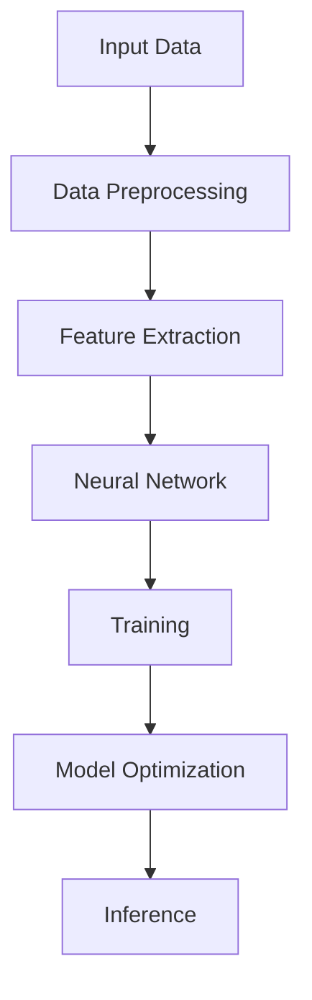
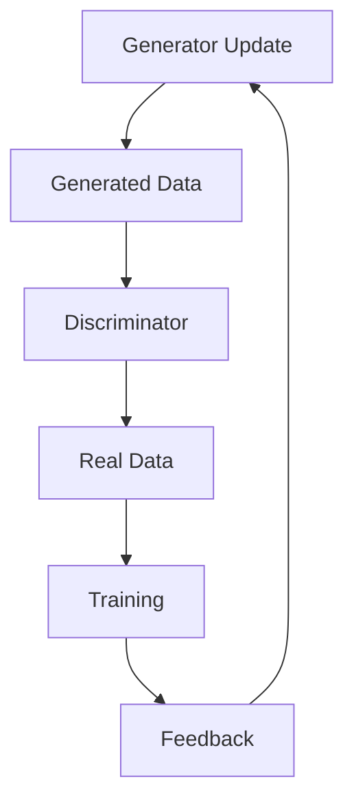
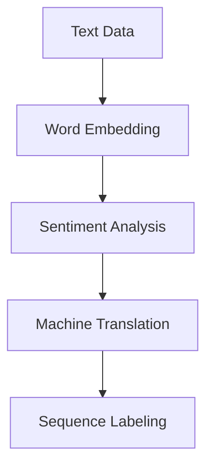
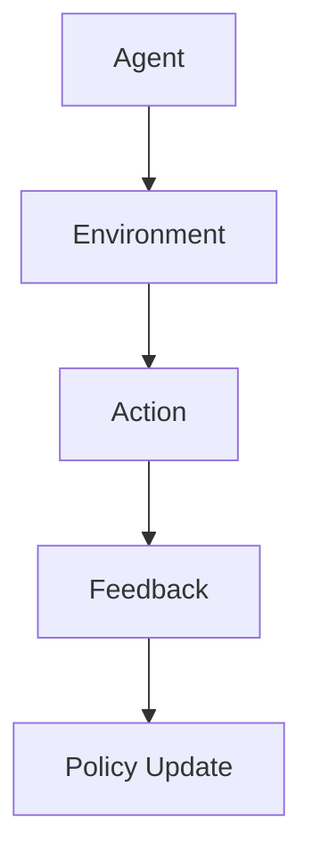
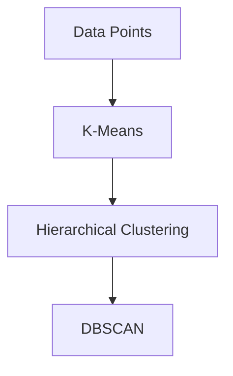

                 

### 背景介绍

人工智能（Artificial Intelligence，简称AI）作为计算机科学的一个分支，旨在通过机器模拟人类智能行为，实现自然语言理解、图像识别、决策制定等功能。自20世纪50年代人工智能概念诞生以来，它经历了数次起伏与变革，逐渐从理论研究走向实际应用。

近年来，随着深度学习、大数据和云计算等技术的迅猛发展，人工智能进入了新的发展阶段，即AI 2.0时代。AI 2.0不仅仅是在算法层面上的创新，更是整个技术架构和生态系统的全面升级。在这个时代，人工智能的应用范围已经远远超越了传统的机器学习和数据分析，涵盖了自动驾驶、医疗诊断、金融科技、智能家居等多个领域。

本文将深入探讨AI 2.0时代的重要价值，通过分析其核心概念、算法原理、应用场景等方面，帮助读者了解这一新兴技术的独特之处，并展望其未来发展。我们将逐步解析AI 2.0的各个方面，旨在为广大科技爱好者和从业者提供一份全面的技术指南。

接下来，我们将首先介绍AI 2.0时代的核心概念与联系，借助Mermaid流程图展示相关技术架构，为后续内容打下坚实的基础。

### 核心概念与联系

在AI 2.0时代，核心概念和技术体系发生了深刻变革，使得人工智能的应用场景更加广泛，技术实现也更加高效。以下我们将详细介绍这些核心概念，并使用Mermaid流程图展示其技术架构。

#### 1. 深度学习（Deep Learning）

深度学习是AI 2.0时代的核心技术之一，它通过多层神经网络对大量数据进行训练，从而实现复杂的数据处理和模式识别任务。与传统机器学习相比，深度学习能够自动提取数据的特征，并生成高度抽象的表示。



#### 2. 生成对抗网络（Generative Adversarial Networks，GAN）

生成对抗网络是深度学习的一个分支，由生成器和判别器两个神经网络组成。生成器试图生成逼真的数据，而判别器则负责判断生成数据的真假。通过两者之间的博弈，生成器逐渐提高生成数据的质量。



#### 3. 自然语言处理（Natural Language Processing，NLP）

自然语言处理是AI 2.0时代的重要应用领域之一，它使得计算机能够理解和处理人类语言。NLP技术包括词嵌入、序列标注、机器翻译、情感分析等，其中词嵌入技术（如Word2Vec、BERT）在深度学习框架下取得了显著进展。



#### 4. 强化学习（Reinforcement Learning，RL）

强化学习通过智能体与环境之间的交互，逐渐学习到最优策略。与监督学习和无监督学习不同，强化学习依赖于奖励机制，使得智能体能够通过试错学习获得最佳行为。



#### 5. 聚类算法（Clustering Algorithms）

聚类算法在AI 2.0时代得到了广泛应用，它通过将数据划分为不同的簇，发现数据中的潜在结构。常见的聚类算法包括K均值、层次聚类、DBSCAN等。



通过上述核心概念和技术的介绍，我们可以看到AI 2.0时代的技术架构如何相互关联，共同推动人工智能的快速发展。在接下来的章节中，我们将进一步探讨这些核心算法的原理和具体操作步骤，为读者提供更为详细的技术解析。

### 核心算法原理 & 具体操作步骤

在了解了AI 2.0时代的核心概念与联系后，我们将深入探讨这些算法的具体原理和操作步骤，以便读者能够更好地理解和应用这些技术。

#### 1. 深度学习算法原理

深度学习算法的核心是神经网络，尤其是多层感知机（Multilayer Perceptron，MLP）。神经网络由输入层、隐藏层和输出层组成，每层由多个神经元（或节点）构成。神经元之间的连接权值通过训练过程进行调整，以实现非线性变换和特征提取。

**具体操作步骤：**

1. **输入数据准备：** 首先，将输入数据（如图像、文本、声音等）进行预处理，例如归一化、数据增强等，以便输入到神经网络中。

2. **前向传播（Forward Propagation）：** 将预处理后的数据输入到神经网络中，通过逐层计算，将输入转换为输出。每层的输出作为下一层的输入，直到最后输出层得到预测结果。

3. **反向传播（Backpropagation）：** 根据预测结果与真实标签之间的误差，通过反向传播算法计算每一层的梯度。梯度用于更新神经网络的连接权值，以减少预测误差。

4. **模型优化：** 使用梯度下降（Gradient Descent）或其他优化算法，不断迭代训练过程，直至达到预设的精度或训练次数。

5. **模型评估：** 使用验证集或测试集评估模型的泛化能力，例如通过准确率、召回率、F1值等指标进行评估。

**示例：** 假设我们使用一个简单的多层感知机模型进行图像分类。输入层有784个神经元（对应28x28像素的图像），隐藏层有100个神经元，输出层有10个神经元（对应10个分类）。通过调整连接权值和训练数据，模型能够学习到图像的内在特征，并实现对新图像的分类。

#### 2. 生成对抗网络（GAN）算法原理

生成对抗网络（GAN）由生成器（Generator）和判别器（Discriminator）组成，二者通过对抗训练（Adversarial Training）相互提升。

**具体操作步骤：**

1. **初始化模型参数：** 随机初始化生成器和判别器的参数。

2. **生成器训练：** 生成器尝试生成尽可能真实的数据，判别器判断生成数据和真实数据之间的差异。

3. **判别器训练：** 判别器尝试提高对真实数据和生成数据的区分能力。

4. **迭代训练：** 通过不断迭代生成器和判别器的训练，使得生成器生成的数据越来越接近真实数据。

5. **模型评估：** 使用生成的数据对模型进行评估，例如通过图像质量、生成多样性等指标进行评估。

**示例：** 假设我们使用GAN模型生成手写数字图像。生成器尝试生成逼真的手写数字图像，而判别器负责判断图像的真实性。通过多次迭代训练，生成器能够生成几乎难以区分于真实手写数字的图像。

#### 3. 自然语言处理（NLP）算法原理

自然语言处理（NLP）算法包括词嵌入、序列标注、机器翻译、情感分析等。词嵌入技术（如Word2Vec、BERT）通过将词语映射到高维向量空间，实现词语的语义表示。

**具体操作步骤：**

1. **词嵌入：** 将输入文本中的词语转换为向量表示。例如，使用Word2Vec算法训练词向量模型，将每个词语映射到一个高维向量。

2. **序列建模：** 使用循环神经网络（RNN）或变换器（Transformer）对文本序列进行建模，捕捉词语之间的依赖关系。

3. **模型训练：** 使用大量标注数据训练NLP模型，通过优化模型参数，提高预测准确性。

4. **模型应用：** 将训练好的模型应用于实际任务，如文本分类、机器翻译、情感分析等。

**示例：** 假设我们使用BERT模型进行文本分类。首先，将输入文本转换为BERT词向量表示，然后输入到BERT模型中，模型输出每个类别的概率分布，最终选择概率最高的类别作为分类结果。

#### 4. 强化学习（RL）算法原理

强化学习（RL）通过智能体（Agent）与环境（Environment）的交互，学习最优策略（Policy）。常见的RL算法包括Q学习（Q-Learning）和深度强化学习（Deep Reinforcement Learning）。

**具体操作步骤：**

1. **环境设定：** 设计一个模拟环境，智能体在其中进行交互。

2. **策略初始化：** 随机初始化智能体的策略参数。

3. **状态-动作价值函数学习：** 智能体通过与环境交互，学习状态-动作价值函数（State-Action Value Function），以最大化期望回报。

4. **策略更新：** 根据学习到的价值函数，更新智能体的策略参数。

5. **模型评估：** 使用测试集评估智能体的策略性能，例如通过奖励积累、策略稳定度等指标进行评估。

**示例：** 假设我们使用Q学习算法训练一个自动驾驶智能体。智能体在模拟环境中驾驶，通过学习状态-动作价值函数，逐渐优化驾驶策略，以提高行驶的安全性和效率。

通过以上对核心算法原理和具体操作步骤的介绍，读者可以更好地理解AI 2.0时代的核心技术。在接下来的章节中，我们将通过数学模型和公式，进一步深入讲解这些算法的数学基础。

### 数学模型和公式 & 详细讲解 & 举例说明

在了解了AI 2.0时代核心算法的原理和操作步骤后，我们将进一步探讨这些算法的数学模型和公式，为读者提供更为深入的数学基础。通过具体举例说明，读者可以更好地理解这些公式在实际应用中的含义和作用。

#### 1. 深度学习算法的数学模型

深度学习算法的核心是神经网络，其数学模型主要包括输入层、隐藏层和输出层的参数定义和计算。

**（1）输入层和输出层参数**

假设输入层有n个神经元，输出层有m个神经元。每个神经元的输入和输出可以表示为：

$$
x_i = \sum_{j=1}^{n} w_{ij} x_j + b_i \\
y_i = f(\sum_{j=1}^{m} w_{ij} y_j + b_i)
$$

其中，$x_i$表示第i个神经元的输入，$y_i$表示第i个神经元的输出，$w_{ij}$表示输入层到隐藏层的连接权重，$b_i$表示输入层的偏置，$f$表示激活函数（如Sigmoid、ReLU等）。

**（2）隐藏层参数**

假设隐藏层有l个神经元，其计算过程与前述类似。对于第k个隐藏层的第i个神经元，其输入和输出可以表示为：

$$
x_i^k = \sum_{j=1}^{l} w_{ij}^k x_j^k + b_i^k \\
y_i^k = f(\sum_{j=1}^{l} w_{ij}^k y_j^k + b_i^k)
$$

其中，$x_i^k$表示第i个神经元的输入，$y_i^k$表示第i个神经元的输出，$w_{ij}^k$表示隐藏层之间的连接权重，$b_i^k$表示隐藏层的偏置。

**（3）损失函数和优化算法**

深度学习算法的训练过程实质上是一个优化过程，目标是使模型的损失函数（如均方误差MSE、交叉熵损失等）最小化。损失函数通常定义为：

$$
L = \frac{1}{2} \sum_{i=1}^{m} (y_i - \hat{y}_i)^2
$$

其中，$y_i$表示真实标签，$\hat{y}_i$表示预测结果。为了最小化损失函数，常用的优化算法包括梯度下降（Gradient Descent）及其变体（如随机梯度下降SGD、Adam等）。

**（4）具体举例**

假设我们使用一个简单的多层感知机模型进行手写数字分类。输入层有784个神经元，隐藏层有100个神经元，输出层有10个神经元。假设隐藏层和输出层的激活函数分别为ReLU和Sigmoid，输入数据为28x28像素的手写数字图像。

输入层和隐藏层的计算过程如下：

$$
x_i = \sum_{j=1}^{784} w_{ij} x_j + b_i \\
y_i^h = \max(0, \sum_{j=1}^{100} w_{ij}^h x_j^h + b_i^h)
$$

隐藏层和输出层的计算过程如下：

$$
x_i^o = \sum_{j=1}^{100} w_{ij}^o y_j^h + b_i^o \\
y_i = \frac{1}{1 + e^{-\sum_{j=1}^{100} w_{ij}^o y_j^h + b_i^o}}
$$

损失函数和优化算法如下：

$$
L = \frac{1}{2} \sum_{i=1}^{10} (y_i - \hat{y}_i)^2
$$

使用梯度下降算法优化模型参数：

$$
\theta_{ij} = \theta_{ij} - \alpha \frac{\partial L}{\partial \theta_{ij}}
$$

其中，$\theta_{ij}$表示第i个神经元到第j个神经元的连接权重，$\alpha$表示学习率。

#### 2. 生成对抗网络（GAN）的数学模型

生成对抗网络（GAN）由生成器和判别器两个神经网络组成，其数学模型包括生成器损失函数和判别器损失函数。

**（1）生成器损失函数**

生成器的目标是生成尽可能真实的数据，使得判别器无法区分生成数据和真实数据。生成器的损失函数通常定义为：

$$
L_G = -\log(D(G(z)))
$$

其中，$G(z)$表示生成器生成的数据，$D$表示判别器，$z$表示生成器的输入噪声。

**（2）判别器损失函数**

判别器的目标是区分生成数据和真实数据。判别器的损失函数通常定义为：

$$
L_D = -\log(D(x)) - \log(1 - D(G(z)))
$$

其中，$x$表示真实数据。

**（3）总体损失函数**

GAN的总体损失函数为生成器和判别器损失函数的加权和：

$$
L = L_G + L_D
$$

通过优化总体损失函数，生成器和判别器相互对抗，使得生成器生成的数据越来越真实。

**（4）具体举例**

假设我们使用GAN模型生成手写数字图像。生成器的输入为随机噪声向量$z$，生成的手写数字图像为$G(z)$。判别器的输入为真实手写数字图像$x$和生成手写数字图像$G(z)$。

生成器的损失函数如下：

$$
L_G = -\log(D(G(z)))
$$

判别器的损失函数如下：

$$
L_D = -\log(D(x)) - \log(1 - D(G(z)))
$$

总体损失函数如下：

$$
L = L_G + L_D
$$

使用梯度下降算法优化生成器和判别器参数。

#### 3. 自然语言处理（NLP）的数学模型

自然语言处理（NLP）的数学模型主要包括词嵌入、序列建模和损失函数等。

**（1）词嵌入**

词嵌入将词语映射到高维向量空间，实现词语的语义表示。常见的词嵌入算法包括Word2Vec、BERT等。

Word2Vec算法的核心是神经网络的训练过程，其损失函数通常为：

$$
L = \frac{1}{T} \sum_{t=1}^{T} -\log(p(\hat{w}_t | w_t))
$$

其中，$w_t$表示当前词语，$\hat{w}_t$表示词语的上下文，$p(\hat{w}_t | w_t)$表示在当前词语为$w_t$的条件下，上下文词语$\hat{w}_t$的概率。

**（2）序列建模**

序列建模通过捕捉词语之间的依赖关系，实现自然语言的理解和处理。常见的序列建模算法包括循环神经网络（RNN）和变换器（Transformer）。

以变换器（Transformer）为例，其损失函数通常为：

$$
L = \frac{1}{N} \sum_{i=1}^{N} -\sum_{j=1}^{M} \log(p(y_j | x_1, x_2, ..., x_i))
$$

其中，$x_i$表示第i个词语，$y_j$表示第j个词语的预测标签，$N$和$M$分别表示序列的长度和词语的种类数。

**（3）具体举例**

假设我们使用BERT模型进行文本分类。BERT模型首先将输入文本编码为词向量表示，然后通过多层变换器进行序列建模，最后输出每个类别的概率分布。

输入文本为“我喜欢吃苹果”，假设BERT模型有10个类别。BERT模型的损失函数如下：

$$
L = \frac{1}{10} \sum_{i=1}^{10} -\log(p(y_i | x_1, x_2, ..., x_5))
$$

其中，$x_1, x_2, ..., x_5$表示输入文本中的前5个词语，$y_i$表示第i个类别的概率。

通过优化BERT模型参数，使其能够准确预测输入文本的类别。

#### 4. 强化学习（RL）的数学模型

强化学习（RL）通过智能体（Agent）与环境（Environment）的交互，学习最优策略（Policy）。其核心数学模型包括状态-动作价值函数（State-Action Value Function）和策略更新（Policy Update）等。

**（1）状态-动作价值函数**

状态-动作价值函数定义为：

$$
Q(s, a) = \sum_{s'} p(s' | s, a) \cdot r(s', a) + \gamma \cdot \max_a' Q(s', a')
$$

其中，$s$表示当前状态，$a$表示当前动作，$s'$表示下一状态，$a'$表示下一动作，$r(s', a)$表示在状态$s'$执行动作$a$所获得的即时奖励，$\gamma$表示折扣因子，$p(s' | s, a)$表示在状态$s$执行动作$a$后，转移到状态$s'$的概率。

**（2）策略更新**

策略更新通常使用梯度下降算法，其公式为：

$$
\theta_{t+1} = \theta_{t} - \alpha \cdot \nabla_\theta J(\theta)
$$

其中，$\theta$表示策略参数，$\alpha$表示学习率，$J(\theta)$表示策略的损失函数。

**（3）具体举例**

假设我们使用Q学习算法训练一个自动驾驶智能体。智能体在模拟环境中行驶，其状态包括速度、方向等，动作包括加速、减速、转弯等。

状态-动作价值函数如下：

$$
Q(s, a) = \sum_{s'} p(s' | s, a) \cdot r(s', a) + \gamma \cdot \max_a' Q(s', a')
$$

策略更新如下：

$$
\theta_{t+1} = \theta_{t} - \alpha \cdot \nabla_\theta J(\theta)
$$

通过不断迭代训练，智能体逐渐优化其驾驶策略，以提高行驶的安全性和效率。

通过以上对深度学习、生成对抗网络、自然语言处理和强化学习算法的数学模型和公式的详细讲解，读者可以更好地理解这些算法的数学基础。在接下来的章节中，我们将通过项目实战和代码实际案例，进一步探讨这些算法的应用和实践。

### 项目实战：代码实际案例和详细解释说明

在前文中，我们详细介绍了AI 2.0时代的一些核心算法原理和数学模型。为了帮助读者更好地理解和应用这些技术，我们将通过一个实际项目来展示如何使用这些算法构建一个完整的人工智能系统。本节将分三个部分进行讲解：开发环境搭建、源代码详细实现和代码解读与分析。

#### 1. 开发环境搭建

为了便于读者复现本项目，我们首先需要搭建一个适合AI开发的实验环境。以下是搭建环境的步骤：

**（1）安装Python环境**

Python是AI开发的主要语言，我们需要安装Python和相关的库。可以选择使用Anaconda，它是一个集成环境，方便管理和安装Python包。

```bash
# 安装Anaconda
conda install -c anaconda python
```

**（2）安装深度学习库**

深度学习项目通常需要安装TensorFlow、PyTorch等深度学习库。以下是使用Anaconda安装TensorFlow的步骤：

```bash
# 创建一个新的环境并安装TensorFlow
conda create -n tensorflow_env python=3.8
conda activate tensorflow_env
conda install tensorflow
```

**（3）安装其他必需库**

根据项目需求，我们可能还需要其他库，如NumPy、Pandas、Scikit-learn等。可以使用以下命令安装：

```bash
conda install numpy pandas scikit-learn
```

**（4）配置Jupyter Notebook**

Jupyter Notebook是一个交互式计算环境，便于编写和运行代码。以下是安装和配置Jupyter Notebook的步骤：

```bash
# 安装Jupyter Notebook
conda install jupyter
# 启动Jupyter Notebook
jupyter notebook
```

#### 2. 源代码详细实现

接下来，我们将通过一个简单的图像分类项目，展示如何使用深度学习库实现一个AI模型。以下是一个基于TensorFlow和Keras的卷积神经网络（CNN）的图像分类项目。

```python
import tensorflow as tf
from tensorflow.keras.models import Sequential
from tensorflow.keras.layers import Conv2D, MaxPooling2D, Flatten, Dense
from tensorflow.keras.preprocessing.image import ImageDataGenerator

# 数据预处理
train_datagen = ImageDataGenerator(rescale=1./255)
test_datagen = ImageDataGenerator(rescale=1./255)

# 加载数据集
train_data = train_datagen.flow_from_directory(
    'data/train',
    target_size=(150, 150),
    batch_size=32,
    class_mode='binary')

test_data = test_datagen.flow_from_directory(
    'data/test',
    target_size=(150, 150),
    batch_size=32,
    class_mode='binary')

# 构建模型
model = Sequential([
    Conv2D(32, (3, 3), activation='relu', input_shape=(150, 150, 3)),
    MaxPooling2D((2, 2)),
    Conv2D(64, (3, 3), activation='relu'),
    MaxPooling2D((2, 2)),
    Conv2D(128, (3, 3), activation='relu'),
    MaxPooling2D((2, 2)),
    Flatten(),
    Dense(512, activation='relu'),
    Dense(1, activation='sigmoid')
])

# 编译模型
model.compile(optimizer='adam',
              loss='binary_crossentropy',
              metrics=['accuracy'])

# 训练模型
model.fit(train_data, epochs=10, validation_data=test_data)
```

**代码解读：**

1. **数据预处理**：使用ImageDataGenerator对图像数据进行预处理，包括归一化和数据增强。
   
2. **数据加载**：加载训练集和测试集，使用`flow_from_directory`方法，它自动将图像目录中的文件分类并加载为数据集。

3. **模型构建**：使用`Sequential`模型，逐层添加卷积层（`Conv2D`）、池化层（`MaxPooling2D`）、全连接层（`Dense`）。

4. **模型编译**：指定优化器、损失函数和评估指标。

5. **模型训练**：使用`fit`方法训练模型，指定训练轮数和验证数据。

#### 3. 代码解读与分析

上述代码实现了一个简单的二分类图像分类模型，主要分为数据预处理、模型构建、模型编译和模型训练四个步骤。

**（1）数据预处理**

数据预处理是机器学习项目中的关键步骤，它直接影响模型的训练效果。在本项目中，我们使用`ImageDataGenerator`对图像数据进行归一化和数据增强。归一化是将图像像素值缩放到[0, 1]的范围内，以适应深度学习模型的输入要求。数据增强则是通过旋转、翻转、缩放等操作增加数据的多样性，防止模型过拟合。

**（2）模型构建**

模型构建是深度学习的核心部分。在本项目中，我们使用了一个简单的卷积神经网络（CNN），它由卷积层、池化层和全连接层组成。卷积层用于提取图像的特征，池化层用于降低特征图的维度，全连接层用于分类。

- **卷积层（Conv2D）**：卷积层通过卷积操作提取图像的特征。在本项目中，我们使用了三个卷积层，每个卷积层后面跟随一个最大池化层（MaxPooling2D）。
- **全连接层（Dense）**：全连接层将卷积层提取的特征映射到具体的类别上。在本项目中，我们使用了一个512个神经元的全连接层和一个二分类的全连接层。

**（3）模型编译**

模型编译阶段，我们需要指定优化器、损失函数和评估指标。在本项目中，我们使用了Adam优化器、二分类交叉熵损失函数和准确率评估指标。Adam优化器是一种高效的梯度下降算法，适用于大规模深度学习模型。二分类交叉熵损失函数用于计算模型预测概率与真实标签之间的差异。

**（4）模型训练**

模型训练阶段，我们将训练集和验证集输入到模型中，通过反向传播和梯度下降优化模型参数。在本项目中，我们设置了10个训练轮数，每轮训练都会在验证集上评估模型的性能，以防止过拟合。

通过上述步骤，我们实现了一个简单的图像分类模型。在实际项目中，我们可以根据需求调整模型架构、训练参数和数据集，以提高模型的性能和泛化能力。

在下一章节中，我们将探讨AI 2.0时代在实际应用场景中的表现，并分析其带来的机遇和挑战。

### 实际应用场景

AI 2.0时代的人工智能技术已经渗透到了各个领域，带来了深远的影响。以下是一些典型的应用场景及其带来的变化：

#### 1. 自动驾驶

自动驾驶是AI 2.0时代最具代表性的应用之一。通过深度学习和计算机视觉技术，自动驾驶汽车能够实时感知周围环境，进行决策和导航。这不仅提高了交通效率，还显著减少了交通事故。

**案例**：特斯拉的自动驾驶系统使用了一系列传感器和深度学习算法，实现了高速公路上的自动驾驶。特斯拉的自动驾驶系统在减少交通拥堵和提升驾驶安全方面取得了显著成效。

#### 2. 医疗诊断

人工智能在医疗领域的应用也越来越广泛，包括疾病预测、诊断辅助和个性化治疗。通过机器学习和大数据分析，AI能够快速识别疾病标志物，辅助医生做出准确的诊断。

**案例**：IBM Watson Health利用AI技术对医疗影像进行分析，帮助医生识别疾病。Watson在肺癌、乳腺癌等疾病的诊断中取得了显著效果，提高了诊断准确率和效率。

#### 3. 金融科技

AI在金融科技（FinTech）领域的应用主要体现在风险管理、信用评估和投资策略优化等方面。通过机器学习和大数据分析，AI能够实时监控市场动态，为金融机构提供决策支持。

**案例**：花旗银行（Citibank）使用AI技术对客户的交易行为进行分析，预测欺诈行为。这一系统提高了欺诈检测的准确性，减少了金融机构的损失。

#### 4. 教育科技

AI在教育领域的应用主要表现在个性化学习、自动化评估和教育资源分配等方面。通过自适应学习系统和智能评估工具，AI能够根据学生的学习习惯和进度提供个性化的教学方案。

**案例**：Coursera等在线教育平台使用AI技术为学生提供个性化的学习体验。AI系统根据学生的学习表现和进度，推荐适合的学习资源和课程。

#### 5. 智能家居

智能家居是AI 2.0时代的另一个重要应用领域。通过语音识别、自然语言处理和物联网技术，智能家居系统能够实现家电的智能控制、环境监测和安全防护。

**案例**：亚马逊的Alexa和谷歌的Google Assistant等智能助手已经成为智能家居的标配。这些智能助手通过语音指令控制家庭设备，提升了生活的便利性。

#### 6. 生产制造

AI在制造业的应用主要体现在生产过程优化、质量控制和设备维护等方面。通过机器学习和物联网技术，AI能够实时监控生产过程，预测设备故障，提高生产效率。

**案例**：通用电气（General Electric）使用AI技术对其工厂进行数字化转型。通过AI系统监控和优化生产过程，通用电气提高了生产效率和产品质量。

AI 2.0时代的技术进步不仅改变了传统行业，还为新兴行业提供了新的发展机遇。随着技术的不断成熟，我们可以预见，AI将在更多领域发挥重要作用，推动社会进步和产业升级。

### 工具和资源推荐

在AI 2.0时代，掌握合适的工具和资源对于学习和发展人工智能技术至关重要。以下是一些推荐的书籍、开发工具、框架以及相关论文和著作，旨在为读者提供全面的资源支持。

#### 1. 学习资源推荐

**（1）书籍**

- **《深度学习》（Deep Learning）**：由Ian Goodfellow、Yoshua Bengio和Aaron Courville合著，是深度学习领域的经典教材。
- **《Python机器学习》（Python Machine Learning）**：由Sebastian Raschka和Vahid Mirhoseini编著，适合初学者学习机器学习和深度学习。
- **《AI超简之路》（AI Super Simple）**：李开复著，通俗易懂地介绍了人工智能的基础知识和应用场景。

**（2）论文**

- **“A Theoretically Grounded Application of Dropout in Recurrent Neural Networks”**：该论文提出了在循环神经网络（RNN）中应用Dropout的方法，提高了RNN的训练效果。
- **“Generative Adversarial Networks”**：Ian Goodfellow等人提出的GAN论文，是生成对抗网络的开创性工作。

**（3）博客和网站**

- **《深度学习公众号》（Deep Learning）**：由李沐等人维护，分享深度学习领域的最新动态和技术文章。
- **《AI教程网》（AI Tutorial）**：提供丰富的AI教程和实战项目，适合不同层次的读者。

#### 2. 开发工具框架推荐

**（1）深度学习框架**

- **TensorFlow**：由Google开发，是当前最流行的深度学习框架之一，具有丰富的API和强大的生态系统。
- **PyTorch**：由Facebook开发，以其动态计算图和灵活的API而闻名，适用于研究和新项目开发。

**（2）数据预处理工具**

- **Pandas**：用于数据清洗和预处理，是Python数据分析领域的必备库。
- **NumPy**：提供高效的数组操作和数学计算，是Python科学计算的基础库。

**（3）版本控制工具**

- **Git**：分布式版本控制系统，广泛用于代码管理和协作开发。

**（4）集成开发环境（IDE）**

- **Jupyter Notebook**：交互式计算环境，方便编写和运行代码，适合数据分析和机器学习项目。
- **PyCharm**：由JetBrains开发的Python IDE，支持多种编程语言，具有丰富的功能和插件。

#### 3. 相关论文和著作推荐

**（1）论文**

- **“ResNet: Training Deep Neural Networks for Visual Recognition”**：ResNet提出了残差网络结构，解决了深度神经网络训练中的梯度消失问题。
- **“Attention Is All You Need”**：Transformer模型的提出，标志着自然语言处理领域的重大突破。

**（2）著作**

- **《动手学深度学习》**：由Aston Zhang、Zhou Yu等人编著，是一本适合初学者和实践者的深度学习教材。
- **《AI智能时代》**：李开复著，深入探讨了人工智能对社会、经济和伦理等方面的影响。

通过以上推荐的资源，读者可以系统地学习和掌握AI 2.0时代的核心技术，为未来的研究和发展打下坚实的基础。

### 总结：未来发展趋势与挑战

随着AI 2.0时代的到来，人工智能技术正以前所未有的速度和规模影响着各个领域。从自动驾驶到医疗诊断，从金融科技到智能家居，AI的应用场景越来越广泛，其带来的变革和影响也日益显著。

#### 1. 未来发展趋势

（1）**人工智能的泛化能力提升**：随着深度学习、强化学习等技术的不断发展，人工智能将具备更强的泛化能力，能够在更多复杂和不确定的环境中发挥作用。

（2）**跨领域融合**：人工智能与其他领域的深度融合将催生出更多新兴应用，如智能医疗、智能制造、智能交通等，进一步推动社会进步和产业升级。

（3）**数据驱动**：大数据和云计算技术的发展为人工智能提供了丰富的数据资源，使得人工智能能够更好地理解和模拟现实世界，提高决策的准确性和效率。

（4）**可持续发展和环境友好**：AI技术在环保、能源管理等方面的应用将有助于实现可持续发展目标，减少资源消耗和环境污染。

#### 2. 未来挑战

（1）**数据隐私与安全**：随着人工智能应用的普及，数据隐私和安全问题日益突出。如何在保证数据安全的前提下，充分利用数据价值，成为一项重要的挑战。

（2）**算法公平性与透明性**：人工智能系统中的算法决策可能存在偏见和歧视，如何确保算法的公平性和透明性，使其对社会产生积极影响，是一个亟待解决的问题。

（3）**人工智能伦理**：人工智能的发展引发了一系列伦理问题，如机器自主决策、人机合作、人工智能责任等。如何在技术发展中平衡伦理考虑，确保技术符合社会价值观，是一个重要挑战。

（4）**技术垄断与竞争**：人工智能领域的技术竞争日趋激烈，可能引发技术垄断和市场竞争失衡。如何通过合作和监管机制，促进技术共享和公平竞争，也是一个重要议题。

总之，AI 2.0时代带来了巨大的机遇和挑战。只有通过技术创新、政策引导和社会协同，我们才能充分发挥人工智能的潜力，实现其对社会和经济的积极影响。

### 附录：常见问题与解答

在阅读本文时，读者可能对某些技术概念或实现细节产生疑问。以下是对一些常见问题的解答，旨在帮助读者更好地理解AI 2.0时代的技术要点。

**Q1：什么是深度学习？**

A1：深度学习是一种基于多层神经网络的学习方法，它通过多层次的非线性变换，从数据中自动提取特征，实现复杂的数据处理和模式识别任务。

**Q2：如何选择合适的激活函数？**

A2：选择激活函数需要根据具体问题进行权衡。常见的激活函数有Sigmoid、ReLU和Tanh等。ReLU函数因其计算效率高和不易梯度消失的优点，在深度学习中应用广泛。

**Q3：什么是生成对抗网络（GAN）？**

A3：生成对抗网络（GAN）是一种由生成器和判别器组成的深度学习模型。生成器生成数据，判别器判断生成数据与真实数据的差异，二者通过对抗训练相互提升。

**Q4：深度学习中的过拟合是什么？如何避免？**

A4：过拟合是指模型在训练数据上表现良好，但在未见过的新数据上表现较差。为避免过拟合，可以采用正则化、交叉验证、数据增强等方法。

**Q5：强化学习中的Q-learning算法如何工作？**

A5：Q-learning算法通过迭代更新Q值表，Q值表存储每个状态-动作对的期望回报。通过选择具有最大Q值的动作，智能体逐渐学习到最优策略。

**Q6：自然语言处理中的词嵌入如何工作？**

A6：词嵌入将词语映射到高维向量空间，实现词语的语义表示。常见的词嵌入算法有Word2Vec、GloVe和BERT等。

**Q7：如何评估深度学习模型的效果？**

A7：评估深度学习模型的效果可以从多个角度进行，如准确率、召回率、F1值等。对于分类任务，可以使用交叉验证、测试集等手段评估模型的泛化能力。

通过以上问题的解答，读者可以更深入地理解AI 2.0时代的技术原理和应用实践。

### 扩展阅读 & 参考资料

为了帮助读者深入了解AI 2.0时代的核心技术，以下是一些扩展阅读和参考资料，涵盖深度学习、生成对抗网络、自然语言处理和强化学习等领域的最新研究进展和应用案例。

**深度学习领域：**

1. **《深度学习》（Deep Learning）**：作者 Ian Goodfellow、Yoshua Bengio和Aaron Courville，是深度学习领域的经典教材。
2. **《动手学深度学习》**：作者 Aston Zhang、Zhou Yu等人，适合初学者和实践者。
3. **《深度学习快照》（The Deep Learning Book）**：作者 A. Karpathy，提供了丰富的深度学习教程和实践项目。
4. **《深度学习与推理》**：作者刘铁岩，介绍了深度学习在推理任务中的应用。

**生成对抗网络（GAN）领域：**

1. **“Generative Adversarial Networks”**：作者 Ian Goodfellow等人，是GAN的开创性论文。
2. **“InfoGAN: Interpretable Representation Learning by Information Maximizing”**：作者 Chen et al.，探讨了GAN在生成高信息量数据方面的应用。
3. **“Stochastic Backpropagation for Scaler GAN Training”**：作者 Xu et al.，介绍了GAN训练中的随机梯度下降方法。

**自然语言处理（NLP）领域：**

1. **“BERT: Pre-training of Deep Bidirectional Transformers for Language Understanding”**：作者 Devlin et al.，介绍了BERT模型，是NLP领域的里程碑。
2. **“Natural Language Inference with External Knowledge Using Bidirectional Attention Flow”**：作者 Wang et al.，探讨了NLP中的外部知识利用。
3. **“Language Models are Unsupervised Multitask Learners”**：作者 Brown et al.，分析了语言模型的多任务学习特性。

**强化学习（RL）领域：**

1. **“Deep Q-Learning”**：作者 Volodymyr Mnih等人，介绍了深度Q网络（DQN）算法。
2. **“Deep Reinforcement Learning in Games”**：作者 David Silver等人，探讨了深度强化学习在游戏领域的应用。
3. **“Recurrent Experience Replay in Deep Reinforcement Learning”**：作者 Nair et al.，提出了经验回放机制在深度强化学习中的应用。

**其他资源：**

1. **《AI超简之路》（AI Super Simple）**：作者李开复，通俗易懂地介绍了人工智能的基础知识和应用场景。
2. **《机器学习年度报告》（Annual Review of Machine Learning）**：每年发布，总结了机器学习领域的最新研究进展。
3. **《AI教程网》（AI Tutorial）**：提供丰富的AI教程和实战项目，适合不同层次的读者。

通过以上扩展阅读和参考资料，读者可以进一步深入了解AI 2.0时代的技术细节和应用实例，为未来的研究和发展提供有力支持。

